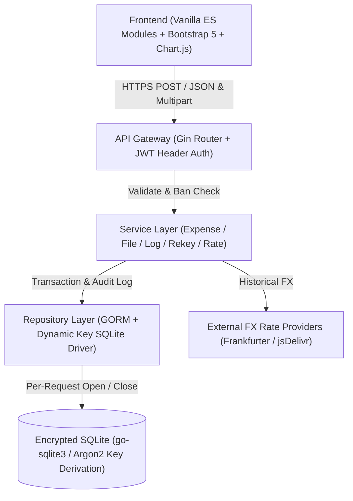

# jotcash

[English](README.md) | [简体中文](README_zh.md)

> A private, single-user expense tracker with full-database encryption, zero-session persistence, and an interactive in-browser mock trial mode.

[](https://cellargalaxy.github.io/jotcash/)
[](https://goreportcard.com/report/github.com/cellargalaxy/jotcash)
[](LICENSE)

---

## 🌟 Overview & Core Philosophy

**jotcash** is designed for personal expense tracking with uncompromising privacy and precision. It focuses strictly on expense records, eliminating the overhead of balance sheets, multi-user permissions, and remote server session storage.

### 🛡️ Core Invariants

1. **Single-User, Single-Instance, Dockerized**: No user table or multi-tenant complexity. Physical access and encryption define the security boundary.
2. **Password IS the Key (Full Database Encryption)**: SQLite database files are fully encrypted at rest using `github.com/ncruces/go-sqlite3`. The encryption key is derived on the fly per request. The key is never cached across requests, never stored in memory persistently, and never written to disk. **Losing your password means irrevocable data loss**.
3. **Zero-Session Architecture**: No login tokens, cookies, or JWTs stored in the database. Credentials live exclusively in the browser tab's `sessionStorage` (wiped immediately upon closing the tab). Each request transmits credentials via encrypted headers; the server derives the key, opens the database, executes the operation, closes the database, and immediately drops the key.
4. **Expense-Only & Refund Support**: Only tracks expenditure. Allows zero and negative amounts for refunds, compensations, and corrections.
5. **Irreversible Soft Delete**: Expenses can be soft-deleted (permanent end-state). File blobs and audit logs are append-only and cannot be deleted.
6. **Immutable Audit Trail**: All state-modifying database operations record an audit log with human-readable summaries and JSON field-level before/after diffs.

---

## 🚀 Try It Now (In-Browser Mock Mode)

The frontend contains a complete in-browser database engine (`static/js/mock.js`) preloaded with ~60 realistic transactions, duplicate warnings, multi-currency records, amortizations, audit logs, and file attachments. You can explore the full UI, statistics, duplicate detection, and editing capabilities **without deploying the backend or creating a database**.

### How to Use Mock Mode

1. On the unlock screen, select the **mock 试用 (Mock Trial)** radio option under **解锁模式 (Unlock Mode)**.
2. In mock mode, password authentication is bypassed—enter any non-empty text for both server and client passwords (e.g., `mock` and `mockmock123456`).
3. Click **解锁 (Unlock)** to enter the preloaded interactive workspace. All operations run purely in browser memory; refreshing the page resets the dataset.

### How to Access `index.html`

- **Option 1: Live Demo on GitHub Pages (Instant Click & Try)**
  Visit the live hosted static demo:
  👉 **[https://cellargalaxy.github.io/jotcash/](https://cellargalaxy.github.io/jotcash/)**
  On the unlock screen, select **mock 试用 (Mock Trial)**, type any password, and click **Unlock**!

- **Option 2: Local Static Server (Zero Go / Docker dependencies)**
  Clone the repository and serve the `static/` directory using any local HTTP server:
  ```bash
  # Clone the repository
  git clone https://github.com/cellargalaxy/jotcash.git
  cd jotcash

  # Run ANY of the following commands:
  python3 -m http.server 8080 -d static     # Python 3
  # or: npx serve static                   # Node.js
  # or: docker run --rm -p 8080:80 -v "$PWD/static:/usr/share/nginx/html:ro" nginx:alpine
  ```
  Open `http://localhost:8080` in your browser, switch to **mock 试用**, and unlock.

- **Option 3: In a Running Jotcash Instance**
  When running a real Jotcash backend, navigate to `http://localhost:7678/static/index.html`. On the unlock card, select **mock 试用 (Mock Trial)** to test features safely in memory without touching your production database.

---

## ✨ Features

- **Batch CSV Import**:
  - Built-in standard 11-column CSV format with BOM detection.
  - Automatic format detection for **China Merchants Bank (CMB) debit** and **ICBC credit** card statements.
  - Batch verification view highlighting newly inserted rows and matching database entries.
- **Inline Table Editing & Optimistic Locking**:
  - Double-click any editable cell to modify directly in the table.
  - Built-in combobox for quick category and currency selection.
  - Version-based optimistic locking (`version`) prevents concurrent overwrites.
- **Heuristic Duplicate Detection**:
  - Automatically identifies and groups transactions sharing the same `(Expense Date, Amount, Currency)`.
  - Color-coded borders and warning badges highlight potential duplicate entries for manual review.
- **Multi-Currency & Automatic Exchange Rates**:
  - Auto-fetches historical exchange rates using Frankfurter API (`api.frankfurter.dev`) with jsDelivr fallback (`@fawazahmed0/currency-api`).
  - Supports automatic weekend date alignment to previous trading day.
  - Global accounting currency switching with transactional batch re-conversion.
- **Expense Amortization (Dual Perspective)**:
  - Supports spreading large lump-sum expenses (e.g., insurance, annual rent, hardware) across 1 to N months.
  - Interactive statistic charts support toggling between **Accounting Cash Flow** and **Amortized Monthly Share**.
- **Interactive Visualizations**:
  - Monthly bidirectional stacked bar charts (positive expenses & negative refunds).
  - Category breakdown doughnut charts.
  - Top 10 counterparties horizontal bar charts.
  - Monthly trend comparison line charts.
  - Theme-aware Chart.js integration (seamlessly adapts to Light/Dark mode).
- **Content-Addressed File Storage**:
  - Uploaded statements and snapshots are stored in `file_blob` keyed by SHA-256 hash (automatic deduplication).
  - Built-in CSV table preview and integrity-verified downloads.
- **Security & Hardening**:
  - Brute-force protection: in-memory consecutive failure counter blocks requests after 5 failed attempts for 5 minutes.
  - Atomic database rekeying, backup, and restore.
  - Automatic session timeout locking (5m / 15m / 30m / 1h / Never).
  - Follows OS system Light/Dark theme preferences.
  - Full bilingual internationalization (English & 简体中文).

---

## 🛠️ Architecture & Tech Stack



### Backend
- **Language**: Go 1.27+
- **Web Framework**: [Gin](https://github.com/gin-gonic/gin)
- **ORM & Driver**: [GORM](https://gorm.io/) with [`github.com/ncruces/go-sqlite3`](https://github.com/ncruces/go-sqlite3) (SQLite encryption support)
- **Precision Arithmetic**: [`github.com/shopspring/decimal`](https://github.com/shopspring/decimal)
- **Task Scheduler**: [`github.com/robfig/cron/v3`](https://github.com/robfig/cron/v3)
- **Currencies**: [`github.com/bojanz/currency`](https://github.com/bojanz/currency)

### Frontend
- **Zero Build Step**: Pure Vanilla JavaScript with native ES Modules.
- **UI Framework**: Bootstrap 5.3 (Dark / Light mode).
- **Charts**: Chart.js 4.4 + chartjs-plugin-datalabels.
- **Math**: Decimal.js for arbitrary-precision in-browser calculations.
- **Storage**: All credentials strictly in `sessionStorage`.

---

## 📦 Deployment & Installation

### Method 1: Using `install-docker.sh` (Recommended)

Jotcash provides an automated installation script that handles user permissions, container volume mapping, and timezone configuration:

```bash
# Run interactive installer
bash install-docker.sh

# Or run with CLI arguments non-interactively:
bash install-docker.sh \
  --server_name jotcash \
  --listen_port 127.0.0.1:7678 \
  --resource /opt/jotcash/resource \
  --timezone Asia/Shanghai
```

### Method 2: Standard Docker Run

```bash
# Build the Docker image
docker build -t jotcash .

# Run container with a persistent volume for database and configs
docker run -d \
  --name jotcash \
  --restart unless-stopped \
  -p 127.0.0.1:7678:7678 \
  -v jotcash_resource:/resource \
  -v jotcash_log:/log \
  jotcash
```

### Method 3: Compile Binary Locally

Use `build-docker.sh` to produce a Linux binary matching the Alpine deployment environment:

```bash
bash build-docker.sh -o ./
./jotcash
```

---

## 🔑 First-Time Setup & Unlocking

1. **Retrieve Initial Server Password**:
   When Jotcash starts for the first time with an empty resource volume, it automatically generates a high-entropy password and logs it **once**:
   ```bash
   docker logs jotcash | grep "后端口令"
   # or check log/jotcash/log.log
   ```
   > ⚠️ **IMPORTANT**: This initial password is printed only once. Keep it safe.

2. **Access Web Interface**:
   Open `http://localhost:7678/static/index.html` (or through your reverse proxy).

3. **Unlock**:
   - **Unlock Mode**: Choose **真实后端 (Real Backend)**.
   - **Server Password**: Paste the generated server token from the startup log.
   - **Client Password**: Enter your client master password (minimum 12 characters, cannot be purely numeric or alphabetic).
   - **Accounting Currency**: Select your primary currency (e.g. `CNY`, `USD`, `EUR`).
   - Click **Unlock**.

---

## 📋 CSV Import Contract

The system CSV import contract uses the following column headers (order is fixed, UTF-8 encoded, BOM supported):

| Column Name | Required | Example | Description |
| :--- | :---: | :--- | :--- |
| **银行名称** | No | 招商银行 | Bank name |
| **卡号后四位** | No | 8821 | Last 4 digits of card |
| **支出日期** | **Yes** | 2026-03-15 | Transaction date (`YYYY-MM-DD`) |
| **支出币种** | **Yes** | USD | 3-letter ISO currency code |
| **支出金额** | **Yes** | 89.90 | Transaction amount (positive or negative) |
| **交易对手方** | No | Apple Store | Merchant or payee |
| **交易备注** | No | iCloud Subscription | Transaction remarks |
| **折算汇率** | No | 7.125000 | Exchange rate to accounting currency. If blank, auto-fetched |
| **记账币种** | No | CNY | Target accounting currency. Must match request if rate specified |
| **支出类型** | No | 订阅服务 | Custom expense category / tag |
| **摊销月数** | No | 12 | Number of amortization months (default: 1) |

Sample CSV template:
```csv
银行名称,卡号后四位,支出日期,支出币种,支出金额,交易对手方,交易备注,折算汇率,记账币种,支出类型,摊销月数
招商银行,8821,2026-01-15,CNY,68.00,星巴克,咖啡,,CNY,餐饮,1
工商银行,1234,2026-02-01,USD,1200.00,Apple Store,MacBook Pro,7.125000,CNY,数码硬件,12
```

---

## ⚙️ Configuration (`resource/jotcash.yaml`)

```yaml
server_token: "<auto-generated-token>"  # Backend validation token
db_backup_cron: "0 4 * * *"           # Daily automated database backup (4:00 AM)
db_backup_limit: 5                    # Retain last 5 backup snapshots
expense_file_limit: 10485760          # 10 MB maximum import CSV size
import_file_limit: 1073741824         # 1 GB maximum database restore size
amount_scale: 2                       # Decimal precision (default: 2)
token_fail_limit: 5                   # Max consecutive password failures
token_ban_minute: 5                   # Ban duration in minutes after fail limit
```

---

## 🧪 Testing

```bash
# Run all Go unit & integration tests
go test ./config ./corn ./handler ./model ./rdb ./service/expense/base_csv ./service/expense/cmb_debit ./service/expense/icbc_credit ./service/repo ./tool -count=1

# Run full frontend headless test suite (195 tests)
sh static_test/run.sh
```

---

## 📄 License

This project is licensed under the MIT License.