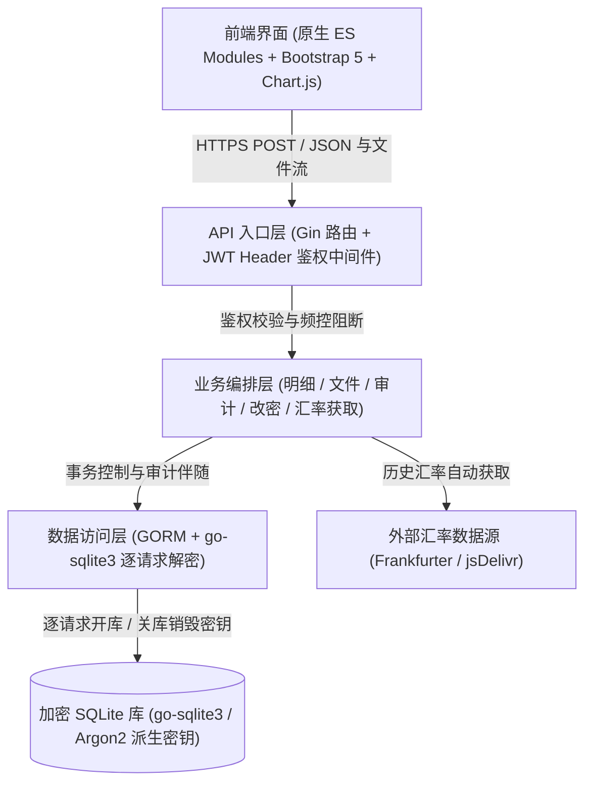

# jotcash

[English](README.md) | [简体中文](README_zh.md)

> 一款极简、私密、单用户的个人支出记账系统。采用 SQLite 整库加密与零持久化会话设计，内置浏览器端免后端 mock 试用体验。

[](https://cellargalaxy.github.io/jotcash/)
[](https://goreportcard.com/report/github.com/cellargalaxy/jotcash)
[](LICENSE)

---

## 🌟 定位与核心设计哲学

**jotcash** 专为个人自用支出记账打造，追求纯粹的数据主权与极致的隐私边界。本系统**只记支出**，彻底剔除资产负债、账户余额、多用户权限及复杂的对账概念，将重心聚焦于：**明细长期留存、疑似重复核对、多币种自动折算与大额支出摊销**。

### 🛡️ 六大核心不变式

1. **单用户、单实例、容器化部署**：无用户表、无租户划分，数据库文件的物理加密本身构成唯一的安全访问边界。
2. **口令即密钥（整库加密）**：SQLite 数据库依托 `github.com/ncruces/go-sqlite3` 实现整库加密；密钥由口令现场派生。服务端**不存储口令、不跨请求缓存密钥、不落盘**。**口令一旦丢失，数据永久不可逆损坏，不设任何找回途径**。
3. **零会话持久化**：服务端不记录登录态、不发放数据库 Token。浏览器端两把口令（后端口令与前端口令）仅存于标签页的 `sessionStorage`，标签页关闭即刻焚毁。每个请求在请求头动态携带凭据；服务端派生密钥 → 打开数据库 → 读写 → 关库并丢弃密钥。
4. **只记支出，包容冲正与退款**：金额以正数为常态，允许 0 与负数（用于退款冲正与平账）。
5. **单向不可逆软删除**：明细只有软删除（记录删除时间，终态不可逆，恢复需复制新增）；原始文件与审计记录只增不减，永久留痕。
6. **全链路审计留痕**：所有能打开数据库的写操作均写入 8 类操作审计，记录前后值字段级 JSON 差异，仅供历史追溯，不耦合业务逻辑。

---

## 🚀 免安装体验（浏览器 Mock 试用模式）

前端内置了完整的纯客户端数据库引擎（`static/js/mock.js`），预置了近 60 笔覆盖多批次、疑似重复、跨币种、摊销、负数退款、文件快照及审计留痕的真实演示数据。**无需启动后端服务、无需配置数据库**即可直接运行与体验全部功能。

### 如何使用 Mock 模式

1. 在解锁界面中，将「**解锁模式**」单选框切换至 **mock 试用**。
2. Mock 模式下免除鉴权校验——后端口令与前端口令任意填写非空内容（例如后端口令填 `mock`，前端口令填 `mockmock123456`）。
3. 点击「**解锁**」进入交互式工作区。全部数据与操作均在浏览器内存中运行，刷新页面即复位。

### 如何打开 `index.html` 体验

- **途径一：GitHub Pages 在线直达（推荐，点击即开）**
  直接访问本项目托管在 GitHub Pages 的在线静态演示页面：
  👉 **[https://cellargalaxy.github.io/jotcash/](https://cellargalaxy.github.io/jotcash/)**
  在解锁界面中勾选「**mock 试用**」，口令任意填写（如 `mock` / `123456`），点击「**解锁**」即可体验！

- **途径二：本地静态 Web 服务器（无需 Go / Docker 依赖）**
  克隆代码后，使用本机任意静态 HTTP 服务器托管 `static/` 目录即可：
  ```bash
  # 克隆仓库
  git clone https://github.com/cellargalaxy/jotcash.git
  cd jotcash

  # 任选以下一条单行命令运行：
  python3 -m http.server 8080 -d static     # Python 3
  # 或: npx serve static                   # Node.js
  # 或: docker run --rm -p 8080:80 -v "$PWD/static:/usr/share/nginx/html:ro" nginx:alpine
  ```
  浏览器访问 `http://localhost:8080`，选择「mock 试用」并解锁即可。

- **途径三：在已部署的服务中切至 Mock 模式**
  在正式运行的 Jotcash 实例中，浏览器访问 `http://localhost:7678/static/index.html`，在解锁卡片中勾选 **mock 试用**，即可在不触碰正式数据库的前提下安全演练。

---

## ✨ 核心功能一览

- **CSV 批量入库与原生账单识别**：
  - 系统内置 11 列标准 CSV 契约，支持 UTF-8 与 BOM。
  - 原生支持**招商银行借记卡**、**工商银行信用卡**账单格式的自动检测与解析。
  - 入库后直通「批量核实视图」，按支出三要素（日期 + 金额 + 币种）高亮呈现本批次与库内存量明细。
- **表格行内即时编辑与乐观锁并发保护**：
  - 列表页双击任意单元格即可原地编辑，支持多列同时编辑。
  - 支出类型与支出币种配备智能组合框（输入联想与下拉选择）。
  - 内置 `version` 乐观锁机制，并发保存冲突时严谨提示。
- **疑似重复智能高亮**：
  - 基于「支出日期 + 支出金额 + 支出币种」三要素等值自动聚类高亮，辅助人工核对双重记账。
- **多币种折算与历史汇率自动化**：
  - 优先通过 Frankfurter API（`api.frankfurter.dev`）获取交易发生日历史汇率，备选 jsDelivr（`@fawazahmed0/currency-api`）。
  - 周末非交易日自动回滚至前序交易日（周五）。
  - 支持一键执行「记账币种全库切换」，带事务逐笔更新。
- **大额支出分期与摊销（双重视角统计）**：
  - 支持将年付保险、大件硬件、长期订阅按 1~N 个月分摊。
  - 统计页支持在「摊销金额」与「记账金额」双重视角间自由切换。
- **多维统计图表联动**：
  - 月度收支双向堆叠柱状图（正向支出与负向退款分流）。
  - 支出类型占比环形图、交易对手方 Top 10 横向排行图。
  - 记账口径 vs 摊销口径月度合计走势对比折线图。
  - 深度适配明暗主题，Chart.js 配色自动响应系统偏好。
- **文件去重寻址与完整性检验**：
  - 账单文件与快照存储基于 SHA-256 内容寻址（`file_blob` 自动去重）。
  - 提供文件列表筛选、浏览器内 CSV 表格预览与校验下载。
- **全方位安全加固**：
  - 内存级防爆破机制：连续输错 5 次口令触发全局封禁 5 分钟。
  - 数据库热备份、改密（原子备份-改密-替换）、全量导出与校验导入。
  - 闲置无操作自动锁定会话（支持 5分 / 15分 / 30分 / 1小时 / 从不）。
  - 完整的中英双语切换（English / 简体中文）。

---

## 🛠️ 技术架构



### 后端技术栈
- **核心语言**：Go 1.27+
- **Web 框架**：[Gin](https://github.com/gin-gonic/gin)
- **ORM 框架**：[GORM](https://gorm.io/) + [`github.com/ncruces/go-sqlite3`](https://github.com/ncruces/go-sqlite3)（驱动层 SQLite 整库加密）
- **高精度算术**：[`github.com/shopspring/decimal`](https://github.com/shopspring/decimal)
- **定时调度**：[`github.com/robfig/cron/v3`](https://github.com/robfig/cron/v3)

### 前端技术栈
- **零构建流程**：现代纯原生 JavaScript（Native ES Modules），无需 Node.js 打包或编译步骤。
- **样式体系**：Bootstrap 5.3（深度适配 Dark / Light 主题）。
- **图表引擎**：Chart.js 4.4 + datalabels 插件。
- **本地计算**：Decimal.js 实现浏览器端高精度金额与摊销份额运算。
- **凭据隔离**：会话凭据完全隔离在 `sessionStorage`。

---

## 📦 安装与部署

### 方式一：使用一键安装脚本 `install-docker.sh`（推荐）

交互式向导会自动处理宿主机权限映射（UID/GID）、时区同步与数据卷持久化：

```bash
# 交互式启动安装
bash install-docker.sh

# 或通过命令行参数静默安装：
bash install-docker.sh \
  --server_name jotcash \
  --listen_port 127.0.0.1:7678 \
  --resource /opt/jotcash/resource \
  --timezone Asia/Shanghai
```

### 方式二：标准 Docker 命令部署

```bash
# 构建镜像
docker build -t jotcash .

# 启动容器并挂载数据卷与日志目录
docker run -d \
  --name jotcash \
  --restart unless-stopped \
  -p 127.0.0.1:7678:7678 \
  -v jotcash_resource:/resource \
  -v jotcash_log:/log \
  jotcash
```

### 方式三：本地编译二进制部署

使用仓库提供的 `build-docker.sh` 脚本，可无缝交叉编译出与 Alpine 容器环境严格一致的静态可执行文件：

```bash
bash build-docker.sh -o ./
./jotcash
```

---

## 🔑 首次初始化与解锁指引

1. **获取随机生成的初始口令**：
   当数据卷中无数据库文件时，Jotcash 在首次启动阶段会在内存中生成高强度口令，并**仅在日志中打印一次**：
   ```bash
   docker logs jotcash | grep "后端口令"
   # 或查看 log/jotcash/log.log
   ```
   > ⚠️ **重要警告**：初始后端口令仅此一次输出，进程重启不再重打。务必第一时间记录，错过只能删库重建。

2. **进入 Web 界面**：
   浏览器打开 `http://localhost:7678/static/index.html`（建议置于 HTTPS 反代之后）。

3. **解锁会话**：
   - **解锁模式**：选择「真实后端」。
   - **后端口令**：填入上述日志中输出的后端口令。
   - **前端口令**：设置你的前端口令（长度 ≥ 12 位，且不得为纯数字或纯字母）。
   - **记账币种**：指定主记账币种（如 `CNY`、`USD`）。
   - 点击「解锁」完成身份校验并开启会话。

---

## 📋 CSV 导入契约格式

标准系统 CSV 模板要求固定 11 列（按列名匹配，UTF-8 编码）：

| 列名 | 必填 | 示例 | 字段说明 |
| :--- | :---: | :--- | :--- |
| **银行名称** | 否 | 招商银行 | 扣款或账户所属银行机构 |
| **卡号后四位** | 否 | 8821 | 交易卡号后 4 位 |
| **支出日期** | **是** | 2026-03-15 | 交易发生日期（格式：`YYYY-MM-DD`） |
| **支出币种** | **是** | USD | 3 位标准 ISO 币种代码 |
| **支出金额** | **是** | 89.90 | 实际发生金额（允许正数、0、负数退款） |
| **交易对手方** | 否 | Apple Store | 商户或交易接收方 |
| **交易备注** | 否 | iCloud 订阅 | 明细补充备注 |
| **折算汇率** | 否 | 7.125000 | 留空则系统自动查询历史汇率；有值优先采用 |
| **记账币种** | 否 | CNY | 填了汇率则必填，必须与当前会话一致 |
| **支出类型** | 否 | 软件订阅 | 自由标签分类，自动去重聚合下拉候选 |
| **摊销月数** | 否 | 12 | 费用分摊月数（留空默认为 1） |

CSV 样例数据：
```csv
银行名称,卡号后四位,支出日期,支出币种,支出金额,交易对手方,交易备注,折算汇率,记账币种,支出类型,摊销月数
招商银行,8821,2026-01-15,CNY,68.00,星巴克,拿铁咖啡,,CNY,餐饮,1
工商银行,1234,2026-02-01,USD,1200.00,Apple Store,MacBook Pro,7.125000,CNY,数码硬件,12
```

---

## ⚙️ 服务端配置项 (`resource/jotcash.yaml`)

```yaml
server_token: "<自动生成的后端口令>"   # 服务端请求鉴权口令
db_backup_cron: "0 4 * * *"          # 数据库自动快照备份定时任务（每天凌晨 4:00）
db_backup_limit: 5                   # 最多保留备份快照份数
expense_file_limit: 10485760         # 单个 CSV 导入文件大小上限（10MB）
import_file_limit: 1073741824        # 数据库导入文件大小上限（1GB）
amount_scale: 2                      # 记账金额保留小数位数（默认 2 位）
token_fail_limit: 5                  # 口令尝试连续失败触发锁定的次数
token_ban_minute: 5                  # 触发锁定后的封禁时长（分钟）
```

---

## 🧪 测试与质量验证

```bash
# 运行后端单元测试与集成测试
go test ./config ./corn ./handler ./model ./rdb ./service/expense/base_csv ./service/expense/cmb_debit ./service/expense/icbc_credit ./service/repo ./tool -count=1

# 运行前端无头自动化测试套件（195 条全量用例）
sh static_test/run.sh
```

---

## 📄 开源许可证

本项目基于 [MIT License](LICENSE) 协议开源。
