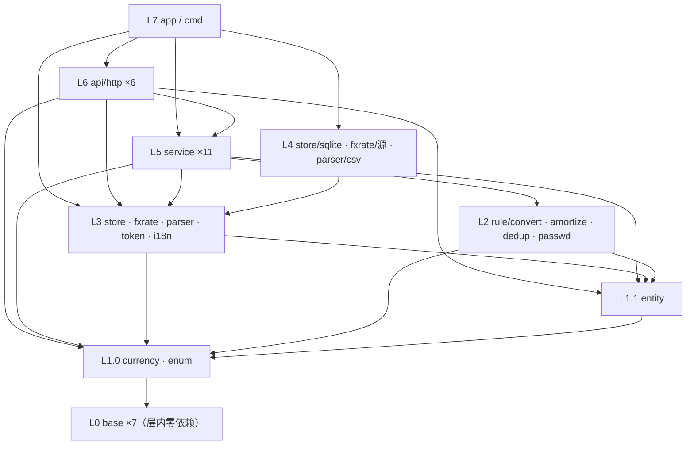
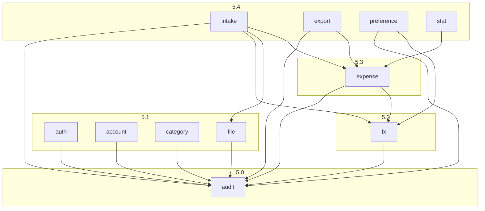
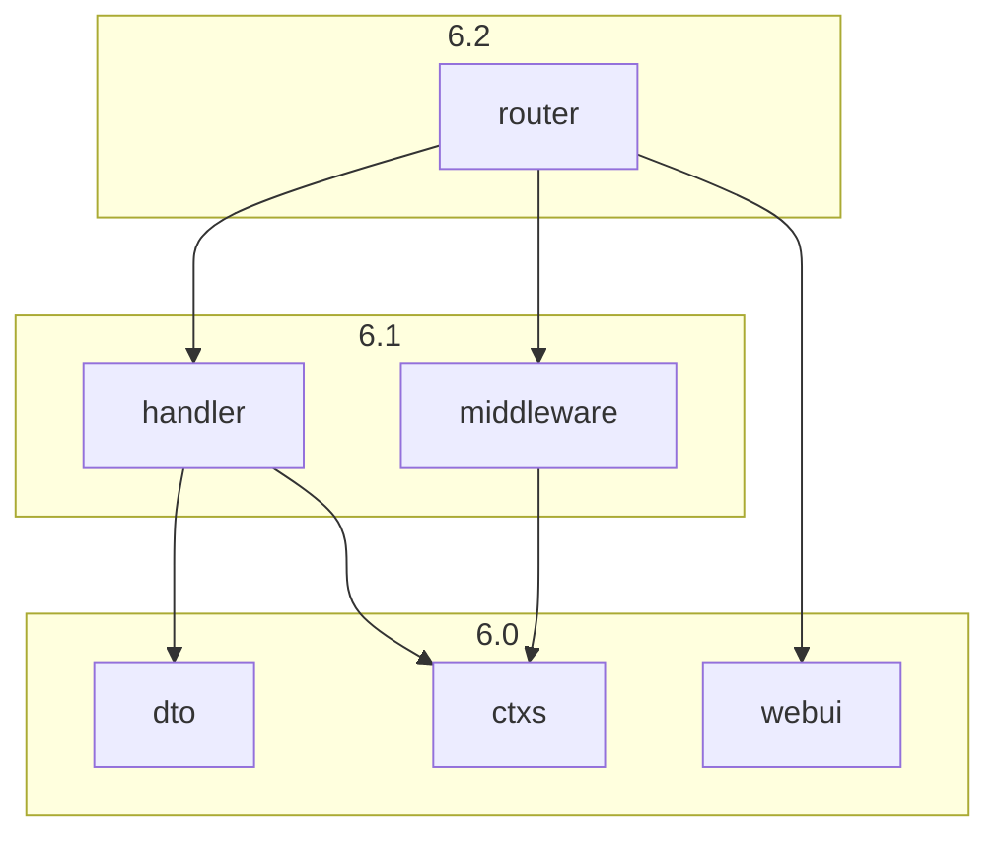

# 对话7 · 复核结论与修订版完整方案

> 依据来源：本文件对话1~6 全文（重点复核对话6 §五~§十三）；`doc/decisions/记账系统功能与模型.md`（下称「终版」）§一前提 1~8、§二 11 域 57 项、§四 62 属性、§五 1~3、§六、§七、§八 8.1~8.5、§九 4 条不变式、§十 6 条流程、§十一 T4；`260903-201810-prompt.md` 对话7 段新增的 **2 项决策**（T38、T39）。
> 代码侧：仓库仍只有 `go.mod`（module `github.com/cellargalaxy/jotcash`，go 1.27.0）、`README.md`、`doc/`，无任何实现，本轮为设计校对与决策回写，无存量影响。
> **结论：8 层 41 包的骨架继续成立——无环、可逐包实现，不推翻。查出 6 处实际问题，已全部修复。包数 41 → 41、层数 8 → 8，目录树零改动。**
> **T38 / T39 落定后，T33~T39 七项全部有解——本轮起「阻塞性未决项：无」，阶段 1~11 可依序开工。**
> **§五 起为修订后的完整方案，取代对话6 的 §五~§十三；对话1~6 保留作推导留痕。**

---

## 一、四问的检查结论

| 检查项 | 判定 | 说明 |
| ------ | ---- | ---- |
| 包的依赖关系与层级关系 | **无环成立，2 处口径自相矛盾** | 逐包核对无跨层上行边；但 **`base/pwdhash` 承载写「安全随机串供 `base/idgen` 取随机性」，而 `idgen` 依赖列是 `—`、L0 表头又写「仅依赖标准库与第三方库」**——同一件事三处说法互斥；**L6 存在 `router → handler/middleware/webui`、`handler → dto/ctxs` 等层内边**，而全局规则是「层内包互不依赖」，L5 用 5 个显式子层解决了，L6 只在对话6 交付说明里一句「不构成层内环」带过，分层总表无排序、实施顺序阶段 11 也没有内部次序 |
| 包的职责划分与承载内容 | **骨架对，2 处会静默算错 / 写不出来** | ① **`rule/convert` 把舍入基准写死为 2 位**（`round(金额 × 汇率, 2, 四舍五入)`），与同表 `rule/amortize` 强调的「按币种小数位数均分」直接冲突——本位币为 0 位币种（JPY）时会产出该币种不存在的面额，且摊分基准与存储基准必然对不齐；② **`store` ③ 只有「写删除时间」，没有按筛选条件的批量软删除口径**，而 F-8 明写支持「全选当前筛选结果全集」，照此只能把全集 ID 拉进内存，与同一张表里的游标迭代、聚合下推、查重候选批量匹配三处性能取向自相矛盾 |
| 功能缺漏 / 承载内容描述错误 | **57 项无缺漏，2 处不实** | ① **终版前提 6「本位币金额是只读因变量、无人工指定入口」全方案无落点**——§九 反向校验表列了前提 3/7/8，独缺前提 6；T34 定案为前后端分离后，`dto` 是唯一能拦住「客户端直接提交本位币金额」的闸门，这一条不写死等于恒等式可被绕开；② **`middleware` 的三道校验挂载范围未定**，与 T34③「401 不做服务端跳转、跳登录页由前端执行」正面冲突——若按承载字面「全局登录态校验」挂载，未登录时连登录页的静态资源都会被 401 拦掉，前端根本进不来 |
| Go 仓库结构 | **0 处错** | 目录树、三 embed 一运行时的物理位置、端口包与实现子包的父子关系、九条约定均无误；本轮全部修复只改承载与层内排序，**目录树逐行比对无需改动** |

---

## 二、两项新决策的落地口径

> 来源：`prompt.md` 对话7 段。落地只改承载，**不改分层方向、不新增跨层边、不增删包**。

| 编号 | 决策 | 落到哪个包 | 具体口径 |
| ---- | ---- | ---------- | -------- |
| **T38** | **`currency` 枚举把本位币候选限定为小数位 ≤ 2 的币种**（本仓库中长期只实现常见场景币种） | `currency`、`service/preference`、`rule/convert` | ① `currency` 除「是否启用」外**再出一个判据：是否可作本位币**（`小数位数 ≤ 2` 且已启用），并对外提供**本位币候选集**（供 K-1 下拉）与**单值校验**；② **只约束本位币，不约束支出币种**——KWD（3 位）等仍可作 `支出币种` 正常记账与摊分（终版 I-2 只对本位币作用户级配置）；③ `service/preference` 的 K-1 本位币切换**校验的是候选集而非全量币种**，非候选一律拒绝；④ 直接后果：**本位币小数位 ∈ {0,1,2} 恒成立**，「按本位币小数位舍入」的结果必然能被「2 位小数存储」无损容纳——这是 §三 问题 1 得以闭合的前提；⑤ 默认本位币 CNY（2 位）在候选集内，A-1 初始化不受影响 |
| **T39** | **`折算汇率` 存储精度与小数位 = 8 位小数** | `base/decimal`、`rule/convert`、`store` 列口径、`store/sqlite` | ① `base/decimal` 定死**汇率精度常量：8 位小数、四舍五入**（舍入方式沿用 T35 已定口径，全仓库唯一的舍入实现仍在本包）；② **规整点唯一**：`rule/convert` 作为不变式 1a 的唯一实现处，在做乘法前先把入参汇率规整到 8 位，**其输出三元组中的「折算汇率」即规整后的值，落库以它为准**——自动获取（`fxrate` 返回值精度不设限）与 I-5 用户手填两条入口因此共用同一个规整点，不会出现「库里存着 12 位、算的时候用 8 位」；③ `store` 的汇率列口径为 8 位定点，`store/sqlite` 按「整数最小单位或定点文本」落地（禁 REAL）；④ 与终版 8.1「已知代价」的关系：8 位足以让 I-5 手填汇率把本位币金额逼近到分位，该条代价保留但不再是精度瓶颈 |

> 两项决策合并后的效果：**不变式 1a 的三个数值口径全部封闭**——支出金额按 `currency.小数位数`、折算汇率 8 位、本位币金额按本位币小数位（≤2）算、按 2 位存。阶段 1 的 `base/decimal` 与阶段 3 的 `rule/convert` 不再有任何待确认输入。

---

## 三、已修复的问题（6 项）

| # | 位置 | 问题 | 修法（已并入 §五 起的方案） |
| - | ---- | ---- | -------------------------- |
| 1 | `rule/convert` · 舍入基准 | 承载写死 `本位币金额 = round(支出金额 × 折算汇率, 2, 四舍五入)`。但**「存储精度」与「舍入基准」是两件事**——这正是同一张表里 `rule/amortize` 特意标注的那条（「按币种小数位数均分，**不是 T35 的 2 位**」）。本位币为 JPY（0 位）时，`round(…, 2)` 会算出 `200.20 JPY` 这种该币种不存在的面额；紧接着 8.2 要按 JPY 的 0 位均分这个带小数的总额，尾差归末月也归不平。**属「算错就静默出错」且两包口径互相打架** | 拆开两层：**舍入基准 = 本位币的 `currency.小数位数`**（T38 已保证 ∈ {0,1,2}），**存储精度 = 2 位定点列**（T35 字面口径，0/1 位结果存进 2 位列必然无损）。CNY 场景与原写法完全等价，JPY 等场景才有差异。§九 不变式 1a 行、`base/decimal`、`store` 列口径同步改写。**冲突登记**：T35 原文「保留两位小数」按「存储精度」理解；若坚持按字面理解为「一律舍入到 2 位」，则须接受 0/1 位本位币出现该币种不存在的面额、且与 8.2 均分基准不一致——本轮采用前者 |
| 2 | `base/idgen` / `base/pwdhash` · L0 层内边 | 三处说法互斥：`pwdhash` 承载写「安全随机串……**供 `base/idgen` 取随机性**」，`idgen` 的依赖列却是 `—`，L0 表头又写「**仅依赖标准库与第三方库**」。真按承载写就多出一条 L0 层内边，且语义别扭——ID 生成的随机性挂在「密码哈希包」下，与约定 5「`base/` 是纯技术层」的分工取向相反 | `base/idgen` 的随机性**直接取标准库密码学随机源**，不依赖 `base/pwdhash`；`pwdhash` 的安全随机串**只供 `rule/passwd` 采样初始密码**（A-2）。**L0 恢复层内零依赖**，7 个包的依赖列一律 `—` 名副其实 |
| 3 | `store` ③ · 批量软删除 | 承载只有「`Expense` 只有「写删除时间」（已删除行跳过、幂等）」。但终版 F-8 明写批量删除「**也支持全选当前筛选结果全集**」，F-4 的筛选集可以是全库量级。照现口径 `service/expense` 只能「先按筛选取全集 ID → 逐条/分批写删除时间」，把全集装进内存——与同一张表里刚立的三处性能口径（游标迭代、J 域聚合下推、查重候选批量匹配）取向自相矛盾 | 承载 ③ 补一条：**按筛选条件批量写删除时间**——复用 ④ 的 F-4 筛选条件类型（同一套口径，保证「所删即所见」与 F-6 合计对得上），**已删除行不覆盖其 `删除时间`**（终版 F-8），**返回实际受影响笔数**供审计摘要记「N 笔」。逐笔删除保留为同一方法的退化调用 |
| 4 | 全局 · 前提 6 | 终版前提 6「**本位币金额是只读因变量，恒等于「支出金额 × 折算汇率」，无人工指定入口**」——8 条前提里，前提 3（对话6 补）、前提 7（对话5 补）、前提 8（对话2 补）都已进 §九 反向校验表，**独缺前提 6**。计算侧由不变式 1a 兜住了，但**入口侧无人负责**：T34 已定前后端分离，`dto` 是外部可控的 JSON 契约，客户端完全可以在更新请求里塞 `本位币金额`，服务端若照单收下，恒等式在库里当场破裂 | §九 反向校验表**新增前提 6 一行**，唯一实现处定为 `api/http/dto`；`dto` 承载补死：**明细写请求（D-7 提交、F-5 保存）的可写字段全集 = F-1 八项**，四项只读派生（`本位币金额`/`折算本位币币种`/`摊分起始月`/`摊分结束月`）与十项系统只读字段**不得出现在任何写请求 dto 的定义中**——不是「收到后忽略」，是结构里根本没有这个字段 |
| 5 | `api/http/middleware` · 挂载范围 | 承载写「A-6 **全局**登录态校验（除登录接口）」，`router` 又写「`/api/` 前缀交 `handler`，其余交 `webui`」。T34③ 已定「A-6 失效返 401、**跳登录页由前端执行**」——那么未登录用户必须先能**加载到前端**。两条承载合起来按字面实现：静态资源请求也走登录态校验 → 未登录时 `index.html` 就返 401 → 前端永远加载不出来、也就永远没人去执行那个跳转。**前后端分离下的死锁，且是照此写必踩** | `middleware` 承载定死**三道校验的挂载范围**：登录态（A-6）、强制改密拦截（A-2）、管理员校验（A-7）**只挂在 `/api/` 路由组**，其中**登录接口与语言包接口（`handler/i18n`）为组内白名单**；`webui` 的静态资源与 SPA 回退**不经这三道校验**（前提 1 下前端产物无敏感数据，数据一律经 `/api/` 取且逐个接口校验）。**语言解析与请求日志仍全局挂载**——登录页也要有文案。`router` 承载同步写明「两组中间件链」 |
| 6 | L6 层内排序 | 全局规则是「上层依赖下层、**层内包互不依赖**」（对话1 §2.1，是「树状结构」的可执行等价物），L5 为此拆了 5 个显式子层。但 L6 实际存在 `router → handler`、`router → middleware`、`router → webui`、`handler → dto`、`handler → ctxs`、`middleware → ctxs` 六条层内边，分层总表无排序、只在对话6 交付说明里一句「不构成层内环」带过；连带后果是**实施顺序阶段 11「`api/http/*` 6 包 → `app`」没有内部次序**，与「逐个包单独完整实现」的交付要求对不齐 | L6 **显式分 3 个子层**（与 L5 同构，同一子层内互不依赖）：**6.0** `ctxs` / `dto` / `webui` → **6.1** `middleware` / `handler` → **6.2** `router`。分层总表加子层列、依赖图加一张 L6 内部图、阶段 11 按子层分述。**不新增包、不改依赖方向**，只是把已经成立的偏序写出来 |

> 另有 3 处描述性修正随方案回写，不单列为问题：① 对话6 §十三 校验方式⑩ 写「11 类审计的写入方一一对应到 **8 个** service」，实为 **9 个**（`account` 兼 1/3/4 类、`auth` 2、`file` 5、`intake` 6、`expense` 7、`fx` 8、`category` 9、`preference` 10、`export` 11），本轮订正并在 §九 下方列出对照；② `service/fx` 承载补终版 I-4 的短路判据「**支出币种 = 当前本位币时汇率直接取 1，不调 `fxrate`**」——否则同币种记账每笔都要打一次外部汇率源，且失败时会被 I-5 误判为「转必填」；③ `base/decimal` 的「三处精度口径」随 T35/T38/T39 改写为「原币按币种小数位 / 本位币按本位币小数位算、按 2 位存 / 汇率 8 位」，不再有「待定」项。

---

## 四、未修复的问题

**阻塞性问题：无。** T33~T39 七项决策全部落定，41 个包的承载与依赖列不再有「不确认就写不出来」的项；阶段 1~11 可依序开工。

**已知残留（3 项，均非阻塞，继承自对话4/5，本轮无新增）**——Go 的可见性机制修不掉，只能约定 + 评审兜底：

| # | 残留 | 为什么修不掉 | 缓解 |
| - | ---- | ------------ | ---- |
| R1 | **不变式 4 无编译期兜底**——「禁止任何 service 直接写 `AuditLog` 表」只是约定 | `store` 的 `AuditLog` 仓储必须同时对 `store/sqlite`（实现）与 `service/audit`（调用）可见；`internal/` 只能按目录树收窄，做不到「只对某个兄弟包开放」 | 准则 5 + §九 落点表写死；靠评审与 `import` 检查 |
| R2 | **`User` 仓储的归属做不到签名强制**——5 个仓储里唯一不带归属参数的 | A-1（尚无当前用户）、A-4（按用户名、尚未登录）、A-7（管理员访问他人）三类合法访问天然不带「当前归属用户」，签名一旦强制这三个功能就写不出来 | §九 的三类白名单 + 前提 3 行（4 个归属型仓储无管理员旁路）已把口子收到最小 |
| R3 | **约定 7 / 8 / 9 无编译期兜底** | 事务句柄是 `store` 的导出类型，谁都能构造出「不在事务里」的调用；`base/config`、`base/idgen` 都是普通包，任何包 import 得到 | 与 R1 同类处理。三条 import 类约定里，`ctxs` 那一条已由目录位置转为结构兜底，是唯一能消除的 |

> **T31（I-7 取哪天汇率）/ T32（导出格式）** 由你主动挂起、且都属「写到那个包时自然定」，按本轮要求**不列为问题**，仅在 §十二 扩展预留位登记落位。终版 §十一 的 **T4 自动打标**同理——终版主动挂起（G-3「在此之前解析出的明细类型一律留空」），当前无实现包是设计意图。`fxrate/<源>` 的具体包名随汇率源选定后确定，不影响分层。

---

## 五、七条划分准则

| # | 准则 | 直接来源 |
| - | ---- | -------- |
| 1 | **不变式内聚**：一条不变式只有一处实现，其余包只能调用 | 终版 §九 |
| 2 | **纯规则与 IO 分离**：8.1 折算、8.2 摊分、8.3 查重、A-8 密码策略一律做成**无外部 IO**、可脱库单测的规则包 | 这四处是全系统仅有的「算错就静默出错」的逻辑 |
| 3 | **枚举即代码**：币种、解析器类型建独立包，库中只存代码/键；**枚举项里的「实现」只存标识，实现的注册表在 L3、实现体在 L4** | 终版 §五 1、§五 2。照搬「枚举项含实现」会让 L1 依赖 L3/L4 必成环 |
| 4 | **端口在下、实现在上**：接口与查询口径在 L3，实现在 L4，L4 只被 `app` import 一次；**实现子包按选型命名**（`store/sqlite` / `parser/csv` / `fxrate/<源>`），换选型 = 加平级子包 + 改 `app` 一行 | 支撑「逐个包单独完整实现」：写 L5 时不依赖任何选型 |
| 5 | **审计是基座不是切面**：`service/audit` 位于全部业务服务之下 | 终版 §九 4。做成中间件切面就拿不到审计ID 回填 |
| 6 | **约束优先用结构表达**：前提 8 与不变式 3 尽量落在 `store` 的方法签名上；能用目录位置表达的不写成口头约定（`ctxs` 置于 L6）；能用存储层唯一索引保证的不靠先查后插（`User.用户名`、`ExpenseCategory.(用户, 名称)`）；**能用「字段根本不存在于 dto」表达的不靠运行时忽略**（前提 6 的只读派生字段） | 终版 §一前提 6/8、§九 3、G-1。三处做不到的见 §四 R1/R2/R3 |
| 7 | **规则包不直接对外**：L6 只依赖 L5 与 L6 内部包；凡前端需要的**纯派生试算**（H-4 摊分预览、8.1 本位币金额实时计算），一律由 L5 暴露入口后转调 L2 | 否则要么破坏分层，要么在前端出现第二份均分/折算实现 |

---

## 六、分层总表（8 层 41 包）

> 依赖列只写**直接依赖**；`base/*` 对全仓库、`entity`/`enum`/`currency` 对 L2 及以上属**普遍依赖**，除首次出现外不再重复列出。
> **层内规则**：同层包互不依赖；**L5 与 L6 是仅有的两个例外**，各自以显式子层排序保证无环（L5 五子层、L6 三子层）。

### L0 基础层（7 包）— 零业务语义，仅依赖标准库与第三方库，**层内零依赖**

| 包 | 承载内容 | 依赖 |
| -- | -------- | ---- |
| `base/errs` | 统一错误类型与错误码；**五档**：用户输入错误 / **唯一冲突** / 归属越权 / 未登录 / 系统错误；**每个错误携带文案键与占位参数**，错误对象内不写死面向用户的文案（D-3 五类解析错误、G-1 与 A-7 的重名、L6 全部提示均由 `middleware` 经 `i18n` 渲染，K-4：加语种不改代码） | — |
| `base/log` | 日志；**A-3 的 admin 初始密码一次性打印走此包**——这是全系统唯一把**密码明文写入持久介质**的地方（其余合法出现处见 §九 红线行，均不落盘） | — |
| `base/config` | **仅部署相关参数**：监听地址、SQLite 文件路径、令牌密钥、汇率源端点与密钥、日志级别。**业务阈值不进配置**（令牌 12h 写死在 `token`、失败 5 次与锁定 10 分钟写死在 `service/auth`、Argon2 参数写死在 `base/pwdhash`——终版 A-5/A-8 把它们定义为规则）；**仅被 `app` / `cmd` import**（约定 8） | — |
| `base/idgen` | 5 类实体的唯一标识生成，**全仓库唯一的 ID 来源**（约定 9）；随机性**直接取标准库密码学随机源**，**不依赖 `base/pwdhash`**（L0 层内零依赖）；调用方恰为 5 个创建方：`service/audit`（审计ID）、`service/account`（用户ID）、`service/category`（类型ID）、`service/file`（文件ID）、`service/intake`（明细ID）。`store` 不生成 ID、不依赖自增回填——不变式 4 的「先落审计取 ID → 明细挂载」因此不需要 DB 回传 | — |
| `base/decimal` | 定点小数类型与 `round(值, 位数, 舍入方式)`；**金额一律不用浮点**。**三处精度口径（全部已定，无待确认）**：① **原币金额**按 `currency.小数位数`；② **本位币金额**——**算：按本位币的 `currency.小数位数` 四舍五入**（T38 保证 ≤ 2 位）；**存：2 位定点**（T35，0/1 位结果无损容纳）；③ **折算汇率 8 位小数、四舍五入**（T39） | — |
| `base/calendar` | **不带时区的日历日期类型**（前提 7：账单字面值，解析、存储、归月全程不做时区换算）+ 年月类型 + 区间运算（`起始月 + N − 1`、`起始月 ≤ M ≤ 结束月`）+ **日期 → 所属月** | — |
| `base/pwdhash` | **Argon2id** 哈希与校验（T36）+ 密码学安全随机源。三条口径：**盐独立列存**（终版 §四 `User.盐` 是单列属性，不用自包含哈希串格式）；Argon2 参数（内存/迭代/并行度）**写死在包内常量并带版本前缀**，不进配置；对外另出的「安全随机串」**只供 `rule/passwd` 采样初始密码**（A-2） | — |

### L1.0 枚举层（2 包）— 依赖 L0

| 包 | 承载内容 | 依赖 |
| -- | -------- | ---- |
| `currency` | **币种枚举**：代码、名称、符号、**小数位数**、是否启用、**汇率获取实现的标识**（实现体不在此，由 `fxrate` 注册表按该标识路由，见准则 3）；只存代码入库；提供合法性校验——应用层是唯一校验点（终版 §五 1）。**另出本位币候选口径（T38）**：`可作本位币 = 已启用 且 小数位数 ≤ 2`，对外提供候选集（K-1 下拉）与单值校验；**支出币种不受此限**（3 位币种仍可正常记账与摊分） | `base/*` |
| `enum` | 角色 / 用户状态 / 文件格式（CSV·Excel·PDF）/ **解析器类型键**（不含解析实现，终版 §五 2）/ **11 类操作类型** / 操作对象类型 / 操作结果 | `base/*` |

### L1.1 领域定义层（1 包）

| 包 | 承载内容 | 依赖 |
| -- | -------- | ---- |
| `entity` | 5 实体 62 属性的结构体定义（`User` 15 / `ExpenseCategory` 5 / `Expense` 22 / `File` 11 / `AuditLog` 9），**零方法**；币种、角色、状态、操作类型等字段直接用 L1.0 的枚举类型，金额与汇率用 `base/decimal`、日期与年月用 `base/calendar`，不用裸 `string` | `currency`、`enum`、`base/decimal`、`base/calendar` |

### L2 规则层（4 包）— 纯逻辑、无外部 IO、可脱库单测

| 包 | 承载内容 | 依赖 |
| -- | -------- | ---- |
| `rule/convert` | **不变式 1a 的唯一实现处**：8.1 六种触发的三字段联动矩阵；**入口先把折算汇率规整到 8 位小数（T39，全仓库唯一规整点，自动获取与手填共用）**；`本位币金额 = round(支出金额 × 折算汇率, **本位币的 currency.小数位数**, 四舍五入)`（**全仓库唯一一处金额乘法与舍入**；存储精度 2 位见 `base/decimal`，T38 保证无损）；`折算本位币币种` 仅在「汇率重拉或用户手填」时更新；**输出三元组含规整后的汇率，落库以它为准** | `entity`、`currency`、`base/decimal` |
| `rule/amortize` | **不变式 1b 的唯一实现处**：起止月派生（`起始月 = 支出日期所属月`、`结束月 = 起始月 + 月数 − 1`）；8.2 摊分：**按币种小数位数均分**（原币按支出币种、本位币按本位币，均**不是**存储用的 2 位——存储精度与均分基准是两件事）、**尾差归末月**、原币与本位币各自独立均分、负金额对称处理；**H-4 的「覆盖月份区间 + 每月分摊金额」派生输出**，同时是 J 域摊分口径份额的唯一来源 | `entity`、`currency`、`base/calendar` |
| `rule/dedup` | 8.3 判重：四要素（归属用户 + 支出日期 + 支出金额 + 支出币种）等值匹配、编辑态排除自身、本次录入内部互查；**输出「命中行 → 冲突明细集合」映射**（供 D-6 并列展示），区分「库内冲突」与「本次录入内部冲突」，只标记不处置 | `entity` |
| `rule/passwd` | A-8 策略校验（长度 ≥ 10、字母/数字/符号至少两类）+ **符合策略的随机初始密码生成**（A-2，采样自 `base/pwdhash` 的安全随机源——本层唯一的非确定性输入）；明文只在返回值中出现，本包不落盘、不打日志 | `base/pwdhash` |

### L3 端口与边界层（5 包）— 跨进程边界或需选型的能力在此定口径

> 两类包形状不同：**端口包**（`store`/`fxrate`/`parser`）只有接口、类型与注册表，实现在 L4；**边界包**（`token`/`i18n`）实现无选型分歧，内联包内，**无 L4 子包**。端口包与 `token` 所需外部参数由 `app` 注入（约定 8）；`i18n` 因 embed 已无外部参数。

| 包 | 类型 | 承载内容 | 依赖 |
| -- | ---- | -------- | ---- |
| `store` | 端口 | **① 归属型仓储 4 个**（`Expense`/`File`/`AuditLog`/`ExpenseCategory`）——每个按 ID 访问的方法**签名强制带归属用户ID**，不变式 3 的编译期兜底，**该参数对任何角色一律生效、无管理员旁路**（前提 3）；**② `User` 仓储**——新增、按用户名查、按用户ID 查、列表、**按用户ID 更新**（密码哈希/盐、状态、需强制改密、连续失败次数、锁定截止时间、登录态基线时间、最后登录时间、本位币、界面语言），**不带归属参数**（A-1/A-4/A-7 无「当前归属用户」），越权由服务层按 §九 白名单显式校验，**无删除方法**；**③ 删除能力按前提 8 裁剪**：`User`/`File`/`AuditLog` **无删除方法**；`Expense` 只有「写删除时间」，形态有二——**按 ID（逐笔或多选）** 与 **按筛选条件批量**（复用 ④ 的 F-4 筛选类型，支撑 F-8「全选当前筛选结果全集」不装载全集 ID），两者一律**已删除行跳过、不覆盖其 `删除时间`**（幂等）并**返回实际受影响笔数**（供审计摘要记 N 笔）；`ExpenseCategory` 的物理删除签名要求先过引用检查（含已软删明细）；**④ 查询条件类型**：F-4 全部筛选维度 + 排序 + 分页、F-6 筛选态聚合、**按归属用户分页列 `AuditLog`**（K-2，支持操作类型与时间区间，兼 F-4「来源审计」下拉数据源）、**按归属用户分页列 `File`**（C-1 管理页，兼 F-4「来源文件」下拉，**只取元信息**）、**按来源审计ID 查 `File`**（C-3 反向）、**摊分区间穿刺**（`起始月 ≤ M` 且 `结束月 ≥ M`）、**查重候选批量匹配**（按「(日期, 金额, 币种)」元组集合一次取回在库未删除候选，供 8.3 四条链路）、**按「归属用户 + 名称」查 `ExpenseCategory`**（G-1 提示用）、**按归属用户列全部类型**（G-4：筛选框与编辑框下拉同源、恒含全部）、**J 域月度聚合**——未摊分口径按支出日期归月 + 按类型/币种分组合计**完全下推**，摊分口径**只下推区间穿刺取行**（份额不落库，派生与聚合在 `rule/amortize` + `service/stat`），两口径均排除已软删除明细；**⑤ 唯一性约束口径**：`User.用户名` 全局唯一、`ExpenseCategory.(归属用户ID, 名称)` 唯一，**由存储层唯一索引保证**，冲突返回 `base/errs` 的「唯一冲突」档（先查后插只用于友好提示，不作正确性依据）；**⑥ 数值列口径**：金额 2 位定点、**汇率 8 位定点**（T39），一律非浮点；**⑦ 事务执行器 + 事务句柄类型**（跨仓储同事务，D-7 与 I-7 的事务边界由它提供；句柄在 L5 内以显式入参透传，见约定 7）。两处性能口径：`File` 元信息与二进制内容**分接口**、`Expense` 提供**游标迭代**（I-7 与 K-3 不全量装载） | `entity`、`enum`、`currency` |
| `fxrate` | 端口 | 日汇率获取接口（按币种对 + 日期）+ **按 `currency` 的汇率源标识路由的注册表**（与 `parser` 注册表同构，注册项由 `app` 从 L4 注入）+ 失败语义：失败即返回错误，**禁止静默 1:1**（I-5）。**返回值精度不设限**——规整到 8 位由 `rule/convert` 统一完成（T39，单一规整点） | `currency`、`base/*` |
| `parser` | 端口 | 解析器接口（入参含文件内容与**文件密码**，D-2）+ **「原始交易行」结构**（支出日期/金额/币种/对手方/备注 + 银行名称/卡号后四位/卡片币种，解析不出则留空）+ **按解析器类型键的注册表**（D-1）；错误分类：格式不符 / 内容损坏 / 字段缺失 / 解密失败 / 类型不匹配（D-3），**一律返回带文案键的 `base/errs`**。**不依赖 `entity`**——原始行到 `entity.Expense` 的映射归 `service/intake` | `enum`、`currency`、`base/errs`、`base/decimal`、`base/calendar` |
| `token` | 边界 | 无状态令牌签发与解析（载荷：用户ID / 角色 / 签发时间 / 过期时间；**12h 绝对过期不可续期，时长写死在本包**——终版 A-5 是业务规则；**仅密钥由 `app` 注入**）；**基线时间比对不在此包**（需读库，属 `service/auth`） | `enum` |
| `i18n` | 边界 | K-4 界面文案与 `base/errs` 错误文案**共用同一份语言文件**：按「语言 + 文案键」取词并填充占位参数，**不含数据内容翻译**；**语言文件随包 embed**（`internal/i18n/locales/`，T37），语言集在编译期确定，**无外部参数、不需注入**；对外另出**可用语言列表与语言键合法性校验**（供 K-1 下拉与 `service/preference` 校验）与**整包语言文件下发**（供前后端分离下前端取词，T34④） | — |

### L4 适配实现层（3 包）— 依赖 L3 端口包，仅被 L7 import

| 包 | 承载内容 | 依赖 |
| -- | -------- | ---- |
| `store/sqlite` | `store` 全部接口、唯一索引与事务句柄的 **SQLite 实现**（T33）+ **建表与迁移脚本（`store/sqlite/migrations/`，随二进制 embed，DDL 与代码版本绑定）**；**唯一知道 SQL 的地方**；文件路径由 `app` 注入。三条 SQLite 特有口径：**写连接单例 + WAL + busy_timeout**（单写者，I-7 的逐笔小事务与 D-7 的大事务天然串行）、**金额与汇率禁用 REAL**（无 DECIMAL 类型，金额存 2 位、汇率存 8 位，一律「整数最小单位或定点文本」）、**`File.文件内容` BLOB 与业务表同库**（终版 C-2，代价是库文件膨胀、备份即整库拷贝） | `store` |
| `fxrate/<源>` | 具体汇率源实现 + 日汇率缓存（同日同币种对只取一次）；端点与密钥由 `app` 注入，并按币种的汇率源标识注册进 `fxrate` 注册表 | `fxrate` |
| `parser/csv` | 本轮唯一实现（D-1「本轮仅实现 CSV」）；后续每加一家银行/格式 = 新增一个平级子包，**不改任何上层** | `parser` |

### L5 服务层（11 包，5 个子层，同一子层内互不依赖）

> L5 一律**不依赖 `ctxs`**：归属用户ID、角色、界面语言由 L6 显式传入（约定 6）；同事务写入的事务句柄同样以显式入参传递（约定 7）；实体标识一律由 `base/idgen` 生成（约定 9）。

| 子层 | 包 | 承载内容（功能编号） | 依赖 |
| ---- | -- | -------------------- | ---- |
| **5.0** | `service/audit` | **不变式 4 的唯一实现处**。**两种写入语义**：① **业务同事务审计**——「先落审计取 ID（`base/idgen` 生成，不依赖自增回填）→ 业务数据挂载该 ID → 同事务提交」，方法**首参即 `store` 的事务句柄**（约定 7）；② **独立事务审计**——`操作结果 = 失败` 的记录（尤以 8.4 第 2 类登录失败），与业务事务解耦，业务回滚不带走它。**K-2 本人审计分页查询**（走 `store` ④ 的 `AuditLog` 列表口径）+ **跳转对象存在性探测**（仅物理删除的 `ExpenseCategory` 降级为「该对象已删除」；已软删明细正常返回，由前端带「显示已删除」筛选跳转）；**K-2 只读，本包不提供任何审计的改删入口**。`变更内容` **由各业务服务采集**，本包负责落库并**强制过滤任何密码值**（明文/哈希/盐）。强制 B-4 三条边界 | `store`、`base/idgen` |
| **5.1** | `service/auth` | A-4 登录（成功即刷新 `最后登录时间`）、A-5 时效、A-6 校验（含**基线时间比对**，并**返回登录上下文四元组**供 `middleware` 写入 `ctxs`）、A-8 失败计数与 **10 分钟锁定**（**5 次 / 10 分钟写死在本包**，终版 A-8 是业务规则）；失败审计走 audit 的**独立事务**语义，且遵 8.4 第 2 类的**有主则记、无主不记**（用户名不存在时不记） | `store`、`token`、`base/pwdhash`、`service/audit` |
| **5.1** | `service/account` | **A-1 系统初始化建 `admin`（逻辑全在本包，`app` 只负责启动时调用一次；用户名唯一由 `store` 唯一索引保证，重复初始化天然幂等）**、A-2/A-3 初始密码生命周期（生成 → 交付一次 → 强制改密）、A-7 账户管理（新增 / 启停除自身外账户 / 重置他人密码 / 查列表，**列表与详情裁剪 `密码哈希`、`盐`**；管理员角色校验在此，**且管理员特权仅作用于 `User`**——前提 3）、A-8 自助改密与首登强制改密；**改密/重置/禁用推进基线时间**。**`rule/passwd` 的唯一调用方** | `store`、`rule/passwd`、`base/pwdhash`、`base/idgen`、`service/audit` |
| **5.1** | `service/category` | G-1 建（**唯一性由 `store` 唯一索引保证，先按「归属用户 + 名称」查只为友好提示**）/ 删、G-4 引用检查（**含已软删除明细构成引用**）后物理删除（**检查与删除同事务**，否则 TOCTOU）、**按归属用户列全部类型**（供 K-1 维护页与 F-4/F-5 下拉）；审计**摘要必须带类型名称**（8.4 第 9 类，物理删除后审计仍可读的唯一保障） | `store`、`base/idgen`、`service/audit` |
| **5.1** | `service/file` | C-1 上传入库（**校验用户所选解析器类型键的合法性**）与**按归属用户分页列文件**、C-2 元信息与**内容校验值计算与留存**（仅特征值，不用于查重）、C-4 下载/预览与归属校验、**C-3 双向关联的两侧查询**；挂「文件上传」审计（**同事务**，回填 `File.来源审计ID`） | `store`、`base/idgen`、`service/audit` |
| **5.2** | `service/fx` | I-3 取汇率（**I-4 短路：支出币种 = 当前本位币时汇率直接取 1，不调 `fxrate`**）、I-4 入账折算、I-5 兜底转必填、**I-7 逐笔重算**（单笔三字段同事务、允许部分失败、可中断可续跑，走 `store` 游标迭代；**含已软删除明细**——它们可经 F-4 查看、可被 F-8 复制，必须处于当前本位币口径；**`折算本位币币种 = 当前本位币` 的行跳过**）；**「本位币金额重算」审计由本包在重算收尾写一条**（记成功/失败笔数）；对外暴露「**给一行算折算三字段**」的统一入口（准则 7，供 D-4/F-5 实时计算与 F-5 重拉）。**本位币由本包按用户ID 从 `store` 读，不走请求上下文**——I-7 是可续跑批处理，不能依赖 `ctxs` | `store`、`fxrate`、`rule/convert`、`service/audit` |
| **5.3** | `service/expense` | F-1~F-6 + **F-7 取数** + F-8 的**删除**部分：列表、多维筛选、筛选态合计、软删除（**逐笔/多选走按 ID 形态、「全选当前筛选结果全集」走 `store` 的按筛选批量形态**，两者均已删除行跳过；批量删除审计**对象ID 零值、摘要记筛选条件与实际笔数**）、F-7 的筛选取数（与 F-6 同一套筛选口径，导出编排在 `export`）；**F-5 逐笔编辑**：仅未删除明细、走 `rule/dedup` 排除自身、只提示不阻断；**改支出日期/支出币种时经 `service/fx` 重拉汇率，重拉失败则该行汇率转必填、未填不可保存（I-5）**；只改金额、汇率不动时直接调 `rule/convert` 纯重算（这是依赖列 `rule/convert` 与 `service/fx` 并存的原因）；同一次保存内一并刷新摊分起止月（`rule/amortize`）；**暴露「摊分派生预览」入口**（准则 7，供 H-4 录入态与编辑态共用，不落库）；编辑记「明细编辑与删除」审计并采集 `变更内容` 快照 | `store`、`rule/convert`、`rule/amortize`、`rule/dedup`、`service/fx`、`service/audit` |
| **5.4** | `service/intake` | D-1~D-3、D-6、D-7 + E-2 + **F-8 的复制**部分：解析（把 `File.文件密码` 交给 `parser`）→ **原始交易行映射为 `entity.Expense`（明细ID 由 `base/idgen` 生成）** → 折算 → 双向查重 → 摊分起止月派生 → 预览数据组装 → **提交入库（一条「数据入库」审计 + N 条明细同事务，走 `store` 事务执行器，句柄透传给 `service/audit`）**；三种录入进入方式在此收敛，**复制不重拉汇率**、卡片三属性与 `来源文件ID` 随复制继承（8.5），复制提交摘要记「复制自明细 X」 | `store`、`parser`、`rule/dedup`、`rule/amortize`、`base/idgen`、`service/file`、`service/expense`、`service/fx`、`service/audit` |
| **5.4** | `service/export` | K-3 整库导出（5 实体、走游标流式；**`User` 裁剪 `密码哈希`/`盐`**，`File` 的 `文件内容` 与 `文件密码` **照导**，与前提 1 明文口径一致）、F-7 明细导出的编排（取数调 `service/expense`）；两者均记「数据导出」审计（B-4 边界①的唯一例外）。导出格式见 §十二 T32 | `store`、`service/expense`、`service/audit` |
| **5.4** | `service/preference` | K-1 本位币与界面语言切换（**本位币走 `currency` 的「本位币候选」校验（T38，非候选一律拒绝）、界面语言走 `i18n` 语言键校验**，两者都不接受任意值）；**只写「用户偏好设置」审计**（必成功），随后调用 `service/fx` 触发 I-7，重算审计由 fx 写 | `store`、`currency`、`i18n`、`service/fx`、`service/audit` |
| **5.4** | `service/stat` | J-1~J-6 月度统计双口径、类型分布、趋势同环比、币种维度、**下钻（明细行经 `service/expense` 取，口径与列表页一致；摊分口径下附份额金额与来源支出）**、未来待摊分段；**未摊分口径直接用 `store` 的下推聚合，摊分口径用区间穿刺取行后经 `rule/amortize` 派生份额再聚合**；**已删除明细不参与**；读操作不记审计 | `store`、`rule/amortize`、`service/expense` |

### L6 接入层（6 包，3 个子层，同一子层内互不依赖）

| 子层 | 包 | 承载内容 | 依赖 |
| ---- | -- | -------- | ---- |
| **6.0** | `api/http/ctxs` | 请求上下文中的**登录上下文四元组**存取：用户ID / 角色 / 界面语言 / 需强制改密——即「A-6 校验时已读出、下游要用、又不该重复读库」的全集。**`middleware` 写、`handler` 读**；**放在 `api/http/` 下即约定 6 的结构兜底**：L5 及以下若 import 它就必须依赖接入层，评审一眼可见 | `enum` |
| **6.0** | `api/http/dto` | 请求/响应结构与校验，**前后端分离下即 JSON 契约**（T34②，不因形态萎缩）；**不复用 `entity` 结构体，只做单向字段裁剪与转换**。两条结构性红线：① **前提 6 的唯一实现处**——明细写请求（D-7 提交、F-5 保存）的可写字段全集**恒等于 F-1 八项**，四项只读派生（`本位币金额` / `折算本位币币种` / `摊分起始月` / `摊分结束月`）与十项系统只读字段**在写请求 dto 里根本不定义**（不是收到后忽略），本位币金额只在响应里出现；② `密码哈希` / `盐` 不出现在任何 dto 定义中，密码**明文**仅允许出现在登录/改密请求与 A-2/A-7 一次性展示响应的指定字段（§九 红线行） | `entity`、`enum`、`currency` |
| **6.0** | `api/http/webui` | **前端构建产物 embed（`webui/dist/`）+ SPA 回退**（文件不存在时回 `index.html`）；T34 定案的唯一新增包。前端源码在仓库根 `web/`（非 Go 包），构建产物输出到本包 `dist/`。**不经登录态校验**（见 `middleware` 挂载范围） | — |
| **6.1** | `api/http/middleware` | **① 全局链（对所有请求生效）**：语言解析（`ctxs.界面语言` → 请求头 `Accept-Language` → `i18n` 默认语言，**先于登录态校验**，保证登录页与 A-8 失败提示也有语言）、请求日志、**`base/errs` 五档 → HTTP 状态映射**（唯一冲突 → 409、归属越权 → 403、未登录 → **401 且不做服务端跳转**，跳登录页由前端执行，T34③）+ 经 `i18n` 渲染文案键；**② `/api/` 组链（挂载范围定死）**：A-6 登录态校验、**A-2 需强制改密拦截**（为是时除改密接口外一律拦截）、A-7 管理员校验，把 `service/auth` 返回的登录上下文**写入** `ctxs`；**组内白名单：登录接口与语言包接口**（`handler/i18n`）；**`webui` 的静态资源与 SPA 回退不走这三道校验**——否则未登录时前端产物取不到，401 无人可执行跳转（前提 1 下前端产物无敏感数据，数据一律经 `/api/` 逐接口校验） | `service/auth`、`ctxs`、`i18n`、`base/errs`、`base/log` |
| **6.1** | `api/http/handler` | 各域薄适配：**从 `ctxs` 读出登录上下文并显式作为入参传给 L5**（约定 6）、DTO ↔ 服务入参出参，**无业务判断**、**不跨层调用 L2**（准则 7）；按域分文件：auth / account / category / file / expense / intake / **fx**（I-7 主动重算、8.1 单行折算试算）/ stat / export / preference / audit / **i18n**（下发整包语言文件与可用语言列表，T34④——前端文案与后端错误文案同源） | L5 全部、`dto`、`ctxs`、`i18n` |
| **6.2** | `api/http/router` | 路由注册与**两组中间件装配**：全局链 + `/api/` 组链；**`/api/` 前缀交 `handler`，其余交 `webui`** | `handler`、`middleware`、`webui` |

### L7 组装层（2 包）

| 包 | 承载内容 | 依赖 |
| -- | -------- | ---- |
| `app` | **唯一 import 具体实现的地方**：依赖装配（构造 `store/sqlite` 并**以 `store` 接口类型注入 L5**、按币种把 `fxrate/<源>` 注册进 `fxrate` 注册表、把 `parser/csv` 注册进 `parser` 注册表、**向 `token` 注入密钥**、构造 `i18n`）、执行迁移、**启动时调用一次 `service/account` 的 A-1 初始化**、优雅退出 | **L3 全部**、L4 全部、L5 全部、L6、`base/config` |
| `cmd/jotcash` | `main`：读配置 → 交给 `app` | `app`、`base/config` |

---

## 七、依赖图

> 口径：**`base/*` 是全仓库普遍依赖，图中只在 L1.0 → L0 处示意一次，不逐层重复画**；除此之外的边全部画出。



service 层内部（箭头 = 依赖方向，5 子层严格下行，无环）：



接入层内部（本轮新增，3 子层严格下行，无环）：



---

## 八、正向校验：11 域 57 项的落点（含实现侧）

| 域 | 项数 | 后端主责包 | 后端协作包 | 接入层 / 前端 |
| -- | ---- | ---------- | ---------- | ------------- |
| A 账户与认证 | 8 | `service/auth`（A-4~A-6、A-8 锁定）、`service/account`（A-1~A-3、A-7、A-8 改密） | `token`、`rule/passwd`、`base/pwdhash`(Argon2id)、`base/idgen`、`base/log`(A-3)、`store`（用户名唯一索引） | **A-6 登录态拦截 + A-2 强制改密拦截在 `middleware` 的 `/api/` 组链**（登录接口与语言包接口白名单，静态资源不拦）；A-6 失效返 **401**，跳登录页由前端执行；登录页与 A-8 失败提示的语言走全局链的 `Accept-Language` 回落 |
| B 权限与审计 | 4 | `service/audit` | `store`（归属签名无角色旁路 + 无删除方法 + 事务句柄）、`base/idgen` | B-2 的当前用户：`middleware` 写 `ctxs` → `handler` 读出并显式传 L5 |
| C 文件管理 | 4 | `service/file` | `store`（元信息/内容分接口、按归属用户列文件、按审计查文件） | 文件管理页与 F-4「来源文件」下拉同源 |
| D 数据录入 | 7 | `service/intake`（D-1~D-3、D-6、D-7） | `parser`（含文件密码入参与 5 类错误）、`rule/dedup`、`rule/amortize`、`base/idgen`、`service/file`、`service/fx` | **D-4 预览页在前端**（本位币金额实时计算走 `handler/fx` → `service/fx` 试算入口，**提交时本位币金额不进写请求 dto**——前提 6）；D-3 提示文案由 `middleware` 经 `i18n` 渲染；**D-5 未提交保护无后端落点**（终版 §六「录入预览暂存数据 = 前端会话内临时态」） |
| E 去重 | 2 | `rule/dedup` | `store`（候选批量匹配）、`service/intake`、`service/expense`（F-5 编辑链路） | 高亮与并列比对在前端 |
| F 支出明细 | 8 | `service/expense`（F-1~F-6、F-7 取数、F-8 删除）、`service/export`（F-7 编排与审计）、`service/intake`（F-8 复制） | `service/fx`、`rule/convert`、`rule/amortize`、`rule/dedup`、`store`（**按 ID 与按筛选两种软删除形态**） | F-3 多选、删除前「N 笔」提示在前端（笔数取自 F-6 筛选态统计）；F-5 写请求只含 F-1 八项 |
| G 支出类型 | 4 | `service/category` | `store`（**(用户, 名称) 唯一索引**、列全部类型、引用检查含已软删明细） | 下拉数据源即「列全部类型」，筛选框与编辑框同源 |
| H 摊分 | 4 | `rule/amortize` | `service/expense`（H-4 派生预览入口）、`service/intake`、`service/stat` | **H-4 即时预览在前端，录入态与编辑态共用 `service/expense` 的派生入口**（准则 7，不跨层调 L2） |
| I 多币种 | 6 | `service/fx` | `currency`（**本位币候选 T38**）、`fxrate`（含汇率源注册表）、`rule/convert`（**汇率 8 位规整 + 按本位币小数位舍入**）、`store`（游标迭代） | I-5 汇率转必填的表单态在前端；**I-7 主动重算与 8.1 折算试算的 HTTP 出口在 `handler/fx`** |
| J 月度统计 | 6 | `service/stat` | `rule/amortize`（摊分口径份额按币种小数位均分）、`service/expense`(J-5 下钻)、`store`（未摊分口径下推聚合 + 摊分口径区间穿刺） | J-1 口径切换与明示在前端 |
| K 配置与运维 | 4 | `service/preference`(K-1)、`service/audit`(K-2)、`service/export`(K-3)、`i18n`(K-4) | `service/category`（K-1 的支出类型维护）、`currency`（**本位币候选集**）+ `i18n`（语言键）两项取值的合法性校验、`service/fx`、`store`（K-2 审计分页列表） | **K-2 跳转与自动带筛选条件在前端**；**K-4 取词两侧**：后端错误文案在 `middleware`，前端界面文案由 `handler/i18n` 下发同一份语言文件 |

> 57 项无悬空；I-6 为作废空号，不占落点。**D-5 是唯一一项完全没有后端落点的功能**——这是终版的设计意图，不是缺漏。G-3 自动打标随 T4 挂起，当前无实现包亦属设计意图。

---

## 九、反向校验：4 条不变式 + 前提 3 / 6 / 7 / 8 + 密码红线的落点

| 约束 | 唯一实现处 | 其余包的约束 |
| ---- | ---------- | ------------ |
| **不变式 1a** 折算恒等式与三字段联动 | `rule/convert` | **任何其他包不得自行做「金额 × 汇率」乘法、不得自行规整汇率**；口径：**汇率先规整到 8 位（T39）→ 乘 → 按本位币的 `currency.小数位数` 四舍五入（T35 的舍入方式 + T38 保证 ≤ 2 位）→ 以 2 位定点存储**；**不得与 8.2 的「按币种小数位均分」混用**（基准同源但作用对象不同：一个是单笔结果、一个是份额切分） |
| **不变式 1b** 摊分起止月随日期/月数刷新 | `rule/amortize` | 起止月不得在其他包派生；**1a 与 1b 必须由 `service/expense` / `service/intake` 在同一次保存内一并调用**——8.1 第 3 行「改支出日期」同时触发两者 |
| 不变式 2 重算原子粒度是单笔 | `service/fx` | 事务边界由 `store` 的事务执行器提供，单笔三字段同事务；允许部分失败、可续跑；**「未收敛行的识别」与「重算时的跳过」是同一个判据**：`折算本位币币种 ≠ / = User.本位币` |
| 不变式 3 归属校验无死角 | `store` 的 **4 个归属型仓储**（签名强制） | **`User` 仓储是唯一签名不带归属的仓储，调用方共 5 个**：`service/auth`（A-4）、`service/account`（A-1/A-7/A-8）、`service/preference`（K-1 写偏好）、`service/export`（K-3 导出本人）、`service/fx`（I-7 读本位币）。**白名单**：仅 A-1 初始化、A-4 按用户名登录、A-7 管理员按目标用户ID 三类可访问非自身记录，**其余一律只能以当前登录用户ID 访问自身**（残留见 §四 R2）。`middleware` + `ctxs` + `handler` 负责把当前用户送达 |
| 不变式 4 一次提交 = 一条审计 = 一个批次 | `service/audit` | 入库/上传类必须走「先审计后挂载」的**同事务**语义，**审计ID 由 `base/idgen` 生成、不依赖自增回填**（约定 9），**事务句柄由调用方（`service/intake`/`service/file`）显式传入**（约定 7）；失败类走**独立事务**语义；**禁止任何 service 直接写 `AuditLog` 表**——无编译期兜底，靠约定与评审（§四 R1） |
| **前提 3** 管理员无业务数据特权 | `store` 的**归属参数**（对任何角色一律生效） | **4 个归属型仓储不存在管理员旁路**，`service/*` 不得按角色放宽归属过滤；管理员特权仅存在于 `service/account` 且只作用于 `User` 实体（A-7）。这是不变式 3 最易被「顺手加个 if」破坏的一处 |
| **前提 6** 本位币金额只读、无人工指定入口 | `api/http/dto` 的**写请求结构定义** | 明细写请求（D-7 提交 / F-5 保存）的字段全集**恒等于 F-1 八项**；`本位币金额` / `折算本位币币种` / `摊分起始月` / `摊分结束月` 四项**在写请求结构里不存在**（结构缺席 > 运行时忽略，准则 6）；`service/expense` / `service/intake` 一律以 `rule/convert` / `rule/amortize` 的输出覆盖这四项，**不接受任何上游传入值** |
| **前提 7** 日期字面值、不做时区换算 | `base/calendar` 的**日历日期类型** | `entity.Expense.支出日期`、`parser` 的原始交易行、`store` 的筛选与归月、`rule/amortize` 的所属月派生**一律使用该类型**；**任何包不得引入带时区的时间类型参与支出日期的解析、存储与归月**（业务时间戳如创建/更新/操作时间不受此限） |
| **前提 8** 存在性单向不可逆 | `store` 的**方法集合本身** | `User`/`File`/`AuditLog` 仓储无删除方法；`Expense` 仅「写删除时间」（按 ID 与按筛选两种形态，均跳过已删除行）；`ExpenseCategory` 物理删除须先过引用检查（**与删除同事务**）。上层想违反也没有可调的方法 |
| **红线** 密码值的可见范围 | 无唯一实现处，分**出口**与**流转**两层管 | **对外出口仅三类**：① 登录/改密**请求入参**（`dto`）；② A-2/A-7 **一次性展示响应**（`dto` + `handler`）；③ A-3 admin 初始密码**日志打印**（`base/log`，三类中唯一落盘）。**内存流转白名单仅四包**：`rule/passwd`（生成）、`service/account`、`service/auth`、`base/pwdhash`（Argon2id 哈希与校验）——白名单外任何包不得接触明文。明文不得进入 `AuditLog.变更内容`（audit 强制过滤）、K-3 导出包、任何持久化字段；**`密码哈希` 与 `盐` 连三类出口都不得出现**——`dto` 不定义、A-7 列表裁剪、K-3 导出裁剪 |

**11 类审计的写入方（9 个 service，一一对应、无第二写入方）**：`service/account`（1 系统初始化 / 3 账户管理 / 4 密码修改）、`service/auth`（2 登录）、`service/file`（5 文件上传）、`service/intake`（6 数据入库，含复制提交）、`service/expense`（7 明细编辑与删除）、`service/fx`（8 本位币金额重算）、`service/category`（9 支出类型维护）、`service/preference`（10 用户偏好设置）、`service/export`（11 数据导出）。

5 实体 62 属性全部落 `entity`；5 组关联落 `store` 的查询条件与外键口径；终版 §六「刻意不建的 11 项实体」在包结构上体现为**没有对应的 store 接口与 service 包**（币种/解析器类型是枚举包、汇率是 `Expense` 上的数值快照、登录态是 `token` 无状态包 + `ctxs` 请求态、摊分份额是 `rule/amortize` 的派生输出、录入暂存是前端会话态、多语言文案是 `i18n` + embed 语言文件）。

---

## 十、Go 仓库结构

> 相对对话6 **逐行零改动**——本轮 6 项修复全部落在承载与层内排序上。

```
jotcash/
├── cmd/
│   └── jotcash/                     # main：读配置 → app.Run
├── internal/
│   ├── base/                        # L0（7 包，零业务语义，层内零依赖）
│   │   ├── errs/                    # 五档错误（含唯一冲突）+ 文案键与占位参数
│   │   ├── log/                     # A-3 初始密码一次性打印（唯一落盘明文）
│   │   ├── config/                  # 仅部署参数；仅被 app / cmd import（约定 8）
│   │   ├── idgen/                   # 全仓库唯一 ID 来源（约定 9），随机性取标准库
│   │   ├── decimal/                 # 定点小数 + round（原币按币种位 / 本位币算按本位币位·存 2 位 / 汇率 8 位）
│   │   ├── calendar/                # 无时区日历日期（前提 7）+ 年月与区间运算
│   │   └── pwdhash/                 # Argon2id 哈希与校验 + 安全随机（仅供 rule/passwd）
│   ├── currency/                    # L1.0 币种枚举（小数位数、汇率源标识、本位币候选 T38）
│   ├── enum/                        # L1.0 角色/状态/文件格式/解析器键/11 类审计
│   ├── entity/                      # L1.1 5 实体 62 属性，零方法
│   ├── rule/                        # L2 纯逻辑，无外部 IO
│   │   ├── convert/                 # 不变式 1a（8.1 折算联动 + 汇率 8 位规整 + 按本位币位舍入）
│   │   ├── amortize/                # 不变式 1b + 8.2 均分（按币种小数位）+ H-4 + J 域份额
│   │   ├── dedup/
│   │   └── passwd/
│   ├── store/                       # L3 端口：仓储接口 + 查询条件 + 唯一约束 + 数值列口径 + 事务执行器与句柄
│   │   └── sqlite/                  # L4 SQLite 实现（唯一写 SQL 处；单写+WAL、金额与汇率禁 REAL）
│   │       └── migrations/          # 建表与迁移脚本，embed
│   ├── fxrate/                      # L3 端口：日汇率接口 + 汇率源注册表
│   │   └── <源>/                    # L4 具体汇率源 + 日缓存（包名待选源）
│   ├── parser/                      # L3 端口：解析器接口 + 原始交易行 + 注册表
│   │   └── csv/                     # L4 本轮唯一实现；每加一家银行 = 新增平级子包
│   │       └── testdata/            # 样例账单
│   ├── token/                       # L3 边界：无状态令牌，12h 写死，仅密钥由 app 注入
│   ├── i18n/                        # L3 边界：取词 + 可用语言校验 + 语言包下发
│   │   └── locales/                 # K-4 语言文件（本轮仅 zh-CN），embed（T37）
│   ├── service/                     # L5（11 包，5 子层）
│   │   ├── audit/                   # 5.0 基座
│   │   ├── auth/                    # 5.1
│   │   ├── account/                 # 5.1
│   │   ├── category/                # 5.1
│   │   ├── file/                    # 5.1
│   │   ├── fx/                      # 5.2
│   │   ├── expense/                 # 5.3
│   │   ├── intake/                  # 5.4
│   │   ├── export/                  # 5.4
│   │   ├── preference/              # 5.4
│   │   └── stat/                    # 5.4
│   ├── api/
│   │   └── http/                    # L6（6 包，3 子层）
│   │       ├── ctxs/                # 6.0 登录上下文四元组：middleware 写、handler 读
│   │       ├── dto/                 # 6.0 前后端 JSON 契约 + 前提 6 / 密码两条结构红线
│   │       ├── webui/               # 6.0 前端产物 embed + SPA 回退（T34），不经登录态校验
│   │       │   └── dist/            # 前端构建产物（go build 前置产出）
│   │       ├── middleware/          # 6.1 全局链（语言/日志/错误映射）+ /api/ 组链（登录态/强制改密/管理员）
│   │       ├── handler/             # 6.1 按域分文件，含 fx 与 i18n
│   │       └── router/              # 6.2 两组中间件装配；/api/ → handler，其余 → webui
│   └── app/                         # L7 装配 + 参数注入 + 迁移 + 启动初始化
├── configs/                         # 配置样例，运行时加载（唯一非 embed 的外部资源）
├── web/                             # 前端工程源码（非 Go 包），构建输出至 webui/dist
├── doc/
├── go.mod                           # module github.com/cellargalaxy/jotcash
└── README.md
```

**约定九条**：
1. 全部业务包在 `internal/` 下，不对外提供库；
2. 端口包与实现子包为父子关系（`store` / `store/sqlite`），**实现子包按选型命名**且**只被 `app` import**；边界包（`token`/`i18n`）无实现子包；
3. 包名短小、无下划线，集合语义允许复数（`errs` / `ctxs`）；**全仓库不得出现同基名包**（`rule/convert` 与 `service/fx` 的分离即此条）；注释与日志一律中文，**面向用户的提示文案一律走文案键**；
4. **三 embed 一运行时**：`store/sqlite/migrations`（DDL 与代码版本绑定）、`internal/i18n/locales`（T37）、`api/http/webui/dist`（T34）一律 **embed**；仅 `configs/` 运行时加载。**`//go:embed` 不能跨父目录，所以这三样必须物理位于各自包目录之下**——这是目录树三处位置的唯一原因。代价：加语种、改前端均需重新构建二进制（不需改 Go 代码），显式接受；
5. **`base/` 是纯技术层**：任何带业务语义（角色、币种、语言、归属）的类型都不得放入；**且 L0 层内零依赖**（`idgen` 不借道 `pwdhash` 取随机性）；
6. **请求上下文只在 L6**：`ctxs` **物理位于 `internal/api/http/` 下**，仅被 `middleware`（写）与 `handler`（读）依赖，L5 及以下**一律通过显式入参**接收归属用户ID / 角色 / 界面语言——保证 L5 可脱 HTTP 单测，也保证 I-7 这类脱离请求的批处理成立；
7. **事务句柄显式透传**：`store` 定义事务句柄类型，L5 内跨包同事务调用（intake/file → audit）以**首参**传递，不塞进 `context`，L2 与 L3 以下不感知；
8. **配置只在 L7 读**：`base/config` 仅被 `app` / `cmd` import 且**只装部署参数**（监听地址、SQLite 路径、令牌密钥、汇率源端点与密钥、日志级别）；L0~L6 所需部署参数由 `app` 注入，**业务阈值一律写死在对应包**（12h / 5 次 / 10 分钟 / Argon2 参数 / 汇率 8 位 / 本位币 2 位）；
9. **标识由应用层生成**：`base/idgen` 是全仓库唯一 ID 来源，`store` 不生成 ID、不依赖自增回填——不变式 4 的「先落审计取 ID → 明细挂载」因此不需要 DB 回传，5 个创建方（audit/account/category/file/intake）是仅有的调用方。

---

## 十一、实施顺序（11 阶段拓扑序，逐包可独立完成）

| 阶段 | 包 | 完成标志 |
| ---- | -- | -------- |
| 1 | `base/*` 7 包 | 单测通过，**无前置未决项**：`decimal` 三处精度全部已定（原币按币种位 / 本位币算按本位币位·存 2 位 / **汇率 8 位**，T35+T38+T39）；`pwdhash` 用 **Argon2id + 独立盐列**（T36）；`idgen` 明确为唯一 ID 来源且**不依赖 `pwdhash`**；`calendar` 须有「跨时区不漂移」用例（前提 7）；`errs` 五档与文案键机制定型 |
| 2 | `currency`、`enum` → `entity` | 两套枚举 + 11 类审计类型齐备；**`currency` 落定本位币候选判据（小数位 ≤ 2，T38）**；62 属性全部用枚举 / `decimal` / `calendar` 类型而非裸 `string` |
| 3 | `rule/convert`、`rule/amortize`、`rule/dedup`、`rule/passwd` | **全仓库单测密度最高处**：8.1 六种触发 + **汇率 8 位规整** + **0/1/2 位本位币各一组舍入用例**、8.2 尾差与负金额（**按币种小数位，不是存储的 2 位**）、8.3 四条链路（含冲突集合输出）、A-8 策略逐条覆盖 |
| 4 | `store`、`fxrate`、`parser`（端口）+ `token`、`i18n`（边界） | 三个端口包**只有接口、类型与注册表，可编译**；`store` 的方法集合须通过「前提 8 + 不变式 3 + 前提 3 无角色旁路 + 十条查询口径 + **两种软删除形态** + 两项唯一约束 + 数值列口径 + 事务句柄」走查。两个边界包**含实现并有单测**（`token` 仅注入密钥、`i18n` 已 embed 无需注入） |
| 5 | `store/sqlite` + `migrations` | SQLite 实现（T33）；**事务句柄回滚语义、单写并发（WAL + busy_timeout）、金额 2 位与汇率 8 位的非浮点存储、按筛选批量软删除的受影响笔数**四项须有用例；唯一索引冲突须能映射到 `base/errs` 的唯一冲突档 |
| 6 | `fxrate/<源>`、`parser/csv` | 各自可独立联调；注册进各自 L3 注册表 |
| 7 | `service/audit` | 两种写入语义均可用；同事务方法接受外部句柄；审计ID 由 `idgen` 生成 |
| 8 | `service/auth`、`account`、`category`、`file` | 层内 4 包**可并行**，互不依赖 |
| 9 | `service/fx` → `service/expense` → `service/intake`/`export`/`preference`/`stat` | 严格按序；末组 4 包可并行 |
| 10 | 前端工程（`web/`）构建 → `webui/dist` | 前后端分离下这是 `webui` 可编译的前置；仓库内先放占位 `index.html` 保证空环境可 `go build` |
| 11 | L6 按 3 子层：**6.0** `ctxs`/`dto`/`webui`（可并行）→ **6.1** `middleware`/`handler`（可并行）→ **6.2** `router` → `app` → `cmd/jotcash` | 端到端可跑；`router` 装配两组中间件链（全局链 + `/api/` 组链），未登录可加载前端、`/api/` 一律受校验；`app` 完成 L3+L4 装配与 A-1 初始化 |

> 任一阶段只依赖前序阶段的**已完成产物**。阶段 5/6 与 7~9 之间**无依赖**——L5 只依赖 L3 接口，SQLite 实现与业务服务可并行；阶段 10 只阻塞 `webui`，不阻塞任何后端包。

---

## 十二、扩展预留位

| 未结项 | 对分包的影响 |
| ------ | ------------ |
| **T4 自动打标**（终版 §十一，终版主动挂起） | 第一步「对手方记忆」**零新增包**——查历史明细众数，落 `service/intake` 内部；第二步「关键词规则」才新增 `entity` 一个实体 + `store` 一个仓储 + `service/tagging` 一个包（挂 5.1 子层） |
| **T31 I-7 取哪天汇率**（用户挂起，写 `service/fx` 时定） | 仅影响 `service/fx` **内部一行取数逻辑**，不影响分包与接口形状 |
| **T32 导出格式**（用户挂起，写 `service/export` 时定） | 仅影响 `service/export` 内部；若要出 OFX/QIF，新增 `export/<格式>` 子包 |
| **本位币候选放开到 3 位币种** | 若将来要支持 KWD/BHD/OMR 作本位币：`currency` 放开候选判据 + `base/decimal` 本位币存储位由 2 改 3 + `store` 列宽调整 + 一次数据迁移；`rule/convert` **不动**（舍入基准本就是「本位币的小数位数」，T38 只是把取值域收窄）——这正是本轮问题 1 改法带来的余量 |
| **换/加存储引擎** | 新增 `store/pg` 等平级子包 + `app` 改一行装配，`store` 端口与 L5 不动 |
| **多汇率源 / 多语种** | 已由 `fxrate` 与 `i18n` 的注册表 + embed 语言目录吸收：加源 = 加 L4 子包并在 `app` 注册；加语种 = 加 `locales/` 文件并重新构建（不改代码，K-4） |
| 场景 A（接结构化数据源、加银行流水号/记账日期） | `entity` 加字段 + `rule/dedup` 加一条硬去重前置；`parser` 的原始交易行加字段，接口不变 |
| 场景 B（扩复式记账） | **本设计救不了**——`entity`/`rule`/`store`/`service` 四层全动，与终版判定一致 |

---

## 十三、交付说明

- **交付物**：本节即修订版完整方案——四问检查结论、2 项新决策（T38/T39）的落地口径、6 项已修复问题与修法、未修复清单（阻塞性 0 项 + 3 项已知残留）、7 条划分准则、**8 层 41 包**分层总表、**3 张依赖图**（全局 / L5 内部 / L6 内部）、11 域 57 项含实现侧的落点表、4 条不变式 + 前提 3/6/7/8 + 密码红线的落点表 + 11 类审计写入方对照、Go 仓库目录结构与九条约定、11 阶段拓扑实施序、8 项扩展预留位。
- **相对对话6 的净变化**：包数 **41 → 41**、层数 **8 → 8**、**目录树逐行零改动**、**依赖边零新增零删除**（`service/preference` 的 `currency` 是把既有的「普遍依赖」显式化，非新边）。变的全在承载与排序：`rule/convert` 的舍入基准（2 位 → 本位币小数位）、`base/decimal` 三处精度定稿、`currency` 补本位币候选、`base/idgen` 去掉对 `pwdhash` 的隐含依赖、`store` 补按筛选批量软删除与数值列口径、`dto` 补前提 6 结构红线、`middleware` 补三道校验的挂载范围、L6 显式 3 子层。
- **未做**：不写代码、不写 SQL、不定字段类型/索引/表结构、不选具体框架与库（含 SQLite 驱动与前端框架）——均属实现轮次。
- **副作用评估**：仓库为空，无存量链路与兼容性影响。性能相关的口径由六处增至**七处**（文件二进制与元信息分接口、明细游标迭代供 I-7 与 K-3、摊分区间穿刺、筛选态聚合下推、查重候选批量匹配、J 域未摊分口径分组合计下推、**按筛选条件批量软删除**），全部前置在 `store` 接口口径中，避免上层内存累加与逐行往返；SQLite 单写者使 I-7 逐笔小事务与 D-7 批量大事务天然串行，个人系统规模下可接受。
- **校验方式**：
  ① **新决策逐条回查落点**——T38/T39 各问「改哪个包、与哪条既有承载冲突」，由 T38 直接暴露出 `rule/convert` 的舍入基准与 `rule/amortize` 的均分基准自相矛盾；
  ② **精度口径三向对读**——`base/decimal`、`rule/convert`、`rule/amortize` 三处的位数逐一比对，确认「原币位 / 本位币位 / 汇率 8 位 / 存储 2 位」四者各归其位、无混用；
  ③ **L0 承载 ↔ 依赖列对读**——7 个包的「谁调它 / 它调谁」双向核对，查出 `pwdhash → idgen` 的隐含层内边与「仅依赖标准库」表头冲突；
  ④ **层内边普查**——8 层逐层列出层内依赖，L5 已子层化，查出 L6 六条层内边无排序、实施顺序无内部次序；
  ⑤ **前提逐条反查落点**——8 条前提各问「哪个包扛它」，前提 6 是唯一仍无落点的一条（1/2/4/5 由结构性设计吸收，3/7/8 已有行）；
  ⑥ **T34 时序走查**——把「未登录用户第一次打开站点」沿 `router → middleware → webui` 回放，查出静态资源被登录态校验拦死的死锁；
  ⑦ **F 域批量动作走查**——F-8 的三种删除形态（逐笔 / 多选 / 全选筛选集）逐一回查 `store` 口径，查出第三种无出口；
  ⑧ **审计写入方点算**——11 类审计逐条数写入方，订正对话6「8 个 service」为 9 个，并确认无一类有第二写入方；
  ⑨ **57 项 + 62 属性回读**——逐项确认主责包与协作包仍成立，功能计数与属性计数不变，无新增缺漏；
  ⑩ **待确认清零核对**——T31~T39 九项逐条核对状态，确认 7 项已定、2 项用户挂起且都落在「写到那个包时自然定」的范围内，**阻塞性未决项为 0**。
