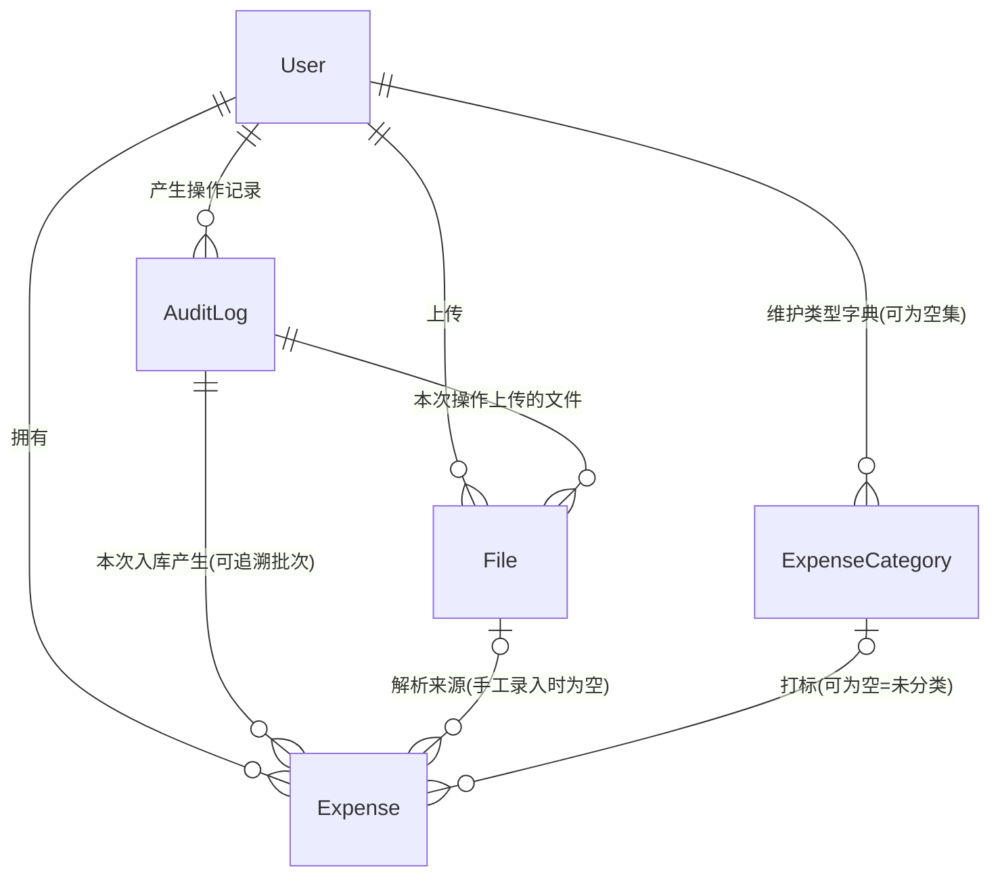

# 终版 · 记账系统功能与模型（对话20 · 最终定稿）

> 依据来源：`260901-223131-answer.md`「第三轮 · 终版功能体系」+ `260902-004426-answer.md`「终版 · 实体模型（对话9 · 定稿）」+ 本文件对话1~19 的全部核对结论与决策（57 处回写已全部并入）。
> **本节自包含，取代上述两份终版与本文件此前全部章节（含对话13 / 对话17 终版）**；冲突处一律以本节为准，前文仅作推导过程留痕。
> 范围：业务功能、实体、属性、关联关系、业务规则；不涉及技术实现，不写代码与 SQL。
> 规模：**8 条前提 / 11 域 57 项功能 / 5 实体 62 项属性 / 5 组关联 / 11 类审计 / 4 条不变式 / 6 条流程 / 1 项待确认**。

---

## 一、定位与全局前提

个人记账系统，以**银行账单导入**为主要数据来源，核心价值是**支出分类打标 + 跨月摊分 + 多币种折算 + 月度分析**。

| # | 前提 |
| - | ---- |
| 1 | **假定无人能直接读写数据库**——数据一律明文存储（含上传文件与文件密码），安全完全由应用层的登录态校验与归属校验保证；密码是唯一例外，加盐哈希存储 |
| 2 | **只记支出**，不涉及收入、结余、资产负债；负金额表示退款/冲正，作抵扣而非收入 |
| 3 | **纯个人数据隔离**，不做账本共享；管理员特权仅限账户管理域，**看不到他人的明细 / 文件 / 支出类型 / 操作审计** |
| 4 | **操作审计是唯一的留痕机制**，不另建导入批次表、修改历史表 |
| 5 | **摊分月数无上限**，摊分份额不落库、不产生额外数据行 |
| 6 | **本位币金额是只读因变量**，恒等于「支出金额 × 折算汇率」，无人工指定入口 |
| 7 | 支出日期以账单字面值为准，**不做时区换算**；**无关账/锁月**，历史月份永远可改 |
| 8 | **记录的存在性单向不可逆**。全模型只有两种删除：`Expense` 的**软删除**（写 `删除时间`，**终态**，无恢复入口，找回一律靠复制新增）与 `ExpenseCategory` 的**物理删除**（仅限无引用时，删即不可恢复）；`User` / `File` / `AuditLog` 一律不可删除。业务状态位（`User.状态`、`User.锁定截止时间`、`User.需强制改密`）不受此约束，其启停是设计内的可逆开关 |

---

## 二、功能清单（11 域 57 项）

### A. 账户与认证（8 项）

- **A-1 系统初始化**：首次启动创建唯一管理员账户，用户名固定 `admin`；该动作记一条「系统初始化」审计。
- **A-2 初始密码生命周期**：所有初始密码（admin 初始、新建账户、重置密码）均随机生成、仅交付一次、首登强制修改；明文不落库。
- **A-3 初始密码交付与风险**：`admin` 的初始密码**仅在初始化创建的那一次**按「内存随机生成 → 打印到日志 → 哈希加盐写入」交付，此后不再生成也不再打印；其余场景在界面上一次性展示，由管理员线下交付。**`admin` 遗忘密码不设计恢复路径**——初始化那一次的日志若丢失，`admin` 将永久无法登录，唯一出路是重新部署服务从头初始化，该动作不属于本系统功能，不做任何设计。
- **A-4 登录与登出**：账号 + 密码登录并签发登录态；**登出为前端丢弃令牌，服务端无动作、不记审计**。
- **A-5 登录态时效**：签发起 12 小时**绝对过期、不可续期**。
- **A-6 全局登录态校验**：除登录页与登录接口外，所有页面与接口强制校验；失效（过期或被基线时间作废）统一跳回登录页。
- **A-7 账户管理（仅管理员）**：新增账户、启停除自身外的任意账户、重置他人密码、**查看账户列表**（展示 `User` 的字段，`密码哈希` 与 `盐` 除外）；账户一律不可删除。重置密码、禁用账户会推进目标用户的登录态基线时间，使其旧令牌立即失效。
- **A-8 密码策略**：长度 ≥ 10 且字母/数字/符号至少含两类；加盐哈希存储；连续失败 5 次锁定 10 分钟；用户可自助改密，**改密推进自身基线时间，当前令牌一并失效，须以新密码重新登录**。

### B. 权限与审计（4 项）

- **B-1 数据归属**：所有业务数据（文件、审计、明细、类型、用户偏好）均绑定归属用户。
- **B-2 查询强制过滤**：所有列表、详情、统计、导出一律按归属用户过滤。
- **B-3 按 ID 访问的归属校验**：明细编辑 / 删除 / **批量删除** / 复制、文件下载等逐一校验归属。
- **B-4 统一操作审计**：**11 类操作**记为审计记录（枚举见 8.4），是全系统唯一的留痕依据。三条边界：① **除「数据导出」外，读操作不记审计**（文件下载/预览、各类查询）；② `变更内容` **一律不记任何密码值**（明文、哈希、盐）；③ 管理员对他人账户的操作**归属管理员**，被操作者在 K-2 中看不到——依前提 3 显式接受，不建被动审计副本。

### C. 文件管理（4 项）

- **C-1 独立文件模块**：所有上传文件统一存储与管理，业务模块只引用不自存。
- **C-2 文件元信息**：文件名、格式、**解析器类型**、大小、归属用户、上传时间、**文件内容（原始二进制随记录存储）**、内容校验值（**仅作特征值留存，系统无校验功能，也不用于查重**）、文件密码（明文保存，供重新打开）。
- **C-3 文件与审计双向关联**：由文件可查到它在哪次操作中上传，由某次操作可查到本次涉及哪些文件。
- **C-4 文件访问与留存**：经归属校验后可下载或预览原件；文件只留存不物理删除；**允许重复上传、重复保存，不做文件级查重**。

### D. 数据录入（7 项）

- **D-1 解析器插件化**：由 `File.解析器类型` 决定走哪个解析器（`格式` 不足以判定——同为 PDF，各银行版式不同），**适配各银行原生导出格式**，不定义统一模板；新增银行或格式不影响上层流程；本轮仅实现 CSV。
- **D-2 文件上传与解析**：上传时**由用户显式选择解析器类型**；必要时输入密码解密；解析出逐笔交易明细，含银行名称、卡号后四位、卡片币种（解析不出则留空）。
- **D-3 非法输入反馈**：格式不符、内容损坏、字段缺失、解密失败、**所选解析器类型与文件不匹配**等给出明确错误提示。
- **D-4 统一预览页**：**文件导入、手工录入、复制已删除明细三种录入进入方式共用同一预览页**，默认全部勾选，可增删行；**F-5 逐笔编辑复用同一页面与同一套查重逻辑**，形态为单行、不可增删行、无勾选。可编辑字段一律为 F-1 的八项，本位币金额只读实时计算。
- **D-5 未提交保护**：预览页刷新、关闭或登录态失效前二次确认，明示未提交数据将全部丢失（录入态与编辑态同此）。
- **D-6 疑似重复高亮**：预览页高亮疑似重复行，并并列展示与之冲突的已入库明细供人工比对；**编辑态排除这笔自身**。
- **D-7 提交入库**：用户取消勾选确认重复的行后提交，一次提交生成一条「数据入库」审计，入库明细关联该审计——**该审计ID即批次号**，是后续按批次筛选与撤销的唯一依据。

### E. 去重（2 项）

- **E-1 判重口径**：以「归属用户 + 支出日期 + 支出金额 + 支出币种」四要素**等值匹配**判定疑似重复，不设指纹属性，不纳入卡片、对手方、备注等非必有字段；**比对范围为在库且未删除的明细**，编辑态**排除被编辑的这笔自身**。
- **E-2 双向查重与人工裁定**：既查本次录入内部重复，也查与已入库明细的重复；**录入（三种进入方式）与编辑四条链路一律查重**；系统只标记「疑似重复」，是否真重复一律人工判断，**只提示不阻断**，不做任何自动处置。

### F. 支出明细（8 项）

- **F-1 用户可编辑字段（8 项）**：支出日期、支出金额、支出币种、交易对手方、交易备注、支出类型、摊分月数、**折算汇率**。
- **F-2 系统维护字段（14 项）**：只读派生 4 项（本位币金额、折算本位币币种、摊分起始月、摊分结束月）+ 系统只读 10 项（明细ID、归属用户ID、来源审计ID、来源文件ID、银行名称、卡号后四位、卡片币种、删除时间、创建时间、更新时间）。
- **F-3 明细列表**：分页逐笔查看，支持按日期、金额等排序；**支出金额、折算汇率、本位币金额三者同屏展示**；**支持多选**。
- **F-4 多维筛选**：日期区间、金额区间、币种、对手方（模糊）、备注（模糊）、支出类型（多选，空即未分类）、摊分月数（多选）、**来源审计/文件**（批次撤销的入口）、**折算本位币币种**（定位未按当前本位币折算的行）、**银行名称/卡号后四位/卡片币种**（含「未识别」选项）、**是否显示已删除**（默认不显示）。
- **F-5 逐笔编辑**：**仅对未删除明细开放**；复用 D-4 预览页的单行形态，**八个字段可改**（F-1 全集）；本位币金额只读、随输入实时重算；改动日期/币种时重拉汇率（**失败则该行汇率转必填、未填不可保存**），改动日期/摊分月数时刷新摊分起止月；**保存前走 D-6 查重（排除自身、只提示不阻断）**；保存**不生成「数据入库」审计**、不改 `来源审计ID` 与 `来源文件ID`，记一条「明细编辑与删除」审计。
- **F-6 筛选态累计统计**：当前筛选条件下的笔数、按币种分组金额合计、本位币折算总额；**跟随筛选**——打开「显示已删除」时即计入，保证「列表所见 = 合计所指」；批次撤销前的核对即依赖它。
- **F-7 明细导出**：导出当前筛选结果（同样跟随筛选），记一条「数据导出」审计。
- **F-8 明细删除与复制**：**逐笔或批量软删除**（写 `删除时间`，**终态、无恢复入口**）——批量支持勾选多行，也支持**全选当前筛选结果全集**；**选中的已删除行跳过、不覆盖其 `删除时间`**；删除前提示「本次将删除 N 笔明细」。配合 F-4 的「显示已删除」筛选可查看已删除明细——**已删除行只读、不可编辑，行上只保留「复制」入口**，可将其**复制为一条新明细**——以被复制明细为初值进入 D-4 预览页，走 D-6 查重后由 D-7 提交，生成**新审计**。复制的字段取值见 8.5。

### G. 支出类型（4 项）

- **G-1 类型字典**：用户级、单层分类，**只能新建与删除**（不提供改名，也不提供停用）；**同一用户下名称唯一**；**开户时为空集**，全部由用户自建。
- **G-2 未分类**：明细的支出类型**为空即未分类**，字典中不设「未分类」记录。
- **G-3 自动打标**：判定方式待定（T4），在此之前解析出的明细类型一律留空。
- **G-4 删除保护**：**被明细引用的类型不可删除**，**已软删除的明细同样构成引用**（否则 F-4 查看与 F-8 复制会指向不存在的记录）；未被任何明细引用的类型可直接**物理删除**，删即不可恢复。筛选框与编辑框的类型下拉范围完全一致，即全部类型。

### H. 摊分（4 项）

- **H-1 摊分月数**：明细自带字段，全部明细都有值，默认 1（不摊分），**不设上限**。
- **H-2 摊分规则**：以支出日期所属月为第 1 个摊分月；金额按币种的小数位数均分，除不尽的尾差固定计入末月；原币金额与本位币金额各自独立均分。负金额（退款）规则完全对称，**从退款发生月起摊，不改写历史月份**。
- **H-3 派生不落库**：摊分份额查询时实时派生，不产生额外数据行；明细冗余「摊分起始月/结束月」两个派生字段供统计定位。
- **H-4 编辑预览与影响提示**：编辑摊分月数或支出日期时即时展示覆盖月份区间与每月分摊金额，并提示本次修改将影响的月份范围。

### I. 多币种（6 项）

> I-6「展示口径切换」已作废（F-3 已三者同屏、F-6 已双口径并存），**编号空号不复用**。

- **I-1 币种枚举**：币种为**代码内置枚举**，不落库；库中只存币种代码。新增币种须改代码，枚举项只能停用不能删除。
- **I-2 本位币**：用户级配置，**默认 CNY**，用户可自行修改。
- **I-3 汇率自动获取**：系统自动获取**日汇率**，不提供手工汇率表维护，不建汇率实体。
- **I-4 入账折算与快照**：按支出日期的日汇率折算出本位币金额，所用汇率随明细留存；原币 = 本位币时汇率取 1。
- **I-5 汇率兜底**：折算汇率允许用户直接编辑；自动获取或重拉失败时该行汇率变为必填，**未填不可提交 / 不可保存**，不静默按 1:1 处理；**手填汇率同时把 `折算本位币币种` 置为当前本位币**（见 8.1）。
- **I-7 本位币金额重算**：用户可主动发起（切换本位币时自动触发一次），按当前本位币逐笔重算「折算汇率 + 本位币金额 + 折算本位币币种」三者同事务更新；`折算本位币币种 = 当前本位币` 的行跳过；**含已软删除的明细**（它们可经 F-4 筛选查看，展示必须处于当前本位币口径；复制时的初值同理）；单笔失败不影响其他笔，天然幂等可续跑。未收敛的行由 F-4 按折算本位币币种筛选定位、由 I-5 手工兜底。

### J. 月度统计（6 项）

- **J-1 月度支出总额**：支持「未摊分口径（按支出日期归月）」与「摊分口径（按份额所属月归月）」双口径，一键切换并明示当前口径与筛选语义。
- **J-2 月度类型分布**：按支出类型看每月金额与占比，两种口径均支持。
- **J-3 趋势与对比**：多月趋势、环比与同比对比。
- **J-4 币种维度统计**：按币种拆分的月度金额。
- **J-5 下钻明细**：从某月某类型下钻到构成它的明细，摊分口径下展示「份额金额 + 来源支出」。
- **J-6 未来待摊分段**：摊分口径下将「已发生（≤ 当前月）」与「未来待摊」分段展示。

> J 域一律按数据库字面数值相加，不对「折算本位币币种 ≠ 当前本位币」的混合口径做任何提示——纠错由 I-7 与 I-5 承担，发现问题靠 F-4 筛选。**已软删除的明细不参与 J 域任何统计**（F-6/F-7 跟随筛选，是列表合计而非月度报表，不受此限）。

### K. 配置与运维（4 项）

- **K-1 基础配置页**：维护**本位币、界面语言与支出类型**；币种为代码枚举、卡片信息自动解析、汇率自动获取，均不提供手工维护。**切换本位币会落两条审计**：`用户偏好设置`（记配置变更，必成功）+ `本位币金额重算`（记 I-7 批量结果，允许部分失败可续跑）——二者职责不同，不是重复记录。
- **K-2 操作日志查看**：查看本人的关键操作记录，**可跳转到关联对象**；跳转目标为**已软删除的明细**时正常跳转并自动带上「显示已删除」筛选（记录仍在），仅**已被物理删除的支出类型**降级为「该对象已删除」提示（`对象ID` 是历史指针、不是外键）；**对「数据入库」类审计的跳转必须带上「来源审计 = 该ID」的筛选条件**——这是批次撤销的唯一入口。本页**只读，不承担任何写操作**。
- **K-3 数据导出/备份**：导出本人在 5 个实体上的全部记录——`User`（`密码哈希`、`盐` 除外）、`ExpenseCategory`、`Expense`（**含已删除**）、`File`（**含 `文件内容` 二进制与 `文件密码`**）、`AuditLog`；与前提 1 一致，导出包同为明文；记一条「数据导出」审计。
- **K-4 多语言**：**仅界面文案**走语言配置文件，新增语种只需增加配置、无需改动代码；**不含数据内容**（支出类型名称等）的翻译；本轮仅提供中文。

---

## 三、实体关系图

- **5 个实体全部挂在 `User` 下**，无系统级表——币种、解析器类型与登录态都不落库，归属校验因此无例外表。
- **`Expense` 是唯一的事实实体**：摊分份额不落库、卡片不建实体、汇率不建实体。
- **`AuditLog` 是留痕与批次追溯的枢纽**：一次提交 = 一条审计 = 一个可追溯批次。

---

## 四、逐实体属性（5 实体 62 项）

> 「必填」= 任何记录都必须有确定值；业务上「不适用」的场景以零值表达，不留空。

### 1. User 用户（15 项，全部必填）

| 属性 | 说明 |
| ---- | ---- |
| 用户ID | 唯一标识，全部业务数据的归属键 |
| 用户名 | 登录账号；管理员固定 `admin` |
| 密码哈希 | 加盐哈希，明文任何环节不落库，也不进审计 |
| 盐 | 与哈希配对 |
| 角色 | 管理员 / 普通用户；新建为普通用户 |
| 状态 | 启用 / 禁用，默认启用；账户不可删除，无删除标记 |
| 需强制改密 | 新建账户与被重置密码后为是；为是时只能走改密流程 |
| 连续失败次数 | 默认 0；连续 5 次锁定 10 分钟 |
| 锁定截止时间 | 零值 = 未锁定 |
| 登录态基线时间 | 签发时间早于它的令牌失效；改密 / 被重置 / 被禁用时推进 |
| 本位币 | 币种枚举代码，默认 **CNY** |
| 界面语言 | 语言配置文件的键，默认**中文**；由 K-1 维护 |
| 创建时间 / 更新时间 | — |
| 最后登录时间 | 零值 = 从未登录 |

### 2. ExpenseCategory 支出类型（5 项，全部必填）

| 属性 | 说明 |
| ---- | ---- |
| 类型ID | 唯一标识 |
| 归属用户ID | 用户级字典，各用户互不可见；开户时为空集 |
| 名称 | 单层无父子，全部由用户自建，**同一用户下唯一**；不提供改名、不做多语翻译 |
| 创建时间 / 更新时间 | — |

> 无状态字段——不提供停用；生命周期只有「新建」与「无引用时物理删除」两态。

### 3. Expense 支出明细（22 项 · 核心实体）

**用户可编辑（8 项）**

| 属性 | 必填 | 说明 |
| ---- | ---- | ---- |
| 支出日期 | ✓ | 交易发生日；未摊分口径的归月依据，也是取日汇率的依据；字面值，无时区换算 |
| 支出金额 | ✓ | 原币金额，**允许为负**（退款、冲正） |
| 支出币种 | ✓ | 币种枚举代码 |
| 交易对手方 | ✗ | 商户或收款方；账单未给出时留空 |
| 交易备注 | ✗ | 账单摘要或用户自填；未给出时留空 |
| 支出类型ID | ✗ | 打标结果；**空即未分类** |
| 摊分月数 | ✓ | **默认 1**，无上限 |
| 折算汇率 | ✓ | 1 单位原币可兑换的本位币数量；原币 = 本位币时取 1；自动获取失败时必填 |

**只读派生（4 项，全部必填）**

| 属性 | 说明 |
| ---- | ---- |
| 本位币金额 | **= 支出金额 × 折算汇率**，无人工指定入口 |
| 折算本位币币种 | 折算当时的本位币；**≠ `User.本位币` 即待重算 / 重算失败**；与汇率、本位币金额三者联动（见 8.1） |
| 摊分起始月 | = 支出日期所属月 |
| 摊分结束月 | = 起始月 + 摊分月数 − 1；摊分统计做区间穿刺的关键字段 |

**系统只读（10 项）**

| 属性 | 必填 | 说明 |
| ---- | ---- | ---- |
| 明细ID | ✓ | 唯一标识 |
| 归属用户ID | ✓ | 数据归属 |
| 来源审计ID | ✓ | 属于哪次入库，**批次筛选与撤销以此为单位** |
| 来源文件ID | ✗ | 从哪个文件解析而来；**手工录入时为空；复制时继承被复制明细的值** |
| 银行名称 | ✗ | 卡片来源标识，解析所得；解析不出时留空；复制时继承 |
| 卡号后四位 | ✗ | 同上 |
| 卡片币种 | ✗ | 同上，币种枚举代码 |
| 删除时间 | ✗ | **有值即已删除**（软删除），**终态不可逆**，无恢复入口 |
| 创建时间 / 更新时间 | ✓ | — |

### 4. File 文件（11 项，仅文件密码非必填）

| 属性 | 说明 |
| ---- | ---- |
| 文件ID | 唯一标识 |
| 归属用户ID | 下载时的越权校验依据 |
| 来源审计ID | 在哪次「文件上传」操作中上传——文件与审计双向可查 |
| 原始文件名 | 用户上传时的文件名 |
| 格式 | **文件类型标识**，用于展示、预览与下载（CSV / Excel / PDF）；**不决定解析器** |
| 解析器类型 | **决定走哪个解析器**；取值为代码内置解析器类型枚举的键（如「招商银行 · 信用卡账单 · PDF」），**由用户在上传页显式选择** |
| 文件大小 | 展示 |
| 文件内容 | **原始二进制随记录存储**，无外部存储位置 |
| 内容校验值 | **仅作特征值留存**；系统无校验功能，也不用于查重 |
| 文件密码 | 加密文档的解密口令，**明文保存**；非加密文档为空（唯一非必填项） |
| 上传时间 | — |

> 文件只留存不物理删除，因此没有删除标记；允许重复上传、重复保存。

### 5. AuditLog 操作审计（9 项，全部必填）

| 属性 | 说明 |
| ---- | ---- |
| 审计ID | 唯一标识，兼「入库批次号」 |
| 用户ID | **操作人**，同时是数据归属人；**登录失败记录中它表示被尝试账号的归属，不代表操作人身份**（尝试者不可知，不留字段） |
| 操作类型 | 11 类枚举，见 8.4 |
| 操作对象类型 | 零值 = 本次操作无具体对象或为批量操作 |
| 对象ID | 零值 = 同上；**是历史指针，不是外键**——指向的对象可能已被删除 |
| 操作摘要 | 人可读描述，如「导入 37 笔，合计 1,204.50 CNY」「批量删除 12 笔（来源审计 #88）」 |
| 变更内容 | 编辑类操作的前后值快照；零值 = 非编辑类操作；**一律不记任何密码值（明文、哈希、盐）** |
| 操作结果 | 成功 / 失败 |
| 操作时间 | 发生时点 |

> 无「回滚审计ID」——批次撤销已下沉为明细列表页的批量删除，重复删除由「已删除跳过」天然幂等，不需要状态位。

---

## 五、不落库的三样

**1. 币种枚举**（代码内置）：每项含币种代码、名称、符号、**小数位数**（摊分取整与尾差的基准）、是否启用、**汇率获取实现**。库中只存币种代码。后果：合法性校验落在应用层；枚举项只能停用不能删除（历史明细存着旧代码）；新增币种 = 改代码。

**2. 解析器类型枚举**（代码内置）：每项含标识键、名称（机构 + 账单类型 + 格式）、适用格式、是否启用、解析实现。库中只存键。后果与币种枚举同构：新增银行 = 改代码；枚举项只能停用不能删除（历史 `File` 存着旧键）。

**3. 登录令牌**（无状态）：载荷含用户ID、角色、签发时间、过期时间（签发 + 12 小时，**绝对过期、不可续期**）。主动登出 = 前端丢弃令牌，服务端无动作、不记审计。改密 / 被重置 / 被禁用，靠 `User.登录态基线时间` 让此前签发的令牌全部失效（代价是每请求多读一次用户）。唯一做不到的语义是「单端登出而其他端不受影响」，需令牌黑名单，本轮不建。

---

## 六、刻意不建实体（11 项）

| 候选 | 替代方案 |
| ---- | -------- |
| 币种 | 代码枚举 + 明细上的币种代码 |
| 解析器档案 | 代码注册表 + `File.解析器类型` |
| 汇率 | 明细上的折算汇率数值快照 |
| 登录态 | 无状态令牌 + `User.登录态基线时间` |
| 打标规则 | 暂无（T4 挂起期间明细类型一律留空） |
| 月度摊分增量 | 明细上的摊分起止月 + 区间穿刺查询 |
| 摊分份额 | 同上，查询时实时派生 |
| 银行卡片档案 | 明细上的三个来源值属性 |
| 导入批次 | `AuditLog`，一次提交即一个可追溯批次 |
| 录入预览暂存数据 | 前端会话内临时态（D-5 未提交即丢失） |
| 多语言文案 | 语言配置文件 + `User.界面语言` |

---

## 七、关联关系（5 组）

| 关系 | 基数 | 约束 |
| ---- | ---- | ---- |
| User → Expense / File / AuditLog / ExpenseCategory | 1:N | 归属关系；所有查询强制带上 |
| AuditLog → Expense | 1:N | 一次提交产生的全部明细，**批次筛选与撤销以此为单位** |
| AuditLog → File | 1:N | 一次操作涉及的文件，双向可查 |
| File → Expense | 1:N，可空 | 明细的解析来源；手工录入为空，复制时继承 |
| ExpenseCategory → Expense | 1:N，可空 | 打标关系；空即未分类；**被引用（含已软删除的明细）的类型不可删除** |

> 币种与解析器类型不产生关联关系——它们是值，不是引用。`AuditLog.对象ID` 是历史指针，不构成关联关系。

---

## 八、关键业务规则

### 8.1 折算联动（6 种触发，三字段同进退）

`本位币金额 = 支出金额 × 折算汇率`——两个自变量（支出金额、折算汇率）由用户维护，本位币金额是**只读因变量**；`折算本位币币种` 标识「这笔的本位币金额是哪个币种」，是判断该行是否已按当前本位币折算的唯一依据。

| 触发 | 本位币金额 | 折算本位币币种 |
| ---- | ---------- | -------------- |
| 改支出金额（汇率不动） | = 新金额 × 现汇率 | **不变**（保持原口径，未收敛行仍可被识别） |
| 改折算汇率（含 I-5 手填兜底） | = 现金额 × 新汇率 | **= 当前本位币** |
| 改支出日期 | 重拉新日期日汇率 → 重算 | **= 当前本位币**；同时刷新摊分起止月并触发 H-4 提示 |
| 改支出币种 | 重拉新币种日汇率 → 重算 | **= 当前本位币** |
| I-7 重算 / 切换本位币 | 重拉汇率 → 重算 | **= 当前本位币**（三字段同事务） |
| 改摊分月数 | 不变 | 不变；仅刷新摊分结束月 |

**规则一句话**：只要汇率是「按当前本位币重新拉的」或「用户手填的」，`折算本位币币种` 就一并改为当前本位币；只有「只改金额、汇率没动」这一种不改它。否则手工兜底的行永远收敛不了，且会被下一次 I-7 覆盖掉手填值。

**重拉汇率的时机仅四处**：入库首次获取（**仅文件导入 / 手工录入**）、支出日期变更、支出币种变更、I-7 重算。**复制不重拉**——日期未变则日汇率不变，沿用被复制明细的汇率作初值；只有用户在预览页改了支出日期或支出币种才按本表重拉。用户主动改汇率是直接赋值，不属于重拉。**重拉失败**则该行汇率转必填，未填不可提交 / 不可保存（I-5）。

> 代价（已知并接受）：用户无法直接指定本位币金额，只能通过填入反推的汇率逼近；汇率小数位受限时可能有分位偏差。

### 8.2 摊分与月度统计

起始月 = 支出日期所属月，结束月 = 起始月 + 摊分月数 − 1，均为派生字段。份额不落库、查询时实时派生；按币种小数位数均分，尾差归末月；原币与本位币各自独立均分。

月度摊分统计用 **`起始月 ≤ M` 且 `结束月 ≥ M` 的区间穿刺**，**不建聚合表**：两个条件是合取且各自具备选择性——查近期月份时后者排除掉早已摊完的绝大多数支出，查久远月份时前者排除掉该月之后发生的全部支出。聚合表是纯派生的统计缓存，可由明细完全重建，将来真需要时作为纯技术优化加回，不改业务模型。

### 8.3 去重

四要素（归属用户 + 支出日期 + 支出金额 + 支出币种）等值匹配，不存指纹字段；**比对范围为在库且未删除的明细**；只标记疑似重复、只提示不阻断，一律人工裁定。**四条链路共用同一套逻辑**：文件导入、手工录入、复制已删除明细（D 域三种录入进入方式）与 **F-5 逐笔编辑**，编辑时**排除被编辑的这笔自身**（否则必然自报重复）。

> 复制的边界：被复制的原明细已删除、不在比对范围内，因此**不会与自身误报**；库中若另有同四要素的未删除明细，则正常提示。

### 8.4 留痕与审计

一次提交 = 一条审计 = 一个**可追溯批次**；明细与文件都挂来源审计ID（`File` 挂「文件上传」那条，`Expense` 挂「数据入库」那条）。**撤销一个批次的方式是**：K-2 跳转到明细列表页（自动按来源审计筛选）→ F-6 核对笔数与合计 → 全选 → 批量删除。

**操作类型（11 类）**

| # | 操作类型 | 触发 | 对象类型 / 对象ID |
| - | -------- | ---- | ----------------- |
| 1 | 系统初始化 | A-1 创建 `admin` | `User` / admin 用户ID |
| 2 | 登录 | A-4；**失败以 `操作结果 = 失败` 表达**——用户名**存在**（含密码错、账户禁用、锁定期内）则记录并**归属该用户**，用户名**不存在**则**不记审计**（无归属、无消费方） | 零值 |
| 3 | 账户管理 | A-7 新增 / 启停 / 重置他人密码 | `User` / 目标用户ID |
| 4 | 密码修改 | A-8 自助改密、首登强制改密 | `User` / 自身用户ID |
| 5 | 文件上传 | C-1 / D-2 | `File` / 文件ID |
| 6 | 数据入库 | D-7（含复制提交；摘要记「复制自明细 X」） | 零值（批量） |
| 7 | 明细编辑与删除 | F-5 编辑、F-8 删除 | 逐笔：`Expense` / 明细ID；**批量删除：零值，摘要记筛选条件与笔数** |
| 8 | 本位币金额重算 | I-7 | 零值（批量） |
| 9 | 支出类型维护 | G-1 新建 / 删除（摘要必须带类型名称） | `ExpenseCategory` / 类型ID |
| 10 | 用户偏好设置 | K-1 本位币切换、界面语言切换 | `User` / 自身用户ID |
| 11 | 数据导出 | K-3 整库导出、F-7 明细导出 | 零值（批量），摘要记范围与笔数 |

> 明细的「新增」不在本表单列——一律走「数据入库」（含复制提交）。

**三条边界**：除「数据导出」外读操作不记审计；`变更内容` 不记任何密码值；管理员对他人账户的操作归属管理员、被操作者不可见（显式接受）。

### 8.5 删除与复制

- **删除**：`Expense` 写 `删除时间` 即已删除，**终态不可逆**，逐笔与批量同此，不区分是批次撤销还是单笔删除；批量删除可勾选多行或**全选当前筛选结果全集**，选中的已删除行**跳过、不覆盖其 `删除时间`**，删除前提示「本次将删除 N 笔明细」；不要求整批原子成功，失败重跑即可（删除幂等）。已删除明细**只读不可编辑**（F-5 仅对未删除明细开放，其 `支出类型ID` 因此永久不可改）、不参与列表默认视图、不参与 J 域任何统计；**可经 F-4「显示已删除」筛选查看**，因此**仍参与 I-7 本位币重算**（展示与复制初值都必须处于当前本位币口径）；F-6/F-7 跟随筛选，打开该筛选时即计入。
- **复制**：以某条已删除明细为初值进入 D-4 预览页（手工录入链路）→ D-6 常规查重 → D-7 提交，生成新审计。字段取值：

| 字段组 | 取值 | 预览页可改 |
| ------ | ---- | ---------- |
| 业务七字段 + `折算汇率` | 随复制作初值 | ✓ |
| 卡片三属性、`来源文件ID` | 随复制（同一条数据，来源相同） | ✗ |
| `来源审计ID` | = 本次复制提交产生的新审计 | ✗ |
| 四项只读派生 | 按 8.1 / 8.2 重算 | ✗ |
| `删除时间` | 空 | ✗ |

- **`ExpenseCategory`**：无引用时物理删除（不可恢复）；**已软删除的明细同样构成引用**。审计里指向它的 `对象ID` 是历史指针，删除后由 K-2 提示「该对象已删除」（这是全模型唯一会触发该提示的对象），摘要中的类型名称保证仍可读。

---

## 九、必须守住的四条不变式

1. **恒等式与三字段不变式**：`本位币金额 = 支出金额 × 折算汇率` 恒成立，本位币金额为只读因变量、任何一次编辑后立即重算；凡汇率按当前本位币重拉或由用户手填，`折算本位币币种` 必须同步置为当前本位币。摊分起始月/结束月在支出日期或摊分月数变更时同步刷新。
2. **重算的原子粒度是单笔**：本位币重算逐笔进行，单笔三字段同事务，允许部分失败，可中断可续跑；未收敛的行由「折算本位币币种 ≠ `User.本位币`」唯一识别。
3. **归属校验无死角**：全面不加密后应用层是唯一防线，5 个实体全部带归属用户，任何按 ID 的访问都必须校验归属——漏一处等于全量泄露。
4. **一次提交 = 一条审计 = 一个可追溯批次**：明细与文件都必须挂上来源审计ID，否则批次追溯与撤销失去边界。

---

## 十、核心业务流程（6 条）

1. **开户与首登**：`admin` 初始化时从日志读取一次性打印的初始密码 → 登录 → 强制改密 → **当前令牌失效、以新密码重新登录** → 新增账户并一次性展示初始密码 → 线下交付 → 用户首登 → 强制改密 → 同样重新登录。
2. **登录鉴权**：登录签发 12 小时绝对过期的令牌 → 任意页面与接口先校验登录态与基线时间、再按归属用户过滤 → 失效跳回登录页；连续 5 次失败锁定 10 分钟。
3. **数据录入（核心）**：上传文件并**选择解析器类型** → 文件入库并绑定「文件上传」审计 → 按解析器类型解析明细 → 自动取日汇率折算（类型留空）→ 内部与库内双向查重并高亮 → 统一预览页人工编辑/增删行/取消勾选/补录汇率 → 提交入库生成「数据入库」审计 → 计算摊分起止月 → 关联该审计。手工录入与复制已删除明细走同一预览页，仅初值来源不同；**复制沿用原汇率，不重新获取**。
4. **明细维护**：筛选定位 → 单行预览页编辑八个字段 → 按 8.1 联动折算三字段、按 8.2 刷新摊分起止月 → 保存前查重（排除自身、只提示）→ 记「明细编辑与删除」审计；误删无法恢复，只能复制为新明细（走常规查重，生成新审计）。
5. **批次撤销**：从操作日志定位某次入库 → 跳转明细列表页（自动按来源审计筛选）→ 用 F-6 核对笔数与合计 → 全选当前筛选结果 → 批量删除（提示 N 笔，已删除行跳过）→ 记一条「明细编辑与删除」审计，摘要写明筛选条件与笔数。
6. **月度分析**：选择口径与月份 → 未摊分口径按支出日期归月，摊分口径按起止月区间穿刺 → 查看总额、类型分布与趋势 → 下钻到明细 → 发现错误跳明细页修正 → 回来复核。

---

## 十一、唯一待确认

| 编号 | 问题 | 状态 |
| ---- | ---- | ---- |
| T4 | **自动打标的判定方式** | **由你主动挂起**；在此之前明细类型一律留空，模型中不建打标规则实体。若定为关键词规则，需新增该实体（归属用户 / 匹配字段 / 关键词 / 目标类型 / 优先级 / 启用状态）；若定为历史记忆，可能只需查询历史明细，无新实体 |

---

## 十二、交付说明

- **交付物**：本节即最终定稿——8 条全局前提、11 域 **57 项**功能、1 张实体关系图、5 实体 **62 项**属性、3 样不落库设计、11 项不建实体、5 组关联关系、5 类关键业务规则（含 11 类审计枚举与复制字段表）、4 条不变式、6 条核心业务流程、1 项待确认。
- **规模**：`User` 15、`ExpenseCategory` 5、`Expense` 22（可编辑 8 / 只读派生 4 / 系统只读 10）、`File` 11、`AuditLog` 9。
- **相对对话17 终版的实质变化（5 项）**：① 复制**不重拉汇率**（日期未变则汇率不变），8.1 的「入库首次获取」限定为文件导入 / 手工录入；② **已删除明细只读**，F-5 仅对未删除明细开放，已删除行只留「复制」；③ 登录失败审计**有主则记、无主不记**，`AuditLog.用户ID` 补注语义；④ K-2 区分两种「已删除」：软删明细正常跳转、物理删除的类型才提示；⑤ 已知代价补第 ③ 条。计数与结构零变化。
- **相对对话13 终版的实质变化（8 项）**：① **折算三字段联动**补全——汇率重拉或手填时 `折算本位币币种` 同步更新，修复手工兜底走不通、手填值被覆盖两个后果；② **D-8 一键回滚整项取消**，撤销下沉为「按来源审计筛选 + 批量删除」，功能 58 → **57**，操作日志页退化为纯只读；③ **`AuditLog.回滚审计ID` 删除**，属性 63 → **62**；④ 审计枚举 11 → 12 → **11 类**（增「数据导出」、删「回滚」，「明细增删改」改名「明细编辑与删除」）；⑤ **F-5 编辑复用录入预览页与查重**（单行形态、排除自身、只提示不阻断、不生成入库审计）；⑥ **F-8 增批量删除**（全选筛选结果全集、已删除行跳过、提示 N 笔）；⑦ K-2 跳转带批次筛选条件、对象已删除时提示，`对象ID` 定性为历史指针；⑧ 前提 3 措辞收敛、`ExpenseCategory.名称` 同用户唯一、复制审计摘要记来源明细。
- **未做**：字段类型与长度、索引、NULL 与零值的存储层选择、二进制存储形态、汇率获取实现、解析器实现、重算调度形态、任何 SQL 与代码——均属技术实现，留待技术方案轮次。
- **已知代价（登记，不需处理）**：① 批次撤销不再原子，漏选会撤不干净，靠 F-6 的筛选态统计核对；② 无「删除审计ID」，从一条已删除明细正向反查「是哪次操作删的」做不到，反向可由批量删除审计的摘要查到；③ **支出类型一旦被任何明细（含已软删除）引用即永久不可删除**——已删除明细只读、其类型不可改，系统又无停用能力且下拉恒含全部类型，废弃类型无清理手段。
- **校验方式**：
  ① 功能点算：8+4+4+**7**+2+8+4+4+**6**+6+4 = **57**；
  ② 属性点算：15 + 5 + 22 + 11 + **9** = **62**，与 `Expense` 三分 8+4+10 = 22、F-1(8)+F-2(14) = 22 三向校验一致；
  ③ 正向逐条走 57 项功能，确认每项所需数据都有属性落点，无悬空功能；
  ④ 反向逐条走 62 项属性，确认均可追溯到功能编号——含此前检出的四个薄弱项（卡片三属性 → F-4、`界面语言` → K-1、`最后登录时间` → A-7、`内容校验值` → 显式接受为纯留存）；
  ⑤ 对照对话1~19 的 **57 处回写清单**逐条核销，确认全部并入本节（含对话15 第 39~42 项作废）；
  ⑥ 折算 6 种触发逐一走查，确认本位币金额恒为算出、`折算本位币币种` 仅在「汇率重拉或手填」时更新，未收敛行仍可被唯一识别；
  ⑦ 11 类审计枚举与全部写操作双向对齐，「数据导出」为唯一记审计的读操作，全文检索确认无「回滚」残留；
  ⑧ 两种删除、三个业务状态位与前提 8 交叉核验，全模型无第二处「删除又恢复」；四条查重链路（三种录入 + 编辑）逐条确认比对范围与自身排除规则一致；
  ⑨ 已删除明细在 F-4 / F-5 / F-6 / F-7 / F-8 / I-7 / J 域 / 8.3 八处的行为逐一走查，确认「只读 + 可查看 + 可复制 + 参与重算 + 不参与统计」五条互不抵触。
