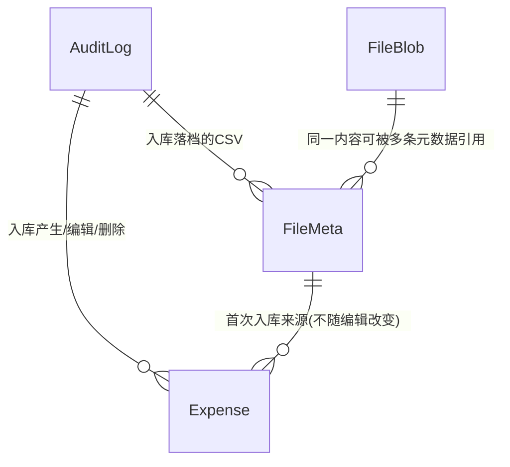

# 对话4 · 合并定稿：记账系统功能与模型（v2 简版）

> 依据来源：对话1~4 全部结论（对话1~3 的推导过程与取舍理由不再重复，仅取定案结果；冲突处一律以最新一轮为准）。
> 本节自包含，是本任务当前阶段的**唯一权威版本**，取代对话1~3 正文中与本节不一致的表述（推导留痕仍保留在原处，供追溯）。
> 范围：业务功能、实体、属性、关联关系、业务规则；不涉及技术实现，不写代码与 SQL。
> 规模：**8 条前提 / 8 域 32 项功能 / 4 实体 38 项属性 / 4 组关联 / 8 类审计 / 6 条不变式 / 6 条核心流程**。

对话4 三条反馈先行处置：① 单批次数据量不大，核实视图不设行数上限（落入 E-3）；② 采纳 HTTPS + 前端 sessionStorage 存口令，**T6、T10 关闭**（不采纳双口令 + JWT 方案）；③ 本节即你要的完整重述。

---

## 一、定位与全局前提（8 条）

个人自用记账系统，**只记支出**，以本系统自有格式的 CSV 为唯一批量录入形态、列表页内联编辑为唯一修改形态，核心价值是**明细留存 + 人工去重 + 多币种折算**。

| # | 前提 |
| - | ---- |
| 1 | **单用户、单实例、docker 部署**；数据库文件必须位于挂载的数据卷上 |
| 2 | **口令即密钥**：SQLite 整库加密（`github.com/ncruces/go-sqlite3`），密钥由口令现场派生；代码不写死、服务端不存储、不跨请求缓存、不落盘。**口令丢失 = 数据永久不可读，不设任何找回路径**。服务端不额外持久化任何第二把口令（已排除双口令方案，T10） |
| 3 | **无登录态、无会话、无登录接口**：每个请求自带「口令 + 记账币种」，服务端逐请求「派生密钥 → 打开库 → 读写 → 关闭」；传输强制走 HTTPS，前端以 sessionStorage 持有口令（关闭标签页即失效） |
| 4 | **单用户 ⇒ 归属维度整体消失**：无用户实体、无归属字段。加密本身是唯一的访问边界 |
| 5 | **只记支出**，不涉及收入、结余、资产负债；金额以正数为常态，**允许 0 与负数**（退款、冲正） |
| 6 | **录入只有两种入口、修改只有一种入口**：批量新增走 CSV（含上传真实文件与前端单行新增两种触发方式，字段契约相同）；已有明细的修改一律在列表页内联编辑，**不存在独立的「录入编辑页」**（E 域已并入本页） |
| 7 | **记录的存在性单向不可逆**：明细只有软删除（写删除时间，**终态**，无恢复入口，找回一律靠复制新增）；文件与审计不可删除 |
| 8 | **审计只留痕、不承载业务**：覆盖「全部能打开数据库的写操作」，认证失败/库打不开时只进应用日志、不落库；失败锁定（A-6）只在进程内存里计数，同样不落库；不提供基于审计的回滚/撤销/重放入口 |

---

## 二、功能清单（8 域 32 项）

### A. 口令与加密（6 项）

- **A-1 系统初始化**：数据卷中无数据库文件即判定首次启动 → 内存生成随机口令 → **打印到日志（仅此一次）** → 派生密钥建库加密 → 写「系统初始化」审计。
- **A-2 初始口令的唯一交付**：进程重启不重新打印；错过即无法使用，唯一出路是删除数据库文件或重装服务重新初始化，旧数据同时永久失去。
- **A-3 逐请求携带口令**：所有接口携带「口令 + 记账币种」；服务端现场派生密钥，处理完即丢弃；无登录、登出、令牌、会话、超时。
- **A-4 口令校验（只读探针）**：进入主界面前调用一次，给出「口令错误」反馈；不签发会话、不记审计；口令错与文件损坏不可区分，统一提示。
- **A-5 更换口令**：等价更换密钥。服务端「副本改密 → 用新口令校验能打开 → 原子替换」，失败则原库原封不动；用户侧「先下载当前库」降级为二次兜底。记一条「更换口令」审计（写入新库，不记口令值）。
- **A-6 口令策略与失败锁定**：初始口令系统随机生成；用户自定口令须满足最低强度（长度 ≥ 12，且不得为纯数字或纯字母）。**口令校验失败计数：连续失败攒够 N 次即封禁 T 分钟**（`token_fail_limit` / `token_ban_minute`，默认 5 次 / 5 分钟），T 同时是计数有效期——连续 T 分钟没有新失败，计数归零。封禁期内所有需要口令的接口一并拒绝，用于挡字典爆破；计数全局不分来源（反代之后客户端地址来自可伪造的转发头），只在进程内存里，重启即清零。

### B. 数据库导入导出（3 项）

- **B-1 导出加密数据库**：导出当前加密态的一致性快照；记一条「数据库导出」审计（沿用既有推荐，见文末遗留说明）。
- **B-2 导入加密数据库**：上传的库文件须用本次请求口令校验能打开且结构合法，通过才原子替换现有数据库；整库覆盖、不可逆，页面二次确认。替换后写一条「数据库导入」审计（落新库）。
- **B-3 一套能力覆盖四场景**：备份、迁移、换机、改密回滚共用 B-1/B-2，不另建备份模块。

### C. 审计（3 项）

- **C-1 覆盖范围**：全部能打开数据库的写操作，共 **8 类**（枚举见 §8.4）。读操作除数据库导出外一律不记。
- **C-2 只留痕、不耦合**：不提供回滚/撤销/重放入口；`对象ID` 是历史指针，不是外键。
- **C-3 审计查看**：只读列表，按操作类型与时间区间筛选，可跳转到「按审计ID筛选的明细列表」（查询能力，非回滚）。

### D. 文件管理（4 项）

- **D-1 元数据与内容两实体拆分**：`FileMeta` 存元数据，承载绝大部分查询；`FileBlob` 存内容，只在下载/校验时读取。
- **D-2 内容寻址与天然去重**：`FileBlob` 以内容哈希为唯一ID，`FileMeta` 以哈希为外键，允许多条元数据指向同一内容。
- **D-3 完整性校验**：下载时重算哈希与主键比对，不一致则告警并阻止下载。
- **D-4 文件列表与下载**：按时间/文件名/用途/来源审计筛选并下载；文件只留存不删除，无孤儿问题。

### E. 明细：查询、录入、编辑合一（7 项）

> **相对对话1 最大的结构变化**：原「录入编辑页」（旧 E 域）整体并入「查询列表页」（旧 F 域），三种进入方式收敛为「CSV 批量新增」与「列表页内联编辑」两条路径，「查询转编辑」动作**不复存在**。

- **E-1 CSV 契约**：系统自有列名，不适配银行原生格式，按列名匹配、不依赖顺序；必填列缺失报错、可选列缺失按空、未知列报错。**契约仅 8 个业务列，不含明细ID与版本号**（更新只能走内联编辑，CSV 只做新增）：银行名称、卡号后四位、支出日期、支出币种、支出金额、交易对手方、交易备注、折算汇率、支出类型。折算汇率列**可留空**：有值优先采用，无值由系统按支出日期自动获取，两者都拿不到则该行报错。
- **E-2 新增（单行 / 批量 / 复制三入口共用同一份契约）**：① 列表页「新增一行」= 一份仅 1 行的 CSV；② 上传真实 CSV = 批量；③ 对已删除行「复制」= 以其字段为初值、清空明细ID 与删除时间、按新增处理。三者落库后均写一条「数据入库」审计并存档 CSV（原件 + 快照），**首次赋予该明细的审计ID / 文件ID，此后编辑不再改动这两个字段**（§8.5）。
- **E-3 CSV 批量核实视图**：CSV 落库成功后自动展示——先按「来源审计ID = 本次」取出本批次明细的「支出日期+支出金额+支出币种」集合，再用该集合反查全库未删除明细中三要素命中的全部行（含本批次与库内旧行），按 E-6 分组高亮展示。**单批次数据量不大，不设行数上限**。
- **E-4 单行内联编辑**：仅未删除明细可编辑，字段范围 = §四.1 Expense「可手编」列（10 项）；保存走单行更新接口，带版本号乐观锁，冲突提示「数据已落后，请刷新页面重新加载」；**保存不生成「数据入库」审计、不改动来源审计ID / 文件ID**，记一条「明细编辑」审计（变更内容记前后值快照）；保存后按 §8.1 联动表重算派生字段，并按 E-3 同一套逻辑重新核验三要素、刷新高亮。
- **E-5 批量软删除**：列表页勾选（含全选当前筛选结果全集）→批量软删除；已删除行跳过、不覆盖其删除时间；删除前提示「本次将删除 N 笔」；记一条「明细删除」审计。
- **E-6 疑似重复高亮**：「支出日期+支出金额+支出币种」相同的行归为一组，加框并高亮；默认列表视图与 E-3 核实视图共用同一套分组规则，新增、编辑均会触发重新核验。
- **E-7 查询与展示**：分页、排序、顶部筛选（日期区间、金额区间、支出币种、记账币种、对手方模糊、备注模糊、支出类型模糊、银行名称/卡号后四位、来源审计ID/文件ID、是否显示已删除，默认不显示）；表头可选，默认 10 列（支出日期/支出币种/支出金额/折算汇率/记账币种/记账金额/交易对手方/交易备注/支出类型/摊分月数），可切全字段平铺（§四.1 顺序）。

### F. 记账口径（5 项）

- **F-1 币种枚举内置**：代码、名称、小数位数、是否启用，不落库，库中只存币种代码；枚举项只能停用不能删除。
- **F-2 记账币种逐请求携带**：不落库、不建用户配置实体；写操作决定新数据的记账口径，查询用于判断「当前选择 vs 库内已有」是否一致。
- **F-3 折算恒等式**：`记账金额 = 支出金额 × 折算汇率`，记账金额为只读因变量；支出币种 = 记账币种时折算汇率恒为 1；折算汇率恒 > 0。联动细则见 §8.1。
- **F-4 记账币种切换**：筛选 `记账币种 ≠ 目标币种` 的全部明细（含已删除），逐笔按其支出日期与目标币种**重新自动获取汇率**并直接覆盖（**不区分原值来源，自动获取或手填均覆盖**），同步重算记账金额与记账币种，**单笔同事务**，允许部分失败、可中断、重试即续跑。记一条「记账币种切换」审计。
- **F-5 表头提示**：明细表格「记账币种」表头展示全库存在的记账币种集合；多于一个或与当前选择不一致时，提示执行 F-4。

### G. 摊分（2 项）

- **G-1 摊分三字段**：`摊分月数`（默认 1，下限 1，无上限）+ 派生的 `摊分起始月`（= 支出日期所属月）与 `摊分结束月`（= 起始月 + 摊分月数 − 1）；支出日期或摊分月数变更时同步刷新。
- **G-2 份额不落库、本轮无消费方**：三字段仅做存储与展示，本轮不提供月度统计（沿用既有推荐，见文末遗留说明）。

### H. 部署与运维（2 项）

- **H-1 docker 单实例**：容器无状态，全部状态在挂载卷的数据库文件里；**依赖外部汇率接口，需要出网**（F-4/E-1 汇率自动获取所需，相对更早版本「零出网依赖」的表述已作废）。
- **H-2 日志口径**：日志中只有初始化那一次出现口令；此后任何日志、审计、导出均不得出现口令值。

---

## 三、实体关系图

- **实体由 5 → 4**：`ExpenseCategory` 已删除（支出类型改为 `Expense` 上的自由字符串字段）。
- **`Expense` 是唯一的事实实体**；`AuditLog` 是留痕枢纽，不承载业务动作；`FileBlob` 是全模型唯一的内容寻址表。

---

## 四、逐实体属性（4 实体 38 项）

### 1. Expense 支出明细（21 项）

| 属性 | 必填 | 可手编 | 说明 |
| ---- | ---- | ------ | ---- |
| 银行名称 | ✗ | ✓ | 解析不出/未填时留空 |
| 卡号后四位 | ✗ | ✓ | 同上 |
| 支出日期 | ✓ | ✓ | 交易发生日；字面值，无时区换算；摊分起始月依据 |
| 支出币种 | ✓ | ✓ | 币种枚举代码 |
| 支出金额 | ✓ | ✓ | 允许为 0 / 负 |
| 交易对手方 | ✗ | ✓ | 未给出时留空 |
| 交易备注 | ✗ | ✓ | 未给出时留空 |
| 折算汇率 | ✓ | ✓ | CSV 有值优先，无值自动获取；支出币种 = 记账币种时取 1；必须 > 0；触发重算时新值无条件覆盖旧值 |
| 记账币种 | ✓ | ✗ | 新增行取请求携带值，编辑既有行保持库内原值，只能经 F-4 变更 |
| 记账金额 | ✓ | ✗ | = 支出金额 × 折算汇率 |
| **支出类型** | ✗ | ✓ | **自由字符串**（原「支出类型ID」，零实体方案，T4），空即未分类；候选下拉来源 = 运行时 `distinct(支出类型)` |
| 摊分月数 | ✓ | ✓ | 默认 1，下限 1，无上限 |
| 摊分起始月 | ✓ | ✗ | = 支出日期所属月 |
| 摊分结束月 | ✓ | ✗ | = 起始月 + 摊分月数 − 1 |
| 明细ID | ✓ | ✗ | 唯一标识 |
| 审计ID | ✓ | ✗ | **首次入库**所属审计，编辑不改动（§8.5，相对对话1修正） |
| 文件ID | ✓ | ✗ | **首次入库**所用 CSV 快照，编辑不改动 |
| 版本号 | ✓ | ✗ | 乐观锁，仅用于单行编辑接口，**不进 CSV 契约** |
| 创建时间 | ✓ | ✗ | — |
| 更新时间 | ✓ | ✗ | — |
| 删除时间 | ✗ | ✗ | 有值即已删除，终态不可逆 |

### 2. AuditLog 操作审计（8 项）

| 属性 | 说明 |
| ---- | ---- |
| 审计ID | 唯一标识，兼「入库批次号」 |
| 操作类型 | 8 类枚举，见 §8.4 |
| 操作对象类型 | 零值 = 无具体对象或批量操作 |
| 对象ID | 零值 = 同上；历史指针，非外键 |
| 操作摘要 | 人可读描述，如「入库 37 笔，来源 2609.csv」「复制自明细 X」 |
| 变更内容 | 前后值快照；零值 = 非编辑类操作；不记口令值 |
| 操作结果 | 成功 / 失败 / 部分成功 |
| 操作时间 | 发生时点 |

### 3. FileMeta 文件元数据（7 项）

| 属性 | 说明 |
| ---- | ---- |
| 文件ID | 唯一标识 |
| 内容哈希 | 指向 `FileBlob` 的外键 |
| 文件名 | 上传原始文件名，或系统为单行新增生成的名字 |
| 用途 | 枚举：上传原件 / 入库快照 |
| 文件大小 |  |
| 审计ID | 在哪次操作中落档 |
| 创建时间 | — |

### 4. FileBlob 文件内容（2 项）

| 属性 | 说明 |
| ---- | ---- |
| 内容哈希 | 主键即唯一ID，天然去重与完整性校验基准 |
| 文件内容 | 原始字节 |

---

## 五、不落库的五样

1. **币种枚举**（代码内置）。
2. **口令与密钥**：仅在单次请求处理期间存在于内存，不落盘、不跨请求缓存、不进日志（初始化那一次除外）、不进审计、不进导出。
3. **会话与令牌**：不存在。
4. **记账币种的「当前选择」**：逐请求携带。
5. **摊分份额**：由起止月实时派生。

## 六、刻意不建实体（11 项）

| 候选 | 替代方案 |
| ---- | -------- |
| 用户 | 单用户；口令即访问边界 |
| 登录态 / 令牌 | 无会话 |
| 币种 | 代码枚举 + 明细上的币种代码 |
| 汇率 | 明细上的折算汇率数值快照 |
| 用户配置（记账币种/语言） | 逐请求携带 |
| 导入批次 | `AuditLog` |
| 月度聚合 / 摊分份额 | 明细上的摊分起止月，本轮未使用 |
| 解析器档案 | 本轮只有系统自有 CSV 一种格式 |
| 银行卡片档案 | 明细上的银行名称/卡号后四位 |
| 录入预览暂存 | 已取消预览态，落库后直接在列表页核实 |
| **支出类型字典**（新增） | 明细上的自由字符串 + `distinct` 候选（T4） |

---

## 七、关联关系（4 组）

| 关系 | 基数 | 约束 |
| ---- | ---- | ---- |
| AuditLog → Expense | 1:N | 覆盖入库/编辑/删除/切换产生或影响的明细，仅供追溯，不构成回滚入口 |
| AuditLog → FileMeta | 1:N | 一次入库落档的 CSV（原件 + 快照） |
| FileMeta → Expense | 1:N | 明细的**首次**来源 CSV 快照，编辑不改变指向 |
| FileBlob → FileMeta | 1:N | 内容寻址，同内容只存一份 |

---

## 八、关键业务规则

### 8.1 折算联动

`记账金额 = 支出金额 × 折算汇率`，记账金额为只读因变量。

| 触发 | 折算汇率 | 记账金额 | 记账币种 |
| ---- | -------- | -------- | -------- |
| 改支出金额 | 不变 | 重算 | 不变 |
| 改折算汇率（手工） | 用户值（须 > 0） | 重算 | 不变 |
| 改支出币种为 = 记账币种 | 强制置 1 | 重算 | 不变 |
| 改支出币种为其他币种 | 系统按新支出日期 + 新币种重新自动获取（失败转必填） | 重算 | 不变 |
| 改支出日期 | 系统按新日期 + 现支出币种重新自动获取（失败转必填） | 重算 | 不变 |
| F-4 记账币种切换 | 按支出日期 + 目标币种重新自动获取，**无条件覆盖原值** | 重算 | = 目标币种 |
| 改摊分月数 | 不变 | 不变 | 不变（仅刷新摊分结束月） |
| CSV 导入该行 | 有值用 CSV 值，无值自动获取，都无则报错 | 按公式算 | = 本次请求携带值 |

### 8.2 摊分

`摊分起始月 = 支出日期所属月`，`摊分结束月 = 起始月 + 摊分月数 − 1`，`摊分月数 ≥ 1`，支出日期或摊分月数变更时同步刷新。份额不落库，本轮无消费方。

### 8.3 疑似重复核实

判定字段「支出日期 + 支出金额 + 支出币种」，等值分组即高亮，不做区间或聚合运算。CSV 批量新增后的核实口径见 E-3（审计ID 定位批次 → 三要素集合反查全库）；单行新增/编辑后按同一分组规则重新核验。系统只标记，不阻断，人工裁定后走 E-5 软删除处理。

### 8.4 审计枚举（8 类）

| # | 操作类型 | 触发 |
| - | -------- | ---- |
| 1 | 系统初始化 | A-1 |
| 2 | 数据入库 | E-2（单行新增 / CSV 批量 / 复制，统一为「新增」） |
| 3 | 明细编辑 | E-4（单行字段修改，**不生成新文件、不改来源审计ID/文件ID**） |
| 4 | 明细删除 | E-5 |
| 5 | 记账币种切换 | F-4 |
| 6 | 更换口令 | A-5 |
| 7 | 数据库导入 | B-2 |
| 8 | 数据库导出 | B-1（沿用推荐，见文末遗留说明） |

> 相对对话1 的 7 类：删「支出类型维护」（T4 零实体化后不再有维护动作），新增「明细编辑」独立列出（因编辑已改为单行接口而非 CSV 提交，不再与「数据入库」混同）、「数据库导出」计入。

### 8.5 删除、复制与来源字段的稳定性

- **删除**：写删除时间即终态，逐笔与批量同此，已删除行跳过、不覆盖其删除时间。
- **复制**：已删除行复制为新行时清空明细ID 与删除时间，按 E-2 新增路径处理，产生新的审计ID / 文件ID。
- **来源字段稳定性（本轮明确）**：`审计ID` / `文件ID` 只在**首次新增**时赋值，此后任何一次 E-4 编辑都**不改动**这两个字段——编辑走独立的「明细编辑」审计，用「变更内容」记前后值即可留痕，不需要也不应该为一次字段修改重新生成一份 CSV 快照。此为对旧版（`doc/decisions/记账系统功能与模型.md` F-5）验证过的设计的复用，非本轮新造。

---

## 九、必须守住的六条不变式

1. **折算恒等式**：`记账金额 = 支出金额 × 折算汇率` 恒成立，记账金额为只读因变量；支出币种 = 记账币种时折算汇率恒为 1；折算汇率恒 > 0。
2. **摊分派生**：`摊分起始月/结束月` 按 §8.2 公式，`摊分月数 ≥ 1`。
3. **口令零持久化**：口令与密钥不落盘、不跨请求缓存、不进日志（初始化除外）、不进审计、不进导出；服务端不额外持久化第二把口令。
4. **记录单向不可逆**：明细只软删且为终态；文件与审计不可删除。
5. **审计只留痕**：任何业务动作都不得以审计为入口或依据。
6. **来源字段仅随新增确立**：一次新增提交（CSV 批量或单行新增）= 一条「数据入库」审计 = 一份 CSV 快照，本批全部明细的 `审计ID`/`文件ID` 一并指向它们；后续编辑不产生新审计与文件，也不改动这两个字段。

---

## 十、核心业务流程（6 条）

1. **初始化与首次使用**：启动 → 数据卷无库文件 → 生成随机口令 → 打印日志 → 建库加密 → 写「系统初始化」审计 → 用户从日志取口令 → 解锁 → 直接可用。
2. **每一次请求**：携带「口令 + 记账币种」→ 派生密钥 → 打开库 → 校验/读写 → 关库、丢弃密钥；失败统一返回「口令错误或数据库文件损坏」。
3. **更换口令**：页面提示先下载当前库 → 提交新口令（校验强度）→ 服务端副本改密 → 新口令校验可打开 → 原子替换 → 写「更换口令」审计 → 前端以新口令重新解锁；任一步失败原库不动。
4. **数据新增（CSV 批量 / 单行 / 复制三入口）**：解析或内联填写 → 落 CSV（原件 + 快照，单行场景快照仅 1 行）→ 写「数据入库」审计 → 按 E-3 自动跳转核实视图（审计ID 定位批次 → 三要素反查全库）→ 高亮显示 → 人工裁定是否软删除。
5. **明细编辑与去重清理**：列表页筛选定位 → 内联编辑（乐观锁）→ 保存重算派生字段、重新核验高亮、记「明细编辑」审计（不动来源字段）；或勾选（含全选筛选结果）→ 批量软删除 → 记「明细删除」审计。
6. **记账币种切换**：表头提示存在多种记账币种 → 用户选定目标币种 → 筛选 `记账币种 ≠ 目标` 的全部明细（含已删除）→ 逐笔单事务按支出日期重新获取汇率并覆盖 → 记一条审计（成功/部分成功）→ 中断或失败后重试即续跑。

---

## 十一、遗留说明（非本轮新增疑问，沿用既有推荐值，未见你反对）

| 项 | 沿用的推荐值 | 首次给出于 |
| -- | ------------ | ---------- |
| T2 | 摊分三字段本轮无消费方，予以保留（成本低，砍掉后续补要改数据） | 对话1 |
| T3 | 数据库导出（B-1）记一条「数据库导出」审计 | 对话1 |
| T8 | 保留「银行名称/卡号后四位」两列，本轮 CSV 为纯手填，成本为零 | 对话1 |
| T7 | 已随 E 域重构**自动作废**——「列表转编辑」功能本身不存在，行数上限问题不再适用 | 对话1 → 对话3 |

以上均非本轮新论证，若你对其中任意一项有不同意见，随时可以改判，不影响本节其余结论。

---

## 十二、交付说明

- **交付物**：对话1~4 全部结论的合并定稿——8 条前提、8 域 **32 项**功能、1 张实体关系图、4 实体 **38 项**属性、5 样不落库、11 项不建实体、4 组关联关系、8 类审计枚举、6 条不变式、6 条核心流程、4 项遗留说明。
- **规模**：`Expense` 21、`AuditLog` 8、`FileMeta` 7、`FileBlob` 2。
- **相对对话1 初稿的净变化**：实体 5→4（删 `ExpenseCategory`）；域 10→8（E 并入 F、I 整域取消）；功能 40→32；审计枚举 7→8（构成变化：删「支出类型维护」，增「明细编辑」独立列出、增「数据库导出」）；关联 5→4；属性 43→39→**38**（第一步减去 `ExpenseCategory` 的 4 项；本轮订正再减 1：`FileBlob.创建时间` 删除，`文件大小` 由 `FileBlob` 移至 `FileMeta` 不影响净计数）。
- **本轮订正（回应你对上一版 answer 的两点修正）**：① 「文件大小」改记在 `FileMeta` 而非 `FileBlob`——`FileMeta` 才是 D-1 定义的「承载绝大部分查询」的实体，文件列表页要展示/排序大小时不该联到 `FileBlob`；② 追问「`FileBlob.创建时间` 是否有用」成立，复核后确认该字段没有独立业务用途（可从同哈希的 `FileMeta.创建时间` 间接推得，也不被任何查询/校验逻辑直接使用），予以删除。详见 §四.3/§四.4。
- **未做**：字段类型与长度、索引、加密算法与 KDF 参数、二进制存储形态、原子替换实现方式、外部汇率接口选型——均属技术实现，留待技术方案轮次。
- **校验方式**：① 对话1~4 全部反馈逐条核对本节，确认无遗漏或误改；② 功能点算 6+3+3+4+7+5+2+2 = **32**；③ 属性点算 21+8+7+2 = **38**；④ 8 类审计与全部写操作双向对齐；⑤ §8.5 来源字段稳定性与 E-2/E-4/E-5 三处交叉核验，确认「新增赋值、编辑不动、删除不清空」互不矛盾；⑥ 遗留说明 4 项逐一标注来源轮次，不冒充本轮新结论；⑦ `FileMeta`/`FileBlob` 订正后的字段总数与实体属性点算（③）一致，`FileBlob → FileMeta` 关联基数与约束不受本次字段调整影响。
