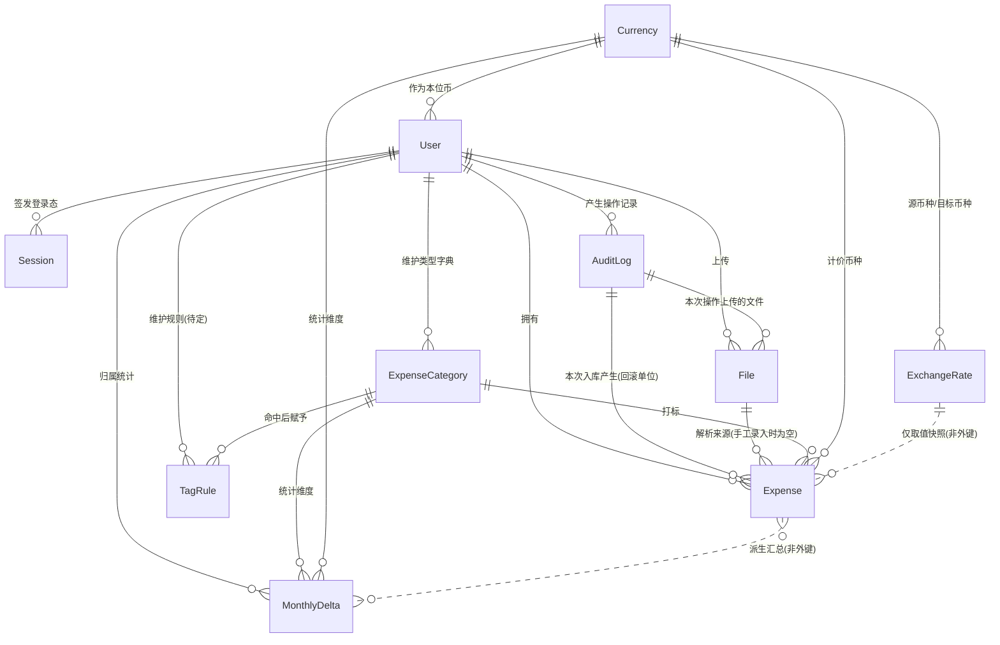

# 记账系统 · 实体模型分析

> 依据来源：`260901-223131-answer.md`「第三轮 · 终版功能体系」（11 个业务域 57 项功能、5 条全局前提、3 个议题终稿）。功能编号（如 H-3、议题 2）均指该终版一节。
> 本轮范围：纯理论建模——实体、属性、关联关系；不涉及技术实现，不写代码与 SQL，不做字段类型与索引设计。
> 凡终版中标记「待确认」的事项，其对模型的影响已在文末第六节列出，不做脑补。

---

## 一、实体关系图

**读图要点**

- `User` 是全局归属根：除 `Currency`（系统级字典）外，所有实体都直接或间接挂在用户下，对应终版前提 3 与 B-1。
- `AuditLog` 是留痕与回滚的枢纽：文件、明细都反向指向它，替代了独立的「导入批次」与「修改历史」实体。
- `Expense` 是唯一的事实实体：摊分不产生子实体，卡片不独立成表。
- 两条虚线是**非外键关系**：`MonthlyDelta` 由明细派生可重建；`ExchangeRate` 只被复制数值，不被引用。

---

## 二、实体清单与分层

| 层次     | 实体              | 中文名         | 性质                             |
| -------- | ----------------- | -------------- | -------------------------------- |
| 主数据   | `Currency`        | 币种           | 系统级只读字典                   |
| 主数据   | `ExpenseCategory` | 支出类型       | 用户级字典                       |
| 主数据   | `TagRule`         | 打标规则       | 用户级字典，**待确认是否存在**   |
| 主体     | `User`            | 用户           | 归属根                           |
| 事实     | `Expense`         | 支出明细       | 核心事实，全系统唯一的金额来源   |
| 事实     | `File`            | 文件           | 原始输入留存                     |
| 事实     | `AuditLog`        | 操作审计       | 留痕与回滚枢纽                   |
| 外部数据 | `ExchangeRate`    | 汇率           | 自动获取的外部数据落地           |
| 派生     | `MonthlyDelta`    | 月度摊分增量   | 统计加速层，可由明细完全重建     |
| 会话     | `Session`         | 登录态         | 生命周期极短，仅服务鉴权         |

---

## 三、逐实体属性说明

### 1. User 用户

| 属性                    | 业务含义                                                         | 依据 |
| ----------------------- | ---------------------------------------------------------------- | ---- |
| 用户ID                  | 唯一标识，所有业务数据的归属键                                   | B-1  |
| 用户名                  | 登录账号；管理员固定为 `admin`                                   | A-1  |
| 密码哈希、盐            | 加盐哈希后的口令，任何环节不可逆推明文                           | A-8  |
| 角色                    | 管理员 / 普通用户；决定能否进入账户管理域                        | A-7  |
| 状态                    | 启用 / 禁用；禁用后不可登录。**无删除标记——账户不可删除**        | A-7  |
| 需强制改密              | 首次登录或被重置密码后为真，为真时只能走改密流程                 | A-2  |
| 连续失败次数、锁定截止时间 | 支撑「连续失败 5 次锁定 10 分钟」                              | A-8  |
| 本位币                  | 用户级统一折算币种，默认 USD                                     | I-2  |
| 界面语言                | 用户选定的语种，对应语言配置文件的键                             | K-4  |
| 创建时间、更新时间、最后登录时间 | 常规追溯                                                | —    |

> 建模取舍：**「需强制改密」一个字段同时驱动两件事**——强制改密流程，以及 admin 初始密码是否打印到日志（A-3 规定改密后不再打印）。无需再设「初始密码是否已交付」字段。初始密码本身不落库，只存哈希。

### 2. Session 登录态

| 属性           | 业务含义                                       | 依据 |
| -------------- | ---------------------------------------------- | ---- |
| 会话ID         | 登录态标识                                     | A-4  |
| 用户ID         | 所属用户                                       | A-4  |
| 签发时间       | 登录成功的时点                                 | A-5  |
| 绝对过期时间   | 签发时间 + 12 小时，到期自动失效               | A-5  |
| 失效状态、登出时间 | 主动登出或被强制下线后置为失效             | A-4  |

> 说明：终版 A-4 要求支持主动登出，因此会话需要可被标记失效，故建为实体。是否落库属实现选择（无状态令牌则退化为不落库），但那样主动登出与强制下线将无处依附。续期语义见待确认 T9。

### 3. AuditLog 操作审计

| 属性                | 业务含义                                                              | 依据 |
| ------------------- | --------------------------------------------------------------------- | ---- |
| 审计ID              | 唯一标识；同时充当「入库批次号」的角色                                | B-4  |
| 用户ID              | 操作人，同时是数据归属人                                              | B-4  |
| 操作类型            | 登录、账户管理、文件上传、数据入库、明细编辑、明细删除、回滚等枚举    | B-4  |
| 操作对象类型、对象ID | 指向被操作的实体，支撑从审计跳转到具体数据                            | K-2  |
| 操作摘要            | 人可读描述，如「导入 37 笔，合计 1,204.50 USD」                       | K-2  |
| 变更内容            | 编辑类操作的前后值快照，**替代独立的修改历史实体**                    | B-4  |
| 操作结果            | 成功 / 失败                                                           | B-4  |
| 操作时间            | 发生时点                                                              | B-4  |
| 是否已回滚、回滚审计ID | 入库类操作被撤销后的标记，及指向执行撤销的那条审计                 | D-8  |

> 建模取舍：**一次提交 = 一条审计 = 一个回滚单位**（D-7/D-8）。这使「导入批次」不必单独建模，也让手工录入与文件导入共用同一套回滚语义。

### 4. File 文件

| 属性         | 业务含义                                                        | 依据 |
| ------------ | --------------------------------------------------------------- | ---- |
| 文件ID       | 唯一标识                                                        | C-1  |
| 归属用户ID   | 数据归属，下载时的越权校验依据                                  | B-3  |
| 来源审计ID   | 本文件在哪次操作中上传——**文件与审计双向可查的依据**            | C-3  |
| 原始文件名   | 用户上传时的文件名                                              | C-2  |
| 格式         | CSV / Excel / PDF，决定走哪个解析器                             | D-1  |
| 文件大小     | 展示与校验                                                      | C-2  |
| 存储位置     | 文件实际存放的位置标识                                          | C-2  |
| 内容校验值   | 完整性校验；也可用于识别同一文件被重复上传                      | C-2  |
| 文件密码     | 加密文档的解密口令，**明文保存**以便后续重新打开（议题 3 定案） | C-2  |
| 上传时间     | 上传时点                                                        | C-2  |

> 说明：文件只留存不物理删除（C-4），因此**没有删除标记**。

### 5. Expense 支出明细（核心实体）

**业务字段**——用户可见可编辑的七个字段（F-1、F-5）：

| 属性         | 业务含义                                                   | 依据    |
| ------------ | ---------------------------------------------------------- | ------- |
| 支出日期     | 交易发生日；未摊分口径的归月依据                           | F-1/J-1 |
| 支出金额     | 原币金额。**是否允许为负（退款、冲正）见待确认 T1**        | F-1/T1  |
| 币种         | 原币种，引用币种字典                                       | F-1/I-1 |
| 交易对手方   | 商户或收款方名称                                           | F-1     |
| 交易备注     | 账单摘要或用户自填说明                                     | F-1     |
| 支出类型     | 打标结果，引用用户级类型字典；未识别时指向「未分类」       | F-1/G-2 |
| 摊分月数     | 该笔成本分摊的月份数，默认 1，**无上限**                   | H-1     |

**系统字段**——由系统写入或派生（F-2）：

| 属性                          | 业务含义                                                                     | 依据      |
| ----------------------------- | ---------------------------------------------------------------------------- | --------- |
| 明细ID                        | 唯一标识                                                                     | —         |
| 归属用户ID                    | 数据归属                                                                     | B-1       |
| 来源审计ID                    | 属于哪次入库，**回滚以此为单位**                                             | D-7/D-8   |
| 来源文件ID                    | 从哪个文件解析而来；手工录入时为空                                           | D-4       |
| 银行名称、卡号后四位、卡片币种 | 来源标识，自动解析所得。**作为明细的值属性，不建独立实体**                  | F-2       |
| 原始摘要                      | 解析前的原始文本，供人工追溯核对                                             | F-2       |
| 折算汇率                      | 入账时所用汇率的**数值快照**，保证历史统计可复现                             | I-4       |
| 本位币金额                    | 按上述汇率折算所得                                                           | I-4       |
| 折算本位币币种                | 折算当时用户的本位币，随快照固定；用户改本位币后据此识别哪些行需重算（T6）   | I-2/T6    |
| 摊分起始月                    | = 支出日期所属月                                                             | H-2       |
| 摊分结束月                    | = 起始月 + 摊分月数 − 1。**区间穿刺查询的关键字段**                          | H-3/议题2 |
| 交易指纹                      | 由「用户 + 日期 + 金额 + 币种」生成的去重键                                  | E-1       |
| 删除标记、删除时间            | **软删除还是物理删除见待确认 T2**                                            | T2        |
| 创建时间、更新时间            | 常规追溯                                                                     | —         |

> **派生字段一致性要求**：折算汇率、本位币金额、摊分起止月、交易指纹四组均为派生值，必须在支出日期、金额、币种、摊分月数任一变更时同步刷新（F-5）。这是模型上最需要守住的不变式。

### 6. ExpenseCategory 支出类型

| 属性           | 业务含义                                                    | 依据 |
| -------------- | ----------------------------------------------------------- | ---- |
| 类型ID         | 唯一标识                                                    | G-1  |
| 归属用户ID     | **用户级字典**，各用户互不可见                              | G-1  |
| 名称           | 交通 / 餐饮 / 住宿等，单层无父子                            | G-1  |
| 是否默认未分类 | 标记「未分类」这一兜底类型，不可删除也不可停用              | G-2  |
| 是否内置       | 开户时初始化的默认类型集，用于区分系统预置与用户自建        | G-1  |
| 状态           | 启用 / 停用；被明细引用时只能停用不能删                     | G-4  |
| 排序           | 展示与选择的顺序                                            | —    |
| 创建时间、更新时间 | 常规追溯                                                | —    |

### 7. Currency 币种

| 属性       | 业务含义                                                                | 依据    |
| ---------- | ----------------------------------------------------------------------- | ------- |
| 币种代码   | ISO 代码，主键（USD、CNY、JPY 等）                                      | I-1     |
| 名称、符号 | 展示用                                                                  | I-1     |
| 小数位数   | **最小币值单位**（JPY 为 0、USD 为 2）；摊分均分取整与尾差计算的基准    | H-2     |
| 是否启用   | 系统级字典的可用范围控制                                                | I-1     |

> 说明：这是唯一不挂在用户下的实体——系统级只读，用户只引用不维护（K-1）。「小数位数」是终版补漏项，缺它则 H-2 的尾差规则无从计算。

### 8. ExchangeRate 汇率

| 属性              | 业务含义                                          | 依据   |
| ----------------- | ------------------------------------------------- | ------ |
| 汇率ID            | 唯一标识                                          | I-3    |
| 源币种、目标币种  | 折算方向                                          | I-4    |
| 日期              | 汇率所属日期；**日汇率还是月汇率见待确认 T7**     | I-4/T7 |
| 汇率值            | 折算比率                                          | I-4    |
| 获取来源、获取时间 | 自动抓取的出处与时点，便于排查异常                | I-3    |

> **关键取舍：明细不外键引用汇率记录，只复制汇率数值。** 原因有二——汇率记录会被后续刷新覆盖，引用会导致历史统计漂移；且 I-5 允许单笔手工覆盖汇率，此时根本不存在对应的汇率记录。

### 9. MonthlyDelta 月度摊分增量（派生实体）

| 属性           | 业务含义                                                     | 依据   |
| -------------- | ------------------------------------------------------------ | ------ |
| 归属用户ID     | 统计维度之一，也是归属键                                     | 议题2  |
| 月份           | YYYY-MM，端点事件落在哪个月                                  | 议题2  |
| 支出类型ID     | 统计维度，支撑月度类型分布（J-2）                            | 议题2  |
| 币种           | 统计维度，支撑币种维度统计（J-4）                            | 议题2  |
| 原币净增量     | 该维度该月的端点增量之和（原币口径）                         | 议题2  |
| 本位币净增量   | 同上，本位币口径                                             | 议题2  |
| 更新时间       | 最近一次同步时点                                             | —      |

**语义要点**

- 唯一键为「用户 + 月份 + 类型 + 币种」四元组，**行数由月份与维度基数决定，与明细笔数无关**。
- 一笔支出只在三个月份上产生端点增量：起始月 `+均分额`、结束月 `+尾差`、结束月次月 `−(均分额+尾差)`；因此写入代价与摊分月数无关，也不违反 H-3「不产生额外明细行」。
- 任意月份的摊分总额 = 该维度上截至该月的**前缀和**。
- 属派生数据，可由明细完全重建；明细的新增、编辑、删除、回滚都必须同步冲销与重写增量。
- **覆盖边界**：只能回答固定维度的统计；一旦筛选涉及对手方或备注模糊匹配，必须回落到明细的区间穿刺查询。

### 10. TagRule 打标规则（待确认实体）

> G-3 自动打标的判定方式尚未确定（待确认 T4）。以下属性仅在「关键词规则」方案下成立；若最终采用历史记忆或其他方案，本实体形态会变。**整体标记为待确认，不可断言。**

| 属性        | 业务含义                               | 依据 |
| ----------- | -------------------------------------- | ---- |
| 规则ID      | 唯一标识                               | G-3  |
| 归属用户ID  | 用户级规则                             | G-3  |
| 匹配字段    | 对手方 或 交易备注                     | G-3  |
| 匹配关键词  | 命中判定的内容                         | G-3  |
| 目标类型ID  | 命中后赋予的支出类型                   | G-3  |
| 优先级      | 多条规则同时命中时的取舍顺序           | G-3  |
| 启用状态    | 是否参与匹配                           | G-3  |

---

## 四、刻意不建实体的四项

| 候选               | 不建的理由                                                                                     | 替代方案                                        |
| ------------------ | ---------------------------------------------------------------------------------------------- | ----------------------------------------------- |
| 摊分份额           | H-3 明确要求份额不落库、不产生额外数据行                                                       | 明细上的摊分起止月 + `MonthlyDelta` 前缀和      |
| 银行卡片档案       | 不手工维护、不参与去重、无独立生命周期，只是明细的来源标注（F-2）                              | 明细上的银行名称/卡号后四位/卡片币种三个值属性  |
| 导入批次           | 终版已否决独立批次概念                                                                         | `AuditLog`，一次提交即一个回滚单位              |
| 录入预览暂存数据   | D-5 明确规定刷新或登录态失效后未提交数据全部丢失，说明它不该有服务端持久形态                    | 保持为前端会话内的临时态                        |
| 多语言文案         | K-4 要求走语言配置文件、新增语种不改代码                                                       | 配置文件，用户表只存语言选择                    |

> 若后续要「按卡片筛选或按卡片统计」，卡片才需要从值属性升格为实体；当前功能清单中没有这类诉求。

---

## 五、关键关联关系说明

| 关系                            | 基数    | 业务含义与约束                                                       |
| ------------------------------- | ------- | -------------------------------------------------------------------- |
| User → Expense / File / AuditLog / ExpenseCategory | 1:N | 归属关系，是 B-2、B-3 越权校验的落点；查询必须强制带上         |
| AuditLog → Expense              | 1:N     | 一次提交产生的全部明细；回滚即按此关系整体撤销（D-8）                |
| AuditLog → File                 | 1:N     | 一次操作涉及的文件；反向由文件的来源审计ID 实现双向可查（C-3）       |
| File → Expense                  | 1:N，可空 | 明细的解析来源；手工录入的明细此项为空                             |
| ExpenseCategory → Expense       | 1:N     | 打标关系；被引用的类型不可删除，只能停用（G-4）                      |
| Currency → Expense              | 1:N     | 计价币种；同时通过小数位数决定该笔的摊分取整基准                     |
| Currency → User                 | 1:N     | 用户的本位币选择                                                     |
| Expense ⇢ MonthlyDelta          | N:M，非外键 | 多笔支出的端点增量聚合进同一行；聚合行可由明细完全重建           |
| ExchangeRate ⇢ Expense          | 非外键  | 只复制汇率数值，不建立引用，保证历史可复现                           |

---

## 六、待确认事项对模型的影响

| 编号 | 待确认问题                     | 对模型的具体影响                                                                                   |
| ---- | ------------------------------ | -------------------------------------------------------------------------------------------------- |
| T1   | 支出金额是否允许为负           | 决定 `Expense.支出金额` 的取值域，以及负数在摊分与 `MonthlyDelta` 增量中的语义                     |
| T2   | 明细软删除还是物理删除         | 决定 `Expense` 是否需要删除标记与删除时间两个属性                                                  |
| T3   | 摊分月数默认值 1 还是 2        | 决定 `Expense.摊分月数` 的默认值（不影响结构）                                                     |
| T4   | 自动打标的判定方式             | 决定 `TagRule` 实体是否成立及其属性构成                                                            |
| T6   | 切换本位币后是否重算历史       | 若重算，`Expense` 的折算三件套需批量刷新，且 `MonthlyDelta` 的本位币净增量需**整体重建**——影响最大 |
| T7   | 汇率取日汇率还是月汇率         | 决定 `ExchangeRate.日期` 的粒度语义                                                                |
| T9   | 登录态是否可续期               | 决定 `Session` 是否需要「最后活跃时间」属性                                                        |

---

## 七、交付说明

- **交付物**：本文件——1 张实体关系图、10 个实体（含 1 个待确认实体）的完整属性说明与业务含义、4 项刻意不建实体的取舍依据、9 组关联关系说明、7 项待确认对模型的影响。
- **本轮未做**：字段类型、长度、索引、主外键约束、表结构与任何 SQL/代码——均属技术实现，按任务约束留待后续轮次。
- **校验方式**：① 逐条回溯终版 57 项功能，确认每项所需的数据都在某个实体的属性中有落点；② 反向检查每个属性都能追溯到具体功能编号，无凭空添加；③ 对终版三个议题的结论逐一验证模型是否支撑——议题 1 的汇率快照落在明细的折算三件套，议题 2 的两级优化分别落在明细的摊分起止月与 `MonthlyDelta`，议题 3 的不加密决定落在文件密码的明文属性。
