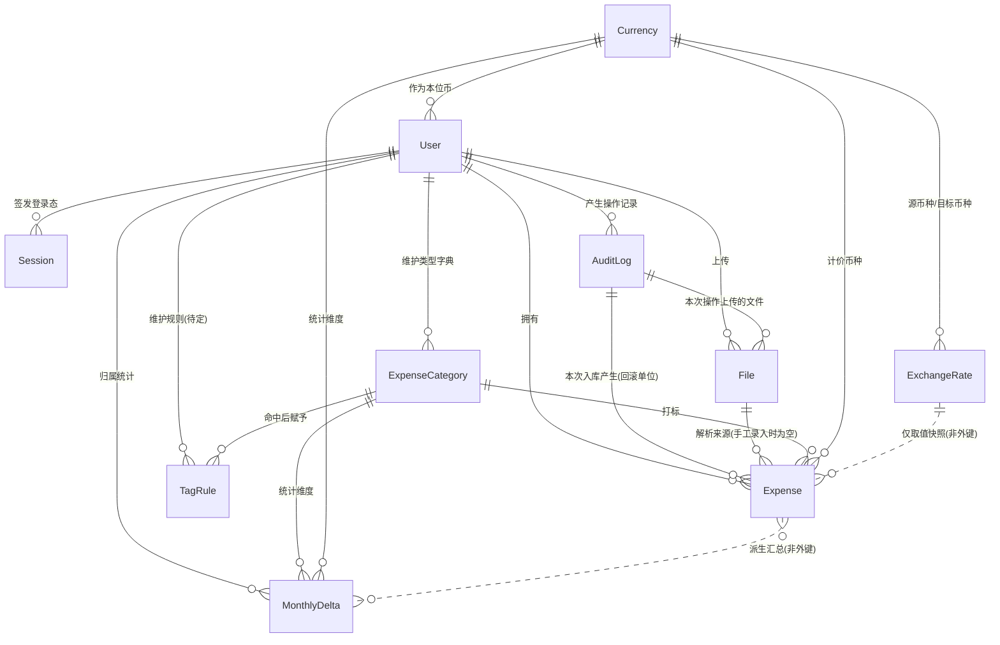
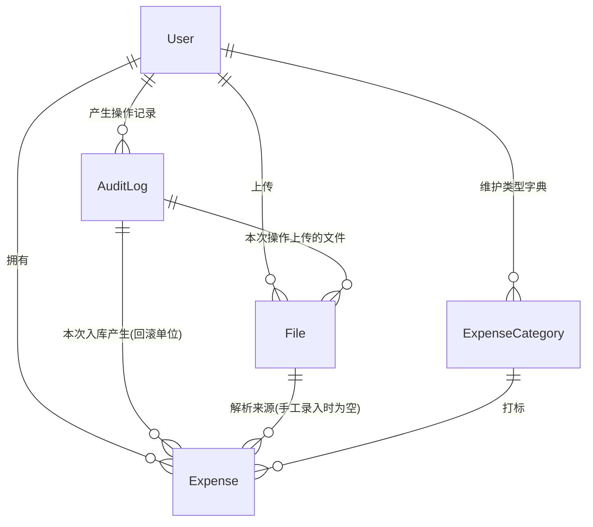
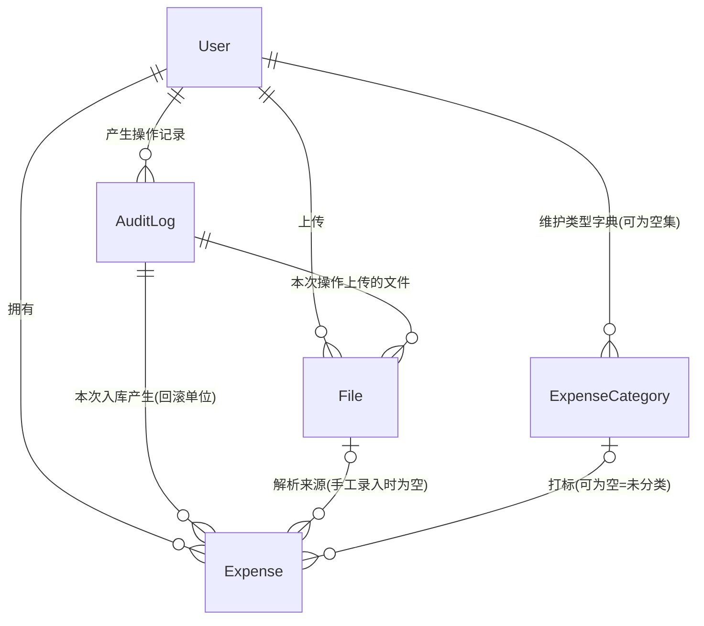

# 记账系统 · 实体模型分析

> 依据来源：`260901-223131-answer.md`「第三轮 · 终版功能体系」（11 个业务域 57 项功能、5 条全局前提、3 个议题终稿）。功能编号（如 H-3、议题 2）均指该终版一节。
> 本轮范围：纯理论建模——实体、属性、关联关系；不涉及技术实现，不写代码与 SQL，不做字段类型与索引设计。
> 凡终版中标记「待确认」的事项，其对模型的影响已在文末第六节列出，不做脑补。

---

## 一、实体关系图

**读图要点**

- `User` 是全局归属根：除 `Currency`（系统级字典）外，所有实体都直接或间接挂在用户下，对应终版前提 3 与 B-1。
- `AuditLog` 是留痕与回滚的枢纽：文件、明细都反向指向它，替代了独立的「导入批次」与「修改历史」实体。
- `Expense` 是唯一的事实实体：摊分不产生子实体，卡片不独立成表。
- 两条虚线是**非外键关系**：`MonthlyDelta` 由明细派生可重建；`ExchangeRate` 只被复制数值，不被引用。

---

## 二、实体清单与分层

| 层次     | 实体              | 中文名         | 性质                             |
| -------- | ----------------- | -------------- | -------------------------------- |
| 主数据   | `Currency`        | 币种           | 系统级只读字典                   |
| 主数据   | `ExpenseCategory` | 支出类型       | 用户级字典                       |
| 主数据   | `TagRule`         | 打标规则       | 用户级字典，**待确认是否存在**   |
| 主体     | `User`            | 用户           | 归属根                           |
| 事实     | `Expense`         | 支出明细       | 核心事实，全系统唯一的金额来源   |
| 事实     | `File`            | 文件           | 原始输入留存                     |
| 事实     | `AuditLog`        | 操作审计       | 留痕与回滚枢纽                   |
| 外部数据 | `ExchangeRate`    | 汇率           | 自动获取的外部数据落地           |
| 派生     | `MonthlyDelta`    | 月度摊分增量   | 统计加速层，可由明细完全重建     |
| 会话     | `Session`         | 登录态         | 生命周期极短，仅服务鉴权         |

---

## 三、逐实体属性说明

### 1. User 用户

| 属性                    | 业务含义                                                         | 依据 |
| ----------------------- | ---------------------------------------------------------------- | ---- |
| 用户ID                  | 唯一标识，所有业务数据的归属键                                   | B-1  |
| 用户名                  | 登录账号；管理员固定为 `admin`                                   | A-1  |
| 密码哈希、盐            | 加盐哈希后的口令，任何环节不可逆推明文                           | A-8  |
| 角色                    | 管理员 / 普通用户；决定能否进入账户管理域                        | A-7  |
| 状态                    | 启用 / 禁用；禁用后不可登录。**无删除标记——账户不可删除**        | A-7  |
| 需强制改密              | 首次登录或被重置密码后为真，为真时只能走改密流程                 | A-2  |
| 连续失败次数、锁定截止时间 | 支撑「连续失败 5 次锁定 10 分钟」                              | A-8  |
| 本位币                  | 用户级统一折算币种，默认 USD                                     | I-2  |
| 界面语言                | 用户选定的语种，对应语言配置文件的键                             | K-4  |
| 创建时间、更新时间、最后登录时间 | 常规追溯                                                | —    |

> 建模取舍：**「需强制改密」一个字段同时驱动两件事**——强制改密流程，以及 admin 初始密码是否打印到日志（A-3 规定改密后不再打印）。无需再设「初始密码是否已交付」字段。初始密码本身不落库，只存哈希。

### 2. Session 登录态

| 属性           | 业务含义                                       | 依据 |
| -------------- | ---------------------------------------------- | ---- |
| 会话ID         | 登录态标识                                     | A-4  |
| 用户ID         | 所属用户                                       | A-4  |
| 签发时间       | 登录成功的时点                                 | A-5  |
| 绝对过期时间   | 签发时间 + 12 小时，到期自动失效               | A-5  |
| 失效状态、登出时间 | 主动登出或被强制下线后置为失效             | A-4  |

> 说明：终版 A-4 要求支持主动登出，因此会话需要可被标记失效，故建为实体。是否落库属实现选择（无状态令牌则退化为不落库），但那样主动登出与强制下线将无处依附。续期语义见待确认 T9。

### 3. AuditLog 操作审计

| 属性                | 业务含义                                                              | 依据 |
| ------------------- | --------------------------------------------------------------------- | ---- |
| 审计ID              | 唯一标识；同时充当「入库批次号」的角色                                | B-4  |
| 用户ID              | 操作人，同时是数据归属人                                              | B-4  |
| 操作类型            | 登录、账户管理、文件上传、数据入库、明细编辑、明细删除、回滚等枚举    | B-4  |
| 操作对象类型、对象ID | 指向被操作的实体，支撑从审计跳转到具体数据                            | K-2  |
| 操作摘要            | 人可读描述，如「导入 37 笔，合计 1,204.50 USD」                       | K-2  |
| 变更内容            | 编辑类操作的前后值快照，**替代独立的修改历史实体**                    | B-4  |
| 操作结果            | 成功 / 失败                                                           | B-4  |
| 操作时间            | 发生时点                                                              | B-4  |
| 是否已回滚、回滚审计ID | 入库类操作被撤销后的标记，及指向执行撤销的那条审计                 | D-8  |

> 建模取舍：**一次提交 = 一条审计 = 一个回滚单位**（D-7/D-8）。这使「导入批次」不必单独建模，也让手工录入与文件导入共用同一套回滚语义。

### 4. File 文件

| 属性         | 业务含义                                                        | 依据 |
| ------------ | --------------------------------------------------------------- | ---- |
| 文件ID       | 唯一标识                                                        | C-1  |
| 归属用户ID   | 数据归属，下载时的越权校验依据                                  | B-3  |
| 来源审计ID   | 本文件在哪次操作中上传——**文件与审计双向可查的依据**            | C-3  |
| 原始文件名   | 用户上传时的文件名                                              | C-2  |
| 格式         | CSV / Excel / PDF，决定走哪个解析器                             | D-1  |
| 文件大小     | 展示与校验                                                      | C-2  |
| 存储位置     | 文件实际存放的位置标识                                          | C-2  |
| 内容校验值   | 完整性校验；也可用于识别同一文件被重复上传                      | C-2  |
| 文件密码     | 加密文档的解密口令，**明文保存**以便后续重新打开（议题 3 定案） | C-2  |
| 上传时间     | 上传时点                                                        | C-2  |

> 说明：文件只留存不物理删除（C-4），因此**没有删除标记**。

### 5. Expense 支出明细（核心实体）

**业务字段**——用户可见可编辑的七个字段（F-1、F-5）：

| 属性         | 业务含义                                                   | 依据    |
| ------------ | ---------------------------------------------------------- | ------- |
| 支出日期     | 交易发生日；未摊分口径的归月依据                           | F-1/J-1 |
| 支出金额     | 原币金额。**是否允许为负（退款、冲正）见待确认 T1**        | F-1/T1  |
| 币种         | 原币种，引用币种字典                                       | F-1/I-1 |
| 交易对手方   | 商户或收款方名称                                           | F-1     |
| 交易备注     | 账单摘要或用户自填说明                                     | F-1     |
| 支出类型     | 打标结果，引用用户级类型字典；未识别时指向「未分类」       | F-1/G-2 |
| 摊分月数     | 该笔成本分摊的月份数，默认 1，**无上限**                   | H-1     |

**系统字段**——由系统写入或派生（F-2）：

| 属性                          | 业务含义                                                                     | 依据      |
| ----------------------------- | ---------------------------------------------------------------------------- | --------- |
| 明细ID                        | 唯一标识                                                                     | —         |
| 归属用户ID                    | 数据归属                                                                     | B-1       |
| 来源审计ID                    | 属于哪次入库，**回滚以此为单位**                                             | D-7/D-8   |
| 来源文件ID                    | 从哪个文件解析而来；手工录入时为空                                           | D-4       |
| 银行名称、卡号后四位、卡片币种 | 来源标识，自动解析所得。**作为明细的值属性，不建独立实体**                  | F-2       |
| 原始摘要                      | 解析前的原始文本，供人工追溯核对                                             | F-2       |
| 折算汇率                      | 入账时所用汇率的**数值快照**，保证历史统计可复现                             | I-4       |
| 本位币金额                    | 按上述汇率折算所得                                                           | I-4       |
| 折算本位币币种                | 折算当时用户的本位币，随快照固定；用户改本位币后据此识别哪些行需重算（T6）   | I-2/T6    |
| 摊分起始月                    | = 支出日期所属月                                                             | H-2       |
| 摊分结束月                    | = 起始月 + 摊分月数 − 1。**区间穿刺查询的关键字段**                          | H-3/议题2 |
| 交易指纹                      | 由「用户 + 日期 + 金额 + 币种」生成的去重键                                  | E-1       |
| 删除标记、删除时间            | **软删除还是物理删除见待确认 T2**                                            | T2        |
| 创建时间、更新时间            | 常规追溯                                                                     | —         |

> **派生字段一致性要求**：折算汇率、本位币金额、摊分起止月、交易指纹四组均为派生值，必须在支出日期、金额、币种、摊分月数任一变更时同步刷新（F-5）。这是模型上最需要守住的不变式。

### 6. ExpenseCategory 支出类型

| 属性           | 业务含义                                                    | 依据 |
| -------------- | ----------------------------------------------------------- | ---- |
| 类型ID         | 唯一标识                                                    | G-1  |
| 归属用户ID     | **用户级字典**，各用户互不可见                              | G-1  |
| 名称           | 交通 / 餐饮 / 住宿等，单层无父子                            | G-1  |
| 是否默认未分类 | 标记「未分类」这一兜底类型，不可删除也不可停用              | G-2  |
| 是否内置       | 开户时初始化的默认类型集，用于区分系统预置与用户自建        | G-1  |
| 状态           | 启用 / 停用；被明细引用时只能停用不能删                     | G-4  |
| 排序           | 展示与选择的顺序                                            | —    |
| 创建时间、更新时间 | 常规追溯                                                | —    |

### 7. Currency 币种

| 属性       | 业务含义                                                                | 依据    |
| ---------- | ----------------------------------------------------------------------- | ------- |
| 币种代码   | ISO 代码，主键（USD、CNY、JPY 等）                                      | I-1     |
| 名称、符号 | 展示用                                                                  | I-1     |
| 小数位数   | **最小币值单位**（JPY 为 0、USD 为 2）；摊分均分取整与尾差计算的基准    | H-2     |
| 是否启用   | 系统级字典的可用范围控制                                                | I-1     |

> 说明：这是唯一不挂在用户下的实体——系统级只读，用户只引用不维护（K-1）。「小数位数」是终版补漏项，缺它则 H-2 的尾差规则无从计算。

### 8. ExchangeRate 汇率

| 属性              | 业务含义                                          | 依据   |
| ----------------- | ------------------------------------------------- | ------ |
| 汇率ID            | 唯一标识                                          | I-3    |
| 源币种、目标币种  | 折算方向                                          | I-4    |
| 日期              | 汇率所属日期；**日汇率还是月汇率见待确认 T7**     | I-4/T7 |
| 汇率值            | 折算比率                                          | I-4    |
| 获取来源、获取时间 | 自动抓取的出处与时点，便于排查异常                | I-3    |

> **关键取舍：明细不外键引用汇率记录，只复制汇率数值。** 原因有二——汇率记录会被后续刷新覆盖，引用会导致历史统计漂移；且 I-5 允许单笔手工覆盖汇率，此时根本不存在对应的汇率记录。

### 9. MonthlyDelta 月度摊分增量（派生实体）

| 属性           | 业务含义                                                     | 依据   |
| -------------- | ------------------------------------------------------------ | ------ |
| 归属用户ID     | 统计维度之一，也是归属键                                     | 议题2  |
| 月份           | YYYY-MM，端点事件落在哪个月                                  | 议题2  |
| 支出类型ID     | 统计维度，支撑月度类型分布（J-2）                            | 议题2  |
| 币种           | 统计维度，支撑币种维度统计（J-4）                            | 议题2  |
| 原币净增量     | 该维度该月的端点增量之和（原币口径）                         | 议题2  |
| 本位币净增量   | 同上，本位币口径                                             | 议题2  |
| 更新时间       | 最近一次同步时点                                             | —      |

**语义要点**

- 唯一键为「用户 + 月份 + 类型 + 币种」四元组，**行数由月份与维度基数决定，与明细笔数无关**。
- 一笔支出只在三个月份上产生端点增量：起始月 `+均分额`、结束月 `+尾差`、结束月次月 `−(均分额+尾差)`；因此写入代价与摊分月数无关，也不违反 H-3「不产生额外明细行」。
- 任意月份的摊分总额 = 该维度上截至该月的**前缀和**。
- 属派生数据，可由明细完全重建；明细的新增、编辑、删除、回滚都必须同步冲销与重写增量。
- **覆盖边界**：只能回答固定维度的统计；一旦筛选涉及对手方或备注模糊匹配，必须回落到明细的区间穿刺查询。

### 10. TagRule 打标规则（待确认实体）

> G-3 自动打标的判定方式尚未确定（待确认 T4）。以下属性仅在「关键词规则」方案下成立；若最终采用历史记忆或其他方案，本实体形态会变。**整体标记为待确认，不可断言。**

| 属性        | 业务含义                               | 依据 |
| ----------- | -------------------------------------- | ---- |
| 规则ID      | 唯一标识                               | G-3  |
| 归属用户ID  | 用户级规则                             | G-3  |
| 匹配字段    | 对手方 或 交易备注                     | G-3  |
| 匹配关键词  | 命中判定的内容                         | G-3  |
| 目标类型ID  | 命中后赋予的支出类型                   | G-3  |
| 优先级      | 多条规则同时命中时的取舍顺序           | G-3  |
| 启用状态    | 是否参与匹配                           | G-3  |

---

## 四、刻意不建实体的四项

| 候选               | 不建的理由                                                                                     | 替代方案                                        |
| ------------------ | ---------------------------------------------------------------------------------------------- | ----------------------------------------------- |
| 摊分份额           | H-3 明确要求份额不落库、不产生额外数据行                                                       | 明细上的摊分起止月 + `MonthlyDelta` 前缀和      |
| 银行卡片档案       | 不手工维护、不参与去重、无独立生命周期，只是明细的来源标注（F-2）                              | 明细上的银行名称/卡号后四位/卡片币种三个值属性  |
| 导入批次           | 终版已否决独立批次概念                                                                         | `AuditLog`，一次提交即一个回滚单位              |
| 录入预览暂存数据   | D-5 明确规定刷新或登录态失效后未提交数据全部丢失，说明它不该有服务端持久形态                    | 保持为前端会话内的临时态                        |
| 多语言文案         | K-4 要求走语言配置文件、新增语种不改代码                                                       | 配置文件，用户表只存语言选择                    |

> 若后续要「按卡片筛选或按卡片统计」，卡片才需要从值属性升格为实体；当前功能清单中没有这类诉求。

---

## 五、关键关联关系说明

| 关系                            | 基数    | 业务含义与约束                                                       |
| ------------------------------- | ------- | -------------------------------------------------------------------- |
| User → Expense / File / AuditLog / ExpenseCategory | 1:N | 归属关系，是 B-2、B-3 越权校验的落点；查询必须强制带上         |
| AuditLog → Expense              | 1:N     | 一次提交产生的全部明细；回滚即按此关系整体撤销（D-8）                |
| AuditLog → File                 | 1:N     | 一次操作涉及的文件；反向由文件的来源审计ID 实现双向可查（C-3）       |
| File → Expense                  | 1:N，可空 | 明细的解析来源；手工录入的明细此项为空                             |
| ExpenseCategory → Expense       | 1:N     | 打标关系；被引用的类型不可删除，只能停用（G-4）                      |
| Currency → Expense              | 1:N     | 计价币种；同时通过小数位数决定该笔的摊分取整基准                     |
| Currency → User                 | 1:N     | 用户的本位币选择                                                     |
| Expense ⇢ MonthlyDelta          | N:M，非外键 | 多笔支出的端点增量聚合进同一行；聚合行可由明细完全重建           |
| ExchangeRate ⇢ Expense          | 非外键  | 只复制汇率数值，不建立引用，保证历史可复现                           |

---

## 六、待确认事项对模型的影响

| 编号 | 待确认问题                     | 对模型的具体影响                                                                                   |
| ---- | ------------------------------ | -------------------------------------------------------------------------------------------------- |
| T1   | 支出金额是否允许为负           | 决定 `Expense.支出金额` 的取值域，以及负数在摊分与 `MonthlyDelta` 增量中的语义                     |
| T2   | 明细软删除还是物理删除         | 决定 `Expense` 是否需要删除标记与删除时间两个属性                                                  |
| T3   | 摊分月数默认值 1 还是 2        | 决定 `Expense.摊分月数` 的默认值（不影响结构）                                                     |
| T4   | 自动打标的判定方式             | 决定 `TagRule` 实体是否成立及其属性构成                                                            |
| T6   | 切换本位币后是否重算历史       | 若重算，`Expense` 的折算三件套需批量刷新，且 `MonthlyDelta` 的本位币净增量需**整体重建**——影响最大 |
| T7   | 汇率取日汇率还是月汇率         | 决定 `ExchangeRate.日期` 的粒度语义                                                                |
| T9   | 登录态是否可续期               | 决定 `Session` 是否需要「最后活跃时间」属性                                                        |

---

## 七、交付说明

- **交付物**：本文件——1 张实体关系图、10 个实体（含 1 个待确认实体）的完整属性说明与业务含义、4 项刻意不建实体的取舍依据、9 组关联关系说明、7 项待确认对模型的影响。
- **本轮未做**：字段类型、长度、索引、主外键约束、表结构与任何 SQL/代码——均属技术实现，按任务约束留待后续轮次。
- **校验方式**：① 逐条回溯终版 57 项功能，确认每项所需的数据都在某个实体的属性中有落点；② 反向检查每个属性都能追溯到具体功能编号，无凭空添加；③ 对终版三个议题的结论逐一验证模型是否支撑——议题 1 的汇率快照落在明细的折算三件套，议题 2 的两级优化分别落在明细的摊分起止月与 `MonthlyDelta`，议题 3 的不加密决定落在文件密码的明文属性。

---

# 第二轮 · 对话2（模型修订）

> 依据来源：`260902-004426-prompt.md`「对话2」的五条批注。
> 本节为修订后的模型，自包含可独立阅读；与上一节（对话1）冲突处 **一律以本节为准**。
> 仍不涉及技术实现，不写代码与 SQL。

## 一、五条批注的处理

| 批注                 | 处理                       | 模型变化                                                       |
| -------------------- | -------------------------- | -------------------------------------------------------------- |
| 币种改为代码枚举     | 采纳                       | 删除 `Currency` 实体；币种降为各实体上的枚举值属性             |
| 打标规则待定         | 采纳                       | 删除 `TagRule` 实体                                            |
| 汇率记在明细上       | 采纳                       | 删除 `ExchangeRate` 实体；明细补「汇率来源」一个属性           |
| 月度摊分增量看不懂   | 先解释（第二节），并建议删 | **建议**删除 `MonthlyDelta`，待你拍板                          |
| 登录态用 JWT         | 采纳                       | 删除 `Session` 实体；`User` 补「登录态基线时间」一个属性       |

实体数 10 → 5：`User`、`Expense`、`ExpenseCategory`、`File`、`AuditLog`。

---

## 二、先把「月度摊分增量」讲清楚（回答第 4 条）

### 2.1 它想解决什么问题

问「2026-03 这个月摊了多少支出」时，答案不只来自 3 月发生的支出：一笔 2024-01 花掉、摊 36 个月的支出，它的第 27 期正好落在 2026-03。所以必须把「以前发生、但摊分还没结束」的支出全找出来。摊分月数无上限（H-1），「以前」就没有边界，最坏要翻到记账第一天——这就是议题 2 的原始问题。

### 2.2 那张表到底存了什么

上一节的优化二是这样做的：不去扫明细，而是预先把每笔支出对各月份的影响，压缩成 **2~3 个「增量事件」** 记进一张按月的小表，查询时求前缀和。

以 100 JPY（0 小数位）、摊 3 个月、起始月 2026-01 为例：均分 33、尾差 1 归末月，即 33 / 33 / 34。写入的增量只有三条——起始月 `+33`、末月 `+1`、末月次月 `−34`：

| 月份                    | 2026-01 | 2026-02 | 2026-03 | 2026-04 | 2026-05 |
| ----------------------- | ------- | ------- | ------- | ------- | ------- |
| 该月增量事件            | +33     | 0       | +1      | −34     | 0       |
| **前缀和（= 该月摊分额）** | **33**  | **33**  | **34**  | **0**   | **0**   |

前缀和恰好还原 33/33/34，且末月之后自动归零。摊 1000 个月也只写这 3 行，所以写入成本与摊分月数无关；查询只扫月份行（记账 20 年 = 240 行），所以查询成本与明细总量无关。

**一句话**：`MonthlyDelta` 是一张**统计缓存表**，不承载任何新业务含义。删掉它系统功能一项不少，只是摊分统计改为扫明细。

### 2.3 为什么建议本轮直接删掉它

1. **优化一其实已经够用。** 上一节称优化一「查久远月份时，`结束月 ≥ M` 会把 M 之后的支出也纳入候选」——**该表述不成立**：筛选条件是 `起始月 ≤ M` 与 `结束月 ≥ M` 同时成立（合取），查 2020-01 时前一个条件已排除 2020-01 之后发生的全部支出。任一月份的候选集都只是「在该月之前发生、且摊分跨过该月」的支出；在 H-1 默认摊分月数为 1 的现实下，这类支出占比很低。**冲突点记录如上，本节采用后者，依据是该条件为合取、两端各自具备选择性。**
2. **成本集中在一致性，且无处可省。** 它是纯派生数据，明细的新增、编辑、删除、按审计回滚（D-7 / D-8）四条写路径都必须同步冲销与重写增量；若 T6 定为「切换本位币重算历史」，还要整体重建。个人记账的数据体量撑不起这份负担。
3. **它随时可以加回来。** 纯派生意味着可由明细完全重建，不占用任何业务字段、不影响任何业务语义。等统计真的慢了，再作为纯技术优化引入即可，不需要改业务模型。

**结论建议**：本轮模型删除 `MonthlyDelta`，只保留明细上的「摊分起始月 / 摊分结束月」两个派生字段（即优化一）。**若你要保留，按上一节第九小节原样加回即可，其余实体不受影响。**（待你拍板，记为 T15）

---

## 三、修订后实体关系图

**读图要点**

- 只剩 5 个实体，且**全部挂在 `User` 下**——不再有任何系统级表（币种、汇率都进了代码），归属校验（B-2 / B-3）的覆盖面因此更整齐。
- `AuditLog` 仍是留痕与回滚的枢纽，`Expense` 仍是唯一的事实实体。
- 图中已无虚线：非外键的两条关系（`MonthlyDelta` 派生、`ExchangeRate` 快照）随实体删除一并消失。
- **币种不出现在图上**——它是枚举值属性，不是实体。

---

## 四、属性变化（只列增删改，未提及的属性沿用上一节）

### 4.1 User

| 变化 | 属性               | 业务含义                                                                 | 依据      |
| ---- | ------------------ | ------------------------------------------------------------------------ | --------- |
| 新增 | 登录态基线时间     | 签发时间早于该值的令牌一律失效；改密、被重置密码、被禁用、强制下线时推进 | A-4 / A-7 |
| 改   | 本位币             | 由「引用币种字典」变为**存币种枚举代码**，取值合法性由应用层校验         | I-2       |
| 不变 | 连续失败次数、锁定截止时间 | 仍落在 `User` 上——登录失败时尚无令牌，无处可存                   | A-8       |

### 4.2 Expense

| 变化 | 属性                                   | 业务含义                                                                       | 依据      |
| ---- | -------------------------------------- | ------------------------------------------------------------------------------ | --------- |
| 新增 | 汇率来源                               | 枚举：自动获取（可细分提供方）/ 人工填写 / 同币种无需折算；支撑 I-5 兜底与排查 | I-3 / I-5 |
| 改   | 支出币种、卡片币种、折算本位币币种     | 三处均由「引用币种字典」变为**存币种枚举代码**                                 | I-1 / I-2 |
| 不变 | 折算汇率、本位币金额                   | 语义完全不变——本就是数值快照，删掉汇率表反而使这一点更彻底                     | I-4       |
| 不变 | 摊分起始月、摊分结束月                 | 优化一的数据前提，**保留**（即使删掉 `MonthlyDelta` 也必须有）                 | H-3       |

> **汇率方向约定**：汇率 = 1 单位原币可兑换的本位币数量，即 `本位币金额 = 支出金额 × 汇率`；原币与本位币相同时汇率恒为 1、来源为「同币种」。这是建模层的方向定义，需你确认无异议。

### 4.3 ExpenseCategory / File / AuditLog

无属性变化。

---

## 五、币种：从表变成代码枚举

**落库的只有「币种代码」一个字符串**（出现在 `User.本位币`、`Expense` 的三处币种字段上）。原 `Currency` 表的字段全部转入代码枚举定义：

| 原表字段     | 转入枚举后的角色                                             | 依据 |
| ------------ | ------------------------------------------------------------ | ---- |
| 币种代码     | 枚举项标识，也是落库的那个值                                 | I-1  |
| 名称、符号   | 枚举项的展示属性                                             | I-1  |
| 小数位数     | 枚举项属性；仍是 H-2 均分取整与尾差计算的基准，规则不变      | H-2  |
| 是否启用     | 枚举项属性                                                   | I-1  |
| （新）汇率获取实现 | 每个币种绑定自己的汇率获取方式——**这正是必须写在代码里的原因** | I-3  |

**三点连带后果**

1. **合法性校验从数据库外键降级为应用层校验**：写入前必须判定币种代码在枚举内，数据库不再提供兜底。
2. **枚举项只能停用、不能删除**：历史明细里存着旧代码，删除枚举项会导致这些明细无法展示与统计；且需为「代码不在枚举内」的历史数据准备兜底展示（原样显示代码）。
3. **新增币种 = 改代码**：新增枚举项并实现其汇率获取方式，与你的判断一致；K-1「币种为系统级只读」的表述随之落实为「代码内置、界面完全不可维护」。

---

## 六、汇率：只在明细上留快照

删除 `ExchangeRate` 实体后，一笔支出的折算信息全部自带：**折算汇率、本位币金额、折算本位币币种、汇率来源**（前三项原有，第四项本轮新增）。

- **汇率日期不单列**：I-4 规定按支出日期取汇率，与 `Expense.支出日期` 完全重合，单列即冗余；F-5 已要求改日期时同步刷新折算结果。
- **不再有汇率历史**：这是本次删表最实质的代价。**若 T6 定为「切换本位币后重算历史」，必须按每笔支出日期重新向外部拉取历史汇率**；拉不到即无法重算。此约束需在 T6 拍板时一并考虑（待确认）。
- 同一批次内相同「日期 + 币种对」的重复取值属实现层缓存，不进模型。

---

## 七、登录态：JWT 可以覆盖，不需要 `Session` 实体

令牌载荷：用户ID、角色、签发时间、过期时间（签发 + 12 小时）。

| 功能                     | JWT 能否覆盖 | 说明                                                                                          |
| ------------------------ | ------------ | --------------------------------------------------------------------------------------------- |
| A-5 最长 12 小时自动过期 | 能           | 过期时间写在载荷里，天然绝对过期                                                              |
| A-6 全局登录态校验       | 能           | 验签 + 校验过期时间，无需查库                                                                 |
| B-2 / B-3 归属过滤与校验 | 能           | 用户ID 直接取自载荷                                                                           |
| A-8 连续失败锁定         | 无关         | 登录失败时还没有令牌，两个字段必须留在 `User` 上                                              |
| K-2 登出留痕             | 能           | 记入 `AuditLog`，与是否有会话表无关                                                           |
| **A-4 主动登出**         | **部分**     | 无状态令牌无法撤销单张令牌。口径一：前端丢弃即算登出（服务端无感）；口径二：推进「登录态基线时间」= 该用户所有端下线。**需你选（T14）** |
| **A-7 禁用账户即时生效** | **有条件**   | 需每次请求校验用户状态或基线时间（多一次查库）；否则最长 12 小时后才失效                      |

> **建模取舍**：新增 `User.登录态基线时间` 一个属性，即可同时覆盖「改密后旧令牌失效」「被重置密码后失效」「被禁用后失效」「强制下线」四种场景，代价是每请求多一次用户读取——个人系统可忽略。**只有「单端登出而其他端不受影响」这一种语义，无状态令牌做不到**，那才需要令牌黑名单（本轮不建）。T9（是否可续期）不受影响：绝对过期即不续期，续期则重新签发。

---

## 八、刻意不建实体（累计 9 项）

| 候选             | 不建的理由                                                       | 替代方案                                     |
| ---------------- | ---------------------------------------------------------------- | -------------------------------------------- |
| 币种             | 新增币种需配套汇率获取实现，本质是代码变更而非数据变更           | 代码枚举 + 明细上的币种代码                  |
| 汇率             | 明细已快照汇率数值，独立表只服务于「历史重算」这一未定需求       | 明细上的折算汇率 + 汇率来源                  |
| 打标规则         | G-3 判定方式待定（T4）                                           | 暂无；T4 定为关键词规则后需加回              |
| 登录态           | JWT 载荷已含全部鉴权信息                                         | 令牌 + `User.登录态基线时间`                 |
| 月度摊分增量     | 纯统计缓存，收益不抵一致性成本（第 2.3 节）                      | 明细上的摊分起止月 + 区间穿刺查询            |
| 摊分份额         | H-3 明确要求份额不落库、不产生额外数据行                         | 同上                                         |
| 银行卡片档案     | 不手工维护、不参与去重、无独立生命周期（F-2）                    | 明细上的三个来源值属性                       |
| 导入批次         | 终版前提 4 已否决                                                | `AuditLog`，一次提交即一个回滚单位           |
| 录入预览暂存数据 | D-5 规定未提交数据全部丢失，不应有服务端持久形态                 | 前端会话内临时态                             |
| 多语言文案       | K-4 要求走配置文件                                               | 配置文件 + `User.界面语言`                   |

---

## 九、修订后关联关系（5 组）

| 关系                                              | 基数      | 业务含义与约束                                             |
| ------------------------------------------------- | --------- | ---------------------------------------------------------- |
| User → Expense / File / AuditLog / ExpenseCategory | 1:N       | 归属关系，B-2 / B-3 越权校验的落点；查询必须强制带上       |
| AuditLog → Expense                                | 1:N       | 一次提交产生的全部明细，回滚以此为单位（D-8）              |
| AuditLog → File                                   | 1:N       | 一次操作涉及的文件；反向由文件的来源审计ID 实现（C-3）     |
| File → Expense                                    | 1:N，可空 | 明细的解析来源；手工录入时为空                             |
| ExpenseCategory → Expense                         | 1:N       | 打标关系；被引用的类型不可删除，只能停用（G-4）            |

> 币种不再产生关联关系——它是值，不是引用。

---

## 十、待确认事项（更新）

| 编号 | 问题                       | 本轮带来的新影响                                                                 |
| ---- | -------------------------- | -------------------------------------------------------------------------------- |
| T14  | **（新）主动登出的口径**   | 前端丢弃令牌即可，还是登出即让该用户全部端下线？决定基线时间在登出时是否推进      |
| T15  | **（新）是否保留月度摊分增量** | 我的建议是删（第 2.3 节）；保留则需承担四条写路径的同步维护                   |
| T4   | 自动打标判定方式           | 定为关键词规则则需加回 `TagRule`；定为历史记忆则可能只需明细上的历史查询，无新实体 |
| T6   | 切换本位币是否重算历史     | **叠加新约束**：已无本地汇率历史，重算必须重新向外部拉取历史汇率，拉不到则无法重算 |
| T1 / T2 / T3 / T7 / T9 | 同上一节           | 不受本轮修订影响；T7（日汇率/月汇率）现降级为汇率获取实现的内部口径，不再影响模型结构 |

---

## 十一、交付说明

- **交付物**：本节——五条批注的逐条处理、「月度摊分增量」的通俗解释与去留建议、修订后实体关系图（5 实体）、变化属性清单、币种枚举化的三点后果、汇率快照的代价、JWT 覆盖度对照表、9 项不建实体、5 组关联关系、待确认更新。
- **本轮仍未做**：字段类型、索引、表结构、枚举的具体代码形态与任何 SQL——均属技术实现。
- **校验方式**：① 五条批注逐条比对处理结果，无遗漏；② 被删的 4 个实体，其原属性逐一确认已有落点（币种→枚举、汇率→明细快照、会话→令牌载荷 + 基线时间、摊分增量→区间穿刺），无功能丢失；③ 反查终版 57 项功能中受影响的条目（A-4、A-5、A-7、G-3、H-2、H-3、I-1~I-5、J-1、K-1），确认修订后仍有支撑；④ 与上一节的冲突点（优化一的局限性表述）已显式列出并给出采用依据。

---

# 第三轮 · 对话3（完整实体模型 · 终版）

> 依据来源：`260901-223131-answer.md`「第三轮 · 终版功能体系」（11 域 57 项功能、5 条全局前提、3 个议题终稿）+ 本文件「第二轮 · 对话2」的五条修订。功能编号（A-1、H-3、T4 等）均指前者。
> 本节为**完整重梳的终版模型，自包含可独立阅读**；与前两节冲突处一律以本节为准。
> 范围：实体、属性、关联关系的理论建模；不涉及技术实现，不写代码与 SQL，不做字段类型与索引设计。

---

## 一、实体关系图

**读图要点**

- **仅 5 个实体，且全部挂在 `User` 下**，无任何系统级表——币种与汇率都不落库。这让 B-2 查询强制过滤与 B-3 归属校验的覆盖面完全整齐：不存在「不需要归属校验」的例外表。
- **`Expense` 是唯一的事实实体**，全系统唯一的金额来源：摊分不产生子实体、卡片不独立成表、汇率不独立成表。
- **`AuditLog` 是留痕与回滚的枢纽**：文件与明细都反向指向它，替代了独立的「导入批次」与「修改历史」（前提 4）。一次提交 = 一条审计 = 一个回滚单位。
- **图外还有两样东西**：币种枚举（代码内置，第四节）与登录令牌（无状态，第五节），二者都不是实体。

---

## 二、实体清单与分层

| 层次   | 实体              | 中文名   | 性质                                     |
| ------ | ----------------- | -------- | ---------------------------------------- |
| 主体   | `User`            | 用户     | 归属根，兼登录主体与偏好载体             |
| 主数据 | `ExpenseCategory` | 支出类型 | 用户级字典                               |
| 事实   | `Expense`         | 支出明细 | 核心事实，全系统唯一的金额来源           |
| 事实   | `File`            | 文件     | 原始输入留存                             |
| 事实   | `AuditLog`        | 操作审计 | 留痕与回滚枢纽                           |

---

## 三、逐实体属性说明

### 1. User 用户

| 属性                       | 业务含义                                                             | 依据 |
| -------------------------- | -------------------------------------------------------------------- | ---- |
| 用户ID                     | 唯一标识，所有业务数据的归属键                                       | B-1  |
| 用户名                     | 登录账号；管理员固定为 `admin`                                       | A-1  |
| 密码哈希、盐               | 加盐哈希后的口令，任何环节不可逆推明文；初始密码本身不落库           | A-8  |
| 角色                       | 管理员 / 普通用户；决定能否进入账户管理域                            | A-7  |
| 状态                       | 启用 / 禁用；禁用后不可登录。**无删除标记——账户不可删除**            | A-7  |
| 需强制改密                 | 首登或被重置密码后为真，为真时只能走改密流程                         | A-2  |
| 连续失败次数、锁定截止时间 | 支撑「连续失败 5 次锁定 10 分钟」；登录失败时尚无令牌，必须落库      | A-8  |
| 登录态基线时间             | 签发时间早于该值的令牌一律失效；改密、被重置、被禁用、强制下线时推进 | A-4/A-7 |
| 本位币                     | 用户级统一折算币种，默认 USD；**存币种枚举代码**                     | I-2  |
| 界面语言                   | 用户选定的语种，对应语言配置文件的键                                 | K-4  |
| 创建时间、更新时间、最后登录时间 | 常规追溯                                                       | —    |

> **建模取舍一**：「需强制改密」一个字段驱动两件事——强制改密流程，以及 admin 初始密码是否打印到日志（A-3 规定改密后不再打印），无需再设「初始密码是否已交付」。
> **建模取舍二**：「登录态基线时间」一个字段替代整张会话表，覆盖改密失效、重置失效、禁用失效、强制下线四种场景（详见第五节）。

### 2. ExpenseCategory 支出类型

| 属性               | 业务含义                                             | 依据 |
| ------------------ | ---------------------------------------------------- | ---- |
| 类型ID             | 唯一标识                                             | G-1  |
| 归属用户ID         | **用户级字典**，各用户互不可见                       | G-1  |
| 名称               | 交通 / 餐饮 / 住宿等，单层无父子                     | G-1  |
| 是否默认未分类     | 标记「未分类」这一兜底类型，不可删除也不可停用       | G-2  |
| 是否内置           | 开户时初始化的默认类型集，区分系统预置与用户自建     | G-1  |
| 状态               | 启用 / 停用；被明细引用时只能停用不能删              | G-4  |
| 排序               | 展示与选择的顺序                                     | —    |
| 创建时间、更新时间 | 常规追溯                                             | —    |

### 3. Expense 支出明细（核心实体）

**业务字段**——用户可见可编辑的七个（F-1、F-5）：

| 属性       | 业务含义                                             | 依据    |
| ---------- | ---------------------------------------------------- | ------- |
| 支出日期   | 交易发生日；未摊分口径的归月依据，也是取汇率的日期依据 | F-1/J-1/I-4 |
| 支出金额   | 原币金额。**是否允许为负（退款、冲正）见 T1**        | F-1/T1  |
| 支出币种   | 原币种，**存币种枚举代码**                           | F-1/I-1 |
| 交易对手方 | 商户或收款方名称                                     | F-1     |
| 交易备注   | 账单摘要或用户自填说明                               | F-1     |
| 支出类型ID | 打标结果，指向用户级类型字典；未识别时指向「未分类」 | F-1/G-2 |
| 摊分月数   | 该笔成本分摊的月份数，默认 1，**无上限**             | H-1     |

**系统字段**——由系统写入或派生（F-2）：

| 属性                           | 业务含义                                                                   | 依据      |
| ------------------------------ | -------------------------------------------------------------------------- | --------- |
| 明细ID                         | 唯一标识                                                                   | —         |
| 归属用户ID                     | 数据归属                                                                   | B-1       |
| 来源审计ID                     | 属于哪次入库，**回滚以此为单位**                                           | D-7/D-8   |
| 来源文件ID                     | 从哪个文件解析而来；手工录入时为空                                         | D-4       |
| 银行名称、卡号后四位、卡片币种 | 来源标识，自动解析所得；**作为值属性，不建卡片实体**（卡片币种存枚举代码） | F-2       |
| 原始摘要                       | 解析前的原始文本，供人工追溯核对                                           | F-2       |
| 折算汇率                       | 入账时所用汇率的**数值快照**，保证历史统计可复现                           | I-4       |
| 汇率来源                       | 自动获取（可细分提供方）/ 人工填写 / 同币种无需折算；支撑 I-5 兜底与排查   | I-3/I-5   |
| 本位币金额                     | 按上述汇率折算所得                                                         | I-4       |
| 折算本位币币种                 | 折算当时用户的本位币（枚举代码），随快照固定；用户改本位币后据此识别待重算行 | I-2/T6    |
| 摊分起始月                     | = 支出日期所属月                                                           | H-2       |
| 摊分结束月                     | = 起始月 + 摊分月数 − 1；**摊分统计做区间穿刺的关键字段**                  | H-3       |
| 交易指纹                       | 由「用户 + 支出日期 + 支出金额 + 支出币种」生成的去重键                    | E-1       |
| 删除标记、删除时间             | **软删除还是物理删除见 T2**                                                | T2        |
| 创建时间、更新时间             | 常规追溯                                                                   | —         |

> **汇率方向约定**：汇率 = 1 单位原币可兑换的本位币数量，即 `本位币金额 = 支出金额 × 汇率`；原币与本位币相同时汇率恒为 1、来源为「同币种」。

### 4. File 文件

| 属性       | 业务含义                                                        | 依据 |
| ---------- | --------------------------------------------------------------- | ---- |
| 文件ID     | 唯一标识                                                        | C-1  |
| 归属用户ID | 数据归属，下载时的越权校验依据                                  | B-3  |
| 来源审计ID | 本文件在哪次操作中上传——**文件与审计双向可查的依据**            | C-3  |
| 原始文件名 | 用户上传时的文件名                                              | C-2  |
| 格式       | CSV / Excel / PDF，决定走哪个解析器（本轮仅实现 CSV）           | D-1  |
| 文件大小   | 展示与校验                                                      | C-2  |
| 存储位置   | 文件实际存放的位置标识                                          | C-2  |
| 内容校验值 | 完整性校验；也可用于识别同一文件被重复上传                      | C-2  |
| 文件密码   | 加密文档的解密口令，**明文保存**以便后续重新打开（议题 3 定案） | C-2  |
| 上传时间   | 上传时点                                                        | C-2  |

> 说明：文件只留存不物理删除（C-4），因此**没有删除标记**。

### 5. AuditLog 操作审计

| 属性                   | 业务含义                                                           | 依据 |
| ---------------------- | ------------------------------------------------------------------ | ---- |
| 审计ID                 | 唯一标识；同时充当「入库批次号」的角色                             | B-4  |
| 用户ID                 | 操作人，同时是数据归属人                                           | B-4  |
| 操作类型               | 登录、登出、账户管理、文件上传、数据入库、明细增删改、回滚等枚举   | B-4  |
| 操作对象类型、对象ID   | 指向被操作的实体，支撑从审计跳转到具体数据                         | K-2  |
| 操作摘要               | 人可读描述，如「导入 37 笔，合计 1,204.50 USD」                    | K-2  |
| 变更内容               | 编辑类操作的前后值快照，**替代独立的修改历史实体**                 | B-4  |
| 操作结果               | 成功 / 失败                                                        | B-4  |
| 操作时间               | 发生时点                                                           | B-4  |
| 是否已回滚、回滚审计ID | 入库类操作被撤销后的标记，及指向执行撤销的那条审计                 | D-8  |

---

## 四、不落库的两样东西（一）：币种枚举

币种**不是实体**，在代码里定义为枚举；库中只存「币种代码」这一个值（出现在 `User.本位币` 与 `Expense` 的三处币种字段上）。

| 枚举项内容     | 作用                                                    | 依据 |
| -------------- | ------------------------------------------------------- | ---- |
| 币种代码       | 枚举项标识，也是落库的那个值（USD、CNY、JPY…）          | I-1  |
| 名称、符号     | 展示                                                    | I-1  |
| 小数位数       | 最小币值单位；H-2 均分取整与尾差计算的基准              | H-2  |
| 是否启用       | 可选范围控制                                            | I-1  |
| **汇率获取实现** | 每个币种绑定自己的汇率获取方式——**必须写在代码里的根因** | I-3  |

**三点连带后果**

1. 合法性校验从数据库外键**降级为应用层校验**，写入前判定代码在枚举内，数据库不再兜底。
2. 枚举项**只能停用、不能删除**：历史明细里存着旧代码，删除会导致这些明细无法展示与统计；同时需为「代码已不在枚举内」的历史数据准备兜底展示（原样显示代码）。
3. **新增币种 = 改代码**（新增枚举项 + 实现其汇率获取方式）。K-1「币种系统级只读」随之落实为「代码内置、界面完全不可维护」。

---

## 五、不落库的两样东西（二）：登录令牌

登录态**不是实体**，采用无状态令牌（JWT）。载荷：用户ID、角色、签发时间、过期时间（签发 + 12 小时）。

| 功能                     | 覆盖情况   | 说明                                                                                        |
| ------------------------ | ---------- | ------------------------------------------------------------------------------------------- |
| A-5 最长 12 小时自动过期 | 能         | 过期时间写在载荷里，天然绝对过期                                                            |
| A-6 全局登录态校验       | 能         | 验签 + 校验过期时间                                                                         |
| B-2 / B-3 归属过滤与校验 | 能         | 用户ID 直接取自载荷                                                                         |
| A-8 连续失败锁定         | 与令牌无关 | 登录失败时还没有令牌，两个字段留在 `User` 上                                                |
| K-2 登出留痕             | 能         | 记入 `AuditLog`，与是否有会话表无关                                                         |
| **A-4 主动登出**         | **部分**   | 无状态令牌无法撤销单张令牌。口径一：前端丢弃即算登出；口径二：推进基线时间 = 该用户全端下线。**见 T14** |
| **A-7 禁用账户即时生效** | **有条件** | 需每次请求校验用户状态与基线时间（多一次用户读取）；否则最长 12 小时后才失效                |

> **唯一做不到的语义**：「单端登出、其他端不受影响」。它需要令牌黑名单，本轮不建；若后续必须支持，再引入一个极短生命周期的黑名单实体即可，不影响业务模型。

---

## 六、刻意不建实体（10 项）

| 候选             | 不建的理由                                                     | 替代方案                          |
| ---------------- | -------------------------------------------------------------- | --------------------------------- |
| 币种             | 新增币种需配套汇率获取实现，本质是代码变更而非数据变更         | 代码枚举 + 明细上的币种代码       |
| 汇率             | 明细已快照汇率数值，独立表只服务于「历史重算」这一未定需求     | 明细上的折算汇率 + 汇率来源       |
| 登录态           | 令牌载荷已含全部鉴权信息                                       | 令牌 + `User.登录态基线时间`      |
| 打标规则         | G-3 判定方式待定（T4）                                         | 暂无；T4 定为关键词规则后需加回   |
| 月度摊分增量     | 纯统计缓存，收益不抵一致性成本（见第七节）                     | 明细上的摊分起止月 + 区间穿刺查询 |
| 摊分份额         | H-3 明确要求份额不落库、不产生额外数据行                       | 同上                              |
| 银行卡片档案     | 不手工维护、不参与去重、无独立生命周期（F-2）                  | 明细上的三个来源值属性            |
| 导入批次         | 前提 4 已否决                                                  | `AuditLog`，一次提交即一个回滚单位 |
| 录入预览暂存数据 | D-5 规定未提交数据全部丢失，不应有服务端持久形态               | 前端会话内临时态                  |
| 多语言文案       | K-4 要求走配置文件、新增语种不改代码                           | 配置文件 + `User.界面语言`        |

> 若后续要「按卡片筛选或按卡片统计」，卡片才需从值属性升格为实体；当前 57 项功能中没有这类诉求。

---

## 七、摊分统计如何不回溯到记账第一天（议题 2 的模型落点）

**问题**：查「某月 M 摊了多少」，答案不只来自 M 月发生的支出——一笔更早发生、摊分尚未结束的支出也会落在 M 月；摊分月数无上限，「更早」没有边界。

**模型上的解法**：明细冗余「摊分起始月」与「摊分结束月」两个派生字段，查询条件变为 `起始月 ≤ M` **且** `结束月 ≥ M` 的区间穿刺。两个条件是合取，各自具备选择性——查近期月份时后者排除掉早已摊完的绝大多数支出，查久远月份时前者排除掉该月之后发生的全部支出。在 H-1 默认摊分月数为 1 的现实下，任一月份的候选集都只是「在该月之前发生、且摊分跨过该月」的少量支出。

**不引入「月度摊分增量」聚合表**：它是把每笔支出压成 2~3 个端点增量、查询求前缀和的**统计缓存**，能让成本与明细总量完全脱钩，但不承载任何新业务含义；代价是明细的新增、编辑、删除、按审计回滚四条写路径都要同步冲销重写，T6 若定为重算历史还要整体重建。个人记账的体量撑不起这份一致性负担。**它是纯派生数据、可由明细完全重建，将来真需要时作为纯技术优化加回即可，不改业务模型。**（去留见 T15）

---

## 八、关联关系（5 组）

| 关系                                               | 基数      | 业务含义与约束                                         |
| -------------------------------------------------- | --------- | ------------------------------------------------------ |
| User → Expense / File / AuditLog / ExpenseCategory | 1:N       | 归属关系，B-2 / B-3 越权校验的落点；查询必须强制带上   |
| AuditLog → Expense                                 | 1:N       | 一次提交产生的全部明细，回滚以此为单位（D-8）          |
| AuditLog → File                                    | 1:N       | 一次操作涉及的文件；反向由文件的来源审计ID 实现（C-3） |
| File → Expense                                     | 1:N，可空 | 明细的解析来源；手工录入时为空                         |
| ExpenseCategory → Expense                          | 1:N       | 打标关系；被引用的类型不可删除，只能停用（G-4）        |

> 币种不产生关联关系——它是值，不是引用。

---

## 九、模型必须守住的三条不变式

1. **派生字段随源字段刷新**（F-5）：支出日期、支出金额、支出币种、摊分月数任一变更时，「折算汇率 + 本位币金额 + 折算本位币币种」「摊分起始月 + 摊分结束月」「交易指纹」三组派生值必须同步重算。这是全模型最需要守住的一条。
2. **归属校验无死角**（B-2/B-3，议题 3）：全面不加密后应用层是唯一防线，5 个实体全部带归属用户，任何按 ID 的访问都必须校验归属——漏一处等于全量泄露，无第二层兜底。
3. **一次提交 = 一条审计 = 一个回滚单位**（D-7/D-8）：明细与文件都必须挂上来源审计ID，否则回滚失去边界。

---

## 十、待确认事项及其对模型的影响

| 编号 | 问题                             | 对模型的具体影响                                                                 |
| ---- | -------------------------------- | -------------------------------------------------------------------------------- |
| T1   | 支出金额是否允许为负             | 决定 `Expense.支出金额` 的取值域，及负数在摊分中的语义                           |
| T2   | 明细软删除还是物理删除           | 决定 `Expense` 是否保留删除标记与删除时间两个属性                                |
| T3   | 摊分月数默认 1 还是 2            | 仅影响默认值，不影响结构                                                         |
| T4   | 自动打标的判定方式               | 定为关键词规则则需加回「打标规则」实体；定为历史记忆则可能只查历史明细，无新实体 |
| T6   | 切换本位币后是否重算历史         | **叠加新约束**：已无本地汇率历史，重算须按每笔支出日期重新向外部拉取，拉不到则无法重算 |
| T7   | 汇率取日汇率还是月汇率           | 降级为汇率获取实现的内部口径，**不再影响模型结构**                               |
| T9   | 登录态是否可续期                 | 绝对过期即不续期；续期则重新签发令牌，均不引入实体                               |
| T14  | **主动登出的口径**               | 前端丢弃令牌即可，还是登出即全端下线？决定登出时是否推进「登录态基线时间」       |
| T15  | **是否保留月度摊分增量聚合**     | 建议不保留（第七节）；保留则需承担四条写路径的同步维护与整体重建                 |

---

## 十一、交付说明

- **交付物**：本节即终版实体模型——1 张实体关系图、5 个实体的完整属性与业务含义、2 样不落库设计（币种枚举、登录令牌）、10 项不建实体的取舍依据、议题 2 的模型落点、5 组关联关系、3 条不变式、9 项待确认。
- **相对前两节的实质变化**：实体由 10 收敛至 5；`Currency` / `ExchangeRate` / `Session` / `TagRule` / `MonthlyDelta` 五个实体全部消解，其能力分别落到代码枚举、明细快照属性、令牌载荷 + 基线时间、待 T4 定夺、区间穿刺查询。
- **本轮未做**：字段类型、长度、索引、主外键约束、枚举的代码形态与任何 SQL——均属技术实现。
- **校验方式**：① 逐条回溯终版 57 项功能，确认每项所需数据都有属性落点；② 反向检查每个属性都能追溯到具体功能编号；③ 被删的 5 个实体逐一确认其原属性均有替代落点，无功能丢失；④ 三个议题的结论逐一验证——议题 1 落在明细的折算四件套，议题 2 落在摊分起止月，议题 3 落在文件密码明文属性与不变式 2。

---

# 第四轮 · 对话4（模型定稿）

> 依据来源：`260902-004426-prompt.md`「对话4」的逐条批注 + 上一节（对话3）的完整模型。
> 本节先解答三个疑问，再给出修订后的完整属性清单；与前三节冲突处一律以本节为准。
> 仍不涉及技术实现，不写代码与 SQL。

---

## 一、三个疑问的解答

**Q1：「银行名称、卡号后四位、卡片币种」是三个属性挤在一个字段里吗？是 JSON 吗？**

不是。它们是**三个彼此独立的属性**，写在同一行只是表格排版上的合并（因为三者同属「卡片来源标识」这一组用途），不代表任何存储形态。本轮是理论建模，不涉及一个字段还是三个字段、是否 JSON——那是技术实现。本节已把它们拆成三行，避免歧义。

它们的来源：解析账单文件时自动识别（F-2），用户不手工维护；作用是让明细能标出「这笔是哪张卡刷的」。因为不参与去重（E-1 明确排除卡片）、无独立生命周期、也没有「按卡片统计」的功能诉求，所以是明细上的值属性，不建卡片实体。

**Q2：「原始摘要」是什么？**

是账单文件里**这笔交易所在那一行的原始文本**，未经解析器拆分与清洗，原样留存（F-2）。

用途只有一个：解析器把一行文本拆成日期 / 金额 / 对手方 / 备注之后，若怀疑拆错了，可以对照原文核对。来源文件虽然可以下载（C-4），但那是整个文件，仍要人工去找是哪一行；原始摘要是**行级证据**，直接挂在明细上。

**建议保留**——成本是一个文本属性，收益是解析错误可追溯，而 D-1 解析器插件化意味着未来会不断新增银行格式，出错概率不低。若你认为冗余，删掉不影响任何功能，只是排查解析错误时要回原文件里翻。

**Q3：交易指纹能否不存字段，直接查四要素？**

**可以，已按此修订，字段删除。** 指纹本就是「归属用户 + 支出日期 + 支出金额 + 支出币种」四要素的派生冗余，去重时直接用这四个字段做等值匹配，语义与查指纹完全一致（E-1 的四要素定义不变）。少一个必须随源字段刷新的派生值，反而更安全。代价是查重要靠四要素的组合条件——属索引层面的事，本轮不展开。

---

## 二、逐条修订与冲突处理

| 批注                              | 处理 | 模型变化                                                                 |
| --------------------------------- | ---- | ------------------------------------------------------------------------ |
| 新用户默认无支出类型              | 采纳 | **冲突**：终版 G-1 与补漏「补 2」要求开户初始化默认类型集 → 作废，采用对话4 |
| 删「是否默认未分类」「是否内置」「排序」 | 采纳 | `ExpenseCategory` 减 3 个属性，只剩 6 项                                 |
| 空类型即默认类型                  | 采纳 | **冲突**：终版 G-2「未识别落入『未分类』」的实现方式改为空值语义 → 见下   |
| 卡片三属性                        | 澄清 | 拆成三行，无实质变化                                                     |
| 原始摘要                          | 澄清 | 保留（见 Q2）                                                            |
| 汇率来源不需要                    | 采纳 | `Expense` 删该属性                                                       |
| 交易指纹改为直接查四要素          | 采纳 | `Expense` 删该属性，E-1 语义不变                                         |
| 明细软删除                        | 定案 | T2 结案，保留删除标记 + 删除时间                                         |
| 文件二进制直接存表                | 采纳 | `File.存储位置` → `File.文件内容`                                        |
| 金额允许为负、负数也摊分          | 定案 | T1 结案，摊分规则对称适用（见第五节）                                    |
| 摊分月数默认 1                    | 定案 | T3 结案                                                                  |
| 打标先不讨论、标签留空            | 挂起 | T4 挂起；`Expense.支出类型ID` 可为空                                     |
| 汇率取日汇率                      | 定案 | T7 结案，取值实现不在本轮                                                |
| 登录态不可续期                    | 定案 | T9 结案                                                                  |
| 主动登出＝前端丢弃令牌            | 定案 | T14 结案，登出不推进基线时间 → 引出 T17                                  |
| 不保留月度摊分增量                | 定案 | T15 结案，模型中本就已无该实体                                           |

> **「空类型即未分类」的连带影响**：① `ExpenseCategory` 中不再存在「未分类」这条记录，也就不需要「是否默认未分类」标记；② G-2 的业务效果保留——兜底仍在，只是从「指向一条预置记录」变为「不指向任何记录」；③ F-4 多维筛选里的「未分类」变成「类型为空」这一特殊选项，仍可筛可统计；④ G-4 删除保护多了一个处置选项：被引用的类型除迁移、停用外，也可把引用它的明细类型**置空**。
> **「新用户无默认类型」的连带影响**：补漏「补 2」担心的「新用户面对空字典无法打标」不再成立——类型可以一直空着，用户想分类时再建类型、再回头改明细（F-5 七个业务字段全部可改）。

---

## 三、修订后实体关系图

实体仍是 5 个，关联关系仍是 5 组，**结构未变**；本轮变化全部落在属性上。图上唯一的语义变化：`ExpenseCategory → Expense` 由「必填」改为「可空」，空即未分类。

---

## 四、修订后逐实体属性（完整）

### 1. User 用户

| 属性                       | 业务含义                                                        | 依据 |
| -------------------------- | --------------------------------------------------------------- | ---- |
| 用户ID                     | 唯一标识，所有业务数据的归属键                                  | B-1  |
| 用户名                     | 登录账号；管理员固定为 `admin`                                  | A-1  |
| 密码哈希、盐               | 加盐哈希后的口令，不可逆推明文；初始密码本身不落库              | A-8  |
| 角色                       | 管理员 / 普通用户；决定能否进入账户管理域                       | A-7  |
| 状态                       | 启用 / 禁用；**无删除标记——账户不可删除**                       | A-7  |
| 需强制改密                 | 首登或被重置密码后为真，为真时只能走改密流程                    | A-2  |
| 连续失败次数、锁定截止时间 | 支撑「连续失败 5 次锁定 10 分钟」；登录失败时无令牌，必须落库   | A-8  |
| 登录态基线时间             | 签发时间早于该值的令牌失效。**登出已不用它，剩余用途见 T17**    | A-7  |
| 本位币                     | 用户级统一折算币种，默认 USD；存币种枚举代码                    | I-2  |
| 界面语言                   | 用户选定的语种，对应语言配置文件的键                            | K-4  |
| 创建时间、更新时间、最后登录时间 | 常规追溯                                                  | —    |

### 2. ExpenseCategory 支出类型（6 项，较上一节减 3）

| 属性               | 业务含义                                            | 依据 |
| ------------------ | --------------------------------------------------- | ---- |
| 类型ID             | 唯一标识                                            | G-1  |
| 归属用户ID         | 用户级字典，各用户互不可见；**开户时为空集**        | G-1  |
| 名称               | 交通 / 餐饮 / 住宿等，单层无父子，全部由用户自建    | G-1  |
| 状态               | 启用 / 停用；被明细引用时不可直接删                 | G-4  |
| 创建时间、更新时间 | 常规追溯                                            | —    |

> 已删除：**是否默认未分类**（无「未分类」记录了）、**是否内置**（无预置类型了）、**排序**（降低维护成本，按名称或创建时间展示即可）。
> 备注：若认为「停用」也是多余的管理成本，可进一步退化为「只允许删除 + 引用它的明细类型置空」，G-4 的保护意图由置空承接。此项未在批注中提出，保持现状。

### 3. Expense 支出明细（核心实体）

**业务字段**——用户可见可编辑的七个（F-1、F-5）：

| 属性       | 业务含义                                                      | 依据    |
| ---------- | ------------------------------------------------------------- | ------- |
| 支出日期   | 交易发生日；未摊分口径的归月依据，也是取日汇率的日期依据      | F-1/J-1/I-4 |
| 支出金额   | 原币金额，**允许为负**（退款、冲正），负数同样参与摊分        | F-1/T1  |
| 支出币种   | 原币种，存币种枚举代码                                        | F-1/I-1 |
| 交易对手方 | 商户或收款方名称                                              | F-1     |
| 交易备注   | 账单摘要或用户自填说明                                        | F-1     |
| 支出类型ID | 打标结果，指向用户级类型字典；**可为空，空即未分类**          | F-1/G-2 |
| 摊分月数   | 该笔成本分摊的月份数，**默认 1**，无上限                      | H-1/T3  |

**系统字段**——由系统写入或派生（F-2）：

| 属性           | 业务含义                                                       | 依据    |
| -------------- | -------------------------------------------------------------- | ------- |
| 明细ID         | 唯一标识                                                       | —       |
| 归属用户ID     | 数据归属                                                       | B-1     |
| 来源审计ID     | 属于哪次入库，**回滚以此为单位**                               | D-7/D-8 |
| 来源文件ID     | 从哪个文件解析而来；手工录入时为空                             | D-4     |
| 银行名称       | 卡片来源标识之一，解析所得                                     | F-2     |
| 卡号后四位     | 卡片来源标识之一，解析所得                                     | F-2     |
| 卡片币种       | 卡片来源标识之一，存币种枚举代码                               | F-2     |
| 原始摘要       | 账单中该行的原始文本，未经拆分清洗，供核对解析结果（见 Q2）    | F-2     |
| 折算汇率       | 入账时所用日汇率的**数值快照**，保证历史统计可复现             | I-4/T7  |
| 本位币金额     | 按上述汇率折算所得                                             | I-4     |
| 折算本位币币种 | 折算当时用户的本位币（枚举代码），随快照固定；供 T6 识别待重算行 | I-2/T6  |
| 摊分起始月     | = 支出日期所属月                                               | H-2     |
| 摊分结束月     | = 起始月 + 摊分月数 − 1；摊分统计做区间穿刺的关键字段          | H-3     |
| 删除标记、删除时间 | **软删除**（T2 定案），删除动作同时记入审计                | T2/B-4  |
| 创建时间、更新时间 | 常规追溯                                                   | —       |

> 已删除：**汇率来源**（不再区分自动获取与人工填写；后果：I-5 手工指定汇率的行与自动取值的行在数据上不可分辨，排查汇率异常时无从判断来源）、**交易指纹**（改为直接查四要素，见 Q3）。
> **派生字段一致性要求**：支出日期、支出金额、支出币种、摊分月数任一变更时，「折算汇率 + 本位币金额 + 折算本位币币种」与「摊分起始月 + 摊分结束月」两组派生值必须同步刷新（F-5）。这是全模型最需要守住的不变式。

### 4. File 文件

| 属性       | 业务含义                                                          | 依据 |
| ---------- | ----------------------------------------------------------------- | ---- |
| 文件ID     | 唯一标识                                                          | C-1  |
| 归属用户ID | 数据归属，下载时的越权校验依据                                    | B-3  |
| 来源审计ID | 本文件在哪次操作中上传——文件与审计双向可查的依据                  | C-3  |
| 原始文件名 | 用户上传时的文件名                                                | C-2  |
| 格式       | CSV / Excel / PDF，决定走哪个解析器（本轮仅实现 CSV）             | D-1  |
| 文件大小   | 展示与校验                                                        | C-2  |
| **文件内容** | **文件原始二进制，直接随记录存储**（原「存储位置」作废）        | C-2  |
| 内容校验值 | 完整性校验；也可用于识别同一文件被重复上传                        | C-2  |
| 文件密码   | 加密文档的解密口令，明文保存以便后续重新打开（议题 3 定案）       | C-2  |
| 上传时间   | 上传时点                                                          | C-2  |

> 文件只留存不物理删除（C-4），因此没有删除标记。
> **改为内容内嵌的取舍**：备份与迁移收敛为单一数据源（你的目标达成），代价是数据库体积随上传量线性增长，且下载/预览会把整份文件读入——个人体量可接受，若将来出现大体积 PDF 账单需重新评估。

### 5. AuditLog 操作审计

| 属性                   | 业务含义                                                         | 依据 |
| ---------------------- | ---------------------------------------------------------------- | ---- |
| 审计ID                 | 唯一标识；同时充当「入库批次号」的角色                           | B-4  |
| 用户ID                 | 操作人，同时是数据归属人                                         | B-4  |
| 操作类型               | 登录、登出、账户管理、文件上传、数据入库、明细增删改、回滚等枚举 | B-4  |
| 操作对象类型、对象ID   | 指向被操作的实体，支撑从审计跳转到具体数据                       | K-2  |
| 操作摘要               | 人可读描述，如「导入 37 笔，合计 1,204.50 USD」                  | K-2  |
| 变更内容               | 编辑类操作的前后值快照，替代独立的修改历史实体                   | B-4  |
| 操作结果               | 成功 / 失败                                                      | B-4  |
| 操作时间               | 发生时点                                                         | B-4  |
| 是否已回滚、回滚审计ID | 入库类操作被撤销后的标记，及指向执行撤销的那条审计               | D-8  |

---

## 五、负金额摊分的语义（T1 定案后必须澄清的一点）

**规则完全对称**：负金额按同一套 H-2 规则摊分，符号保持。例：−100 JPY 摊 3 个月 → 均分 −33、尾差 −1 归末月 → −33 / −33 / −34；三个月合计恒等于 −100。

**抵消是统计层面的自然加总**，不需要建立「退款行 → 原支出行」的引用关系：月度统计把正负金额一起求和，退款自然抵减。模型上不新增任何关联，账单里通常也无法可靠地把退款行对应回原交易行。

**但有一点必须点明**：按 H-2「以支出日期所属月为第 1 个摊分月」，退款行的摊分从**退款发生月**起算。所以若某笔支出在 2026-01 发生并摊 1~3 月，退款在 2026-05 到账，那么负摊分落在 2026-05 及以后，**2026-01~03 的历史统计不会被改写**。

这与你说的「抵消之前的正金额的支出结果」可能有出入——取决于你要的是哪一种：

- **口径 A（当前模型）**：退款在发生月起摊，历史月份保持原样。符合发生制、无需回改历史，也不会让已看过的报表数字变动。
- **口径 B**：退款需冲抵回原支出所属月份。那么模型要么新增「关联原支出明细ID」，要么把「摊分起始月」从派生字段改为**可手工指定**——两者都会打破 H-2 现有的派生规则。

**记为 T16，需你拍板。** 在你确认前，模型按口径 A 保持不变。

---

## 六、本轮定案的待确认项

| 编号 | 原问题                     | 定案                                           |
| ---- | -------------------------- | ---------------------------------------------- |
| T1   | 金额是否允许为负           | 允许，负数同样摊分，代表退款                   |
| T2   | 明细软删除还是物理删除     | 软删除，保留删除标记 + 删除时间                |
| T3   | 摊分月数默认值             | 默认 1                                         |
| T7   | 日汇率还是月汇率           | 日汇率；取值实现不在建模范围                   |
| T9   | 登录态是否可续期           | 不可续期，过期重新登录                         |
| T14  | 主动登出口径               | 前端丢弃令牌即可                               |
| T15  | 是否保留月度摊分增量聚合   | 不保留                                         |

## 七、仍待确认（4 项）

| 编号 | 问题                                                                                     | 影响                                                                     |
| ---- | ---------------------------------------------------------------------------------------- | ------------------------------------------------------------------------ |
| T16  | **（新）退款的负摊分是否需要冲抵回原支出所属月份？**                                     | 口径 A 无需改模型；口径 B 需新增「关联原支出」或让摊分起始月可手工指定    |
| T17  | **（新）`User.登录态基线时间` 是否保留？** 登出已不用它，剩余用途只有改密 / 被重置 / 被禁用后令牌立即失效；若这三种也接受「最长 12 小时自然过期」，该属性可一并删除 | 保留 = 每请求多一次用户读取；删除 = `User` 少一个属性，但账户被禁用后最长 12 小时仍可访问 |
| T4   | 自动打标的判定方式（**本轮挂起**）                                                       | 定为关键词规则则需加回「打标规则」实体；在此之前明细类型一律留空          |
| T6   | 切换本位币后是否重算历史                                                                 | 已无本地汇率历史，重算须按每笔支出日期重新向外部拉取，拉不到则无法重算    |

---

## 八、交付说明

- **交付物**：本节——三个疑问的解答、17 条批注的逐条处理与 2 处冲突的采用依据、修订后实体关系图、5 个实体的完整属性清单、负金额摊分语义、7 项定案与 4 项仍待确认。
- **结构结论**：实体仍是 `User` / `Expense` / `ExpenseCategory` / `File` / `AuditLog` 5 个，关联仍是 5 组，**本轮无结构变化**；属性净减 4 个（类型 −3、明细 −2、文件 ±0 改名、明细拆分 +1 行不增属性），语义变化 2 处（类型可空、金额可负）。
- **本轮未做**：字段类型、长度、索引、二进制存储形态与任何 SQL——均属技术实现。
- **校验方式**：① 对话4 每条批注逐一比对处理结果，无遗漏；② 删除的 2 个明细属性与 3 个类型属性，逐一确认其原用途有替代落点（指纹→四要素查询、汇率来源→无替代已明示后果、未分类→空值、内置/排序→取消）；③ 反查受影响的功能条目（G-1、G-2、G-4、F-4、E-1、C-2、H-1、H-2、I-5、A-4、A-5）确认修订后仍有支撑；④ 与终版功能清单的 2 处冲突已显式列出并给出采用依据。

---

# 第五轮 · 对话5（属性必填性定稿）

> 依据来源：`260902-004426-prompt.md` 第 108 行起的批注 + 上一节（对话4）的定稿模型。
> **体例说明**：prompt 中本轮标题仍写作「### 对话4」，与上一轮重名；本节按顺序记为第五轮 / 对话5，不改动 prompt。
> 本轮只做两件事：删除一个属性、为全部属性定必填性与默认值。实体与关联关系**完全不变**（5 实体 / 5 组关联）。

---

## 一、本轮处理

| 批注                         | 处理 | 模型变化                                                     |
| ---------------------------- | ---- | ------------------------------------------------------------ |
| 原始摘要去除                 | 采纳 | `Expense` 删「原始摘要」（推翻上一节「建议保留」）           |
| User 全部必填                | 采纳 | 3 个属性需零值语义，见第三节                                 |
| 本位币默认改人民币           | 采纳 | **冲突**：终版 I-2「默认 USD」→ 作废，采用 CNY               |
| 界面语言默认中文             | 采纳 | 与 K-4「本轮仅提供中文」一致，无冲突                         |
| ExpenseCategory 全部必填     | 采纳 | 6 个属性全部必填，无例外                                     |
| Expense 8 个属性非必填       | 采纳 | 其余必填；**来源文件ID 存在冲突，见第四节**                  |
| 折算汇率必填、同币种取 1     | 采纳 | 同时确认了第三轮提出的汇率方向约定，该约定结案               |
| File 仅文件密码非必填        | 采纳 | 其余 9 个属性必填                                            |
| AuditLog 全部必填            | 采纳 | **3 个属性需零值语义才成立，见第四节**                       |

> **原始摘要删除的连带影响**：解析结果出错时，行级证据消失，只能下载来源文件（C-4）由人工在原件中定位核对。你给的理由成立——PDF 解析不存在干净的「一行原文」，强行留存反而是个语义不明的字段。

---

## 二、「必填」的口径约定（本轮的关键前提）

本轮把必填定义为：**该属性在任何一条记录上都必须有确定值，不留空**。业务上「本次不适用」的场景，以**约定的零值**表达（零时间 / 0 / 空串 / 空结构），而不是留空。

这个约定是必要的——否则「AuditLog 全部必填」无法成立：一条登录审计本就没有操作对象、没有变更前后值、也没有被回滚。有了零值约定，「不适用」是一个明确的值，而不是缺失。

本轮仍不区分「用 NULL 还是用零值」这种存储层表达，那属技术实现。下表中：**必填**=必须有确定值；**非必填**=业务上允许没有；标注 `零值` 的，是必填但存在「不适用」语义的属性。

---

## 三、逐实体必填性总表

### 1. User 用户（15 项，全部必填）

| 属性               | 必填 | 默认值 / 零值语义                    |
| ------------------ | ---- | ------------------------------------ |
| 用户ID             | 必填 | —                                    |
| 用户名             | 必填 | —                                    |
| 密码哈希、盐       | 必填 | —                                    |
| 角色               | 必填 | 新建账户为普通用户                   |
| 状态               | 必填 | 默认启用                             |
| 需强制改密         | 必填 | 新建账户与重置密码后为是             |
| 连续失败次数       | 必填 | 默认 0                               |
| 锁定截止时间       | 必填 | `零值` 零时间 = 从未锁定 / 已解锁    |
| 登录态基线时间     | 必填 | 建账时取创建时间（**去留见 T17**）   |
| 本位币             | 必填 | **默认 CNY 人民币**                  |
| 界面语言           | 必填 | **默认中文**                         |
| 创建时间、更新时间 | 必填 | —                                    |
| 最后登录时间       | 必填 | `零值` 零时间 = 从未登录             |

### 2. ExpenseCategory 支出类型（6 项，全部必填）

| 属性               | 必填 | 默认值 / 零值语义 |
| ------------------ | ---- | ----------------- |
| 类型ID             | 必填 | —                 |
| 归属用户ID         | 必填 | —                 |
| 名称               | 必填 | —                 |
| 状态               | 必填 | 默认启用          |
| 创建时间、更新时间 | 必填 | —                 |

> 开户时该字典为空集（对话4 定案），但**每一条已存在的记录，其六个属性都必须有值**——两者不矛盾。

### 3. Expense 支出明细（业务字段 7 + 系统字段 15）

**业务字段**

| 属性       | 必填       | 默认值 / 说明                          |
| ---------- | ---------- | -------------------------------------- |
| 支出日期   | 必填       | —                                      |
| 支出金额   | 必填       | 允许为负（退款）                       |
| 支出币种   | 必填       | 枚举代码                               |
| 交易对手方 | **非必填** | 账单未给出时留空                       |
| 交易备注   | **非必填** | 账单未给出时留空                       |
| 支出类型ID | **非必填** | **空即未分类**（对话4 定案）           |
| 摊分月数   | 必填       | 默认 1                                 |

**系统字段**

| 属性           | 必填       | 默认值 / 说明                                          |
| -------------- | ---------- | ------------------------------------------------------ |
| 明细ID         | 必填       | —                                                      |
| 归属用户ID     | 必填       | —                                                      |
| 来源审计ID     | 必填       | 每笔明细必属于某次入库，回滚以此为单位                 |
| 来源文件ID     | **待确认** | 未列入非必填清单，但手工录入无来源文件——**见第四节 T19** |
| 银行名称       | **非必填** | 解析不出时留空                                         |
| 卡号后四位     | **非必填** | 同上                                                   |
| 卡片币种       | **非必填** | 同上                                                   |
| 折算汇率       | 必填       | **支出币种 = 折算本位币币种时取 1**                    |
| 本位币金额     | 必填       | = 支出金额 × 折算汇率                                  |
| 折算本位币币种 | 必填       | 折算当时用户的本位币，随快照固定                       |
| 摊分起始月     | 必填       | = 支出日期所属月                                       |
| 摊分结束月     | 必填       | = 起始月 + 摊分月数 − 1                                |
| 删除标记       | **非必填** | 见第四节 T18                                           |
| 删除时间       | **非必填** | 未删除时无值                                           |
| 创建时间、更新时间 | 必填   | —                                                      |

> 「原始摘要」已删除。**汇率方向约定就此结案**：汇率 = 1 单位原币可兑换的本位币数量，`本位币金额 = 支出金额 × 折算汇率`，同币种取 1——与你本轮的表述完全一致。

### 4. File 文件（10 项，仅文件密码非必填）

| 属性       | 必填       | 说明                                     |
| ---------- | ---------- | ---------------------------------------- |
| 文件ID     | 必填       | —                                        |
| 归属用户ID | 必填       | —                                        |
| 来源审计ID | 必填       | 每个文件必属于某次上传操作               |
| 原始文件名 | 必填       | —                                        |
| 格式       | 必填       | 决定走哪个解析器                         |
| 文件大小   | 必填       | —                                        |
| 文件内容   | 必填       | 原始二进制，直接随记录存储               |
| 内容校验值 | 必填       | —                                        |
| 文件密码   | **非必填** | 仅加密文档才有                           |
| 上传时间   | 必填       | —                                        |

### 5. AuditLog 操作审计（11 项，全部必填，3 项依赖零值语义）

| 属性         | 必填 | 默认值 / 零值语义                                    |
| ------------ | ---- | ---------------------------------------------------- |
| 审计ID       | 必填 | —                                                    |
| 用户ID       | 必填 | —                                                    |
| 操作类型     | 必填 | 枚举                                                 |
| 操作对象类型 | 必填 | `零值` 空 = 本次操作无具体对象（如登录、登出）       |
| 对象ID       | 必填 | `零值` 0 / 空 = 同上                                 |
| 操作摘要     | 必填 | 人可读描述                                           |
| 变更内容     | 必填 | `零值` 空结构 = 非编辑类操作，无前后值               |
| 操作结果     | 必填 | 成功 / 失败                                          |
| 操作时间     | 必填 | —                                                    |
| 是否已回滚   | 必填 | 默认否                                               |
| 回滚审计ID   | 必填 | `零值` 0 / 空 = 尚未被回滚                           |

---

## 四、需要你确认的三处

**T19 — `Expense.来源文件ID` 该不该必填？**
它没有出现在你列的非必填清单里，但终版 D-4 规定录入有三个入口：文件导入、**手工新增**、明细补录；后两者没有来源文件。若强制必填，手工录入的明细将无值可填。**已暂按非必填处理**，请确认；若你希望必填，则需要为手工录入约定一个「无文件」的零值。

**T18 — `删除标记` 与 `删除时间` 是否合并？**
两者都定为非必填时，`删除标记` 是冗余的——「删除时间有值」本身就等价于「已删除」。**建议只保留删除时间（为空即未删除）**，少一个必须同步维护的状态位。等你一句话确认。

**AuditLog 三处零值语义是否认可？**
「全部必填」要成立，`操作对象类型` / `对象ID` / `变更内容` 三项必须接受第二节的零值约定（登录类审计本就没有操作对象与变更内容）。若你不接受零值、认为它们业务上就该允许没有，则这三项应改为非必填。**当前按零值约定处理。**

---

## 五、待确认清单（累计 6 项）

| 编号 | 问题                                                     | 状态                                                     |
| ---- | -------------------------------------------------------- | -------------------------------------------------------- |
| T16  | 退款的负摊分是否需要冲抵回原支出所属月份                 | 未答；当前按口径 A（退款从发生月起摊，历史月份不改写）   |
| T17  | `User.登录态基线时间` 是否保留                           | 未答；当前保留并定为必填                                 |
| T18  | **（新）删除标记与删除时间是否合并为一个**               | 建议合并，留删除时间                                     |
| T19  | **（新）`Expense.来源文件ID` 必填还是非必填**            | 暂按非必填（D-4 手工录入无来源文件）                     |
| T4   | 自动打标的判定方式                                       | 本轮仍挂起；在此之前明细类型一律留空                     |
| T6   | 切换本位币后是否重算历史                                 | 未答；已无本地汇率历史，重算须重新向外部拉取             |

---

## 六、交付说明

- **交付物**：本节——原始摘要删除的处理与影响、必填口径约定、5 个实体共 54 个属性的必填性与默认值总表、3 处需确认项、6 项待确认。
- **结构结论**：实体与关联关系**零变化**；属性净减 1（原始摘要）；新增 2 个默认值（本位币 CNY、界面语言中文）；确认 1 项旧约定（汇率方向）。
- **本轮未做**：字段类型、长度、NULL 与零值的存储层选择、索引与任何 SQL——均属技术实现。
- **校验方式**：① 你列出的 8 个非必填 Expense 属性逐一比对，全部落位，并发现「来源文件ID 未列入但业务上应可空」这一遗漏项；② 「全部必填」的三个实体逐属性检查是否存在「业务上不适用」的场景，检出 User 2 项、AuditLog 3 项，均以零值约定收口并显式列出；③ 与终版功能清单的 1 处冲突（I-2 默认 USD）已列明并采用最新口径。

---

# 第六轮 · 对话6

> 依据来源：`260902-004426-prompt.md`「对话6」批注 + 上一节（对话5）的必填性定稿。
> 本轮：解答 1 个疑问、结案 4 项待确认、删除 2 个属性；实体与关联关系仍**零变化**。

---

## 一、「登录态基线时间」是什么

**它要解决的问题**：无状态令牌一经签发就自带 12 小时有效期，服务端不留任何记录，因此**没有办法把一张已经发出去的令牌作废**。

**它的做法**：在 `User` 上放一个时间戳，校验令牌时多做一条判断——**令牌的签发时间 ≥ 该用户的基线时间，才算有效**。需要让某用户此前签发的令牌全部立即失效时，把这个时间戳推到当前时间即可。

**一个属性覆盖四个场景**：用户自助改密、管理员重置其密码、账户被禁用、强制下线。代价是每次请求要读一次用户记录（否则拿不到基线时间）。

**现在它还剩什么用**：对话5 已定「主动登出 = 前端丢弃令牌」，登出不再用它。剩下三个场景——改密、被重置、被禁用。

**我的建议是保留**，理由两条：① A-7 允许管理员禁用账户，而议题 3 定案后应用层是唯一防线，被禁用的账户若还能继续读写自己的全部数据最长 12 小时，与「禁用」的语义直接冲突；② 用户主动改密往往正是因为怀疑口令泄露，此时旧令牌仍可用等于改密无效。**T17 待你一句话确认。**

---

## 二、逐条处理

| 批注                                       | 处理           | 模型变化                                                   |
| ------------------------------------------ | -------------- | ---------------------------------------------------------- |
| 登录态基线时间是什么                       | 已解释（第一节） | 建议保留，T17 待确认                                       |
| `来源文件ID` 非必填                        | **T19 结案**   | 按非必填；手工新增与补录的明细此项为空                     |
| 删除标记与删除时间合并，只留删除时间       | **T18 结案**   | `Expense` 删「删除标记」，**删除时间有值即已删除**         |
| `折算本位币币种` 不需要，已在 `User.本位币` | 采纳           | `Expense` 删该属性——**成立的前提是下一条**                 |
| AuditLog 零值语义认可                      | 结案           | 3 项零值约定生效，无属性变化                               |
| 切换本位币后全量重算本位币金额             | **T6 结案**    | 见第三节；这是删除 `折算本位币币种` 能够成立的依据         |

> **两条批注是自洽的**：`折算本位币币种` 原本的唯一用途，就是在用户改本位币后识别「哪些行还是旧本位币口径、需要重算」。既然定为**全量重算**，重算完成后不存在混合口径的行，当前本位币由 `User.本位币` 唯一确定，该属性确实冗余。

---

## 三、切换本位币全量重算的连带影响（T6 结案）

**重算的范围要比「本位币金额」大一项**：`折算汇率` 也必须一起重写。汇率的方向是「1 单位原币 → 本位币」，本位币换了，汇率值本身就变了；只改金额不改汇率，两者会互相矛盾（`本位币金额 = 支出金额 × 折算汇率` 不再成立）。

**不需要重算的**：摊分起始月、摊分结束月——它们只由支出日期与摊分月数决定，与币种无关。原币金额、支出币种同样不变。

**数据来源问题（重要）**：对话2 已删除汇率表，系统没有本地汇率历史。全量重算必须**按每笔明细的支出日期，重新向外部拉取「原币 → 新本位币」的历史日汇率**。记账三年的用户切换一次本位币，就是一次覆盖全部历史日期的批量外部取数。

由此产生三个必须明确的点：

1. **拉不到历史汇率怎么办？** 这是新的待确认 **T20**。三种可选口径：① 阻断切换，提示哪些日期取不到；② 该笔保留原值并标记待处理；③ 转人工填写。**口径 ② 会重新引入混合口径的行，那样 `折算本位币币种` 就不能删——这两个决定是绑定的。**
2. **重算的中间态不可识别**。删掉 `折算本位币币种` 后，数据上无法分辨某一行是新口径还是旧口径。因此重算必须**整体成功或整体回滚**，不允许留下部分完成的状态。这是模型层面的前提条件，具体保障方式属实现。
3. **已软删除的明细是否一并重算？** 建议一并重算——否则恢复或在审计中查看时数字与全局口径不一致。

**两条必然代价（已由你的决定确定，仅记录）**：

- 终版 I-4「汇率随明细留存，保证历史统计可复现」的语义被削弱：切换本位币后，历史月度报表的本位币数字会整体改变。这正是「统一口径」的目的，但用户需要被明确告知。
- 切换本位币是一次改写全库明细的重操作，应记入 `AuditLog`（B-4），并在切换前提示影响范围。

---

## 四、Expense 修订后完整属性表

**业务字段（7 项）**

| 属性       | 必填       | 说明                             |
| ---------- | ---------- | -------------------------------- |
| 支出日期   | 必填       | 也是取日汇率的日期依据           |
| 支出金额   | 必填       | 允许为负（退款）                 |
| 支出币种   | 必填       | 枚举代码                         |
| 交易对手方 | 非必填     | 账单未给出时留空                 |
| 交易备注   | 非必填     | 账单未给出时留空                 |
| 支出类型ID | 非必填     | 空即未分类                       |
| 摊分月数   | 必填       | 默认 1，无上限                   |

**系统字段（13 项，较上一节减 2）**

| 属性           | 必填       | 说明                                                     |
| -------------- | ---------- | -------------------------------------------------------- |
| 明细ID         | 必填       | —                                                        |
| 归属用户ID     | 必填       | —                                                        |
| 来源审计ID     | 必填       | 回滚以此为单位                                           |
| 来源文件ID     | **非必填** | 手工新增与补录时为空（T19 结案）                         |
| 银行名称       | 非必填     | 解析不出时留空                                           |
| 卡号后四位     | 非必填     | 同上                                                     |
| 卡片币种       | 非必填     | 同上                                                     |
| 折算汇率       | 必填       | 支出币种 = 用户本位币时取 1；**切换本位币时随之重算**    |
| 本位币金额     | 必填       | = 支出金额 × 折算汇率；**切换本位币时随之重算**          |
| 摊分起始月     | 必填       | = 支出日期所属月；切换本位币不影响                       |
| 摊分结束月     | 必填       | = 起始月 + 摊分月数 − 1；切换本位币不影响                |
| 删除时间       | **非必填** | **有值即已删除**（T18 结案，删除标记已并入）             |
| 创建时间、更新时间 | 必填   | —                                                        |

> 已删除：**折算本位币币种**（当前本位币由 `User.本位币` 唯一确定）、**删除标记**（并入删除时间）。
> **派生字段一致性**：支出日期 / 支出金额 / 支出币种 / 摊分月数任一变更时，「折算汇率 + 本位币金额」与「摊分起始月 + 摊分结束月」必须同步刷新（F-5）；**用户本位币变更时，全部明细的前一组必须整体重算**（T6）。

---

## 五、当前模型全貌速览

| 实体              | 属性数 | 非必填属性                                             |
| ----------------- | ------ | ------------------------------------------------------ |
| `User`            | 15     | 无（3 项用零值表达「不适用」）                         |
| `ExpenseCategory` | 6      | 无                                                     |
| `Expense`         | 20     | 交易对手方、交易备注、支出类型ID、来源文件ID、银行名称、卡号后四位、卡片币种、删除时间（8 项） |
| `File`            | 10     | 文件密码                                               |
| `AuditLog`        | 11     | 无（3 项用零值表达「不适用」）                         |

关联关系仍是 5 组，不落库的两样仍是币种枚举与登录令牌。

---

## 六、待确认清单（3 项）

| 编号 | 问题                                                     | 状态                                                                 |
| ---- | -------------------------------------------------------- | -------------------------------------------------------------------- |
| T20  | **（新）全量重算时历史汇率取不到怎么办**                 | 三种口径见第三节；**选口径 ②（保留原值）则 `折算本位币币种` 必须留着** |
| T17  | `User.登录态基线时间` 是否保留                           | 已解释，建议保留，待你一句话确认                                     |
| T16  | 退款的负摊分是否冲抵回原支出所属月份                     | 未答；当前按口径 A（从退款发生月起摊，不改写历史）                   |
| T4   | 自动打标的判定方式                                       | 挂起；在此之前明细类型一律留空                                       |

（T6 / T18 / T19 本轮结案，T1 / T2 / T3 / T7 / T9 / T14 / T15 已于前轮结案。）

---

## 七、交付说明

- **交付物**：本节——「登录态基线时间」的解释与保留建议、6 条批注的逐条处理、全量重算的范围界定与三点连带影响、`Expense` 修订后完整属性表、模型全貌速览、4 项待确认。
- **结构结论**：实体与关联关系零变化；`Expense` 属性由 22 减至 20。
- **本轮未做**：重算的事务与断点机制、汇率获取实现、任何 SQL——均属技术实现。
- **校验方式**：① 6 条批注逐一比对处理结果；② 验证「删除折算本位币币种」与「全量重算」两条批注互为前提，并指出 T20 选口径 ② 时该前提不成立；③ 检查重算范围，补出批注未提及但必须一起重算的 `折算汇率`，并确认摊分两字段无需重算；④ 与终版 I-4「历史统计可复现」的语义冲突已列明并记录代价。

---

# 第七轮 · 对话7

> 依据来源：`260902-004426-prompt.md`「对话7」批注 + 上一节（对话6）。
> 本轮：结案 2 项待确认、恢复 1 个属性、修订上一轮关于重算原子性的结论、提出 1 个新问题。实体与关联关系仍**零变化**。

---

## 一、逐条处理

| 批注                                     | 处理         | 模型变化                                                        |
| ---------------------------------------- | ------------ | --------------------------------------------------------------- |
| 登录态基线时间：采纳                     | **T17 结案** | `User.登录态基线时间` 保留，必填                                |
| 保留 `折算本位币币种`                    | **T20 结案** | 恢复该属性；`Expense` 属性回到 21                               |
| 三字段在一个事务中 update                | 采纳         | **修订上一轮结论**：放弃全局原子性，改为单笔原子（见第二节）    |
| 汇率查询失败的行靠筛选找出、人工编辑     | 采纳         | **F-4 需新增筛选项**（见第二节），修复路径复用 I-5              |
| 软删除明细一并重算，失败就失败           | 采纳         | 影响可控，理由见第四节                                          |

> 这正是上一轮 T20 里提示的口径 ②，与「保留 `折算本位币币种`」互为前提——两条批注自洽。

---

## 二、重算流程的模型语义（保留该属性后）

**1. 待重算集合成为一个可直接查询的条件**

> `Expense.折算本位币币种 ≠ User.本位币` 的行，就是尚未重算（或重算失败）的行。

这一条同时承担三个角色：重算任务的输入、失败行的定位条件、以及数据是否已收敛的判定依据。

**2. 原子性的粒度从全局降到单笔——修订上一轮结论**

上一轮在没有该属性的前提下断言「重算必须整体成功或整体回滚」。**保留该属性后这个结论不再成立且不必要**：中间态现在是可识别的，因此只需保证**单笔内「折算汇率 / 本位币金额 / 折算本位币币种」三者同事务更新**（加上 `更新时间` 常规刷新）。任何一笔失败都不影响其他笔，也不需要回滚已成功的部分。

**3. 重算天然幂等、可续跑**

因为待重算集合由「币种不等」定义，重算任务可以随时中断、随时重跑，只处理仍然不等的行；重复执行不会把已重算的行算第二遍。这是保留该属性带来的一个额外好处——**切换本位币不再需要是一次性完成的重操作**。

**4. 失败行的修复路径**

- **定位**：列表页按「折算本位币币种」筛选。**但终版 F-4 的筛选维度是「日期区间、金额区间、币种、对手方、备注、支出类型、摊分月数、来源审计/文件」，不含折算本位币币种**——需要新增这一筛选项，否则你说的定位方式无从执行。这是本轮引出的**功能层新增点**，已记录。
- **修复**：手动编辑填入汇率，正是 I-5「允许对单笔明细手工指定实际成交汇率」的既有路径，**不需要新功能**，只是触发场景从「入库时取不到汇率」扩展到「切换本位币时取不到汇率」。

---

## 三、混合口径下的统计怎么办（新问题 T21）

重算失败的行仍是旧本位币口径。J-1 月度总额、J-2 类型分布、J-3 趋势、F-6 筛选态累计统计都会算「本位币折算总额」——**直接相加等于把两种币种的数字加在一起**，数字失真且不易察觉。

三种口径：

| 口径                       | 代价                                                     |
| -------------------------- | -------------------------------------------------------- |
| ① 照常相加                 | 数字静默失真，最危险                                     |
| ② **照常算，但页面明示**   | 显示「有 N 笔未按当前本位币折算」并可一键跳到这些行      |
| ③ 阻断统计直到全部修复     | 一笔取不到汇率就看不了任何统计，代价过大                 |

**建议口径 ②**：与 I-5「不静默按 1:1 处理」的既有立场一致——不隐瞒、不阻断。**记为 T21，待你拍板。**

---

## 四、软删除明细重算失败的影响（确认你的判断）

**你的判断成立，影响确实可控**，理由是软删除的明细本就不参与列表（F-3/F-4）与统计（J 域、F-6），所以它停留在旧本位币口径不会污染任何对外数字。

两处残留影响，仅记录不改变决定：

- 从 `AuditLog` 追溯查看该笔明细时（K-2 可跳转到关联明细），看到的是旧口径金额。
- K-3 数据导出/备份若包含已删除数据，导出文件里会混有旧口径行。

当前 57 项功能中**没有「恢复已删除明细」这一项**，因此不存在「恢复后口径不一致」的风险。

---

## 五、Expense 属性表（恢复后 · 21 项）

**业务字段（7 项）**：支出日期、支出金额、支出币种（以上必填）、交易对手方、交易备注、支出类型ID（以上非必填）、摊分月数（必填，默认 1）。较上一节无变化。

**系统字段（14 项）**

| 属性               | 必填       | 说明                                                       |
| ------------------ | ---------- | ---------------------------------------------------------- |
| 明细ID             | 必填       | —                                                          |
| 归属用户ID         | 必填       | —                                                          |
| 来源审计ID         | 必填       | 回滚以此为单位                                             |
| 来源文件ID         | 非必填     | 手工新增与补录时为空                                       |
| 银行名称           | 非必填     | 解析不出时留空                                             |
| 卡号后四位         | 非必填     | 同上                                                       |
| 卡片币种           | 非必填     | 同上                                                       |
| **折算汇率**       | 必填       | 原币 = 本位币时取 1；**与下两项同事务更新**                |
| **本位币金额**     | 必填       | = 支出金额 × 折算汇率；**与上下两项同事务更新**            |
| **折算本位币币种** | 必填       | **恢复**。折算当时的本位币；≠ `User.本位币` 即待重算/重算失败 |
| 摊分起始月         | 必填       | = 支出日期所属月；切换本位币不影响                         |
| 摊分结束月         | 必填       | = 起始月 + 摊分月数 − 1；切换本位币不影响                  |
| 删除时间           | 非必填     | 有值即已删除                                               |
| 创建时间、更新时间 | 必填       | 三字段更新时同步刷新更新时间                               |

> **派生字段一致性（终版）**：① 支出日期 / 支出金额 / 支出币种 / 摊分月数任一变更时，「折算汇率 + 本位币金额 + 折算本位币币种」与「摊分起始月 + 摊分结束月」同步刷新；② 用户本位币变更时，逐笔重算前一组三字段，**单笔同事务、允许部分失败、可续跑**。

**模型全貌**：`User` 15、`ExpenseCategory` 6、`Expense` 21、`File` 10、`AuditLog` 11；5 实体 / 5 组关联，不落库的仍是币种枚举与登录令牌。

---

## 六、待确认清单（3 项）

| 编号 | 问题                                       | 状态                                                   |
| ---- | ------------------------------------------ | ------------------------------------------------------ |
| T21  | **（新）混合口径下统计如何展示**           | 建议口径 ②（照常算 + 明示 N 笔未折算），待你拍板       |
| T16  | 退款的负摊分是否冲抵回原支出所属月份       | 未答；当前按口径 A（从退款发生月起摊，不改写历史）     |
| T4   | 自动打标的判定方式                         | 挂起；在此之前明细类型一律留空                         |

（T17 / T20 本轮结案；T1 / T2 / T3 / T6 / T7 / T9 / T14 / T15 / T18 / T19 已于前轮结案。）

**本轮引出的功能层新增点（非待确认，需并入功能清单）**：F-4 多维筛选需增加「折算本位币币种」筛选项。

---

## 七、交付说明

- **交付物**：本节——5 条批注的逐条处理、重算流程的四条模型语义（含对上一轮原子性结论的修订）、混合口径统计问题与建议、软删除失败影响的核实、`Expense` 21 项属性表、3 项待确认与 1 项功能新增点。
- **结构结论**：实体与关联关系零变化；`Expense` 属性由 20 恢复至 21。
- **本轮未做**：重算任务的调度与断点机制、汇率获取实现、任何 SQL——均属技术实现。
- **校验方式**：① 5 条批注逐一比对；② 核实「保留折算本位币币种」与上一轮 T20 口径 ② 的绑定关系成立；③ **主动修订**上一轮「重算必须整体成功或整体回滚」的结论，因其前提（中间态不可识别）已不复存在；④ 验证你给的定位方式能否执行，检出 F-4 缺少该筛选维度；⑤ 核实软删除行确实不参与列表与统计，确认你的判断成立，并查明当前功能清单无「恢复已删除明细」项。

---

# 第八轮 · 对话8

> 依据来源：`260902-004426-prompt.md`「对话8」批注 + 上一节（对话7）。
> 本轮：结案最后 2 项待确认、新增 1 项功能。**实体、关联关系、属性全部零变化——模型至此收敛**。

---

## 一、逐条处理

| 批注                                 | 处理         | 影响                                                       |
| ------------------------------------ | ------------ | ---------------------------------------------------------- |
| 混合口径按字面数值统计               | **T21 结案** | 采口径 ①；统计侧不做任何提示，无模型变化                   |
| 新增「按当前本位币重算」功能         | 采纳         | **功能清单增 1 项（I-7）**，无实体/属性变化                |
| 退款负摊分从退款发生月起摊、不改写历史 | **T16 结案** | 采口径 A；当前模型本就如此，无变化                         |

---

## 二、新增功能 I-7「本位币金额重算」

| 维度     | 定义                                                                                     |
| -------- | ---------------------------------------------------------------------------------------- |
| 触发     | 用户主动发起，**不需要先切换本位币**；切换本位币时视为自动触发一次，二者共用同一套逻辑   |
| 目标口径 | 用户**当前**设置的本位币（`User.本位币`）                                                |
| 处理范围 | 本人全部明细，**含已软删除的明细**（与对话7 口径一致）                                   |
| 跳过条件 | `折算本位币币种 = User.本位币` 的行直接跳过——即第七轮定义的「待重算集合」的补集          |
| 单笔处理 | 拉取该笔支出日期的日汇率 → 计算本位币金额 → **折算汇率 / 本位币金额 / 折算本位币币种三者同事务更新**（并刷新更新时间） |
| 失败处理 | 单笔失败不影响其他笔，该行保持原值与原折算币种，下次重算仍会被选中                       |
| 幂等性   | 由「币种不等」定义待处理集合，天然幂等、可中断、可续跑                                   |
| 结果反馈 | 成功 / 失败笔数，承载于 `AuditLog.操作摘要`                                              |
| 留痕     | 记入 `AuditLog`，`操作类型` 枚举新增「本位币金额重算」（B-4）                            |

**模型影响：零。** 不新增实体、不新增属性——它把第七轮已经具备的「幂等可续跑」性质显式暴露成一个用户可点的动作。

**修复链路至此闭环**：`F-4 按折算本位币币种筛选`（定位未重算的行）→ `I-7 一键重算`（能取到汇率的自动修复）→ `I-5 手工指定汇率`（取不到汇率的逐笔兜底）。三者分工明确，无功能重叠。

---

## 三、T21 结案的连带说明（仅记录）

统计侧不做任何提示后，未重算的行会静默混入本位币合计（J-1 / J-2 / J-3 / F-6）。你的定位是「数据本身有问题，不是统计的问题」，与新增的 I-7 正好配套：**统计不承担纠错职责，纠错由 I-7 与 I-5 承担，发现问题靠 F-4 筛选**。

---

## 四、功能清单增补（累计 2 项，57 → 58）

| 编号  | 内容                                                                     | 来源     |
| ----- | ------------------------------------------------------------------------ | -------- |
| F-4 增补 | 多维筛选新增「折算本位币币种」筛选项，用于定位未按当前本位币折算的明细 | 对话7    |
| I-7 新增 | 本位币金额重算：按当前本位币重算全部明细的折算三字段，已是当前本位币的跳过 | 对话8    |

---

## 五、待确认清单（仅剩 1 项）

| 编号 | 问题               | 状态                                                          |
| ---- | ------------------ | ------------------------------------------------------------- |
| T4   | 自动打标的判定方式 | **由你明确挂起**；在此之前明细类型一律留空，模型中无打标规则实体 |

T1 / T2 / T3 / T6 / T7 / T9 / T14 / T15 / T16 / T17 / T18 / T19 / T20 / T21 全部结案。

---

## 六、模型定稿状态

| 实体              | 属性数 | 非必填属性                                                                       |
| ----------------- | ------ | -------------------------------------------------------------------------------- |
| `User`            | 15     | 无（锁定截止时间、最后登录时间等 3 项以零值表达「不适用」）                      |
| `ExpenseCategory` | 6      | 无                                                                               |
| `Expense`         | 21     | 交易对手方、交易备注、支出类型ID、来源文件ID、银行名称、卡号后四位、卡片币种、删除时间 |
| `File`            | 10     | 文件密码                                                                         |
| `AuditLog`        | 11     | 无（操作对象类型、对象ID、变更内容以零值表达「不适用」）                         |

**5 实体 / 5 组关联 / 63 个属性**；不落库的两样：币种枚举（代码内置，含汇率获取实现）、登录令牌（无状态 + `User.登录态基线时间`）。

**四条必须守住的不变式**

1. 支出日期 / 支出金额 / 支出币种 / 摊分月数任一变更时，「折算汇率 + 本位币金额 + 折算本位币币种」与「摊分起始月 + 摊分结束月」同步刷新（F-5）。
2. 本位币重算逐笔进行，单笔三字段同事务，允许部分失败，可续跑（I-7）。
3. 归属校验无死角——全面不加密后应用层是唯一防线，5 个实体全部带归属用户（B-2 / B-3、议题 3）。
4. 一次提交 = 一条审计 = 一个回滚单位；明细与文件都必须挂上来源审计ID（D-7 / D-8）。

---

## 七、交付说明

- **交付物**：本节——3 条批注的逐条处理、I-7 的完整定义（9 个维度）、修复链路闭环说明、功能清单 2 项增补、仅剩 1 项的待确认清单、模型定稿状态速览与 4 条不变式。
- **结构结论**：实体、关联关系、属性**全部零变化**；本轮变化只在功能层（+1 项功能、+1 个筛选维度、+1 个审计操作类型枚举值）。
- **本轮未做**：重算的调度形态（同步/异步）、汇率获取实现、任何 SQL——均属技术实现。
- **校验方式**：① 3 条批注逐一比对；② 核实 I-7 的跳过条件与第七轮「待重算集合」定义一致，无二义；③ 核实 I-7 与 I-5、F-4 三者职责不重叠且构成完整修复链路；④ 复核 T16 采口径 A 后当前模型无需任何调整（摊分起始月本就 = 支出日期所属月）；⑤ 通盘复查 21 项待确认，确认仅 T4 未决且为你主动挂起。
