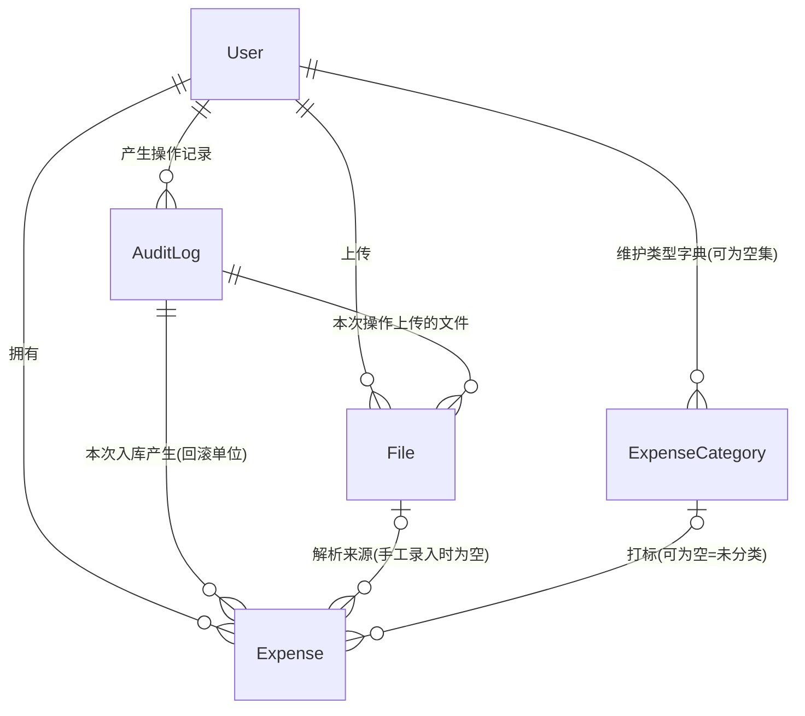

# 两份终版一致性核对（对话1）

> 依据来源：`260901-223131-answer.md`「第三轮 · 终版功能体系」（下称 **功能终版**，11 域 57 项）与
> `260902-004426-answer.md`「终版 · 实体模型（对话9 · 定稿）」（下称 **模型终版**，5 实体）。
> 推导过程各轮（功能终版前两轮、模型终版前八轮）仅用于追溯某条结论定于哪一轮，冲突处一律以两份终版正文为准。
> 本轮不涉及技术实现，不写代码与 SQL。

---

## 一、结论速览

| 判定       | 结果                                                                                   |
| ---------- | -------------------------------------------------------------------------------------- |
| 主干一致性 | **一致**。57 项功能逐条核对，每项所需数据在 5 个实体上都有落点，无功能悬空、无属性凭空多出 |
| 冲突       | **5 处**。其中 1 处是实质结论被推翻（议题 2），4 处是模型终版已定但未收录进「偏离」表     |
| 错         | **3 处**。均为模型终版自身的计数与自述性错误，不影响模型语义                             |
| 漏         | **9 项**。两份终版都没有落点的空白，其中 5 项会直接影响实现时的行为定义                  |

**总体判断**：模型终版是功能终版的正确投影，可以据此进入下一轮；但需先补掉下述 3 处「错」与 5 处「冲突」的登记，
并对 9 项「漏」中的前 5 项给出口径，否则实现阶段必然出现二义。

---

## 二、核对方法

1. **正向**：功能终版 11 域 57 项 + 模型终版增补的 I-7，逐项追问「它需要哪些数据 → 落在哪个实体的哪个属性」。
2. **反向**：模型终版 5 实体的全部属性，逐个追问「它服务于哪一条功能编号」。
3. **口径**：两份终版对同一事物的表述逐字比对（如 F-2 系统字段清单 vs `Expense` 属性表）。
4. **待确认**：功能终版 T1–T13 与模型终版 T4/T14–T21 的编号并集，逐一核对结案状态。

---

## 三、冲突（5 处）

> 前 4 处模型终版均已定案，只是「八、相对原功能清单的偏离」表未收录，属登记遗漏；第 5 处是实质结论被推翻。
> （另核：I-3/I-4「汇率自动获取、随明细留存、不提供手工汇率表维护」与模型的「不建汇率实体」本就一致，**不构成冲突**。）

| # | 事项 | 功能终版口径 | 模型终版口径 | 定于 | 已登记 | 性质 |
| - | ---- | ------------ | ------------ | ---- | ------ | ---- |
| 1 | 明细的「原始摘要」 | F-2 系统字段含**原始摘要** | 属性表中**已删除** | 对话5 | ✗ | 属性删减 |
| 2 | 文件的存放形态 | C-2 文件元信息含**存储位置** | 改为**文件内容**（二进制随记录存储），无存储位置 | 对话4 | ✗ | 属性替换 |
| 3 | 去重的实现形态 | E-1 由四要素**生成交易指纹** | **不建指纹属性**，四要素等值匹配 | 对话4 | ✗ | 形式偏离，语义等价 |
| 4 | 币种的存在形态 | I-1 **币种字典**（系统级维护，用户只读） | **代码枚举，不落库**；库中只存币种代码 | 对话2 | ✗ | 形式偏离，附带「新增币种须改代码」的新约束 |
| 5 | **议题 2 的最终解法** | 「月度总额与类型分布类统计**走优化二（月度差分聚合）**，明细下钻走优化一」 | **不建聚合表**，全部统计走区间穿刺（优化一） | 对话2（T15） | ✗ | **实质结论被推翻** |

**第 5 处需单独说明**：功能终版议题 2 终稿断言「优化一的局限是——查久远历史月份时，`结束月 ≥ M` 会把 M 之后发生的所有支出纳入候选」，
并以此为由必须引入优化二。模型终版第二轮 2.3 指出该断言**不成立**：筛选是 `起始月 ≤ M` 与 `结束月 ≥ M` 的**合取**，
查 2020-01 时前一个条件已排除该月之后发生的全部支出。

- **采用后者**，依据是条件为合取、两端各自具备选择性，这是可自证的逻辑判断而非偏好选择。
- **连带影响**：功能终版议题 2 终稿中「优化二」整节（含差分公式、三个关键性质、一致性要求、适用边界）**已作废**，
  但功能终版原文仍在，且其「结论」段仍写着统计走优化二。两份文档在此处**字面矛盾且都未标注**。
- **处置建议**：以模型终版为准（不建聚合表），并在功能终版议题 2 处补一条作废标注，避免下一轮再被引用。

---

## 四、错（3 处）

| # | 位置 | 错误 | 事实 |
| - | ---- | ---- | ---- |
| 1 | 模型终版「2.5 AuditLog」 | 标题写「**11 项**，全部必填」，表格实际只有 **10 行** | 第五轮的 11 项中，`是否已回滚`（第五轮属性表内，服务于 D-8）在终版被**静默删除** |
| 2 | 模型终版卷首与「十、交付说明」 | 称全模型合计 **64** 项，并特意声明「属性计数更正：`Expense` 为 22 项（前两节按表格行数记作 21）」 | `Expense` 由 21 更正为 22 是对的（第七轮把「创建时间、更新时间」并作一行）；但同一张 `AuditLog` 表少了一行，实际合计为 **63**：15 + 6 + 22 + 10 + 10 |
| 3 | 模型终版「十、交付说明 · 校验方式④」 | 称「**21 项待确认逐一核对**结案状态与落点，仅 T4 未决」 | 实际只覆盖 15 项（T1–T4、T6、T7、T9、T14–T21）。**T5、T8、T10、T11、T12、T13 在整份文档中一次都未出现**，既未结案也未列为待确认 |

**对第 1、2 处的处置建议**：`是否已回滚` 与 `回滚审计ID` 的零值语义（「零值 = 尚未被回滚」）完全重复，
与对话5 已裁定的「删除标记 / 删除时间合并」（T18）是同一类冗余。**建议确认删除**，并把计数改为 `AuditLog` 10 项、全模型 **63** 项。

**对第 3 处的处置建议**：被丢弃的 6 项待确认按性质分两类，需明确重新纳入还是显式作废——

| 编号 | 问题 | 功能终版标注 | 性质 |
| ---- | ---- | ------------ | ---- |
| T5   | CSV 由系统规定统一模板，还是适配各银行原生导出 | **阻塞** | 非模型问题，但直接决定 D-1 解析器的形态，下一轮必须有答案 |
| T8   | 回滚一次入库时，若部分明细已被人工编辑，是否仍整体删除 | 不阻塞 | **是模型/行为问题**，见「漏」第 3 项 |
| T10  | 多语言是否包含数据内容（如支出类型名称）翻译 | 不阻塞 | 影响 `ExpenseCategory.名称` 是否需要多语形态，**是模型问题** |
| T11  | 唯一 `admin` 遗忘密码的恢复路径 | 不阻塞 | 运维问题，可显式延后 |
| T12  | 支出日期是否涉及时区换算 | 不阻塞 | 影响归月与取日汇率的边界，**是语义问题** |
| T13  | 是否需要关账/锁月 | 不阻塞 | 功能终版已倾向「本轮不做」，可显式作废 |

---

## 五、漏（9 项，两份终版均无落点）

> 按「是否影响实现时的行为定义」排序，前 5 项建议本轮就给口径。

| # | 缺口 | 冲突/空白点 | 影响 |
| - | ---- | ----------- | ---- |
| 1 | **admin 初始密码的可重复打印** | A-3 要求「改密前打印到日志、改密后不再打印」，而 `User` 只有`密码哈希 + 盐`，且注明「初始密码不落库」 | 进程重启后无明文可打印。要么每次启动在「需强制改密 = 是」时**重新随机生成并改写哈希**，要么留存明文——两条路语义完全不同，必须选一条 |
| 2 | **回滚撤销明细的形态** | D-8 只说「整体撤销」，模型只有 `删除时间`（软删除） | 回滚是写 `删除时间` 还是物理删除？若是软删除，被撤销的明细与被用户删除的明细在数据上无法区分 |
| 3 | **回滚与人工编辑的关系（原 T8）** | 一批明细入库后被逐笔改过类型/摊分，此时回滚该审计 | 是整体删除（丢失人工成果）还是拦截？功能终版原倾向「提示后整体删除」，但该项已在模型轮次丢失 |
| 4 | **去重是否比对已软删除明细** | E-1/E-2 的四要素匹配范围未界定；软删除明细「不参与列表与统计」，但去重不属于两者 | 若比对：删了再导仍报疑似重复；若不比对：回滚后重导不会提示，与 E-2「与已入库明细双向查重」的初衷相左 |
| 5 | **手工汇率与自动重算的优先级** | I-5 允许逐笔手工指定汇率；不变式 1 又要求「金额/日期/币种/摊分月数任一变更时，折算汇率必须同步重算」 | 用户手填汇率后再改金额，手工汇率是保留（只重算本位币金额）还是被自动汇率覆盖？未定义。另：`折算汇率` 被归入「系统字段（系统写入或派生）」却允许人工编辑，与 F-5「七个业务字段全部可改」的可编辑集合口径不一致 |
| 6 | **G-4「迁移」无支撑** | G-4 规定被引用的类型「需迁移或停用」；模型只提供 `状态`（停用） | 无批量改类型功能（第二轮 E-07 已「不采纳」），迁移动作在功能与模型两侧都无落点。另：`ExpenseCategory` 无删除时间/删除标记，未被引用的类型是物理删除与否亦未定义 |
| 7 | **已入库明细的删除缺功能项** | 功能终版 F 域 7 项中无「删除明细」，只在 B-3/B-4 顺带提及；模型有 `删除时间` | 删除入口、删除后是否可见/可恢复均无定义；模型终版自己也承认「当前功能清单无『恢复已删除明细』项」，软删除数据只进不出 |
| 8 | **卡片三属性无消费方** | `银行名称 / 卡号后四位 / 卡片币种` 三项写入后，F-4 筛选维度不含、J 域统计不含、无明确展示项 | 要么补一个筛选/展示口径，要么明确它们只作留痕（对应 C-13 原始诉求「标识数据来源」已被弱化——去重四要素已不含卡片） |
| 9 | **两处越界的隐性能力** | ① `User.登录态基线时间` 的推进场景含「**强制下线**」，但 A 域无该功能项；② `File.内容校验值` 被赋予「识别同一文件**重复上传**」用途，但功能清单无文件级重复上传的处置规则（提示 / 阻止 / 允许） | 模型给了能力，功能侧没有对应动作与文案，属于登记不全而非设计错误 |

---

## 六、一致的部分（确认无问题，仅列结论）

- **57 项功能全部有数据落点**：A 域 8 项 → `User`；B 域 4 项 → 5 实体的归属用户 + `AuditLog`；C 域 4 项 → `File`；
  D 域 8 项 → `File` + `AuditLog` + `Expense.来源审计ID/来源文件ID`；E 域 2 项 → 四要素等值匹配；
  F 域 7 项 → `Expense` 22 项属性；G 域 4 项 → `ExpenseCategory`；H 域 4 项 → 摊分月数 + 起止月；
  I 域 6 项 → 折算三字段 + 币种枚举；J 域 6 项 → 起止月区间穿刺 + 类型/币种维度；K 域 4 项 → `User.本位币/界面语言` + `AuditLog`。
- **反向核对无冗余属性**：63 项属性中，除「漏」第 8、9 项标注的 5 个属性外，其余均可追溯到明确功能编号。
- **模型终版「八、偏离」已登记的 4 冲突 + 2 增补，逐条复核均准确**：G-1/补2（类型字典开户为空集）、G-2（空即未分类）、
  I-2（本位币默认 CNY）、I-4（重算使历史本位币数字整体改变）、F-4 增补（折算本位币币种筛选）、I-7 新增（本位币金额重算）。
- **功能终版 5 条全局前提在模型终版全部成立**：明文存储（`File.文件密码` 明文）、只记支出（负金额作冲抵而非收入）、
  纯个人隔离（无系统级实体）、审计唯一留痕（无批次表、无修改历史表）、摊分不落库（份额实时派生）。
- **功能条目计数正确**：功能终版 8+4+4+8+2+7+4+4+6+6+4 = **57**；模型终版增 I-7 后 **58**。

---

## 七、建议动作（按优先级）

1. **修正模型终版计数**：`AuditLog` 确认删除 `是否已回滚` → 10 项，全模型 **63** 项；同步改交付说明。
2. **补登 5 处冲突**：把第三节 5 项并入模型终版「八、相对原功能清单的偏离」，其中议题 2 需在功能终版原文标注作废。
3. **重新纳入 6 项待确认**：T5（阻塞）、T8/T10/T12（模型或语义相关）需要口径；T11/T13 可显式延后或作废。
4. **给出 5 项行为口径**：漏 1（初始密码可重复打印）、漏 2/3（回滚形态与人工编辑冲突）、漏 4（去重是否含软删除）、漏 5（手工汇率优先级）。
5. **登记 3 项轻量补充**：漏 6（类型迁移与删除）、漏 7（明细删除功能项）、漏 8/9（卡片属性与两处隐性能力的定位）。

---

## 八、交付说明

- **交付物**：本节即两份终版的一致性核对结论——4 项总判定、4 步核对方法、5 处冲突、3 处错、9 项漏、5 类一致性确认、5 条建议动作。
- **未做**：不修改两份终版原文，不引入任何新功能或新实体；不涉及技术实现、代码与 SQL（遵本轮 prompt「只做模型化分析」）。
- **校验方式**：
  ① 正向逐条走完 57 项功能，确认每项的数据落点，未发现悬空功能；
  ② 反向逐条走完 63 项属性，检出 5 个无功能消费方的属性（漏 8、9）；
  ③ 对两份终版同名事物逐字比对（F-2 系统字段清单、C-2 文件元信息、E-1 指纹、I-1 币种、I-3/I-4 汇率、议题 2 结论），检出 5 处口径差异（汇率一项经比对判定不构成冲突）；
  ④ 手工重数 5 张属性表的行数，与文中自述计数比对，检出 `AuditLog` 少 1 行、合计少 1 项；
  ⑤ 取 T1–T13 与 T14–T21 的编号并集共 21 项，在模型终版全文检索每个编号，检出 T5/T8/T10/T11/T12/T13 零出现；
  ⑥ 对议题 2 的「合取条件是否具备选择性」独立验算：`起始月 ≤ M` 排除 M 之后发生的支出，`结束月 ≥ M` 排除已摊完的支出，
     两端各自具备选择性成立，确认模型终版的反驳正确、功能终版的「局限」表述有误。

---

# 对话2 · 决策落地与连带影响

> 依据来源：`260902-214813-prompt.md`「对话2」的 18 条批注。
> 本节只做决策登记与连带推导，不改动两份终版原文；标注「推导」的为由已确认口径推出、需你确认的，集中在文末。

---

## 一、先回答：错 2 到底是什么错

**不是模型语义错，是文档内部的计数自相矛盾**，且正是由你删掉 `是否已回滚` 那一行引发的：

| 位置 | 现在写的 | 实际 |
| ---- | -------- | ---- |
| 终版「2.5 AuditLog」标题 | `AuditLog 操作审计（**11 项**，全部必填）` | 表格只有 **10 行** |
| 终版卷首 | `全模型合计 **64** 项` | 15 + 6 + 22 + 10 + **10** = **63** |
| 终版「十、交付说明」 | `5 个实体共 **64** 项属性`、`AuditLog **11**` | 同上，应为 63 / 10 |

即：**行删了，三处计数没跟着改**。讽刺点在于同一段卷首还特意做了一次「属性计数更正」（`Expense` 21 → 22，这次更正本身是对的——第七轮把「创建时间、更新时间」并作一行导致少数了 1 项），却没顺手更正 `AuditLog`。

**处置**：`AuditLog` = **10 项**，全模型 = **63 项**。你的判断成立——`回滚审计ID` 零值即「尚未被回滚」，`是否已回滚` 是纯冗余状态位，与对话5 已裁定的「删除标记 / 删除时间合并」（T18）同一类。**错 1、错 2 至此合并结案。**

---

## 二、冲突 5 处：全部采纳模型口径（结案）

| # | 定案 | 连带动作 |
| - | ---- | -------- |
| 1 | 明细**无**「原始摘要」属性 | 功能终版 F-2 系统字段清单中删去该项 |
| 2 | 文件以**文件内容**（二进制随记录）存储，无「存储位置」 | 功能终版 C-2 同步改写 |
| 3 | **不建**交易指纹属性，四要素等值匹配 | 功能终版 E-1 改述为「以四要素等值匹配判定疑似重复」 |
| 4 | 币种为**代码枚举**，库中只存币种代码 | 功能终版 I-1 改述；附带约束「新增币种须改代码」写入前提 |
| 5 | **不建**月度差分聚合表，全部摊分统计走区间穿刺 | **功能终版议题 2 终稿中「优化二」整节作废**，含其差分公式、三条关键性质、一致性要求、适用边界；「结论」段改为「月度总额、类型分布、明细下钻统一走优化一的区间穿刺」 |

> 第 5 条同时消掉了功能终版对优化一的错误质疑（合取条件已具备双向选择性），以及聚合表带来的「四条写路径同步冲销」的一致性负担。

---

## 三、原待确认 6 项：全部结案

| 编号 | 决策 | 影响面 |
| ---- | ---- | ------ |
| T5  | CSV **需适配各银行原生导出**，不定义统一模板 | D-1 解析器插件化的既有口径「按『文件格式 + 来源机构』适配」正好承接，**无新增功能项**；连带确认 `Expense` 的银行名称 / 卡号后四位 / 卡片币种由各银行解析器负责识别，识别不出即留空 |
| T8  | 回滚时若部分明细已被人工编辑，**仍整体删除**（人工成果丢失） | D-8 口径明确化，无模型变化；建议回滚前的确认弹窗提示「本批含 N 笔已被编辑的明细」 |
| T10 | 多语言**仅界面文案**，不含数据内容（`ExpenseCategory.名称` 等） | `ExpenseCategory.名称` 保持单值，**无需多语形态**，模型零变化 |
| T11 | 唯一 `admin` 遗忘密码**不设计恢复路径** | A 域不新增功能项；作为已知运维风险显式接受 |
| T12 | 支出日期**不涉及时区换算**，以账单字面值为准 | 归月（摊分起始月）与取日汇率均以该字面日期为准，无时区语义 |
| T13 | **不需要**关账 / 锁月 | 历史月份永远可改，J 域统计随明细实时变化，无期间锁 |

---

## 四、漏 9 项：逐条落地

### 4.1 已完全定案（6 项）

| # | 决策 | 模型 / 功能影响 |
| - | ---- | --------------- |
| 1 | **admin 初始密码**：内存随机生成 → 打印日志 → 哈希加盐写入 `User` | 明文始终不落库，模型零变化；但 A-3 的「持续打印」语义需澄清，见第六节 T22 |
| 2 | **回滚撤销明细**：写 `删除时间`（软删除），**不区分**是回滚撤销还是用户删除 | 模型零变化；`删除时间` 单一语义，无需新增来源标记 |
| 3 | **回滚遇人工编辑**：整体删除（同 T8） | 同上 |
| 4 | **去重不比对已软删除明细** | E-1/E-2 的匹配范围收敛为「在库且未删除」的明细；连带：删除后重新导入同一笔不会报疑似重复，回滚后重导亦不报 |
| 6 | **`ExpenseCategory` 不需要迁移，只需停用** | 功能终版 G-4「需迁移或停用」改为「**被明细引用的类型只能停用，不可删除**」；无需批量改类型功能（与第二轮 E-07「不采纳批量编辑」一致）；模型零变化 |
| 9② | **文件不校验重复上传**，允许重复上传重复保存 | `File.内容校验值` 用途收敛为**仅完整性校验**，删去「识别同一文件重复上传」的表述；模型零变化 |

### 4.2 新增功能项：F-8 明细删除与恢复（第 7 项）

| 维度 | 定义 |
| ---- | ---- |
| 删除 | 明细列表页逐笔删除，写 `删除时间`（软删除），记 `AuditLog` |
| 筛选 | 明细列表页新增「**是否显示已删除**」筛选项，**默认不显示** |
| 恢复 | 显示已删除后，支持将已删除明细恢复（清空 `删除时间`），记 `AuditLog` |
| 恢复时的查重 | 恢复**必须**做重复性校验：以四要素比对「在库且未删除」的明细（与 4.1 第 4 项口径一致，被恢复的明细自身不参与） |
| 命中疑似重复的处置 | **提示后由用户决定是否继续恢复**（推导：沿用 E-2「系统只标记、一律人工裁定、不做自动处置」的既有原则） |
| 统计口径 | 已删除明细不参与 F-6 与 J 域全部统计；但仍参与 I-7 本位币重算（对话7/8 既有口径不变） |

**功能计数：58 → 59。** 模型零变化——`删除时间` 已存在，本项只是把它的读写入口补全（此前只有「只进不出」的删除，无恢复）。

### 4.3 F-4 多维筛选增补：卡片三维度（第 8 项）

| 新增筛选维度 | 匹配方式 |
| ------------ | -------- |
| 银行名称 | 等值多选，需含「未识别」选项（解析不出时为空） |
| 卡号后四位 | 等值 / 精确匹配，需含「未识别」选项 |
| 卡片币种 | 币种枚举多选，需含「未识别」选项 |

卡片三属性至此有了消费方，不再是纯留痕字段。**不新增功能项**（并入 F-4）。

### 4.4 强制下线：归入既有功能，不新增项（第 9① 项）

**定案**：重置密码、修改密码、禁用账户等操作后，`User.登录态基线时间` 联动推进 → 此前签发的令牌全部失效 → 旧 token 的访问被拦截 → 引导到登录页重新登录。

- 这是 A-7（账户管理）与 A-8（密码策略）的**连带效果**，不是独立功能，A 域不增项。
- 拦截后的跳转行为落在 A-6「全局登录态校验，失效统一跳回登录页」，与令牌自然过期走同一条路径。
- 模型零变化；`登录态基线时间` 的推进场景至此有明确功能出处，删去原「强制下线」这一无出处的表述。

---

## 五、重点：手工汇率与自动重算的联动规则（漏 5）

这是本轮唯一改变**属性可编辑性**的决策，需要完整展开。

### 5.1 三元恒等式

`本位币金额 = 支出金额 × 折算汇率`

三者构成恒等式，**改任意一个必须联动另一个，第三个保持不变**。你给出的两条规则确定了两种情形，其余由同一口径推出：

| 用户编辑的字段 | 保持不变 | 系统联动修改 | 来源 |
| -------------- | -------- | ------------ | ---- |
| **本位币金额** | 折算汇率 | **支出金额** | 你已确认 |
| **折算汇率** | 支出金额 | **本位币金额** | 你已确认 |
| 支出金额 | 折算汇率（**不重拉**） | 本位币金额 | 推导：汇率只在「入库首次获取」「用户主动改」「I-7 重算」三种情形下变化 |
| 支出币种 | — | **重新拉取**该币种在支出日期的日汇率 → 联动本位币金额 | 推导：币种变更使原汇率失效，无法沿用 |
| 支出日期 | ？ | ？ | **待确认，见 T23** |
| 摊分月数 | 折算三字段全部不变 | 仅摊分起始月 / 结束月 | 摊分与折算相互独立 |

### 5.2 连带影响一：属性可编辑性重新划分

`折算汇率` 与 `本位币金额` 原被归入「系统字段（系统写入或派生）」，现在**用户可直接编辑**。属性总数不变（63），但可编辑集合从 7 项扩到 9 项：

| 分类 | 属性 |
| ---- | ---- |
| 业务字段（用户可编辑，7 项） | 支出日期、支出金额、支出币种、交易对手方、交易备注、支出类型ID、摊分月数 |
| **系统写入但用户可覆盖（2 项）** | **折算汇率、本位币金额** |
| 系统字段（用户不可编辑，13 项） | 明细ID、归属用户ID、来源审计ID、来源文件ID、银行名称、卡号后四位、卡片币种、折算本位币币种、摊分起始月、摊分结束月、删除时间、创建时间、更新时间 |

功能终版 F-5「七个业务字段全部可改」需改述为「**九个字段可改**」。

### 5.3 连带影响二：不变式 1 必须修订

| | 原文 | 修订后 |
| - | ---- | ------ |
| 触发 | 支出日期 / 支出金额 / 支出币种 / 摊分月数**任一变更** | 拆分为两组，见下 |
| 动作 | 「折算汇率 + 本位币金额 + 折算本位币币种」与「摊分起始月 + 摊分结束月」**同步重算** | 分场景 |

**修订后的不变式 1**：

1. **恒等式不变式**：`本位币金额 = 支出金额 × 折算汇率` 在任何一次编辑后都必须成立；三元中任改其一，按 5.1 的矩阵联动，**折算汇率不被无差别重拉**。
2. **摊分不变式**：支出日期或摊分月数变更时，摊分起始月 / 结束月同步刷新（与折算三字段解耦）。
3. **重拉汇率的时机收敛为三处**：入库时首次获取、支出币种变更、I-7 本位币金额重算（及切换本位币时的自动触发）。

**关键**：原不变式 1「支出金额变更 → 折算汇率同步重算」的表述会**覆盖用户手填的汇率**，与本轮决策直接冲突，必须按上述修订。

### 5.4 连带影响三：与 I-7、I-5、F-6/J 域的关系（均无冲突，确认）

| 关系 | 结论 |
| ---- | ---- |
| 手工值会被 I-7 覆盖吗？ | **不会**。I-7 的跳过条件是「`折算本位币币种 = User.本位币` 则跳过」；用户手工填过汇率的行，其折算本位币币种就是当前本位币，必然被跳过 |
| 与 I-5 的关系 | I-5（取不到汇率时该行汇率必填）是**入库前**的兜底，5.1 是**入库后**的编辑；两者是同一可编辑性在不同阶段的体现，无重叠 |
| 对统计的影响 | 用户手改本位币金额会直接改变 F-6 与 J 域的合计数——这与对话8「按数据库字面数值统计、统计不承担纠错职责」的定案一致，**不做任何提示** |

---

## 六、本轮结束后的状态

| 项 | 值 | 变化 |
| -- | -- | ---- |
| 实体数 | 5 | 零变化 |
| 属性数 | **63** | 由 64 更正（`AuditLog` 11 → 10） |
| 关联关系 | 5 组 | 零变化 |
| 功能项 | **59** | 58 + F-8（明细删除与恢复） |
| 筛选维度增补 | 4 个 | 是否显示已删除、银行名称、卡号后四位、卡片币种 |
| 不变式 | 4 条（第 1 条已重写为 3 小条） | 见 5.3 |
| 待确认 | **3 项** | T4 挂起 + 新增 T22、T23 |

### 待确认清单

| 编号 | 问题 | 说明与倾向 |
| ---- | ---- | ---------- |
| T4 | 自动打标的判定方式 | **你主动挂起**，在此之前明细类型一律留空，不建打标规则实体 |
| **T22** | **admin 初始密码在进程重启后是否重新生成并重新打印？** | 你给的流程「内存生成 → 打日志 → 哈希入库」描述的是**创建那一次**。但功能终版 A-3 与最初诉求都是**条件式**表述——「当还未修改密码时，将初始密码打印在日志中」，这暗示只要 `需强制改密 = 是` 就应能拿到密码。二者的差别在于： **口径 ①** 只在首次初始化打印一次——日志被轮转/清理或没留意，admin 即永久无法登录（且 T11 已定不设恢复路径）； **口径 ②** 每次启动时若 `需强制改密 = 是`，重走一遍「内存生成 → 打日志 → 覆盖哈希」——明文仍不落库，且完全符合你给的流程描述。 **倾向口径 ②**：它同时满足 A-3 原文语义与「明文不落库」，并消除 T11 不设恢复路径带来的单点风险 |
| **T23** | **修改支出日期时，是否重新拉取该日的日汇率？** | 支出日期是「取日汇率」的依据（I-4），改日期后原汇率与新日期不匹配； 但若重拉，会覆盖用户按 5.1 手填的汇率。 **倾向：不自动重拉**，与「支出金额变更不重拉」保持一致，把汇率的变更权完整交给用户与 I-7；若你希望重拉，则需再定「手工汇率是否需要一个保护标记」 |

---

## 七、交付说明

- **交付物**：本节即对话2 的决策落地——错 2 的成因说明、5 处冲突结案、6 项原待确认结案、9 项漏的逐条落地（1 项新增功能、1 组筛选增补、1 条不变式重写）、本轮后的模型与功能状态、3 项待确认。
- **本轮实质变化**：① 属性计数更正为 63；② 新增功能 F-8，功能项 58 → 59；③ `折算汇率` 与 `本位币金额` 由系统字段升为**用户可覆盖**，可编辑集合 7 → 9 项；④ **不变式 1 重写**（重拉汇率的时机收敛为三处）；⑤ 功能终版议题 2「优化二」整节作废。
- **未做**：不改动两份终版原文（待你确认后统一回写）；不涉及技术实现、代码与 SQL。
- **校验方式**：
  ① 18 条批注逐条比对，确认全部有落点，无遗漏、无静默扩权；
  ② 对三元恒等式 `本位币金额 = 支出金额 × 折算汇率` 枚举全部 6 种编辑入口，检出 1 处与原不变式 1 的直接冲突（改支出金额会重拉汇率、覆盖手工值）并给出修订；
  ③ 核验手工汇率会不会被 I-7 覆盖——由「折算本位币币种 = 当前本位币则跳过」推出必然被跳过，无冲突；
  ④ 核验「去重不比对已软删除明细」与「恢复时须查重」两条是否矛盾——不矛盾：前者定的是比对**范围**（仅在库未删除），后者定的是比对**时机**（恢复动作触发），恢复的明细自身不参与比对；
  ⑤ 重新点算实体 / 属性 / 功能 / 筛选维度四组计数，与本轮变化逐一对齐。

---

# 对话3 · 三项决策与遗留的联动方向问题

> 依据来源：`260902-214813-prompt.md`「对话3」的 3 条批注。
> 本节登记决策、推导连带影响，并指出第 3 条中一处必须澄清的方向性歧义。

---

## 一、T4 自动打标：继续挂起（维持原状）

明细类型一律留空，不建打标规则实体。模型与功能零变化，本项继续作为唯一的长期挂起项。

---

## 二、T22 admin 初始密码：进程重启后不重新打印（结案）

**采口径 ①**：只在**系统首次初始化创建 `admin` 的那一次**执行「内存随机生成 → 打印日志 → 哈希加盐写入 `User`」，此后无论是否已改密、进程重启多少次，都不再生成也不再打印。

| 影响面 | 结论 |
| ------ | ---- |
| 模型 | 零变化，明文始终不落库 |
| 功能终版 A-3 | 需改述——原文「在其完成首次改密前打印到日志，改密后不再打印」是**条件式**表述，会被误读为「每次启动只要没改密就打印」。应改为「**仅在初始化创建 `admin` 时打印一次**」 |
| `User.需强制改密` | 仍然保留（首登强制改密的门禁），只是不再作为「是否打印日志」的判据 |
| **接受的风险** | 初始化那一次的日志若被轮转、清理或未留意，`admin` 将**永久无法登录**——T11 已定「不设计恢复路径」，故此风险为显式接受，不再兜底 |

---

## 三、T23 修改支出日期：重新拉取新日期的日汇率（结案）

**采「重拉」**：修改支出日期后，系统按**修改后的日期**重新拉取该币种的日汇率。

这使「重拉汇率的时机」由对话2 的三处扩为**四处**：

1. 入库时首次获取
2. 支出币种变更
3. **支出日期变更（本轮新增）**
4. I-7 本位币金额重算（及切换本位币时的自动触发）

**连带**：修改支出日期会同时触发两组联动，二者相互独立——

| 组 | 动作 |
| -- | ---- |
| 折算组 | 重拉新日期的日汇率 → 三元恒等式重新平衡（方向见第四节） |
| 摊分组 | 摊分起始月 = 新日期所属月，摊分结束月 = 起始月 + 摊分月数 − 1；同时触发 H-4「本次修改将影响 YYYY-MM ~ YYYY-MM」的跨月影响提示 |

**汇率拉取失败时**：沿用 I-5 的既有口径——该行汇率变为必填、由用户手工填写，不静默按原汇率或 1:1 处理。

---

## 四、必须澄清：重拉汇率后，三元中联动改哪一个（新 T24）

### 4.1 为什么这里有歧义

你的第 3 句给出了一条兜底流程：「在明细列表页也需要展示支出金额，用户再修改本位币金额，**以将支出金额调整到正确为止**」。

这条兜底**只有在支出金额会被系统改坏时才需要存在**。反推可知：你期望的是重拉汇率后系统**保持本位币金额不变、联动改支出金额**——支出金额因此可能偏离账单原值，于是需要你说的那条人工修正通道（改本位币金额 → 联动支出金额 → 看着调到正确为止）。

**按此理解登记为当前口径**，但它与对话2 已确认的另一条规则方向相反，必须请你确认是否有意为之。

### 4.2 完整联动矩阵（三元恒等式 `本位币金额 = 支出金额 × 折算汇率`）

| # | 触发 | 保持不变 | 联动改 | 状态 |
| - | ---- | -------- | ------ | ---- |
| 1 | 用户改**本位币金额** | 折算汇率 | 支出金额 | 对话2 已确认 |
| 2 | 用户改**折算汇率** | **支出金额** | **本位币金额** | 对话2 已确认 |
| 3 | 用户改**支出金额** | 折算汇率 | 本位币金额 | 对话2 推导 |
| 4 | 用户改**支出日期** → 系统重拉汇率 | **本位币金额** | **支出金额** | **本轮按你的描述登记，待确认（T24）** |
| 5 | 用户改**支出币种** → 系统重拉汇率 | ？ | ？ | **未定，随 T24 一并确认** |
| 6 | I-7 重算 → 系统重拉汇率 | 支出金额 | 本位币金额 | 对话7/8 已确认（重算的定义即「按支出金额 × 新汇率算本位币金额」） |

### 4.3 矛盾点

第 2 行与第 4 行：**同样是汇率发生变化，联动方向相反**。

- 第 2 行（用户主动改汇率）：支出金额是锚，本位币金额被重算。
- 第 4 行（系统因改日期重拉汇率）：本位币金额是锚，支出金额被重算。
- 第 6 行（I-7 重算）与第 2 行一致，与第 4 行相反。

也就是说，三元中**谁是锚**在不同触发下不统一。这不必然是错误——你可能确实认为「用户手动介入时以支出金额为准，系统自动介入时以本位币金额为准」——但它有一个直接后果需要你确认：

> **改一次支出日期，会把支出金额（账单客观事实）自动改成一个非账单值**，若用户改完日期忘了走兜底流程修正，该笔支出的原币金额就此永久错误，且系统不会提示。

### 4.4 两个口径与后果

| | 口径 A（本轮登记的口径） | 口径 B（与第 2、6 行统一） |
| - | ------------------------ | -------------------------- |
| 规则 | 重拉汇率后保持**本位币金额**，联动改支出金额 | 重拉汇率后保持**支出金额**，联动改本位币金额 |
| 与你的描述 | 完全吻合——正是它使「调整支出金额」成为必要 | 支出金额纹丝不动，你说的兜底流程失去触发场景 |
| 支出金额的语义 | 可被系统自动改写，不再等于账单原值 | 始终是账单原值，只有用户能改 |
| 内部一致性 | 与第 2、6 行方向相反 | 三处汇率变化方向统一 |
| 兜底通道 | 必需，且用户必须记得用 | 仍可保留为通用修正通道，但非必需 |

**我的倾向：口径 B。** 理由是支出金额是账单给出的客观事实，让它被「改日期」这一动作自动改写，会使明细逐渐偏离原始账单且无提示；而口径 B 下本位币金额本就是派生量，被重算是其应有语义，与 I-7 的定义也完全一致。

**若你确认口径 A**，建议至少补一条：改日期后在该行给出「支出金额已按新汇率重算，请核对」的标记，避免静默偏离。

### 4.5 无论哪个口径，以下两点均成立（直接登记）

| 项 | 内容 |
| -- | ---- |
| F-5 编辑态要求 | 明细列表页的编辑态中，**支出金额、折算汇率、本位币金额三者需同屏可见并实时联动**——用户改其中一个，另外两个的当前值即时可见，从而能「看着调到正确为止」。这与 H-4「摊分预览」是同一类交互要求 |
| 人工修正通道 | 「改本位币金额 → 联动支出金额」（矩阵第 1 行）是把支出金额调回正确值的**唯一间接手段**，予以保留；用户也可直接编辑支出金额（矩阵第 3 行），二者并存 |

---

## 五、本轮结束后的状态

| 项 | 值 | 变化 |
| -- | -- | ---- |
| 实体数 | 5 | 零变化 |
| 属性数 | 63 | 零变化 |
| 关联关系 | 5 组 | 零变化 |
| 功能项 | **59** | 零变化（F-5 的编辑态要求、A-3 的改述均为口径细化，不增项） |
| 重拉汇率的时机 | **4 处** | 由 3 处增至 4 处（新增「支出日期变更」） |
| 待确认 | **2 项** | T4 继续挂起；T22、T23 结案；**新增 T24** |

### 待确认清单

| 编号 | 问题 | 状态 |
| ---- | ---- | ---- |
| T4 | 自动打标的判定方式 | 你主动挂起，明细类型一律留空，不建打标规则实体 |
| **T24** | **系统重拉汇率后，三元中保持哪一个不变？**（含改支出日期、改支出币种两种触发） | 本轮按你的描述登记为**口径 A**（保持本位币金额、联动支出金额）；**我倾向口径 B**（保持支出金额、联动本位币金额，与用户主动改汇率、I-7 重算两处统一）。见 4.4 |

---

## 六、交付说明

- **交付物**：本节即对话3 的决策落地——T4 维持挂起、T22 与 T23 结案及其连带、三元联动的完整 6 行矩阵、1 处方向性矛盾的澄清请求（T24）、2 项可直接登记的编辑态要求。
- **本轮实质变化**：① 重拉汇率的时机由 3 处增至 4 处；② A-3 的「持续打印」表述需改述为「仅初始化时打印一次」，并显式接受 `admin` 锁死风险；③ 检出并提出 T24（联动方向不统一）。
- **未做**：不改动两份终版原文；不涉及技术实现、代码与 SQL。
- **校验方式**：
  ① 3 条批注逐条比对，确认全部有落点；
  ② 由「用户再修改本位币金额，以将支出金额调整到正确为止」反推系统联动方向——该兜底仅在支出金额被系统改写时才有存在意义，据此确定你的原意为口径 A，而非我在对话2 中推导的口径 B；
  ③ 将三元恒等式的全部 6 种触发（3 种用户编辑 + 3 种系统重拉）列入同一张矩阵，检出第 2/6 行与第 4 行「锚点相反」的不一致，未默默取一方，按约束提交你裁定；
  ④ 核验改支出日期同时触发折算组与摊分组两组联动，二者无相互依赖，H-4 跨月提示照常触发；
  ⑤ 核验 T22 结案后 A-3 原文的条件式表述会产生歧义，给出改述并显式登记 `admin` 锁死为已接受风险（与 T11 一致）。

---

# 对话4 · 三元联动改为「二自变量 + 一因变量」（T24 结案）

> 依据来源：`260902-214813-prompt.md`「对话4」。
> 本节推翻对话2 第五节与对话3 第四节的部分结论，重写联动模型；被推翻处已在下文逐条标注，不做静默替换。

---

## 一、新规则

`本位币金额 = 支出金额 × 折算汇率`

| 角色 | 属性 | 说明 |
| ---- | ---- | ---- |
| **自变量（用户可改）** | 支出金额、折算汇率 | 金额不对改金额，汇率不对改汇率 |
| **因变量（只读）** | **本位币金额** | **不允许修改**，任何时刻由两个自变量自动算出 |

明细列表页三者**全部展示**，本位币金额只读。用户认为本位币金额不对时，判断是金额错还是汇率错，改对应的那个自变量。

**这一条把「锚点随触发而变」的问题从根上消掉了**：本位币金额永远是因变量，不存在「保持谁不变」的选择。

---

## 二、被推翻的既有结论（3 处）

| # | 出处 | 原结论 | 现结论 |
| - | ---- | ------ | ------ |
| 1 | 对话2 · 5.1 矩阵第 1 行 | 用户改**本位币金额** → 联动支出金额 | **作废**——本位币金额不可编辑 |
| 2 | 对话2 · 5.2 | 可编辑集合 7 → **9 项**（含本位币金额） | 修正为 **8 项**（本位币金额回归只读） |
| 3 | 对话3 · 4.5 | 「改本位币金额 → 联动支出金额」是把支出金额调回正确值的唯一间接手段，予以保留 | **作废**——该通道不存在；支出金额直接改即可 |

---

## 三、重写后的联动矩阵（6 种触发，方向全部统一）

| # | 触发 | 联动结果 |
| - | ---- | -------- |
| 1 | 用户改**支出金额** | 本位币金额 = 新支出金额 × 现汇率 |
| 2 | 用户改**折算汇率** | 本位币金额 = 现支出金额 × 新汇率 |
| 3 | 用户改**支出日期** | 重拉新日期日汇率 → 本位币金额 = 现支出金额 × 新汇率；同时刷新摊分起止月并触发 H-4 跨月提示 |
| 4 | 用户改**支出币种** | 重拉新币种日汇率 → 本位币金额 = 现支出金额 × 新汇率（原第 5 行的未定项，随本轮一并结案） |
| 5 | **I-7 重算 / 切换本位币** | 重拉汇率 → 折算汇率、本位币金额、折算本位币币种三者同事务更新 |
| 6 | 用户改**摊分月数** | 折算三字段全部不变，仅刷新摊分结束月 |

**六种触发下本位币金额一律是被算出来的**，与 I-7 重算的定义（按支出金额 × 新汇率算本位币金额）天然一致。**T24 结案**，采你本轮的口径——比我上一轮倾向的口径 B 更彻底：不是「重拉时以支出金额为锚」，而是「本位币金额根本不参与选择」。

---

## 四、`Expense` 22 项属性的可编辑性三分（终版）

| 分类 | 项数 | 属性 |
| ---- | ---- | ---- |
| **用户可编辑** | **8** | 支出日期、支出金额、支出币种、交易对手方、交易备注、支出类型ID、摊分月数、**折算汇率** |
| **只读派生** | **4** | **本位币金额**、折算本位币币种、摊分起始月、摊分结束月 |
| 系统只读 | 10 | 明细ID、归属用户ID、来源审计ID、来源文件ID、银行名称、卡号后四位、卡片币种、删除时间、创建时间、更新时间 |

合计 22 项 ✓。功能终版 F-5 由「七个业务字段全部可改」改述为「**八个字段可改**（七个业务字段 + 折算汇率）」。

**连带 D-4 预览页**：原文「全字段可编辑」需收敛为与列表页同一口径——本位币金额在预览页同样只读实时计算；I-5「汇率取不到时该行汇率变必填」不受影响（折算汇率本就是自变量）。

---

## 五、不变式 1 的最终形态

1. **恒等式不变式**：`本位币金额 = 支出金额 × 折算汇率` 恒成立；本位币金额为只读因变量，任何一次编辑后立即重算，**不存在人工指定的入口**。
2. **摊分不变式**：支出日期或摊分月数变更时，摊分起始月 / 结束月同步刷新；与折算组解耦。
3. **重拉汇率的时机（4 处）**：入库首次获取、支出日期变更、支出币种变更、I-7 重算（含切换本位币自动触发）。用户主动改汇率不属于「重拉」，是直接赋值。

---

## 六、F-5 编辑态要求（对话3 · 4.5 保留部分，口径更新）

明细列表页编辑态中，**支出金额、折算汇率、本位币金额三者同屏可见**；前两者可输入，第三者随输入**实时重算并只读展示**。用户据此判断该改金额还是改汇率。

---

## 七、新规则的唯一代价（记录，不需你处理）

用户**无法直接指定本位币金额**。当账单同时给出外币金额与银行入账本币金额、而用户希望两者都精确落库时，只能通过填入反推的汇率来命中：

- 多数情况可精确命中——如 100 USD 入账 723.45 CNY，填汇率 7.2345 即得 723.45。
- 少数情况因汇率小数位受限而无法精确命中——如 3 USD 入账 21.71 CNY，需汇率 7.236666…，截位后本位币金额会有分位偏差。

这与对话8「按数据库字面数值统计、统计不承担纠错职责」的定案不冲突，仅记录为已知摩擦点。

---

## 八、本轮结束后的状态

| 项 | 值 | 变化 |
| -- | -- | ---- |
| 实体数 / 属性数 / 关联关系 | 5 / 63 / 5 组 | 零变化 |
| 功能项 | 59 | 零变化（本轮为口径修订） |
| `Expense` 可编辑属性 | **8 项** | 由对话2 的 9 项修正 |
| 联动矩阵 | 6 种触发，方向统一 | 由对话3 的「锚点不统一」收敛 |
| 待确认 | **1 项** | **T24 结案**；仅余 T4 |

| 编号 | 问题 | 状态 |
| ---- | ---- | ---- |
| T4 | 自动打标的判定方式 | 你主动挂起，明细类型一律留空，不建打标规则实体 |

---

## 九、交付说明

- **交付物**：本节即三元联动的重写——新规则、3 处被推翻的既有结论、6 种触发的统一矩阵、`Expense` 22 项的可编辑性三分、不变式 1 的最终形态、F-5 编辑态要求、1 项已知代价。
- **本轮实质变化**：① 本位币金额由「用户可覆盖」降为**只读因变量**，可编辑集合 9 → 8 项；② 联动矩阵 6 种触发方向全部统一，**T24 结案**；③ D-4 预览页「全字段可编辑」需同步收敛；④ 待确认由 2 项减至 1 项（仅 T4 挂起）。
- **未做**：不改动两份终版原文；不涉及技术实现、代码与 SQL。
- **校验方式**：
  ① 逐条核对本轮 6 句批注，全部有落点；
  ② 反查对话2、对话3 中被本轮推翻的结论，逐条列出并标注作废，不做静默替换（检出 3 处）；
  ③ 把 6 种触发重新走一遍矩阵，确认本位币金额在每一种下都是被算出来的，无「保持谁不变」的分支残留；
  ④ 重新点算 `Expense` 22 项的三分归属，8 + 4 + 10 = 22 校验通过；
  ⑤ 核验新规则与 I-7（重算即「支出金额 × 新汇率」）、I-5（汇率必填兜底）、对话8（按字面数值统计）三处既有定案均无冲突；
  ⑥ 检出 D-4 预览页「全字段可编辑」与新规则的口径差，给出收敛表述。

---

# 终版 · 记账系统功能与模型（对话5 · 合并定稿）

> 依据来源：`260901-223131-answer.md`「第三轮 · 终版功能体系」+ `260902-004426-answer.md`「终版 · 实体模型（对话9 · 定稿）」+ 本文件对话1~4 的全部核对结论与决策。
> **本节自包含，取代上述两份终版与本文件前四节**；冲突处一律以本节为准，前文保留为推导过程。
> 范围：业务功能、实体、属性、关联关系、业务规则；不涉及技术实现，不写代码与 SQL。
> 规模：**11 域 59 项功能 / 5 实体 63 项属性 / 5 组关联 / 4 条不变式 / 1 项待确认**。

---

## 一、定位与全局前提

个人记账系统，以「银行账单导入」为主要数据来源，核心价值是**支出分类打标 + 跨月摊分 + 多币种折算 + 月度分析**。

| # | 前提 |
| - | ---- |
| 1 | **假定无人能直接读写数据库**——数据一律明文存储（含上传文件与文件密码），安全完全由应用层的登录态校验与归属校验保证 |
| 2 | **只记支出**，不涉及收入、结余、资产负债；负金额表示退款/冲正，作抵扣而非收入 |
| 3 | **纯个人数据隔离**，不做账本共享；管理员特权仅限账户管理域，同样看不到他人业务数据 |
| 4 | **操作审计是唯一的留痕机制**，不另建导入批次表、修改历史表 |
| 5 | **摊分月数无上限**，摊分份额不落库、不产生额外数据行 |
| 6 | **本位币金额是只读因变量**，恒等于「支出金额 × 折算汇率」，无人工指定入口 |
| 7 | 支出日期以账单字面值为准，**不做时区换算**；**无关账/锁月**，历史月份永远可改 |

---

## 二、功能清单（11 域 59 项）

### A. 账户与认证（8 项）

- **A-1 系统初始化**：首次启动创建唯一管理员账户，用户名固定 `admin`。
- **A-2 初始密码生命周期**：所有初始密码（admin 初始、新建账户、重置密码）均随机生成、仅交付一次、首登强制修改；明文不落库。
- **A-3 初始密码交付**：`admin` 的初始密码在**初始化创建的那一次**按「内存随机生成 → 打印到日志 → 哈希加盐写入」的顺序交付，**此后不再生成也不再打印**；其余场景在界面上一次性展示，由管理员线下交付。
- **A-4 登录与登出**：账号 + 密码登录并签发登录态；登出为前端丢弃令牌。
- **A-5 登录态时效**：签发起 12 小时**绝对过期、不可续期**。
- **A-6 全局登录态校验**：除登录页与登录接口外，所有页面与接口强制校验；失效（过期或被基线时间作废）统一跳回登录页。
- **A-7 账户管理（仅管理员）**：新增账户、启停除自身外的任意账户、重置他人密码、查看仅含元信息的账户列表；账户一律不可删除。重置密码、禁用账户会推进目标用户的登录态基线时间，使其旧令牌立即失效。
- **A-8 密码策略**：长度 ≥ 10 且字母/数字/符号至少含两类；加盐哈希存储；连续失败 5 次锁定 10 分钟；用户可自助改密，改密同样推进自身基线时间。

### B. 权限与审计（4 项）

- **B-1 数据归属**：所有业务数据（文件、审计、明细、类型、偏好）均绑定归属用户。
- **B-2 查询强制过滤**：所有列表、详情、统计、导出一律按归属用户过滤。
- **B-3 按 ID 访问的归属校验**：明细编辑/删除/恢复、导入回滚、文件下载等逐一校验归属。
- **B-4 统一操作审计**：登录、登出、账户管理、文件上传、数据入库、明细增删改、回滚、本位币金额重算均记为审计记录，是全系统唯一的留痕与回滚依据。

### C. 文件管理（4 项）

- **C-1 独立文件模块**：所有上传文件统一存储与管理，业务模块只引用不自存。
- **C-2 文件元信息**：文件名、格式、大小、归属用户、上传时间、**文件内容（原始二进制随记录存储）**、内容校验值（仅作完整性校验）、文件密码（明文保存，供重新打开）。
- **C-3 文件与审计双向关联**：由文件可查到它在哪次操作中上传，由某次操作可查到本次涉及哪些文件。
- **C-4 文件访问与留存**：经归属校验后可下载或预览原件；文件只留存不物理删除；**允许重复上传、重复保存，不做文件级查重**。

### D. 数据录入（8 项）

- **D-1 解析器插件化**：按「文件格式 + 来源机构」适配不同解析器，**适配各银行原生导出格式**（不定义统一模板），新增格式或银行不影响上层流程；本轮仅实现 CSV。
- **D-2 文件上传与解析**：上传文件（必要时输入密码解密）并解析出逐笔交易明细，含银行名称、卡号后四位、卡片币种（解析不出则留空）。
- **D-3 非法输入反馈**：格式不符、内容损坏、字段缺失、解密失败等给出明确错误提示。
- **D-4 统一录入预览页**：文件导入、手工新增、明细补录三个入口共用同一预览页，默认全部勾选，可增删行；**可编辑字段与列表页一致（八项），本位币金额只读实时计算**。
- **D-5 未提交保护**：预览页刷新、关闭或登录态失效前二次确认，明示未提交数据将全部丢失。
- **D-6 疑似重复高亮**：预览页高亮疑似重复行，并并列展示与之冲突的已入库明细供人工比对。
- **D-7 提交入库**：用户取消勾选确认重复的行后提交，一次提交生成一条操作审计，入库明细关联该审计。
- **D-8 按审计整体回滚**：以一条审计为单位整体撤销该次入库产生的全部明细，**回滚即写入删除时间（软删除）**；**批内已被人工编辑过的明细同样整体删除**，回滚前提示「本批含 N 笔已被编辑的明细」。

### E. 去重（2 项）

- **E-1 判重口径**：以「归属用户 + 支出日期 + 支出金额 + 支出币种」四要素**等值匹配**判定疑似重复，不设指纹属性，不纳入卡片、对手方、备注等非必有字段；**比对范围为在库且未删除的明细**。
- **E-2 双向查重与人工裁定**：既查本次文件内部重复，也查与已入库明细的重复；系统只标记「疑似重复」，是否真重复一律人工判断，不做任何自动处置。

### F. 支出明细（8 项）

- **F-1 业务字段**：支出日期、支出金额、支出币种、交易对手方、交易备注、支出类型、摊分月数。
- **F-2 系统字段**：来源审计、来源文件、卡片信息（银行名称/卡号后四位/卡片币种）、折算汇率、本位币金额、折算本位币币种、摊分起始月、摊分结束月、删除时间、创建/更新时间。
- **F-3 明细列表**：分页逐笔查看，支持按日期、金额等排序；**支出金额、折算汇率、本位币金额三者同屏展示**。
- **F-4 多维筛选**：日期区间、金额区间、币种、对手方（模糊）、备注（模糊）、支出类型（多选，空即未分类）、摊分月数（多选）、来源审计/文件、**折算本位币币种**（定位未按当前本位币折算的行）、**银行名称/卡号后四位/卡片币种**（含「未识别」选项）、**是否显示已删除**（默认不显示）。
- **F-5 逐笔编辑**：**八个字段可改**——七个业务字段 + 折算汇率；本位币金额只读，随输入实时重算；改动日期/币种时重拉汇率，改动日期/摊分月数时刷新摊分起止月。
- **F-6 筛选态累计统计**：当前筛选条件下的笔数、按币种分组金额合计、本位币折算总额。
- **F-7 明细导出**：导出当前筛选结果。
- **F-8 明细删除与恢复**：逐笔软删除（写入删除时间）；配合 F-4 的「显示已删除」筛选可查看并恢复，**恢复时须做重复性校验**（以四要素比对在库未删除的明细），命中疑似重复则提示后由用户决定是否继续恢复；删除与恢复均记入审计。

### G. 支出类型（4 项）

- **G-1 类型字典**：用户级、单层分类、可自定义增删改；**开户时为空集**，全部由用户自建。
- **G-2 未分类**：明细的支出类型**为空即未分类**，字典中不设「未分类」记录。
- **G-3 自动打标**：判定方式待定（T4），在此之前解析出的明细类型一律留空。
- **G-4 停用保护**：被明细引用的类型**只能停用，不可删除**；不提供类型迁移。

### H. 摊分（4 项）

- **H-1 摊分月数**：明细自带字段，全部明细都有值，默认 1（不摊分），**不设上限**。
- **H-2 摊分规则**：以支出日期所属月为第 1 个摊分月；金额按币种的小数位数均分，除不尽的尾差固定计入末月；原币金额与本位币金额各自独立均分。负金额（退款）规则完全对称，**从退款发生月起摊，不改写历史月份**。
- **H-3 派生不落库**：摊分份额查询时实时派生，不产生额外数据行；明细冗余「摊分起始月/结束月」两个派生字段供统计定位。
- **H-4 编辑预览与影响提示**：编辑摊分月数或支出日期时即时展示覆盖月份区间与每月分摊金额，并提示本次修改将影响的月份范围。

### I. 多币种（7 项）

- **I-1 币种枚举**：币种为**代码内置枚举**，不落库；库中只存币种代码。新增币种须改代码，枚举项只能停用不能删除。
- **I-2 本位币**：用户级配置，**默认 CNY**，用户可自行修改。
- **I-3 汇率自动获取**：系统自动获取**日汇率**，不提供手工汇率表维护，不建汇率实体。
- **I-4 入账折算与快照**：按支出日期的日汇率折算出本位币金额，所用汇率随明细留存；原币 = 本位币时汇率取 1。
- **I-5 汇率兜底**：折算汇率允许用户直接编辑；自动获取失败时该行汇率变为必填，未填不可提交，**不静默按 1:1 处理**。
- **I-6 展示口径切换**：列表与统计支持「原币展示 / 本位币折算展示」切换。
- **I-7 本位币金额重算**：用户可主动发起（切换本位币时自动触发一次），按当前本位币逐笔重算「折算汇率 + 本位币金额 + 折算本位币币种」三者同事务更新；`折算本位币币种 = 当前本位币` 的行跳过；含已软删除的明细；单笔失败不影响其他笔，天然幂等可续跑。未收敛的行由 F-4 按折算本位币币种筛选定位、由 I-5 手工兜底。

### J. 月度统计（6 项）

- **J-1 月度支出总额**：支持「未摊分口径（按支出日期归月）」与「摊分口径（按份额所属月归月）」双口径，一键切换并明示当前口径与筛选语义。
- **J-2 月度类型分布**：按支出类型看每月金额与占比，两种口径均支持。
- **J-3 趋势与对比**：多月趋势、环比与同比对比。
- **J-4 币种维度统计**：按币种拆分的月度金额。
- **J-5 下钻明细**：从某月某类型下钻到构成它的明细，摊分口径下展示「份额金额 + 来源支出」。
- **J-6 未来待摊分段**：摊分口径下将「已发生（≤ 当前月）」与「未来待摊」分段展示。

> 统计一律按数据库字面数值相加，不对「折算本位币币种 ≠ 当前本位币」的混合口径做任何提示——纠错由 I-7 与 I-5 承担，发现问题靠 F-4 筛选。已软删除的明细不参与任何统计。

### K. 配置与运维（4 项）

- **K-1 基础配置页**：维护本位币与支出类型；币种为代码枚举、卡片信息自动解析、汇率自动获取，均不提供手工维护。
- **K-2 操作日志查看**：查看本人的关键操作记录，可跳转到关联的文件与明细。
- **K-3 数据导出/备份**：整体导出本人数据。
- **K-4 多语言**：**仅界面文案**走语言配置文件，新增语种只需增加配置、无需改动代码；**不含数据内容**（支出类型名称等）的翻译；本轮仅提供中文。

---

## 三、实体关系图

- **5 个实体全部挂在 `User` 下**，无系统级表——币种与登录态都不落库，归属校验因此无例外表。
- **`Expense` 是唯一的事实实体**：摊分份额不落库、卡片不建实体、汇率不建实体。
- **`AuditLog` 是留痕与回滚的枢纽**：一次提交 = 一条审计 = 一个回滚单位。

---

## 四、逐实体属性（5 实体 63 项）

> 「必填」= 任何记录都必须有确定值；业务上「不适用」的场景以零值表达，不留空。

### 1. User 用户（15 项，全部必填）

| 属性 | 说明 |
| ---- | ---- |
| 用户ID | 唯一标识，全部业务数据的归属键 |
| 用户名 | 登录账号；管理员固定 `admin` |
| 密码哈希 | 加盐哈希，明文任何环节不落库 |
| 盐 | 与哈希配对 |
| 角色 | 管理员 / 普通用户；新建为普通用户 |
| 状态 | 启用 / 禁用，默认启用；账户不可删除，无删除标记 |
| 需强制改密 | 新建账户与被重置密码后为是；为是时只能走改密流程 |
| 连续失败次数 | 默认 0；连续 5 次锁定 10 分钟 |
| 锁定截止时间 | 零值 = 未锁定 |
| 登录态基线时间 | 签发时间早于它的令牌失效；改密 / 被重置 / 被禁用时推进 |
| 本位币 | 币种枚举代码，默认 **CNY** |
| 界面语言 | 语言配置文件的键，默认**中文** |
| 创建时间 / 更新时间 | — |
| 最后登录时间 | 零值 = 从未登录 |

### 2. ExpenseCategory 支出类型（6 项，全部必填）

| 属性 | 说明 |
| ---- | ---- |
| 类型ID | 唯一标识 |
| 归属用户ID | 用户级字典，各用户互不可见；开户时为空集 |
| 名称 | 单层无父子，全部由用户自建；不做多语翻译 |
| 状态 | 启用 / 停用，默认启用；被明细引用时只能停用不可删除 |
| 创建时间 / 更新时间 | — |

### 3. Expense 支出明细（22 项 · 核心实体）

**用户可编辑（8 项）**

| 属性 | 必填 | 说明 |
| ---- | ---- | ---- |
| 支出日期 | ✓ | 交易发生日；未摊分口径的归月依据，也是取日汇率的依据；字面值，无时区换算 |
| 支出金额 | ✓ | 原币金额，**允许为负**（退款、冲正） |
| 支出币种 | ✓ | 币种枚举代码 |
| 交易对手方 | ✗ | 商户或收款方；账单未给出时留空 |
| 交易备注 | ✗ | 账单摘要或用户自填；未给出时留空 |
| 支出类型ID | ✗ | 打标结果；**空即未分类** |
| 摊分月数 | ✓ | **默认 1**，无上限 |
| 折算汇率 | ✓ | 1 单位原币可兑换的本位币数量；原币 = 本位币时取 1；自动获取失败时必填 |

**只读派生（4 项，全部必填）**

| 属性 | 说明 |
| ---- | ---- |
| 本位币金额 | **= 支出金额 × 折算汇率**，无人工指定入口 |
| 折算本位币币种 | 折算当时的本位币；**≠ `User.本位币` 即待重算 / 重算失败** |
| 摊分起始月 | = 支出日期所属月 |
| 摊分结束月 | = 起始月 + 摊分月数 − 1；摊分统计做区间穿刺的关键字段 |

**系统只读（10 项）**

| 属性 | 必填 | 说明 |
| ---- | ---- | ---- |
| 明细ID | ✓ | 唯一标识 |
| 归属用户ID | ✓ | 数据归属 |
| 来源审计ID | ✓ | 属于哪次入库，**回滚以此为单位** |
| 来源文件ID | ✗ | 从哪个文件解析而来；手工新增与补录时为空 |
| 银行名称 | ✗ | 卡片来源标识，解析所得；解析不出时留空 |
| 卡号后四位 | ✗ | 同上 |
| 卡片币种 | ✗ | 同上，币种枚举代码 |
| 删除时间 | ✗ | **有值即已删除**（软删除），可经 F-8 恢复 |
| 创建时间 / 更新时间 | ✓ | — |

### 4. File 文件（10 项，仅文件密码非必填）

| 属性 | 说明 |
| ---- | ---- |
| 文件ID | 唯一标识 |
| 归属用户ID | 下载时的越权校验依据 |
| 来源审计ID | 在哪次操作中上传——文件与审计双向可查 |
| 原始文件名 | 用户上传时的文件名 |
| 格式 | CSV / Excel / PDF，决定走哪个解析器（本轮仅 CSV） |
| 文件大小 | 展示与校验 |
| 文件内容 | **原始二进制随记录存储**，无外部存储位置 |
| 内容校验值 | **仅作完整性校验**；不用于重复上传识别 |
| 文件密码 | 加密文档的解密口令，**明文保存**；非加密文档为空（唯一非必填项） |
| 上传时间 | — |

> 文件只留存不物理删除，因此没有删除标记；允许重复上传、重复保存。

### 5. AuditLog 操作审计（10 项，全部必填）

| 属性 | 说明 |
| ---- | ---- |
| 审计ID | 唯一标识，兼「入库批次号」 |
| 用户ID | 操作人，同时是数据归属人 |
| 操作类型 | 登录 / 登出 / 账户管理 / 文件上传 / 数据入库 / 明细增删改 / 明细恢复 / 回滚 / 本位币金额重算 |
| 操作对象类型 | 零值 = 本次操作无具体对象（如登录） |
| 对象ID | 零值 = 同上 |
| 操作摘要 | 人可读描述，如「导入 37 笔，合计 1,204.50 CNY」 |
| 变更内容 | 编辑类操作的前后值快照；零值 = 非编辑类操作 |
| 操作结果 | 成功 / 失败 |
| 操作时间 | 发生时点 |
| 回滚审计ID | 指向执行撤销的那条审计；**零值 = 尚未被回滚**（不另设「是否已回滚」状态位） |

---

## 五、不落库的两样

**1. 币种枚举**（代码内置）：每项含币种代码、名称、符号、**小数位数**（摊分取整与尾差的基准）、是否启用、**汇率获取实现**（不同币种实现可不同，这是必须写在代码里的根因）。库中只存币种代码。后果：合法性校验落在应用层；枚举项只能停用不能删除（历史明细存着旧代码）；新增币种 = 改代码。

**2. 登录令牌**（无状态）：载荷含用户ID、角色、签发时间、过期时间（签发 + 12 小时，**绝对过期、不可续期**）。主动登出 = 前端丢弃令牌。改密 / 被重置 / 被禁用，靠 `User.登录态基线时间` 让此前签发的令牌全部失效（代价是每请求多读一次用户）。唯一做不到的语义是「单端登出而其他端不受影响」，需令牌黑名单，本轮不建。

---

## 六、刻意不建实体（10 项）

| 候选 | 替代方案 |
| ---- | -------- |
| 币种 | 代码枚举 + 明细上的币种代码 |
| 汇率 | 明细上的折算汇率数值快照 |
| 登录态 | 无状态令牌 + `User.登录态基线时间` |
| 打标规则 | 暂无（T4 挂起期间明细类型一律留空） |
| 月度摊分增量 | 明细上的摊分起止月 + 区间穿刺查询 |
| 摊分份额 | 同上，查询时实时派生 |
| 银行卡片档案 | 明细上的三个来源值属性 |
| 导入批次 | `AuditLog`，一次提交即一个回滚单位 |
| 录入预览暂存数据 | 前端会话内临时态（D-5 未提交即丢失） |
| 多语言文案 | 语言配置文件 + `User.界面语言` |

---

## 七、关联关系（5 组）

| 关系 | 基数 | 约束 |
| ---- | ---- | ---- |
| User → Expense / File / AuditLog / ExpenseCategory | 1:N | 归属关系；所有查询强制带上 |
| AuditLog → Expense | 1:N | 一次提交产生的全部明细，回滚以此为单位 |
| AuditLog → File | 1:N | 一次操作涉及的文件，双向可查 |
| File → Expense | 1:N，可空 | 明细的解析来源；手工录入时为空 |
| ExpenseCategory → Expense | 1:N，可空 | 打标关系；空即未分类；被引用的类型只能停用 |

> 币种不产生关联关系——它是值，不是引用。

---

## 八、关键业务规则

### 8.1 折算联动（6 种触发，方向统一）

`本位币金额 = 支出金额 × 折算汇率`——两个自变量（支出金额、折算汇率）由用户维护，本位币金额是**只读因变量**。

| 触发 | 结果 |
| ---- | ---- |
| 改支出金额 | 本位币金额 = 新金额 × 现汇率 |
| 改折算汇率 | 本位币金额 = 现金额 × 新汇率 |
| 改支出日期 | 重拉新日期日汇率 → 重算本位币金额；同时刷新摊分起止月并触发 H-4 提示 |
| 改支出币种 | 重拉新币种日汇率 → 重算本位币金额 |
| I-7 重算 / 切换本位币 | 重拉汇率 → 折算三字段同事务更新 |
| 改摊分月数 | 折算三字段不变，仅刷新摊分结束月 |

**重拉汇率的时机仅四处**：入库首次获取、支出日期变更、支出币种变更、I-7 重算。用户主动改汇率是直接赋值，不属于重拉。

> 代价（已知并接受）：用户无法直接指定本位币金额，只能通过填入反推的汇率逼近；汇率小数位受限时可能有分位偏差。

### 8.2 摊分与月度统计

起始月 = 支出日期所属月，结束月 = 起始月 + 摊分月数 − 1，均为派生字段。份额不落库、查询时实时派生；按币种小数位数均分，尾差归末月；原币与本位币各自独立均分。

月度摊分统计用 **`起始月 ≤ M` 且 `结束月 ≥ M` 的区间穿刺**，**不建聚合表**：两个条件是合取且各自具备选择性——查近期月份时后者排除掉早已摊完的绝大多数支出，查久远月份时前者排除掉该月之后发生的全部支出。在摊分月数默认 1 的现实下，任一月份的候选集都只是「在该月之前发生、且摊分跨过该月」的少量支出。聚合表是纯派生的统计缓存，可由明细完全重建，将来真需要时作为纯技术优化加回，不改业务模型。

### 8.3 去重

四要素（归属用户 + 支出日期 + 支出金额 + 支出币种）等值匹配，不存指纹字段；比对范围为**在库且未删除**的明细；只标记疑似重复，一律人工裁定；F-8 恢复已删除明细时同样触发该校验。

### 8.4 留痕与回滚

一次提交 = 一条审计 = 一个回滚单位；明细与文件都挂来源审计ID。回滚按审计整体撤销，写入删除时间（软删除），**批内已被人工编辑的明细同样删除**，回滚前提示笔数。

### 8.5 软删除

`删除时间` 有值即已删除，不区分是回滚撤销还是用户删除；不参与列表默认视图、不参与任何统计；仍参与 I-7 本位币重算；可经 F-8 恢复（须过查重）。

---

## 九、必须守住的四条不变式

1. **恒等式不变式**：`本位币金额 = 支出金额 × 折算汇率` 恒成立；本位币金额为只读因变量，任何一次编辑后立即重算，无人工指定入口。摊分起始月/结束月在支出日期或摊分月数变更时同步刷新。
2. **重算的原子粒度是单笔**：本位币重算逐笔进行，单笔三字段同事务，允许部分失败，可中断可续跑；未收敛的行由「折算本位币币种 ≠ `User.本位币`」唯一识别。
3. **归属校验无死角**：全面不加密后应用层是唯一防线，5 个实体全部带归属用户，任何按 ID 的访问都必须校验归属——漏一处等于全量泄露。
4. **一次提交 = 一条审计 = 一个回滚单位**：明细与文件都必须挂上来源审计ID，否则回滚失去边界。

---

## 十、核心业务流程（6 条）

1. **开户与首登**：`admin` 初始化时从日志读取一次性打印的初始密码 → 登录 → 强制改密 → 新增账户并一次性展示初始密码 → 线下交付 → 用户首登 → 强制改密。
2. **登录鉴权**：登录签发 12 小时绝对过期的令牌 → 任意页面与接口先校验登录态与基线时间、再按归属用户过滤 → 失效跳回登录页；连续 5 次失败锁定 10 分钟。
3. **数据录入（核心）**：上传文件 → 文件入库并绑定本次审计 → 匹配解析器（本轮 CSV，适配各银行原生格式）→ 解析明细 → 自动取日汇率折算（类型留空）→ 文件内与库内双向查重并高亮 → 统一预览页人工编辑/增删行/取消勾选/补录汇率 → 提交入库 → 计算摊分起止月 → 关联本次审计。手工新增走同一条流程，仅入口不同。
4. **明细维护**：筛选定位 → 逐笔编辑八个字段 → 按 8.1 联动折算、按 8.2 刷新摊分起止月 → 变更记入审计；误删可经 F-8 恢复（须过查重）。
5. **回滚**：从操作日志定位某次入库 → 提示批内已编辑笔数 → 整体软删除该审计产生的全部明细 → 回填回滚审计ID。
6. **月度分析**：选择口径与月份 → 未摊分口径按支出日期归月，摊分口径按起止月区间穿刺 → 查看总额、类型分布与趋势 → 下钻到明细 → 发现错误跳明细页修正 → 回来复核。

---

## 十一、唯一待确认

| 编号 | 问题 | 状态 |
| ---- | ---- | ---- |
| T4 | **自动打标的判定方式** | **由你主动挂起**；在此之前明细类型一律留空，模型中不建打标规则实体。若定为关键词规则，需新增该实体（归属用户 / 匹配字段 / 关键词 / 目标类型 / 优先级 / 启用状态）；若定为历史记忆，可能只需查询历史明细，无新实体 |

---

## 十二、交付说明

- **交付物**：本节即合并终版——7 条全局前提、11 域 **59 项**功能、1 张实体关系图、5 实体 **63 项**属性（含可编辑性三分与零值语义）、2 样不落库设计、10 项不建实体、5 组关联关系、5 类关键业务规则、4 条不变式、6 条核心业务流程、1 项待确认。
- **规模**：`User` 15、`ExpenseCategory` 6、`Expense` 22（可编辑 8 / 只读派生 4 / 系统只读 10）、`File` 10、`AuditLog` 10。
- **相对两份原终版的实质变化**：① 属性数更正为 63（`AuditLog` 删「是否已回滚」）；② 功能数 57 → 59（新增 I-7 本位币金额重算、F-8 明细删除与恢复）；③ 本位币金额定为只读因变量，`Expense` 可编辑集合为 8 项；④ 摊分统计废弃月度差分聚合表，统一走区间穿刺；⑤ 原始摘要、指纹属性、币种字典表、汇率表、聚合表五项确认不建；⑥ 原 13 项 + 8 项待确认全部结案，仅余 T4。
- **未做**：字段类型与长度、索引、NULL 与零值的存储层选择、二进制存储形态、汇率获取实现、重算调度形态、解析器实现、任何 SQL 与代码——均属技术实现，留待技术方案轮次。
- **校验方式**：
  ① 逐条走完 59 项功能，确认每项所需数据都有属性落点，无悬空功能；
  ② 反向走完 63 项属性，确认均可追溯到功能编号，卡片三属性与「是否显示已删除」已在对话2 补上消费方，无孤儿属性；
  ③ 重新点算五张属性表：15 + 6 + 22 + 10 + 10 = **63**，与 `Expense` 三分 8 + 4 + 10 = 22 双向校验一致；
  ④ 功能项重新点算：8 + 4 + 4 + 8 + 2 + 8 + 4 + 4 + 7 + 6 + 4 = **59**；
  ⑤ 本文件对话1~4 的全部结论（5 处冲突、3 处错、9 项漏、T5/T8/T10~T13/T22/T23/T24 共 9 项结案、3 处被推翻的联动结论）逐条核对是否已并入本节正文，无遗留；
  ⑥ 三元恒等式的 6 种触发逐一走查，确认本位币金额在每一种下都是被算出来的，无「保持谁不变」的分支残留。

---

# 对话6 · 终版复核与 `File` 解析器标识补充

> 依据来源：`260901-223131-answer.md`「第三轮 · 终版功能体系」、`260902-004426-answer.md`「终版 · 实体模型（对话9 · 定稿）」、本文件对话1~5 的合并终版，以及 `260902-214813-prompt.md`「对话6」。
> 复核口径：三份材料有明确先后关系，同一事项**以最晚一次明确结论为准**；本节只做核对与补充登记，不重排终版正文。
> 结论：**时序覆盖 21 项全部通过；终版内部检出 3 处错、6 项漏；`File` 补 1 个属性，全模型 63 → 64。**

---

## 一、时序核对：后序结论是否全部落到终版

| # | 事项 | 早期口径 | 最终口径 | 定于 | 终版落点 | 判定 |
| - | ---- | -------- | -------- | ---- | -------- | ---- |
| 1 | 本位币默认值 | USD | **CNY** | 004426·对话5 | I-2 / `User.本位币` | ✓ |
| 2 | 开户类型字典 | 初始化一套默认类型 | **空集，全部自建** | 004426·对话4 | G-1 / `ExpenseCategory` | ✓ |
| 3 | 未分类 | 字典中预置「未分类」记录 | **类型为空即未分类** | 004426·对话4 | G-2 / F-4 | ✓ |
| 4 | 原始摘要 | F-2 系统字段含此项 | **删除** | 004426·对话5 | `Expense` 22 项无此项 | ✓ |
| 5 | 文件存放形态 | 存储位置 | **文件内容（二进制随记录）** | 004426·对话4 | C-2 / `File.文件内容` | ✓ |
| 6 | 去重形态 | 生成交易指纹 | **四要素等值匹配，不建指纹** | 004426·对话4 | E-1 / 8.3 | ✓ |
| 7 | 币种 | 系统级字典表 | **代码枚举，不落库** | 004426·对话2 | I-1 / 五 | ✓ |
| 8 | 摊分统计 | 月度差分聚合表（优化二） | **区间穿刺，不建聚合表** | 004426·对话2 | 8.2 / 六 | ✓ |
| 9 | `AuditLog` 属性 | 11 项，含「是否已回滚」 | **10 项，回滚审计ID 零值即未回滚** | 214813·对话2 | `AuditLog` 表 | ✓ |
| 10 | 登录态 | `Session` 实体 | **无状态令牌 + 登录态基线时间** | 004426·对话2 | 五 / 六 | ✓ |
| 11 | 强制下线 | 基线时间的推进场景之一 | **无独立功能，归 A-7/A-8 连带** | 214813·对话2 | A-7 / A-8 / `User` | ✓ |
| 12 | 内容校验值 | 兼作重复上传识别 | **仅完整性校验，允许重复上传** | 214813·对话2 | C-2 / C-4 | ✓ |
| 13 | 类型删除保护 | 需迁移或停用 | **只能停用，不提供迁移** | 214813·对话2 | G-4 | ✓ |
| 14 | 去重比对范围 | 未界定 | **仅在库且未删除** | 214813·对话2 | E-1 / 8.3 | ✓ |
| 15 | 明细删除与恢复 | 无功能项（只进不出） | **F-8 新增，恢复须查重** | 214813·对话2 | F-8 / F-4 | ✓ |
| 16 | 卡片三属性 | 无消费方 | **F-4 增三个筛选维度（含「未识别」）** | 214813·对话2 | F-4 | ✓ |
| 17 | admin 初始密码 | 改密前持续打印 | **仅初始化那一次打印** | 214813·对话3 | A-3 / 流程1 | ✓ |
| 18 | 改支出日期 | 不重拉汇率（对话2 倾向） | **重拉新日期日汇率** | 214813·对话3 | 8.1 第 3 行 | ✓ |
| 19 | 三元联动 | 本位币金额可编辑（可编辑 9 项） | **只读因变量，可编辑 8 项** | 214813·对话4 | 前提 6 / 8.1 / 四 | ✓ |
| 20 | 预览页可编辑范围 | 全字段可编辑 | **与列表页一致（八项）** | 214813·对话4 | D-4 | ✓ |
| 21 | T5/T8/T10/T12/T13 | 功能终版列为待确认、模型终版零出现 | **全部结案** | 214813·对话2 | D-1 / D-8 / K-4 / 前提 7 | ✓ |

**判定：21 项后序结论在终版全部有落点，无静默丢失、无被早期口径覆盖回去的情况。唯一例外是同批结案的 T11，见「漏 2」。**

---

## 二、错（3 处，均为终版内部自相矛盾）

| # | 位置 | 矛盾 | 处置 |
| - | ---- | ---- | ---- |
| 1 | A-4 / 五 ↔ B-4 / `AuditLog.操作类型` | A-4 与「五、登录令牌」都定义**登出 = 前端丢弃令牌**（T14 于 004426·对话4 结案，登出不推进基线时间），服务端对登出无感；但 B-4 与 `AuditLog.操作类型` 都把**登出**列为审计动作——这条审计**没有产生路径** | 二择一：① 登出保留一个「只写审计」的服务端调用；② 从 B-4 与操作类型枚举中删去「登出」。**列为 T27，见第五节**（该矛盾在两份原终版中即已存在，非合并引入） |
| 2 | B-4 的动作枚举 | 列 8 类（登录/登出/账户管理/文件上传/数据入库/明细增删改/回滚/本位币金额重算），缺**明细恢复**；而 F-8 明写「删除与恢复均记入审计」，`AuditLog.操作类型` 也列了「明细恢复」共 9 类 | 纯登记遗漏，按 F-8 与 `AuditLog` 补齐 B-4 即可，无需裁定 |
| 3 | F-1 / F-2 ↔「四、可编辑性三分」 | F-2 把 `折算汇率`、`本位币金额` 归入「系统字段」，而四中 `折算汇率` 属**用户可编辑 8 项**、F-5 也写「八个字段可改」；另 F-1 + F-2 合计只覆盖 20 项，`明细ID`、`归属用户ID` 未列 | 把 F-1/F-2 直接改为与属性表同源的三分口径：**可编辑 8 / 只读派生 4 / 系统只读 10**，消除两处分组并存 |

---

## 三、漏（6 项）

| # | 缺口 | 说明 | 性质 |
| - | ---- | ---- | ---- |
| 1 | **回滚与 F-8 恢复的交互未定义** | 三条已定结论叠加出空洞：① 回滚 = 给该批明细写 `删除时间`；② `删除时间` 单一语义、**不区分**回滚撤销与用户删除（均为对话2 定案）；③ F-8 允许恢复任意已删除明细。于是被回滚的明细**可被逐笔恢复**，而 `AuditLog.回滚审计ID` 仍非零 →「零值 = 尚未被回滚」的判据失真，并出现「已回滚批次里有活着的明细」 | **需裁定，列为 T26** |
| 2 | **T11 与 admin 锁死风险在终版无登记** | 对话2 结案「唯一 admin 遗忘密码**不设计恢复路径**」，对话3 进一步显式接受「初始化那一次的日志若丢失，admin 永久无法登录」。终版 A 域与七条前提均未收录这条决策与风险 | 补登，建议并入 A-3 或前提 |
| 3 | **`User.界面语言` 无维护入口** | K-1 基础配置页只写「维护本位币与支出类型」，K-4 只讲配置文件与新增语种不改代码，全篇无「用户切换界面语言」的功能动作；但属性存在且默认中文。对话1 记的「K 域 → `User.本位币/界面语言`」是**数据落点**，不是功能入口 | 补登，建议 K-1 增列 |
| 4 | **`File.内容校验值` 缺执行时机** | 对话2 把用途收敛为「仅作完整性校验」后，无任何功能项说明**何时**校验；C-4 只讲下载与预览，不含校验动作 | 补登：归入 C-4，或明确它只留存不主动校验 |
| 5 | **D-4 的「三个入口」有两个同源** | 「手工新增」与「明细补录」同出于 223131 第一轮 C-12「手工补录：支持手工新增单笔支出」，区别从未定义；终版流程3 也只说「手工新增走同一条流程」 | 建议收敛为两个入口（文件导入 / 手工录入），或补明补录的独立语义 |
| 6 | **两处轻量口径空白** | ① I-6「列表与统计支持原币/本位币展示切换」与 F-3「支出金额、折算汇率、本位币金额三者同屏展示」重叠，列表页是否还保留切换开关未说明；② K-3「整体导出本人数据」是否含已软删除明细未定义 | 补登即可 |

> 说明：漏 2~6 均为**登记级**缺口（补一句话即可，不改变已定语义）；只有漏 1 会改变行为定义，故升级为待确认 T26。

---

## 四、补充：`File` 新增「解析器标识」

### 4.1 问题定位（你指出的缺口成立）

终版 D-1 的口径是「按**文件格式 + 来源机构**适配不同解析器」，但模型侧只落了 `File.格式`——**「来源机构」这一半没有属性承载**，且 `格式` 的说明还写着「决定走哪个解析器」。同为 PDF，不同银行版式不同、解析器不同，`格式` 不足以定位解析器。这是 D-1 与 `File` 属性表之间的一处真实缺口。

### 4.2 属性定义

| 属性 | 必填 | 说明 |
| ---- | ---- | ---- |
| **解析器标识** | ✓ | 本文件应由哪个解析器处理；取值为**代码内置解析器注册表的键**（如「招商银行 · 信用卡账单 · PDF」），库中只存键 |

- `File` **10 → 11 项**（仍仅 `文件密码` 非必填）；全模型 **63 → 64 项**。
- `格式` 的职责改述：由「决定走哪个解析器」降为「**文件类型标识，用于展示、预览与下载**」；选解析器一律看 `解析器标识`。

### 4.3 解析器注册表：不落库（与币种枚举同构）

每项含标识键、名称（机构 + 账单类型 + 格式）、适用格式、是否启用、解析实现。库中只存键。后果与币种枚举完全一致：**新增银行 = 改代码**；注册项**只能停用不能删除**（历史 `File` 存着旧键）；合法性校验落在应用层。

→「五、不落库的两样」改为**三样**（币种枚举、登录令牌、解析器注册表）；「六、刻意不建实体」**10 → 11 项**（新增「解析器档案」，替代方案 = 代码注册表 + `File.解析器标识`）。

### 4.4 连带影响

| 项 | 变化 |
| -- | ---- |
| D-1 | 「格式 + 来源机构」正式落到 `File.解析器标识`；口径不变，仅补上模型落点 |
| D-2 | 上传时须确定解析器——`解析器标识` 必填意味着**文件入库时它就要有值** |
| D-3 | 新增一类错误：**所选解析器与文件不匹配**（版式对不上、字段缺失），与既有「格式不符 / 内容损坏 / 解密失败」并列 |
| 流程3 | 由「上传文件 → 文件入库 → 匹配解析器 → 解析明细」改为「上传文件（同时确定解析器）→ 文件入库（含解析器标识）→ 解析明细」，**匹配动作前移到入库前** |
| C-2 文件元信息 | 增列「解析器标识」 |
| 功能项 | **59 不变**——并入 D-1/D-2，不新增功能项 |
| `Expense` / 其余实体 | 零变化 |

### 4.5 待确认 T25：解析器标识由谁给出

`解析器标识` 必填且须在入库前确定，但**取值来源**在现有材料中无依据，不推断：

| 口径 | 做法 | 代价 |
| ---- | ---- | ---- |
| **① 用户显式选择（倾向）** | 上传页提供「机构 + 账单类型 + 格式」下拉，选定后上传 | 每次上传多一步；选错走 D-3 报错 |
| ② 系统内容嗅探 | 按内容特征自动判定，歧义或失败时才让用户选 | 嗅探规则同样要逐银行写死，且失败兜底仍是口径①；先做①更小 |

**连带推导（同样待你确认）**：`解析器标识` 已隐含来源机构，则 `Expense.银行名称` 可由解析器身份直接兜底填入，F-4 的「未识别」选项将只对 `卡号后四位`、`卡片币种` 有意义。若不希望这样联动，`银行名称` 维持「解析不出即留空」。

---

## 五、本轮结束后的状态

| 项 | 值 | 变化 |
| -- | -- | ---- |
| 实体数 | 5 | 零变化 |
| 属性数 | **64** | `File` 10 → 11（新增解析器标识） |
| 功能项 | 59 | 零变化 |
| 关联关系 | 5 组 | 零变化 |
| 不落库 | **3 样** | 币种枚举、登录令牌、**解析器注册表** |
| 刻意不建实体 | **11 项** | 新增「解析器档案」 |
| 不变式 | 4 条 | 零变化 |
| 待登记修订 | **8 处** | 错 2、错 3 + 漏 2~6 + `格式` 职责改述（均无需裁定） |
| 待确认 | **4 项** | T4 挂起 + 新增 T25 / T26 / T27 |

### 待确认清单

| 编号 | 问题 | 状态 |
| ---- | ---- | ---- |
| T4 | 自动打标的判定方式 | 你主动挂起；在此之前明细类型一律留空，不建打标规则实体 |
| **T25** | **`File.解析器标识` 由用户显式选择，还是系统内容嗅探？** | 倾向口径①（用户选择）；附带需确认 `Expense.银行名称` 是否由解析器身份兜底 |
| **T26** | **被回滚的明细能否经 F-8 逐笔恢复？** | 若允许，需定 `AuditLog.回滚审计ID` 是否回退、如何表达「部分恢复」；若不允许，则 `删除时间` 必须能区分删除来源，与对话2「不区分」的定案冲突，需重开 |
| **T27** | **登出是否记审计？** | 登出 = 前端丢弃令牌（T14 已结案），服务端无感。要么补一个只写审计的登出调用，要么从 B-4 与 `AuditLog.操作类型` 中删去「登出」 |

---

## 六、交付说明

- **交付物**：本节即终版的时序复核与本轮补充——21 项时序核对、3 处错、6 项漏、`File` 新增 1 个属性及其 6 项连带影响、3 项新增待确认。
- **本轮实质变化**：① `File` 增「解析器标识」，属性 63 → **64**，`格式` 职责降级为文件类型标识；② 不落库由两样增至**三样**、不建实体 10 → **11 项**；③ 功能项 **59 不变**；④ 待确认由 1 项增至 **4 项**（T25/T26/T27）。
- **未做**：不改动终版正文（待 T25~T27 裁定后统一回写）；不涉及技术实现、代码与 SQL（遵本轮 prompt「只做模型化分析」）。
- **校验方式**：
  ① 取三份材料中**所有被后序推翻或修订的结论**建成 21 行时序表，逐条在终版检索落点，确认无一被早期口径覆盖回去；
  ② 反向逐条走 64 项属性，检出 `User.界面语言`、`File.内容校验值` 两个无功能消费方的属性（漏 3、漏 4）；
  ③ 对三处「同一事物在终版被描述两次」的地方逐字比对——B-4 动作枚举 vs `AuditLog.操作类型`、F-1/F-2 分组 vs 可编辑性三分、A-4 登出定义 vs 审计动作，检出 3 处不一致（错 1~3）；
  ④ 把「回滚写删除时间」「删除时间不区分来源」「F-8 可恢复任意已删除明细」三条并置推演，检出 `AuditLog.回滚审计ID` 判据失真（漏 1 / T26）；
  ⑤ 核验 D-1「格式 + 来源机构」在 `File` 属性表上的落点，确认「来源机构」确无承载，据此确定新增属性而非改写既有属性；
  ⑥ 核验新增属性对 5 类关键业务规则、4 条不变式、5 组关联关系均无影响——它只服务于 D 域解析链路，不进入折算、摊分、去重、留痕任一路径。

---

# 对话7 · 八组裁定的落地与终版回写清单

> 依据来源：`260902-214813-prompt.md`「对话7」的 8 组批注。
> 本节登记裁定、推导连带影响，并给出可直接执行的**终版回写清单**；被推翻的既有结论逐条标注，不做静默替换。
> 结论：**T25/T26/T27 全部结案，漏 2~6 全部结案；功能项 59 → 58，属性 64 不变；新增待确认 T28。**

---

## 一、逐条裁定

| # | 事项 | 裁定 | 性质 |
| - | ---- | ---- | ---- |
| 1 | 登出与审计（T27） | **从 B-4 与 `AuditLog.操作类型` 中删去「登出」** | 消矛盾 |
| 2 | 回滚与恢复（T26） | **推翻对话2 · 4.2**：不再允许恢复已删除明细，只能**复制**为一条新明细，新明细对应**新审计** | **结论被推翻** |
| 3 | T11 与 admin 锁死 | 维持「不设计恢复路径」；日志丢失则**重新部署服务从头初始化**，重新部署不属于本系统功能，不做设计 | 补登 |
| 4 | 界面语言入口 | **需要**用户自行修改界面语言的入口 | 补功能口径 |
| 5 | 内容校验值 | 确实无校验逻辑与功能，**仅作属性记录** | 显式接受 |
| 6 | 录入入口 | 只有**文件导入 / 手工录入两种**，「手工补录」即手工录入 | 收敛 |
| 7 | 展示口径切换 | **取消 I-6**——列表页已同时展示原币与本位币 | 删功能项 |
| 8 | 解析器字段 | 字段名为**「解析器类型」**（不是「来源机构」）；**用户显式选择**（T25 采口径①） | 更名 + 结案 |

---

## 二、重点：恢复改为复制（T26 结案）

### 2.1 新规则

| 维度 | 定义 |
| ---- | ---- |
| 删除 | 逐笔软删除（写 `删除时间`），记审计——不变 |
| **删除的可逆性** | **不可逆**。`删除时间` 一旦写入即为**终态**，系统**不提供清空它的任何入口** |
| 查看 | 仍由 F-4「是否显示已删除」筛选查看（默认不显示）——不变 |
| **找回方式** | 只能**复制**：以某条已删除明细为初值**生成一条新明细**，原明细保持删除态不动 |
| **新明细的归属** | 复制动作生成**一条新审计**，新明细 `来源审计ID` = 该新审计 |

### 2.2 被推翻的既有结论（3 处）

| # | 出处 | 原结论 | 现结论 |
| - | ---- | ------ | ------ |
| 1 | 对话2 · 4.2「恢复」行 | 支持将已删除明细恢复（清空 `删除时间`） | **作废**——无恢复入口，删除为终态 |
| 2 | 对话2 · 4.2「恢复时的查重」 | 恢复必须以四要素比对在库未删除明细 | **改为**复制新增走 D-6 常规查重，不再是恢复动作的专属校验 |
| 3 | 终版 8.5 / 流程4 | 「可经 F-8 恢复（须过查重）」 | **作废**——改述为「只能复制为新明细」 |

### 2.3 连带影响（全部自洽，无新空洞）

| 关系 | 结论 |
| ---- | ---- |
| **漏 1 / T26 关闭** | `删除时间` 成为终态后，被回滚的明细**不可能复活**，`AuditLog.回滚审计ID`「零值 = 尚未被回滚」的判据**重新成立**；不再出现「已回滚批次里有活着的明细」 |
| 与「删除时间不区分来源」的关系 | **不再冲突**。对话2 定的「不区分回滚撤销与用户删除」得以保留——因为两者的后果现在完全相同（都是终态、都只能复制找回） |
| 与不变式 4 的关系 | 一致。复制生成的新审计本身也是「一次提交 = 一条审计 = 一个回滚单位」，可被再次回滚 |
| 与 I-7 重算的关系 | 不变。已删除明细**仍参与**本位币重算（对话7/8 既有口径） |
| 与去重的关系 | 不变。E-1 比对范围仍为「在库且未删除」；复制出的新明细在提交时走 D-6/E-2 的常规查重 |
| 功能计数 | **不变**。F-8 由「明细删除与恢复」改为「**明细删除与复制**」，仍是 1 项 |
| 审计枚举 | `AuditLog.操作类型` 删去「明细恢复」（与「登出」一并删，见三） |

### 2.4 待确认 T28：复制的形态与字段取值

「生成一条新明细、对应新审计」已明确，但**新明细各字段从哪来**在材料中无依据，不推断：

| 问题 | 我的倾向 | 理由 |
| ---- | -------- | ---- |
| 复制是否走 D-4 统一录入预览页？ | **是**——以被复制明细为初值进入「手工录入」入口 | 完全复用既有链路：D-6 天然查重、D-7 天然生成新审计、用户可在提交前改值；且不新增第三个录入入口（与本轮第 6 条一致） |
| 卡片三属性（银行名称 / 卡号后四位 / 卡片币种）是否随复制？ | **随复制** | 它们是明细**自身的事实属性**，不是来源指针 |
| `来源文件ID` 是否随复制？ | **置空** | 它是**来源指针**，新明细并非从该文件解析而来；与既有定义「手工录入时为空」一致 |
| 其余字段 | 业务七字段 + `折算汇率` 随复制作初值（可改）；四项派生字段按规则重算；`删除时间` 空；`来源审计ID` = 新审计 | 由 8.1 / 8.2 既有规则直接得出 |

---

## 三、其余七条的落地

| # | 裁定 | 连带影响 |
| - | ---- | -------- |
| 1 | **删「登出」审计** | A-4 保留「登出 = 前端丢弃令牌」，并补明**服务端无动作、不产生审计**；B-4 与 `AuditLog.操作类型` 同步删除该项。加上删去的「明细恢复」，两处枚举**统一为 7 类**：登录 / 账户管理 / 文件上传 / 数据入库 / 明细增删改 / 回滚 / 本位币金额重算。**错 1、错 2 一并结案** |
| 3 | **T11 补登** | A-3 补一句：`admin` 遗忘密码不设恢复路径；初始化那一次的日志若丢失，`admin` 永久无法登录，**兜底手段是重新部署服务从头初始化——该动作不属于本系统功能，不做任何功能设计**。**漏 2 结案** |
| 4 | **界面语言入口** | K-1 基础配置页改述为「维护本位币、**界面语言**与支出类型」；`User.界面语言` 至此有功能消费方。**并入 K-1，不新增功能项**。**漏 3 结案** |
| 5 | **内容校验值仅作记录** | C-2 与 `File.内容校验值` 改述为「**仅作为文件内容的特征值留存；系统无校验逻辑与功能，也不用于查重**」。这是一个**显式接受的无消费方属性**，不再列为缺口。**漏 4 结案** |
| 6 | **录入入口收敛为 2 个** | D-4 改述为「文件导入、手工录入**两个入口**共用同一预览页」；`Expense.来源文件ID` 说明改为「手工录入时为空」；流程3 尾句改为「手工录入走同一条流程，仅入口不同」。复制（2.4）作为手工录入的一种**初值来源**，不构成第三入口。**漏 5 结案** |
| 7 | **取消 I-6** | 删除「列表与统计支持原币/本位币展示切换」。依据你给的理由并交叉核对：F-3 已三者同屏、F-6 已同时给出「按币种分组金额合计 + 本位币折算总额」、J-1（本位币口径）与 J-4（币种维度）本就并存——切换开关无独立价值。**I 域 7 → 6 项，功能总数 59 → 58**。编号处置：**I-7 保持不变、I-6 空号作废**（前文 F-4、8.1、8.5、不变式 2 多处引用 I-7，重编号会打断引用）。**漏 6① 结案** |
| 8 | **解析器字段更名 + T25 结案** | 字段名由「解析器标识」改为「**解析器类型**」；取值为**代码内置解析器类型枚举**的键；**用户在上传页显式选择**（口径①）。 **撤回对话6 · 4.5 的连带推导**：因字段定为「解析器类型」而非「来源机构」，`Expense.银行名称` **不由解析器身份兜底**，维持「解析所得，解析不出即留空」，F-4 的「未识别」选项对卡片三属性均继续有效。 「不落库的三样」第三样改称**解析器类型枚举**；D-3 的新错误类型改述为「**所选解析器类型与文件不匹配**」 |

---

## 四、终版回写清单（可直接执行，共 18 处）

| # | 位置 | 改法 |
| - | ---- | ---- |
| 1 | A-3 | 补登 T11：不设恢复路径 + 日志丢失只能重新部署，重新部署不属本系统功能 |
| 2 | A-4 | 补明「登出为前端丢弃令牌，**服务端无动作、不记审计**」 |
| 3 | B-3 | 「明细编辑/删除/恢复」→「明细编辑/删除/**复制**」 |
| 4 | B-4 | 动作枚举删「登出」；不加「明细恢复」→ **7 类** |
| 5 | C-2 | 内容校验值改述为「仅作特征值留存，无校验功能，不用于查重」；并**增列「解析器类型」** |
| 6 | D-1 | 「按文件格式 + 来源机构适配」→ 落到 `File.解析器类型` |
| 7 | D-3 | 新增错误类型「所选解析器类型与文件不匹配」 |
| 8 | D-4 | 三个入口 → **文件导入 / 手工录入两个入口** |
| 9 | **F-8** | 标题改「**明细删除与复制**」；删除为终态、无恢复入口；找回＝以已删除明细为初值复制生成新明细 + 新审计 |
| 10 | F-1 / F-2 | 改为与属性表同源的三分口径：**可编辑 8 / 只读派生 4 / 系统只读 10**（错 3 结案） |
| 11 | **I-6** | **整项删除**；I 域 6 项；总数 **58** |
| 12 | K-1 | 「维护本位币、**界面语言**与支出类型」 |
| 13 | `Expense.删除时间` | 「有值即已删除（软删除），**终态不可逆**」；删去「可经 F-8 恢复」 |
| 14 | `Expense.来源文件ID` | 「手工新增与补录时为空」→「**手工录入时为空**」 |
| 15 | `File` 属性表 | 增 **`解析器类型`**（必填）；`格式` 职责降为「文件类型标识，用于展示、预览与下载」 |
| 16 | `AuditLog.操作类型` | 删「登出」「明细恢复」→ **7 类** |
| 17 | 8.3 / 8.5 | 8.3 删「F-8 恢复时同样触发该校验」；8.5 改写为终态语义 + 找回靠复制 |
| 18 | 流程3 / 流程4 | 流程3 尾句改「手工录入走同一条流程」；流程4「误删可经 F-8 恢复」→「误删只能**复制为新明细**（走常规查重，生成新审计）」 |

> 五、不落库：**三样**（币种枚举、登录令牌、**解析器类型枚举**）；六、刻意不建实体：**11 项**（增「解析器档案」→ 代码注册表 + `File.解析器类型`）。

---

## 五、本轮结束后的状态

| 项 | 值 | 变化 |
| -- | -- | ---- |
| 实体数 | 5 | 零变化 |
| 属性数 | **64** | 零变化（`File` 11 项，含解析器类型） |
| **功能项** | **58** | 59 − I-6 |
| 关联关系 | 5 组 | 零变化 |
| 不落库 | 3 样 | 第三样定名「解析器类型枚举」 |
| 刻意不建实体 | 11 项 | 零变化 |
| 不变式 | 4 条 | 零变化（`删除时间` 转终态后，回滚判据反而更硬） |
| 已结案缺口 | **错 1~3、漏 1~6 全部结案** | 错 2 因枚举项被删而自然消解 |
| 待回写 | 18 处 | 见第四节 |
| 待确认 | **2 项** | T4 挂起；T25/T26/T27 结案；**新增 T28** |

### 待确认清单

| 编号 | 问题 | 状态 |
| ---- | ---- | ---- |
| T4 | 自动打标的判定方式 | 你主动挂起；在此之前明细类型一律留空，不建打标规则实体 |
| **T28** | **复制已删除明细时，走不走 D-4 预览页？新明细哪些字段随复制、哪些置空？** | 倾向：走 D-4「手工录入」入口；卡片三属性随复制，`来源文件ID` 置空，`来源审计ID` = 新审计。见 2.4 |

### 推导登记（如无异议即按此回写，不单独立项）

| 项 | 结论 | 依据 |
| -- | ---- | ---- |
| K-3 整体导出是否含已删除明细 | **含** | K-3 定位是「数据导出/**备份**」，备份应完整；F-7 明细导出则继续跟随当前筛选（含「是否显示已删除」）。原漏 6② 至此闭合 |
| I-6 编号 | **空号作废，I-7 不重编** | 前文 F-4、8.1、8.5、不变式 2 多处引用 I-7 |

---

## 六、交付说明

- **交付物**：本节即对话7 的 8 组裁定落地——3 项待确认结案（T25/T26/T27）、5 项漏结案（漏 2~6）、恢复→复制的规则重写与 3 处被推翻结论、18 处终版回写清单、1 项新增待确认（T28）。
- **本轮实质变化**：① **删除转为终态，恢复入口取消、改为复制生成新明细 + 新审计**，`AuditLog.回滚审计ID` 判据重新成立；② **取消 I-6**，功能项 59 → **58**；③ 「登出」与「明细恢复」退出审计枚举，B-4 与 `AuditLog.操作类型` 统一为 **7 类**；④ `File` 新增字段定名「**解析器类型**」、由用户显式选择，并**撤回**「银行名称由解析器身份兜底」的推导；⑤ 录入入口收敛为 2 个；⑥ 界面语言入口并入 K-1。
- **未做**：不改动终版正文（第四节已给出逐处回写清单，待 T28 裁定后一次性回写）；不涉及技术实现、代码与 SQL（遵本轮 prompt「只做模型化分析」）。
- **校验方式**：
  ① 8 组批注逐条比对，确认全部有落点，无遗漏、无静默扩权；
  ② 对「恢复 → 复制」重新走一遍对话2 · 4.2 的六行定义表，逐行标注保留 / 改写 / 作废（检出 3 处作废），不做静默替换；
  ③ 重新推演漏 1 的三条前提——`删除时间` 转终态后，「被回滚明细可复活」的路径**物理上不存在**，`回滚审计ID` 零值判据自洽，缺口确认关闭；
  ④ 核验「删除时间不区分来源」（对话2 定案）是否仍成立——成立，因两类删除的后果已完全一致；
  ⑤ 核验取消 I-6 后是否留下功能空白——F-3（三者同屏）、F-6（币种合计 + 本位币总额）、J-1/J-4（双口径并存）三处已覆盖原币与本位币两种读法，无空白；
  ⑥ 重新点算：8+4+4+8+2+8+4+4+**6**+6+4 = **58**；属性 15+6+22+11+10 = **64**，`File` 11 项与「仅文件密码非必填」并存无冲突；
  ⑦ 核验两处枚举（B-4 与 `AuditLog.操作类型`）删项后逐字一致，均为 7 类。

---

# 对话8 · 「不可恢复」原则的全模型排查与复制细则定稿

> 依据来源：`260902-214813-prompt.md`「对话8」的 6 条批注。
> 结论：**全模型再无第二处「删除又恢复」；T28 结案；新增全局前提 8；功能项 58、属性 64 均不变。**

---

## 一、第 1 问：还有哪些「删除又恢复」的流程

把 58 项功能与 64 项属性中**一切可逆的状态点**逐个过一遍：

| # | 可逆点 | 出处 | 性质 | 判定 |
| - | ------ | ---- | ---- | ---- |
| 1 | 明细删除 → 恢复 | 原 F-8 | **删除又恢复** | **已在对话7 消除**（删除转终态，改为复制） |
| 2 | 回滚 → 恢复 | D-8 + 原 F-8 | **删除又恢复** | **已在对话7 消除**（同上，回滚判据因此重新成立） |
| 3 | 账户 禁用 ↔ 启用 | A-7 / `User.状态` | **业务状态位** | **保留**——账户一律不可删除，禁用不是删除，是访问开关 |
| 4 | 支出类型 停用 ↔ 启用 | G-4 / `ExpenseCategory.状态` | **业务状态位** | **保留**——停用只是不再可选，历史明细仍指向它 |
| 5 | 账户 锁定 → 自动解锁 | A-8 / `User.锁定截止时间` | 时效状态 | 保留——到点自动失效，无人工「恢复」动作 |
| 6 | 需强制改密 是 → 否 | A-2 / `User.需强制改密` | 一次性门禁 | 保留——改密后置否，非删除 |
| 7 | 币种枚举 / 解析器类型枚举 停用 | 五、不落库 | **代码层**，不是数据 | 保留——改代码即可，与记录生命周期无关 |
| 8 | 文件 | C-4 / `File` | 只留存**不删除** | 无恢复问题（比原则更严：只增不删） |
| 9 | 审计 | `AuditLog` | 只增不删 | 无恢复问题 |
| 10 | 预览页未提交数据 | D-5 | 未入库 | 不适用 |

**结论：真正的「删除又恢复」只有第 1、2 两处，且同源（原 F-8），已在对话7 一并消除。** 第 3~7 项是**业务状态位**或代码枚举，不涉及记录的存在性——你的原则约束的是「记录存不存在」，不是「记录处于什么状态」，二者边界清晰，无需改动。

### 1.1 顺带定案：`ExpenseCategory` 的删除口径（此前未定义）

G-1 写「可自定义增删改」，G-4 写「被明细引用的类型只能停用，不可删除」，但**未被引用的类型如何删除**从未定义。由属性表直接得出：`ExpenseCategory` 6 项属性中**没有删除时间、也没有删除标记**——因此它只能是**物理删除**，删完即不可恢复，与本轮原则天然一致。登记为：

> **未被任何明细引用的类型可物理删除（不可恢复）；已被引用的只能停用。**

（此项同时闭合对话1「漏 6」中「`ExpenseCategory` 是否物理删除亦未定义」的残留。）

### 1.2 新增全局前提 8

> **前提 8：记录的存在性单向不可逆。** 任何记录一经删除——`Expense` 写 `删除时间`、`ExpenseCategory` 物理删除——即为**终态**，系统不提供任何「恢复 / 反删除」入口；需要找回一律以**复制新增**的方式产生新记录。`User.状态`、`ExpenseCategory.状态`、`User.锁定截止时间`、`User.需强制改密` 等**业务状态位**不受此约束，其启停是设计内的可逆开关。

全局前提由 7 条增至 **8 条**。

---

## 二、第 2~6 问：复制细则定稿（T28 结案）

### 2.1 定案

| 维度 | 定案 |
| ---- | ---- |
| 入口 | **走 D-4 统一录入预览页**（你已确认） |
| 查重 | **必须查重**（你已确认）——走 D-6 疑似重复高亮 + E-2 人工裁定，与文件导入、手工录入完全同一条链路 |
| 提交 | 走 D-7，生成**新审计**，`操作类型 = 数据入库`（无需新增枚举项，7 类不变） |
| 粒度 | 逐笔复制，与 F-8「逐笔软删除」对称；预览页本就支持增删行，需要多笔时在页内继续加 |

### 2.2 新明细的字段取值（全部按你的指定）

| 字段组 | 取值 | 可编辑 |
| ------ | ---- | ------ |
| 业务七字段（日期/金额/币种/对手方/备注/类型/摊分月数） | **随复制**作初值 | ✓ 预览页可改 |
| `折算汇率` | **随复制**作初值 | ✓ 预览页可改 |
| 卡片三属性（银行名称 / 卡号后四位 / 卡片币种） | **随复制** | ✗ 系统只读 |
| **`来源文件ID`** | **随复制**——复制本质是同一条数据，来源文件相同 | ✗ 系统只读 |
| `来源审计ID` | **= 本次复制提交产生的新审计** | ✗ |
| 四项派生字段（本位币金额 / 折算本位币币种 / 摊分起止月） | 按 8.1、8.2 既有规则**重算** | ✗ |
| `删除时间` | **空** | ✗ |
| `明细ID` / `归属用户ID` / 创建更新时间 | 新记录自然生成 | ✗ |

### 2.3 对我上一轮两处结论的更正

1. **`来源文件ID` 置空 → 改为随复制**（对话7 · 2.4）。采你的依据：复制的是同一条数据，来源文件不变。连带：`Expense.来源文件ID` 的说明由「手工新增与补录时为空」改为「**手工录入时为空；复制时继承被复制明细的值**」；`File → Expense`「解析来源」关联与 F-4 按来源文件筛选因此能同时命中原件与复制件，语义更完整。
2. **「复制不构成第三入口」→ 复制是独立的第三种进入方式**（对话7 · 三 · 6）。理由：复制携带 `来源文件ID` 与卡片三属性，而手工录入两者均为空，二者语义不同，不能归并。这与对话7 收敛「手工新增 / 明细补录」不冲突——那次消的是**同义重复**，本次登记的是**语义不同的第三条路径**。
   → D-4 改述为：**文件导入、手工录入、复制已删除明细三种进入方式共用同一预览页。**

### 2.4 查重的边界（核验通过，无需你处理）

被复制的原明细已删除，而 E-1 的比对范围是「**在库且未删除**」——因此：

- 复制一条误删的明细，**不会与它自己报重复**（自己已在比对范围外），不产生误报；
- 若库中另有一条未删除的同四要素明细，**会正常报疑似重复**，由用户裁定是否继续。

两种情形都符合预期，`删除时间` 终态化后此逻辑无二义。

---

## 三、回写清单增补（在对话7 · 第四节 18 处基础上再加 5 处）

| # | 位置 | 改法 |
| - | ---- | ---- |
| 19 | 一、全局前提 | **新增前提 8**「记录的存在性单向不可逆」，前提由 7 条增至 8 条 |
| 20 | D-4 | 「文件导入、手工录入**两个入口**」→「文件导入、手工录入、**复制已删除明细**三种进入方式共用同一预览页」 |
| 21 | F-8 | 复制细则补全：走 D-4 预览页 → **须过 D-6 查重** → D-7 提交生成新审计；随复制字段按 2.2 |
| 22 | `Expense.来源文件ID` | 「手工录入时为空」→「手工录入时为空；**复制时继承被复制明细的值**」 |
| 23 | G-1 / G-4 | 补明：**未被明细引用的类型可物理删除（不可恢复）**；已被引用的只能停用 |

---

## 四、本轮结束后的状态

| 项 | 值 | 变化 |
| -- | -- | ---- |
| 全局前提 | **8 条** | 新增前提 8（记录存在性单向不可逆） |
| 实体数 / 属性数 | 5 / **64** | 零变化 |
| 功能项 | **58** | 零变化（复制并入 F-8、D-4，不增项） |
| 关联关系 | 5 组 | 零变化 |
| 不落库 / 不建实体 | 3 样 / 11 项 | 零变化 |
| 不变式 | 4 条 | 零变化 |
| 审计操作类型 | 7 类 | 零变化（复制走「数据入库」） |
| 待回写 | **23 处** | 对话7 的 18 处 + 本轮 5 处 |
| **待确认** | **1 项** | **T28 结案；仅余 T4 挂起** |

| 编号 | 问题 | 状态 |
| ---- | ---- | ---- |
| T4 | 自动打标的判定方式 | 你主动挂起；在此之前明细类型一律留空，不建打标规则实体 |

---

## 五、交付说明

- **交付物**：本节即对话8 的落地——10 个可逆点的全模型排查、新增全局前提 8、`ExpenseCategory` 删除口径定案、复制细则定稿（T28 结案）、2 处对上一轮结论的更正、5 处回写清单增补。
- **本轮实质变化**：① 新增**前提 8**，把「记录存在性不可逆」与「业务状态位可逆」的边界写死；② **T28 结案**，复制走 D-4 预览页并须过 D-6 查重，`来源文件ID` **随复制**；③ D-4 恢复为**三种进入方式**（更正对话7 的归并）；④ `ExpenseCategory` 未被引用时**物理删除**定案；⑤ 待确认减至 **1 项**（仅 T4）。
- **未做**：不改动终版正文（23 处回写清单已备齐，可一次性回写）；不涉及技术实现、代码与 SQL。
- **校验方式**：
  ① 遍历 58 项功能与 64 项属性，凡带状态位、删除标记、时效字段者全部列入可逆点清单（10 处），逐个判定属「记录存在性」还是「业务状态」，检出真正的删除又恢复仅 2 处且同源；
  ② 由 `ExpenseCategory` 属性表**无删除标记**这一事实反推其删除只能是物理删除，与本轮原则交叉验证一致，闭合对话1 漏 6 残留；
  ③ 把复制的查重放到 E-1「在库且未删除」的范围上验算两种情形（自身误报 / 真重复），确认均符合预期；
  ④ 核验复制走 D-7 提交后 `AuditLog.操作类型` 是否需要新增枚举项——归入既有「数据入库」，7 类不变；
  ⑤ 逐条复查对话7 中被本轮推翻的结论（`来源文件ID` 置空、复制不构成第三入口），显式标注更正，不做静默替换；
  ⑥ 重新点算：前提 8 条、功能 58 项、属性 64 项、回写清单 23 处，与各节自述一致。
