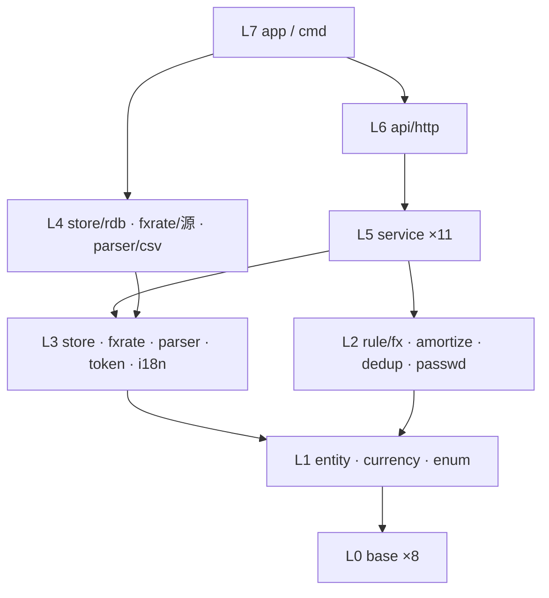
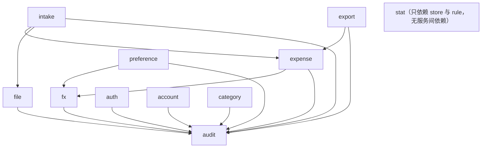
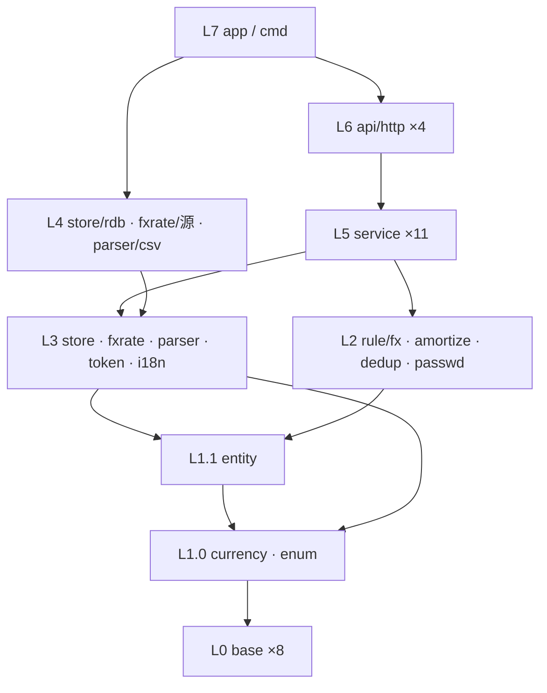
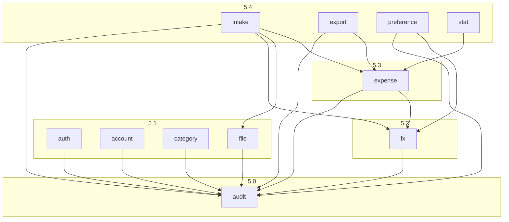
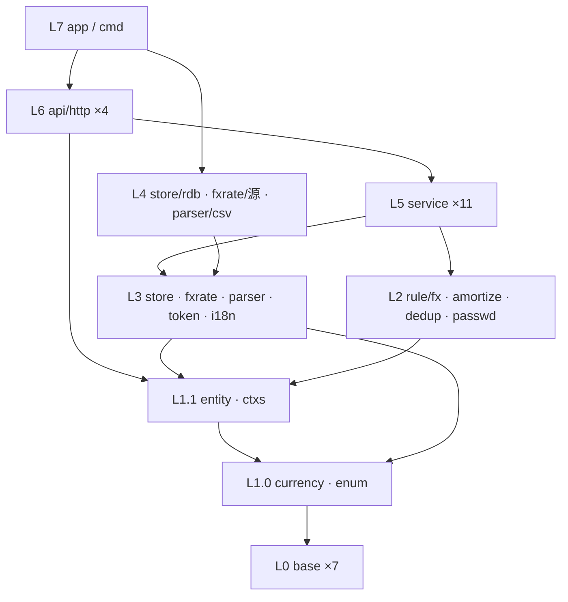
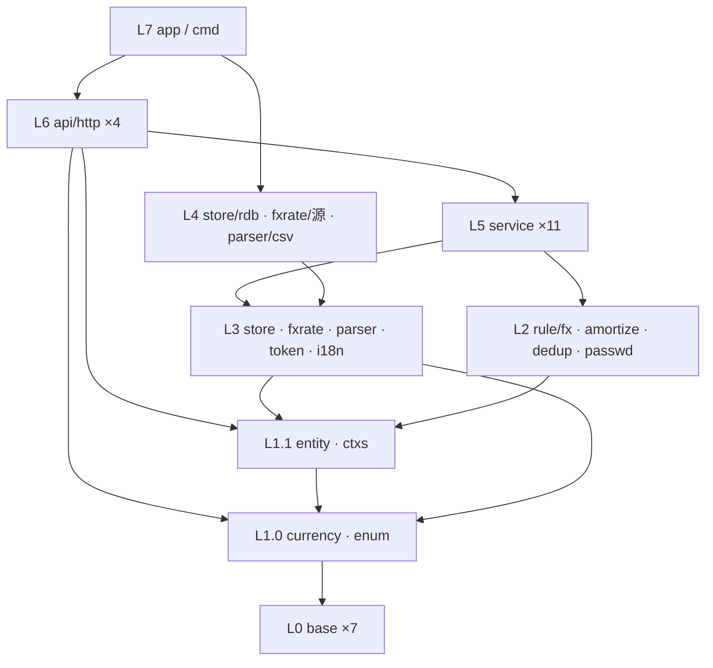
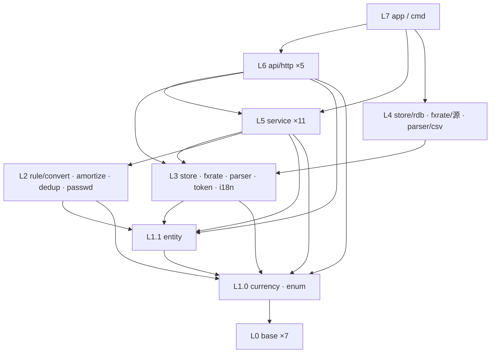
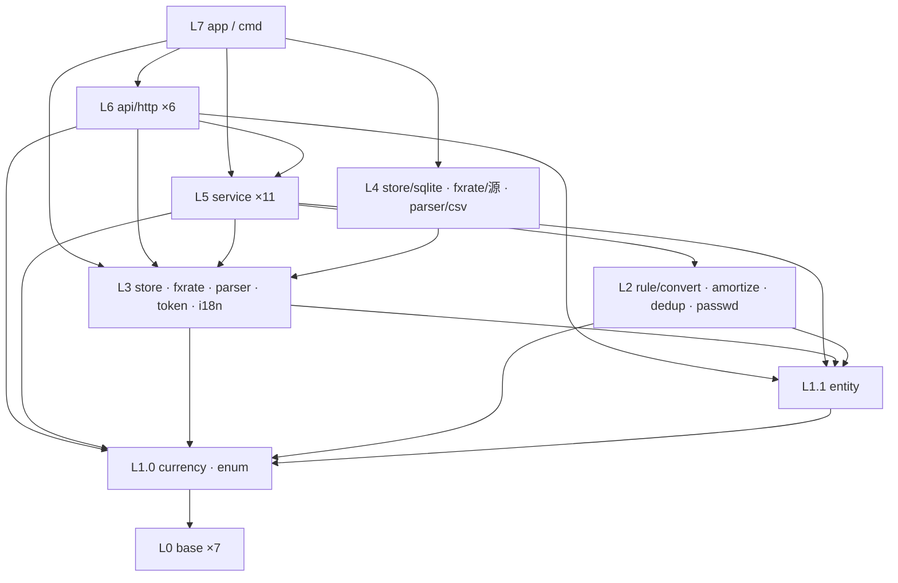
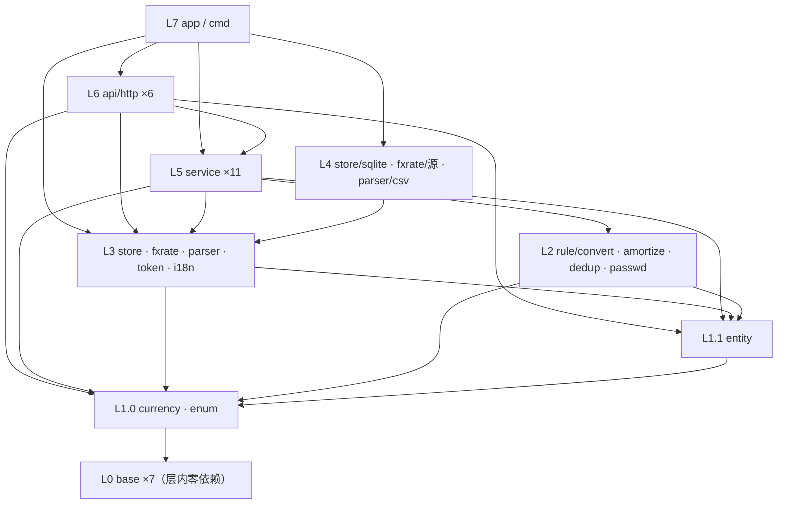
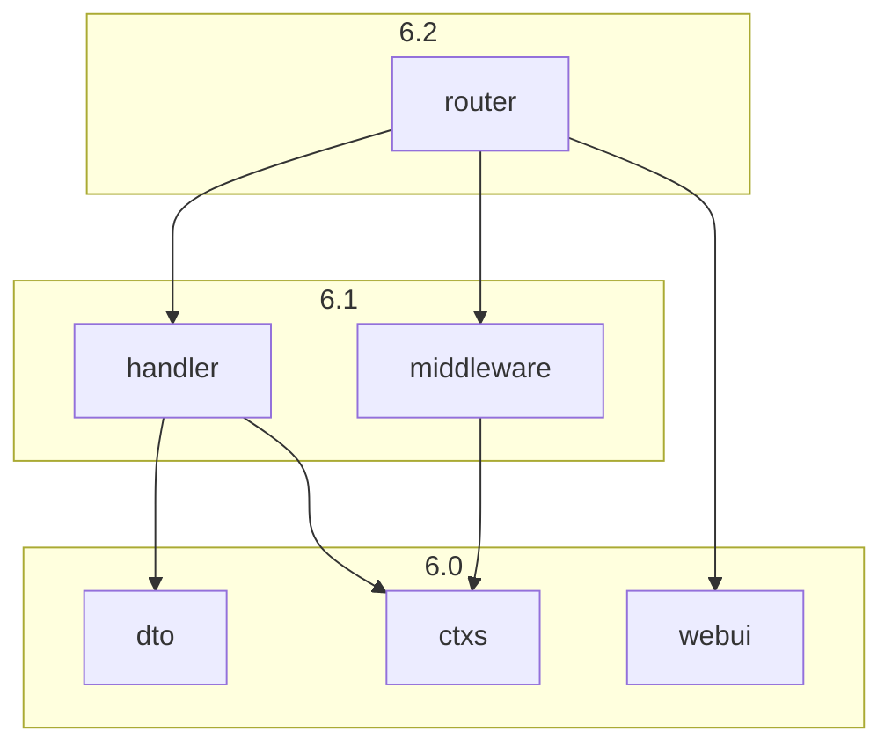

# 对话1 · 仓库代码包的层级设计与划分

> 依据来源：`doc/decisions/记账系统功能与模型.md`（对话20 最终定稿，下称「终版」）全文；补充参考 `260903-173423-answer.md` 对话1~3 的判定。
> 代码侧：仓库**无任何实现**（仅 `go.mod`：`module github.com/cellargalaxy/jotcash` / `go 1.27.0`），本轮为**从零搭建**，不存在存量链路与兼容性负担。
> 范围：只做包的划分、职责、依赖与目录结构；**不写代码、不写 SQL、不定字段类型与索引**。
> 规模：**8 层 / 40 包 / 5 条划分准则 / 11 域与 4 条不变式的双向落点校验 / 40 步拓扑实施序 / 4 项待确认**。

---

## 一、结论摘要

- **主轴不是「按实体分包」，而是「按不变式分包」**：终版 §九 的 4 条不变式，每条锁定在**唯一一个包**里实现，其余包只能调用、不得复写。这是整套划分的取舍依据。
- **纵向 8 层严格单向**：`base → enum/entity → rule → 端口 → 适配 → service → api → app`。
- **横向靠「端口在下、实现在上」解环**：`store` / `fxrate` / `parser` 只定义接口与查询口径，实现放在各自子包；service 只依赖接口，具体实现**只在 L7 组装层被 import 一次**。因此任一包都可在其依赖已完成时**单独写完并单测通过**，不需要等上层。
- **service 层内部再分 5 个子层**（audit → 基础域 → fx → expense → 编排域），子层内互不依赖，从根上杜绝服务间循环。

---

## 二、依据、冲突与前提

### 2.1 一处必须说明的冲突

| 冲突点 | 你的要求 | 事实 | 采用依据 |
| ------ | -------- | ---- | -------- |
| 「包关系是**树状结构**」 | 每包唯一父节点 | 严格树在 Go 里做不到——`entity`、`base/errs` 必然被几十个包共同依赖，任何公共基础包都会有多个父 | 采用**分层 DAG**：① 只允许上层依赖下层，**层内包互不依赖**（service 层按 5 个显式子层排序）；② 无环。这两条即「树状」的可执行等价物，且比树更弱、可落地。**如需字面上的树，只能靠复制公共代码，代价不可接受** |

### 2.2 前提（本轮为设计成立所需，非终版内容）

| # | 前提 | 状态 |
| - | ---- | ---- |
| 1 | 服务形态为「单进程 Go 服务 + HTTP 接口 + 关系型存储」 | **推断**——终版 A-6「所有页面与接口」、C-2「原始二进制随记录存储」、K-2「跳转到关联对象」共同指向 Web 服务 + 单库；未见显式决策 |
| 2 | 前端形态（服务端模板 / 前后端分离）未定 | **待确认 T34**，仅影响 L6 与 `web/`，不影响 L0~L5 任何一包 |
| 3 | 存储引擎未定 | **待确认 T33**，仅影响 `store/rdb` 一个包 |
| 4 | 全部包内注释与日志用中文 | 沿用你既有要求 |

---

## 三、五条划分准则

| # | 准则 | 直接来源 |
| - | ---- | -------- |
| 1 | **不变式内聚**：一条不变式只有一处实现 | 终版 §九 |
| 2 | **纯规则与 IO 分离**：8.1 折算、8.2 摊分、8.3 查重、A-8 密码策略一律做成无 IO 纯函数包 | 这四处是全系统仅有的「算错就静默出错」的逻辑，必须能脱离 DB 单测 |
| 3 | **枚举即代码**：币种、解析器类型两套枚举建独立包，库中只存代码/键 | 终版 §五 1、§五 2 |
| 4 | **端口在下、实现在上**：接口与查询口径定义在 L3，实现在 L4 | 支撑「逐个包单独完整实现」——写 service 时 DB 尚未选型也能写完 |
| 5 | **审计是基座不是切面**：`service/audit` 单独成包并位于全部业务服务之下 | 终版 §九 4「一次提交 = 一条审计 = 一个可追溯批次」；做成切面则拿不到审计ID 回填 |

---

## 四、分层总表（8 层 40 包）

> 依赖列只写**直接依赖**；`base/*` 被普遍依赖，除首次出现外不再重复列出。

### L0 基础层（8 包）— 零业务语义，依赖：仅标准库与第三方库

| 包 | 承载内容 | 依赖 |
| -- | -------- | ---- |
| `base/errs` | 统一错误类型与错误码；区分「用户输入错误 / 归属越权 / 未登录 / 系统错误」四档，供 D-3 与 L6 错误映射使用 | — |
| `base/log` | 日志；**A-3 的 admin 初始密码一次性打印走此包** | — |
| `base/config` | 配置加载（监听地址、DB 连接、令牌密钥与 12h 时效、汇率源、语言目录） | — |
| `base/idgen` | 5 类实体的唯一标识生成 | — |
| `base/decimal` | 定点小数类型与 `round(值, 位数, 舍入方式)`；**金额一律不用浮点** | — |
| `base/month` | 年月类型与区间运算（`起始月 + N - 1`、`起始月 ≤ M ≤ 结束月`） | — |
| `base/ctxs` | 请求上下文中的当前登录用户（用户ID / 角色）存取 | — |
| `base/pwdhash` | 加盐哈希与校验（算法待定，见 T33 邻项建议 Argon2id）、安全随机串生成 | — |

### L1 领域定义层（3 包）— 只有类型，无行为，依赖 L0

| 包 | 承载内容 | 依赖 |
| -- | -------- | ---- |
| `entity` | 5 实体 62 属性的结构体定义（`User` 15 / `ExpenseCategory` 5 / `Expense` 22 / `File` 11 / `AuditLog` 9），零方法 | `base/decimal`、`base/month` |
| `currency` | **币种枚举**：代码、名称、符号、**小数位数**、是否启用、汇率获取实现标识（§五 1）；只存代码入库；提供合法性校验（应用层是唯一校验点） | `base/*` |
| `enum` | 角色 / 用户状态 / 文件格式（CSV·Excel·PDF）/ **解析器类型键**（§五 2）/ **11 类操作类型** / 操作对象类型 / 操作结果（§8.4） | `base/*` |

### L2 规则层（4 包）— 纯函数、无 IO、可脱库单测，依赖 L1

| 包 | 承载内容 | 依赖 |
| -- | -------- | ---- |
| `rule/fx` | **不变式 1 的唯一实现处**：8.1 六种触发的三字段联动矩阵；`本位币金额 = round(支出金额 × 折算汇率, 本位币小数位)`；`折算本位币币种` 的更新条件（仅「汇率重拉或手填」时更新） | `entity`、`currency`、`base/decimal` |
| `rule/amortize` | 8.2 摊分：起止月派生、按币种小数位均分、**尾差归末月**、原币与本位币各自独立均分、负金额对称处理 | `entity`、`currency`、`base/month` |
| `rule/dedup` | 8.3 判重：四要素（归属用户 + 支出日期 + 支出金额 + 支出币种）等值匹配、**排除自身**、本次录入内部互查；只出「疑似重复」标记，不做处置 | `entity` |
| `rule/passwd` | A-8 策略校验（长度 ≥ 10、字母/数字/符号至少两类）+ **符合策略的随机初始密码生成**（A-2） | `base/pwdhash` |

### L3 端口层（5 包）— 只定接口与口径，无具体技术，依赖 L1/L2

| 包 | 承载内容 | 依赖 |
| -- | -------- | ---- |
| `store` | 5 实体仓储接口 + **查询条件类型**（F-4 全部筛选维度、排序、分页、F-6 聚合口径）+ **事务执行器**（跨仓储同事务）；**每个按 ID 访问的方法签名强制带归属用户ID**——不变式 3 的编译期兜底。三处特殊口径：① `File` 元信息与二进制内容**分接口**（列表不拖二进制）；② `Expense` 提供**游标迭代**（I-7 逐笔重算不全量装载）；③ 摊分区间穿刺（`起始月 ≤ M` 且 `结束月 ≥ M`）作为一等查询条件 | `entity`、`enum`、`currency` |
| `fxrate` | 日汇率获取接口（按币种对 + 日期）+ 失败语义（失败即返回错误，**禁止静默 1:1**，I-5） | `currency`、`base/*` |
| `parser` | 解析器接口 + **按解析器类型键的注册表**（D-1）；输出「逐笔明细 + 银行名称 / 卡号后四位 / 卡片币种」；错误分类（格式不符 / 内容损坏 / 字段缺失 / 解密失败 / 类型不匹配，D-3） | `entity`、`enum`、`base/errs` |
| `token` | 无状态令牌签发与解析（载荷：用户ID / 角色 / 签发时间 / 过期时间；12h 绝对过期不可续期，§五 3）；**基线时间比对不在此包**（需读库，属 `service/auth`） | `enum`、`base/config` |
| `i18n` | K-4 界面文案：语言配置文件加载与取词；**不含数据内容翻译** | `base/config` |

### L4 适配实现层（3 包）— 依赖 L3 接口，被 L7 唯一 import

| 包 | 承载内容 | 依赖 |
| -- | -------- | ---- |
| `store/rdb` | `store` 全部接口的关系型实现 + 建表/迁移；**唯一知道 SQL 的地方** | `store` |
| `fxrate/<源>` | 具体汇率源实现 + 日汇率缓存（同日同币种对只取一次） | `fxrate` |
| `parser/csv` | 本轮唯一实现（D-1「本轮仅实现 CSV」）；后续每加一家银行/格式 = 新增一个平级子包，**不改任何上层** | `parser` |

### L5 服务层（11 包，5 个子层，层内互不依赖）

| 子层 | 包 | 承载内容（功能编号） | 依赖 |
| ---- | -- | -------------------- | ---- |
| **5.0** | `service/audit` | **不变式 4 的唯一实现处**：11 类审计写入、「先落审计取 ID → 业务数据挂载该 ID → 同事务提交」的调用序、K-2 本人审计查询；强制三条边界（读操作除导出外不记、`变更内容` 不含任何密码值、管理员操作归属管理员） | `store`、`enum` |
| **5.1** | `service/auth` | A-4 登录、A-5 时效、A-6 校验（含**基线时间比对**）、A-8 失败计数与 10 分钟锁定 | `store`、`token`、`rule/passwd`、`base/pwdhash`、`service/audit` |
| **5.1** | `service/account` | A-1 系统初始化建 admin、A-2/A-3 初始密码生命周期、A-7 账户管理、A-8 自助改密；**改密/重置/禁用推进基线时间** | `store`、`rule/passwd`、`base/pwdhash`、`service/audit` |
| **5.1** | `service/category` | G-1 建/删、G-4 引用检查（**含已软删除明细构成引用**）后物理删除 | `store`、`service/audit` |
| **5.1** | `service/file` | C-1~C-4 上传入库、元信息、下载/预览、归属校验；挂「文件上传」审计 | `store`、`service/audit` |
| **5.1** | `service/stat` | J-1~J-6 月度统计双口径、类型分布、趋势同环比、下钻、未来待摊分段；**已删除明细不参与** | `store`、`rule/amortize` |
| **5.2** | `service/fx` | I-3 取汇率、I-4 入账折算、I-5 兜底转必填、**I-7 逐笔重算（单笔三字段同事务、可中断可续跑）**；对外暴露「给一行算折算三字段」的统一入口 | `store`、`fxrate`、`rule/fx`、`service/audit` |
| **5.3** | `service/expense` | F-1~F-8：列表、多维筛选、逐笔编辑（走 `rule/dedup` 排除自身）、筛选态合计、软删除（逐笔/批量/全选筛选集，已删除行跳过）、导出取数 | `store`、`rule/*`、`service/fx`、`service/audit` |
| **5.4** | `service/intake` | D-2~D-7 + E-2：解析 → 折算 → 双向查重 → 预览数据组装 → **提交入库（一条「数据入库」审计 + N 条明细同事务）**；三种录入进入方式（文件导入 / 手工录入 / F-8 复制）在此收敛，**复制不重拉汇率** | `parser`、`service/file`、`service/expense`、`service/fx`、`service/audit` |
| **5.4** | `service/export` | K-3 整库导出（5 实体，含二进制与文件密码）、F-7 明细导出；均记「数据导出」审计 | `store`、`service/expense`、`service/audit` |
| **5.4** | `service/preference` | K-1 本位币与界面语言切换；**切本位币落两条审计**（`用户偏好设置` 必成功 + `本位币金额重算` 允许部分失败） | `store`、`service/fx`、`service/audit` |

### L6 接入层（4 包）

| 包 | 承载内容 | 依赖 |
| -- | -------- | ---- |
| `api/http/dto` | 请求/响应结构与校验；**与 `entity` 解耦**，`密码哈希`/`盐` 在此层被物理隔离（A-7 展示口径） | `entity`、`enum` |
| `api/http/middleware` | A-6 全局登录态校验（除登录页/登录接口）、管理员校验（A-7）、把当前用户写入 `base/ctxs`、`base/errs` → HTTP 状态映射、i18n 文案、请求日志 | `service/auth`、`i18n`、`base/*` |
| `api/http/handler` | 各域薄适配：DTO ↔ 服务入参出参，无业务判断；按域分文件（auth / account / category / file / expense / intake / stat / export / preference / audit） | L5 全部、`dto` |
| `api/http/router` | 路由注册与中间件装配、静态资源挂载 | `handler`、`middleware` |

### L7 组装层（2 包）

| 包 | 承载内容 | 依赖 |
| -- | -------- | ---- |
| `app` | **唯一 import 具体实现的地方**：依赖装配（选 `store/rdb`、汇率源、注册解析器）、建表迁移、A-1 启动初始化、优雅退出 | L4 全部、L5 全部、L6、`base/config` |
| `cmd/jotcash` | `main`：读配置 → 交给 `app` | `app` |

---

## 五、依赖图



service 层内部（箭头 = 依赖方向，无环）：



---

## 六、正向校验：11 域 57 项功能的包落点

| 域 | 项数 | 主责包 | 协作包 |
| -- | ---- | ------ | ------ |
| A 账户与认证 | 8 | `service/auth`、`service/account` | `token`、`rule/passwd`、`base/pwdhash`、`base/log`(A-3) |
| B 权限与审计 | 4 | `service/audit` | `store`(签名强制归属)、`api/http/middleware` |
| C 文件管理 | 4 | `service/file` | `store`(元信息/内容分接口) |
| D 数据录入 | 7 | `service/intake` | `parser`、`service/file`、`service/fx`、`rule/dedup` |
| E 去重 | 2 | `rule/dedup` | `service/intake`、`service/expense`(F-5 编辑链路) |
| F 支出明细 | 8 | `service/expense` | `service/fx`、`rule/amortize`、`rule/dedup`、`store` |
| G 支出类型 | 4 | `service/category` | `store`(引用检查含已软删明细) |
| H 摊分 | 4 | `rule/amortize` | `service/expense`(H-4 预览)、`service/stat` |
| I 多币种 | 6 | `service/fx` | `currency`、`fxrate`、`rule/fx` |
| J 月度统计 | 6 | `service/stat` | `rule/amortize`、`store`(区间穿刺) |
| K 配置与运维 | 4 | `service/preference`、`service/export`、`service/audit`(K-2) | `i18n`(K-4)、`base/config` |

> 57 项功能中**无悬空项**；I-6 为作废空号，不占落点。

---

## 七、反向校验：4 条不变式的唯一实现处

| 不变式 | 唯一实现包 | 其余包的约束 |
| ------ | ---------- | ------------ |
| 1 恒等式与三字段联动 | `rule/fx` | **任何其他包不得自行做「金额 × 汇率」乘法**；`service/fx`/`expense`/`intake` 一律经此包 |
| 2 重算原子粒度是单笔 | `service/fx` | 事务边界由 `store` 的事务执行器提供，单笔三字段同事务；允许部分失败、可续跑 |
| 3 归属校验无死角 | `store`（接口签名强制归属用户ID） | 上层拿不到「不带归属的查询方法」；`middleware` + `base/ctxs` 负责把当前用户送达 |
| 4 一次提交 = 一条审计 = 一个批次 | `service/audit` | 入库/上传类操作必须走它的「先审计后挂载」调用序，禁止 service 直接写 `AuditLog` 表 |

5 实体 62 属性全部落在 `entity`；5 组关联（§七）落在 `store` 的查询条件与外键口径；§六「刻意不建的 11 项实体」在包结构上体现为**没有对应的 store 接口与 service 包**（币种/解析器类型是枚举包、汇率是 `Expense` 上的数值、登录态是 `token` 无状态包、摊分份额是 `rule/amortize` 的派生输出）。

---

## 八、Go 仓库结构

```
jotcash/
├── cmd/
│   └── jotcash/                 # main：读配置 → app.Run
├── internal/
│   ├── base/                    # L0
│   │   ├── errs/  log/  config/  idgen/
│   │   └── decimal/  month/  ctxs/  pwdhash/
│   ├── entity/                  # L1 5 实体 62 属性
│   ├── currency/                # L1 币种枚举（含小数位数）
│   ├── enum/                    # L1 角色/状态/文件格式/解析器类型键/11 类审计
│   ├── rule/                    # L2 纯规则
│   │   ├── fx/  amortize/  dedup/  passwd/
│   ├── store/                   # L3 仓储接口 + 查询条件 + 事务执行器
│   │   └── rdb/                 # L4 关系型实现（唯一写 SQL 处，含迁移）
│   ├── fxrate/                  # L3 汇率获取接口
│   │   └── <源>/                # L4 具体汇率源 + 日缓存
│   ├── parser/                  # L3 解析器接口 + 注册表
│   │   └── csv/                 # L4 本轮唯一实现；每加一家银行 = 新增平级子包
│   │       └── testdata/        # 样例账单
│   ├── token/                   # L3 无状态令牌
│   ├── i18n/                    # L3 界面文案取词
│   ├── service/                 # L5
│   │   ├── audit/                       # 5.0 基座
│   │   ├── auth/  account/  category/  file/  stat/   # 5.1
│   │   ├── fx/                          # 5.2
│   │   ├── expense/                     # 5.3
│   │   └── intake/  export/  preference/# 5.4
│   ├── api/
│   │   └── http/
│   │       ├── dto/  middleware/  handler/  router/
│   └── app/                     # L7 装配 + 启动初始化
├── configs/                     # 配置样例
├── locales/                     # K-4 语言配置文件（本轮仅 zh-CN）
├── web/                         # 前端产物/模板（形态待确认 T34）
├── doc/                         # 现有文档
├── go.mod
└── README.md
```

**约定三条**：① 全部业务包在 `internal/` 下，不对外提供库；② 接口包与实现子包同名父子关系（`store` / `store/rdb`），实现子包只被 `app` import；③ 包名短小、单数、无下划线，中文注释与日志。

---

## 九、实施顺序（拓扑序，逐包可独立完成）

| 阶段 | 包 | 完成标志 |
| ---- | -- | -------- |
| 1 | `base/*` 8 包 | 单测通过；`decimal` 的舍入口径先与你确认（见 T35） |
| 2 | `entity`、`currency`、`enum` | 62 属性、两套枚举、11 类审计类型齐备 |
| 3 | `rule/fx`、`rule/amortize`、`rule/dedup`、`rule/passwd` | **四包是全仓库单测密度最高处**：8.1 六种触发、8.2 尾差与负金额、8.3 四条链路、A-8 策略逐条覆盖 |
| 4 | `store`、`fxrate`、`parser`、`token`、`i18n` | 只有接口与类型，可编译 |
| 5 | `store/rdb` | 选型确认后实现（T33）；建表与迁移 |
| 6 | `fxrate/<源>`、`parser/csv` | 各自可独立联调 |
| 7 | `service/audit` | 「先审计后挂载」调用序可用 |
| 8 | `service/auth`、`account`、`category`、`file`、`stat` | 层内 5 包**可并行**，互不依赖 |
| 9 | `service/fx` → `service/expense` → `service/intake`/`export`/`preference` | 严格按序 |
| 10 | `api/http/*` 4 包 → `app` → `cmd/jotcash` | 端到端可跑 |

> 任一阶段内的包，只依赖前序阶段的**已完成产物**，符合「逐个包单独完整实现」。阶段 5/6 与阶段 7~9 之间**无依赖**——service 只依赖 L3 接口，因此存储选型未定也不阻塞业务服务开发。

---

## 十、扩展预留位

| 未结项 | 对分包的影响 |
| ------ | ------------ |
| **T4 自动打标**（终版 §十一） | 第一步「对手方记忆」**零新增包**——查历史明细众数，落 `service/intake` 内部；第二步「关键词规则」才新增 `entity` 一个实体 + `store` 一个接口 + `service/tagging` 一个包（挂 5.1 子层） |
| **T31 I-7 取哪天汇率** | 仅影响 `service/fx` **内部一行取数逻辑**，不影响任何分包 |
| **T32 导出格式** | 仅影响 `service/export` 内部；若要出 OFX/QIF，新增 `export/<格式>` 子包 |
| 场景 A（接结构化数据源、加银行流水号/记账日期） | `entity` 加字段 + `rule/dedup` 加一条硬去重前置；`parser` 接口不变 |
| 场景 B（扩复式记账） | **本设计救不了**——`entity`/`rule`/`store`/`service` 四层全动，与终版判定一致 |

---

## 十一、交付说明

- **交付物**：本节——5 条划分准则、8 层 40 包分层总表、2 张依赖图、11 域正向落点表、4 条不变式反向落点表、Go 仓库目录结构、10 阶段拓扑实施序、5 项扩展预留位。
- **未做**：不写代码、不写 SQL、不定字段类型/索引/表结构、不选具体框架与库——均属技术选型与实现轮次。
- **副作用评估**：仓库为空，无存量链路与兼容性影响。性能相关的三处已在 `store` 层的接口口径中前置约束（文件二进制与元信息分接口、明细游标迭代、摊分区间穿刺与筛选态聚合下推），避免上层内存累加。
- **校验方式**：
  ① **无环校验**——8 层严格单向 + service 层 5 子层显式排序，逐包核对其依赖是否全部位于更低层，无反向与同层依赖；
  ② **可独立实现校验**——逐阶段核对「实施时其依赖是否已完成」，其中 L5 只依赖 L3 接口，与 L4 实现解耦，故阶段 5/6 与 7~9 可互换顺序；
  ③ **功能正向覆盖**——11 域 57 项逐项落包，无悬空功能（I-6 为作废空号）；
  ④ **不变式反向覆盖**——4 条不变式各锁定唯一实现包，并写明其余包的禁止项；
  ⑤ **不建实体校验**——§六 11 项「刻意不建」逐条确认在包结构上无对应 store 接口与 service 包；
  ⑥ **冲突未静默取舍**——「树状结构」与 Go 公共依赖的冲突已在 §2.1 列出并给出采用依据。
- **待确认（4 项）**：

| 编号 | 问题 | 影响面 |
| ---- | ---- | ------ |
| **T33** | 存储引擎选型 | 仅 `store/rdb` 一个包；建议同时定下密码哈希算法（对话1 ⚠️-2 建议 Argon2id），影响 `base/pwdhash` |
| **T34** | 前端形态：服务端模板 / 前后端分离 | 仅 L6 与 `web/`；L0~L5 不受影响 |
| **T35** | `本位币金额` 的存储精度与舍入方式（对话2 §三 1 的真问题） | 影响 `base/decimal` 与 `rule/fx`，**是阶段 1 的前置**，需先于编码确认 |
| **T31** | I-7 重拉哪一天的汇率（沿用未结） | 仅 `service/fx` 内部 |

---


# 对话2 · 复核结论与修订版完整方案

> 依据来源：本文件对话1 全文；`doc/decisions/记账系统功能与模型.md`（下称「终版」）§一前提 8、§二 11 域 57 项、§四 62 属性、§五、§六、§八、§九；`260903-173423-answer.md` 对话1 §四 ⚠️-2、对话2 §三 1。
> 代码侧：仓库仍无任何实现（仅 `go.mod`），本轮为设计校对与回写，无存量影响。
> **结论：8 层 40 包的骨架成立——无环、可逐包实现，不推翻。查出 12 处实际问题，已全部修复。**
> **§三 起为修订后的完整方案，取代对话1 的 §三~§九；对话1 保留作推导留痕。修正后包数仍为 40、层数仍为 8。**

---

## 一、四问的检查结论

| 检查项 | 判定 | 说明 |
| ------ | ---- | ---- |
| 包的依赖关系与层级关系 | **合理，2 处需调** | 8 层单向 + service 子层排序，逐包核对无反向依赖、无环；`entity` 与 L1 枚举的次序、`service/stat` 的子层位置需调整 |
| 包的职责划分与承载内容 | **骨架对，5 处错** | `store` 归属签名、重算审计归属、`dedup` 输出形态、审计事务边界、`dto` 表述——都是照着写就会返工的硬伤 |
| 功能缺漏 / 承载内容描述错误 | **57 项无整域缺漏，5 处不实** | 落点表把纯前端项算成后端覆盖；终版**前提 8 无任何包级落点**；`file`、`audit` 两包各缺两项承载内容 |
| Go 仓库结构 | **合理，2 处缺漏** | 缺迁移脚本目录；`locales/` 的加载方式未定，直接决定 K-4 能否成立 |

---

## 二、查出并已修复的问题（12 项）

| # | 位置 | 问题 | 修法（已并入 §三 起的方案） |
| - | ---- | ---- | -------------------------- |
| 1 | `store` / 不变式 3 | 「**每个**按 ID 访问的方法强制带归属用户ID」对 `User` 不成立——A-4 登录按用户名查、A-1 查 `admin`、A-7 管理员查他人账户与列表，三条链路都没有「当前归属用户」，照此写 `User` 仓储写不出来 | 拆为**归属型仓储 4 个**（`Expense`/`File`/`AuditLog`/`ExpenseCategory`，强制）+ **`User` 仓储**（不带，越权防线是 `service/auth` 的登录态与 `service/account` 的角色校验）。不变式 3 表述随之收敛 |
| 2 | `service/fx` vs `service/preference` | 「本位币金额重算」审计出现**两个写入方**（fx 表写 I-7 重算并依赖 audit，preference 表又写「落两条审计」） | 该审计固定由 `service/fx` 在重算收尾写（只有它知道成功/失败笔数）；`preference` 只写「用户偏好设置」，再调 `fx` |
| 3 | `rule/dedup` | 承载写「**只出「疑似重复」标记**」，与终版 D-6「并列展示与之**冲突的已入库明细**供人工比对」冲突——布尔标记喂不出这个页面 | 输出改为「**命中行 → 冲突明细集合**」映射，区分「库内冲突」与「本次录入内部冲突」两类来源 |
| 4 | `service/audit` | 调用序被定死为「先落审计取 ID → 业务挂载 → **同事务提交**」。但 8.4 第 2 类登录失败以 `操作结果 = 失败` 记录，同事务下业务回滚会把失败审计一并回滚，A-4 留痕与 A-8 失败计数同时失效 | 显式承载**两种写入语义**：业务同事务审计 / **独立事务审计**（`操作结果 = 失败`，尤以登录失败） |
| 5 | §七 反向校验 | 只覆盖了 §九 的 4 条不变式，**终版前提 8「记录的存在性单向不可逆」没有任何包级落点**——而它和归属校验一样能靠接口形状兜住 | 写入 `store`：`User`/`File`/`AuditLog` 三个仓储**不提供任何删除方法**；`Expense` 只有「写删除时间」；`ExpenseCategory` 的物理删除在签名上要求先过引用检查 |
| 6 | §六 落点表 | 把纯前端项算成了后端包的覆盖：**D-5 未提交保护完全没有后端落点**（终版 §六 已定为「前端会话内临时态」），D-4 预览页、F-3 多选、H-4 即时预览、K-2 跳转同理 | 落点表加「**实现侧**」列，D-5 明确标注「无后端落点」 |
| 7 | `parser` | 依赖 `entity` 并称输出「逐笔明细」。解析结果没有明细ID、归属用户ID、来源审计ID，也没有四项只读派生字段（终版 §四 3），不是 `entity.Expense`，照此写会逼解析器去填它无权决定的系统字段 | `parser` 定义自己的「**原始交易行**」结构；依赖降为 `enum`+`currency`+`base/errs`；到 `entity.Expense` 的映射由 `service/intake` 承担 |
| 8 | L1 层内 | 「层内互不依赖」使 `entity` 依赖不到 `currency`/`enum`，于是 `支出币种`/`折算本位币币种`/`卡片币种`/`角色`/`状态`/`操作类型` 全是裸 `string`——L1 定义的枚举类型在核心实体上一次也用不上 | L1 内部再分两级：**L1.0 `currency`/`enum` → L1.1 `entity`**。仍无环，层数与包数不变 |
| 9 | `service/stat` 子层 | 在 5.1，够不到 5.3 的 `service/expense`；但 J-5 下钻要出明细行，摊分口径下还要出「份额金额 + 来源支出」——只能自己再实现一遍明细组装，两处口径必然分叉 | `service/stat` 上移到 **5.4**，依赖 `service/expense` 取明细行（5.4 → 5.3，仍无环） |
| 10 | `service/file` | 缺 C-2「**内容校验值**」的计算落点；缺 C-3 反向查询「由某次操作查本次涉及哪些文件」——`store` 的查询条件也没列「按来源审计ID 查 `File`」 | 两项均补入 `service/file` 与 `store` 的承载内容 |
| 11 | `service/audit` | 缺 K-2 的**对象存在性探测**（终版 §8.5：物理删除的 `ExpenseCategory` 是全模型唯一会触发「该对象已删除」提示的对象）；`变更内容` 前后值快照由谁生成未定 | 探测补入 audit；快照**由各业务服务采集**（只有它知道改了什么），audit 只负责落库并**强制过滤密码值**（B-4 边界②） |
| 12 | 落点一致性 | **A-1** 在 `service/account` 与 `app` 两处都写了；**F-8** 在 §六 表主责包写 `service/expense`，L5 表却写「复制在 `service/intake` 收敛」 | A-1 逻辑全在 `service/account`，`app` 只在启动时调一次；F-8 拆写：「删除」归 `expense`、「复制」归 `intake` |

> 另有 3 处描述性修正随方案一并回写，不单列为问题：`api/http/dto` 的「与 `entity` 解耦」改述为「不复用 `entity` 结构体、只做单向裁剪转换，`密码哈希`/`盐` 不出现在任何 dto 定义中」；§一 规模的「40 步实施序」订正为「10 阶段」；跨文件引用补全文件名。

---

## 三、六条划分准则

| # | 准则 | 直接来源 |
| - | ---- | -------- |
| 1 | **不变式内聚**：一条不变式只有一处实现，其余包只能调用 | 终版 §九 |
| 2 | **纯规则与 IO 分离**：8.1 折算、8.2 摊分、8.3 查重、A-8 密码策略一律做成无 IO 纯函数包 | 这四处是全系统仅有的「算错就静默出错」的逻辑，必须能脱库单测 |
| 3 | **枚举即代码**：币种、解析器类型建独立包，库中只存代码/键；**枚举项里的「实现」字段不放枚举包** | 终版 §五 1、§五 2。终版字面上把「汇率获取实现」「解析实现」算作枚举项的字段，照搬会让 L1 依赖 L3/L4 必成环——故 `currency` 只留**标识**、`parser` 持**注册表** |
| 4 | **端口在下、实现在上**：接口与查询口径在 L3，实现在 L4，L4 只被 `app` import 一次 | 支撑「逐个包单独完整实现」：写 L5 时存储选型（T33）未定也不阻塞 |
| 5 | **审计是基座不是切面**：`service/audit` 位于全部业务服务之下 | 终版 §九 4。做成中间件切面就拿不到审计ID 回填 |
| 6 | **不可逆性与归属靠接口形状兜底**：前提 8 与不变式 3 尽量在 `store` 的方法签名上表达，而非靠上层自觉 | 终版 §一前提 8、§九 3。**新增**——修复 §二 表第 5 项 |

---

## 四、分层总表（8 层 40 包）

> 依赖列只写**直接依赖**；`base/*` 被普遍依赖，除首次出现外不再重复列出。

### L0 基础层（8 包）— 零业务语义，仅依赖标准库与第三方库

| 包 | 承载内容 | 依赖 |
| -- | -------- | ---- |
| `base/errs` | 统一错误类型与错误码；四档：用户输入错误 / 归属越权 / 未登录 / 系统错误，供 D-3 与 L6 错误映射 | — |
| `base/log` | 日志；**A-3 的 admin 初始密码一次性打印走此包**（全系统唯一出现密码明文之处） | — |
| `base/config` | 配置加载（监听地址、DB 连接、令牌密钥与 12h 时效、汇率源、语言目录） | — |
| `base/idgen` | 5 类实体的唯一标识生成 | — |
| `base/decimal` | 定点小数类型与 `round(值, 位数, 舍入方式)`；**金额一律不用浮点**（口径见 T35） | — |
| `base/month` | 年月类型与区间运算（`起始月 + N − 1`、`起始月 ≤ M ≤ 结束月`） | — |
| `base/ctxs` | 请求上下文中的当前登录用户（用户ID / 角色）存取 | — |
| `base/pwdhash` | 加盐哈希与校验（算法见 T36）、安全随机串生成 | — |

### L1.0 枚举层（2 包）— 依赖 L0

| 包 | 承载内容 | 依赖 |
| -- | -------- | ---- |
| `currency` | **币种枚举**：代码、名称、符号、**小数位数**、是否启用、**汇率获取实现的标识**（不含实现本身，见准则 3）；只存代码入库；提供合法性校验——应用层是唯一校验点（终版 §五 1） | `base/*` |
| `enum` | 角色 / 用户状态 / 文件格式（CSV·Excel·PDF）/ **解析器类型键**（不含解析实现，终版 §五 2）/ **11 类操作类型** / 操作对象类型 / 操作结果 | `base/*` |

### L1.1 实体层（1 包）

| 包 | 承载内容 | 依赖 |
| -- | -------- | ---- |
| `entity` | 5 实体 62 属性的结构体定义（`User` 15 / `ExpenseCategory` 5 / `Expense` 22 / `File` 11 / `AuditLog` 9），**零方法**；币种、角色、状态、操作类型等字段直接用 L1.0 的枚举类型，不用裸 `string` | `currency`、`enum`、`base/decimal`、`base/month` |

### L2 规则层（4 包）— 纯函数、无 IO、可脱库单测

| 包 | 承载内容 | 依赖 |
| -- | -------- | ---- |
| `rule/fx` | **不变式 1 的唯一实现处**：8.1 六种触发的三字段联动矩阵；`本位币金额 = round(支出金额 × 折算汇率, 本位币小数位)`；`折算本位币币种` 仅在「汇率重拉或用户手填」时更新 | `entity`、`currency`、`base/decimal` |
| `rule/amortize` | 8.2 摊分：起止月派生、按币种小数位均分、**尾差归末月**、原币与本位币各自独立均分、负金额对称处理；H-4 的「覆盖月份区间 + 每月分摊金额」派生接口 | `entity`、`currency`、`base/month` |
| `rule/dedup` | 8.3 判重：四要素（归属用户 + 支出日期 + 支出金额 + 支出币种）等值匹配、编辑态排除自身、本次录入内部互查；**输出「命中行 → 冲突明细集合」映射**（供 D-6 并列展示），只标记不处置 | `entity` |
| `rule/passwd` | A-8 策略校验（长度 ≥ 10、字母/数字/符号至少两类）+ **符合策略的随机初始密码生成**（A-2） | `base/pwdhash` |

### L3 端口层（5 包）— 只定接口与口径，无具体技术

| 包 | 承载内容 | 依赖 |
| -- | -------- | ---- |
| `store` | **① 归属型仓储 4 个**（`Expense`/`File`/`AuditLog`/`ExpenseCategory`）——每个按 ID 访问的方法**签名强制带归属用户ID**，不变式 3 的编译期兜底；**② `User` 仓储**——按用户名 / 按用户ID 查，**不带归属参数**（A-1 初始化、A-4 登录、A-7 管理员查列表都无「当前归属用户」），其越权由服务层显式校验；**③ 删除能力按前提 8 裁剪**：`User`/`File`/`AuditLog` **无删除方法**，`Expense` 只有「写删除时间」（已删除行跳过、幂等），`ExpenseCategory` 的物理删除签名要求先过引用检查；**④ 查询条件类型**：F-4 全部筛选维度 + 排序 + 分页、F-6 聚合口径、**按来源审计ID 查 `File`**（C-3 反向）、**摊分区间穿刺**（`起始月 ≤ M` 且 `结束月 ≥ M`）作为一等查询条件；**⑤ 事务执行器**（跨仓储同事务）。两处性能口径：`File` 元信息与二进制内容**分接口**（列表不拖二进制）、`Expense` 提供**游标迭代**（I-7 与 K-3 不全量装载） | `entity`、`enum`、`currency` |
| `fxrate` | 日汇率获取接口（按币种对 + 日期）+ 失败语义：失败即返回错误，**禁止静默 1:1**（I-5） | `currency`、`base/*` |
| `parser` | 解析器接口 + **「原始交易行」结构**（支出日期/金额/币种/对手方/备注 + 银行名称/卡号后四位/卡片币种，解析不出则留空）+ **按解析器类型键的注册表**（D-1）；错误分类：格式不符 / 内容损坏 / 字段缺失 / 解密失败 / 类型不匹配（D-3）。**不依赖 `entity`**——原始行到 `entity.Expense` 的映射归 `service/intake` | `enum`、`currency`、`base/errs` |
| `token` | 无状态令牌签发与解析（载荷：用户ID / 角色 / 签发时间 / 过期时间；12h 绝对过期不可续期，终版 §五 3）；**基线时间比对不在此包**（需读库，属 `service/auth`） | `enum`、`base/config` |
| `i18n` | K-4 界面文案：语言配置文件加载与取词，**不含数据内容翻译**；加载方式见 T37 | `base/config` |

### L4 适配实现层（3 包）— 依赖 L3 接口，仅被 L7 import

| 包 | 承载内容 | 依赖 |
| -- | -------- | ---- |
| `store/rdb` | `store` 全部接口的关系型实现 + **建表与迁移脚本（随二进制 embed，DDL 与代码版本绑定）**；**唯一知道 SQL 的地方** | `store` |
| `fxrate/<源>` | 具体汇率源实现 + 日汇率缓存（同日同币种对只取一次） | `fxrate` |
| `parser/csv` | 本轮唯一实现（D-1「本轮仅实现 CSV」）；后续每加一家银行/格式 = 新增一个平级子包，**不改任何上层** | `parser` |

### L5 服务层（11 包，5 个子层，同一子层内互不依赖）

| 子层 | 包 | 承载内容（功能编号） | 依赖 |
| ---- | -- | -------------------- | ---- |
| **5.0** | `service/audit` | **不变式 4 的唯一实现处**。**两种写入语义**：① **业务同事务审计**——「先落审计取 ID → 业务数据挂载该 ID → 同事务提交」；② **独立事务审计**——`操作结果 = 失败` 的记录（尤以 8.4 第 2 类登录失败），与业务事务解耦，业务回滚不带走它。K-2 本人审计查询 + **跳转对象存在性探测**（仅物理删除的 `ExpenseCategory` 降级为「该对象已删除」）。`变更内容` **由各业务服务采集**，本包负责落库并**强制过滤任何密码值**（明文/哈希/盐）。强制 B-4 三条边界 | `store`、`enum` |
| **5.1** | `service/auth` | A-4 登录、A-5 时效、A-6 校验（含**基线时间比对**）、A-8 失败计数与 10 分钟锁定；登录失败走 audit 的**独立事务**语义 | `store`、`token`、`rule/passwd`、`base/pwdhash`、`service/audit` |
| **5.1** | `service/account` | **A-1 系统初始化建 `admin`（逻辑全在本包，`app` 只负责启动时调用一次）**、A-2/A-3 初始密码生命周期、A-7 账户管理（含管理员角色校验——`User` 仓储不带归属，越权防线在此）、A-8 自助改密；**改密/重置/禁用推进基线时间** | `store`、`rule/passwd`、`base/pwdhash`、`service/audit` |
| **5.1** | `service/category` | G-1 建/删、G-4 引用检查（**含已软删除明细构成引用**）后物理删除 | `store`、`service/audit` |
| **5.1** | `service/file` | C-1~C-4 上传入库、元信息、**内容校验值计算与留存**（仅特征值，不用于查重）、下载/预览、归属校验、**C-3 双向关联的两侧查询**（由文件查审计、按来源审计ID 查本次文件）；挂「文件上传」审计 | `store`、`service/audit` |
| **5.2** | `service/fx` | I-3 取汇率、I-4 入账折算、I-5 兜底转必填、**I-7 逐笔重算**（单笔三字段同事务、允许部分失败、可中断可续跑，走 `store` 游标迭代）；**「本位币金额重算」审计由本包在重算收尾写一条**（记成功/失败笔数）；对外暴露「给一行算折算三字段」的统一入口 | `store`、`fxrate`、`rule/fx`、`currency`、`service/audit` |
| **5.3** | `service/expense` | F-1~F-7 + F-8 的**删除**部分：列表、多维筛选、逐笔编辑（仅未删除明细，走 `rule/dedup` 排除自身）、筛选态合计、软删除（逐笔/批量/全选筛选集，已删除行跳过）、导出取数；编辑记「明细编辑与删除」审计并采集 `变更内容` 快照 | `store`、`rule/fx`、`rule/amortize`、`rule/dedup`、`service/fx`、`service/audit` |
| **5.4** | `service/intake` | D-1~D-3、D-6、D-7 + E-2 + **F-8 的复制**部分：解析 → **原始交易行映射为 `entity.Expense`** → 折算 → 双向查重 → 预览数据组装 → **提交入库（一条「数据入库」审计 + N 条明细同事务）**；三种录入进入方式在此收敛，**复制不重拉汇率**（终版 8.1） | `parser`、`service/file`、`service/expense`、`service/fx`、`service/audit` |
| **5.4** | `service/export` | K-3 整库导出（5 实体，含二进制与文件密码，走游标流式）、F-7 明细导出；均记「数据导出」审计 | `store`、`service/expense`、`service/audit` |
| **5.4** | `service/preference` | K-1 本位币与界面语言切换；**只写「用户偏好设置」审计**（必成功），随后调用 `service/fx` 触发 I-7，重算审计由 fx 写 | `store`、`service/fx`、`service/audit` |
| **5.4** | `service/stat` | J-1~J-6 月度统计双口径、类型分布、趋势同环比、**下钻（明细行经 `service/expense` 取，口径与列表页一致；摊分口径下附份额金额）**、未来待摊分段；**已删除明细不参与**；读操作不记审计 | `store`、`rule/amortize`、`service/expense` |

### L6 接入层（4 包）

| 包 | 承载内容 | 依赖 |
| -- | -------- | ---- |
| `api/http/dto` | 请求/响应结构与校验；**不复用 `entity` 结构体，只做单向字段裁剪与转换**——`密码哈希` / `盐` 不出现在任何 dto 定义中（A-7 展示口径） | `entity`、`enum`、`currency` |
| `api/http/middleware` | A-6 全局登录态校验（除登录页/登录接口）、管理员校验（A-7）、把当前用户写入 `base/ctxs`、`base/errs` → HTTP 状态映射、i18n 文案、请求日志 | `service/auth`、`i18n`、`base/*` |
| `api/http/handler` | 各域薄适配：DTO ↔ 服务入参出参，**无业务判断**；按域分文件（auth / account / category / file / expense / intake / stat / export / preference / audit） | L5 全部、`dto` |
| `api/http/router` | 路由注册与中间件装配、静态资源挂载 | `handler`、`middleware` |

### L7 组装层（2 包）

| 包 | 承载内容 | 依赖 |
| -- | -------- | ---- |
| `app` | **唯一 import 具体实现的地方**：依赖装配（选 `store/rdb`、汇率源、注册解析器）、执行迁移、**启动时调用一次 `service/account` 的 A-1 初始化**、优雅退出 | L4 全部、L5 全部、L6、`base/config` |
| `cmd/jotcash` | `main`：读配置 → 交给 `app` | `app` |

---

## 五、依赖图



service 层内部（箭头 = 依赖方向，5 子层严格下行，无环）：



---

## 六、正向校验：11 域 57 项的落点（含实现侧）

| 域 | 项数 | 后端主责包 | 后端协作包 | 接入层 / 前端 |
| -- | ---- | ---------- | ---------- | ------------- |
| A 账户与认证 | 8 | `service/auth`、`service/account` | `token`、`rule/passwd`、`base/pwdhash`、`base/log`(A-3) | A-6 的拦截在 `middleware` |
| B 权限与审计 | 4 | `service/audit` | `store`（归属签名 + 无删除方法） | B-2 的当前用户注入在 `middleware` + `base/ctxs` |
| C 文件管理 | 4 | `service/file` | `store`（元信息/内容分接口、按审计查文件） | — |
| D 数据录入 | 7 | `service/intake`（D-1~D-3、D-6、D-7） | `parser`、`service/file`、`service/fx`、`rule/dedup` | **D-4 预览页在前端**；**D-5 未提交保护无后端落点**（终版 §六「录入预览暂存数据 = 前端会话内临时态」） |
| E 去重 | 2 | `rule/dedup` | `service/intake`、`service/expense`（F-5 编辑链路） | 高亮与并列比对在前端 |
| F 支出明细 | 8 | `service/expense`（F-1~F-7、F-8 删除）、`service/intake`（F-8 复制） | `service/fx`、`rule/amortize`、`rule/dedup`、`store` | F-3 多选、删除前「N 笔」提示在前端 |
| G 支出类型 | 4 | `service/category` | `store`（引用检查含已软删明细） | — |
| H 摊分 | 4 | `rule/amortize` | `service/expense`、`service/stat` | **H-4 即时预览在前端**（调 `rule/amortize` 的派生接口） |
| I 多币种 | 6 | `service/fx` | `currency`、`fxrate`、`rule/fx` | I-5 汇率转必填的表单态在前端 |
| J 月度统计 | 6 | `service/stat` | `rule/amortize`、`service/expense`(J-5 下钻)、`store`（区间穿刺） | J-1 口径切换与明示在前端 |
| K 配置与运维 | 4 | `service/preference`、`service/export`、`service/audit`(K-2) | `i18n`(K-4)、`base/config` | **K-2 跳转与自动带筛选条件在前端** |

> 57 项无悬空；I-6 为作废空号，不占落点。**D-5 是唯一一项完全没有后端落点的功能**——这是终版的设计意图，不是缺漏。

---

## 七、反向校验：4 条不变式 + 前提 8 的落点

| 约束 | 唯一实现处 | 其余包的约束 |
| ---- | ---------- | ------------ |
| 不变式 1 恒等式与三字段联动 | `rule/fx` | **任何其他包不得自行做「金额 × 汇率」乘法**；`service/fx`/`expense`/`intake` 一律经此包。T35 的舍入口径也只落在这一处 |
| 不变式 2 重算原子粒度是单笔 | `service/fx` | 事务边界由 `store` 的事务执行器提供，单笔三字段同事务；允许部分失败、可续跑；未收敛行由「折算本位币币种 ≠ `User.本位币`」唯一识别 |
| 不变式 3 归属校验无死角 | `store` 的 **4 个归属型仓储**（签名强制）+ `service/auth` / `service/account`（`User` 的显式校验） | 上层拿不到「不带归属的业务查询方法」；`middleware` + `base/ctxs` 负责把当前用户送达 |
| 不变式 4 一次提交 = 一条审计 = 一个批次 | `service/audit` | 入库/上传类必须走「先审计后挂载」的**同事务**语义；失败类走**独立事务**语义；**禁止任何 service 直接写 `AuditLog` 表** |
| **前提 8 存在性单向不可逆** | `store` 的**方法集合本身** | `User`/`File`/`AuditLog` 仓储无删除方法；`Expense` 仅「写删除时间」；`ExpenseCategory` 物理删除须先过引用检查。上层想违反也没有可调的方法 |

5 实体 62 属性全部落 `entity`；5 组关联落 `store` 的查询条件与外键口径；终版 §六「刻意不建的 11 项实体」在包结构上体现为**没有对应的 store 接口与 service 包**（币种/解析器类型是枚举包、汇率是 `Expense` 上的数值快照、登录态是 `token` 无状态包、摊分份额是 `rule/amortize` 的派生输出、录入暂存是前端会话态）。

---

## 八、Go 仓库结构

```
jotcash/
├── cmd/
│   └── jotcash/                     # main：读配置 → app.Run
├── internal/
│   ├── base/                        # L0
│   │   ├── errs/                    # 四档错误
│   │   ├── log/                     # A-3 初始密码一次性打印
│   │   ├── config/
│   │   ├── idgen/
│   │   ├── decimal/                 # 定点小数 + round（T35）
│   │   ├── month/                   # 年月与区间运算
│   │   ├── ctxs/
│   │   └── pwdhash/                 # 加盐哈希 + 安全随机（T36）
│   ├── currency/                    # L1.0 币种枚举（含小数位数、汇率源标识）
│   ├── enum/                        # L1.0 角色/状态/文件格式/解析器键/11 类审计
│   ├── entity/                      # L1.1 5 实体 62 属性，零方法
│   ├── rule/                        # L2 纯函数
│   │   ├── fx/
│   │   ├── amortize/
│   │   ├── dedup/
│   │   └── passwd/
│   ├── store/                       # L3 仓储接口 + 查询条件 + 事务执行器
│   │   └── rdb/                     # L4 关系型实现（唯一写 SQL 处）
│   │       └── migrations/          # 建表与迁移脚本，随二进制 embed
│   ├── fxrate/                      # L3 日汇率接口
│   │   └── <源>/                    # L4 具体汇率源 + 日缓存
│   ├── parser/                      # L3 解析器接口 + 原始交易行 + 注册表
│   │   └── csv/                     # L4 本轮唯一实现；每加一家银行 = 新增平级子包
│   │       └── testdata/            # 样例账单
│   ├── token/                       # L3 无状态令牌
│   ├── i18n/                        # L3 文案取词（加载方式见 T37）
│   ├── service/                     # L5
│   │   ├── audit/                   # 5.0 基座
│   │   ├── auth/                    # 5.1
│   │   ├── account/                 # 5.1
│   │   ├── category/                # 5.1
│   │   ├── file/                    # 5.1
│   │   ├── fx/                      # 5.2
│   │   ├── expense/                 # 5.3
│   │   ├── intake/                  # 5.4
│   │   ├── export/                  # 5.4
│   │   ├── preference/              # 5.4
│   │   └── stat/                    # 5.4
│   ├── api/
│   │   └── http/
│   │       ├── dto/
│   │       ├── middleware/
│   │       ├── handler/
│   │       └── router/
│   └── app/                         # L7 装配 + 迁移 + 启动初始化
├── configs/                         # 配置样例，运行时加载
├── locales/                         # K-4 语言文件（本轮仅 zh-CN），加载方式见 T37
├── web/                             # 前端产物/模板，形态待 T34
├── doc/
├── go.mod
└── README.md
```

**约定四条**：
1. 全部业务包在 `internal/` 下，不对外提供库；
2. 接口包与实现子包为父子关系（`store` / `store/rdb`），实现子包**只被 `app` import**；
3. 包名短小、无下划线，集合语义允许复数（`errs` / `ctxs`）；注释与日志一律中文；
4. **两类外部资源取向相反**：`store/rdb/migrations` 必须 **embed**（DDL 与代码版本绑定，不允许运行时替换）；`locales/` 与 `configs/` 走**运行时加载**（K-4 要求加语种不改代码）。

---

## 九、实施顺序（10 阶段拓扑序，逐包可独立完成）

| 阶段 | 包 | 完成标志 |
| ---- | -- | -------- |
| 1 | `base/*` 8 包 | 单测通过；`decimal` 舍入口径需先确认（T35）、`pwdhash` 算法需先确认（T36） |
| 2 | `currency`、`enum` → `entity` | 两套枚举 + 11 类审计类型齐备；62 属性全部用枚举类型而非裸 `string` |
| 3 | `rule/fx`、`rule/amortize`、`rule/dedup`、`rule/passwd` | **全仓库单测密度最高处**：8.1 六种触发、8.2 尾差与负金额、8.3 四条链路（含冲突集合输出）、A-8 策略逐条覆盖 |
| 4 | `store`、`fxrate`、`parser`、`token`、`i18n` | 只有接口与类型，可编译；`store` 的方法集合须通过「前提 8 + 不变式 3」走查 |
| 5 | `store/rdb` + `migrations` | 选型确认后实现（T33） |
| 6 | `fxrate/<源>`、`parser/csv` | 各自可独立联调 |
| 7 | `service/audit` | 两种写入语义均可用 |
| 8 | `service/auth`、`account`、`category`、`file` | 层内 4 包**可并行**，互不依赖 |
| 9 | `service/fx` → `service/expense` → `service/intake`/`export`/`preference`/`stat` | 严格按序；末组 4 包可并行 |
| 10 | `api/http/*` 4 包 → `app` → `cmd/jotcash` | 端到端可跑 |

> 任一阶段只依赖前序阶段的**已完成产物**。阶段 5/6 与 7~9 之间**无依赖**——L5 只依赖 L3 接口，故存储选型未定不阻塞业务服务开发，两段可互换或并行。

---

## 十、扩展预留位

| 未结项 | 对分包的影响 |
| ------ | ------------ |
| **T4 自动打标**（终版 §十一） | 第一步「对手方记忆」**零新增包**——查历史明细众数，落 `service/intake` 内部；第二步「关键词规则」才新增 `entity` 一个实体 + `store` 一个仓储 + `service/tagging` 一个包（挂 5.1 子层） |
| **T31 I-7 取哪天汇率** | 仅影响 `service/fx` **内部一行取数逻辑**，不影响分包 |
| **T32 导出格式** | 仅影响 `service/export` 内部；若要出 OFX/QIF，新增 `export/<格式>` 子包 |
| 场景 A（接结构化数据源、加银行流水号/记账日期） | `entity` 加字段 + `rule/dedup` 加一条硬去重前置；`parser` 的原始交易行加字段，接口不变 |
| 场景 B（扩复式记账） | **本设计救不了**——`entity`/`rule`/`store`/`service` 四层全动，与终版判定一致 |

---

## 十一、交付说明

- **交付物**：本节即修订版完整方案——四问检查结论、12 项问题与修法、6 条划分准则、8 层 40 包分层总表、2 张依赖图、11 域 57 项含实现侧的落点表、4 条不变式 + 前提 8 的落点表、Go 仓库目录结构与四条约定、10 阶段拓扑实施序、5 项扩展预留位。
- **相对对话1 的净变化**：包数 **40 → 40**、层数 **8 → 8**（L1 内部分 L1.0/L1.1，不新增层）；变的是 `store` 接口形状（拆归属型/`User` 仓储 + 按前提 8 裁剪删除方法）、`service/audit` 的两种事务语义、`rule/dedup` 的输出形态、`parser` 的依赖与输出类型、`entity` 的依赖、`service/stat` 的子层（5.1 → 5.4）、`service/fx` 与 `preference` 的审计分工、落点表新增实现侧列。**依赖方向与无环性不受影响**：`entity → currency/enum` 是 L1 内部下行，`stat → expense` 是 5.4 → 5.3 下行。
- **未做**：不写代码、不写 SQL、不定字段类型/索引/表结构、不选具体框架与库——均属技术选型与实现轮次。
- **副作用评估**：仓库为空，无存量链路与兼容性影响。性能相关的四处已在 `store` 接口口径中前置约束（文件二进制与元信息分接口、明细游标迭代供 I-7 与 K-3 使用、摊分区间穿刺、筛选态聚合下推），避免上层内存累加。
- **校验方式**：
  ① **无环校验**——8 层严格单向 + L1 内两级 + service 5 子层显式排序，逐包核对其依赖是否全部位于更低层，无反向与同层依赖；
  ② **可独立实现校验**——逐阶段核对「实施时其依赖是否已完成」，L5 只依赖 L3 接口，故阶段 5/6 与 7~9 可互换；
  ③ **功能正向覆盖**——11 域 57 项逐项落包并标注实现侧，无悬空功能，D-5 唯一无后端落点且属设计意图（I-6 为作废空号）；
  ④ **约束反向覆盖**——4 条不变式 + 前提 8 各锁唯一落点，并写明其余包的禁止项；
  ⑤ **审计写入方唯一性**——11 类审计枚举逐条确认写入方唯一（本轮修正「本位币金额重算」的双写入方）；
  ⑥ **不建实体校验**——终版 §六 11 项逐条确认在包结构上无对应 store 接口与 service 包；
  ⑦ **枚举解环校验**——币种「汇率获取实现」与解析器「解析实现」两字段确认落在 L3/L4 而非 L1 枚举包，否则必成环。
- **待确认（6 项）**：

| 编号 | 问题 | 影响面 | 状态 |
| ---- | ---- | ------ | ---- |
| **T35** | `本位币金额` 的存储精度与舍入方式（`260903-173423-answer.md` 对话2 §三 1） | `base/decimal`、`rule/fx`；**阶段 1 前置，最紧的一项** | 沿用未结 |
| **T36** | 密码哈希算法（`260903-173423-answer.md` 对话1 §四 ⚠️-2 建议 Argon2id）——从原 T33 拆出，二者影响的包不同 | 仅 `base/pwdhash`；**阶段 1 前置** | **新增** |
| **T37** | `locales/` 是 embed 还是运行时读目录——embed 满足「不改代码」但需重新编译发布，运行时读目录才满足「放个文件就生效」，决定 K-4 的成立口径与 `i18n` 的写法 | 仅 `i18n` 与目录结构；**阶段 4 前置** | **新增** |
| **T33** | 存储引擎选型 | 仅 `store/rdb`；**阶段 5 前置**，不阻塞 L5 | 沿用未结 |
| **T34** | 前端形态：服务端模板 / 前后端分离 | 仅 L6 与 `web/`；L0~L5 不受影响 | 沿用未结 |
| **T31** | I-7 重拉哪一天的汇率 | 仅 `service/fx` 内部一行 | 沿用未结 |


---

# 对话3 · 复核结论与修订版完整方案

> 依据来源：本文件对话2 全文；`doc/decisions/记账系统功能与模型.md`（下称「终版」）§一前提 8、§二 11 域 57 项、§四 62 属性、§五、§六、§七、§八（8.1~8.5）、§九、§十 6 条流程。
> 代码侧：仓库仍只有 `go.mod`、`README.md`、`doc/`，无任何实现，本轮为设计校对与回写，无存量影响。
> **结论：8 层 40 包的骨架继续成立——无环、可逐包实现，不推翻。查出 10 处实际问题，已全部修复。**
> **§三 起为修订后的完整方案，取代对话2 的 §三~§十一；对话1、对话2 保留作推导留痕。修正后包数仍为 40、层数仍为 8。**

---

## 一、四问的检查结论

| 检查项 | 判定 | 说明 |
| ------ | ---- | ---- |
| 包的依赖关系与层级关系 | **合理，3 处需调** | 逐包核对无环；但 `base/ctxs` 放在 L0 与「L0 零业务语义」自相矛盾（它存的「角色」是 `enum` 类型）；`service/intake` 依赖列缺 3 个包，照此写不出 D-7；`service/auth` 多挂了一个用不上的依赖 |
| 包的职责划分与承载内容 | **骨架对，4 处错** | H-4 的后端出口被漏掉（落点表让前端直接调 L2，越过 L5）；不变式 1 声称「唯一实现处 `rule/fx`」但它有一半在 `rule/amortize`；`store` 缺查重候选的批量查询口径；`service/export` 缺 K-3 的字段裁剪口径 |
| 功能缺漏 / 承载内容描述错误 | **57 项无整域缺漏，3 处不实** | **A-2「需强制改密时只能走改密流程」全系统无任何落点**；`service/fx` 的 I-7 漏了两条决定成败的口径；`service/auth` 漏了 8.4 第 2 类「无主不记」 |
| Go 仓库结构 | **合理，1 处需调** | 除 `base/ctxs` 目录随层级调整外，目录树、embed/运行时加载的取向、四条约定均无误 |

---

## 二、查出并已修复的问题（10 项）

| # | 位置 | 问题 | 修法（已并入 §三 起的方案） |
| - | ---- | ---- | -------------------------- |
| 1 | `base/ctxs` 层级 | L0 的定义是「**零业务语义**，仅依赖标准库与第三方库」，但 `ctxs` 存的是「当前登录用户的用户ID / **角色**」——角色是 `enum` 类型。要么它像对话2 问题 8 修掉的 `entity` 那样退回裸 `string`（自相矛盾），要么它必须站到 `enum` 之上 | `ctxs` **移出 `base/`，上移到 L1.1**（与 `entity` 同级、互不依赖），路径 `internal/ctxs`。L0 由 8 包变 7 包，L1.1 由 1 包变 2 包，**总数仍 40、层数仍 8** |
| 2 | 全局 · A-2 | 终版 `User.需强制改密`「**为是时只能走改密流程**」（§四 1、§十 流程 1）**在对话2 的 40 个包里没有任何落点**——`middleware` 只写了 A-6 登录态与 A-7 管理员两道校验 | 该拦截补入 `api/http/middleware`：**判定数据不额外读库**——A-6 校验时 `service/auth` 已为比对基线时间读过 `User`，由它一并返回登录上下文（用户ID / 角色 / **界面语言** / **需强制改密**），middleware 写入 `ctxs` 并据此放行或拦截 |
| 3 | `ctxs` 承载 | 承载只有「用户ID / 角色」，但 **K-4 的按用户取词**需要 `User.界面语言`。`middleware` 只依赖 `service/auth` 与 `i18n`，拿不到该字段，照此写 K-4 只能再读一次库或退化为固定语言 | `ctxs` 承载扩为**登录上下文四元组**：用户ID / 角色 / 界面语言 / 需强制改密——恰好是「A-6 已读出、下游要用、又不该重复读库」的全集。与问题 1、2 是同一处修改的三个面 |
| 4 | `service/intake` 依赖 | 承载写「提交入库（**一条「数据入库」审计 + N 条明细同事务**）」「双向查重」「计算摊分起止月」，但依赖列只有 `parser`/`service/file`/`service/expense`/`service/fx`/`service/audit`——**跨仓储事务执行器在 `store`、查重在 `rule/dedup`、起止月派生在 `rule/amortize`，三个都没列**，照此写 D-7 写不出来 | 依赖列补 `store`、`rule/dedup`、`rule/amortize`；同时把「`entity`/`enum`/`currency` 对 L5 是普遍依赖」并入表头约定，避免同类遗漏 |
| 5 | `store` 查询口径 | 承载的查询条件列了 F-4 筛选、F-6 聚合、按来源审计ID 查 `File`、摊分区间穿刺，**唯独没有查重候选的查询**。8.3 四条链路全要「按支出日期 + 支出金额 + 支出币种 匹配在库未删除明细」，导入 N 行若逐行查库就是 N 次往返 | 补为一等查询条件：**按「(日期, 金额, 币种) 元组集合」批量匹配未删除明细**，一次取回全部候选交 `rule/dedup` 裁定；归属用户由归属型仓储签名强制 |
| 6 | §六 落点表 · H-4 | 标注为「H-4 即时预览在前端（**调 `rule/amortize` 的派生接口**）」——但 L6 只依赖 L5 与 `dto`，**L2 不对接入层开放**，前端根本没有可调的出口；若让前端自行实现均分，「按币种小数位均分 + 尾差归末月」就有了第二处实现，破坏准则 1 | `service/expense` 暴露「**摊分派生预览**」入口（给定 支出日期 / 摊分月数 / 金额 / 币种 → 覆盖月份区间 + 每月分摊金额，不落库），`service/intake` 复用它（5.4 → 5.3，已有依赖）。与 `service/fx` 的「给一行算折算三字段」入口**对称**——同一类问题的同一种解法，故新增准则 7 |
| 7 | §七 · 不变式 1 | 写作「不变式 1 恒等式与三字段联动 → **唯一实现处 `rule/fx`**」。但终版 §九 1 的原文还有后半句「**摊分起始月/结束月在支出日期或摊分月数变更时同步刷新**」，这半句实际落在 `rule/amortize`——一条不变式声称唯一落点却有两个 | 拆为 **1a 折算恒等式与三字段联动 → `rule/fx`**、**1b 摊分起止月刷新 → `rule/amortize`**，并写明二者必须由 `service/expense` / `service/intake` 在**同一次保存内一并调用**（改支出日期会同时触发 1a 与 1b，见 8.1 第 3 行） |
| 8 | F-7 落点冲突 | §六 落点表 F 域主责包写 `service/expense`（F-1~F-7），L5 总表却把「F-7 明细导出」写在 `service/export`——同一功能两处主责，与对话2 自己修掉的问题 12 同型 | 统一为：**取数在 `expense`**（跟随筛选，与 F-6 同一套筛选口径）、**编排与「数据导出」审计在 `export`**；两张表按此表述 |
| 9 | `service/export` | 承载写「K-3 整库导出（5 实体，含二进制与文件密码）」，**漏了终版 K-3 明写的排除项**：`User` 的 `密码哈希`、`盐` 不导出。这与 B-4 边界②、A-7 展示口径是同一条红线，漏写即等于把口令散列随备份包外发 | 承载补：K-3 的 `User` **裁剪 `密码哈希` / `盐`**；`File` 的 `文件内容` 与 `文件密码` **照导**（前提 1 明文口径）。两者取向相反，必须并排写清 |
| 10 | `service/fx` | I-7 承载只写了「逐笔重算、单笔三字段同事务、允许部分失败、可续跑、走游标迭代」，**漏了两条决定行为对错的口径**：① 终版 I-7「**含已软删除的明细**」（它们可经 F-4 查看、可被 F-8 复制，展示必须处于当前本位币口径）；② 「`折算本位币币种 = 当前本位币` 的行**跳过**」。照此写会把已删除行排除在外，F-4 查看与复制初值直接错口径 | 两条口径补入 `service/fx` 的 I-7 承载；同时在 §七 不变式 2 行注明「未收敛行的识别与跳过判据是同一个字段」 |

> 另有 3 处描述性修正随方案回写，不单列为问题：① `service/auth` 依赖列删去 `rule/passwd`——登录只需 `base/pwdhash` 比对，**密码策略校验的调用方只有 `service/account`**（A-8 自助改密、首登强制改密、A-2 生成初始密码）；② `service/auth` 承载补 8.4 第 2 类的「**有主则记、无主不记**」——用户名存在（含密码错 / 禁用 / 锁定期内）记失败审计并归属该用户，用户名不存在则不记；③ `service/category` 承载补 G-1「同一用户下名称唯一」校验与 8.4 第 9 类「**摘要必须带类型名称**」——类型被物理删除后，这是审计仍可读的唯一保障。

---

## 三、七条划分准则

| # | 准则 | 直接来源 |
| - | ---- | -------- |
| 1 | **不变式内聚**：一条不变式只有一处实现，其余包只能调用 | 终版 §九 |
| 2 | **纯规则与 IO 分离**：8.1 折算、8.2 摊分、8.3 查重、A-8 密码策略一律做成无 IO 纯函数包 | 这四处是全系统仅有的「算错就静默出错」的逻辑，必须能脱库单测 |
| 3 | **枚举即代码**：币种、解析器类型建独立包，库中只存代码/键；**枚举项里的「实现」字段不放枚举包** | 终版 §五 1、§五 2。终版字面上把「汇率获取实现」「解析实现」算作枚举项的字段，照搬会让 L1 依赖 L3/L4 必成环——故 `currency` 只留**标识**、`parser` 持**注册表** |
| 4 | **端口在下、实现在上**：接口与查询口径在 L3，实现在 L4，L4 只被 `app` import 一次 | 支撑「逐个包单独完整实现」：写 L5 时存储选型（T33）未定也不阻塞 |
| 5 | **审计是基座不是切面**：`service/audit` 位于全部业务服务之下 | 终版 §九 4。做成中间件切面就拿不到审计ID 回填 |
| 6 | **不可逆性与归属靠接口形状兜底**：前提 8 与不变式 3 尽量在 `store` 的方法签名上表达，而非靠上层自觉 | 终版 §一前提 8、§九 3 |
| 7 | **规则包不直接对外**：L6 只依赖 L5 与 `dto`；凡前端需要的**纯派生试算**（H-4 摊分预览、8.1 本位币金额实时计算），一律由 L5 暴露入口后转调 L2，不允许接入层跨层调用 | **新增**——修复 §二 表第 6 项。否则要么破坏分层，要么在前端出现第二份均分/折算实现 |

---

## 四、分层总表（8 层 40 包）

> 依赖列只写**直接依赖**；`base/*` 对全仓库、`entity`/`enum`/`currency` 对 L5 及以上属**普遍依赖**，除首次出现外不再重复列出。

### L0 基础层（7 包）— 零业务语义，仅依赖标准库与第三方库

| 包 | 承载内容 | 依赖 |
| -- | -------- | ---- |
| `base/errs` | 统一错误类型与错误码；四档：用户输入错误 / 归属越权 / 未登录 / 系统错误，供 D-3 与 L6 错误映射 | — |
| `base/log` | 日志；**A-3 的 admin 初始密码一次性打印走此包**（全系统唯一出现密码明文之处） | — |
| `base/config` | 配置加载（监听地址、DB 连接、令牌密钥与 12h 时效、汇率源、语言目录） | — |
| `base/idgen` | 5 类实体的唯一标识生成 | — |
| `base/decimal` | 定点小数类型与 `round(值, 位数, 舍入方式)`；**金额一律不用浮点**（口径见 T35） | — |
| `base/month` | 年月类型与区间运算（`起始月 + N − 1`、`起始月 ≤ M ≤ 结束月`） | — |
| `base/pwdhash` | 加盐哈希与校验（算法见 T36）、安全随机串生成 | — |

### L1.0 枚举层（2 包）— 依赖 L0

| 包 | 承载内容 | 依赖 |
| -- | -------- | ---- |
| `currency` | **币种枚举**：代码、名称、符号、**小数位数**、是否启用、**汇率获取实现的标识**（不含实现本身，见准则 3）；只存代码入库；提供合法性校验——应用层是唯一校验点（终版 §五 1） | `base/*` |
| `enum` | 角色 / 用户状态 / 文件格式（CSV·Excel·PDF）/ **解析器类型键**（不含解析实现，终版 §五 2）/ **11 类操作类型** / 操作对象类型 / 操作结果 | `base/*` |

### L1.1 领域定义层（2 包）— 层内互不依赖

| 包 | 承载内容 | 依赖 |
| -- | -------- | ---- |
| `entity` | 5 实体 62 属性的结构体定义（`User` 15 / `ExpenseCategory` 5 / `Expense` 22 / `File` 11 / `AuditLog` 9），**零方法**；币种、角色、状态、操作类型等字段直接用 L1.0 的枚举类型，不用裸 `string` | `currency`、`enum`、`base/decimal`、`base/month` |
| `ctxs` | 请求上下文中的**登录上下文四元组**存取：用户ID / 角色 / **界面语言** / **需强制改密**——即「A-6 校验时已读出、下游要用、又不该重复读库」的全集（B-2 归属过滤、A-7 管理员校验、K-4 取词、A-2 强制改密拦截各取所需） | `enum` |

### L2 规则层（4 包）— 纯函数、无 IO、可脱库单测

| 包 | 承载内容 | 依赖 |
| -- | -------- | ---- |
| `rule/fx` | **不变式 1a 的唯一实现处**：8.1 六种触发的三字段联动矩阵；`本位币金额 = round(支出金额 × 折算汇率, 本位币小数位)`；`折算本位币币种` 仅在「汇率重拉或用户手填」时更新 | `entity`、`currency`、`base/decimal` |
| `rule/amortize` | **不变式 1b 的唯一实现处**：起止月派生（`起始月 = 支出日期所属月`、`结束月 = 起始月 + 月数 − 1`）；8.2 摊分：按币种小数位均分、**尾差归末月**、原币与本位币各自独立均分、负金额对称处理；**H-4 的「覆盖月份区间 + 每月分摊金额」派生输出** | `entity`、`currency`、`base/month` |
| `rule/dedup` | 8.3 判重：四要素（归属用户 + 支出日期 + 支出金额 + 支出币种）等值匹配、编辑态排除自身、本次录入内部互查；**输出「命中行 → 冲突明细集合」映射**（供 D-6 并列展示），区分「库内冲突」与「本次录入内部冲突」，只标记不处置 | `entity` |
| `rule/passwd` | A-8 策略校验（长度 ≥ 10、字母/数字/符号至少两类）+ **符合策略的随机初始密码生成**（A-2） | `base/pwdhash` |

### L3 端口层（5 包）— 只定接口与口径，无具体技术

| 包 | 承载内容 | 依赖 |
| -- | -------- | ---- |
| `store` | **① 归属型仓储 4 个**（`Expense`/`File`/`AuditLog`/`ExpenseCategory`）——每个按 ID 访问的方法**签名强制带归属用户ID**，不变式 3 的编译期兜底；**② `User` 仓储**——按用户名 / 按用户ID 查 + 列表，**不带归属参数**（A-1 初始化、A-4 登录、A-7 管理员查列表都无「当前归属用户」），其越权由服务层显式校验；**③ 删除能力按前提 8 裁剪**：`User`/`File`/`AuditLog` **无删除方法**，`Expense` 只有「写删除时间」（已删除行跳过、幂等），`ExpenseCategory` 的物理删除签名要求先过引用检查（含已软删明细）；**④ 查询条件类型**：F-4 全部筛选维度 + 排序 + 分页、F-6 聚合口径、**按来源审计ID 查 `File`**（C-3 反向）、**摊分区间穿刺**（`起始月 ≤ M` 且 `结束月 ≥ M`）、**查重候选批量匹配**（按「(日期, 金额, 币种)」元组集合一次取回在库未删除候选，供 8.3 四条链路，避免逐行往返）；**⑤ 事务执行器**（跨仓储同事务，D-7 与 I-7 的事务边界由它提供）。两处性能口径：`File` 元信息与二进制内容**分接口**（列表不拖二进制）、`Expense` 提供**游标迭代**（I-7 与 K-3 不全量装载） | `entity`、`enum`、`currency` |
| `fxrate` | 日汇率获取接口（按币种对 + 日期）+ 失败语义：失败即返回错误，**禁止静默 1:1**（I-5） | `currency`、`base/*` |
| `parser` | 解析器接口 + **「原始交易行」结构**（支出日期/金额/币种/对手方/备注 + 银行名称/卡号后四位/卡片币种，解析不出则留空）+ **按解析器类型键的注册表**（D-1）；错误分类：格式不符 / 内容损坏 / 字段缺失 / 解密失败 / 类型不匹配（D-3）。**不依赖 `entity`**——原始行到 `entity.Expense` 的映射归 `service/intake` | `enum`、`currency`、`base/errs`、`base/decimal` |
| `token` | 无状态令牌签发与解析（载荷：用户ID / 角色 / 签发时间 / 过期时间；12h 绝对过期不可续期，终版 §五 3）；**基线时间比对不在此包**（需读库，属 `service/auth`） | `enum`、`base/config` |
| `i18n` | K-4 界面文案：语言配置文件加载与按语言键取词，**不含数据内容翻译**；加载方式见 T37 | `base/config` |

### L4 适配实现层（3 包）— 依赖 L3 接口，仅被 L7 import

| 包 | 承载内容 | 依赖 |
| -- | -------- | ---- |
| `store/rdb` | `store` 全部接口的关系型实现 + **建表与迁移脚本（随二进制 embed，DDL 与代码版本绑定）**；**唯一知道 SQL 的地方** | `store` |
| `fxrate/<源>` | 具体汇率源实现 + 日汇率缓存（同日同币种对只取一次） | `fxrate` |
| `parser/csv` | 本轮唯一实现（D-1「本轮仅实现 CSV」）；后续每加一家银行/格式 = 新增一个平级子包，**不改任何上层** | `parser` |

### L5 服务层（11 包，5 个子层，同一子层内互不依赖）

| 子层 | 包 | 承载内容（功能编号） | 依赖 |
| ---- | -- | -------------------- | ---- |
| **5.0** | `service/audit` | **不变式 4 的唯一实现处**。**两种写入语义**：① **业务同事务审计**——「先落审计取 ID → 业务数据挂载该 ID → 同事务提交」；② **独立事务审计**——`操作结果 = 失败` 的记录（尤以 8.4 第 2 类登录失败），与业务事务解耦，业务回滚不带走它。K-2 本人审计查询 + **跳转对象存在性探测**（仅物理删除的 `ExpenseCategory` 降级为「该对象已删除」）。`变更内容` **由各业务服务采集**，本包负责落库并**强制过滤任何密码值**（明文/哈希/盐）。强制 B-4 三条边界 | `store` |
| **5.1** | `service/auth` | A-4 登录（成功即刷新 `最后登录时间`）、A-5 时效、A-6 校验（含**基线时间比对**，并**返回登录上下文四元组**供 `middleware` 写入 `ctxs`）、A-8 失败计数与 10 分钟锁定；失败审计走 audit 的**独立事务**语义，且遵 8.4 第 2 类的**有主则记、无主不记**（用户名不存在时不记） | `store`、`token`、`base/pwdhash`、`service/audit` |
| **5.1** | `service/account` | **A-1 系统初始化建 `admin`（逻辑全在本包，`app` 只负责启动时调用一次）**、A-2/A-3 初始密码生命周期（生成 → 交付一次 → 强制改密）、A-7 账户管理（新增 / 启停除自身外账户 / 重置他人密码 / 查列表；管理员角色校验在此——`User` 仓储不带归属）、A-8 自助改密与首登强制改密；**改密/重置/禁用推进基线时间**。**`rule/passwd` 的唯一调用方** | `store`、`rule/passwd`、`base/pwdhash`、`service/audit` |
| **5.1** | `service/category` | G-1 建（**同用户名称唯一校验**）/ 删、G-4 引用检查（**含已软删除明细构成引用**）后物理删除；审计**摘要必须带类型名称**（8.4 第 9 类，物理删除后审计仍可读的唯一保障） | `store`、`service/audit` |
| **5.1** | `service/file` | C-1~C-4 上传入库（**校验用户所选解析器类型键的合法性**）、元信息、**内容校验值计算与留存**（仅特征值，不用于查重）、下载/预览、归属校验、**C-3 双向关联的两侧查询**（由文件查审计、按来源审计ID 查本次文件）；挂「文件上传」审计 | `store`、`service/audit` |
| **5.2** | `service/fx` | I-3 取汇率、I-4 入账折算、I-5 兜底转必填、**I-7 逐笔重算**（单笔三字段同事务、允许部分失败、可中断可续跑，走 `store` 游标迭代；**含已软删除明细**——它们可经 F-4 查看、可被 F-8 复制，必须处于当前本位币口径；**`折算本位币币种 = 当前本位币` 的行跳过**）；**「本位币金额重算」审计由本包在重算收尾写一条**（记成功/失败笔数）；对外暴露「**给一行算折算三字段**」的统一入口（准则 7，供 D-4/F-5 的本位币金额只读实时计算） | `store`、`fxrate`、`rule/fx`、`service/audit` |
| **5.3** | `service/expense` | F-1~F-6 + **F-7 取数** + F-8 的**删除**部分：列表、多维筛选、逐笔编辑（仅未删除明细，走 `rule/dedup` 排除自身）、筛选态合计、软删除（逐笔/批量/全选筛选集，已删除行跳过；批量删除审计**对象ID 零值、摘要记筛选条件与笔数**）、F-7 的筛选取数（与 F-6 同一套筛选口径，导出编排在 `export`）；**暴露「摊分派生预览」入口**（准则 7，供 H-4 即时预览，转调 `rule/amortize`，不落库）；编辑记「明细编辑与删除」审计并采集 `变更内容` 快照 | `store`、`rule/fx`、`rule/amortize`、`rule/dedup`、`service/fx`、`service/audit` |
| **5.4** | `service/intake` | D-1~D-3、D-6、D-7 + E-2 + **F-8 的复制**部分：解析 → **原始交易行映射为 `entity.Expense`** → 折算 → 双向查重 → 摊分起止月派生 → 预览数据组装 → **提交入库（一条「数据入库」审计 + N 条明细同事务，走 `store` 事务执行器）**；三种录入进入方式在此收敛，**复制不重拉汇率**、卡片三属性与 `来源文件ID` 随复制继承（8.5），复制提交摘要记「复制自明细 X」 | `store`、`parser`、`rule/dedup`、`rule/amortize`、`service/file`、`service/expense`、`service/fx`、`service/audit` |
| **5.4** | `service/export` | K-3 整库导出（5 实体、走游标流式；**`User` 裁剪 `密码哈希`/`盐`**，`File` 的 `文件内容` 与 `文件密码` **照导**，与前提 1 明文口径一致）、F-7 明细导出的编排（取数调 `service/expense`）；两者均记「数据导出」审计 | `store`、`service/expense`、`service/audit` |
| **5.4** | `service/preference` | K-1 本位币与界面语言切换；**只写「用户偏好设置」审计**（必成功），随后调用 `service/fx` 触发 I-7，重算审计由 fx 写 | `store`、`service/fx`、`service/audit` |
| **5.4** | `service/stat` | J-1~J-6 月度统计双口径、类型分布、趋势同环比、币种维度、**下钻（明细行经 `service/expense` 取，口径与列表页一致；摊分口径下附份额金额与来源支出）**、未来待摊分段；**已删除明细不参与**；读操作不记审计 | `store`、`rule/amortize`、`service/expense` |

### L6 接入层（4 包）

| 包 | 承载内容 | 依赖 |
| -- | -------- | ---- |
| `api/http/dto` | 请求/响应结构与校验；**不复用 `entity` 结构体，只做单向字段裁剪与转换**——`密码哈希` / `盐` 不出现在任何 dto 定义中（A-7 展示口径） | `entity`、`enum`、`currency` |
| `api/http/middleware` | A-6 全局登录态校验（除登录页/登录接口）、**A-2 需强制改密拦截**（为是时除改密接口外一律拦截）、A-7 管理员校验、把 `service/auth` 返回的登录上下文写入 `ctxs`、`base/errs` → HTTP 状态映射、按 `ctxs.界面语言` 取 i18n 文案、请求日志 | `service/auth`、`ctxs`、`i18n`、`base/*` |
| `api/http/handler` | 各域薄适配：DTO ↔ 服务入参出参，**无业务判断**、**不跨层调用 L2**（准则 7）；按域分文件（auth / account / category / file / expense / intake / stat / export / preference / audit） | L5 全部、`dto` |
| `api/http/router` | 路由注册与中间件装配、静态资源挂载 | `handler`、`middleware` |

### L7 组装层（2 包）

| 包 | 承载内容 | 依赖 |
| -- | -------- | ---- |
| `app` | **唯一 import 具体实现的地方**：依赖装配（选 `store/rdb`、汇率源、注册解析器）、执行迁移、**启动时调用一次 `service/account` 的 A-1 初始化**、优雅退出 | L4 全部、L5 全部、L6、`base/config` |
| `cmd/jotcash` | `main`：读配置 → 交给 `app` | `app` |

---

## 五、依赖图



service 层内部（箭头 = 依赖方向，5 子层严格下行，无环）：


---

## 六、正向校验：11 域 57 项的落点（含实现侧）

| 域 | 项数 | 后端主责包 | 后端协作包 | 接入层 / 前端 |
| -- | ---- | ---------- | ---------- | ------------- |
| A 账户与认证 | 8 | `service/auth`（A-4~A-6、A-8 锁定）、`service/account`（A-1~A-3、A-7、A-8 改密） | `token`、`rule/passwd`、`base/pwdhash`、`base/log`(A-3) | **A-6 登录态拦截 + A-2 强制改密拦截均在 `middleware`** |
| B 权限与审计 | 4 | `service/audit` | `store`（归属签名 + 无删除方法） | B-2 的当前用户注入在 `middleware` + `ctxs` |
| C 文件管理 | 4 | `service/file` | `store`（元信息/内容分接口、按审计查文件） | — |
| D 数据录入 | 7 | `service/intake`（D-1~D-3、D-6、D-7） | `parser`、`rule/dedup`、`rule/amortize`、`service/file`、`service/fx` | **D-4 预览页在前端**（本位币金额实时计算调 `service/fx` 入口）；**D-5 未提交保护无后端落点**（终版 §六「录入预览暂存数据 = 前端会话内临时态」） |
| E 去重 | 2 | `rule/dedup` | `store`（候选批量匹配）、`service/intake`、`service/expense`（F-5 编辑链路） | 高亮与并列比对在前端 |
| F 支出明细 | 8 | `service/expense`（F-1~F-6、F-7 取数、F-8 删除）、`service/export`（F-7 编排与审计）、`service/intake`（F-8 复制） | `service/fx`、`rule/amortize`、`rule/dedup`、`store` | F-3 多选、删除前「N 笔」提示在前端 |
| G 支出类型 | 4 | `service/category` | `store`（引用检查含已软删明细） | — |
| H 摊分 | 4 | `rule/amortize` | `service/expense`（H-4 派生预览入口）、`service/intake`、`service/stat` | **H-4 即时预览在前端，经 `service/expense` 的派生入口取数**（准则 7，不跨层调 L2） |
| I 多币种 | 6 | `service/fx` | `currency`、`fxrate`、`rule/fx`、`store`（游标迭代） | I-5 汇率转必填的表单态在前端 |
| J 月度统计 | 6 | `service/stat` | `rule/amortize`、`service/expense`(J-5 下钻)、`store`（区间穿刺） | J-1 口径切换与明示在前端 |
| K 配置与运维 | 4 | `service/preference`(K-1)、`service/audit`(K-2)、`service/export`(K-3)、`i18n`(K-4) | `service/category`（K-1 的支出类型维护）、`service/fx`、`base/config` | **K-2 跳转与自动带筛选条件在前端**；K-4 取词在 `middleware` |

> 57 项无悬空；I-6 为作废空号，不占落点。**D-5 是唯一一项完全没有后端落点的功能**——这是终版的设计意图，不是缺漏。

---

## 七、反向校验：4 条不变式 + 前提 8 的落点

| 约束 | 唯一实现处 | 其余包的约束 |
| ---- | ---------- | ------------ |
| **不变式 1a** 折算恒等式与三字段联动 | `rule/fx` | **任何其他包不得自行做「金额 × 汇率」乘法**；T35 的舍入口径也只落在这一处 |
| **不变式 1b** 摊分起止月随日期/月数刷新 | `rule/amortize` | 起止月不得在其他包派生；**1a 与 1b 必须由 `service/expense` / `service/intake` 在同一次保存内一并调用**——8.1 第 3 行「改支出日期」同时触发两者 |
| 不变式 2 重算原子粒度是单笔 | `service/fx` | 事务边界由 `store` 的事务执行器提供，单笔三字段同事务；允许部分失败、可续跑；**「未收敛行的识别」与「重算时的跳过」是同一个判据**：`折算本位币币种 ≠ / = User.本位币` |
| 不变式 3 归属校验无死角 | `store` 的 **4 个归属型仓储**（签名强制）+ `service/auth` / `service/account`（`User` 的显式校验） | 上层拿不到「不带归属的业务查询方法」；`middleware` + `ctxs` 负责把当前用户送达 |
| 不变式 4 一次提交 = 一条审计 = 一个批次 | `service/audit` | 入库/上传类必须走「先审计后挂载」的**同事务**语义；失败类走**独立事务**语义；**禁止任何 service 直接写 `AuditLog` 表** |
| **前提 8** 存在性单向不可逆 | `store` 的**方法集合本身** | `User`/`File`/`AuditLog` 仓储无删除方法；`Expense` 仅「写删除时间」；`ExpenseCategory` 物理删除须先过引用检查。上层想违反也没有可调的方法 |

5 实体 62 属性全部落 `entity`；5 组关联落 `store` 的查询条件与外键口径；终版 §六「刻意不建的 11 项实体」在包结构上体现为**没有对应的 store 接口与 service 包**（币种/解析器类型是枚举包、汇率是 `Expense` 上的数值快照、登录态是 `token` 无状态包 + `ctxs` 请求态、摊分份额是 `rule/amortize` 的派生输出、录入暂存是前端会话态、多语言文案是 `i18n` + 配置文件）。

---

## 八、Go 仓库结构

```
jotcash/
├── cmd/
│   └── jotcash/                     # main：读配置 → app.Run
├── internal/
│   ├── base/                        # L0（7 包，零业务语义）
│   │   ├── errs/                    # 四档错误
│   │   ├── log/                     # A-3 初始密码一次性打印
│   │   ├── config/
│   │   ├── idgen/
│   │   ├── decimal/                 # 定点小数 + round（T35）
│   │   ├── month/                   # 年月与区间运算
│   │   └── pwdhash/                 # 加盐哈希 + 安全随机（T36）
│   ├── currency/                    # L1.0 币种枚举（含小数位数、汇率源标识）
│   ├── enum/                        # L1.0 角色/状态/文件格式/解析器键/11 类审计
│   ├── entity/                      # L1.1 5 实体 62 属性，零方法
│   ├── ctxs/                        # L1.1 登录上下文四元组（用户ID/角色/界面语言/需强制改密）
│   ├── rule/                        # L2 纯函数
│   │   ├── fx/                      # 不变式 1a
│   │   ├── amortize/                # 不变式 1b + 8.2 均分 + H-4 派生
│   │   ├── dedup/
│   │   └── passwd/
│   ├── store/                       # L3 仓储接口 + 查询条件 + 事务执行器
│   │   └── rdb/                     # L4 关系型实现（唯一写 SQL 处）
│   │       └── migrations/          # 建表与迁移脚本，随二进制 embed
│   ├── fxrate/                      # L3 日汇率接口
│   │   └── <源>/                    # L4 具体汇率源 + 日缓存
│   ├── parser/                      # L3 解析器接口 + 原始交易行 + 注册表
│   │   └── csv/                     # L4 本轮唯一实现；每加一家银行 = 新增平级子包
│   │       └── testdata/            # 样例账单
│   ├── token/                       # L3 无状态令牌
│   ├── i18n/                        # L3 文案取词（加载方式见 T37）
│   ├── service/                     # L5
│   │   ├── audit/                   # 5.0 基座
│   │   ├── auth/                    # 5.1
│   │   ├── account/                 # 5.1
│   │   ├── category/                # 5.1
│   │   ├── file/                    # 5.1
│   │   ├── fx/                      # 5.2
│   │   ├── expense/                 # 5.3
│   │   ├── intake/                  # 5.4
│   │   ├── export/                  # 5.4
│   │   ├── preference/              # 5.4
│   │   └── stat/                    # 5.4
│   ├── api/
│   │   └── http/
│   │       ├── dto/
│   │       ├── middleware/
│   │       ├── handler/
│   │       └── router/
│   └── app/                         # L7 装配 + 迁移 + 启动初始化
├── configs/                         # 配置样例，运行时加载
├── locales/                         # K-4 语言文件（本轮仅 zh-CN），加载方式见 T37
├── web/                             # 前端产物/模板，形态待 T34
├── doc/
├── go.mod
└── README.md
```

**约定五条**：
1. 全部业务包在 `internal/` 下，不对外提供库；
2. 接口包与实现子包为父子关系（`store` / `store/rdb`），实现子包**只被 `app` import**；
3. 包名短小、无下划线，集合语义允许复数（`errs` / `ctxs`）；注释与日志一律中文；
4. **两类外部资源取向相反**：`store/rdb/migrations` 必须 **embed**（DDL 与代码版本绑定，不允许运行时替换）；`locales/` 与 `configs/` 走**运行时加载**（K-4 要求加语种不改代码）；
5. **`base/` 是纯技术层**：任何带业务语义（角色、币种、语言、归属）的类型都不得放入——`ctxs` 因此不在 `base/` 下。**新增**，防止问题 1 复发。

---

## 九、实施顺序（10 阶段拓扑序，逐包可独立完成）

| 阶段 | 包 | 完成标志 |
| ---- | -- | -------- |
| 1 | `base/*` 7 包 | 单测通过；`decimal` 舍入口径需先确认（T35）、`pwdhash` 算法需先确认（T36） |
| 2 | `currency`、`enum` → `entity`、`ctxs` | 两套枚举 + 11 类审计类型齐备；62 属性全部用枚举类型而非裸 `string`；`ctxs` 四元组定型 |
| 3 | `rule/fx`、`rule/amortize`、`rule/dedup`、`rule/passwd` | **全仓库单测密度最高处**：8.1 六种触发、8.2 尾差与负金额、8.3 四条链路（含冲突集合输出）、A-8 策略逐条覆盖 |
| 4 | `store`、`fxrate`、`parser`、`token`、`i18n` | 只有接口与类型，可编译；`store` 的方法集合须通过「前提 8 + 不变式 3 + 五类查询口径」走查 |
| 5 | `store/rdb` + `migrations` | 选型确认后实现（T33） |
| 6 | `fxrate/<源>`、`parser/csv` | 各自可独立联调 |
| 7 | `service/audit` | 两种写入语义均可用 |
| 8 | `service/auth`、`account`、`category`、`file` | 层内 4 包**可并行**，互不依赖 |
| 9 | `service/fx` → `service/expense` → `service/intake`/`export`/`preference`/`stat` | 严格按序；末组 4 包可并行 |
| 10 | `api/http/*` 4 包 → `app` → `cmd/jotcash` | 端到端可跑 |

> 任一阶段只依赖前序阶段的**已完成产物**。阶段 5/6 与 7~9 之间**无依赖**——L5 只依赖 L3 接口，故存储选型未定不阻塞业务服务开发，两段可互换或并行。

---

## 十、扩展预留位

| 未结项 | 对分包的影响 |
| ------ | ------------ |
| **T4 自动打标**（终版 §十一） | 第一步「对手方记忆」**零新增包**——查历史明细众数，落 `service/intake` 内部；第二步「关键词规则」才新增 `entity` 一个实体 + `store` 一个仓储 + `service/tagging` 一个包（挂 5.1 子层） |
| **T31 I-7 取哪天汇率** | 仅影响 `service/fx` **内部一行取数逻辑**，不影响分包 |
| **T32 导出格式** | 仅影响 `service/export` 内部；若要出 OFX/QIF，新增 `export/<格式>` 子包 |
| 场景 A（接结构化数据源、加银行流水号/记账日期） | `entity` 加字段 + `rule/dedup` 加一条硬去重前置；`parser` 的原始交易行加字段，接口不变 |
| 场景 B（扩复式记账） | **本设计救不了**——`entity`/`rule`/`store`/`service` 四层全动，与终版判定一致 |

---

## 十一、交付说明

- **交付物**：本节即修订版完整方案——四问检查结论、10 项问题与修法、7 条划分准则、8 层 40 包分层总表、2 张依赖图、11 域 57 项含实现侧的落点表、4 条不变式（1 拆 1a/1b）+ 前提 8 的落点表、Go 仓库目录结构与五条约定、10 阶段拓扑实施序、5 项扩展预留位。
- **相对对话2 的净变化**：包数 **40 → 40**、层数 **8 → 8**。变的是：`ctxs` 出 `base/` 上移 L1.1 并扩为四元组；`middleware` 新增 A-2 强制改密拦截；`store` 新增查重候选批量匹配查询；`service/expense` 新增 H-4 摊分派生预览入口、F-7 明确为「取数」；`service/export` 明确 K-3 字段裁剪；`service/fx` 补 I-7 两条口径；`service/intake` 补 3 个依赖；`service/auth` 去掉 `rule/passwd`、补「无主不记」；不变式 1 拆为 1a/1b；新增准则 7 与约定 5。**依赖方向与无环性不受影响**：`ctxs → enum` 是 L1 内部下行，`middleware → ctxs` 是 L6 → L1.1 下行。
- **未做**：不写代码、不写 SQL、不定字段类型/索引/表结构、不选具体框架与库——均属技术选型与实现轮次。
- **副作用评估**：仓库为空，无存量链路与兼容性影响。性能相关的五处已在 `store` 接口口径中前置约束（文件二进制与元信息分接口、明细游标迭代供 I-7 与 K-3、摊分区间穿刺、筛选态聚合下推、**查重候选批量匹配**），避免上层内存累加与逐行往返。
- **校验方式**：
  ① **无环校验**——逐包核对其依赖是否全部位于更低层；本轮重点复核 L0 的「零业务语义」是否被违反（发现 `ctxs`）与 L6 是否跨层调 L2（发现 H-4）；
  ② **可独立实现校验**——逐包问「照这张表能否把它写完」，发现 `service/intake` 缺 3 个依赖（事务执行器、查重、起止月派生）；
  ③ **功能正向覆盖**——11 域 57 项逐项落包，D-5 唯一无后端落点且属设计意图（I-6 为作废空号）；本轮补出 A-2 拦截这一无落点项；
  ④ **约束反向覆盖**——4 条不变式 + 前提 8 各锁落点；发现不变式 1 实为两条，拆为 1a/1b；
  ⑤ **表间一致性**——L5 总表与 §六 落点表逐行对读，发现 F-7 双主责；
  ⑥ **属性级走查**——62 属性逐条问「谁写它」，发现 `最后登录时间`（auth）、`需强制改密`/`界面语言`（ctxs 传递）三处此前无落点或落点不全；
  ⑦ **红线走查**——密码值（明文/哈希/盐）在 `dto`、`audit.变更内容`、`export` K-3 三处的裁剪逐一确认，发现 `export` 缺失；
  ⑧ **已删除明细八处行为**（F-4/F-5/F-6/F-7/F-8/I-7/J 域/8.3）逐处核对包承载，发现 `service/fx` 的 I-7 漏写「含已软删除明细」。
- **待确认（6 项，与对话2 一致，本轮无新增）**：

| 编号 | 问题 | 影响面 | 状态 |
| ---- | ---- | ------ | ---- |
| **T35** | `本位币金额` 的存储精度与舍入方式（`260903-173423-answer.md` 对话2 §三 1） | `base/decimal`、`rule/fx`；**阶段 1 前置，最紧的一项** | 沿用未结 |
| **T36** | 密码哈希算法（建议 Argon2id） | 仅 `base/pwdhash`；**阶段 1 前置** | 沿用未结 |
| **T37** | `locales/` 是 embed 还是运行时读目录 | 仅 `i18n` 与目录结构；**阶段 4 前置** | 沿用未结 |
| **T33** | 存储引擎选型 | 仅 `store/rdb`；**阶段 5 前置**，不阻塞 L5 | 沿用未结 |
| **T34** | 前端形态：服务端模板 / 前后端分离 | 仅 L6 与 `web/`；L0~L5 不受影响 | 沿用未结 |
| **T31** | I-7 重拉哪一天的汇率 | 仅 `service/fx` 内部一行 | 沿用未结 |

---

# 对话4 · 复核结论与修订版完整方案

> 依据来源：本文件对话3 全文；`doc/decisions/记账系统功能与模型.md`（下称「终版」）§一前提 1/8、§二 11 域 57 项、§四 62 属性、§五 1~3、§六、§七、§八 8.1~8.5、§九 4 条不变式、§十 6 条流程、§十一 T4。
> 代码侧：仓库仍只有 `go.mod`、`README.md`、`doc/`，无任何实现，本轮为设计校对与回写，无存量影响。
> **结论：8 层 40 包的骨架继续成立——无环、可逐包实现，不推翻。查出 9 处实际问题，已全部修复；另有 2 处已知残留、7 项待用户确认，明确列为未修复。**
> **§四 起为修订后的完整方案，取代对话3 的 §三~§十一；对话1~3 保留作推导留痕。修正后包数仍为 40、层数仍为 8。**

---

## 一、四问的检查结论

| 检查项 | 判定 | 说明 |
| ------ | ---- | ---- |
| 包的依赖关系与层级关系 | **合理，2 处需调** | 逐包核对无环，L1.1 / L2 / L5 各子层的层内互不依赖成立；但 **`handler` 依赖列缺 `ctxs`**，且「登录上下文如何送达 L5」全方案无定义——照此写归属用户ID 到不了 `store` 的归属型仓储签名；**L3 的层定义被自己的两个包违反**（`token`/`i18n` 无 L4 实现包、自身即实现） |
| 包的职责划分与承载内容 | **骨架对，4 处不足** | `store` 的 `User` 仓储**只写了查询、缺全部写入方法**（A-1/A-7/A-8/K-1 都要写它）；`store` **缺 J 域月度聚合的查询口径**，`service/stat` 照此写不出来；`fxrate` **缺按币种汇率源标识路由的注册表**，`currency` 里那个字段没有消费方；`service/expense` 的 F-5 承载**漏了 8.1 重拉与 I-5 转必填**两条硬约束 |
| 功能缺漏 / 承载内容描述错误 | **57 项无整域缺漏，3 处不实** | `base/log` 声称「全系统唯一出现密码明文之处」**与 A-3 原文矛盾**——A-2/A-7 的一次性展示必然出到响应；**不变式 3 的 `User` 仓储调用方名单漏了 3 个包**（`preference`/`export`/`fx`）；`handler` 的按域分文件清单**缺 `fx`**，I-7 主动重算与折算试算没有 HTTP 出口 |
| Go 仓库结构 | **合理，0 处错** | 目录树、接口包与实现子包的父子关系、embed 与运行时加载的相反取向均无误；随本轮修复新增一条约定（请求上下文只在 L6 读取），目录树本身**无需改动** |

---

## 二、已修复的问题（9 项）

| # | 位置 | 问题 | 修法（已并入 §四 起的方案） |
| - | ---- | ---- | -------------------------- |
| 1 | `base/log` 承载 | 写「A-3 的 admin 初始密码一次性打印走此包（**全系统唯一出现密码明文之处**）」。但终版 A-3 明写「其余场景**在界面上一次性展示**，由管理员线下交付」——A-2 新建账户、A-7 重置密码的明文必然经 `dto` 出到 HTTP 响应；登录/改密的明文也从请求入参进来。「唯一」是错的，其后果是 `dto`/`handler` 上少了一条本该写死的红线 | 措辞改为「**全系统唯一把密码明文写入持久介质的地方**」；§八 新增**密码明文红线**一行，把合法出现处收敛为三类（请求入参 / 一次性展示响应 / A-3 日志打印），并写明 `密码哈希`、`盐` 连这三处都不得出现 |
| 2 | `store` · `User` 仓储 | 承载②只有「按用户名 / 按用户ID 查 + 列表」。但 A-1 建 `admin`、A-7 新增账户、A-8 改密与失败计数、A-7 重置与启停、A-4 刷新 `最后登录时间`、K-1 写本位币与界面语言，**全是写操作，一个方法都没有**——照此写不出 A 域与 K-1 | 承载②补：**新增** + **按用户ID 更新**（密码哈希/盐、状态、需强制改密、连续失败次数、锁定截止时间、登录态基线时间、最后登录时间、本位币、界面语言），并显式写明**无删除方法**（前提 8：`User` 不可删除） |
| 3 | §七 不变式 3 落点表 | 写「`User` 的显式校验在 `service/auth` / `service/account`」。实际调用 `User` 仓储的是 **5 个包**——还有 `service/preference`（K-1 写本位币/界面语言）、`service/export`（K-3 导出本人 `User`）、`service/fx`（I-7 读 `User.本位币`）。终版不变式 3 原话是「漏一处等于全量泄露」，名单不全等于约束落空 | 落点表列全 5 个调用方，并把约束写成**白名单**：仅 A-1 初始化、A-4 按用户名登录、A-7 管理员按目标用户ID **三类**可访问非自身记录，其余一律只能以当前登录用户ID 访问自身 |
| 4 | `store` 查询口径 | 承载④列了 F-4 筛选、F-6 聚合、按来源审计ID 查 `File`、摊分区间穿刺、查重候选批量匹配，**唯独没有 J 域**。J-1~J-4 要的是「按月 / 按支出类型 / 按币种」的分组合计，`service/stat` 依赖 `store` 却拿不到出口 | 承载④补 **J 域聚合口径**，并写清两口径取数形态不同：**未摊分口径完全下推**（按支出日期归月的 group by，排除已删除）；**摊分口径只能下推区间穿刺**（`起始月 ≤ M` 且 `结束月 ≥ M` 取行），份额由 `rule/amortize` 派生后在 `service/stat` 聚合——因为份额不落库（前提 5） |
| 5 | `fxrate` 承载 | `currency` 承载里存了「**汇率获取实现的标识**」（终版 §五 1），但全方案**没有任何包消费这个标识**——`fxrate` 只写了「接口 + 失败语义」，`app` 无处按币种注册多个汇率源。与 `parser`「按解析器类型键的注册表」严重不对称，要么字段是死的，要么路由无处可写 | `fxrate` 承载补**按币种汇率源标识路由的注册表**（与 `parser` 注册表同构，注册项由 `app` 从 L4 注入），使「枚举存标识、L3 存注册表、L4 存实现」这条准则 3 的形状在两处一致 |
| 6 | L3 层定义 | 层名与定义是「端口层——**只定接口与口径，无具体技术**，实现在 L4，L4 只被 `app` import」。但 5 个包里 `token`（签发/解析）与 `i18n`（读语言文件取词）**自身就是实现、没有 L4 子包**——与对话3 修掉的「`ctxs` 在 L0 却带业务语义」完全同型。连带后果：§九 阶段 4 的完成标志「只有接口与类型，可编译」对这两个包不成立 | L3 更名 **端口与边界层**，定义改为「凡跨进程边界或需选型的能力在此定接口与口径」，并显式分两类：**`store`/`fxrate`/`parser` 为端口包**（只有接口、类型与注册表，实现在 L4）、**`token`/`i18n` 为边界包**（实现无选型分歧，内联包内，无 L4 子包）。阶段 4 完成标志随之分述 |
| 7 | `handler` 依赖 / 全局 | `middleware` 把登录上下文写入 `ctxs`，但 **`handler` 依赖列没有 `ctxs`，11 个 L5 包也全都没有**——归属用户ID 因此无路可走，`store` 归属型仓储签名里那个强制参数没人能填。这是「逐包可独立实现」的硬缺口 | 定死一条：**请求上下文只在 L6 读取**——`handler` 依赖列补 `ctxs`，由它取出四元组并**显式作为入参**传给 L5；L5 及以下一律不依赖 `ctxs`（保持可脱 HTTP 单测、且 I-7 这类可续跑批处理本就没有请求上下文）。同时升为 §九 约定 6 |
| 8 | `handler` 分文件 | 按域分文件清单是 auth / account / category / file / expense / intake / stat / export / preference / audit，**没有 `fx`**。但终版 I-7 是「**用户可主动发起**」的功能，且准则 7 要求 D-4/F-5 的本位币金额实时计算走 `service/fx` 的试算入口——两者都需要 HTTP 出口，现在都没有 | 分文件清单补 **`fx`**：承载「I-7 主动发起重算」与「8.1 单行折算试算」两个接口。§七 落点表 I 域的接入层列同步写明 |
| 9 | `service/expense` 承载 | F-5 只写到「仅未删除明细、走 `rule/dedup` 排除自身」，**漏了终版 F-5 与 8.1 的两条硬约束**：改动支出日期/支出币种要**重拉汇率**（8.1 第 3、4 行），**重拉失败则该行汇率转必填、未填不可保存**（I-5）。这两条是「算错就静默出错」的分支，不写就会被实现成静默按原汇率保存 | F-5 承载补齐两条，并写明分工：**只改金额、汇率不动**时直接调 `rule/fx` 纯重算；**需重拉汇率**时走 `service/fx` 的统一入口（有 IO）——这也解释了依赖列为何 `rule/fx` 与 `service/fx` 并存 |

> 另有 3 处描述性修正随方案回写，不单列为问题：① L2 层定义由「纯函数、无 IO」收敛为「**纯逻辑、无外部 IO、可脱库单测**」——`rule/passwd` 的随机初始密码生成取随机源，不是纯函数，是 L2 内唯一的非确定性输入；② §六 依赖图补 **L6 → L1.0** 的边（`dto` 直接依赖 `entity`/`enum`/`currency`，原图只画到 L1.1）；③ `service/fx` 承载写明**本位币由本包按用户ID 从 `store` 读取、不走 `ctxs`**——I-7 是可中断续跑的批处理，不能依赖请求上下文。

---

## 三、未修复的问题（2 项已知残留 + 7 项待确认）

**A. 已知残留——本轮判定为「修不掉，只能约定 + 评审兜底」，不再折腾**

| # | 残留 | 为什么修不掉 | 缓解 |
| - | ---- | ------------ | ---- |
| R1 | **不变式 4 没有编译期兜底**——「禁止任何 service 直接写 `AuditLog` 表」只是一句约定 | `store` 的 `AuditLog` 仓储必须同时对 `store/rdb`（实现它）和 `service/audit`（调用它）可见；Go 的 `internal/` 只能按目录树收窄，做不到「只对某个兄弟包开放」 | 准则 5 + §八 落点表写死；靠代码评审与 `import` 检查 |
| R2 | **`User` 仓储的归属做不到签名强制**——它是 5 个仓储里唯一不带归属参数的 | A-1（尚无当前用户）、A-4（按用户名、尚未登录）、A-7（管理员访问他人）三类合法访问天然不带「当前归属用户」，签名一旦强制反而写不出这三个功能 | 已由 §八 的**三类白名单**收敛到最小；其余 4 类调用只能访问自身 |

**B. 待用户确认——不确认则对应阶段无法开工，属「不可推断」，不脑补**

| 编号 | 问题 | 卡住谁 |
| ---- | ---- | ------ |
| **T35** | `本位币金额` 的存储精度与舍入方式 | `base/decimal`、`rule/fx`；**阶段 1 前置，最紧的一项** |
| **T36** | 密码哈希算法（建议 Argon2id） | `base/pwdhash`；**阶段 1 前置** |
| **T37** | `locales/` 是 embed 还是运行时读目录 | `i18n` 与约定 4；**阶段 4 前置** |
| **T33** | 存储引擎选型 | 仅 `store/rdb`；**阶段 5 前置，不阻塞 L5** |
| **T34** | 前端形态：服务端模板 / 前后端分离 | 仅 L6 与 `web/`；若定为服务端模板，`dto` 大幅萎缩、`web/templates` 需 embed。L0~L5 不受影响 |
| **T31** | I-7 重拉哪一天的汇率 | `service/fx` 内部一行取数逻辑 |
| **T32** | 导出格式 | `service/export` 内部；若要出 OFX/QIF 则新增 `export/<格式>` 子包 |

> 终版 §十一 的 **T4 自动打标**不列为「未修复」——它是终版主动挂起的功能（G-3 明写「在此之前解析出的明细类型一律留空」），当前无实现包是设计意图，落位见 §十一。`fxrate/<源>` 的具体包名随 T31/汇率源选定后确定，不影响分层。

---

## 四、七条划分准则

| # | 准则 | 直接来源 |
| - | ---- | -------- |
| 1 | **不变式内聚**：一条不变式只有一处实现，其余包只能调用 | 终版 §九 |
| 2 | **纯规则与 IO 分离**：8.1 折算、8.2 摊分、8.3 查重、A-8 密码策略一律做成**无外部 IO**、可脱库单测的规则包 | 这四处是全系统仅有的「算错就静默出错」的逻辑 |
| 3 | **枚举即代码**：币种、解析器类型建独立包，库中只存代码/键；**枚举项里的「实现」只存标识，实现的注册表在 L3、实现体在 L4** | 终版 §五 1、§五 2。照搬「枚举项含实现」会让 L1 依赖 L3/L4 必成环 |
| 4 | **端口在下、实现在上**：接口与查询口径在 L3，实现在 L4，L4 只被 `app` import 一次 | 支撑「逐个包单独完整实现」：写 L5 时存储选型（T33）未定也不阻塞 |
| 5 | **审计是基座不是切面**：`service/audit` 位于全部业务服务之下 | 终版 §九 4。做成中间件切面就拿不到审计ID 回填 |
| 6 | **不可逆性与归属靠接口形状兜底**：前提 8 与不变式 3 尽量在 `store` 的方法签名上表达，而非靠上层自觉 | 终版 §一前提 8、§九 3。两处做不到的见 §三 R1/R2 |
| 7 | **规则包不直接对外**：L6 只依赖 L5 与 `dto`；凡前端需要的**纯派生试算**（H-4 摊分预览、8.1 本位币金额实时计算），一律由 L5 暴露入口后转调 L2 | 否则要么破坏分层，要么在前端出现第二份均分/折算实现 |

---

## 五、分层总表（8 层 40 包）

> 依赖列只写**直接依赖**；`base/*` 对全仓库、`entity`/`enum`/`currency` 对 L5 及以上属**普遍依赖**，除首次出现外不再重复列出。

### L0 基础层（7 包）— 零业务语义，仅依赖标准库与第三方库

| 包 | 承载内容 | 依赖 |
| -- | -------- | ---- |
| `base/errs` | 统一错误类型与错误码；四档：用户输入错误 / 归属越权 / 未登录 / 系统错误，供 D-3 与 L6 错误映射 | — |
| `base/log` | 日志；**A-3 的 admin 初始密码一次性打印走此包**——这是全系统唯一把**密码明文写入持久介质**的地方（明文另有两类合法出现处，均在 L6 且不落盘，见 §八 红线行） | — |
| `base/config` | 配置加载（监听地址、DB 连接、令牌密钥与 12h 时效、汇率源、语言目录） | — |
| `base/idgen` | 5 类实体的唯一标识生成 | — |
| `base/decimal` | 定点小数类型与 `round(值, 位数, 舍入方式)`；**金额一律不用浮点**（口径见 T35） | — |
| `base/month` | 年月类型与区间运算（`起始月 + N − 1`、`起始月 ≤ M ≤ 结束月`） | — |
| `base/pwdhash` | 加盐哈希与校验（算法见 T36）、安全随机串生成 | — |

### L1.0 枚举层（2 包）— 依赖 L0

| 包 | 承载内容 | 依赖 |
| -- | -------- | ---- |
| `currency` | **币种枚举**：代码、名称、符号、**小数位数**、是否启用、**汇率获取实现的标识**（实现体不在此，由 `fxrate` 注册表按该标识路由，见准则 3）；只存代码入库；提供合法性校验——应用层是唯一校验点（终版 §五 1） | `base/*` |
| `enum` | 角色 / 用户状态 / 文件格式（CSV·Excel·PDF）/ **解析器类型键**（不含解析实现，终版 §五 2）/ **11 类操作类型** / 操作对象类型 / 操作结果 | `base/*` |

### L1.1 领域定义层（2 包）— 层内互不依赖

| 包 | 承载内容 | 依赖 |
| -- | -------- | ---- |
| `entity` | 5 实体 62 属性的结构体定义（`User` 15 / `ExpenseCategory` 5 / `Expense` 22 / `File` 11 / `AuditLog` 9），**零方法**；币种、角色、状态、操作类型等字段直接用 L1.0 的枚举类型，不用裸 `string` | `currency`、`enum`、`base/decimal`、`base/month` |
| `ctxs` | 请求上下文中的**登录上下文四元组**存取：用户ID / 角色 / 界面语言 / 需强制改密——即「A-6 校验时已读出、下游要用、又不该重复读库」的全集。**只被 L6 依赖**（`middleware` 写、`handler` 读），见约定 6 | `enum` |

### L2 规则层（4 包）— 纯逻辑、无外部 IO、可脱库单测

| 包 | 承载内容 | 依赖 |
| -- | -------- | ---- |
| `rule/fx` | **不变式 1a 的唯一实现处**：8.1 六种触发的三字段联动矩阵；`本位币金额 = round(支出金额 × 折算汇率, 本位币小数位)`；`折算本位币币种` 仅在「汇率重拉或用户手填」时更新 | `entity`、`currency`、`base/decimal` |
| `rule/amortize` | **不变式 1b 的唯一实现处**：起止月派生（`起始月 = 支出日期所属月`、`结束月 = 起始月 + 月数 − 1`）；8.2 摊分：按币种小数位均分、**尾差归末月**、原币与本位币各自独立均分、负金额对称处理；**H-4 的「覆盖月份区间 + 每月分摊金额」派生输出**，同时是 J 域摊分口径份额的唯一来源 | `entity`、`currency`、`base/month` |
| `rule/dedup` | 8.3 判重：四要素（归属用户 + 支出日期 + 支出金额 + 支出币种）等值匹配、编辑态排除自身、本次录入内部互查；**输出「命中行 → 冲突明细集合」映射**（供 D-6 并列展示），区分「库内冲突」与「本次录入内部冲突」，只标记不处置 | `entity` |
| `rule/passwd` | A-8 策略校验（长度 ≥ 10、字母/数字/符号至少两类）+ **符合策略的随机初始密码生成**（A-2）——随机源是本层唯一的非确定性输入 | `base/pwdhash` |

### L3 端口与边界层（5 包）— 跨进程边界或需选型的能力在此定口径

> 两类包形状不同：**端口包**（`store`/`fxrate`/`parser`）只有接口、类型与注册表，实现在 L4；**边界包**（`token`/`i18n`）实现无选型分歧，内联包内，**无 L4 子包**。

| 包 | 类型 | 承载内容 | 依赖 |
| -- | ---- | -------- | ---- |
| `store` | 端口 | **① 归属型仓储 4 个**（`Expense`/`File`/`AuditLog`/`ExpenseCategory`）——每个按 ID 访问的方法**签名强制带归属用户ID**，不变式 3 的编译期兜底；**② `User` 仓储**——新增、按用户名查、按用户ID 查、列表、**按用户ID 更新**（密码哈希/盐、状态、需强制改密、连续失败次数、锁定截止时间、登录态基线时间、最后登录时间、本位币、界面语言），**不带归属参数**（A-1/A-4/A-7 无「当前归属用户」），越权由服务层按 §八 白名单显式校验，**无删除方法**；**③ 删除能力按前提 8 裁剪**：`User`/`File`/`AuditLog` **无删除方法**，`Expense` 只有「写删除时间」（已删除行跳过、幂等），`ExpenseCategory` 的物理删除签名要求先过引用检查（含已软删明细）；**④ 查询条件类型**：F-4 全部筛选维度 + 排序 + 分页、F-6 筛选态聚合、**按来源审计ID 查 `File`**（C-3 反向）、**摊分区间穿刺**（`起始月 ≤ M` 且 `结束月 ≥ M`）、**查重候选批量匹配**（按「(日期, 金额, 币种)」元组集合一次取回在库未删除候选，供 8.3 四条链路）、**J 域月度聚合**——未摊分口径按支出日期归月 + 按类型/币种分组合计**完全下推**，摊分口径**只下推区间穿刺取行**（份额不落库，派生与聚合在 `rule/amortize` + `service/stat`），两口径均排除已软删除明细；**⑤ 事务执行器**（跨仓储同事务，D-7 与 I-7 的事务边界由它提供）。两处性能口径：`File` 元信息与二进制内容**分接口**、`Expense` 提供**游标迭代**（I-7 与 K-3 不全量装载） | `entity`、`enum`、`currency` |
| `fxrate` | 端口 | 日汇率获取接口（按币种对 + 日期）+ **按 `currency` 的汇率源标识路由的注册表**（与 `parser` 注册表同构，注册项由 `app` 从 L4 注入）+ 失败语义：失败即返回错误，**禁止静默 1:1**（I-5） | `currency`、`base/*` |
| `parser` | 端口 | 解析器接口 + **「原始交易行」结构**（支出日期/金额/币种/对手方/备注 + 银行名称/卡号后四位/卡片币种，解析不出则留空）+ **按解析器类型键的注册表**（D-1）；错误分类：格式不符 / 内容损坏 / 字段缺失 / 解密失败 / 类型不匹配（D-3）。**不依赖 `entity`**——原始行到 `entity.Expense` 的映射归 `service/intake` | `enum`、`currency`、`base/errs`、`base/decimal` |
| `token` | 边界 | 无状态令牌签发与解析（载荷：用户ID / 角色 / 签发时间 / 过期时间；12h 绝对过期不可续期，终版 §五 3）；**基线时间比对不在此包**（需读库，属 `service/auth`） | `enum`、`base/config` |
| `i18n` | 边界 | K-4 界面文案：语言配置文件加载与按语言键取词，**不含数据内容翻译**；加载方式见 T37 | `base/config` |

### L4 适配实现层（3 包）— 依赖 L3 端口包，仅被 L7 import

| 包 | 承载内容 | 依赖 |
| -- | -------- | ---- |
| `store/rdb` | `store` 全部接口的关系型实现 + **建表与迁移脚本（随二进制 embed，DDL 与代码版本绑定）**；**唯一知道 SQL 的地方** | `store` |
| `fxrate/<源>` | 具体汇率源实现 + 日汇率缓存（同日同币种对只取一次）；由 `app` 按币种的汇率源标识注册进 `fxrate` 注册表 | `fxrate` |
| `parser/csv` | 本轮唯一实现（D-1「本轮仅实现 CSV」）；后续每加一家银行/格式 = 新增一个平级子包，**不改任何上层** | `parser` |

### L5 服务层（11 包，5 个子层，同一子层内互不依赖）

> L5 一律**不依赖 `ctxs`**：归属用户ID、角色、界面语言由 L6 显式传入（约定 6）。

| 子层 | 包 | 承载内容（功能编号） | 依赖 |
| ---- | -- | -------------------- | ---- |
| **5.0** | `service/audit` | **不变式 4 的唯一实现处**。**两种写入语义**：① **业务同事务审计**——「先落审计取 ID → 业务数据挂载该 ID → 同事务提交」；② **独立事务审计**——`操作结果 = 失败` 的记录（尤以 8.4 第 2 类登录失败），与业务事务解耦，业务回滚不带走它。K-2 本人审计查询 + **跳转对象存在性探测**（仅物理删除的 `ExpenseCategory` 降级为「该对象已删除」）；**K-2 只读，本包不提供任何审计的改删入口**。`变更内容` **由各业务服务采集**，本包负责落库并**强制过滤任何密码值**（明文/哈希/盐）。强制 B-4 三条边界 | `store` |
| **5.1** | `service/auth` | A-4 登录（成功即刷新 `最后登录时间`）、A-5 时效、A-6 校验（含**基线时间比对**，并**返回登录上下文四元组**供 `middleware` 写入 `ctxs`）、A-8 失败计数与 10 分钟锁定；失败审计走 audit 的**独立事务**语义，且遵 8.4 第 2 类的**有主则记、无主不记**（用户名不存在时不记） | `store`、`token`、`base/pwdhash`、`service/audit` |
| **5.1** | `service/account` | **A-1 系统初始化建 `admin`（逻辑全在本包，`app` 只负责启动时调用一次）**、A-2/A-3 初始密码生命周期（生成 → 交付一次 → 强制改密）、A-7 账户管理（新增 / 启停除自身外账户 / 重置他人密码 / 查列表，**列表与详情裁剪 `密码哈希`、`盐`**；管理员角色校验在此）、A-8 自助改密与首登强制改密；**改密/重置/禁用推进基线时间**。**`rule/passwd` 的唯一调用方** | `store`、`rule/passwd`、`base/pwdhash`、`service/audit` |
| **5.1** | `service/category` | G-1 建（**同用户名称唯一校验**）/ 删、G-4 引用检查（**含已软删除明细构成引用**）后物理删除；审计**摘要必须带类型名称**（8.4 第 9 类，物理删除后审计仍可读的唯一保障） | `store`、`service/audit` |
| **5.1** | `service/file` | C-1~C-4 上传入库（**校验用户所选解析器类型键的合法性**）、元信息、**内容校验值计算与留存**（仅特征值，不用于查重）、下载/预览、归属校验、**C-3 双向关联的两侧查询**；挂「文件上传」审计（同事务，回填 `File.来源审计ID`） | `store`、`service/audit` |
| **5.2** | `service/fx` | I-3 取汇率、I-4 入账折算、I-5 兜底转必填、**I-7 逐笔重算**（单笔三字段同事务、允许部分失败、可中断可续跑，走 `store` 游标迭代；**含已软删除明细**——它们可经 F-4 查看、可被 F-8 复制，必须处于当前本位币口径；**`折算本位币币种 = 当前本位币` 的行跳过**）；**「本位币金额重算」审计由本包在重算收尾写一条**（记成功/失败笔数）；对外暴露「**给一行算折算三字段**」的统一入口（准则 7，供 D-4/F-5 实时计算与 F-5 重拉）。**本位币由本包按用户ID 从 `store` 读，不走请求上下文**——I-7 是可续跑批处理，不能依赖 `ctxs` | `store`、`fxrate`、`rule/fx`、`service/audit` |
| **5.3** | `service/expense` | F-1~F-6 + **F-7 取数** + F-8 的**删除**部分：列表、多维筛选、筛选态合计、软删除（逐笔/批量/全选筛选集，已删除行跳过；批量删除审计**对象ID 零值、摘要记筛选条件与笔数**）、F-7 的筛选取数（与 F-6 同一套筛选口径，导出编排在 `export`）；**F-5 逐笔编辑**：仅未删除明细、走 `rule/dedup` 排除自身、只提示不阻断；**改支出日期/支出币种时经 `service/fx` 重拉汇率，重拉失败则该行汇率转必填、未填不可保存（I-5）**；只改金额、汇率不动时直接调 `rule/fx` 纯重算（这是依赖列 `rule/fx` 与 `service/fx` 并存的原因）；同一次保存内一并刷新摊分起止月（`rule/amortize`）；**暴露「摊分派生预览」入口**（准则 7，供 H-4，不落库）；编辑记「明细编辑与删除」审计并采集 `变更内容` 快照 | `store`、`rule/fx`、`rule/amortize`、`rule/dedup`、`service/fx`、`service/audit` |
| **5.4** | `service/intake` | D-1~D-3、D-6、D-7 + E-2 + **F-8 的复制**部分：解析 → **原始交易行映射为 `entity.Expense`** → 折算 → 双向查重 → 摊分起止月派生 → 预览数据组装 → **提交入库（一条「数据入库」审计 + N 条明细同事务，走 `store` 事务执行器）**；三种录入进入方式在此收敛，**复制不重拉汇率**、卡片三属性与 `来源文件ID` 随复制继承（8.5），复制提交摘要记「复制自明细 X」 | `store`、`parser`、`rule/dedup`、`rule/amortize`、`service/file`、`service/expense`、`service/fx`、`service/audit` |
| **5.4** | `service/export` | K-3 整库导出（5 实体、走游标流式；**`User` 裁剪 `密码哈希`/`盐`**，`File` 的 `文件内容` 与 `文件密码` **照导**，与前提 1 明文口径一致）、F-7 明细导出的编排（取数调 `service/expense`）；两者均记「数据导出」审计（B-4 边界①的唯一例外） | `store`、`service/expense`、`service/audit` |
| **5.4** | `service/preference` | K-1 本位币与界面语言切换；**只写「用户偏好设置」审计**（必成功），随后调用 `service/fx` 触发 I-7，重算审计由 fx 写 | `store`、`service/fx`、`service/audit` |
| **5.4** | `service/stat` | J-1~J-6 月度统计双口径、类型分布、趋势同环比、币种维度、**下钻（明细行经 `service/expense` 取，口径与列表页一致；摊分口径下附份额金额与来源支出）**、未来待摊分段；**未摊分口径直接用 `store` 的下推聚合，摊分口径用区间穿刺取行后经 `rule/amortize` 派生份额再聚合**；**已删除明细不参与**；读操作不记审计 | `store`、`rule/amortize`、`service/expense` |

### L6 接入层（4 包）

| 包 | 承载内容 | 依赖 |
| -- | -------- | ---- |
| `api/http/dto` | 请求/响应结构与校验；**不复用 `entity` 结构体，只做单向字段裁剪与转换**——`密码哈希` / `盐` 不出现在任何 dto 定义中；密码**明文**仅允许出现在登录/改密请求与 A-2/A-7 一次性展示响应的指定字段（§八 红线行） | `entity`、`enum`、`currency` |
| `api/http/middleware` | A-6 全局登录态校验（除登录页/登录接口）、**A-2 需强制改密拦截**（为是时除改密接口外一律拦截）、A-7 管理员校验、把 `service/auth` 返回的登录上下文**写入** `ctxs`、`base/errs` → HTTP 状态映射、按 `ctxs.界面语言` 取 i18n 文案、请求日志 | `service/auth`、`ctxs`、`i18n`、`base/*` |
| `api/http/handler` | 各域薄适配：**从 `ctxs` 读出登录上下文并显式作为入参传给 L5**（约定 6）、DTO ↔ 服务入参出参，**无业务判断**、**不跨层调用 L2**（准则 7）；按域分文件：auth / account / category / file / expense / intake / **fx**（I-7 主动重算、8.1 单行折算试算）/ stat / export / preference / audit | L5 全部、`dto`、`ctxs` |
| `api/http/router` | 路由注册与中间件装配、静态资源挂载 | `handler`、`middleware` |

### L7 组装层（2 包）

| 包 | 承载内容 | 依赖 |
| -- | -------- | ---- |
| `app` | **唯一 import 具体实现的地方**：依赖装配（选 `store/rdb`、按币种注册汇率源、注册解析器）、执行迁移、**启动时调用一次 `service/account` 的 A-1 初始化**、优雅退出 | L4 全部、L5 全部、L6、`base/config` |
| `cmd/jotcash` | `main`：读配置 → 交给 `app` | `app` |

---

## 六、依赖图



service 层内部（箭头 = 依赖方向，5 子层严格下行，无环）：


---

## 七、正向校验：11 域 57 项的落点（含实现侧）

| 域 | 项数 | 后端主责包 | 后端协作包 | 接入层 / 前端 |
| -- | ---- | ---------- | ---------- | ------------- |
| A 账户与认证 | 8 | `service/auth`（A-4~A-6、A-8 锁定）、`service/account`（A-1~A-3、A-7、A-8 改密） | `token`、`rule/passwd`、`base/pwdhash`、`base/log`(A-3) | **A-6 登录态拦截 + A-2 强制改密拦截均在 `middleware`** |
| B 权限与审计 | 4 | `service/audit` | `store`（归属签名 + 无删除方法） | B-2 的当前用户：`middleware` 写 `ctxs` → `handler` 读出并显式传 L5 |
| C 文件管理 | 4 | `service/file` | `store`（元信息/内容分接口、按审计查文件） | — |
| D 数据录入 | 7 | `service/intake`（D-1~D-3、D-6、D-7） | `parser`、`rule/dedup`、`rule/amortize`、`service/file`、`service/fx` | **D-4 预览页在前端**（本位币金额实时计算走 `handler/fx` → `service/fx` 试算入口）；**D-5 未提交保护无后端落点**（终版 §六「录入预览暂存数据 = 前端会话内临时态」） |
| E 去重 | 2 | `rule/dedup` | `store`（候选批量匹配）、`service/intake`、`service/expense`（F-5 编辑链路） | 高亮与并列比对在前端 |
| F 支出明细 | 8 | `service/expense`（F-1~F-6、F-7 取数、F-8 删除）、`service/export`（F-7 编排与审计）、`service/intake`（F-8 复制） | `service/fx`、`rule/fx`、`rule/amortize`、`rule/dedup`、`store` | F-3 多选、删除前「N 笔」提示在前端 |
| G 支出类型 | 4 | `service/category` | `store`（引用检查含已软删明细） | — |
| H 摊分 | 4 | `rule/amortize` | `service/expense`（H-4 派生预览入口）、`service/intake`、`service/stat` | **H-4 即时预览在前端，经 `service/expense` 的派生入口取数**（准则 7，不跨层调 L2） |
| I 多币种 | 6 | `service/fx` | `currency`、`fxrate`（含汇率源注册表）、`rule/fx`、`store`（游标迭代） | I-5 汇率转必填的表单态在前端；**I-7 主动重算与 8.1 折算试算的 HTTP 出口在 `handler/fx`** |
| J 月度统计 | 6 | `service/stat` | `rule/amortize`（摊分口径份额）、`service/expense`(J-5 下钻)、`store`（未摊分口径下推聚合 + 摊分口径区间穿刺） | J-1 口径切换与明示在前端 |
| K 配置与运维 | 4 | `service/preference`(K-1)、`service/audit`(K-2)、`service/export`(K-3)、`i18n`(K-4) | `service/category`（K-1 的支出类型维护）、`service/fx`、`base/config` | **K-2 跳转与自动带筛选条件在前端**；K-4 取词在 `middleware` |

> 57 项无悬空；I-6 为作废空号，不占落点。**D-5 是唯一一项完全没有后端落点的功能**——这是终版的设计意图，不是缺漏。G-3 自动打标随 T4 挂起，当前无实现包亦属设计意图。

---

## 八、反向校验：4 条不变式 + 前提 8 + 密码红线的落点

| 约束 | 唯一实现处 | 其余包的约束 |
| ---- | ---------- | ------------ |
| **不变式 1a** 折算恒等式与三字段联动 | `rule/fx` | **任何其他包不得自行做「金额 × 汇率」乘法**；T35 的舍入口径也只落在这一处 |
| **不变式 1b** 摊分起止月随日期/月数刷新 | `rule/amortize` | 起止月不得在其他包派生；**1a 与 1b 必须由 `service/expense` / `service/intake` 在同一次保存内一并调用**——8.1 第 3 行「改支出日期」同时触发两者 |
| 不变式 2 重算原子粒度是单笔 | `service/fx` | 事务边界由 `store` 的事务执行器提供，单笔三字段同事务；允许部分失败、可续跑；**「未收敛行的识别」与「重算时的跳过」是同一个判据**：`折算本位币币种 ≠ / = User.本位币` |
| 不变式 3 归属校验无死角 | `store` 的 **4 个归属型仓储**（签名强制） | **`User` 仓储是唯一签名不带归属的仓储，调用方共 5 个**：`service/auth`（A-4）、`service/account`（A-1/A-7/A-8）、`service/preference`（K-1 写偏好）、`service/export`（K-3 导出本人）、`service/fx`（I-7 读本位币）。**白名单**：仅 A-1 初始化、A-4 按用户名登录、A-7 管理员按目标用户ID 三类可访问非自身记录，**其余一律只能以当前登录用户ID 访问自身**（残留见 §三 R2）。`middleware` + `ctxs` + `handler` 负责把当前用户送达 |
| 不变式 4 一次提交 = 一条审计 = 一个批次 | `service/audit` | 入库/上传类必须走「先审计后挂载」的**同事务**语义；失败类走**独立事务**语义；**禁止任何 service 直接写 `AuditLog` 表**——无编译期兜底，靠约定与评审（§三 R1） |
| **前提 8** 存在性单向不可逆 | `store` 的**方法集合本身** | `User`/`File`/`AuditLog` 仓储无删除方法；`Expense` 仅「写删除时间」；`ExpenseCategory` 物理删除须先过引用检查。上层想违反也没有可调的方法 |
| **红线** 密码值的可见范围 | 无唯一实现处，**明文合法出现处仅三类** | ① 登录 / 改密**请求入参**（`dto`）；② A-2/A-7 **一次性展示响应**（`dto` + `handler`）；③ A-3 admin 初始密码**日志打印**（`base/log`，唯一落盘处）。除此之外，明文不得进入 `AuditLog.变更内容`（audit 强制过滤）、K-3 导出包、任何持久化字段；**`密码哈希` 与 `盐` 连这三处都不得出现**——`dto` 不定义、A-7 列表裁剪、K-3 导出裁剪 |

5 实体 62 属性全部落 `entity`；5 组关联落 `store` 的查询条件与外键口径；终版 §六「刻意不建的 11 项实体」在包结构上体现为**没有对应的 store 接口与 service 包**（币种/解析器类型是枚举包、汇率是 `Expense` 上的数值快照、登录态是 `token` 无状态包 + `ctxs` 请求态、摊分份额是 `rule/amortize` 的派生输出、录入暂存是前端会话态、多语言文案是 `i18n` + 配置文件）。

---

## 九、Go 仓库结构

```
jotcash/
├── cmd/
│   └── jotcash/                     # main：读配置 → app.Run
├── internal/
│   ├── base/                        # L0（7 包，零业务语义）
│   │   ├── errs/                    # 四档错误
│   │   ├── log/                     # A-3 初始密码一次性打印（唯一落盘明文）
│   │   ├── config/
│   │   ├── idgen/
│   │   ├── decimal/                 # 定点小数 + round（T35）
│   │   ├── month/                   # 年月与区间运算
│   │   └── pwdhash/                 # 加盐哈希 + 安全随机（T36）
│   ├── currency/                    # L1.0 币种枚举（含小数位数、汇率源标识）
│   ├── enum/                        # L1.0 角色/状态/文件格式/解析器键/11 类审计
│   ├── entity/                      # L1.1 5 实体 62 属性，零方法
│   ├── ctxs/                        # L1.1 登录上下文四元组，仅 L6 依赖
│   ├── rule/                        # L2 纯逻辑，无外部 IO
│   │   ├── fx/                      # 不变式 1a
│   │   ├── amortize/                # 不变式 1b + 8.2 均分 + H-4 派生 + J 域份额
│   │   ├── dedup/
│   │   └── passwd/
│   ├── store/                       # L3 端口：仓储接口 + 查询条件 + 事务执行器
│   │   └── rdb/                     # L4 关系型实现（唯一写 SQL 处）
│   │       └── migrations/          # 建表与迁移脚本，随二进制 embed
│   ├── fxrate/                      # L3 端口：日汇率接口 + 汇率源注册表
│   │   └── <源>/                    # L4 具体汇率源 + 日缓存（包名待 T31/选源）
│   ├── parser/                      # L3 端口：解析器接口 + 原始交易行 + 注册表
│   │   └── csv/                     # L4 本轮唯一实现；每加一家银行 = 新增平级子包
│   │       └── testdata/            # 样例账单
│   ├── token/                       # L3 边界：无状态令牌，实现内联
│   ├── i18n/                        # L3 边界：文案取词，实现内联（加载方式见 T37）
│   ├── service/                     # L5
│   │   ├── audit/                   # 5.0 基座
│   │   ├── auth/                    # 5.1
│   │   ├── account/                 # 5.1
│   │   ├── category/                # 5.1
│   │   ├── file/                    # 5.1
│   │   ├── fx/                      # 5.2
│   │   ├── expense/                 # 5.3
│   │   ├── intake/                  # 5.4
│   │   ├── export/                  # 5.4
│   │   ├── preference/              # 5.4
│   │   └── stat/                    # 5.4
│   ├── api/
│   │   └── http/
│   │       ├── dto/
│   │       ├── middleware/
│   │       ├── handler/             # 按域分文件，含 fx（I-7 主动重算 + 折算试算）
│   │       └── router/
│   └── app/                         # L7 装配 + 迁移 + 启动初始化
├── configs/                         # 配置样例，运行时加载
├── locales/                         # K-4 语言文件（本轮仅 zh-CN），加载方式见 T37
├── web/                             # 前端产物/模板，形态待 T34
├── doc/
├── go.mod
└── README.md
```

**约定六条**：
1. 全部业务包在 `internal/` 下，不对外提供库；
2. 端口包与实现子包为父子关系（`store` / `store/rdb`），实现子包**只被 `app` import**；边界包（`token`/`i18n`）无实现子包；
3. 包名短小、无下划线，集合语义允许复数（`errs` / `ctxs`）；注释与日志一律中文；
4. **两类外部资源取向相反**：`store/rdb/migrations` 必须 **embed**（DDL 与代码版本绑定，不允许运行时替换）；`locales/` 与 `configs/` 走**运行时加载**（K-4 要求加语种不改代码）；
5. **`base/` 是纯技术层**：任何带业务语义（角色、币种、语言、归属）的类型都不得放入——`ctxs` 因此不在 `base/` 下；
6. **请求上下文只在 L6 读取**：`ctxs` 仅被 `middleware`（写）与 `handler`（读）依赖，L5 及以下**一律通过显式入参**接收归属用户ID / 角色 / 界面语言。**新增**——保证 L5 可脱 HTTP 单测，也保证 I-7 这类脱离请求的批处理成立。

---

## 十、实施顺序（10 阶段拓扑序，逐包可独立完成）

| 阶段 | 包 | 完成标志 |
| ---- | -- | -------- |
| 1 | `base/*` 7 包 | 单测通过；`decimal` 舍入口径需先确认（T35）、`pwdhash` 算法需先确认（T36） |
| 2 | `currency`、`enum` → `entity`、`ctxs` | 两套枚举 + 11 类审计类型齐备；62 属性全部用枚举类型而非裸 `string`；`ctxs` 四元组定型 |
| 3 | `rule/fx`、`rule/amortize`、`rule/dedup`、`rule/passwd` | **全仓库单测密度最高处**：8.1 六种触发、8.2 尾差与负金额、8.3 四条链路（含冲突集合输出）、A-8 策略逐条覆盖 |
| 4 | `store`、`fxrate`、`parser`（端口）+ `token`、`i18n`（边界） | 三个端口包**只有接口、类型与注册表，可编译**；`store` 的方法集合须通过「前提 8 + 不变式 3 + 六类查询口径」走查。两个边界包**含实现并有单测**（T37 前置于 `i18n`） |
| 5 | `store/rdb` + `migrations` | 选型确认后实现（T33） |
| 6 | `fxrate/<源>`、`parser/csv` | 各自可独立联调；注册进各自 L3 注册表 |
| 7 | `service/audit` | 两种写入语义均可用 |
| 8 | `service/auth`、`account`、`category`、`file` | 层内 4 包**可并行**，互不依赖 |
| 9 | `service/fx` → `service/expense` → `service/intake`/`export`/`preference`/`stat` | 严格按序；末组 4 包可并行 |
| 10 | `api/http/*` 4 包 → `app` → `cmd/jotcash` | 端到端可跑 |

> 任一阶段只依赖前序阶段的**已完成产物**。阶段 5/6 与 7~9 之间**无依赖**——L5 只依赖 L3 接口，故存储选型未定不阻塞业务服务开发，两段可互换或并行。

---

## 十一、扩展预留位

| 未结项 | 对分包的影响 |
| ------ | ------------ |
| **T4 自动打标**（终版 §十一） | 第一步「对手方记忆」**零新增包**——查历史明细众数，落 `service/intake` 内部；第二步「关键词规则」才新增 `entity` 一个实体 + `store` 一个仓储 + `service/tagging` 一个包（挂 5.1 子层） |
| **T31 I-7 取哪天汇率** | 仅影响 `service/fx` **内部一行取数逻辑**，不影响分包 |
| **T32 导出格式** | 仅影响 `service/export` 内部；若要出 OFX/QIF，新增 `export/<格式>` 子包 |
| **多汇率源 / 多语种** | 已由 `fxrate` 与 `i18n` 的注册表 + 配置目录吸收：加源 = 加 L4 子包并在 `app` 注册；加语种 = 加 `locales/` 文件，不改代码（K-4） |
| 场景 A（接结构化数据源、加银行流水号/记账日期） | `entity` 加字段 + `rule/dedup` 加一条硬去重前置；`parser` 的原始交易行加字段，接口不变 |
| 场景 B（扩复式记账） | **本设计救不了**——`entity`/`rule`/`store`/`service` 四层全动，与终版判定一致 |

---

## 十二、交付说明

- **交付物**：本节即修订版完整方案——四问检查结论、9 项已修复问题与修法、2 项已知残留 + 7 项待确认、7 条划分准则、8 层 40 包分层总表、2 张依赖图、11 域 57 项含实现侧的落点表、4 条不变式 + 前提 8 + 密码红线的落点表、Go 仓库目录结构与六条约定、10 阶段拓扑实施序、6 项扩展预留位。
- **相对对话3 的净变化**：包数 **40 → 40**、层数 **8 → 8**、目录树**零改动**。变的是：`store` 的 `User` 仓储补齐写入方法、查询口径补 J 域聚合；`fxrate` 补汇率源注册表；L3 更名「端口与边界层」并分两类；`handler` 补 `ctxs` 依赖与 `fx` 分文件；`service/expense` 的 F-5 补重拉与转必填；`service/fx` 明确本位币自读；`base/log` 措辞纠正 + 新增密码红线行；不变式 3 的 `User` 调用方补至 5 个并加三类白名单；新增约定 6；依赖图补 L6 → L1.0 边。**依赖方向与无环性不受影响**：新增的边只有 `handler → ctxs`（L6 → L1.1，下行）。
- **未做**：不写代码、不写 SQL、不定字段类型/索引/表结构、不选具体框架与库——均属技术选型与实现轮次。
- **副作用评估**：仓库为空，无存量链路与兼容性影响。性能相关的六处已在 `store` 接口口径中前置约束（文件二进制与元信息分接口、明细游标迭代供 I-7 与 K-3、摊分区间穿刺、筛选态聚合下推、查重候选批量匹配、**J 域未摊分口径的分组合计下推**），避免上层内存累加与逐行往返。
- **校验方式**：
  ① **无环校验**——逐包核对依赖是否全部位于更低层；本轮重点复核**层定义与包实际形态是否自洽**（发现 L3 的 `token`/`i18n`）；
  ② **可独立实现校验**——逐包问「照这张表能否把它写完」，发现 `store` 的 `User` 仓储无写方法、`service/stat` 无 J 域数据出口；
  ③ **上下文可达性走查**——沿「`middleware` 写 `ctxs` → ? → `store` 归属签名」这条链逐跳追问，发现中间一跳无人承担（`handler` 缺依赖）；
  ④ **枚举字段消费方走查**——`currency`/`enum` 的每个字段逐一问「谁读它」，发现「汇率获取实现的标识」无消费方；
  ⑤ **约束反向覆盖**——4 条不变式 + 前提 8 各锁落点，并对每条**反查全部调用方**，发现不变式 3 的 `User` 调用方名单漏 3 个包；
  ⑥ **红线走查**——密码明文与哈希/盐的全路径追踪（入参 → 内存 → 响应 → 日志 → 审计 → 导出 → 存储），发现 `base/log` 的「唯一」表述不实；
  ⑦ **功能出口走查**——57 项逐项问「前端调哪个 handler」，发现 I-7 主动重算与折算试算无 HTTP 出口；
  ⑧ **表间一致性**——L5 总表与 §七 落点表、§八 落点表三向对读，本轮无新的双主责冲突；
  ⑨ **终版硬约束回读**——8.1 四处重拉时机、I-5 转必填、8.5 复制字段表逐条比对包承载，发现 `service/expense` 的 F-5 漏两条。


---

# 对话5 · 复核结论与修订版完整方案

> 依据来源：本文件对话1~4 全文（重点复核对话4 §四~§十二）；`doc/decisions/记账系统功能与模型.md`（下称「终版」）§一前提 1~8、§二 11 域 57 项、§四 62 属性、§五 1~3、§六、§七、§八 8.1~8.5、§九 4 条不变式、§十 6 条流程、§十一 T4。
> 代码侧：仓库仍只有 `go.mod`（module `github.com/cellargalaxy/jotcash`，go 1.27）、`README.md`、`doc/`，无任何实现，本轮为设计校对与回写，无存量影响。
> **结论：8 层 40 包的骨架继续成立——无环、可逐包实现，不推翻。查出 9 处实际问题，已全部修复；3 项已知残留 + 7 项待用户确认，明确列为未修复。**
> **§四 起为修订后的完整方案，取代对话4 的 §四~§十二；对话1~4 保留作推导留痕。修正后包数仍为 40、层数仍为 8。**

---

## 一、四问的检查结论

| 检查项 | 判定 | 说明 |
| ------ | ---- | ---- |
| 包的依赖关系与层级关系 | **无环成立，3 处口径要调** | 逐包核对无反向依赖；但 **`ctxs` 落在 L1.1、却被约定 6 限定只许 L6 用**，低层包只能靠口头约定不被下层引用；**`token`/`i18n` 直接依赖 `base/config`**，与「L4 实现包的参数由 `app` 注入」的口径互相矛盾；**依赖图漏画 `middleware → i18n`、`app → L5` 两条实边**，且「普遍依赖是否入图」无口径（L6→L1.0 画了、L5→L1.0 没画） |
| 包的职责划分与承载内容 | **骨架对，3 处写不出来** | **跨包同事务的事务句柄如何透传全方案无定义**——`service/intake` 的「一条审计 + N 条明细同事务」照此落不了地；`store` 的 `ExpenseCategory` 口径**缺「按归属用户 + 名称」唯一性查询与「按归属用户列全部类型」**，G-1 与 G-4 下拉写不出来；**`base/errs` 不带文案键**，`middleware` 拿不到可渲染的键，D-3 的错误提示只能写死中文、与 K-4 冲突 |
| 功能缺漏 / 承载内容描述错误 | **57 项无缺漏，2 处不实** | **前提 7「支出日期字面值、不做时区换算」全方案无落点**——`base` 层只有 `decimal` 与 `month`，没有不带时区的日期类型，8 条前提里唯一没有实现承载的一条；§八 密码红线写「明文合法出现处仅三类」**范围过宽**，明文必然还在 `rule/passwd`（生成）、`service/account`/`service/auth`（校验）、`base/pwdhash`（哈希）内存中流转 |
| Go 仓库结构 | **1 处硬伤** | **`rule/fx` 与 `service/fx` 包名同为 `fx`**——`service/expense` 同时 import 两者**必须起别名才能编译**，`service/fx` import `rule/fx` 更是自引用式歧义。目录树其余部分无误，本轮另随修复调整 2 处路径 |

---

## 二、已修复的问题（9 项）

| # | 位置 | 问题 | 修法（已并入 §四 起的方案） |
| - | ---- | ---- | -------------------------- |
| 1 | `rule/fx` / `service/fx` | 两包基名都是 `fx`。`service/expense` 的依赖列**同时含 `rule/fx` 与 `service/fx`**（对话4 §五明确「这是并存的原因」），Go 里同名 import 必须起别名；`service/fx` 又 import `rule/fx`，包内 `fx.X` 指向的是被导入包而非自身，属编译得过但极易误读的形态。作为「代码搭建依据」这是硬伤 | L2 包更名 **`rule/convert`**（承载不变，8.1 折算联动）。`fxrate`(L3) / `service/fx`(L5) / `handler/fx`(L6) 三处 `fx` 语义各不相同但**不再有基名冲突**。全文引用同步替换 |
| 2 | `base/month`、前提 7 | 终版前提 7「支出日期以账单字面值为准，**不做时区换算**」——8 条前提里**唯一没有实现落点**的一条。`base` 只有 `decimal`（金额）与 `month`（年月），`支出日期` 无类型承载；若实现时随手用带时区的时间类型，「所属月」在跨时区部署下会整体偏移一天，摊分起始月、未摊分口径归月、日汇率取数三处同时错，且是静默错 | `base/month` 更名 **`base/calendar`**，承载扩为「**不带时区的日历日期类型**（前提 7 字面值，解析、存储、归月全程不做时区换算）+ 年月类型 + 区间运算 + 日期 → 所属月」。日期与年月本就是同一概念族（`起始月 = 支出日期所属月` 即这条边），合并比新增包更内聚，**包数不变**。§八 反向校验表新增前提 7 一行 |
| 3 | `store` ⑤ + 全局 | 对话4 只写了「`store` 提供事务执行器」，但**跨包同事务如何传递没有定义**。`service/intake` 的 D-7 是「先落审计取 ID → N 条明细挂载 → 同事务提交」，审计由 `service/audit` 写、明细由 intake 写，两者在**同一个事务**里；`service/file` 的「审计 + 文件」同理。句柄不定义传递形态，这两处只有两条路：要么 audit 另开事务（破坏不变式 4 的原子性），要么 intake 绕开 audit 直写审计表（破坏准则 5）。是「照此写不出来」级别的缺口 | `store` 承载 ⑤ 补**事务句柄类型**（由 `store` 定义，实现在 `store/rdb`）；新增**约定 7：事务句柄在 L5 内以显式入参跨包透传**，`service/audit` 的同事务写入方法签名首参即句柄，L2 与 L3 以下不感知。§八 不变式 4 一行同步写明 |
| 4 | `store` ④ | 查询口径列了 F-4 筛选、F-6 聚合、按来源审计ID 查 `File`、摊分穿刺、查重候选、J 域聚合，**没有 `ExpenseCategory` 的任何查询**。但 G-1 要求「同一用户下名称唯一」（须先查名称）、G-4 要求「筛选框与编辑框的类型下拉范围完全一致，即全部类型」（须按归属用户列全量），`service/category` 与 F-4/F-5 的下拉照此都取不到数 | 承载 ④ 补两条：**按「归属用户 + 名称」查类型**（G-1 唯一性校验的唯一依据）、**按归属用户列全部类型**（G-4：下拉恒含全部，筛选框与编辑框同源，无停用概念故无需过滤） |
| 5 | `base/errs`、`i18n` | `middleware` 承载写「`base/errs` → HTTP 状态映射、按 `ctxs.界面语言` 取 i18n 文案」，但 `base/errs` 的承载只有「错误类型与错误码」，**不带文案键**——middleware 手里只有错误码，没有可喂给 `i18n` 的键与占位参数。后果：D-3 的五类解析错误提示只能在 `parser`/`handler` 里写死中文，K-4「新增语种只需增加配置、无需改动代码」当场失效 | `base/errs` 承载补「**每个错误携带文案键 + 占位参数**，错误对象内不写死面向用户的文案」；`i18n` 承载补「界面文案**与错误文案同一份语言文件**，按「语言 + 文案键」取词并填充占位参数」。约定 3 的「注释与日志一律中文」不受影响——**日志与注释是中文，面向用户的提示走文案键** |
| 6 | `token`、`i18n` 依赖列 | 两个 L3 边界包直接依赖 `base/config`，而同样需要外部参数的 L4 实现包（`store/rdb` 要 DSN、`fxrate/<源>` 要端点与密钥）依赖列里都没有 `base/config`——它们由 `app` 注入。同层同类问题两种写法，且 §十 阶段 4 要求边界包「含实现并有单测」，依赖全局配置的包脱离配置装配跑不了单测 | 统一为**注入**：`token` 的密钥与 12h 时效、`i18n` 的语言目录均由 `app` 装配时传入，依赖列删去 `base/config`；新增**约定 8：`base/config` 仅被 `app` 与 `cmd` import**，其余包所需参数一律由 `app` 注入 |
| 7 | `ctxs` 位置 | 包放在 L1.1，约定 6 却规定「只在 L6 读取，L5 及以下一律不依赖」。一个位于第二低层、却禁止绝大多数上层使用的包，约束**完全靠口头**——与 §三 R1/R2 同型的残留，且这一条本可以用结构消除 | `ctxs` 迁至 **`internal/api/http/ctxs`**（L6）。位置本身即兜底：L5 及以下若 import 它，就必须依赖接入层，评审一眼可见。L1.1 变为 1 包（`entity`）、L6 变为 5 包，**总数仍 40、层数仍 8**。约定 6 由「口头约定」升级为「结构约定 + 口头补充」 |
| 8 | §八 密码红线 | 写「明文**合法出现处**仅三类：请求入参 / 一次性展示响应 / A-3 日志打印」。但 A-2 的随机初始密码由 `rule/passwd` **生成**、由 `service/account` 持有并交给 `base/pwdhash` 哈希，A-4/A-8 的入参明文也必然经 `service/auth` 到 `base/pwdhash` 校验——这四个包按字面表述全是违规。与对话4 修掉的 `base/log`「唯一」措辞同型：把「对外出口」写成了「出现处」 | 红线拆两层：**对外出口三类**（dto 入参 / dto 一次性展示响应 / `base/log` 打印，其中仅第三类落盘）+ **内存流转白名单四包**（`rule/passwd` 生成、`service/account`、`service/auth`、`base/pwdhash`），白名单外任何包不得接触明文；`密码哈希`/`盐` 的红线不变（三类出口一处都不得出现） |
| 9 | §六 依赖图 | 与依赖列对不上：`middleware → i18n` 是 L6 → L3 的实边、`app → L5 全部` 是 L7 → L5 的实边，两条都没画；且「普遍依赖是否入图」无口径——对话4 补了 L6 → L1.0，却没补同样存在的 L5 → L1.0 / L1.1、L2 → L1.0 | 定死口径：**`base/*` 为全仓库普遍依赖，图中只在 L1.0 → L0 处示意一次，不逐层重复；其余边全部画出**。据此补 L6→L3、L7→L5、L5→L1.1、L5→L1.0、L2→L1.0 五条 |

> 另有 2 处描述性修正随方案回写，不单列：① `parser` 依赖列补 `base/calendar`（原始交易行含支出日期）；② `middleware` 依赖列由笼统的 `base/*` 收敛为 `base/errs`、`base/log`（受约定 8 约束，不再读配置）。

---

## 三、未修复的问题（3 项已知残留 + 7 项待确认）

**A. 已知残留——判定为「Go 的可见性机制修不掉，只能约定 + 评审兜底」**

| # | 残留 | 为什么修不掉 | 缓解 |
| - | ---- | ------------ | ---- |
| R1 | **不变式 4 没有编译期兜底**——「禁止任何 service 直接写 `AuditLog` 表」只是约定 | `store` 的 `AuditLog` 仓储必须同时对 `store/rdb`（实现）与 `service/audit`（调用）可见；`internal/` 只能按目录树收窄，做不到「只对某个兄弟包开放」 | 准则 5 + §八 落点表写死；靠评审与 `import` 检查 |
| R2 | **`User` 仓储的归属做不到签名强制**——5 个仓储里唯一不带归属参数的 | A-1（尚无当前用户）、A-4（按用户名、尚未登录）、A-7（管理员访问他人）三类合法访问天然不带「当前归属用户」，签名一旦强制这三个功能就写不出来 | §八 的**三类白名单**已收敛到最小；其余 4 类调用只能访问自身 |
| R3 | **约定 7 / 约定 8 同样无编译期兜底**（本轮新增两条 import 类约定） | 事务句柄是 `store` 的导出类型，谁都能构造出「不在事务里」的调用；`base/config` 是普通包，任何包都 import 得到 | 与 R1 同类处理；`ctxs` 那一条已由目录位置（问题 7）转为结构兜底，是这三条里唯一能消除的 |

**B. 待用户确认——不确认则对应阶段无法开工，属「不可推断」，不脑补**

| 编号 | 问题 | 卡住谁 |
| ---- | ---- | ------ |
| **T35** | `本位币金额` 的存储精度与舍入方式 | `base/decimal`、`rule/convert`；**阶段 1 前置，最紧的一项** |
| **T36** | 密码哈希算法（建议 Argon2id） | `base/pwdhash`；**阶段 1 前置** |
| **T37** | `locales/` 是 embed 还是运行时读目录 | `i18n` 与约定 4；**阶段 4 前置** |
| **T33** | 存储引擎选型 | 仅 `store/rdb`；**阶段 5 前置，不阻塞 L5** |
| **T34** | 前端形态：服务端模板 / 前后端分离 | 仅 L6 与 `web/`。若定为前后端分离，**`locales/` 会有前后端两处消费方**（后端渲染 `base/errs` 文案、前端渲染界面文案），需确认是共用同一份文件还是各持一份——本轮不预判。L0~L5 不受影响 |
| **T31** | I-7 重拉哪一天的汇率 | `service/fx` 内部一行取数逻辑 |
| **T32** | 导出格式 | `service/export` 内部；若要出 OFX/QIF 则新增 `export/<格式>` 子包 |

> 终版 §十一 的 **T4 自动打标**不列为「未修复」——它是终版主动挂起的功能（G-3「在此之前解析出的明细类型一律留空」），当前无实现包是设计意图，落位见 §十一。`fxrate/<源>` 的具体包名随汇率源选定后确定，不影响分层。

---

## 四、七条划分准则

| # | 准则 | 直接来源 |
| - | ---- | -------- |
| 1 | **不变式内聚**：一条不变式只有一处实现，其余包只能调用 | 终版 §九 |
| 2 | **纯规则与 IO 分离**：8.1 折算、8.2 摊分、8.3 查重、A-8 密码策略一律做成**无外部 IO**、可脱库单测的规则包 | 这四处是全系统仅有的「算错就静默出错」的逻辑 |
| 3 | **枚举即代码**：币种、解析器类型建独立包，库中只存代码/键；**枚举项里的「实现」只存标识，实现的注册表在 L3、实现体在 L4** | 终版 §五 1、§五 2。照搬「枚举项含实现」会让 L1 依赖 L3/L4 必成环 |
| 4 | **端口在下、实现在上**：接口与查询口径在 L3，实现在 L4，L4 只被 `app` import 一次 | 支撑「逐个包单独完整实现」：写 L5 时存储选型（T33）未定也不阻塞 |
| 5 | **审计是基座不是切面**：`service/audit` 位于全部业务服务之下 | 终版 §九 4。做成中间件切面就拿不到审计ID 回填 |
| 6 | **不可逆性与归属靠接口形状兜底**：前提 8 与不变式 3 尽量在 `store` 的方法签名上表达，而非靠上层自觉；**同理，能用目录位置表达的约束不写成口头约定**（`ctxs` 置于 L6） | 终版 §一前提 8、§九 3。三处做不到的见 §三 R1/R2/R3 |
| 7 | **规则包不直接对外**：L6 只依赖 L5 与 `dto`；凡前端需要的**纯派生试算**（H-4 摊分预览、8.1 本位币金额实时计算），一律由 L5 暴露入口后转调 L2 | 否则要么破坏分层，要么在前端出现第二份均分/折算实现 |

---

## 五、分层总表（8 层 40 包）

> 依赖列只写**直接依赖**；`base/*` 对全仓库、`entity`/`enum`/`currency` 对 L2 及以上属**普遍依赖**，除首次出现外不再重复列出。

### L0 基础层（7 包）— 零业务语义，仅依赖标准库与第三方库

| 包 | 承载内容 | 依赖 |
| -- | -------- | ---- |
| `base/errs` | 统一错误类型与错误码；四档：用户输入错误 / 归属越权 / 未登录 / 系统错误；**每个错误携带文案键与占位参数**，错误对象内不写死面向用户的文案（D-3 五类解析错误、L6 全部提示均由 `middleware` 经 `i18n` 渲染，K-4：加语种不改代码） | — |
| `base/log` | 日志；**A-3 的 admin 初始密码一次性打印走此包**——这是全系统唯一把**密码明文写入持久介质**的地方（其余合法出现处见 §八 红线行，均不落盘） | — |
| `base/config` | 配置加载（监听地址、DB 连接、令牌密钥与 12h 时效、汇率源、语言目录、日志级别）；**仅被 `app` / `cmd` import**，其余包所需参数一律由 `app` 装配时注入（约定 8） | — |
| `base/idgen` | 5 类实体的唯一标识生成 | — |
| `base/decimal` | 定点小数类型与 `round(值, 位数, 舍入方式)`；**金额一律不用浮点**（口径见 T35） | — |
| `base/calendar` | **不带时区的日历日期类型**（前提 7：账单字面值，解析、存储、归月全程不做时区换算）+ 年月类型 + 区间运算（`起始月 + N − 1`、`起始月 ≤ M ≤ 结束月`）+ **日期 → 所属月** | — |
| `base/pwdhash` | 加盐哈希与校验（算法见 T36）、安全随机串生成 | — |

### L1.0 枚举层（2 包）— 依赖 L0

| 包 | 承载内容 | 依赖 |
| -- | -------- | ---- |
| `currency` | **币种枚举**：代码、名称、符号、**小数位数**、是否启用、**汇率获取实现的标识**（实现体不在此，由 `fxrate` 注册表按该标识路由，见准则 3）；只存代码入库；提供合法性校验——应用层是唯一校验点（终版 §五 1） | `base/*` |
| `enum` | 角色 / 用户状态 / 文件格式（CSV·Excel·PDF）/ **解析器类型键**（不含解析实现，终版 §五 2）/ **11 类操作类型** / 操作对象类型 / 操作结果 | `base/*` |

### L1.1 领域定义层（1 包）

| 包 | 承载内容 | 依赖 |
| -- | -------- | ---- |
| `entity` | 5 实体 62 属性的结构体定义（`User` 15 / `ExpenseCategory` 5 / `Expense` 22 / `File` 11 / `AuditLog` 9），**零方法**；币种、角色、状态、操作类型等字段直接用 L1.0 的枚举类型，金额用 `base/decimal`、日期与年月用 `base/calendar`，不用裸 `string` | `currency`、`enum`、`base/decimal`、`base/calendar` |

### L2 规则层（4 包）— 纯逻辑、无外部 IO、可脱库单测

| 包 | 承载内容 | 依赖 |
| -- | -------- | ---- |
| `rule/convert` | **不变式 1a 的唯一实现处**：8.1 六种触发的三字段联动矩阵；`本位币金额 = round(支出金额 × 折算汇率, 本位币小数位)`；`折算本位币币种` 仅在「汇率重拉或用户手填」时更新 | `entity`、`currency`、`base/decimal` |
| `rule/amortize` | **不变式 1b 的唯一实现处**：起止月派生（`起始月 = 支出日期所属月`、`结束月 = 起始月 + 月数 − 1`）；8.2 摊分：按币种小数位均分、**尾差归末月**、原币与本位币各自独立均分、负金额对称处理；**H-4 的「覆盖月份区间 + 每月分摊金额」派生输出**，同时是 J 域摊分口径份额的唯一来源 | `entity`、`currency`、`base/calendar` |
| `rule/dedup` | 8.3 判重：四要素（归属用户 + 支出日期 + 支出金额 + 支出币种）等值匹配、编辑态排除自身、本次录入内部互查；**输出「命中行 → 冲突明细集合」映射**（供 D-6 并列展示），区分「库内冲突」与「本次录入内部冲突」，只标记不处置 | `entity` |
| `rule/passwd` | A-8 策略校验（长度 ≥ 10、字母/数字/符号至少两类）+ **符合策略的随机初始密码生成**（A-2）——随机源是本层唯一的非确定性输入；明文只在返回值中出现，本包不落盘、不打日志 | `base/pwdhash` |

### L3 端口与边界层（5 包）— 跨进程边界或需选型的能力在此定口径

> 两类包形状不同：**端口包**（`store`/`fxrate`/`parser`）只有接口、类型与注册表，实现在 L4；**边界包**（`token`/`i18n`）实现无选型分歧，内联包内，**无 L4 子包**。两类包所需外部参数一律由 `app` 注入（约定 8）。

| 包 | 类型 | 承载内容 | 依赖 |
| -- | ---- | -------- | ---- |
| `store` | 端口 | **① 归属型仓储 4 个**（`Expense`/`File`/`AuditLog`/`ExpenseCategory`）——每个按 ID 访问的方法**签名强制带归属用户ID**，不变式 3 的编译期兜底；**② `User` 仓储**——新增、按用户名查、按用户ID 查、列表、**按用户ID 更新**（密码哈希/盐、状态、需强制改密、连续失败次数、锁定截止时间、登录态基线时间、最后登录时间、本位币、界面语言），**不带归属参数**（A-1/A-4/A-7 无「当前归属用户」），越权由服务层按 §八 白名单显式校验，**无删除方法**；**③ 删除能力按前提 8 裁剪**：`User`/`File`/`AuditLog` **无删除方法**，`Expense` 只有「写删除时间」（已删除行跳过、幂等），`ExpenseCategory` 的物理删除签名要求先过引用检查（含已软删明细）；**④ 查询条件类型**：F-4 全部筛选维度 + 排序 + 分页、F-6 筛选态聚合、**按来源审计ID 查 `File`**（C-3 反向）、**摊分区间穿刺**（`起始月 ≤ M` 且 `结束月 ≥ M`）、**查重候选批量匹配**（按「(日期, 金额, 币种)」元组集合一次取回在库未删除候选，供 8.3 四条链路）、**按「归属用户 + 名称」查 `ExpenseCategory`**（G-1 唯一性）、**按归属用户列全部类型**（G-4：筛选框与编辑框下拉同源、恒含全部）、**J 域月度聚合**——未摊分口径按支出日期归月 + 按类型/币种分组合计**完全下推**，摊分口径**只下推区间穿刺取行**（份额不落库，派生与聚合在 `rule/amortize` + `service/stat`），两口径均排除已软删除明细；**⑤ 事务执行器 + 事务句柄类型**（跨仓储同事务，D-7 与 I-7 的事务边界由它提供；句柄在 L5 内以显式入参透传，见约定 7）。两处性能口径：`File` 元信息与二进制内容**分接口**、`Expense` 提供**游标迭代**（I-7 与 K-3 不全量装载） | `entity`、`enum`、`currency` |
| `fxrate` | 端口 | 日汇率获取接口（按币种对 + 日期）+ **按 `currency` 的汇率源标识路由的注册表**（与 `parser` 注册表同构，注册项由 `app` 从 L4 注入）+ 失败语义：失败即返回错误，**禁止静默 1:1**（I-5） | `currency`、`base/*` |
| `parser` | 端口 | 解析器接口（入参含文件内容与**文件密码**，D-2）+ **「原始交易行」结构**（支出日期/金额/币种/对手方/备注 + 银行名称/卡号后四位/卡片币种，解析不出则留空）+ **按解析器类型键的注册表**（D-1）；错误分类：格式不符 / 内容损坏 / 字段缺失 / 解密失败 / 类型不匹配（D-3），**一律返回带文案键的 `base/errs`**。**不依赖 `entity`**——原始行到 `entity.Expense` 的映射归 `service/intake` | `enum`、`currency`、`base/errs`、`base/decimal`、`base/calendar` |
| `token` | 边界 | 无状态令牌签发与解析（载荷：用户ID / 角色 / 签发时间 / 过期时间；12h 绝对过期不可续期，终版 §五 3）；**密钥与时效由 `app` 注入，本包不读配置**；**基线时间比对不在此包**（需读库，属 `service/auth`） | `enum` |
| `i18n` | 边界 | K-4 界面文案与 `base/errs` 错误文案**共用同一份语言文件**：按「语言 + 文案键」取词并填充占位参数，**不含数据内容翻译**；语言目录由 `app` 注入（加载方式见 T37） | — |

### L4 适配实现层（3 包）— 依赖 L3 端口包，仅被 L7 import

| 包 | 承载内容 | 依赖 |
| -- | -------- | ---- |
| `store/rdb` | `store` 全部接口与事务句柄的关系型实现 + **建表与迁移脚本（随二进制 embed，DDL 与代码版本绑定）**；**唯一知道 SQL 的地方**；连接由 `app` 注入 | `store` |
| `fxrate/<源>` | 具体汇率源实现 + 日汇率缓存（同日同币种对只取一次）；端点与密钥由 `app` 注入，并按币种的汇率源标识注册进 `fxrate` 注册表 | `fxrate` |
| `parser/csv` | 本轮唯一实现（D-1「本轮仅实现 CSV」）；后续每加一家银行/格式 = 新增一个平级子包，**不改任何上层** | `parser` |

### L5 服务层（11 包，5 个子层，同一子层内互不依赖）

> L5 一律**不依赖 `ctxs`**：归属用户ID、角色、界面语言由 L6 显式传入（约定 6）；同事务写入的事务句柄同样以显式入参传递（约定 7）。

| 子层 | 包 | 承载内容（功能编号） | 依赖 |
| ---- | -- | -------------------- | ---- |
| **5.0** | `service/audit` | **不变式 4 的唯一实现处**。**两种写入语义**：① **业务同事务审计**——「先落审计取 ID → 业务数据挂载该 ID → 同事务提交」，方法**首参即 `store` 的事务句柄**（约定 7）；② **独立事务审计**——`操作结果 = 失败` 的记录（尤以 8.4 第 2 类登录失败），与业务事务解耦，业务回滚不带走它。K-2 本人审计查询 + **跳转对象存在性探测**（仅物理删除的 `ExpenseCategory` 降级为「该对象已删除」；已软删明细正常返回，由前端带「显示已删除」筛选跳转）；**K-2 只读，本包不提供任何审计的改删入口**。`变更内容` **由各业务服务采集**，本包负责落库并**强制过滤任何密码值**（明文/哈希/盐）。强制 B-4 三条边界 | `store` |
| **5.1** | `service/auth` | A-4 登录（成功即刷新 `最后登录时间`）、A-5 时效、A-6 校验（含**基线时间比对**，并**返回登录上下文四元组**供 `middleware` 写入 `ctxs`）、A-8 失败计数与 10 分钟锁定；失败审计走 audit 的**独立事务**语义，且遵 8.4 第 2 类的**有主则记、无主不记**（用户名不存在时不记） | `store`、`token`、`base/pwdhash`、`service/audit` |
| **5.1** | `service/account` | **A-1 系统初始化建 `admin`（逻辑全在本包，`app` 只负责启动时调用一次）**、A-2/A-3 初始密码生命周期（生成 → 交付一次 → 强制改密）、A-7 账户管理（新增 / 启停除自身外账户 / 重置他人密码 / 查列表，**列表与详情裁剪 `密码哈希`、`盐`**；管理员角色校验在此）、A-8 自助改密与首登强制改密；**改密/重置/禁用推进基线时间**。**`rule/passwd` 的唯一调用方** | `store`、`rule/passwd`、`base/pwdhash`、`service/audit` |
| **5.1** | `service/category` | G-1 建（**按「归属用户 + 名称」查后校验唯一**）/ 删、G-4 引用检查（**含已软删除明细构成引用**）后物理删除、**按归属用户列全部类型**（供 K-1 维护页与 F-4/F-5 下拉）；审计**摘要必须带类型名称**（8.4 第 9 类，物理删除后审计仍可读的唯一保障） | `store`、`service/audit` |
| **5.1** | `service/file` | C-1~C-4 上传入库（**校验用户所选解析器类型键的合法性**）、元信息、**内容校验值计算与留存**（仅特征值，不用于查重）、下载/预览、归属校验、**C-3 双向关联的两侧查询**；挂「文件上传」审计（**同事务**，回填 `File.来源审计ID`） | `store`、`service/audit` |
| **5.2** | `service/fx` | I-3 取汇率、I-4 入账折算、I-5 兜底转必填、**I-7 逐笔重算**（单笔三字段同事务、允许部分失败、可中断可续跑，走 `store` 游标迭代；**含已软删除明细**——它们可经 F-4 查看、可被 F-8 复制，必须处于当前本位币口径；**`折算本位币币种 = 当前本位币` 的行跳过**）；**「本位币金额重算」审计由本包在重算收尾写一条**（记成功/失败笔数）；对外暴露「**给一行算折算三字段**」的统一入口（准则 7，供 D-4/F-5 实时计算与 F-5 重拉）。**本位币由本包按用户ID 从 `store` 读，不走请求上下文**——I-7 是可续跑批处理，不能依赖 `ctxs` | `store`、`fxrate`、`rule/convert`、`service/audit` |
| **5.3** | `service/expense` | F-1~F-6 + **F-7 取数** + F-8 的**删除**部分：列表、多维筛选、筛选态合计、软删除（逐笔/批量/全选筛选集，已删除行跳过；批量删除审计**对象ID 零值、摘要记筛选条件与笔数**）、F-7 的筛选取数（与 F-6 同一套筛选口径，导出编排在 `export`）；**F-5 逐笔编辑**：仅未删除明细、走 `rule/dedup` 排除自身、只提示不阻断；**改支出日期/支出币种时经 `service/fx` 重拉汇率，重拉失败则该行汇率转必填、未填不可保存（I-5）**；只改金额、汇率不动时直接调 `rule/convert` 纯重算（这是依赖列 `rule/convert` 与 `service/fx` 并存的原因）；同一次保存内一并刷新摊分起止月（`rule/amortize`）；**暴露「摊分派生预览」入口**（准则 7，供 H-4 录入态与编辑态共用，不落库）；编辑记「明细编辑与删除」审计并采集 `变更内容` 快照 | `store`、`rule/convert`、`rule/amortize`、`rule/dedup`、`service/fx`、`service/audit` |
| **5.4** | `service/intake` | D-1~D-3、D-6、D-7 + E-2 + **F-8 的复制**部分：解析（把 `File.文件密码` 交给 `parser`）→ **原始交易行映射为 `entity.Expense`** → 折算 → 双向查重 → 摊分起止月派生 → 预览数据组装 → **提交入库（一条「数据入库」审计 + N 条明细同事务，走 `store` 事务执行器，句柄透传给 `service/audit`）**；三种录入进入方式在此收敛，**复制不重拉汇率**、卡片三属性与 `来源文件ID` 随复制继承（8.5），复制提交摘要记「复制自明细 X」 | `store`、`parser`、`rule/dedup`、`rule/amortize`、`service/file`、`service/expense`、`service/fx`、`service/audit` |
| **5.4** | `service/export` | K-3 整库导出（5 实体、走游标流式；**`User` 裁剪 `密码哈希`/`盐`**，`File` 的 `文件内容` 与 `文件密码` **照导**，与前提 1 明文口径一致）、F-7 明细导出的编排（取数调 `service/expense`）；两者均记「数据导出」审计（B-4 边界①的唯一例外） | `store`、`service/expense`、`service/audit` |
| **5.4** | `service/preference` | K-1 本位币与界面语言切换；**只写「用户偏好设置」审计**（必成功），随后调用 `service/fx` 触发 I-7，重算审计由 fx 写 | `store`、`service/fx`、`service/audit` |
| **5.4** | `service/stat` | J-1~J-6 月度统计双口径、类型分布、趋势同环比、币种维度、**下钻（明细行经 `service/expense` 取，口径与列表页一致；摊分口径下附份额金额与来源支出）**、未来待摊分段；**未摊分口径直接用 `store` 的下推聚合，摊分口径用区间穿刺取行后经 `rule/amortize` 派生份额再聚合**；**已删除明细不参与**；读操作不记审计 | `store`、`rule/amortize`、`service/expense` |

### L6 接入层（5 包）

| 包 | 承载内容 | 依赖 |
| -- | -------- | ---- |
| `api/http/ctxs` | 请求上下文中的**登录上下文四元组**存取：用户ID / 角色 / 界面语言 / 需强制改密——即「A-6 校验时已读出、下游要用、又不该重复读库」的全集。**`middleware` 写、`handler` 读**；**放在 `api/http/` 下即约定 6 的结构兜底**：L5 及以下若 import 它就必须依赖接入层，评审一眼可见 | `enum` |
| `api/http/dto` | 请求/响应结构与校验；**不复用 `entity` 结构体，只做单向字段裁剪与转换**——`密码哈希` / `盐` 不出现在任何 dto 定义中；密码**明文**仅允许出现在登录/改密请求与 A-2/A-7 一次性展示响应的指定字段（§八 红线行） | `entity`、`enum`、`currency` |
| `api/http/middleware` | A-6 全局登录态校验（除登录页/登录接口）、**A-2 需强制改密拦截**（为是时除改密接口外一律拦截）、A-7 管理员校验、把 `service/auth` 返回的登录上下文**写入** `ctxs`、**`base/errs` → HTTP 状态映射 + 按 `ctxs.界面语言` 经 `i18n` 渲染错误文案**、请求日志 | `service/auth`、`ctxs`、`i18n`、`base/errs`、`base/log` |
| `api/http/handler` | 各域薄适配：**从 `ctxs` 读出登录上下文并显式作为入参传给 L5**（约定 6）、DTO ↔ 服务入参出参，**无业务判断**、**不跨层调用 L2**（准则 7）；按域分文件：auth / account / category / file / expense / intake / **fx**（I-7 主动重算、8.1 单行折算试算）/ stat / export / preference / audit | L5 全部、`dto`、`ctxs` |
| `api/http/router` | 路由注册与中间件装配、静态资源挂载 | `handler`、`middleware` |

### L7 组装层（2 包）

| 包 | 承载内容 | 依赖 |
| -- | -------- | ---- |
| `app` | **唯一 import 具体实现的地方**：依赖装配（选 `store/rdb`、按币种注册汇率源、注册解析器、**向 `token`/`i18n`/L4 注入配置参数**）、执行迁移、**启动时调用一次 `service/account` 的 A-1 初始化**、优雅退出 | L4 全部、L5 全部、L6、`base/config` |
| `cmd/jotcash` | `main`：读配置 → 交给 `app` | `app`、`base/config` |

---

## 六、依赖图

> 口径：**`base/*` 是全仓库普遍依赖，图中只在 L1.0 → L0 处示意一次，不逐层重复画**；除此之外的边全部画出。



service 层内部（箭头 = 依赖方向，5 子层严格下行，无环）：


---

## 七、正向校验：11 域 57 项的落点（含实现侧）

| 域 | 项数 | 后端主责包 | 后端协作包 | 接入层 / 前端 |
| -- | ---- | ---------- | ---------- | ------------- |
| A 账户与认证 | 8 | `service/auth`（A-4~A-6、A-8 锁定）、`service/account`（A-1~A-3、A-7、A-8 改密） | `token`、`rule/passwd`、`base/pwdhash`、`base/log`(A-3) | **A-6 登录态拦截 + A-2 强制改密拦截均在 `middleware`** |
| B 权限与审计 | 4 | `service/audit` | `store`（归属签名 + 无删除方法 + 事务句柄） | B-2 的当前用户：`middleware` 写 `api/http/ctxs` → `handler` 读出并显式传 L5 |
| C 文件管理 | 4 | `service/file` | `store`（元信息/内容分接口、按审计查文件） | — |
| D 数据录入 | 7 | `service/intake`（D-1~D-3、D-6、D-7） | `parser`（含文件密码入参与 5 类错误）、`rule/dedup`、`rule/amortize`、`service/file`、`service/fx` | **D-4 预览页在前端**（本位币金额实时计算走 `handler/fx` → `service/fx` 试算入口）；D-3 提示文案由 `middleware` 经 `i18n` 渲染；**D-5 未提交保护无后端落点**（终版 §六「录入预览暂存数据 = 前端会话内临时态」） |
| E 去重 | 2 | `rule/dedup` | `store`（候选批量匹配）、`service/intake`、`service/expense`（F-5 编辑链路） | 高亮与并列比对在前端 |
| F 支出明细 | 8 | `service/expense`（F-1~F-6、F-7 取数、F-8 删除）、`service/export`（F-7 编排与审计）、`service/intake`（F-8 复制） | `service/fx`、`rule/convert`、`rule/amortize`、`rule/dedup`、`store` | F-3 多选、删除前「N 笔」提示在前端 |
| G 支出类型 | 4 | `service/category` | `store`（按名称查唯一、列全部类型、引用检查含已软删明细） | 下拉数据源即「列全部类型」，筛选框与编辑框同源 |
| H 摊分 | 4 | `rule/amortize` | `service/expense`（H-4 派生预览入口）、`service/intake`、`service/stat` | **H-4 即时预览在前端，录入态与编辑态共用 `service/expense` 的派生入口**（准则 7，不跨层调 L2） |
| I 多币种 | 6 | `service/fx` | `currency`、`fxrate`（含汇率源注册表）、`rule/convert`、`store`（游标迭代） | I-5 汇率转必填的表单态在前端；**I-7 主动重算与 8.1 折算试算的 HTTP 出口在 `handler/fx`** |
| J 月度统计 | 6 | `service/stat` | `rule/amortize`（摊分口径份额）、`service/expense`(J-5 下钻)、`store`（未摊分口径下推聚合 + 摊分口径区间穿刺） | J-1 口径切换与明示在前端 |
| K 配置与运维 | 4 | `service/preference`(K-1)、`service/audit`(K-2)、`service/export`(K-3)、`i18n`(K-4) | `service/category`（K-1 的支出类型维护）、`service/fx`、`base/config` | **K-2 跳转与自动带筛选条件在前端**；K-4 取词在 `middleware` |

> 57 项无悬空；I-6 为作废空号，不占落点。**D-5 是唯一一项完全没有后端落点的功能**——这是终版的设计意图，不是缺漏。G-3 自动打标随 T4 挂起，当前无实现包亦属设计意图。

---

## 八、反向校验：4 条不变式 + 前提 7 + 前提 8 + 密码红线的落点

| 约束 | 唯一实现处 | 其余包的约束 |
| ---- | ---------- | ------------ |
| **不变式 1a** 折算恒等式与三字段联动 | `rule/convert` | **任何其他包不得自行做「金额 × 汇率」乘法**；T35 的舍入口径也只落在这一处 |
| **不变式 1b** 摊分起止月随日期/月数刷新 | `rule/amortize` | 起止月不得在其他包派生；**1a 与 1b 必须由 `service/expense` / `service/intake` 在同一次保存内一并调用**——8.1 第 3 行「改支出日期」同时触发两者 |
| 不变式 2 重算原子粒度是单笔 | `service/fx` | 事务边界由 `store` 的事务执行器提供，单笔三字段同事务；允许部分失败、可续跑；**「未收敛行的识别」与「重算时的跳过」是同一个判据**：`折算本位币币种 ≠ / = User.本位币` |
| 不变式 3 归属校验无死角 | `store` 的 **4 个归属型仓储**（签名强制） | **`User` 仓储是唯一签名不带归属的仓储，调用方共 5 个**：`service/auth`（A-4）、`service/account`（A-1/A-7/A-8）、`service/preference`（K-1 写偏好）、`service/export`（K-3 导出本人）、`service/fx`（I-7 读本位币）。**白名单**：仅 A-1 初始化、A-4 按用户名登录、A-7 管理员按目标用户ID 三类可访问非自身记录，**其余一律只能以当前登录用户ID 访问自身**（残留见 §三 R2）。`middleware` + `ctxs` + `handler` 负责把当前用户送达 |
| 不变式 4 一次提交 = 一条审计 = 一个批次 | `service/audit` | 入库/上传类必须走「先审计后挂载」的**同事务**语义，**事务句柄由调用方（`service/intake`/`service/file`）显式传入**（约定 7）；失败类走**独立事务**语义；**禁止任何 service 直接写 `AuditLog` 表**——无编译期兜底，靠约定与评审（§三 R1） |
| **前提 7** 日期字面值、不做时区换算 | `base/calendar` 的**日历日期类型** | `entity.Expense.支出日期`、`parser` 的原始交易行、`store` 的筛选与归月、`rule/amortize` 的所属月派生**一律使用该类型**；**任何包不得引入带时区的时间类型参与支出日期的解析、存储与归月**（业务时间戳如创建/更新/操作时间不受此限） |
| **前提 8** 存在性单向不可逆 | `store` 的**方法集合本身** | `User`/`File`/`AuditLog` 仓储无删除方法；`Expense` 仅「写删除时间」；`ExpenseCategory` 物理删除须先过引用检查。上层想违反也没有可调的方法 |
| **红线** 密码值的可见范围 | 无唯一实现处，分**出口**与**流转**两层管 | **对外出口仅三类**：① 登录/改密**请求入参**（`dto`）；② A-2/A-7 **一次性展示响应**（`dto` + `handler`）；③ A-3 admin 初始密码**日志打印**（`base/log`，三类中唯一落盘）。**内存流转白名单仅四包**：`rule/passwd`（生成）、`service/account`、`service/auth`、`base/pwdhash`（哈希与校验）——白名单外任何包不得接触明文。明文不得进入 `AuditLog.变更内容`（audit 强制过滤）、K-3 导出包、任何持久化字段；**`密码哈希` 与 `盐` 连三类出口都不得出现**——`dto` 不定义、A-7 列表裁剪、K-3 导出裁剪 |

5 实体 62 属性全部落 `entity`；5 组关联落 `store` 的查询条件与外键口径；终版 §六「刻意不建的 11 项实体」在包结构上体现为**没有对应的 store 接口与 service 包**（币种/解析器类型是枚举包、汇率是 `Expense` 上的数值快照、登录态是 `token` 无状态包 + `ctxs` 请求态、摊分份额是 `rule/amortize` 的派生输出、录入暂存是前端会话态、多语言文案是 `i18n` + 配置文件）。

---

## 九、Go 仓库结构

```
jotcash/
├── cmd/
│   └── jotcash/                     # main：读配置 → app.Run
├── internal/
│   ├── base/                        # L0（7 包，零业务语义）
│   │   ├── errs/                    # 四档错误 + 文案键与占位参数
│   │   ├── log/                     # A-3 初始密码一次性打印（唯一落盘明文）
│   │   ├── config/                  # 仅被 app / cmd import（约定 8）
│   │   ├── idgen/
│   │   ├── decimal/                 # 定点小数 + round（T35）
│   │   ├── calendar/                # 无时区日历日期（前提 7）+ 年月与区间运算
│   │   └── pwdhash/                 # 加盐哈希 + 安全随机（T36）
│   ├── currency/                    # L1.0 币种枚举（含小数位数、汇率源标识）
│   ├── enum/                        # L1.0 角色/状态/文件格式/解析器键/11 类审计
│   ├── entity/                      # L1.1 5 实体 62 属性，零方法
│   ├── rule/                        # L2 纯逻辑，无外部 IO
│   │   ├── convert/                 # 不变式 1a（8.1 折算联动）
│   │   ├── amortize/                # 不变式 1b + 8.2 均分 + H-4 派生 + J 域份额
│   │   ├── dedup/
│   │   └── passwd/
│   ├── store/                       # L3 端口：仓储接口 + 查询条件 + 事务执行器与句柄
│   │   └── rdb/                     # L4 关系型实现（唯一写 SQL 处）
│   │       └── migrations/          # 建表与迁移脚本，随二进制 embed
│   ├── fxrate/                      # L3 端口：日汇率接口 + 汇率源注册表
│   │   └── <源>/                    # L4 具体汇率源 + 日缓存（包名待选源）
│   ├── parser/                      # L3 端口：解析器接口 + 原始交易行 + 注册表
│   │   └── csv/                     # L4 本轮唯一实现；每加一家银行 = 新增平级子包
│   │       └── testdata/            # 样例账单
│   ├── token/                       # L3 边界：无状态令牌，实现内联，参数由 app 注入
│   ├── i18n/                        # L3 边界：界面与错误文案取词（加载方式见 T37）
│   ├── service/                     # L5
│   │   ├── audit/                   # 5.0 基座
│   │   ├── auth/                    # 5.1
│   │   ├── account/                 # 5.1
│   │   ├── category/                # 5.1
│   │   ├── file/                    # 5.1
│   │   ├── fx/                      # 5.2
│   │   ├── expense/                 # 5.3
│   │   ├── intake/                  # 5.4
│   │   ├── export/                  # 5.4
│   │   ├── preference/              # 5.4
│   │   └── stat/                    # 5.4
│   ├── api/
│   │   └── http/                    # L6（5 包）
│   │       ├── ctxs/                # 登录上下文四元组：middleware 写、handler 读
│   │       ├── dto/
│   │       ├── middleware/
│   │       ├── handler/             # 按域分文件，含 fx（I-7 主动重算 + 折算试算）
│   │       └── router/
│   └── app/                         # L7 装配 + 参数注入 + 迁移 + 启动初始化
├── configs/                         # 配置样例，运行时加载
├── locales/                         # K-4 语言文件（本轮仅 zh-CN），加载方式见 T37
├── web/                             # 前端产物/模板，形态待 T34
├── doc/
├── go.mod                           # module github.com/cellargalaxy/jotcash
└── README.md
```

**约定八条**：
1. 全部业务包在 `internal/` 下，不对外提供库；
2. 端口包与实现子包为父子关系（`store` / `store/rdb`），实现子包**只被 `app` import**；边界包（`token`/`i18n`）无实现子包；
3. 包名短小、无下划线，集合语义允许复数（`errs` / `ctxs`）；**全仓库不得出现同基名包**（`rule/convert` 与 `service/fx` 的分离即此条）；注释与日志一律中文，**面向用户的提示文案一律走文案键**；
4. **两类外部资源取向相反**：`store/rdb/migrations` 必须 **embed**（DDL 与代码版本绑定，不允许运行时替换）；`locales/` 与 `configs/` 走**运行时加载**（K-4 要求加语种不改代码）；
5. **`base/` 是纯技术层**：任何带业务语义（角色、币种、语言、归属）的类型都不得放入；
6. **请求上下文只在 L6**：`ctxs` **物理位于 `internal/api/http/` 下**，仅被 `middleware`（写）与 `handler`（读）依赖，L5 及以下**一律通过显式入参**接收归属用户ID / 角色 / 界面语言——保证 L5 可脱 HTTP 单测，也保证 I-7 这类脱离请求的批处理成立；
7. **事务句柄显式透传**：`store` 定义事务句柄类型，L5 内跨包同事务调用（intake/file → audit）以**首参**传递，不塞进 `context`，L2 与 L3 以下不感知；
8. **配置只在 L7 读**：`base/config` 仅被 `app` / `cmd` import，L0~L6 所需参数（令牌密钥与时效、语言目录、DB 连接、汇率源端点）一律由 `app` 装配时注入。

---

## 十、实施顺序（10 阶段拓扑序，逐包可独立完成）

| 阶段 | 包 | 完成标志 |
| ---- | -- | -------- |
| 1 | `base/*` 7 包 | 单测通过；`decimal` 舍入口径需先确认（T35）、`pwdhash` 算法需先确认（T36）；`calendar` 须有「跨时区不漂移」用例（前提 7）；`errs` 的文案键机制定型 |
| 2 | `currency`、`enum` → `entity` | 两套枚举 + 11 类审计类型齐备；62 属性全部用枚举 / `decimal` / `calendar` 类型而非裸 `string` |
| 3 | `rule/convert`、`rule/amortize`、`rule/dedup`、`rule/passwd` | **全仓库单测密度最高处**：8.1 六种触发、8.2 尾差与负金额、8.3 四条链路（含冲突集合输出）、A-8 策略逐条覆盖 |
| 4 | `store`、`fxrate`、`parser`（端口）+ `token`、`i18n`（边界） | 三个端口包**只有接口、类型与注册表，可编译**；`store` 的方法集合须通过「前提 8 + 不变式 3 + 八类查询口径 + 事务句柄」走查。两个边界包**含实现并有单测**（参数注入，不读全局配置；T37 前置于 `i18n`） |
| 5 | `store/rdb` + `migrations` | 选型确认后实现（T33）；事务句柄的实现与回滚语义须有用例 |
| 6 | `fxrate/<源>`、`parser/csv` | 各自可独立联调；注册进各自 L3 注册表 |
| 7 | `service/audit` | 两种写入语义均可用；同事务方法接受外部句柄 |
| 8 | `service/auth`、`account`、`category`、`file` | 层内 4 包**可并行**，互不依赖 |
| 9 | `service/fx` → `service/expense` → `service/intake`/`export`/`preference`/`stat` | 严格按序；末组 4 包可并行 |
| 10 | `api/http/*` 5 包 → `app` → `cmd/jotcash` | 端到端可跑；`ctxs` 随 L6 一并落地 |

> 任一阶段只依赖前序阶段的**已完成产物**。阶段 5/6 与 7~9 之间**无依赖**——L5 只依赖 L3 接口，故存储选型未定不阻塞业务服务开发，两段可互换或并行。

---

## 十一、扩展预留位

| 未结项 | 对分包的影响 |
| ------ | ------------ |
| **T4 自动打标**（终版 §十一） | 第一步「对手方记忆」**零新增包**——查历史明细众数，落 `service/intake` 内部；第二步「关键词规则」才新增 `entity` 一个实体 + `store` 一个仓储 + `service/tagging` 一个包（挂 5.1 子层） |
| **T31 I-7 取哪天汇率** | 仅影响 `service/fx` **内部一行取数逻辑**，不影响分包 |
| **T32 导出格式** | 仅影响 `service/export` 内部；若要出 OFX/QIF，新增 `export/<格式>` 子包 |
| **多汇率源 / 多语种** | 已由 `fxrate` 与 `i18n` 的注册表 + 配置目录吸收：加源 = 加 L4 子包并在 `app` 注册；加语种 = 加 `locales/` 文件，不改代码（K-4） |
| 场景 A（接结构化数据源、加银行流水号/记账日期） | `entity` 加字段 + `rule/dedup` 加一条硬去重前置；`parser` 的原始交易行加字段，接口不变 |
| 场景 B（扩复式记账） | **本设计救不了**——`entity`/`rule`/`store`/`service` 四层全动，与终版判定一致 |

---

## 十二、交付说明

- **交付物**：本节即修订版完整方案——四问检查结论、9 项已修复问题与修法、3 项已知残留 + 7 项待确认、7 条划分准则、8 层 40 包分层总表、2 张依赖图、11 域 57 项含实现侧的落点表、4 条不变式 + 前提 7 + 前提 8 + 密码红线的落点表、Go 仓库目录结构与八条约定、10 阶段拓扑实施序、6 项扩展预留位。
- **相对对话4 的净变化**：包数 **40 → 40**、层数 **8 → 8**。目录树 3 处调整：`rule/fx` → `rule/convert`（消同名）、`base/month` → `base/calendar`（承前提 7）、`ctxs` → `api/http/ctxs`（L1.1 由 2 包变 1 包、L6 由 4 包变 5 包）。承载新增：`store` 的事务句柄与 `ExpenseCategory` 两条查询口径、`base/errs` 的文案键、`i18n` 的错误文案渲染、`parser` 的文件密码入参。依赖变更仅 2 处且均为**减边**：`token`/`i18n` 去掉 `base/config`。新增约定 7（事务句柄透传）、约定 8（配置只在 L7 读），约定 3 补「不得同基名」。**依赖方向与无环性不受影响**——本轮没有新增任何跨层上行边。
- **未做**：不写代码、不写 SQL、不定字段类型/索引/表结构、不选具体框架与库——均属技术选型与实现轮次。
- **副作用评估**：仓库为空，无存量链路与兼容性影响。性能相关的六处仍在 `store` 接口口径中前置约束（文件二进制与元信息分接口、明细游标迭代供 I-7 与 K-3、摊分区间穿刺、筛选态聚合下推、查重候选批量匹配、J 域未摊分口径的分组合计下推），避免上层内存累加与逐行往返。
- **校验方式**：
  ① **包名唯一性走查**——40 个包的基名逐一比对，发现 `rule/fx` 与 `service/fx` 冲突（`service/expense` 同时 import 两者）；
  ② **前提逐条反查落点**——8 条全局前提各问「哪个包扛它」，发现前提 7 是唯一没有落点的一条；
  ③ **事务边界走查**——沿 D-7「一条审计 + N 条明细同事务」逐跳追问，发现句柄跨包传递无定义；
  ④ **枚举/字典消费方走查**——`ExpenseCategory` 的每个使用场景（G-1 唯一性、G-4 下拉、引用检查）逐一回查 `store` 口径，发现前两项无出口；
  ⑤ **文案链路走查**——从 `parser` 的 5 类错误一路追到 `middleware` 渲染，发现 `base/errs` 断链、K-4 覆盖不到接口错误；
  ⑥ **依赖列 ↔ 依赖图对读**——逐条比对，发现 2 条实边漏画与「普遍依赖是否入图」口径不一；
  ⑦ **约定可执行性复核**——6 条约定各问「靠什么保证」，发现约定 6 可由目录位置结构化、`token`/`i18n` 读配置与约定 2 的注入口径矛盾；
  ⑧ **红线全路径追踪**——密码明文从生成/入参 → 内存 → 响应 → 日志 → 审计 → 导出 → 存储逐段走查，发现「出现处仅三类」把出口写成了全集；
  ⑨ **57 项 + 62 属性回读**——逐项确认主责包与协作包仍成立，本轮无新增缺漏，功能计数与属性计数不变。

---

# 对话6 · 复核结论与修订版完整方案

> 依据来源：本文件对话1~5 全文（重点复核对话5 §四~§十二）；`doc/decisions/记账系统功能与模型.md`（下称「终版」）§一前提 1~8、§二 11 域 57 项、§四 62 属性、§五 1~3、§六、§七、§八 8.1~8.5、§九 4 条不变式、§十 6 条流程、§十一 T4；`260903-201810-prompt.md` 末尾**新增的 7 项决策**（T33~T37 已定，T31/T32 用户主动挂起）。
> 代码侧：仓库仍只有 `go.mod`（module `github.com/cellargalaxy/jotcash`，go 1.27.0）、`README.md`、`doc/`，无任何实现，本轮为设计校对与决策回写，无存量影响。
> **结论：8 层骨架继续成立——无环、可逐包实现，不推翻。查出 10 处实际问题，已全部修复；3 项已知残留 + 2 项用户挂起 + 2 项新增待确认，明确列为未修复。**
> **包数 40 → 41、层数 8 → 8**：增包唯一原因是 T34 定案（前后端分离 + 前端 embed）需要一个承载前端产物的包，不是设计缺陷。
> **§五 起为修订后的完整方案，取代对话5 的 §四~§十二；对话1~5 保留作推导留痕。**

---

## 一、四问的检查结论

| 检查项 | 判定 | 说明 |
| ------ | ---- | ---- |
| 包的依赖关系与层级关系 | **无环成立，1 条实边漏画** | 逐包核对无反向依赖、无层内依赖；但 **`app` 的依赖列与依赖图都缺 L3**——`app` 必须 import `token`/`i18n` 才能构造它们、import `fxrate`/`parser` 才能调注册表、import `store` 才能把 `store/rdb` 实例以接口类型注入 L5。对话5 补了 `app → L5`，同型的 `app → L3` 仍缺 |
| 包的职责划分与承载内容 | **骨架对，4 处写不出来** | ① **`base/idgen` 全方案无消费方**——40 个包的承载与依赖列没有一处说明 ID 由谁生成，与对话4 修掉的「`currency` 汇率源标识无消费方」同型；② **两项唯一性约束无落点**——`User.用户名`（A-1/A-7 的登录账号）、`ExpenseCategory.(归属用户, 名称)`（G-1 明文要求）都只有「先查后插」，并发下必破；③ **`store` ④ 仍缺两条列表口径**——K-2 按归属用户分页列 `AuditLog`、C-1 按归属用户列 `File`，与对话5 刚补的 `ExpenseCategory` 两条完全同型；④ **界面语言键的合法性校验无落点**——`service/preference` 依赖列无 `i18n`，K-1 收到任意字符串也存得进去 |
| 功能缺漏 / 承载内容描述错误 | **57 项无缺漏，2 处不实** | ① **约定 4 与 T37 定案直接冲突**——原文写「`locales/` 走运行时加载」，用户已定 embed；② **`middleware` 的取词语言来源写死为 `ctxs.界面语言`**，但登录接口与登录失败提示发生在 A-6 之前，`ctxs` 尚未写入，D-3/A-8 的错误文案照此取不到语言。§八 前提落点表另缺前提 3 一行（管理员在 4 个归属型仓储上无特权） |
| Go 仓库结构 | **1 处硬伤（T33/T34/T37 定案后暴露）** | **`locales/` 与 `web/` 位于仓库根，Go 的 `//go:embed` 只能嵌入指令所在包目录及其子目录、不允许 `..`**——三项 embed 决策（migrations 已 embed、locales 新定 embed、前端产物新定 embed）里有两项按现目录树**编译不过**。另：`store/rdb` 的命名与兄弟实现包（`parser/csv`、`fxrate/<源>`「按选型命名」）不一致，T33 已定 sqlite |

---

## 二、五项已定决策的落地口径

> 来源：`prompt.md` 末尾新增段。落地只改承载与目录，**不改分层方向、不新增跨层上行边**。

| 编号 | 决策 | 落到哪个包 | 具体口径 |
| ---- | ---- | ---------- | -------- |
| **T35** | 本位币金额：**存储精度到分（2 位小数）、四舍五入** | `base/decimal`、`rule/convert` | `本位币金额 = round(支出金额 × 折算汇率, 2, 四舍五入)`，**这是全仓库唯一一处乘法与舍入**（不变式 1a）。三条边界须同时写死：① **原币金额（`支出金额`）不适用本条**，其精度按 `currency.小数位数`（终版 8.2 的均分基准）；② **摊分均分仍按币种小数位数、尾差归末月**（终版 8.2 原文），与本位币金额的存储精度是两件事，不得混用；③ 本位币若为 3 位小数币种会丢精度，见 §四 T38 |
| **T36** | 密码哈希：**Argon2id** | `base/pwdhash` | 承载具体化为「Argon2id 哈希与校验 + 密码学安全随机源」。三条口径：① **盐独立列存**（终版 §四 `User.盐` 是单独属性，不采用「参数与盐编码进哈希串」的自包含格式，否则该字段无意义）；② Argon2 的内存/迭代/并行度**写死在包内常量**并带版本前缀，不进 `base/config`——安全参数不应可被部署方调低；③ `rule/passwd` 依赖本包**取的是安全随机源**（A-2 初始密码采样），不是哈希能力，承载表述随之收敛 |
| **T37** | `locales/`：**embed** | `i18n`、约定 4、目录树 | ① `locales/` **迁入 `internal/i18n/locales/`**——`//go:embed` 不能跨父目录，放仓库根则编译不过；② `i18n` 由此**不再需要 `app` 注入语言目录**，约定 8 的 i18n 注入项删除；③ **K-4 的代价登记**：加语种 = 增加一个语言文件 + **重新构建二进制**，满足终版 K-4「无需改动代码」的字面要求，但不满足「不重启即生效」——终版未要求后者，显式接受 |
| **T33** | 存储引擎：**SQLite** | `store/rdb` → **`store/sqlite`** | ① **改名**：与 `parser/csv`、`fxrate/<源>` 的「实现子包按选型命名」一致，且为将来 `store/pg` 平级子包留位（准则 4 的形状不变）；② **单写者**：SQLite 同一时刻只允许一个写事务，`store/sqlite` 内部须以「写连接单例 + WAL + busy_timeout」实现事务执行器，I-7 的逐笔小事务与 D-7 的批量大事务因此天然串行——这是 SQLite 特有的，不上浮到 `store` 端口口径；③ **金额禁用 REAL**：SQLite 无 DECIMAL，金额一律以「整数最小单位」或定点文本存储，浮点会让不变式 1a 静默出错；④ **`File.文件内容` BLOB 与业务表同库**（终版 C-2「原始二进制随记录存储」），代价是库文件膨胀、备份即整库拷贝，与前提 1 的明文取向一致，登记接受；⑤ 驱动的 cgo / 纯 Go 选择影响交叉编译与单二进制交付，属实现轮次决策，**不影响分包**（建议纯 Go 驱动以保持免 cgo 交付） |
| **T34** | 前端形态：**前后端分离，前端产物 embed** | L6（+1 包）、`web/`、约定 4 | ① **新增 L6 包 `api/http/webui`**：`//go:embed` 前端构建产物 + SPA 回退（非 `/api/` 前缀且文件不存在时回 `index.html`）。前端源码留在仓库根 `web/`（纯前端工程，不是 Go 包），**构建产物输出到 `internal/api/http/webui/dist/`**——同样是 embed 的目录约束所迫；② `dto` **不萎缩**，是前后端的 JSON 契约（对话4 T34 条目里「若为服务端模板则 dto 大幅萎缩」的分支作废）；③ **A-6 失效不再由后端跳转**：`middleware` 返回 401 + 文案键，「跳回登录页」是前端行为（终版 A-6 的措辞是产品语义，不是后端实现）；④ **前端文案与后端错误文案共用同一份 `locales/`**：由 `handler/i18n` 下发整包语言文件 + 可用语言列表，前端不另持一份——单一事实来源，否则 K-4「加语种只加配置」在前端侧失效。此项为本轮采用口径，对话5 T34 遗留的「共用一份还是各持一份」就此收口 |

---

## 三、已修复的问题（10 项）

| # | 位置 | 问题 | 修法（已并入 §五 起的方案） |
| - | ---- | ---- | -------------------------- |
| 1 | 目录树 · `locales/` `web/` | **`//go:embed` 只能嵌入指令所在包目录及其子目录，不支持 `..`**。对话5 目录树把 `locales/` 与 `web/` 放在仓库根，T37 / T34 定案后这两处 embed **编译不过**——是「照此写不出来」里最硬的一种：不是逻辑漏洞，是语言机制不允许 | `locales/` → **`internal/i18n/locales/`**（由 `i18n` 包 embed）；前端源码留仓库根 `web/`，**构建产物 → `internal/api/http/webui/dist/`**（由新增的 `webui` 包 embed）。`store/sqlite/migrations` 本就在包子目录下，合法不动。补一条构建约束：`dist/` 须先由前端构建产出再 `go build`，仓库内保留占位 `index.html` 以保证空环境可编译 |
| 2 | 约定 4 | 原文「`locales/` 与 `configs/` 走**运行时加载**（K-4 要求加语种不改代码）」与 T37 定案（embed）**直接冲突**，且括注的理由已不成立 | 改写为**三 embed 一运行时**：`store/sqlite/migrations`、`internal/i18n/locales`、`webui/dist` 一律 embed；仅 `configs/` 运行时加载。K-4 的代价（加语种需重新构建）在 §二 T37 登记 |
| 3 | `app` 依赖列 + §六 依赖图 | **缺 L3 这条实边**。`app` 要构造 `token`（注入密钥）、构造 `i18n`（注入默认语言）、调 `fxrate`/`parser` 的注册表注册 L4 实现、把 `store/sqlite` 实例**以 `store` 的接口类型**注入 L5——四件事都必须 import L3。对话5 刚补了同型的 `app → L5` 漏画，这条漏在原地 | 依赖列补 **L3 全部**；依赖图补 **L7 → L3** 一条边。**方向仍是下行，无环性不受影响** |
| 4 | `base/idgen` + 全局 | 承载写「5 类实体的唯一标识生成」，但**没有任何包的依赖列或承载提到调用它**——ID 到底是应用层生成还是 DB 自增，全方案无定义。后果具体：不变式 4 的「先落审计取 ID → 明细挂载该 ID → 同事务提交」若依赖自增回填，`service/audit` 的同事务方法就必须返回 DB 生成的 ID，`store` 端口的签名形状随之不同；两种写法并存则 `store/sqlite` 与 L5 各写一套。与对话4 修掉的「`currency` 汇率源标识无消费方」同型 | 定死**约定 9：标识一律由应用层 `base/idgen` 生成**，`store` 不生成 ID、不依赖自增回填。落点写进 5 个创建方（`service/audit` 审计ID、`service/account` 用户ID、`service/category` 类型ID、`service/file` 文件ID、`service/intake` 明细ID），`base/idgen` 承载补「唯一调用方为这 5 个 service」 |
| 5 | `store` · 唯一性约束 | **两项唯一性全方案无落点**：① 终版 §四 `User.用户名` 是登录账号（A-4 按用户名查、A-1 固定 `admin`），必须全局唯一；② 终版 G-1 明写「**同一用户下名称唯一**」。对话5 只补了 `service/category`「按归属用户 + 名称查后校验唯一」——**先查后插不是唯一性保证**，并发下必破，且 SQLite 单写也只串行化写、不阻止两次「查完再插」 | `store` 承载补**唯一性约束口径**：`User.用户名` 全局唯一、`ExpenseCategory.(归属用户ID, 名称)` 唯一，**由存储层唯一索引保证**，写入冲突时返回可识别的「唯一冲突」错误；`base/errs` 四档补一档**唯一冲突**（供 `middleware` 映射为 409 + 文案键）。service 层的先查只用于给友好提示，**不作为正确性依据** |
| 6 | `store` ④ 查询口径 | 仍缺**两条列表口径**，与对话5 刚补的 `ExpenseCategory` 两条完全同型：① **K-2「查看本人的关键操作记录」**要按归属用户分页列 `AuditLog`（还需按操作类型/时间筛选），`service/audit` 照此写不出 K-2；② **C-1「所有上传文件统一存储与管理」**要按归属用户列 `File`，`service/file` 写不出文件管理页。第二条还有一个交叉证据：**F-4 的筛选维度含「来源审计 / 文件」**，其下拉数据源正是这两条 | 承载 ④ 补两条：**按归属用户分页列 `AuditLog`**（支持操作类型与时间区间筛选，K-2 与 F-4 的「来源审计」下拉同源）、**按归属用户分页列 `File`**（C-1 管理页与 F-4 的「来源文件」下拉同源，**只取元信息不取二进制**，复用已有的元信息/内容分接口） |
| 7 | `service/preference` + `i18n` | K-1 切换界面语言，`service/preference` 依赖列只有 `store`/`service/fx`/`service/audit`，**没有任何包能判断用户提交的语言键是否存在**。对照组很清楚：本位币切换有 `currency` 的合法性校验、文件上传有「校验解析器类型键合法性」（`service/file` 承载明写），唯独语言键没有。后果是 `User.界面语言` 可被写成任意字符串，之后全站取词静默回落默认语言 | `i18n` 承载补「**可用语言列表 + 语言键合法性校验**」（embed 后语言集在编译期确定，这是自然出口）；`service/preference` 依赖列补 `i18n`（L5 → L3，图中已有边）。同一出口同时供给 K-1 配置页的语言下拉与 §二 T34④ 的前端语言包下发 |
| 8 | `middleware` 取词语言来源 | 承载写「按 `ctxs.界面语言` 经 `i18n` 渲染错误文案」，但 **`ctxs` 由 A-6 校验成功后才写入**。登录接口（A-4）、登录失败提示（A-8 锁定/密码错）、以及 A-6 自身失败返回的 401，**全都发生在 `ctxs` 写入之前**——这些恰是新用户最先看到的文案，照此只能落到默认语言或写死中文，与 K-4 冲突 | `middleware` 承载补**语言解析回落链**：`ctxs.界面语言`（已登录）→ 请求头 `Accept-Language` → `i18n` 默认语言；解析**先于登录态校验执行**，保证未登录路径也有语言。这条同时是 T34 下前端首屏（登录页）语言的来源 |
| 9 | §八 反向校验表 | 缺**前提 3** 一行。终版前提 3「管理员特权仅限账户管理域，**看不到他人的明细 / 文件 / 支出类型 / 操作审计**」——现有落点表只在 `User` 仓储的三类白名单里表达了「管理员可按目标用户ID 访问 `User`」，但**没有任何一处写明「4 个归属型仓储上不存在管理员旁路」**。这是实现者最容易「顺手加个 if 管理员则不过滤」的地方，而不变式 3 的原话是「漏一处等于全量泄露」 | §八 补前提 3 一行：**4 个归属型仓储的归属参数对任何角色一律生效，`service/*` 不得按角色放宽归属过滤**；管理员的全部特权仅存在于 `service/account`（A-7）且只作用于 `User` 实体 |
| 10 | `store/rdb` 命名 | T33 已定 SQLite。兄弟实现包一律**按选型命名**（`parser/csv`、`fxrate/<源>`），只有存储实现叫泛化的 `rdb`；且 §二 T33② 的单写/WAL、③ 的金额禁 REAL 都是 SQLite 特有的实现口径，包名不体现选型会让「将来加 PG」变成改包还是加包不明 | 更名 **`store/sqlite`**，`migrations` 随迁为 `store/sqlite/migrations`。准则 4 的「端口在下、实现在上、L4 只被 `app` import 一次」形状不变；将来换/加引擎 = 新增 `store/pg` 平级子包，`app` 改一行装配 |

> 另有 3 处描述性修正随方案回写，不单列：① `base/config` 的口径收敛为**部署相关参数**（监听地址、SQLite 文件路径、令牌密钥、汇率源端点与密钥、日志级别），**业务阈值一律写死在对应包**（令牌 12h 在 `token`、失败 5 次 / 锁定 10 分钟在 `service/auth`）——终版 A-5/A-8 把这些写成了业务规则而非配置项，原方案把 12h 列入配置、5 次/10 分钟不列，口径不一；② `router` 承载的「静态资源挂载」明确为「`/api/` 前缀路由交 `handler`，其余交 `webui`」；③ `handler` 按域分文件清单补 **`i18n`**（下发语言包与可用语言列表）。

---

## 四、未修复的问题（3 项已知残留 + 2 项用户挂起 + 2 项新增待确认）

**A. 已知残留——Go 的可见性机制修不掉，只能约定 + 评审兜底（继承自对话4/5，本轮无新增）**

| # | 残留 | 为什么修不掉 | 缓解 |
| - | ---- | ------------ | ---- |
| R1 | **不变式 4 无编译期兜底**——「禁止任何 service 直接写 `AuditLog` 表」只是约定 | `store` 的 `AuditLog` 仓储必须同时对 `store/sqlite`（实现）与 `service/audit`（调用）可见；`internal/` 只能按目录树收窄，做不到「只对某个兄弟包开放」 | 准则 5 + §九 落点表写死；靠评审与 `import` 检查 |
| R2 | **`User` 仓储的归属做不到签名强制**——5 个仓储里唯一不带归属参数的 | A-1（尚无当前用户）、A-4（按用户名、尚未登录）、A-7（管理员访问他人）三类合法访问天然不带「当前归属用户」，签名一旦强制这三个功能就写不出来 | §九 的**三类白名单**已收敛到最小；本轮另补前提 3 一行，堵住「管理员旁路」这个最可能的扩散口 |
| R3 | **约定 7 / 8 / 9 无编译期兜底** | 事务句柄是 `store` 的导出类型，谁都能构造出「不在事务里」的调用；`base/config`、`base/idgen` 都是普通包，任何包 import 得到 | 与 R1 同类处理。三条 import 类约定里，`ctxs` 那一条已由目录位置（对话5 问题 7）转为结构兜底，是唯一能消除的 |

**B. 用户已主动挂起——不列为缺陷，等对应包开工时再定**

| 编号 | 问题 | 卡住谁 | 状态 |
| ---- | ---- | ------ | ---- |
| T31 | I-7 重拉哪一天的汇率 | `service/fx` 内部一行取数逻辑 | **用户挂起**：等实现 `service/fx` 时继续分析。不影响分包与接口形状 |
| T32 | 导出格式 | `service/export` 内部 | **用户挂起**：等实现 `service/export` 时继续分析。若要出 OFX/QIF 则新增 `export/<格式>` 子包 |

**C. 新增待确认——由 T35 定案连带产生，不脑补**

| 编号 | 问题 | 卡住谁 | 说明 |
| ---- | ---- | ------ | ---- |
| **T38** | **本位币为 3 位小数币种时的取舍** | `base/decimal`、`rule/convert`、`currency` | T35 定「本位币金额存 2 位、四舍五入」。CNY（2 位）与 JPY（0 位）都安全——JPY 只是多存两个 0；但 KWD / BHD / OMR（3 位）作本位币时 **2 位存储会真丢精度**。两条出路：① `currency` 枚举把**本位币候选限定为小数位 ≤ 2 的币种**（I-2 只约束本位币，支出币种不受限）；② 接受 3 位币种的精度损失。倾向 ①（代价最小、可在枚举层拦住），**但需你确认**。不阻塞：本轮币种枚举装哪些币种本身也未定 |
| **T39** | **`折算汇率` 的存储精度与小数位** | `base/decimal`、`store` 的列口径、`rule/convert` | 终版 8.1 的「已知代价」只说了「**汇率小数位受限时可能有分位偏差**」，没给位数；T35 只答了本位币金额。汇率精度直接决定 I-5 手填兜底能否把本位币金额逼近到分位，是不变式 1a 的另一个自变量，必须定。建议 8 位小数（常见汇率源精度上限），**待你确认**。不阻塞 L1~L2 结构，阻塞阶段 1 的 `decimal` 定型 |

> 终版 §十一 的 **T4 自动打标**不列为「未修复」——终版主动挂起（G-3「在此之前解析出的明细类型一律留空」），当前无实现包是设计意图，落位见 §十二。`fxrate/<源>` 的具体包名随汇率源选定后确定，不影响分层。

---

## 五、七条划分准则

| # | 准则 | 直接来源 |
| - | ---- | -------- |
| 1 | **不变式内聚**：一条不变式只有一处实现，其余包只能调用 | 终版 §九 |
| 2 | **纯规则与 IO 分离**：8.1 折算、8.2 摊分、8.3 查重、A-8 密码策略一律做成**无外部 IO**、可脱库单测的规则包 | 这四处是全系统仅有的「算错就静默出错」的逻辑 |
| 3 | **枚举即代码**：币种、解析器类型建独立包，库中只存代码/键；**枚举项里的「实现」只存标识，实现的注册表在 L3、实现体在 L4** | 终版 §五 1、§五 2。照搬「枚举项含实现」会让 L1 依赖 L3/L4 必成环 |
| 4 | **端口在下、实现在上**：接口与查询口径在 L3，实现在 L4，L4 只被 `app` import 一次；**实现子包按选型命名**（`store/sqlite` / `parser/csv` / `fxrate/<源>`），换选型 = 加平级子包 + 改 `app` 一行 | 支撑「逐个包单独完整实现」：写 L5 时不依赖任何选型 |
| 5 | **审计是基座不是切面**：`service/audit` 位于全部业务服务之下 | 终版 §九 4。做成中间件切面就拿不到审计ID 回填 |
| 6 | **约束优先用结构表达**：前提 8 与不变式 3 尽量落在 `store` 的方法签名上；能用目录位置表达的不写成口头约定（`ctxs` 置于 L6）；**能用存储层唯一索引保证的不靠先查后插**（`User.用户名`、`ExpenseCategory.(用户, 名称)`） | 终版 §一前提 8、§九 3、G-1。三处做不到的见 §四 R1/R2/R3 |
| 7 | **规则包不直接对外**：L6 只依赖 L5 与 L6 内部包；凡前端需要的**纯派生试算**（H-4 摊分预览、8.1 本位币金额实时计算），一律由 L5 暴露入口后转调 L2 | 否则要么破坏分层，要么在前端出现第二份均分/折算实现 |

---

## 六、分层总表（8 层 41 包）

> 依赖列只写**直接依赖**；`base/*` 对全仓库、`entity`/`enum`/`currency` 对 L2 及以上属**普遍依赖**，除首次出现外不再重复列出。

### L0 基础层（7 包）— 零业务语义，仅依赖标准库与第三方库

| 包 | 承载内容 | 依赖 |
| -- | -------- | ---- |
| `base/errs` | 统一错误类型与错误码；**五档**：用户输入错误 / **唯一冲突** / 归属越权 / 未登录 / 系统错误；**每个错误携带文案键与占位参数**，错误对象内不写死面向用户的文案（D-3 五类解析错误、G-1 与 A-7 的重名、L6 全部提示均由 `middleware` 经 `i18n` 渲染，K-4：加语种不改代码） | — |
| `base/log` | 日志；**A-3 的 admin 初始密码一次性打印走此包**——这是全系统唯一把**密码明文写入持久介质**的地方（其余合法出现处见 §九 红线行，均不落盘） | — |
| `base/config` | **仅部署相关参数**：监听地址、SQLite 文件路径、令牌密钥、汇率源端点与密钥、日志级别。**业务阈值不进配置**（令牌 12h 写死在 `token`、失败 5 次与锁定 10 分钟写死在 `service/auth`、Argon2 参数写死在 `base/pwdhash`——终版 A-5/A-8 把它们定义为规则）；**仅被 `app` / `cmd` import**（约定 8） | — |
| `base/idgen` | 5 类实体的唯一标识生成，**全仓库唯一的 ID 来源**（约定 9）；调用方恰为 5 个创建方：`service/audit`（审计ID）、`service/account`（用户ID）、`service/category`（类型ID）、`service/file`（文件ID）、`service/intake`（明细ID）。`store` 不生成 ID、不依赖自增回填——不变式 4 的「先落审计取 ID → 明细挂载」因此不需要 DB 回传 | — |
| `base/decimal` | 定点小数类型与 `round(值, 位数, 舍入方式)`；**金额一律不用浮点**。三处精度口径：**本位币金额 2 位、四舍五入**（T35）；**原币金额按 `currency.小数位数`**；**汇率精度待定**（T39） | — |
| `base/calendar` | **不带时区的日历日期类型**（前提 7：账单字面值，解析、存储、归月全程不做时区换算）+ 年月类型 + 区间运算（`起始月 + N − 1`、`起始月 ≤ M ≤ 结束月`）+ **日期 → 所属月** | — |
| `base/pwdhash` | **Argon2id** 哈希与校验（T36）+ 密码学安全随机源。三条口径：**盐独立列存**（终版 §四 `User.盐` 是单列属性，不用自包含哈希串格式）；Argon2 参数（内存/迭代/并行度）**写死在包内常量并带版本前缀**，不进配置；对外另出「安全随机串」供 `rule/passwd` 采样初始密码、供 `base/idgen` 取随机性 | — |

### L1.0 枚举层（2 包）— 依赖 L0

| 包 | 承载内容 | 依赖 |
| -- | -------- | ---- |
| `currency` | **币种枚举**：代码、名称、符号、**小数位数**、是否启用、**汇率获取实现的标识**（实现体不在此，由 `fxrate` 注册表按该标识路由，见准则 3）；只存代码入库；提供合法性校验——应用层是唯一校验点（终版 §五 1）。**本位币候选口径待 T38 定**（是否限定小数位 ≤ 2） | `base/*` |
| `enum` | 角色 / 用户状态 / 文件格式（CSV·Excel·PDF）/ **解析器类型键**（不含解析实现，终版 §五 2）/ **11 类操作类型** / 操作对象类型 / 操作结果 | `base/*` |

### L1.1 领域定义层（1 包）

| 包 | 承载内容 | 依赖 |
| -- | -------- | ---- |
| `entity` | 5 实体 62 属性的结构体定义（`User` 15 / `ExpenseCategory` 5 / `Expense` 22 / `File` 11 / `AuditLog` 9），**零方法**；币种、角色、状态、操作类型等字段直接用 L1.0 的枚举类型，金额用 `base/decimal`、日期与年月用 `base/calendar`，不用裸 `string` | `currency`、`enum`、`base/decimal`、`base/calendar` |

### L2 规则层（4 包）— 纯逻辑、无外部 IO、可脱库单测

| 包 | 承载内容 | 依赖 |
| -- | -------- | ---- |
| `rule/convert` | **不变式 1a 的唯一实现处**：8.1 六种触发的三字段联动矩阵；`本位币金额 = round(支出金额 × 折算汇率, 2, 四舍五入)`（T35，**全仓库唯一一处金额乘法与舍入**）；`折算本位币币种` 仅在「汇率重拉或用户手填」时更新 | `entity`、`currency`、`base/decimal` |
| `rule/amortize` | **不变式 1b 的唯一实现处**：起止月派生（`起始月 = 支出日期所属月`、`结束月 = 起始月 + 月数 − 1`）；8.2 摊分：**按币种小数位数均分**（不是 T35 的 2 位——存储精度与均分基准是两件事）、**尾差归末月**、原币与本位币各自独立均分、负金额对称处理；**H-4 的「覆盖月份区间 + 每月分摊金额」派生输出**，同时是 J 域摊分口径份额的唯一来源 | `entity`、`currency`、`base/calendar` |
| `rule/dedup` | 8.3 判重：四要素（归属用户 + 支出日期 + 支出金额 + 支出币种）等值匹配、编辑态排除自身、本次录入内部互查；**输出「命中行 → 冲突明细集合」映射**（供 D-6 并列展示），区分「库内冲突」与「本次录入内部冲突」，只标记不处置 | `entity` |
| `rule/passwd` | A-8 策略校验（长度 ≥ 10、字母/数字/符号至少两类）+ **符合策略的随机初始密码生成**（A-2，采样自 `base/pwdhash` 的安全随机源——本层唯一的非确定性输入）；明文只在返回值中出现，本包不落盘、不打日志 | `base/pwdhash` |

### L3 端口与边界层（5 包）— 跨进程边界或需选型的能力在此定口径

> 两类包形状不同：**端口包**（`store`/`fxrate`/`parser`）只有接口、类型与注册表，实现在 L4；**边界包**（`token`/`i18n`）实现无选型分歧，内联包内，**无 L4 子包**。端口包与 `token` 所需外部参数由 `app` 注入（约定 8）；`i18n` 因 embed 已无外部参数。

| 包 | 类型 | 承载内容 | 依赖 |
| -- | ---- | -------- | ---- |
| `store` | 端口 | **① 归属型仓储 4 个**（`Expense`/`File`/`AuditLog`/`ExpenseCategory`）——每个按 ID 访问的方法**签名强制带归属用户ID**，不变式 3 的编译期兜底，**该参数对任何角色一律生效、无管理员旁路**（前提 3）；**② `User` 仓储**——新增、按用户名查、按用户ID 查、列表、**按用户ID 更新**（密码哈希/盐、状态、需强制改密、连续失败次数、锁定截止时间、登录态基线时间、最后登录时间、本位币、界面语言），**不带归属参数**（A-1/A-4/A-7 无「当前归属用户」），越权由服务层按 §九 白名单显式校验，**无删除方法**；**③ 删除能力按前提 8 裁剪**：`User`/`File`/`AuditLog` **无删除方法**，`Expense` 只有「写删除时间」（已删除行跳过、幂等），`ExpenseCategory` 的物理删除签名要求先过引用检查（含已软删明细）；**④ 查询条件类型**：F-4 全部筛选维度 + 排序 + 分页、F-6 筛选态聚合、**按归属用户分页列 `AuditLog`**（K-2，支持操作类型与时间区间，兼 F-4「来源审计」下拉数据源）、**按归属用户分页列 `File`**（C-1 管理页，兼 F-4「来源文件」下拉，**只取元信息**）、**按来源审计ID 查 `File`**（C-3 反向）、**摊分区间穿刺**（`起始月 ≤ M` 且 `结束月 ≥ M`）、**查重候选批量匹配**（按「(日期, 金额, 币种)」元组集合一次取回在库未删除候选，供 8.3 四条链路）、**按「归属用户 + 名称」查 `ExpenseCategory`**（G-1 提示用）、**按归属用户列全部类型**（G-4：筛选框与编辑框下拉同源、恒含全部）、**J 域月度聚合**——未摊分口径按支出日期归月 + 按类型/币种分组合计**完全下推**，摊分口径**只下推区间穿刺取行**（份额不落库，派生与聚合在 `rule/amortize` + `service/stat`），两口径均排除已软删除明细；**⑤ 唯一性约束口径**：`User.用户名` 全局唯一、`ExpenseCategory.(归属用户ID, 名称)` 唯一，**由存储层唯一索引保证**，冲突返回 `base/errs` 的「唯一冲突」档（先查后插只用于友好提示，不作正确性依据）；**⑥ 事务执行器 + 事务句柄类型**（跨仓储同事务，D-7 与 I-7 的事务边界由它提供；句柄在 L5 内以显式入参透传，见约定 7）。两处性能口径：`File` 元信息与二进制内容**分接口**、`Expense` 提供**游标迭代**（I-7 与 K-3 不全量装载） | `entity`、`enum`、`currency` |
| `fxrate` | 端口 | 日汇率获取接口（按币种对 + 日期）+ **按 `currency` 的汇率源标识路由的注册表**（与 `parser` 注册表同构，注册项由 `app` 从 L4 注入）+ 失败语义：失败即返回错误，**禁止静默 1:1**（I-5） | `currency`、`base/*` |
| `parser` | 端口 | 解析器接口（入参含文件内容与**文件密码**，D-2）+ **「原始交易行」结构**（支出日期/金额/币种/对手方/备注 + 银行名称/卡号后四位/卡片币种，解析不出则留空）+ **按解析器类型键的注册表**（D-1）；错误分类：格式不符 / 内容损坏 / 字段缺失 / 解密失败 / 类型不匹配（D-3），**一律返回带文案键的 `base/errs`**。**不依赖 `entity`**——原始行到 `entity.Expense` 的映射归 `service/intake` | `enum`、`currency`、`base/errs`、`base/decimal`、`base/calendar` |
| `token` | 边界 | 无状态令牌签发与解析（载荷：用户ID / 角色 / 签发时间 / 过期时间；**12h 绝对过期不可续期，时长写死在本包**——终版 A-5 是业务规则；**仅密钥由 `app` 注入**）；**基线时间比对不在此包**（需读库，属 `service/auth`） | `enum` |
| `i18n` | 边界 | K-4 界面文案与 `base/errs` 错误文案**共用同一份语言文件**：按「语言 + 文案键」取词并填充占位参数，**不含数据内容翻译**；**语言文件随包 embed**（`internal/i18n/locales/`，T37），语言集在编译期确定，**无外部参数、不需注入**；对外另出**可用语言列表与语言键合法性校验**（供 K-1 下拉与 `service/preference` 校验）与**整包语言文件下发**（供前后端分离下前端取词，T34④） | — |

### L4 适配实现层（3 包）— 依赖 L3 端口包，仅被 L7 import

| 包 | 承载内容 | 依赖 |
| -- | -------- | ---- |
| `store/sqlite` | `store` 全部接口、唯一索引与事务句柄的 **SQLite 实现**（T33）+ **建表与迁移脚本（`store/sqlite/migrations/`，随二进制 embed，DDL 与代码版本绑定）**；**唯一知道 SQL 的地方**；文件路径由 `app` 注入。三条 SQLite 特有口径：**写连接单例 + WAL + busy_timeout**（单写者，I-7 的逐笔小事务与 D-7 的大事务天然串行）、**金额禁用 REAL**（无 DECIMAL 类型，存整数最小单位或定点文本）、**`File.文件内容` BLOB 与业务表同库**（终版 C-2，代价是库文件膨胀、备份即整库拷贝） | `store` |
| `fxrate/<源>` | 具体汇率源实现 + 日汇率缓存（同日同币种对只取一次）；端点与密钥由 `app` 注入，并按币种的汇率源标识注册进 `fxrate` 注册表 | `fxrate` |
| `parser/csv` | 本轮唯一实现（D-1「本轮仅实现 CSV」）；后续每加一家银行/格式 = 新增一个平级子包，**不改任何上层** | `parser` |

### L5 服务层（11 包，5 个子层，同一子层内互不依赖）

> L5 一律**不依赖 `ctxs`**：归属用户ID、角色、界面语言由 L6 显式传入（约定 6）；同事务写入的事务句柄同样以显式入参传递（约定 7）；实体标识一律由 `base/idgen` 生成（约定 9）。

| 子层 | 包 | 承载内容（功能编号） | 依赖 |
| ---- | -- | -------------------- | ---- |
| **5.0** | `service/audit` | **不变式 4 的唯一实现处**。**两种写入语义**：① **业务同事务审计**——「先落审计取 ID（`base/idgen` 生成，不依赖自增回填）→ 业务数据挂载该 ID → 同事务提交」，方法**首参即 `store` 的事务句柄**（约定 7）；② **独立事务审计**——`操作结果 = 失败` 的记录（尤以 8.4 第 2 类登录失败），与业务事务解耦，业务回滚不带走它。**K-2 本人审计分页查询**（走 `store` ④ 的 `AuditLog` 列表口径）+ **跳转对象存在性探测**（仅物理删除的 `ExpenseCategory` 降级为「该对象已删除」；已软删明细正常返回，由前端带「显示已删除」筛选跳转）；**K-2 只读，本包不提供任何审计的改删入口**。`变更内容` **由各业务服务采集**，本包负责落库并**强制过滤任何密码值**（明文/哈希/盐）。强制 B-4 三条边界 | `store`、`base/idgen` |
| **5.1** | `service/auth` | A-4 登录（成功即刷新 `最后登录时间`）、A-5 时效、A-6 校验（含**基线时间比对**，并**返回登录上下文四元组**供 `middleware` 写入 `ctxs`）、A-8 失败计数与 **10 分钟锁定**（**5 次 / 10 分钟写死在本包**，终版 A-8 是业务规则）；失败审计走 audit 的**独立事务**语义，且遵 8.4 第 2 类的**有主则记、无主不记**（用户名不存在时不记） | `store`、`token`、`base/pwdhash`、`service/audit` |
| **5.1** | `service/account` | **A-1 系统初始化建 `admin`（逻辑全在本包，`app` 只负责启动时调用一次；用户名唯一由 `store` 唯一索引保证，重复初始化天然幂等）**、A-2/A-3 初始密码生命周期（生成 → 交付一次 → 强制改密）、A-7 账户管理（新增 / 启停除自身外账户 / 重置他人密码 / 查列表，**列表与详情裁剪 `密码哈希`、`盐`**；管理员角色校验在此，**且管理员特权仅作用于 `User`**——前提 3）、A-8 自助改密与首登强制改密；**改密/重置/禁用推进基线时间**。**`rule/passwd` 的唯一调用方** | `store`、`rule/passwd`、`base/pwdhash`、`base/idgen`、`service/audit` |
| **5.1** | `service/category` | G-1 建（**唯一性由 `store` 唯一索引保证，先按「归属用户 + 名称」查只为友好提示**）/ 删、G-4 引用检查（**含已软删除明细构成引用**）后物理删除（**检查与删除同事务**，否则 TOCTOU）、**按归属用户列全部类型**（供 K-1 维护页与 F-4/F-5 下拉）；审计**摘要必须带类型名称**（8.4 第 9 类，物理删除后审计仍可读的唯一保障） | `store`、`base/idgen`、`service/audit` |
| **5.1** | `service/file` | C-1 上传入库（**校验用户所选解析器类型键的合法性**）与**按归属用户分页列文件**、C-2 元信息与**内容校验值计算与留存**（仅特征值，不用于查重）、C-4 下载/预览与归属校验、**C-3 双向关联的两侧查询**；挂「文件上传」审计（**同事务**，回填 `File.来源审计ID`） | `store`、`base/idgen`、`service/audit` |
| **5.2** | `service/fx` | I-3 取汇率、I-4 入账折算、I-5 兜底转必填、**I-7 逐笔重算**（单笔三字段同事务、允许部分失败、可中断可续跑，走 `store` 游标迭代；**含已软删除明细**——它们可经 F-4 查看、可被 F-8 复制，必须处于当前本位币口径；**`折算本位币币种 = 当前本位币` 的行跳过**）；**「本位币金额重算」审计由本包在重算收尾写一条**（记成功/失败笔数）；对外暴露「**给一行算折算三字段**」的统一入口（准则 7，供 D-4/F-5 实时计算与 F-5 重拉）。**本位币由本包按用户ID 从 `store` 读，不走请求上下文**——I-7 是可续跑批处理，不能依赖 `ctxs` | `store`、`fxrate`、`rule/convert`、`service/audit` |
| **5.3** | `service/expense` | F-1~F-6 + **F-7 取数** + F-8 的**删除**部分：列表、多维筛选、筛选态合计、软删除（逐笔/批量/全选筛选集，已删除行跳过；批量删除审计**对象ID 零值、摘要记筛选条件与笔数**）、F-7 的筛选取数（与 F-6 同一套筛选口径，导出编排在 `export`）；**F-5 逐笔编辑**：仅未删除明细、走 `rule/dedup` 排除自身、只提示不阻断；**改支出日期/支出币种时经 `service/fx` 重拉汇率，重拉失败则该行汇率转必填、未填不可保存（I-5）**；只改金额、汇率不动时直接调 `rule/convert` 纯重算（这是依赖列 `rule/convert` 与 `service/fx` 并存的原因）；同一次保存内一并刷新摊分起止月（`rule/amortize`）；**暴露「摊分派生预览」入口**（准则 7，供 H-4 录入态与编辑态共用，不落库）；编辑记「明细编辑与删除」审计并采集 `变更内容` 快照 | `store`、`rule/convert`、`rule/amortize`、`rule/dedup`、`service/fx`、`service/audit` |
| **5.4** | `service/intake` | D-1~D-3、D-6、D-7 + E-2 + **F-8 的复制**部分：解析（把 `File.文件密码` 交给 `parser`）→ **原始交易行映射为 `entity.Expense`（明细ID 由 `base/idgen` 生成）** → 折算 → 双向查重 → 摊分起止月派生 → 预览数据组装 → **提交入库（一条「数据入库」审计 + N 条明细同事务，走 `store` 事务执行器，句柄透传给 `service/audit`）**；三种录入进入方式在此收敛，**复制不重拉汇率**、卡片三属性与 `来源文件ID` 随复制继承（8.5），复制提交摘要记「复制自明细 X」 | `store`、`parser`、`rule/dedup`、`rule/amortize`、`base/idgen`、`service/file`、`service/expense`、`service/fx`、`service/audit` |
| **5.4** | `service/export` | K-3 整库导出（5 实体、走游标流式；**`User` 裁剪 `密码哈希`/`盐`**，`File` 的 `文件内容` 与 `文件密码` **照导**，与前提 1 明文口径一致）、F-7 明细导出的编排（取数调 `service/expense`）；两者均记「数据导出」审计（B-4 边界①的唯一例外）。导出格式见 T32（用户挂起） | `store`、`service/expense`、`service/audit` |
| **5.4** | `service/preference` | K-1 本位币与界面语言切换（**本位币走 `currency` 合法性校验、界面语言走 `i18n` 语言键校验**，两者都不接受任意值）；**只写「用户偏好设置」审计**（必成功），随后调用 `service/fx` 触发 I-7，重算审计由 fx 写 | `store`、`i18n`、`service/fx`、`service/audit` |
| **5.4** | `service/stat` | J-1~J-6 月度统计双口径、类型分布、趋势同环比、币种维度、**下钻（明细行经 `service/expense` 取，口径与列表页一致；摊分口径下附份额金额与来源支出）**、未来待摊分段；**未摊分口径直接用 `store` 的下推聚合，摊分口径用区间穿刺取行后经 `rule/amortize` 派生份额再聚合**；**已删除明细不参与**；读操作不记审计 | `store`、`rule/amortize`、`service/expense` |

### L6 接入层（6 包）

| 包 | 承载内容 | 依赖 |
| -- | -------- | ---- |
| `api/http/ctxs` | 请求上下文中的**登录上下文四元组**存取：用户ID / 角色 / 界面语言 / 需强制改密——即「A-6 校验时已读出、下游要用、又不该重复读库」的全集。**`middleware` 写、`handler` 读**；**放在 `api/http/` 下即约定 6 的结构兜底**：L5 及以下若 import 它就必须依赖接入层，评审一眼可见 | `enum` |
| `api/http/dto` | 请求/响应结构与校验，**前后端分离下即 JSON 契约**（T34②，不因形态萎缩）；**不复用 `entity` 结构体，只做单向字段裁剪与转换**——`密码哈希` / `盐` 不出现在任何 dto 定义中；密码**明文**仅允许出现在登录/改密请求与 A-2/A-7 一次性展示响应的指定字段（§九 红线行） | `entity`、`enum`、`currency` |
| `api/http/middleware` | **① 语言解析（先于登录态校验）**：`ctxs.界面语言` → 请求头 `Accept-Language` → `i18n` 默认语言，保证登录页与 A-8 失败提示也有语言；② A-6 全局登录态校验（除登录接口）、**A-2 需强制改密拦截**（为是时除改密接口外一律拦截）、A-7 管理员校验、把 `service/auth` 返回的登录上下文**写入** `ctxs`；③ **`base/errs` 五档 → HTTP 状态映射**（唯一冲突 → 409、归属越权 → 403、未登录 → **401 且不做服务端跳转**，跳登录页由前端执行，T34③）+ 经 `i18n` 渲染文案键；④ 请求日志 | `service/auth`、`ctxs`、`i18n`、`base/errs`、`base/log` |
| `api/http/handler` | 各域薄适配：**从 `ctxs` 读出登录上下文并显式作为入参传给 L5**（约定 6）、DTO ↔ 服务入参出参，**无业务判断**、**不跨层调用 L2**（准则 7）；按域分文件：auth / account / category / file / expense / intake / **fx**（I-7 主动重算、8.1 单行折算试算）/ stat / export / preference / audit / **i18n**（下发整包语言文件与可用语言列表，T34④——前端文案与后端错误文案同源） | L5 全部、`dto`、`ctxs`、`i18n` |
| `api/http/router` | 路由注册与中间件装配；**`/api/` 前缀交 `handler`，其余交 `webui`** | `handler`、`middleware`、`webui` |
| `api/http/webui` | **前端构建产物 embed（`webui/dist/`）+ SPA 回退**（文件不存在时回 `index.html`）；T34 定案的唯一新增包。前端源码在仓库根 `web/`（非 Go 包），构建产物输出到本包 `dist/` | — |

### L7 组装层（2 包）

| 包 | 承载内容 | 依赖 |
| -- | -------- | ---- |
| `app` | **唯一 import 具体实现的地方**：依赖装配（构造 `store/sqlite` 并**以 `store` 接口类型注入 L5**、按币种把 `fxrate/<源>` 注册进 `fxrate` 注册表、把 `parser/csv` 注册进 `parser` 注册表、**向 `token` 注入密钥**、构造 `i18n`）、执行迁移、**启动时调用一次 `service/account` 的 A-1 初始化**、优雅退出 | **L3 全部**、L4 全部、L5 全部、L6、`base/config` |
| `cmd/jotcash` | `main`：读配置 → 交给 `app` | `app`、`base/config` |

---

## 七、依赖图

> 口径：**`base/*` 是全仓库普遍依赖，图中只在 L1.0 → L0 处示意一次，不逐层重复画**；除此之外的边全部画出。



service 层内部（箭头 = 依赖方向，5 子层严格下行，无环）：


---

## 八、正向校验：11 域 57 项的落点（含实现侧）

| 域 | 项数 | 后端主责包 | 后端协作包 | 接入层 / 前端 |
| -- | ---- | ---------- | ---------- | ------------- |
| A 账户与认证 | 8 | `service/auth`（A-4~A-6、A-8 锁定）、`service/account`（A-1~A-3、A-7、A-8 改密） | `token`、`rule/passwd`、`base/pwdhash`(Argon2id)、`base/idgen`、`base/log`(A-3)、`store`（用户名唯一索引） | **A-6 登录态拦截 + A-2 强制改密拦截在 `middleware`**；A-6 失效返 **401**，跳登录页由前端执行；登录页与 A-8 失败提示的语言走 `middleware` 的 `Accept-Language` 回落 |
| B 权限与审计 | 4 | `service/audit` | `store`（归属签名无角色旁路 + 无删除方法 + 事务句柄）、`base/idgen` | B-2 的当前用户：`middleware` 写 `ctxs` → `handler` 读出并显式传 L5 |
| C 文件管理 | 4 | `service/file` | `store`（元信息/内容分接口、按归属用户列文件、按审计查文件） | 文件管理页与 F-4「来源文件」下拉同源 |
| D 数据录入 | 7 | `service/intake`（D-1~D-3、D-6、D-7） | `parser`（含文件密码入参与 5 类错误）、`rule/dedup`、`rule/amortize`、`base/idgen`、`service/file`、`service/fx` | **D-4 预览页在前端**（本位币金额实时计算走 `handler/fx` → `service/fx` 试算入口）；D-3 提示文案由 `middleware` 经 `i18n` 渲染；**D-5 未提交保护无后端落点**（终版 §六「录入预览暂存数据 = 前端会话内临时态」） |
| E 去重 | 2 | `rule/dedup` | `store`（候选批量匹配）、`service/intake`、`service/expense`（F-5 编辑链路） | 高亮与并列比对在前端 |
| F 支出明细 | 8 | `service/expense`（F-1~F-6、F-7 取数、F-8 删除）、`service/export`（F-7 编排与审计）、`service/intake`（F-8 复制） | `service/fx`、`rule/convert`、`rule/amortize`、`rule/dedup`、`store` | F-3 多选、删除前「N 笔」提示在前端 |
| G 支出类型 | 4 | `service/category` | `store`（**(用户, 名称) 唯一索引**、列全部类型、引用检查含已软删明细） | 下拉数据源即「列全部类型」，筛选框与编辑框同源 |
| H 摊分 | 4 | `rule/amortize` | `service/expense`（H-4 派生预览入口）、`service/intake`、`service/stat` | **H-4 即时预览在前端，录入态与编辑态共用 `service/expense` 的派生入口**（准则 7，不跨层调 L2） |
| I 多币种 | 6 | `service/fx` | `currency`、`fxrate`（含汇率源注册表）、`rule/convert`（T35 二位四舍五入）、`store`（游标迭代） | I-5 汇率转必填的表单态在前端；**I-7 主动重算与 8.1 折算试算的 HTTP 出口在 `handler/fx`** |
| J 月度统计 | 6 | `service/stat` | `rule/amortize`（摊分口径份额按币种小数位均分）、`service/expense`(J-5 下钻)、`store`（未摊分口径下推聚合 + 摊分口径区间穿刺） | J-1 口径切换与明示在前端 |
| K 配置与运维 | 4 | `service/preference`(K-1)、`service/audit`(K-2)、`service/export`(K-3)、`i18n`(K-4) | `service/category`（K-1 的支出类型维护）、`currency` + `i18n`（K-1 两项取值的合法性校验）、`service/fx`、`store`（K-2 审计分页列表） | **K-2 跳转与自动带筛选条件在前端**；**K-4 取词两侧**：后端错误文案在 `middleware`，前端界面文案由 `handler/i18n` 下发同一份语言文件 |

> 57 项无悬空；I-6 为作废空号，不占落点。**D-5 是唯一一项完全没有后端落点的功能**——这是终版的设计意图，不是缺漏。G-3 自动打标随 T4 挂起，当前无实现包亦属设计意图。

---

## 九、反向校验：4 条不变式 + 前提 3 / 7 / 8 + 密码红线的落点

| 约束 | 唯一实现处 | 其余包的约束 |
| ---- | ---------- | ------------ |
| **不变式 1a** 折算恒等式与三字段联动 | `rule/convert` | **任何其他包不得自行做「金额 × 汇率」乘法**；T35 的「2 位、四舍五入」只落在这一处；**不得与 8.2 的「按币种小数位均分」混用**（两者基准不同） |
| **不变式 1b** 摊分起止月随日期/月数刷新 | `rule/amortize` | 起止月不得在其他包派生；**1a 与 1b 必须由 `service/expense` / `service/intake` 在同一次保存内一并调用**——8.1 第 3 行「改支出日期」同时触发两者 |
| 不变式 2 重算原子粒度是单笔 | `service/fx` | 事务边界由 `store` 的事务执行器提供，单笔三字段同事务；允许部分失败、可续跑；**「未收敛行的识别」与「重算时的跳过」是同一个判据**：`折算本位币币种 ≠ / = User.本位币` |
| 不变式 3 归属校验无死角 | `store` 的 **4 个归属型仓储**（签名强制） | **`User` 仓储是唯一签名不带归属的仓储，调用方共 5 个**：`service/auth`（A-4）、`service/account`（A-1/A-7/A-8）、`service/preference`（K-1 写偏好）、`service/export`（K-3 导出本人）、`service/fx`（I-7 读本位币）。**白名单**：仅 A-1 初始化、A-4 按用户名登录、A-7 管理员按目标用户ID 三类可访问非自身记录，**其余一律只能以当前登录用户ID 访问自身**（残留见 §四 R2）。`middleware` + `ctxs` + `handler` 负责把当前用户送达 |
| 不变式 4 一次提交 = 一条审计 = 一个批次 | `service/audit` | 入库/上传类必须走「先审计后挂载」的**同事务**语义，**审计ID 由 `base/idgen` 生成、不依赖自增回填**（约定 9），**事务句柄由调用方（`service/intake`/`service/file`）显式传入**（约定 7）；失败类走**独立事务**语义；**禁止任何 service 直接写 `AuditLog` 表**——无编译期兜底，靠约定与评审（§四 R1） |
| **前提 3** 管理员无业务数据特权 | `store` 的**归属参数**（对任何角色一律生效） | **4 个归属型仓储不存在管理员旁路**，`service/*` 不得按角色放宽归属过滤；管理员特权仅存在于 `service/account` 且只作用于 `User` 实体（A-7）。这是不变式 3 最易被「顺手加个 if」破坏的一处 |
| **前提 7** 日期字面值、不做时区换算 | `base/calendar` 的**日历日期类型** | `entity.Expense.支出日期`、`parser` 的原始交易行、`store` 的筛选与归月、`rule/amortize` 的所属月派生**一律使用该类型**；**任何包不得引入带时区的时间类型参与支出日期的解析、存储与归月**（业务时间戳如创建/更新/操作时间不受此限） |
| **前提 8** 存在性单向不可逆 | `store` 的**方法集合本身** | `User`/`File`/`AuditLog` 仓储无删除方法；`Expense` 仅「写删除时间」；`ExpenseCategory` 物理删除须先过引用检查（**与删除同事务**）。上层想违反也没有可调的方法 |
| **红线** 密码值的可见范围 | 无唯一实现处，分**出口**与**流转**两层管 | **对外出口仅三类**：① 登录/改密**请求入参**（`dto`）；② A-2/A-7 **一次性展示响应**（`dto` + `handler`）；③ A-3 admin 初始密码**日志打印**（`base/log`，三类中唯一落盘）。**内存流转白名单仅四包**：`rule/passwd`（生成）、`service/account`、`service/auth`、`base/pwdhash`（Argon2id 哈希与校验）——白名单外任何包不得接触明文。明文不得进入 `AuditLog.变更内容`（audit 强制过滤）、K-3 导出包、任何持久化字段；**`密码哈希` 与 `盐` 连三类出口都不得出现**——`dto` 不定义、A-7 列表裁剪、K-3 导出裁剪 |

5 实体 62 属性全部落 `entity`；5 组关联落 `store` 的查询条件与外键口径；终版 §六「刻意不建的 11 项实体」在包结构上体现为**没有对应的 store 接口与 service 包**（币种/解析器类型是枚举包、汇率是 `Expense` 上的数值快照、登录态是 `token` 无状态包 + `ctxs` 请求态、摊分份额是 `rule/amortize` 的派生输出、录入暂存是前端会话态、多语言文案是 `i18n` + embed 语言文件）。

---

## 十、Go 仓库结构

```
jotcash/
├── cmd/
│   └── jotcash/                     # main：读配置 → app.Run
├── internal/
│   ├── base/                        # L0（7 包，零业务语义）
│   │   ├── errs/                    # 五档错误（含唯一冲突）+ 文案键与占位参数
│   │   ├── log/                     # A-3 初始密码一次性打印（唯一落盘明文）
│   │   ├── config/                  # 仅部署参数；仅被 app / cmd import（约定 8）
│   │   ├── idgen/                   # 全仓库唯一 ID 来源（约定 9）
│   │   ├── decimal/                 # 定点小数 + round（本位币 2 位四舍五入 / T39 汇率精度待定）
│   │   ├── calendar/                # 无时区日历日期（前提 7）+ 年月与区间运算
│   │   └── pwdhash/                 # Argon2id 哈希与校验 + 安全随机源
│   ├── currency/                    # L1.0 币种枚举（含小数位数、汇率源标识）
│   ├── enum/                        # L1.0 角色/状态/文件格式/解析器键/11 类审计
│   ├── entity/                      # L1.1 5 实体 62 属性，零方法
│   ├── rule/                        # L2 纯逻辑，无外部 IO
│   │   ├── convert/                 # 不变式 1a（8.1 折算联动 + T35 舍入）
│   │   ├── amortize/                # 不变式 1b + 8.2 均分（按币种小数位）+ H-4 + J 域份额
│   │   ├── dedup/
│   │   └── passwd/
│   ├── store/                       # L3 端口：仓储接口 + 查询条件 + 唯一约束 + 事务执行器与句柄
│   │   └── sqlite/                  # L4 SQLite 实现（唯一写 SQL 处；单写+WAL、金额禁 REAL）
│   │       └── migrations/          # 建表与迁移脚本，embed
│   ├── fxrate/                      # L3 端口：日汇率接口 + 汇率源注册表
│   │   └── <源>/                    # L4 具体汇率源 + 日缓存（包名待选源）
│   ├── parser/                      # L3 端口：解析器接口 + 原始交易行 + 注册表
│   │   └── csv/                     # L4 本轮唯一实现；每加一家银行 = 新增平级子包
│   │       └── testdata/            # 样例账单
│   ├── token/                       # L3 边界：无状态令牌，12h 写死，仅密钥由 app 注入
│   ├── i18n/                        # L3 边界：取词 + 可用语言校验 + 语言包下发
│   │   └── locales/                 # K-4 语言文件（本轮仅 zh-CN），embed（T37）
│   ├── service/                     # L5
│   │   ├── audit/                   # 5.0 基座
│   │   ├── auth/                    # 5.1
│   │   ├── account/                 # 5.1
│   │   ├── category/                # 5.1
│   │   ├── file/                    # 5.1
│   │   ├── fx/                      # 5.2
│   │   ├── expense/                 # 5.3
│   │   ├── intake/                  # 5.4
│   │   ├── export/                  # 5.4
│   │   ├── preference/              # 5.4
│   │   └── stat/                    # 5.4
│   ├── api/
│   │   └── http/                    # L6（6 包）
│   │       ├── ctxs/                # 登录上下文四元组：middleware 写、handler 读
│   │       ├── dto/                 # 前后端 JSON 契约
│   │       ├── middleware/          # 语言回落 → 登录态 → 错误映射（401 不跳转）
│   │       ├── handler/             # 按域分文件，含 fx 与 i18n
│   │       ├── router/              # /api/ → handler，其余 → webui
│   │       └── webui/               # 前端产物 embed + SPA 回退（T34）
│   │           └── dist/            # 前端构建产物（go build 前置产出）
│   └── app/                         # L7 装配 + 参数注入 + 迁移 + 启动初始化
├── configs/                         # 配置样例，运行时加载（唯一非 embed 的外部资源）
├── web/                             # 前端工程源码（非 Go 包），构建输出至 webui/dist
├── doc/
├── go.mod                           # module github.com/cellargalaxy/jotcash
└── README.md
```

**约定九条**：
1. 全部业务包在 `internal/` 下，不对外提供库；
2. 端口包与实现子包为父子关系（`store` / `store/sqlite`），**实现子包按选型命名**且**只被 `app` import**；边界包（`token`/`i18n`）无实现子包；
3. 包名短小、无下划线，集合语义允许复数（`errs` / `ctxs`）；**全仓库不得出现同基名包**（`rule/convert` 与 `service/fx` 的分离即此条）；注释与日志一律中文，**面向用户的提示文案一律走文案键**；
4. **三 embed 一运行时**：`store/sqlite/migrations`（DDL 与代码版本绑定）、`internal/i18n/locales`（T37）、`api/http/webui/dist`（T34）一律 **embed**；仅 `configs/` 运行时加载。**`//go:embed` 不能跨父目录，所以这三样必须物理位于各自包目录之下**——这是目录树三处位置的唯一原因。代价：加语种、改前端均需重新构建二进制（不需改 Go 代码），显式接受；
5. **`base/` 是纯技术层**：任何带业务语义（角色、币种、语言、归属）的类型都不得放入；
6. **请求上下文只在 L6**：`ctxs` **物理位于 `internal/api/http/` 下**，仅被 `middleware`（写）与 `handler`（读）依赖，L5 及以下**一律通过显式入参**接收归属用户ID / 角色 / 界面语言——保证 L5 可脱 HTTP 单测，也保证 I-7 这类脱离请求的批处理成立；
7. **事务句柄显式透传**：`store` 定义事务句柄类型，L5 内跨包同事务调用（intake/file → audit）以**首参**传递，不塞进 `context`，L2 与 L3 以下不感知；
8. **配置只在 L7 读**：`base/config` 仅被 `app` / `cmd` import 且**只装部署参数**（监听地址、SQLite 路径、令牌密钥、汇率源端点与密钥、日志级别）；L0~L6 所需部署参数由 `app` 注入，**业务阈值一律写死在对应包**（12h / 5 次 / 10 分钟 / Argon2 参数）；
9. **标识由应用层生成**：`base/idgen` 是全仓库唯一 ID 来源，`store` 不生成 ID、不依赖自增回填——不变式 4 的「先落审计取 ID → 明细挂载」因此不需要 DB 回传，5 个创建方（audit/account/category/file/intake）是仅有的调用方。

---

## 十一、实施顺序（11 阶段拓扑序，逐包可独立完成）

| 阶段 | 包 | 完成标志 |
| ---- | -- | -------- |
| 1 | `base/*` 7 包 | 单测通过；`decimal` 的**本位币 2 位四舍五入**已定（T35，**汇率精度 T39 待确认**）；`pwdhash` 用 **Argon2id + 独立盐列**（T36）；`calendar` 须有「跨时区不漂移」用例（前提 7）；`errs` 五档与文案键机制定型；`idgen` 明确为唯一 ID 来源 |
| 2 | `currency`、`enum` → `entity` | 两套枚举 + 11 类审计类型齐备；62 属性全部用枚举 / `decimal` / `calendar` 类型而非裸 `string`；本位币候选口径随 T38 落定 |
| 3 | `rule/convert`、`rule/amortize`、`rule/dedup`、`rule/passwd` | **全仓库单测密度最高处**：8.1 六种触发、8.2 尾差与负金额（**按币种小数位，不是 2 位**）、8.3 四条链路（含冲突集合输出）、A-8 策略逐条覆盖 |
| 4 | `store`、`fxrate`、`parser`（端口）+ `token`、`i18n`（边界） | 三个端口包**只有接口、类型与注册表，可编译**；`store` 的方法集合须通过「前提 8 + 不变式 3 + 前提 3 无角色旁路 + 十条查询口径 + 两项唯一约束 + 事务句柄」走查。两个边界包**含实现并有单测**（`token` 仅注入密钥、`i18n` 已 embed 无需注入，T37 已定不再阻塞） |
| 5 | `store/sqlite` + `migrations` | SQLite 实现（T33 已定）；**事务句柄回滚语义、单写并发（WAL + busy_timeout）、金额非浮点存储**三项须有用例；唯一索引冲突须能映射到 `base/errs` 的唯一冲突档 |
| 6 | `fxrate/<源>`、`parser/csv` | 各自可独立联调；注册进各自 L3 注册表 |
| 7 | `service/audit` | 两种写入语义均可用；同事务方法接受外部句柄；审计ID 由 `idgen` 生成 |
| 8 | `service/auth`、`account`、`category`、`file` | 层内 4 包**可并行**，互不依赖 |
| 9 | `service/fx` → `service/expense` → `service/intake`/`export`/`preference`/`stat` | 严格按序；末组 4 包可并行 |
| 10 | 前端工程（`web/`）构建 → `webui/dist` | 前后端分离下这是 `webui` 可编译的前置；仓库内先放占位 `index.html` 保证空环境可 `go build` |
| 11 | `api/http/*` 6 包 → `app` → `cmd/jotcash` | 端到端可跑；`ctxs` 与 `webui` 随 L6 一并落地；`app` 完成 L3+L4 装配与 A-1 初始化 |

> 任一阶段只依赖前序阶段的**已完成产物**。阶段 5/6 与 7~9 之间**无依赖**——L5 只依赖 L3 接口，SQLite 实现与业务服务可并行；阶段 10 只阻塞 `webui`，不阻塞任何后端包。

---

## 十二、扩展预留位

| 未结项 | 对分包的影响 |
| ------ | ------------ |
| **T4 自动打标**（终版 §十一） | 第一步「对手方记忆」**零新增包**——查历史明细众数，落 `service/intake` 内部；第二步「关键词规则」才新增 `entity` 一个实体 + `store` 一个仓储 + `service/tagging` 一个包（挂 5.1 子层） |
| **T31 I-7 取哪天汇率**（用户挂起） | 仅影响 `service/fx` **内部一行取数逻辑**，不影响分包 |
| **T32 导出格式**（用户挂起） | 仅影响 `service/export` 内部；若要出 OFX/QIF，新增 `export/<格式>` 子包 |
| **换/加存储引擎** | 新增 `store/pg` 等平级子包 + `app` 改一行装配，`store` 端口与 L5 不动（准则 4 的形状因 `store/sqlite` 改名而显式化） |
| **多汇率源 / 多语种** | 已由 `fxrate` 与 `i18n` 的注册表 + embed 语言目录吸收：加源 = 加 L4 子包并在 `app` 注册；加语种 = 加 `locales/` 文件并重新构建（不改代码，K-4） |
| 场景 A（接结构化数据源、加银行流水号/记账日期） | `entity` 加字段 + `rule/dedup` 加一条硬去重前置；`parser` 的原始交易行加字段，接口不变 |
| 场景 B（扩复式记账） | **本设计救不了**——`entity`/`rule`/`store`/`service` 四层全动，与终版判定一致 |

---

## 十三、交付说明

- **交付物**：本节即修订版完整方案——四问检查结论、5 项决策的落地口径、10 项已修复问题与修法、3 项残留 + 2 项挂起 + 2 项新增待确认、7 条划分准则、**8 层 41 包**分层总表、2 张依赖图、11 域 57 项含实现侧的落点表、4 条不变式 + 前提 3/7/8 + 密码红线的落点表、Go 仓库目录结构与**九条约定**、11 阶段拓扑实施序、7 项扩展预留位。
- **相对对话5 的净变化**：包数 **40 → 41**（L6 新增 `api/http/webui`，唯一原因是 T34 定案的前端 embed 需要一个包承载产物与 SPA 回退）、层数 **8 → 8**。目录树 4 处调整：`store/rdb` → `store/sqlite`（T33）、`locales/` → `internal/i18n/locales/`（T37 + embed 目录约束）、`web/` 拆为「源码留根 + 产物入 `webui/dist`」（T34 + 同一约束）、新增 `webui/`。承载新增：`base/errs` 唯一冲突档、`store` 的唯一约束口径与两条列表口径、`i18n` 的语言校验与语言包下发、`middleware` 的语言回落链、`base/idgen` 的调用方名单。依赖变更 3 处且**全部为下行边**：`app` 补 L3、`service/preference` 补 `i18n`、`handler` 补 `i18n`（`router` 补 `webui` 为 L6 层内新增，与既有 `router → handler/middleware` 同型，不构成层内环）。新增约定 9（标识由应用层生成），约定 4 与约定 8 随决策改写。**依赖方向与无环性不受影响——本轮没有新增任何跨层上行边。**
- **未做**：不写代码、不写 SQL、不定字段类型/索引/表结构、不选具体框架与库（含 SQLite 驱动与前端框架）——均属实现轮次。
- **副作用评估**：仓库为空，无存量链路与兼容性影响。性能相关的六处仍在 `store` 接口口径中前置约束（文件二进制与元信息分接口、明细游标迭代供 I-7 与 K-3、摊分区间穿刺、筛选态聚合下推、查重候选批量匹配、J 域未摊分口径的分组合计下推）；T33 落地后新增一处：**SQLite 单写者**使 I-7 逐笔小事务与 D-7 批量大事务天然串行，写吞吐上限由此确定，个人系统规模下可接受。
- **校验方式**：
  ① **决策逐条回查落点**——新增的 5 项决策各问「改哪个包、与哪条既有约定冲突」，查出约定 4 与 T37 正面冲突；
  ② **embed 可行性走查**——三处 embed 各问「指令写在哪个包、目标目录在不在它下面」，查出 `locales/` 与 `web/` 按现目录树**编译不过**（`//go:embed` 不支持 `..`）；
  ③ **依赖列 ↔ 依赖图对读**——沿 `app` 的四件装配工作逐跳追问要 import 谁，查出 `app → L3` 实边两处均缺；
  ④ **承载无消费方走查**——L0 的 7 个包各问「谁调它」，查出 `base/idgen` 全无调用方、ID 生成责任无归属；
  ⑤ **唯一性约束反查**——终版全文检索「唯一」，得 `User.用户名`（隐含）与 `ExpenseCategory.名称`（G-1 明文）两处，逐一回查 `store` 口径，两处均无落点、只有先查后插；
  ⑥ **列表口径走查**——11 域里凡有「查看/管理/下拉」的功能逐一回查 `store` ④，查出 `AuditLog`（K-2）与 `File`（C-1 及 F-4 下拉）两条缺失；
  ⑦ **配置项合法性对照**——K-1 的两项可配值（本位币、界面语言）各问「谁校验」，本位币有 `currency`、语言键无任何落点；
  ⑧ **文案链路时序走查**——把 `i18n` 取词沿请求时序回放，发现登录/失败提示发生在 `ctxs` 写入之前，语言来源断链；
  ⑨ **前提逐条反查落点**——8 条前提各问「哪个包扛它」，前提 3 的「管理员无业务数据特权」在落点表无行；
  ⑩ **57 项 + 62 属性 + 11 类审计回读**——逐项确认主责包与协作包仍成立，11 类审计的写入方一一对应到 8 个 service，本轮无新增缺漏，功能计数与属性计数不变。

---

# 对话7 · 复核结论与修订版完整方案

> 依据来源：本文件对话1~6 全文（重点复核对话6 §五~§十三）；`doc/decisions/记账系统功能与模型.md`（下称「终版」）§一前提 1~8、§二 11 域 57 项、§四 62 属性、§五 1~3、§六、§七、§八 8.1~8.5、§九 4 条不变式、§十 6 条流程、§十一 T4；`260903-201810-prompt.md` 对话7 段新增的 **2 项决策**（T38、T39）。
> 代码侧：仓库仍只有 `go.mod`（module `github.com/cellargalaxy/jotcash`，go 1.27.0）、`README.md`、`doc/`，无任何实现，本轮为设计校对与决策回写，无存量影响。
> **结论：8 层 41 包的骨架继续成立——无环、可逐包实现，不推翻。查出 6 处实际问题，已全部修复。包数 41 → 41、层数 8 → 8，目录树零改动。**
> **T38 / T39 落定后，T33~T39 七项全部有解——本轮起「阻塞性未决项：无」，阶段 1~11 可依序开工。**
> **§五 起为修订后的完整方案，取代对话6 的 §五~§十三；对话1~6 保留作推导留痕。**

---

## 一、四问的检查结论

| 检查项 | 判定 | 说明 |
| ------ | ---- | ---- |
| 包的依赖关系与层级关系 | **无环成立，2 处口径自相矛盾** | 逐包核对无跨层上行边；但 **`base/pwdhash` 承载写「安全随机串供 `base/idgen` 取随机性」，而 `idgen` 依赖列是 `—`、L0 表头又写「仅依赖标准库与第三方库」**——同一件事三处说法互斥；**L6 存在 `router → handler/middleware/webui`、`handler → dto/ctxs` 等层内边**，而全局规则是「层内包互不依赖」，L5 用 5 个显式子层解决了，L6 只在对话6 交付说明里一句「不构成层内环」带过，分层总表无排序、实施顺序阶段 11 也没有内部次序 |
| 包的职责划分与承载内容 | **骨架对，2 处会静默算错 / 写不出来** | ① **`rule/convert` 把舍入基准写死为 2 位**（`round(金额 × 汇率, 2, 四舍五入)`），与同表 `rule/amortize` 强调的「按币种小数位数均分」直接冲突——本位币为 0 位币种（JPY）时会产出该币种不存在的面额，且摊分基准与存储基准必然对不齐；② **`store` ③ 只有「写删除时间」，没有按筛选条件的批量软删除口径**，而 F-8 明写支持「全选当前筛选结果全集」，照此只能把全集 ID 拉进内存，与同一张表里的游标迭代、聚合下推、查重候选批量匹配三处性能取向自相矛盾 |
| 功能缺漏 / 承载内容描述错误 | **57 项无缺漏，2 处不实** | ① **终版前提 6「本位币金额是只读因变量、无人工指定入口」全方案无落点**——§九 反向校验表列了前提 3/7/8，独缺前提 6；T34 定案为前后端分离后，`dto` 是唯一能拦住「客户端直接提交本位币金额」的闸门，这一条不写死等于恒等式可被绕开；② **`middleware` 的三道校验挂载范围未定**，与 T34③「401 不做服务端跳转、跳登录页由前端执行」正面冲突——若按承载字面「全局登录态校验」挂载，未登录时连登录页的静态资源都会被 401 拦掉，前端根本进不来 |
| Go 仓库结构 | **0 处错** | 目录树、三 embed 一运行时的物理位置、端口包与实现子包的父子关系、九条约定均无误；本轮全部修复只改承载与层内排序，**目录树逐行比对无需改动** |

---

## 二、两项新决策的落地口径

> 来源：`prompt.md` 对话7 段。落地只改承载，**不改分层方向、不新增跨层边、不增删包**。

| 编号 | 决策 | 落到哪个包 | 具体口径 |
| ---- | ---- | ---------- | -------- |
| **T38** | **`currency` 枚举把本位币候选限定为小数位 ≤ 2 的币种**（本仓库中长期只实现常见场景币种） | `currency`、`service/preference`、`rule/convert` | ① `currency` 除「是否启用」外**再出一个判据：是否可作本位币**（`小数位数 ≤ 2` 且已启用），并对外提供**本位币候选集**（供 K-1 下拉）与**单值校验**；② **只约束本位币，不约束支出币种**——KWD（3 位）等仍可作 `支出币种` 正常记账与摊分（终版 I-2 只对本位币作用户级配置）；③ `service/preference` 的 K-1 本位币切换**校验的是候选集而非全量币种**，非候选一律拒绝；④ 直接后果：**本位币小数位 ∈ {0,1,2} 恒成立**，「按本位币小数位舍入」的结果必然能被「2 位小数存储」无损容纳——这是 §三 问题 1 得以闭合的前提；⑤ 默认本位币 CNY（2 位）在候选集内，A-1 初始化不受影响 |
| **T39** | **`折算汇率` 存储精度与小数位 = 8 位小数** | `base/decimal`、`rule/convert`、`store` 列口径、`store/sqlite` | ① `base/decimal` 定死**汇率精度常量：8 位小数、四舍五入**（舍入方式沿用 T35 已定口径，全仓库唯一的舍入实现仍在本包）；② **规整点唯一**：`rule/convert` 作为不变式 1a 的唯一实现处，在做乘法前先把入参汇率规整到 8 位，**其输出三元组中的「折算汇率」即规整后的值，落库以它为准**——自动获取（`fxrate` 返回值精度不设限）与 I-5 用户手填两条入口因此共用同一个规整点，不会出现「库里存着 12 位、算的时候用 8 位」；③ `store` 的汇率列口径为 8 位定点，`store/sqlite` 按「整数最小单位或定点文本」落地（禁 REAL）；④ 与终版 8.1「已知代价」的关系：8 位足以让 I-5 手填汇率把本位币金额逼近到分位，该条代价保留但不再是精度瓶颈 |

> 两项决策合并后的效果：**不变式 1a 的三个数值口径全部封闭**——支出金额按 `currency.小数位数`、折算汇率 8 位、本位币金额按本位币小数位（≤2）算、按 2 位存。阶段 1 的 `base/decimal` 与阶段 3 的 `rule/convert` 不再有任何待确认输入。

---

## 三、已修复的问题（6 项）

| # | 位置 | 问题 | 修法（已并入 §五 起的方案） |
| - | ---- | ---- | -------------------------- |
| 1 | `rule/convert` · 舍入基准 | 承载写死 `本位币金额 = round(支出金额 × 折算汇率, 2, 四舍五入)`。但**「存储精度」与「舍入基准」是两件事**——这正是同一张表里 `rule/amortize` 特意标注的那条（「按币种小数位数均分，**不是 T35 的 2 位**」）。本位币为 JPY（0 位）时，`round(…, 2)` 会算出 `200.20 JPY` 这种该币种不存在的面额；紧接着 8.2 要按 JPY 的 0 位均分这个带小数的总额，尾差归末月也归不平。**属「算错就静默出错」且两包口径互相打架** | 拆开两层：**舍入基准 = 本位币的 `currency.小数位数`**（T38 已保证 ∈ {0,1,2}），**存储精度 = 2 位定点列**（T35 字面口径，0/1 位结果存进 2 位列必然无损）。CNY 场景与原写法完全等价，JPY 等场景才有差异。§九 不变式 1a 行、`base/decimal`、`store` 列口径同步改写。**冲突登记**：T35 原文「保留两位小数」按「存储精度」理解；若坚持按字面理解为「一律舍入到 2 位」，则须接受 0/1 位本位币出现该币种不存在的面额、且与 8.2 均分基准不一致——本轮采用前者 |
| 2 | `base/idgen` / `base/pwdhash` · L0 层内边 | 三处说法互斥：`pwdhash` 承载写「安全随机串……**供 `base/idgen` 取随机性**」，`idgen` 的依赖列却是 `—`，L0 表头又写「**仅依赖标准库与第三方库**」。真按承载写就多出一条 L0 层内边，且语义别扭——ID 生成的随机性挂在「密码哈希包」下，与约定 5「`base/` 是纯技术层」的分工取向相反 | `base/idgen` 的随机性**直接取标准库密码学随机源**，不依赖 `base/pwdhash`；`pwdhash` 的安全随机串**只供 `rule/passwd` 采样初始密码**（A-2）。**L0 恢复层内零依赖**，7 个包的依赖列一律 `—` 名副其实 |
| 3 | `store` ③ · 批量软删除 | 承载只有「`Expense` 只有「写删除时间」（已删除行跳过、幂等）」。但终版 F-8 明写批量删除「**也支持全选当前筛选结果全集**」，F-4 的筛选集可以是全库量级。照现口径 `service/expense` 只能「先按筛选取全集 ID → 逐条/分批写删除时间」，把全集装进内存——与同一张表里刚立的三处性能口径（游标迭代、J 域聚合下推、查重候选批量匹配）取向自相矛盾 | 承载 ③ 补一条：**按筛选条件批量写删除时间**——复用 ④ 的 F-4 筛选条件类型（同一套口径，保证「所删即所见」与 F-6 合计对得上），**已删除行不覆盖其 `删除时间`**（终版 F-8），**返回实际受影响笔数**供审计摘要记「N 笔」。逐笔删除保留为同一方法的退化调用 |
| 4 | 全局 · 前提 6 | 终版前提 6「**本位币金额是只读因变量，恒等于「支出金额 × 折算汇率」，无人工指定入口**」——8 条前提里，前提 3（对话6 补）、前提 7（对话5 补）、前提 8（对话2 补）都已进 §九 反向校验表，**独缺前提 6**。计算侧由不变式 1a 兜住了，但**入口侧无人负责**：T34 已定前后端分离，`dto` 是外部可控的 JSON 契约，客户端完全可以在更新请求里塞 `本位币金额`，服务端若照单收下，恒等式在库里当场破裂 | §九 反向校验表**新增前提 6 一行**，唯一实现处定为 `api/http/dto`；`dto` 承载补死：**明细写请求（D-7 提交、F-5 保存）的可写字段全集 = F-1 八项**，四项只读派生（`本位币金额`/`折算本位币币种`/`摊分起始月`/`摊分结束月`）与十项系统只读字段**不得出现在任何写请求 dto 的定义中**——不是「收到后忽略」，是结构里根本没有这个字段 |
| 5 | `api/http/middleware` · 挂载范围 | 承载写「A-6 **全局**登录态校验（除登录接口）」，`router` 又写「`/api/` 前缀交 `handler`，其余交 `webui`」。T34③ 已定「A-6 失效返 401、**跳登录页由前端执行**」——那么未登录用户必须先能**加载到前端**。两条承载合起来按字面实现：静态资源请求也走登录态校验 → 未登录时 `index.html` 就返 401 → 前端永远加载不出来、也就永远没人去执行那个跳转。**前后端分离下的死锁，且是照此写必踩** | `middleware` 承载定死**三道校验的挂载范围**：登录态（A-6）、强制改密拦截（A-2）、管理员校验（A-7）**只挂在 `/api/` 路由组**，其中**登录接口与语言包接口（`handler/i18n`）为组内白名单**；`webui` 的静态资源与 SPA 回退**不经这三道校验**（前提 1 下前端产物无敏感数据，数据一律经 `/api/` 取且逐个接口校验）。**语言解析与请求日志仍全局挂载**——登录页也要有文案。`router` 承载同步写明「两组中间件链」 |
| 6 | L6 层内排序 | 全局规则是「上层依赖下层、**层内包互不依赖**」（对话1 §2.1，是「树状结构」的可执行等价物），L5 为此拆了 5 个显式子层。但 L6 实际存在 `router → handler`、`router → middleware`、`router → webui`、`handler → dto`、`handler → ctxs`、`middleware → ctxs` 六条层内边，分层总表无排序、只在对话6 交付说明里一句「不构成层内环」带过；连带后果是**实施顺序阶段 11「`api/http/*` 6 包 → `app`」没有内部次序**，与「逐个包单独完整实现」的交付要求对不齐 | L6 **显式分 3 个子层**（与 L5 同构，同一子层内互不依赖）：**6.0** `ctxs` / `dto` / `webui` → **6.1** `middleware` / `handler` → **6.2** `router`。分层总表加子层列、依赖图加一张 L6 内部图、阶段 11 按子层分述。**不新增包、不改依赖方向**，只是把已经成立的偏序写出来 |

> 另有 3 处描述性修正随方案回写，不单列为问题：① 对话6 §十三 校验方式⑩ 写「11 类审计的写入方一一对应到 **8 个** service」，实为 **9 个**（`account` 兼 1/3/4 类、`auth` 2、`file` 5、`intake` 6、`expense` 7、`fx` 8、`category` 9、`preference` 10、`export` 11），本轮订正并在 §九 下方列出对照；② `service/fx` 承载补终版 I-4 的短路判据「**支出币种 = 当前本位币时汇率直接取 1，不调 `fxrate`**」——否则同币种记账每笔都要打一次外部汇率源，且失败时会被 I-5 误判为「转必填」；③ `base/decimal` 的「三处精度口径」随 T35/T38/T39 改写为「原币按币种小数位 / 本位币按本位币小数位算、按 2 位存 / 汇率 8 位」，不再有「待定」项。

---

## 四、未修复的问题

**阻塞性问题：无。** T33~T39 七项决策全部落定，41 个包的承载与依赖列不再有「不确认就写不出来」的项；阶段 1~11 可依序开工。

**已知残留（3 项，均非阻塞，继承自对话4/5，本轮无新增）**——Go 的可见性机制修不掉，只能约定 + 评审兜底：

| # | 残留 | 为什么修不掉 | 缓解 |
| - | ---- | ------------ | ---- |
| R1 | **不变式 4 无编译期兜底**——「禁止任何 service 直接写 `AuditLog` 表」只是约定 | `store` 的 `AuditLog` 仓储必须同时对 `store/sqlite`（实现）与 `service/audit`（调用）可见；`internal/` 只能按目录树收窄，做不到「只对某个兄弟包开放」 | 准则 5 + §九 落点表写死；靠评审与 `import` 检查 |
| R2 | **`User` 仓储的归属做不到签名强制**——5 个仓储里唯一不带归属参数的 | A-1（尚无当前用户）、A-4（按用户名、尚未登录）、A-7（管理员访问他人）三类合法访问天然不带「当前归属用户」，签名一旦强制这三个功能就写不出来 | §九 的三类白名单 + 前提 3 行（4 个归属型仓储无管理员旁路）已把口子收到最小 |
| R3 | **约定 7 / 8 / 9 无编译期兜底** | 事务句柄是 `store` 的导出类型，谁都能构造出「不在事务里」的调用；`base/config`、`base/idgen` 都是普通包，任何包 import 得到 | 与 R1 同类处理。三条 import 类约定里，`ctxs` 那一条已由目录位置转为结构兜底，是唯一能消除的 |

> **T31（I-7 取哪天汇率）/ T32（导出格式）** 由你主动挂起、且都属「写到那个包时自然定」，按本轮要求**不列为问题**，仅在 §十二 扩展预留位登记落位。终版 §十一 的 **T4 自动打标**同理——终版主动挂起（G-3「在此之前解析出的明细类型一律留空」），当前无实现包是设计意图。`fxrate/<源>` 的具体包名随汇率源选定后确定，不影响分层。

---

## 五、七条划分准则

| # | 准则 | 直接来源 |
| - | ---- | -------- |
| 1 | **不变式内聚**：一条不变式只有一处实现，其余包只能调用 | 终版 §九 |
| 2 | **纯规则与 IO 分离**：8.1 折算、8.2 摊分、8.3 查重、A-8 密码策略一律做成**无外部 IO**、可脱库单测的规则包 | 这四处是全系统仅有的「算错就静默出错」的逻辑 |
| 3 | **枚举即代码**：币种、解析器类型建独立包，库中只存代码/键；**枚举项里的「实现」只存标识，实现的注册表在 L3、实现体在 L4** | 终版 §五 1、§五 2。照搬「枚举项含实现」会让 L1 依赖 L3/L4 必成环 |
| 4 | **端口在下、实现在上**：接口与查询口径在 L3，实现在 L4，L4 只被 `app` import 一次；**实现子包按选型命名**（`store/sqlite` / `parser/csv` / `fxrate/<源>`），换选型 = 加平级子包 + 改 `app` 一行 | 支撑「逐个包单独完整实现」：写 L5 时不依赖任何选型 |
| 5 | **审计是基座不是切面**：`service/audit` 位于全部业务服务之下 | 终版 §九 4。做成中间件切面就拿不到审计ID 回填 |
| 6 | **约束优先用结构表达**：前提 8 与不变式 3 尽量落在 `store` 的方法签名上；能用目录位置表达的不写成口头约定（`ctxs` 置于 L6）；能用存储层唯一索引保证的不靠先查后插（`User.用户名`、`ExpenseCategory.(用户, 名称)`）；**能用「字段根本不存在于 dto」表达的不靠运行时忽略**（前提 6 的只读派生字段） | 终版 §一前提 6/8、§九 3、G-1。三处做不到的见 §四 R1/R2/R3 |
| 7 | **规则包不直接对外**：L6 只依赖 L5 与 L6 内部包；凡前端需要的**纯派生试算**（H-4 摊分预览、8.1 本位币金额实时计算），一律由 L5 暴露入口后转调 L2 | 否则要么破坏分层，要么在前端出现第二份均分/折算实现 |

---

## 六、分层总表（8 层 41 包）

> 依赖列只写**直接依赖**；`base/*` 对全仓库、`entity`/`enum`/`currency` 对 L2 及以上属**普遍依赖**，除首次出现外不再重复列出。
> **层内规则**：同层包互不依赖；**L5 与 L6 是仅有的两个例外**，各自以显式子层排序保证无环（L5 五子层、L6 三子层）。

### L0 基础层（7 包）— 零业务语义，仅依赖标准库与第三方库，**层内零依赖**

| 包 | 承载内容 | 依赖 |
| -- | -------- | ---- |
| `base/errs` | 统一错误类型与错误码；**五档**：用户输入错误 / **唯一冲突** / 归属越权 / 未登录 / 系统错误；**每个错误携带文案键与占位参数**，错误对象内不写死面向用户的文案（D-3 五类解析错误、G-1 与 A-7 的重名、L6 全部提示均由 `middleware` 经 `i18n` 渲染，K-4：加语种不改代码） | — |
| `base/log` | 日志；**A-3 的 admin 初始密码一次性打印走此包**——这是全系统唯一把**密码明文写入持久介质**的地方（其余合法出现处见 §九 红线行，均不落盘） | — |
| `base/config` | **仅部署相关参数**：监听地址、SQLite 文件路径、令牌密钥、汇率源端点与密钥、日志级别。**业务阈值不进配置**（令牌 12h 写死在 `token`、失败 5 次与锁定 10 分钟写死在 `service/auth`、Argon2 参数写死在 `base/pwdhash`——终版 A-5/A-8 把它们定义为规则）；**仅被 `app` / `cmd` import**（约定 8） | — |
| `base/idgen` | 5 类实体的唯一标识生成，**全仓库唯一的 ID 来源**（约定 9）；随机性**直接取标准库密码学随机源**，**不依赖 `base/pwdhash`**（L0 层内零依赖）；调用方恰为 5 个创建方：`service/audit`（审计ID）、`service/account`（用户ID）、`service/category`（类型ID）、`service/file`（文件ID）、`service/intake`（明细ID）。`store` 不生成 ID、不依赖自增回填——不变式 4 的「先落审计取 ID → 明细挂载」因此不需要 DB 回传 | — |
| `base/decimal` | 定点小数类型与 `round(值, 位数, 舍入方式)`；**金额一律不用浮点**。**三处精度口径（全部已定，无待确认）**：① **原币金额**按 `currency.小数位数`；② **本位币金额**——**算：按本位币的 `currency.小数位数` 四舍五入**（T38 保证 ≤ 2 位）；**存：2 位定点**（T35，0/1 位结果无损容纳）；③ **折算汇率 8 位小数、四舍五入**（T39） | — |
| `base/calendar` | **不带时区的日历日期类型**（前提 7：账单字面值，解析、存储、归月全程不做时区换算）+ 年月类型 + 区间运算（`起始月 + N − 1`、`起始月 ≤ M ≤ 结束月`）+ **日期 → 所属月** | — |
| `base/pwdhash` | **Argon2id** 哈希与校验（T36）+ 密码学安全随机源。三条口径：**盐独立列存**（终版 §四 `User.盐` 是单列属性，不用自包含哈希串格式）；Argon2 参数（内存/迭代/并行度）**写死在包内常量并带版本前缀**，不进配置；对外另出的「安全随机串」**只供 `rule/passwd` 采样初始密码**（A-2） | — |

### L1.0 枚举层（2 包）— 依赖 L0

| 包 | 承载内容 | 依赖 |
| -- | -------- | ---- |
| `currency` | **币种枚举**：代码、名称、符号、**小数位数**、是否启用、**汇率获取实现的标识**（实现体不在此，由 `fxrate` 注册表按该标识路由，见准则 3）；只存代码入库；提供合法性校验——应用层是唯一校验点（终版 §五 1）。**另出本位币候选口径（T38）**：`可作本位币 = 已启用 且 小数位数 ≤ 2`，对外提供候选集（K-1 下拉）与单值校验；**支出币种不受此限**（3 位币种仍可正常记账与摊分） | `base/*` |
| `enum` | 角色 / 用户状态 / 文件格式（CSV·Excel·PDF）/ **解析器类型键**（不含解析实现，终版 §五 2）/ **11 类操作类型** / 操作对象类型 / 操作结果 | `base/*` |

### L1.1 领域定义层（1 包）

| 包 | 承载内容 | 依赖 |
| -- | -------- | ---- |
| `entity` | 5 实体 62 属性的结构体定义（`User` 15 / `ExpenseCategory` 5 / `Expense` 22 / `File` 11 / `AuditLog` 9），**零方法**；币种、角色、状态、操作类型等字段直接用 L1.0 的枚举类型，金额与汇率用 `base/decimal`、日期与年月用 `base/calendar`，不用裸 `string` | `currency`、`enum`、`base/decimal`、`base/calendar` |

### L2 规则层（4 包）— 纯逻辑、无外部 IO、可脱库单测

| 包 | 承载内容 | 依赖 |
| -- | -------- | ---- |
| `rule/convert` | **不变式 1a 的唯一实现处**：8.1 六种触发的三字段联动矩阵；**入口先把折算汇率规整到 8 位小数（T39，全仓库唯一规整点，自动获取与手填共用）**；`本位币金额 = round(支出金额 × 折算汇率, **本位币的 currency.小数位数**, 四舍五入)`（**全仓库唯一一处金额乘法与舍入**；存储精度 2 位见 `base/decimal`，T38 保证无损）；`折算本位币币种` 仅在「汇率重拉或用户手填」时更新；**输出三元组含规整后的汇率，落库以它为准** | `entity`、`currency`、`base/decimal` |
| `rule/amortize` | **不变式 1b 的唯一实现处**：起止月派生（`起始月 = 支出日期所属月`、`结束月 = 起始月 + 月数 − 1`）；8.2 摊分：**按币种小数位数均分**（原币按支出币种、本位币按本位币，均**不是**存储用的 2 位——存储精度与均分基准是两件事）、**尾差归末月**、原币与本位币各自独立均分、负金额对称处理；**H-4 的「覆盖月份区间 + 每月分摊金额」派生输出**，同时是 J 域摊分口径份额的唯一来源 | `entity`、`currency`、`base/calendar` |
| `rule/dedup` | 8.3 判重：四要素（归属用户 + 支出日期 + 支出金额 + 支出币种）等值匹配、编辑态排除自身、本次录入内部互查；**输出「命中行 → 冲突明细集合」映射**（供 D-6 并列展示），区分「库内冲突」与「本次录入内部冲突」，只标记不处置 | `entity` |
| `rule/passwd` | A-8 策略校验（长度 ≥ 10、字母/数字/符号至少两类）+ **符合策略的随机初始密码生成**（A-2，采样自 `base/pwdhash` 的安全随机源——本层唯一的非确定性输入）；明文只在返回值中出现，本包不落盘、不打日志 | `base/pwdhash` |

### L3 端口与边界层（5 包）— 跨进程边界或需选型的能力在此定口径

> 两类包形状不同：**端口包**（`store`/`fxrate`/`parser`）只有接口、类型与注册表，实现在 L4；**边界包**（`token`/`i18n`）实现无选型分歧，内联包内，**无 L4 子包**。端口包与 `token` 所需外部参数由 `app` 注入（约定 8）；`i18n` 因 embed 已无外部参数。

| 包 | 类型 | 承载内容 | 依赖 |
| -- | ---- | -------- | ---- |
| `store` | 端口 | **① 归属型仓储 4 个**（`Expense`/`File`/`AuditLog`/`ExpenseCategory`）——每个按 ID 访问的方法**签名强制带归属用户ID**，不变式 3 的编译期兜底，**该参数对任何角色一律生效、无管理员旁路**（前提 3）；**② `User` 仓储**——新增、按用户名查、按用户ID 查、列表、**按用户ID 更新**（密码哈希/盐、状态、需强制改密、连续失败次数、锁定截止时间、登录态基线时间、最后登录时间、本位币、界面语言），**不带归属参数**（A-1/A-4/A-7 无「当前归属用户」），越权由服务层按 §九 白名单显式校验，**无删除方法**；**③ 删除能力按前提 8 裁剪**：`User`/`File`/`AuditLog` **无删除方法**；`Expense` 只有「写删除时间」，形态有二——**按 ID（逐笔或多选）** 与 **按筛选条件批量**（复用 ④ 的 F-4 筛选类型，支撑 F-8「全选当前筛选结果全集」不装载全集 ID），两者一律**已删除行跳过、不覆盖其 `删除时间`**（幂等）并**返回实际受影响笔数**（供审计摘要记 N 笔）；`ExpenseCategory` 的物理删除签名要求先过引用检查（含已软删明细）；**④ 查询条件类型**：F-4 全部筛选维度 + 排序 + 分页、F-6 筛选态聚合、**按归属用户分页列 `AuditLog`**（K-2，支持操作类型与时间区间，兼 F-4「来源审计」下拉数据源）、**按归属用户分页列 `File`**（C-1 管理页，兼 F-4「来源文件」下拉，**只取元信息**）、**按来源审计ID 查 `File`**（C-3 反向）、**摊分区间穿刺**（`起始月 ≤ M` 且 `结束月 ≥ M`）、**查重候选批量匹配**（按「(日期, 金额, 币种)」元组集合一次取回在库未删除候选，供 8.3 四条链路）、**按「归属用户 + 名称」查 `ExpenseCategory`**（G-1 提示用）、**按归属用户列全部类型**（G-4：筛选框与编辑框下拉同源、恒含全部）、**J 域月度聚合**——未摊分口径按支出日期归月 + 按类型/币种分组合计**完全下推**，摊分口径**只下推区间穿刺取行**（份额不落库，派生与聚合在 `rule/amortize` + `service/stat`），两口径均排除已软删除明细；**⑤ 唯一性约束口径**：`User.用户名` 全局唯一、`ExpenseCategory.(归属用户ID, 名称)` 唯一，**由存储层唯一索引保证**，冲突返回 `base/errs` 的「唯一冲突」档（先查后插只用于友好提示，不作正确性依据）；**⑥ 数值列口径**：金额 2 位定点、**汇率 8 位定点**（T39），一律非浮点；**⑦ 事务执行器 + 事务句柄类型**（跨仓储同事务，D-7 与 I-7 的事务边界由它提供；句柄在 L5 内以显式入参透传，见约定 7）。两处性能口径：`File` 元信息与二进制内容**分接口**、`Expense` 提供**游标迭代**（I-7 与 K-3 不全量装载） | `entity`、`enum`、`currency` |
| `fxrate` | 端口 | 日汇率获取接口（按币种对 + 日期）+ **按 `currency` 的汇率源标识路由的注册表**（与 `parser` 注册表同构，注册项由 `app` 从 L4 注入）+ 失败语义：失败即返回错误，**禁止静默 1:1**（I-5）。**返回值精度不设限**——规整到 8 位由 `rule/convert` 统一完成（T39，单一规整点） | `currency`、`base/*` |
| `parser` | 端口 | 解析器接口（入参含文件内容与**文件密码**，D-2）+ **「原始交易行」结构**（支出日期/金额/币种/对手方/备注 + 银行名称/卡号后四位/卡片币种，解析不出则留空）+ **按解析器类型键的注册表**（D-1）；错误分类：格式不符 / 内容损坏 / 字段缺失 / 解密失败 / 类型不匹配（D-3），**一律返回带文案键的 `base/errs`**。**不依赖 `entity`**——原始行到 `entity.Expense` 的映射归 `service/intake` | `enum`、`currency`、`base/errs`、`base/decimal`、`base/calendar` |
| `token` | 边界 | 无状态令牌签发与解析（载荷：用户ID / 角色 / 签发时间 / 过期时间；**12h 绝对过期不可续期，时长写死在本包**——终版 A-5 是业务规则；**仅密钥由 `app` 注入**）；**基线时间比对不在此包**（需读库，属 `service/auth`） | `enum` |
| `i18n` | 边界 | K-4 界面文案与 `base/errs` 错误文案**共用同一份语言文件**：按「语言 + 文案键」取词并填充占位参数，**不含数据内容翻译**；**语言文件随包 embed**（`internal/i18n/locales/`，T37），语言集在编译期确定，**无外部参数、不需注入**；对外另出**可用语言列表与语言键合法性校验**（供 K-1 下拉与 `service/preference` 校验）与**整包语言文件下发**（供前后端分离下前端取词，T34④） | — |

### L4 适配实现层（3 包）— 依赖 L3 端口包，仅被 L7 import

| 包 | 承载内容 | 依赖 |
| -- | -------- | ---- |
| `store/sqlite` | `store` 全部接口、唯一索引与事务句柄的 **SQLite 实现**（T33）+ **建表与迁移脚本（`store/sqlite/migrations/`，随二进制 embed，DDL 与代码版本绑定）**；**唯一知道 SQL 的地方**；文件路径由 `app` 注入。三条 SQLite 特有口径：**写连接单例 + WAL + busy_timeout**（单写者，I-7 的逐笔小事务与 D-7 的大事务天然串行）、**金额与汇率禁用 REAL**（无 DECIMAL 类型，金额存 2 位、汇率存 8 位，一律「整数最小单位或定点文本」）、**`File.文件内容` BLOB 与业务表同库**（终版 C-2，代价是库文件膨胀、备份即整库拷贝） | `store` |
| `fxrate/<源>` | 具体汇率源实现 + 日汇率缓存（同日同币种对只取一次）；端点与密钥由 `app` 注入，并按币种的汇率源标识注册进 `fxrate` 注册表 | `fxrate` |
| `parser/csv` | 本轮唯一实现（D-1「本轮仅实现 CSV」）；后续每加一家银行/格式 = 新增一个平级子包，**不改任何上层** | `parser` |

### L5 服务层（11 包，5 个子层，同一子层内互不依赖）

> L5 一律**不依赖 `ctxs`**：归属用户ID、角色、界面语言由 L6 显式传入（约定 6）；同事务写入的事务句柄同样以显式入参传递（约定 7）；实体标识一律由 `base/idgen` 生成（约定 9）。

| 子层 | 包 | 承载内容（功能编号） | 依赖 |
| ---- | -- | -------------------- | ---- |
| **5.0** | `service/audit` | **不变式 4 的唯一实现处**。**两种写入语义**：① **业务同事务审计**——「先落审计取 ID（`base/idgen` 生成，不依赖自增回填）→ 业务数据挂载该 ID → 同事务提交」，方法**首参即 `store` 的事务句柄**（约定 7）；② **独立事务审计**——`操作结果 = 失败` 的记录（尤以 8.4 第 2 类登录失败），与业务事务解耦，业务回滚不带走它。**K-2 本人审计分页查询**（走 `store` ④ 的 `AuditLog` 列表口径）+ **跳转对象存在性探测**（仅物理删除的 `ExpenseCategory` 降级为「该对象已删除」；已软删明细正常返回，由前端带「显示已删除」筛选跳转）；**K-2 只读，本包不提供任何审计的改删入口**。`变更内容` **由各业务服务采集**，本包负责落库并**强制过滤任何密码值**（明文/哈希/盐）。强制 B-4 三条边界 | `store`、`base/idgen` |
| **5.1** | `service/auth` | A-4 登录（成功即刷新 `最后登录时间`）、A-5 时效、A-6 校验（含**基线时间比对**，并**返回登录上下文四元组**供 `middleware` 写入 `ctxs`）、A-8 失败计数与 **10 分钟锁定**（**5 次 / 10 分钟写死在本包**，终版 A-8 是业务规则）；失败审计走 audit 的**独立事务**语义，且遵 8.4 第 2 类的**有主则记、无主不记**（用户名不存在时不记） | `store`、`token`、`base/pwdhash`、`service/audit` |
| **5.1** | `service/account` | **A-1 系统初始化建 `admin`（逻辑全在本包，`app` 只负责启动时调用一次；用户名唯一由 `store` 唯一索引保证，重复初始化天然幂等）**、A-2/A-3 初始密码生命周期（生成 → 交付一次 → 强制改密）、A-7 账户管理（新增 / 启停除自身外账户 / 重置他人密码 / 查列表，**列表与详情裁剪 `密码哈希`、`盐`**；管理员角色校验在此，**且管理员特权仅作用于 `User`**——前提 3）、A-8 自助改密与首登强制改密；**改密/重置/禁用推进基线时间**。**`rule/passwd` 的唯一调用方** | `store`、`rule/passwd`、`base/pwdhash`、`base/idgen`、`service/audit` |
| **5.1** | `service/category` | G-1 建（**唯一性由 `store` 唯一索引保证，先按「归属用户 + 名称」查只为友好提示**）/ 删、G-4 引用检查（**含已软删除明细构成引用**）后物理删除（**检查与删除同事务**，否则 TOCTOU）、**按归属用户列全部类型**（供 K-1 维护页与 F-4/F-5 下拉）；审计**摘要必须带类型名称**（8.4 第 9 类，物理删除后审计仍可读的唯一保障） | `store`、`base/idgen`、`service/audit` |
| **5.1** | `service/file` | C-1 上传入库（**校验用户所选解析器类型键的合法性**）与**按归属用户分页列文件**、C-2 元信息与**内容校验值计算与留存**（仅特征值，不用于查重）、C-4 下载/预览与归属校验、**C-3 双向关联的两侧查询**；挂「文件上传」审计（**同事务**，回填 `File.来源审计ID`） | `store`、`base/idgen`、`service/audit` |
| **5.2** | `service/fx` | I-3 取汇率（**I-4 短路：支出币种 = 当前本位币时汇率直接取 1，不调 `fxrate`**）、I-4 入账折算、I-5 兜底转必填、**I-7 逐笔重算**（单笔三字段同事务、允许部分失败、可中断可续跑，走 `store` 游标迭代；**含已软删除明细**——它们可经 F-4 查看、可被 F-8 复制，必须处于当前本位币口径；**`折算本位币币种 = 当前本位币` 的行跳过**）；**「本位币金额重算」审计由本包在重算收尾写一条**（记成功/失败笔数）；对外暴露「**给一行算折算三字段**」的统一入口（准则 7，供 D-4/F-5 实时计算与 F-5 重拉）。**本位币由本包按用户ID 从 `store` 读，不走请求上下文**——I-7 是可续跑批处理，不能依赖 `ctxs` | `store`、`fxrate`、`rule/convert`、`service/audit` |
| **5.3** | `service/expense` | F-1~F-6 + **F-7 取数** + F-8 的**删除**部分：列表、多维筛选、筛选态合计、软删除（**逐笔/多选走按 ID 形态、「全选当前筛选结果全集」走 `store` 的按筛选批量形态**，两者均已删除行跳过；批量删除审计**对象ID 零值、摘要记筛选条件与实际笔数**）、F-7 的筛选取数（与 F-6 同一套筛选口径，导出编排在 `export`）；**F-5 逐笔编辑**：仅未删除明细、走 `rule/dedup` 排除自身、只提示不阻断；**改支出日期/支出币种时经 `service/fx` 重拉汇率，重拉失败则该行汇率转必填、未填不可保存（I-5）**；只改金额、汇率不动时直接调 `rule/convert` 纯重算（这是依赖列 `rule/convert` 与 `service/fx` 并存的原因）；同一次保存内一并刷新摊分起止月（`rule/amortize`）；**暴露「摊分派生预览」入口**（准则 7，供 H-4 录入态与编辑态共用，不落库）；编辑记「明细编辑与删除」审计并采集 `变更内容` 快照 | `store`、`rule/convert`、`rule/amortize`、`rule/dedup`、`service/fx`、`service/audit` |
| **5.4** | `service/intake` | D-1~D-3、D-6、D-7 + E-2 + **F-8 的复制**部分：解析（把 `File.文件密码` 交给 `parser`）→ **原始交易行映射为 `entity.Expense`（明细ID 由 `base/idgen` 生成）** → 折算 → 双向查重 → 摊分起止月派生 → 预览数据组装 → **提交入库（一条「数据入库」审计 + N 条明细同事务，走 `store` 事务执行器，句柄透传给 `service/audit`）**；三种录入进入方式在此收敛，**复制不重拉汇率**、卡片三属性与 `来源文件ID` 随复制继承（8.5），复制提交摘要记「复制自明细 X」 | `store`、`parser`、`rule/dedup`、`rule/amortize`、`base/idgen`、`service/file`、`service/expense`、`service/fx`、`service/audit` |
| **5.4** | `service/export` | K-3 整库导出（5 实体、走游标流式；**`User` 裁剪 `密码哈希`/`盐`**，`File` 的 `文件内容` 与 `文件密码` **照导**，与前提 1 明文口径一致）、F-7 明细导出的编排（取数调 `service/expense`）；两者均记「数据导出」审计（B-4 边界①的唯一例外）。导出格式见 §十二 T32 | `store`、`service/expense`、`service/audit` |
| **5.4** | `service/preference` | K-1 本位币与界面语言切换（**本位币走 `currency` 的「本位币候选」校验（T38，非候选一律拒绝）、界面语言走 `i18n` 语言键校验**，两者都不接受任意值）；**只写「用户偏好设置」审计**（必成功），随后调用 `service/fx` 触发 I-7，重算审计由 fx 写 | `store`、`currency`、`i18n`、`service/fx`、`service/audit` |
| **5.4** | `service/stat` | J-1~J-6 月度统计双口径、类型分布、趋势同环比、币种维度、**下钻（明细行经 `service/expense` 取，口径与列表页一致；摊分口径下附份额金额与来源支出）**、未来待摊分段；**未摊分口径直接用 `store` 的下推聚合，摊分口径用区间穿刺取行后经 `rule/amortize` 派生份额再聚合**；**已删除明细不参与**；读操作不记审计 | `store`、`rule/amortize`、`service/expense` |

### L6 接入层（6 包，3 个子层，同一子层内互不依赖）

| 子层 | 包 | 承载内容 | 依赖 |
| ---- | -- | -------- | ---- |
| **6.0** | `api/http/ctxs` | 请求上下文中的**登录上下文四元组**存取：用户ID / 角色 / 界面语言 / 需强制改密——即「A-6 校验时已读出、下游要用、又不该重复读库」的全集。**`middleware` 写、`handler` 读**；**放在 `api/http/` 下即约定 6 的结构兜底**：L5 及以下若 import 它就必须依赖接入层，评审一眼可见 | `enum` |
| **6.0** | `api/http/dto` | 请求/响应结构与校验，**前后端分离下即 JSON 契约**（T34②，不因形态萎缩）；**不复用 `entity` 结构体，只做单向字段裁剪与转换**。两条结构性红线：① **前提 6 的唯一实现处**——明细写请求（D-7 提交、F-5 保存）的可写字段全集**恒等于 F-1 八项**，四项只读派生（`本位币金额` / `折算本位币币种` / `摊分起始月` / `摊分结束月`）与十项系统只读字段**在写请求 dto 里根本不定义**（不是收到后忽略），本位币金额只在响应里出现；② `密码哈希` / `盐` 不出现在任何 dto 定义中，密码**明文**仅允许出现在登录/改密请求与 A-2/A-7 一次性展示响应的指定字段（§九 红线行） | `entity`、`enum`、`currency` |
| **6.0** | `api/http/webui` | **前端构建产物 embed（`webui/dist/`）+ SPA 回退**（文件不存在时回 `index.html`）；T34 定案的唯一新增包。前端源码在仓库根 `web/`（非 Go 包），构建产物输出到本包 `dist/`。**不经登录态校验**（见 `middleware` 挂载范围） | — |
| **6.1** | `api/http/middleware` | **① 全局链（对所有请求生效）**：语言解析（`ctxs.界面语言` → 请求头 `Accept-Language` → `i18n` 默认语言，**先于登录态校验**，保证登录页与 A-8 失败提示也有语言）、请求日志、**`base/errs` 五档 → HTTP 状态映射**（唯一冲突 → 409、归属越权 → 403、未登录 → **401 且不做服务端跳转**，跳登录页由前端执行，T34③）+ 经 `i18n` 渲染文案键；**② `/api/` 组链（挂载范围定死）**：A-6 登录态校验、**A-2 需强制改密拦截**（为是时除改密接口外一律拦截）、A-7 管理员校验，把 `service/auth` 返回的登录上下文**写入** `ctxs`；**组内白名单：登录接口与语言包接口**（`handler/i18n`）；**`webui` 的静态资源与 SPA 回退不走这三道校验**——否则未登录时前端产物取不到，401 无人可执行跳转（前提 1 下前端产物无敏感数据，数据一律经 `/api/` 逐接口校验） | `service/auth`、`ctxs`、`i18n`、`base/errs`、`base/log` |
| **6.1** | `api/http/handler` | 各域薄适配：**从 `ctxs` 读出登录上下文并显式作为入参传给 L5**（约定 6）、DTO ↔ 服务入参出参，**无业务判断**、**不跨层调用 L2**（准则 7）；按域分文件：auth / account / category / file / expense / intake / **fx**（I-7 主动重算、8.1 单行折算试算）/ stat / export / preference / audit / **i18n**（下发整包语言文件与可用语言列表，T34④——前端文案与后端错误文案同源） | L5 全部、`dto`、`ctxs`、`i18n` |
| **6.2** | `api/http/router` | 路由注册与**两组中间件装配**：全局链 + `/api/` 组链；**`/api/` 前缀交 `handler`，其余交 `webui`** | `handler`、`middleware`、`webui` |

### L7 组装层（2 包）

| 包 | 承载内容 | 依赖 |
| -- | -------- | ---- |
| `app` | **唯一 import 具体实现的地方**：依赖装配（构造 `store/sqlite` 并**以 `store` 接口类型注入 L5**、按币种把 `fxrate/<源>` 注册进 `fxrate` 注册表、把 `parser/csv` 注册进 `parser` 注册表、**向 `token` 注入密钥**、构造 `i18n`）、执行迁移、**启动时调用一次 `service/account` 的 A-1 初始化**、优雅退出 | **L3 全部**、L4 全部、L5 全部、L6、`base/config` |
| `cmd/jotcash` | `main`：读配置 → 交给 `app` | `app`、`base/config` |

---

## 七、依赖图

> 口径：**`base/*` 是全仓库普遍依赖，图中只在 L1.0 → L0 处示意一次，不逐层重复画**；除此之外的边全部画出。



service 层内部（箭头 = 依赖方向，5 子层严格下行，无环）：


接入层内部（本轮新增，3 子层严格下行，无环）：



---

## 八、正向校验：11 域 57 项的落点（含实现侧）

| 域 | 项数 | 后端主责包 | 后端协作包 | 接入层 / 前端 |
| -- | ---- | ---------- | ---------- | ------------- |
| A 账户与认证 | 8 | `service/auth`（A-4~A-6、A-8 锁定）、`service/account`（A-1~A-3、A-7、A-8 改密） | `token`、`rule/passwd`、`base/pwdhash`(Argon2id)、`base/idgen`、`base/log`(A-3)、`store`（用户名唯一索引） | **A-6 登录态拦截 + A-2 强制改密拦截在 `middleware` 的 `/api/` 组链**（登录接口与语言包接口白名单，静态资源不拦）；A-6 失效返 **401**，跳登录页由前端执行；登录页与 A-8 失败提示的语言走全局链的 `Accept-Language` 回落 |
| B 权限与审计 | 4 | `service/audit` | `store`（归属签名无角色旁路 + 无删除方法 + 事务句柄）、`base/idgen` | B-2 的当前用户：`middleware` 写 `ctxs` → `handler` 读出并显式传 L5 |
| C 文件管理 | 4 | `service/file` | `store`（元信息/内容分接口、按归属用户列文件、按审计查文件） | 文件管理页与 F-4「来源文件」下拉同源 |
| D 数据录入 | 7 | `service/intake`（D-1~D-3、D-6、D-7） | `parser`（含文件密码入参与 5 类错误）、`rule/dedup`、`rule/amortize`、`base/idgen`、`service/file`、`service/fx` | **D-4 预览页在前端**（本位币金额实时计算走 `handler/fx` → `service/fx` 试算入口，**提交时本位币金额不进写请求 dto**——前提 6）；D-3 提示文案由 `middleware` 经 `i18n` 渲染；**D-5 未提交保护无后端落点**（终版 §六「录入预览暂存数据 = 前端会话内临时态」） |
| E 去重 | 2 | `rule/dedup` | `store`（候选批量匹配）、`service/intake`、`service/expense`（F-5 编辑链路） | 高亮与并列比对在前端 |
| F 支出明细 | 8 | `service/expense`（F-1~F-6、F-7 取数、F-8 删除）、`service/export`（F-7 编排与审计）、`service/intake`（F-8 复制） | `service/fx`、`rule/convert`、`rule/amortize`、`rule/dedup`、`store`（**按 ID 与按筛选两种软删除形态**） | F-3 多选、删除前「N 笔」提示在前端（笔数取自 F-6 筛选态统计）；F-5 写请求只含 F-1 八项 |
| G 支出类型 | 4 | `service/category` | `store`（**(用户, 名称) 唯一索引**、列全部类型、引用检查含已软删明细） | 下拉数据源即「列全部类型」，筛选框与编辑框同源 |
| H 摊分 | 4 | `rule/amortize` | `service/expense`（H-4 派生预览入口）、`service/intake`、`service/stat` | **H-4 即时预览在前端，录入态与编辑态共用 `service/expense` 的派生入口**（准则 7，不跨层调 L2） |
| I 多币种 | 6 | `service/fx` | `currency`（**本位币候选 T38**）、`fxrate`（含汇率源注册表）、`rule/convert`（**汇率 8 位规整 + 按本位币小数位舍入**）、`store`（游标迭代） | I-5 汇率转必填的表单态在前端；**I-7 主动重算与 8.1 折算试算的 HTTP 出口在 `handler/fx`** |
| J 月度统计 | 6 | `service/stat` | `rule/amortize`（摊分口径份额按币种小数位均分）、`service/expense`(J-5 下钻)、`store`（未摊分口径下推聚合 + 摊分口径区间穿刺） | J-1 口径切换与明示在前端 |
| K 配置与运维 | 4 | `service/preference`(K-1)、`service/audit`(K-2)、`service/export`(K-3)、`i18n`(K-4) | `service/category`（K-1 的支出类型维护）、`currency`（**本位币候选集**）+ `i18n`（语言键）两项取值的合法性校验、`service/fx`、`store`（K-2 审计分页列表） | **K-2 跳转与自动带筛选条件在前端**；**K-4 取词两侧**：后端错误文案在 `middleware`，前端界面文案由 `handler/i18n` 下发同一份语言文件 |

> 57 项无悬空；I-6 为作废空号，不占落点。**D-5 是唯一一项完全没有后端落点的功能**——这是终版的设计意图，不是缺漏。G-3 自动打标随 T4 挂起，当前无实现包亦属设计意图。

---

## 九、反向校验：4 条不变式 + 前提 3 / 6 / 7 / 8 + 密码红线的落点

| 约束 | 唯一实现处 | 其余包的约束 |
| ---- | ---------- | ------------ |
| **不变式 1a** 折算恒等式与三字段联动 | `rule/convert` | **任何其他包不得自行做「金额 × 汇率」乘法、不得自行规整汇率**；口径：**汇率先规整到 8 位（T39）→ 乘 → 按本位币的 `currency.小数位数` 四舍五入（T35 的舍入方式 + T38 保证 ≤ 2 位）→ 以 2 位定点存储**；**不得与 8.2 的「按币种小数位均分」混用**（基准同源但作用对象不同：一个是单笔结果、一个是份额切分） |
| **不变式 1b** 摊分起止月随日期/月数刷新 | `rule/amortize` | 起止月不得在其他包派生；**1a 与 1b 必须由 `service/expense` / `service/intake` 在同一次保存内一并调用**——8.1 第 3 行「改支出日期」同时触发两者 |
| 不变式 2 重算原子粒度是单笔 | `service/fx` | 事务边界由 `store` 的事务执行器提供，单笔三字段同事务；允许部分失败、可续跑；**「未收敛行的识别」与「重算时的跳过」是同一个判据**：`折算本位币币种 ≠ / = User.本位币` |
| 不变式 3 归属校验无死角 | `store` 的 **4 个归属型仓储**（签名强制） | **`User` 仓储是唯一签名不带归属的仓储，调用方共 5 个**：`service/auth`（A-4）、`service/account`（A-1/A-7/A-8）、`service/preference`（K-1 写偏好）、`service/export`（K-3 导出本人）、`service/fx`（I-7 读本位币）。**白名单**：仅 A-1 初始化、A-4 按用户名登录、A-7 管理员按目标用户ID 三类可访问非自身记录，**其余一律只能以当前登录用户ID 访问自身**（残留见 §四 R2）。`middleware` + `ctxs` + `handler` 负责把当前用户送达 |
| 不变式 4 一次提交 = 一条审计 = 一个批次 | `service/audit` | 入库/上传类必须走「先审计后挂载」的**同事务**语义，**审计ID 由 `base/idgen` 生成、不依赖自增回填**（约定 9），**事务句柄由调用方（`service/intake`/`service/file`）显式传入**（约定 7）；失败类走**独立事务**语义；**禁止任何 service 直接写 `AuditLog` 表**——无编译期兜底，靠约定与评审（§四 R1） |
| **前提 3** 管理员无业务数据特权 | `store` 的**归属参数**（对任何角色一律生效） | **4 个归属型仓储不存在管理员旁路**，`service/*` 不得按角色放宽归属过滤；管理员特权仅存在于 `service/account` 且只作用于 `User` 实体（A-7）。这是不变式 3 最易被「顺手加个 if」破坏的一处 |
| **前提 6** 本位币金额只读、无人工指定入口 | `api/http/dto` 的**写请求结构定义** | 明细写请求（D-7 提交 / F-5 保存）的字段全集**恒等于 F-1 八项**；`本位币金额` / `折算本位币币种` / `摊分起始月` / `摊分结束月` 四项**在写请求结构里不存在**（结构缺席 > 运行时忽略，准则 6）；`service/expense` / `service/intake` 一律以 `rule/convert` / `rule/amortize` 的输出覆盖这四项，**不接受任何上游传入值** |
| **前提 7** 日期字面值、不做时区换算 | `base/calendar` 的**日历日期类型** | `entity.Expense.支出日期`、`parser` 的原始交易行、`store` 的筛选与归月、`rule/amortize` 的所属月派生**一律使用该类型**；**任何包不得引入带时区的时间类型参与支出日期的解析、存储与归月**（业务时间戳如创建/更新/操作时间不受此限） |
| **前提 8** 存在性单向不可逆 | `store` 的**方法集合本身** | `User`/`File`/`AuditLog` 仓储无删除方法；`Expense` 仅「写删除时间」（按 ID 与按筛选两种形态，均跳过已删除行）；`ExpenseCategory` 物理删除须先过引用检查（**与删除同事务**）。上层想违反也没有可调的方法 |
| **红线** 密码值的可见范围 | 无唯一实现处，分**出口**与**流转**两层管 | **对外出口仅三类**：① 登录/改密**请求入参**（`dto`）；② A-2/A-7 **一次性展示响应**（`dto` + `handler`）；③ A-3 admin 初始密码**日志打印**（`base/log`，三类中唯一落盘）。**内存流转白名单仅四包**：`rule/passwd`（生成）、`service/account`、`service/auth`、`base/pwdhash`（Argon2id 哈希与校验）——白名单外任何包不得接触明文。明文不得进入 `AuditLog.变更内容`（audit 强制过滤）、K-3 导出包、任何持久化字段；**`密码哈希` 与 `盐` 连三类出口都不得出现**——`dto` 不定义、A-7 列表裁剪、K-3 导出裁剪 |

**11 类审计的写入方（9 个 service，一一对应、无第二写入方）**：`service/account`（1 系统初始化 / 3 账户管理 / 4 密码修改）、`service/auth`（2 登录）、`service/file`（5 文件上传）、`service/intake`（6 数据入库，含复制提交）、`service/expense`（7 明细编辑与删除）、`service/fx`（8 本位币金额重算）、`service/category`（9 支出类型维护）、`service/preference`（10 用户偏好设置）、`service/export`（11 数据导出）。

5 实体 62 属性全部落 `entity`；5 组关联落 `store` 的查询条件与外键口径；终版 §六「刻意不建的 11 项实体」在包结构上体现为**没有对应的 store 接口与 service 包**（币种/解析器类型是枚举包、汇率是 `Expense` 上的数值快照、登录态是 `token` 无状态包 + `ctxs` 请求态、摊分份额是 `rule/amortize` 的派生输出、录入暂存是前端会话态、多语言文案是 `i18n` + embed 语言文件）。

---

## 十、Go 仓库结构

> 相对对话6 **逐行零改动**——本轮 6 项修复全部落在承载与层内排序上。

```
jotcash/
├── cmd/
│   └── jotcash/                     # main：读配置 → app.Run
├── internal/
│   ├── base/                        # L0（7 包，零业务语义，层内零依赖）
│   │   ├── errs/                    # 五档错误（含唯一冲突）+ 文案键与占位参数
│   │   ├── log/                     # A-3 初始密码一次性打印（唯一落盘明文）
│   │   ├── config/                  # 仅部署参数；仅被 app / cmd import（约定 8）
│   │   ├── idgen/                   # 全仓库唯一 ID 来源（约定 9），随机性取标准库
│   │   ├── decimal/                 # 定点小数 + round（原币按币种位 / 本位币算按本位币位·存 2 位 / 汇率 8 位）
│   │   ├── calendar/                # 无时区日历日期（前提 7）+ 年月与区间运算
│   │   └── pwdhash/                 # Argon2id 哈希与校验 + 安全随机（仅供 rule/passwd）
│   ├── currency/                    # L1.0 币种枚举（小数位数、汇率源标识、本位币候选 T38）
│   ├── enum/                        # L1.0 角色/状态/文件格式/解析器键/11 类审计
│   ├── entity/                      # L1.1 5 实体 62 属性，零方法
│   ├── rule/                        # L2 纯逻辑，无外部 IO
│   │   ├── convert/                 # 不变式 1a（8.1 折算联动 + 汇率 8 位规整 + 按本位币位舍入）
│   │   ├── amortize/                # 不变式 1b + 8.2 均分（按币种小数位）+ H-4 + J 域份额
│   │   ├── dedup/
│   │   └── passwd/
│   ├── store/                       # L3 端口：仓储接口 + 查询条件 + 唯一约束 + 数值列口径 + 事务执行器与句柄
│   │   └── sqlite/                  # L4 SQLite 实现（唯一写 SQL 处；单写+WAL、金额与汇率禁 REAL）
│   │       └── migrations/          # 建表与迁移脚本，embed
│   ├── fxrate/                      # L3 端口：日汇率接口 + 汇率源注册表
│   │   └── <源>/                    # L4 具体汇率源 + 日缓存（包名待选源）
│   ├── parser/                      # L3 端口：解析器接口 + 原始交易行 + 注册表
│   │   └── csv/                     # L4 本轮唯一实现；每加一家银行 = 新增平级子包
│   │       └── testdata/            # 样例账单
│   ├── token/                       # L3 边界：无状态令牌，12h 写死，仅密钥由 app 注入
│   ├── i18n/                        # L3 边界：取词 + 可用语言校验 + 语言包下发
│   │   └── locales/                 # K-4 语言文件（本轮仅 zh-CN），embed（T37）
│   ├── service/                     # L5（11 包，5 子层）
│   │   ├── audit/                   # 5.0 基座
│   │   ├── auth/                    # 5.1
│   │   ├── account/                 # 5.1
│   │   ├── category/                # 5.1
│   │   ├── file/                    # 5.1
│   │   ├── fx/                      # 5.2
│   │   ├── expense/                 # 5.3
│   │   ├── intake/                  # 5.4
│   │   ├── export/                  # 5.4
│   │   ├── preference/              # 5.4
│   │   └── stat/                    # 5.4
│   ├── api/
│   │   └── http/                    # L6（6 包，3 子层）
│   │       ├── ctxs/                # 6.0 登录上下文四元组：middleware 写、handler 读
│   │       ├── dto/                 # 6.0 前后端 JSON 契约 + 前提 6 / 密码两条结构红线
│   │       ├── webui/               # 6.0 前端产物 embed + SPA 回退（T34），不经登录态校验
│   │       │   └── dist/            # 前端构建产物（go build 前置产出）
│   │       ├── middleware/          # 6.1 全局链（语言/日志/错误映射）+ /api/ 组链（登录态/强制改密/管理员）
│   │       ├── handler/             # 6.1 按域分文件，含 fx 与 i18n
│   │       └── router/              # 6.2 两组中间件装配；/api/ → handler，其余 → webui
│   └── app/                         # L7 装配 + 参数注入 + 迁移 + 启动初始化
├── configs/                         # 配置样例，运行时加载（唯一非 embed 的外部资源）
├── web/                             # 前端工程源码（非 Go 包），构建输出至 webui/dist
├── doc/
├── go.mod                           # module github.com/cellargalaxy/jotcash
└── README.md
```

**约定九条**：
1. 全部业务包在 `internal/` 下，不对外提供库；
2. 端口包与实现子包为父子关系（`store` / `store/sqlite`），**实现子包按选型命名**且**只被 `app` import**；边界包（`token`/`i18n`）无实现子包；
3. 包名短小、无下划线，集合语义允许复数（`errs` / `ctxs`）；**全仓库不得出现同基名包**（`rule/convert` 与 `service/fx` 的分离即此条）；注释与日志一律中文，**面向用户的提示文案一律走文案键**；
4. **三 embed 一运行时**：`store/sqlite/migrations`（DDL 与代码版本绑定）、`internal/i18n/locales`（T37）、`api/http/webui/dist`（T34）一律 **embed**；仅 `configs/` 运行时加载。**`//go:embed` 不能跨父目录，所以这三样必须物理位于各自包目录之下**——这是目录树三处位置的唯一原因。代价：加语种、改前端均需重新构建二进制（不需改 Go 代码），显式接受；
5. **`base/` 是纯技术层**：任何带业务语义（角色、币种、语言、归属）的类型都不得放入；**且 L0 层内零依赖**（`idgen` 不借道 `pwdhash` 取随机性）；
6. **请求上下文只在 L6**：`ctxs` **物理位于 `internal/api/http/` 下**，仅被 `middleware`（写）与 `handler`（读）依赖，L5 及以下**一律通过显式入参**接收归属用户ID / 角色 / 界面语言——保证 L5 可脱 HTTP 单测，也保证 I-7 这类脱离请求的批处理成立；
7. **事务句柄显式透传**：`store` 定义事务句柄类型，L5 内跨包同事务调用（intake/file → audit）以**首参**传递，不塞进 `context`，L2 与 L3 以下不感知；
8. **配置只在 L7 读**：`base/config` 仅被 `app` / `cmd` import 且**只装部署参数**（监听地址、SQLite 路径、令牌密钥、汇率源端点与密钥、日志级别）；L0~L6 所需部署参数由 `app` 注入，**业务阈值一律写死在对应包**（12h / 5 次 / 10 分钟 / Argon2 参数 / 汇率 8 位 / 本位币 2 位）；
9. **标识由应用层生成**：`base/idgen` 是全仓库唯一 ID 来源，`store` 不生成 ID、不依赖自增回填——不变式 4 的「先落审计取 ID → 明细挂载」因此不需要 DB 回传，5 个创建方（audit/account/category/file/intake）是仅有的调用方。

---

## 十一、实施顺序（11 阶段拓扑序，逐包可独立完成）

| 阶段 | 包 | 完成标志 |
| ---- | -- | -------- |
| 1 | `base/*` 7 包 | 单测通过，**无前置未决项**：`decimal` 三处精度全部已定（原币按币种位 / 本位币算按本位币位·存 2 位 / **汇率 8 位**，T35+T38+T39）；`pwdhash` 用 **Argon2id + 独立盐列**（T36）；`idgen` 明确为唯一 ID 来源且**不依赖 `pwdhash`**；`calendar` 须有「跨时区不漂移」用例（前提 7）；`errs` 五档与文案键机制定型 |
| 2 | `currency`、`enum` → `entity` | 两套枚举 + 11 类审计类型齐备；**`currency` 落定本位币候选判据（小数位 ≤ 2，T38）**；62 属性全部用枚举 / `decimal` / `calendar` 类型而非裸 `string` |
| 3 | `rule/convert`、`rule/amortize`、`rule/dedup`、`rule/passwd` | **全仓库单测密度最高处**：8.1 六种触发 + **汇率 8 位规整** + **0/1/2 位本位币各一组舍入用例**、8.2 尾差与负金额（**按币种小数位，不是存储的 2 位**）、8.3 四条链路（含冲突集合输出）、A-8 策略逐条覆盖 |
| 4 | `store`、`fxrate`、`parser`（端口）+ `token`、`i18n`（边界） | 三个端口包**只有接口、类型与注册表，可编译**；`store` 的方法集合须通过「前提 8 + 不变式 3 + 前提 3 无角色旁路 + 十条查询口径 + **两种软删除形态** + 两项唯一约束 + 数值列口径 + 事务句柄」走查。两个边界包**含实现并有单测**（`token` 仅注入密钥、`i18n` 已 embed 无需注入） |
| 5 | `store/sqlite` + `migrations` | SQLite 实现（T33）；**事务句柄回滚语义、单写并发（WAL + busy_timeout）、金额 2 位与汇率 8 位的非浮点存储、按筛选批量软删除的受影响笔数**四项须有用例；唯一索引冲突须能映射到 `base/errs` 的唯一冲突档 |
| 6 | `fxrate/<源>`、`parser/csv` | 各自可独立联调；注册进各自 L3 注册表 |
| 7 | `service/audit` | 两种写入语义均可用；同事务方法接受外部句柄；审计ID 由 `idgen` 生成 |
| 8 | `service/auth`、`account`、`category`、`file` | 层内 4 包**可并行**，互不依赖 |
| 9 | `service/fx` → `service/expense` → `service/intake`/`export`/`preference`/`stat` | 严格按序；末组 4 包可并行 |
| 10 | 前端工程（`web/`）构建 → `webui/dist` | 前后端分离下这是 `webui` 可编译的前置；仓库内先放占位 `index.html` 保证空环境可 `go build` |
| 11 | L6 按 3 子层：**6.0** `ctxs`/`dto`/`webui`（可并行）→ **6.1** `middleware`/`handler`（可并行）→ **6.2** `router` → `app` → `cmd/jotcash` | 端到端可跑；`router` 装配两组中间件链（全局链 + `/api/` 组链），未登录可加载前端、`/api/` 一律受校验；`app` 完成 L3+L4 装配与 A-1 初始化 |

> 任一阶段只依赖前序阶段的**已完成产物**。阶段 5/6 与 7~9 之间**无依赖**——L5 只依赖 L3 接口，SQLite 实现与业务服务可并行；阶段 10 只阻塞 `webui`，不阻塞任何后端包。

---

## 十二、扩展预留位

| 未结项 | 对分包的影响 |
| ------ | ------------ |
| **T4 自动打标**（终版 §十一，终版主动挂起） | 第一步「对手方记忆」**零新增包**——查历史明细众数，落 `service/intake` 内部；第二步「关键词规则」才新增 `entity` 一个实体 + `store` 一个仓储 + `service/tagging` 一个包（挂 5.1 子层） |
| **T31 I-7 取哪天汇率**（用户挂起，写 `service/fx` 时定） | 仅影响 `service/fx` **内部一行取数逻辑**，不影响分包与接口形状 |
| **T32 导出格式**（用户挂起，写 `service/export` 时定） | 仅影响 `service/export` 内部；若要出 OFX/QIF，新增 `export/<格式>` 子包 |
| **本位币候选放开到 3 位币种** | 若将来要支持 KWD/BHD/OMR 作本位币：`currency` 放开候选判据 + `base/decimal` 本位币存储位由 2 改 3 + `store` 列宽调整 + 一次数据迁移；`rule/convert` **不动**（舍入基准本就是「本位币的小数位数」，T38 只是把取值域收窄）——这正是本轮问题 1 改法带来的余量 |
| **换/加存储引擎** | 新增 `store/pg` 等平级子包 + `app` 改一行装配，`store` 端口与 L5 不动 |
| **多汇率源 / 多语种** | 已由 `fxrate` 与 `i18n` 的注册表 + embed 语言目录吸收：加源 = 加 L4 子包并在 `app` 注册；加语种 = 加 `locales/` 文件并重新构建（不改代码，K-4） |
| 场景 A（接结构化数据源、加银行流水号/记账日期） | `entity` 加字段 + `rule/dedup` 加一条硬去重前置；`parser` 的原始交易行加字段，接口不变 |
| 场景 B（扩复式记账） | **本设计救不了**——`entity`/`rule`/`store`/`service` 四层全动，与终版判定一致 |

---

## 十三、交付说明

- **交付物**：本节即修订版完整方案——四问检查结论、2 项新决策（T38/T39）的落地口径、6 项已修复问题与修法、未修复清单（阻塞性 0 项 + 3 项已知残留）、7 条划分准则、**8 层 41 包**分层总表、**3 张依赖图**（全局 / L5 内部 / L6 内部）、11 域 57 项含实现侧的落点表、4 条不变式 + 前提 3/6/7/8 + 密码红线的落点表 + 11 类审计写入方对照、Go 仓库目录结构与九条约定、11 阶段拓扑实施序、8 项扩展预留位。
- **相对对话6 的净变化**：包数 **41 → 41**、层数 **8 → 8**、**目录树逐行零改动**、**依赖边零新增零删除**（`service/preference` 的 `currency` 是把既有的「普遍依赖」显式化，非新边）。变的全在承载与排序：`rule/convert` 的舍入基准（2 位 → 本位币小数位）、`base/decimal` 三处精度定稿、`currency` 补本位币候选、`base/idgen` 去掉对 `pwdhash` 的隐含依赖、`store` 补按筛选批量软删除与数值列口径、`dto` 补前提 6 结构红线、`middleware` 补三道校验的挂载范围、L6 显式 3 子层。
- **未做**：不写代码、不写 SQL、不定字段类型/索引/表结构、不选具体框架与库（含 SQLite 驱动与前端框架）——均属实现轮次。
- **副作用评估**：仓库为空，无存量链路与兼容性影响。性能相关的口径由六处增至**七处**（文件二进制与元信息分接口、明细游标迭代供 I-7 与 K-3、摊分区间穿刺、筛选态聚合下推、查重候选批量匹配、J 域未摊分口径分组合计下推、**按筛选条件批量软删除**），全部前置在 `store` 接口口径中，避免上层内存累加与逐行往返；SQLite 单写者使 I-7 逐笔小事务与 D-7 批量大事务天然串行，个人系统规模下可接受。
- **校验方式**：
  ① **新决策逐条回查落点**——T38/T39 各问「改哪个包、与哪条既有承载冲突」，由 T38 直接暴露出 `rule/convert` 的舍入基准与 `rule/amortize` 的均分基准自相矛盾；
  ② **精度口径三向对读**——`base/decimal`、`rule/convert`、`rule/amortize` 三处的位数逐一比对，确认「原币位 / 本位币位 / 汇率 8 位 / 存储 2 位」四者各归其位、无混用；
  ③ **L0 承载 ↔ 依赖列对读**——7 个包的「谁调它 / 它调谁」双向核对，查出 `pwdhash → idgen` 的隐含层内边与「仅依赖标准库」表头冲突；
  ④ **层内边普查**——8 层逐层列出层内依赖，L5 已子层化，查出 L6 六条层内边无排序、实施顺序无内部次序；
  ⑤ **前提逐条反查落点**——8 条前提各问「哪个包扛它」，前提 6 是唯一仍无落点的一条（1/2/4/5 由结构性设计吸收，3/7/8 已有行）；
  ⑥ **T34 时序走查**——把「未登录用户第一次打开站点」沿 `router → middleware → webui` 回放，查出静态资源被登录态校验拦死的死锁；
  ⑦ **F 域批量动作走查**——F-8 的三种删除形态（逐笔 / 多选 / 全选筛选集）逐一回查 `store` 口径，查出第三种无出口；
  ⑧ **审计写入方点算**——11 类审计逐条数写入方，订正对话6「8 个 service」为 9 个，并确认无一类有第二写入方；
  ⑨ **57 项 + 62 属性回读**——逐项确认主责包与协作包仍成立，功能计数与属性计数不变，无新增缺漏；
  ⑩ **待确认清零核对**——T31~T39 九项逐条核对状态，确认 7 项已定、2 项用户挂起且都落在「写到那个包时自然定」的范围内，**阻塞性未决项为 0**。
