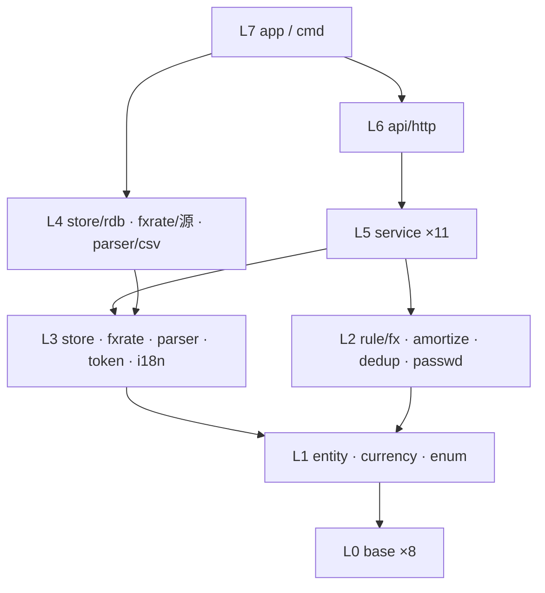
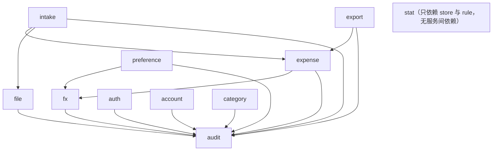

# 对话1 · 仓库代码包的层级设计与划分

> 依据来源：`doc/decisions/记账系统功能与模型.md`（对话20 最终定稿，下称「终版」）全文；补充参考 `260903-173423-answer.md` 对话1~3 的判定。
> 代码侧：仓库**无任何实现**（仅 `go.mod`：`module github.com/cellargalaxy/jotcash` / `go 1.27.0`），本轮为**从零搭建**，不存在存量链路与兼容性负担。
> 范围：只做包的划分、职责、依赖与目录结构；**不写代码、不写 SQL、不定字段类型与索引**。
> 规模：**8 层 / 40 包 / 5 条划分准则 / 11 域与 4 条不变式的双向落点校验 / 40 步拓扑实施序 / 4 项待确认**。

---

## 一、结论摘要

- **主轴不是「按实体分包」，而是「按不变式分包」**：终版 §九 的 4 条不变式，每条锁定在**唯一一个包**里实现，其余包只能调用、不得复写。这是整套划分的取舍依据。
- **纵向 8 层严格单向**：`base → enum/entity → rule → 端口 → 适配 → service → api → app`。
- **横向靠「端口在下、实现在上」解环**：`store` / `fxrate` / `parser` 只定义接口与查询口径，实现放在各自子包；service 只依赖接口，具体实现**只在 L7 组装层被 import 一次**。因此任一包都可在其依赖已完成时**单独写完并单测通过**，不需要等上层。
- **service 层内部再分 5 个子层**（audit → 基础域 → fx → expense → 编排域），子层内互不依赖，从根上杜绝服务间循环。

---

## 二、依据、冲突与前提

### 2.1 一处必须说明的冲突

| 冲突点 | 你的要求 | 事实 | 采用依据 |
| ------ | -------- | ---- | -------- |
| 「包关系是**树状结构**」 | 每包唯一父节点 | 严格树在 Go 里做不到——`entity`、`base/errs` 必然被几十个包共同依赖，任何公共基础包都会有多个父 | 采用**分层 DAG**：① 只允许上层依赖下层，**层内包互不依赖**（service 层按 5 个显式子层排序）；② 无环。这两条即「树状」的可执行等价物，且比树更弱、可落地。**如需字面上的树，只能靠复制公共代码，代价不可接受** |

### 2.2 前提（本轮为设计成立所需，非终版内容）

| # | 前提 | 状态 |
| - | ---- | ---- |
| 1 | 服务形态为「单进程 Go 服务 + HTTP 接口 + 关系型存储」 | **推断**——终版 A-6「所有页面与接口」、C-2「原始二进制随记录存储」、K-2「跳转到关联对象」共同指向 Web 服务 + 单库；未见显式决策 |
| 2 | 前端形态（服务端模板 / 前后端分离）未定 | **待确认 T34**，仅影响 L6 与 `web/`，不影响 L0~L5 任何一包 |
| 3 | 存储引擎未定 | **待确认 T33**，仅影响 `store/rdb` 一个包 |
| 4 | 全部包内注释与日志用中文 | 沿用你既有要求 |

---

## 三、五条划分准则

| # | 准则 | 直接来源 |
| - | ---- | -------- |
| 1 | **不变式内聚**：一条不变式只有一处实现 | 终版 §九 |
| 2 | **纯规则与 IO 分离**：8.1 折算、8.2 摊分、8.3 查重、A-8 密码策略一律做成无 IO 纯函数包 | 这四处是全系统仅有的「算错就静默出错」的逻辑，必须能脱离 DB 单测 |
| 3 | **枚举即代码**：币种、解析器类型两套枚举建独立包，库中只存代码/键 | 终版 §五 1、§五 2 |
| 4 | **端口在下、实现在上**：接口与查询口径定义在 L3，实现在 L4 | 支撑「逐个包单独完整实现」——写 service 时 DB 尚未选型也能写完 |
| 5 | **审计是基座不是切面**：`service/audit` 单独成包并位于全部业务服务之下 | 终版 §九 4「一次提交 = 一条审计 = 一个可追溯批次」；做成切面则拿不到审计ID 回填 |

---

## 四、分层总表（8 层 40 包）

> 依赖列只写**直接依赖**；`base/*` 被普遍依赖，除首次出现外不再重复列出。

### L0 基础层（8 包）— 零业务语义，依赖：仅标准库与第三方库

| 包 | 承载内容 | 依赖 |
| -- | -------- | ---- |
| `base/errs` | 统一错误类型与错误码；区分「用户输入错误 / 归属越权 / 未登录 / 系统错误」四档，供 D-3 与 L6 错误映射使用 | — |
| `base/log` | 日志；**A-3 的 admin 初始密码一次性打印走此包** | — |
| `base/config` | 配置加载（监听地址、DB 连接、令牌密钥与 12h 时效、汇率源、语言目录） | — |
| `base/idgen` | 5 类实体的唯一标识生成 | — |
| `base/decimal` | 定点小数类型与 `round(值, 位数, 舍入方式)`；**金额一律不用浮点** | — |
| `base/month` | 年月类型与区间运算（`起始月 + N - 1`、`起始月 ≤ M ≤ 结束月`） | — |
| `base/ctxs` | 请求上下文中的当前登录用户（用户ID / 角色）存取 | — |
| `base/pwdhash` | 加盐哈希与校验（算法待定，见 T33 邻项建议 Argon2id）、安全随机串生成 | — |

### L1 领域定义层（3 包）— 只有类型，无行为，依赖 L0

| 包 | 承载内容 | 依赖 |
| -- | -------- | ---- |
| `entity` | 5 实体 62 属性的结构体定义（`User` 15 / `ExpenseCategory` 5 / `Expense` 22 / `File` 11 / `AuditLog` 9），零方法 | `base/decimal`、`base/month` |
| `currency` | **币种枚举**：代码、名称、符号、**小数位数**、是否启用、汇率获取实现标识（§五 1）；只存代码入库；提供合法性校验（应用层是唯一校验点） | `base/*` |
| `enum` | 角色 / 用户状态 / 文件格式（CSV·Excel·PDF）/ **解析器类型键**（§五 2）/ **11 类操作类型** / 操作对象类型 / 操作结果（§8.4） | `base/*` |

### L2 规则层（4 包）— 纯函数、无 IO、可脱库单测，依赖 L1

| 包 | 承载内容 | 依赖 |
| -- | -------- | ---- |
| `rule/fx` | **不变式 1 的唯一实现处**：8.1 六种触发的三字段联动矩阵；`本位币金额 = round(支出金额 × 折算汇率, 本位币小数位)`；`折算本位币币种` 的更新条件（仅「汇率重拉或手填」时更新） | `entity`、`currency`、`base/decimal` |
| `rule/amortize` | 8.2 摊分：起止月派生、按币种小数位均分、**尾差归末月**、原币与本位币各自独立均分、负金额对称处理 | `entity`、`currency`、`base/month` |
| `rule/dedup` | 8.3 判重：四要素（归属用户 + 支出日期 + 支出金额 + 支出币种）等值匹配、**排除自身**、本次录入内部互查；只出「疑似重复」标记，不做处置 | `entity` |
| `rule/passwd` | A-8 策略校验（长度 ≥ 10、字母/数字/符号至少两类）+ **符合策略的随机初始密码生成**（A-2） | `base/pwdhash` |

### L3 端口层（5 包）— 只定接口与口径，无具体技术，依赖 L1/L2

| 包 | 承载内容 | 依赖 |
| -- | -------- | ---- |
| `store` | 5 实体仓储接口 + **查询条件类型**（F-4 全部筛选维度、排序、分页、F-6 聚合口径）+ **事务执行器**（跨仓储同事务）；**每个按 ID 访问的方法签名强制带归属用户ID**——不变式 3 的编译期兜底。三处特殊口径：① `File` 元信息与二进制内容**分接口**（列表不拖二进制）；② `Expense` 提供**游标迭代**（I-7 逐笔重算不全量装载）；③ 摊分区间穿刺（`起始月 ≤ M` 且 `结束月 ≥ M`）作为一等查询条件 | `entity`、`enum`、`currency` |
| `fxrate` | 日汇率获取接口（按币种对 + 日期）+ 失败语义（失败即返回错误，**禁止静默 1:1**，I-5） | `currency`、`base/*` |
| `parser` | 解析器接口 + **按解析器类型键的注册表**（D-1）；输出「逐笔明细 + 银行名称 / 卡号后四位 / 卡片币种」；错误分类（格式不符 / 内容损坏 / 字段缺失 / 解密失败 / 类型不匹配，D-3） | `entity`、`enum`、`base/errs` |
| `token` | 无状态令牌签发与解析（载荷：用户ID / 角色 / 签发时间 / 过期时间；12h 绝对过期不可续期，§五 3）；**基线时间比对不在此包**（需读库，属 `service/auth`） | `enum`、`base/config` |
| `i18n` | K-4 界面文案：语言配置文件加载与取词；**不含数据内容翻译** | `base/config` |

### L4 适配实现层（3 包）— 依赖 L3 接口，被 L7 唯一 import

| 包 | 承载内容 | 依赖 |
| -- | -------- | ---- |
| `store/rdb` | `store` 全部接口的关系型实现 + 建表/迁移；**唯一知道 SQL 的地方** | `store` |
| `fxrate/<源>` | 具体汇率源实现 + 日汇率缓存（同日同币种对只取一次） | `fxrate` |
| `parser/csv` | 本轮唯一实现（D-1「本轮仅实现 CSV」）；后续每加一家银行/格式 = 新增一个平级子包，**不改任何上层** | `parser` |

### L5 服务层（11 包，5 个子层，层内互不依赖）

| 子层 | 包 | 承载内容（功能编号） | 依赖 |
| ---- | -- | -------------------- | ---- |
| **5.0** | `service/audit` | **不变式 4 的唯一实现处**：11 类审计写入、「先落审计取 ID → 业务数据挂载该 ID → 同事务提交」的调用序、K-2 本人审计查询；强制三条边界（读操作除导出外不记、`变更内容` 不含任何密码值、管理员操作归属管理员） | `store`、`enum` |
| **5.1** | `service/auth` | A-4 登录、A-5 时效、A-6 校验（含**基线时间比对**）、A-8 失败计数与 10 分钟锁定 | `store`、`token`、`rule/passwd`、`base/pwdhash`、`service/audit` |
| **5.1** | `service/account` | A-1 系统初始化建 admin、A-2/A-3 初始密码生命周期、A-7 账户管理、A-8 自助改密；**改密/重置/禁用推进基线时间** | `store`、`rule/passwd`、`base/pwdhash`、`service/audit` |
| **5.1** | `service/category` | G-1 建/删、G-4 引用检查（**含已软删除明细构成引用**）后物理删除 | `store`、`service/audit` |
| **5.1** | `service/file` | C-1~C-4 上传入库、元信息、下载/预览、归属校验；挂「文件上传」审计 | `store`、`service/audit` |
| **5.1** | `service/stat` | J-1~J-6 月度统计双口径、类型分布、趋势同环比、下钻、未来待摊分段；**已删除明细不参与** | `store`、`rule/amortize` |
| **5.2** | `service/fx` | I-3 取汇率、I-4 入账折算、I-5 兜底转必填、**I-7 逐笔重算（单笔三字段同事务、可中断可续跑）**；对外暴露「给一行算折算三字段」的统一入口 | `store`、`fxrate`、`rule/fx`、`service/audit` |
| **5.3** | `service/expense` | F-1~F-8：列表、多维筛选、逐笔编辑（走 `rule/dedup` 排除自身）、筛选态合计、软删除（逐笔/批量/全选筛选集，已删除行跳过）、导出取数 | `store`、`rule/*`、`service/fx`、`service/audit` |
| **5.4** | `service/intake` | D-2~D-7 + E-2：解析 → 折算 → 双向查重 → 预览数据组装 → **提交入库（一条「数据入库」审计 + N 条明细同事务）**；三种录入进入方式（文件导入 / 手工录入 / F-8 复制）在此收敛，**复制不重拉汇率** | `parser`、`service/file`、`service/expense`、`service/fx`、`service/audit` |
| **5.4** | `service/export` | K-3 整库导出（5 实体，含二进制与文件密码）、F-7 明细导出；均记「数据导出」审计 | `store`、`service/expense`、`service/audit` |
| **5.4** | `service/preference` | K-1 本位币与界面语言切换；**切本位币落两条审计**（`用户偏好设置` 必成功 + `本位币金额重算` 允许部分失败） | `store`、`service/fx`、`service/audit` |

### L6 接入层（4 包）

| 包 | 承载内容 | 依赖 |
| -- | -------- | ---- |
| `api/http/dto` | 请求/响应结构与校验；**与 `entity` 解耦**，`密码哈希`/`盐` 在此层被物理隔离（A-7 展示口径） | `entity`、`enum` |
| `api/http/middleware` | A-6 全局登录态校验（除登录页/登录接口）、管理员校验（A-7）、把当前用户写入 `base/ctxs`、`base/errs` → HTTP 状态映射、i18n 文案、请求日志 | `service/auth`、`i18n`、`base/*` |
| `api/http/handler` | 各域薄适配：DTO ↔ 服务入参出参，无业务判断；按域分文件（auth / account / category / file / expense / intake / stat / export / preference / audit） | L5 全部、`dto` |
| `api/http/router` | 路由注册与中间件装配、静态资源挂载 | `handler`、`middleware` |

### L7 组装层（2 包）

| 包 | 承载内容 | 依赖 |
| -- | -------- | ---- |
| `app` | **唯一 import 具体实现的地方**：依赖装配（选 `store/rdb`、汇率源、注册解析器）、建表迁移、A-1 启动初始化、优雅退出 | L4 全部、L5 全部、L6、`base/config` |
| `cmd/jotcash` | `main`：读配置 → 交给 `app` | `app` |

---

## 五、依赖图



service 层内部（箭头 = 依赖方向，无环）：



---

## 六、正向校验：11 域 57 项功能的包落点

| 域 | 项数 | 主责包 | 协作包 |
| -- | ---- | ------ | ------ |
| A 账户与认证 | 8 | `service/auth`、`service/account` | `token`、`rule/passwd`、`base/pwdhash`、`base/log`(A-3) |
| B 权限与审计 | 4 | `service/audit` | `store`(签名强制归属)、`api/http/middleware` |
| C 文件管理 | 4 | `service/file` | `store`(元信息/内容分接口) |
| D 数据录入 | 7 | `service/intake` | `parser`、`service/file`、`service/fx`、`rule/dedup` |
| E 去重 | 2 | `rule/dedup` | `service/intake`、`service/expense`(F-5 编辑链路) |
| F 支出明细 | 8 | `service/expense` | `service/fx`、`rule/amortize`、`rule/dedup`、`store` |
| G 支出类型 | 4 | `service/category` | `store`(引用检查含已软删明细) |
| H 摊分 | 4 | `rule/amortize` | `service/expense`(H-4 预览)、`service/stat` |
| I 多币种 | 6 | `service/fx` | `currency`、`fxrate`、`rule/fx` |
| J 月度统计 | 6 | `service/stat` | `rule/amortize`、`store`(区间穿刺) |
| K 配置与运维 | 4 | `service/preference`、`service/export`、`service/audit`(K-2) | `i18n`(K-4)、`base/config` |

> 57 项功能中**无悬空项**；I-6 为作废空号，不占落点。

---

## 七、反向校验：4 条不变式的唯一实现处

| 不变式 | 唯一实现包 | 其余包的约束 |
| ------ | ---------- | ------------ |
| 1 恒等式与三字段联动 | `rule/fx` | **任何其他包不得自行做「金额 × 汇率」乘法**；`service/fx`/`expense`/`intake` 一律经此包 |
| 2 重算原子粒度是单笔 | `service/fx` | 事务边界由 `store` 的事务执行器提供，单笔三字段同事务；允许部分失败、可续跑 |
| 3 归属校验无死角 | `store`（接口签名强制归属用户ID） | 上层拿不到「不带归属的查询方法」；`middleware` + `base/ctxs` 负责把当前用户送达 |
| 4 一次提交 = 一条审计 = 一个批次 | `service/audit` | 入库/上传类操作必须走它的「先审计后挂载」调用序，禁止 service 直接写 `AuditLog` 表 |

5 实体 62 属性全部落在 `entity`；5 组关联（§七）落在 `store` 的查询条件与外键口径；§六「刻意不建的 11 项实体」在包结构上体现为**没有对应的 store 接口与 service 包**（币种/解析器类型是枚举包、汇率是 `Expense` 上的数值、登录态是 `token` 无状态包、摊分份额是 `rule/amortize` 的派生输出）。

---

## 八、Go 仓库结构

```
jotcash/
├── cmd/
│   └── jotcash/                 # main：读配置 → app.Run
├── internal/
│   ├── base/                    # L0
│   │   ├── errs/  log/  config/  idgen/
│   │   └── decimal/  month/  ctxs/  pwdhash/
│   ├── entity/                  # L1 5 实体 62 属性
│   ├── currency/                # L1 币种枚举（含小数位数）
│   ├── enum/                    # L1 角色/状态/文件格式/解析器类型键/11 类审计
│   ├── rule/                    # L2 纯规则
│   │   ├── fx/  amortize/  dedup/  passwd/
│   ├── store/                   # L3 仓储接口 + 查询条件 + 事务执行器
│   │   └── rdb/                 # L4 关系型实现（唯一写 SQL 处，含迁移）
│   ├── fxrate/                  # L3 汇率获取接口
│   │   └── <源>/                # L4 具体汇率源 + 日缓存
│   ├── parser/                  # L3 解析器接口 + 注册表
│   │   └── csv/                 # L4 本轮唯一实现；每加一家银行 = 新增平级子包
│   │       └── testdata/        # 样例账单
│   ├── token/                   # L3 无状态令牌
│   ├── i18n/                    # L3 界面文案取词
│   ├── service/                 # L5
│   │   ├── audit/                       # 5.0 基座
│   │   ├── auth/  account/  category/  file/  stat/   # 5.1
│   │   ├── fx/                          # 5.2
│   │   ├── expense/                     # 5.3
│   │   └── intake/  export/  preference/# 5.4
│   ├── api/
│   │   └── http/
│   │       ├── dto/  middleware/  handler/  router/
│   └── app/                     # L7 装配 + 启动初始化
├── configs/                     # 配置样例
├── locales/                     # K-4 语言配置文件（本轮仅 zh-CN）
├── web/                         # 前端产物/模板（形态待确认 T34）
├── doc/                         # 现有文档
├── go.mod
└── README.md
```

**约定三条**：① 全部业务包在 `internal/` 下，不对外提供库；② 接口包与实现子包同名父子关系（`store` / `store/rdb`），实现子包只被 `app` import；③ 包名短小、单数、无下划线，中文注释与日志。

---

## 九、实施顺序（拓扑序，逐包可独立完成）

| 阶段 | 包 | 完成标志 |
| ---- | -- | -------- |
| 1 | `base/*` 8 包 | 单测通过；`decimal` 的舍入口径先与你确认（见 T35） |
| 2 | `entity`、`currency`、`enum` | 62 属性、两套枚举、11 类审计类型齐备 |
| 3 | `rule/fx`、`rule/amortize`、`rule/dedup`、`rule/passwd` | **四包是全仓库单测密度最高处**：8.1 六种触发、8.2 尾差与负金额、8.3 四条链路、A-8 策略逐条覆盖 |
| 4 | `store`、`fxrate`、`parser`、`token`、`i18n` | 只有接口与类型，可编译 |
| 5 | `store/rdb` | 选型确认后实现（T33）；建表与迁移 |
| 6 | `fxrate/<源>`、`parser/csv` | 各自可独立联调 |
| 7 | `service/audit` | 「先审计后挂载」调用序可用 |
| 8 | `service/auth`、`account`、`category`、`file`、`stat` | 层内 5 包**可并行**，互不依赖 |
| 9 | `service/fx` → `service/expense` → `service/intake`/`export`/`preference` | 严格按序 |
| 10 | `api/http/*` 4 包 → `app` → `cmd/jotcash` | 端到端可跑 |

> 任一阶段内的包，只依赖前序阶段的**已完成产物**，符合「逐个包单独完整实现」。阶段 5/6 与阶段 7~9 之间**无依赖**——service 只依赖 L3 接口，因此存储选型未定也不阻塞业务服务开发。

---

## 十、扩展预留位

| 未结项 | 对分包的影响 |
| ------ | ------------ |
| **T4 自动打标**（终版 §十一） | 第一步「对手方记忆」**零新增包**——查历史明细众数，落 `service/intake` 内部；第二步「关键词规则」才新增 `entity` 一个实体 + `store` 一个接口 + `service/tagging` 一个包（挂 5.1 子层） |
| **T31 I-7 取哪天汇率** | 仅影响 `service/fx` **内部一行取数逻辑**，不影响任何分包 |
| **T32 导出格式** | 仅影响 `service/export` 内部；若要出 OFX/QIF，新增 `export/<格式>` 子包 |
| 场景 A（接结构化数据源、加银行流水号/记账日期） | `entity` 加字段 + `rule/dedup` 加一条硬去重前置；`parser` 接口不变 |
| 场景 B（扩复式记账） | **本设计救不了**——`entity`/`rule`/`store`/`service` 四层全动，与终版判定一致 |

---

## 十一、交付说明

- **交付物**：本节——5 条划分准则、8 层 40 包分层总表、2 张依赖图、11 域正向落点表、4 条不变式反向落点表、Go 仓库目录结构、10 阶段拓扑实施序、5 项扩展预留位。
- **未做**：不写代码、不写 SQL、不定字段类型/索引/表结构、不选具体框架与库——均属技术选型与实现轮次。
- **副作用评估**：仓库为空，无存量链路与兼容性影响。性能相关的三处已在 `store` 层的接口口径中前置约束（文件二进制与元信息分接口、明细游标迭代、摊分区间穿刺与筛选态聚合下推），避免上层内存累加。
- **校验方式**：
  ① **无环校验**——8 层严格单向 + service 层 5 子层显式排序，逐包核对其依赖是否全部位于更低层，无反向与同层依赖；
  ② **可独立实现校验**——逐阶段核对「实施时其依赖是否已完成」，其中 L5 只依赖 L3 接口，与 L4 实现解耦，故阶段 5/6 与 7~9 可互换顺序；
  ③ **功能正向覆盖**——11 域 57 项逐项落包，无悬空功能（I-6 为作废空号）；
  ④ **不变式反向覆盖**——4 条不变式各锁定唯一实现包，并写明其余包的禁止项；
  ⑤ **不建实体校验**——§六 11 项「刻意不建」逐条确认在包结构上无对应 store 接口与 service 包；
  ⑥ **冲突未静默取舍**——「树状结构」与 Go 公共依赖的冲突已在 §2.1 列出并给出采用依据。
- **待确认（4 项）**：

| 编号 | 问题 | 影响面 |
| ---- | ---- | ------ |
| **T33** | 存储引擎选型 | 仅 `store/rdb` 一个包；建议同时定下密码哈希算法（对话1 ⚠️-2 建议 Argon2id），影响 `base/pwdhash` |
| **T34** | 前端形态：服务端模板 / 前后端分离 | 仅 L6 与 `web/`；L0~L5 不受影响 |
| **T35** | `本位币金额` 的存储精度与舍入方式（对话2 §三 1 的真问题） | 影响 `base/decimal` 与 `rule/fx`，**是阶段 1 的前置**，需先于编码确认 |
| **T31** | I-7 重拉哪一天的汇率（沿用未结） | 仅 `service/fx` 内部 |
