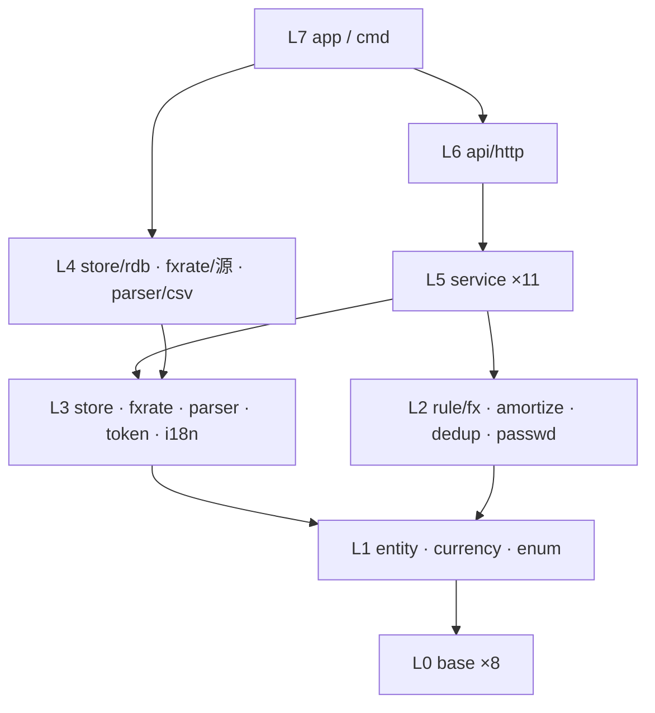
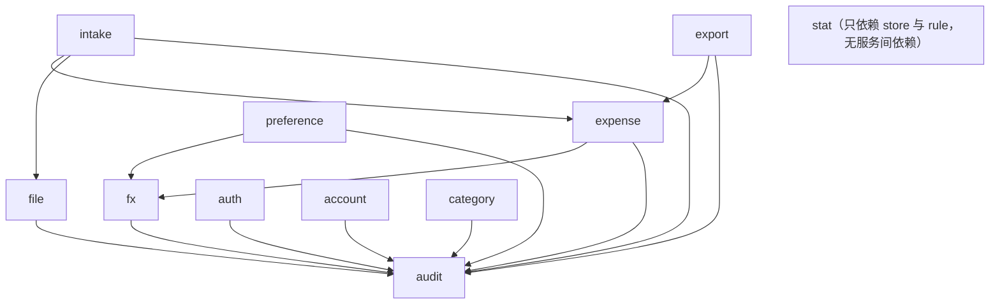
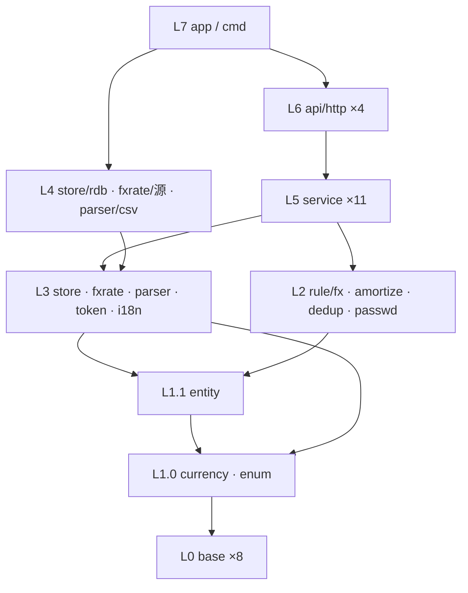
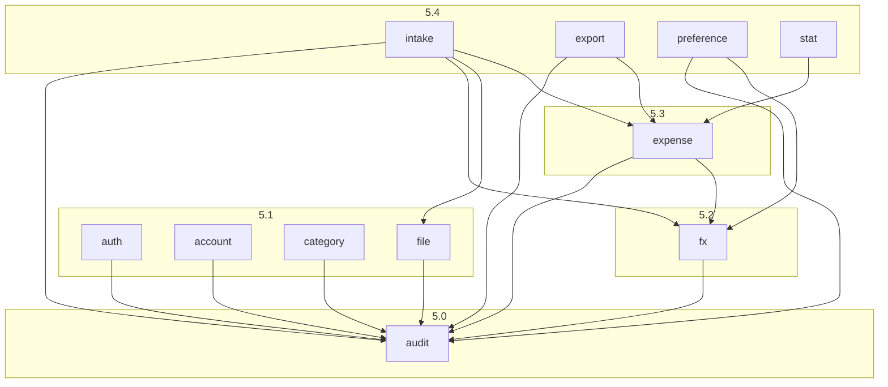
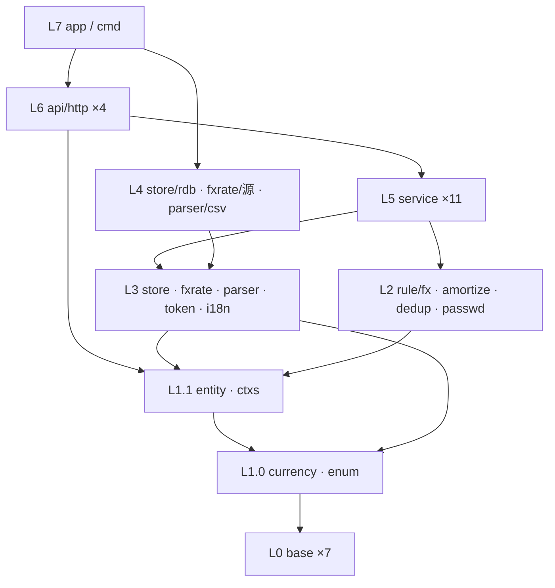
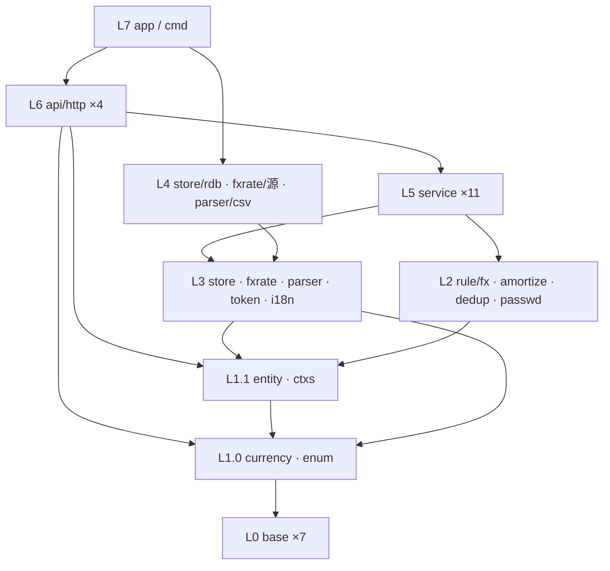

# 对话1 · 仓库代码包的层级设计与划分

> 依据来源：`doc/decisions/记账系统功能与模型.md`（对话20 最终定稿，下称「终版」）全文；补充参考 `260903-173423-answer.md` 对话1~3 的判定。
> 代码侧：仓库**无任何实现**（仅 `go.mod`：`module github.com/cellargalaxy/jotcash` / `go 1.27.0`），本轮为**从零搭建**，不存在存量链路与兼容性负担。
> 范围：只做包的划分、职责、依赖与目录结构；**不写代码、不写 SQL、不定字段类型与索引**。
> 规模：**8 层 / 40 包 / 5 条划分准则 / 11 域与 4 条不变式的双向落点校验 / 40 步拓扑实施序 / 4 项待确认**。

---

## 一、结论摘要

- **主轴不是「按实体分包」，而是「按不变式分包」**：终版 §九 的 4 条不变式，每条锁定在**唯一一个包**里实现，其余包只能调用、不得复写。这是整套划分的取舍依据。
- **纵向 8 层严格单向**：`base → enum/entity → rule → 端口 → 适配 → service → api → app`。
- **横向靠「端口在下、实现在上」解环**：`store` / `fxrate` / `parser` 只定义接口与查询口径，实现放在各自子包；service 只依赖接口，具体实现**只在 L7 组装层被 import 一次**。因此任一包都可在其依赖已完成时**单独写完并单测通过**，不需要等上层。
- **service 层内部再分 5 个子层**（audit → 基础域 → fx → expense → 编排域），子层内互不依赖，从根上杜绝服务间循环。

---

## 二、依据、冲突与前提

### 2.1 一处必须说明的冲突

| 冲突点 | 你的要求 | 事实 | 采用依据 |
| ------ | -------- | ---- | -------- |
| 「包关系是**树状结构**」 | 每包唯一父节点 | 严格树在 Go 里做不到——`entity`、`base/errs` 必然被几十个包共同依赖，任何公共基础包都会有多个父 | 采用**分层 DAG**：① 只允许上层依赖下层，**层内包互不依赖**（service 层按 5 个显式子层排序）；② 无环。这两条即「树状」的可执行等价物，且比树更弱、可落地。**如需字面上的树，只能靠复制公共代码，代价不可接受** |

### 2.2 前提（本轮为设计成立所需，非终版内容）

| # | 前提 | 状态 |
| - | ---- | ---- |
| 1 | 服务形态为「单进程 Go 服务 + HTTP 接口 + 关系型存储」 | **推断**——终版 A-6「所有页面与接口」、C-2「原始二进制随记录存储」、K-2「跳转到关联对象」共同指向 Web 服务 + 单库；未见显式决策 |
| 2 | 前端形态（服务端模板 / 前后端分离）未定 | **待确认 T34**，仅影响 L6 与 `web/`，不影响 L0~L5 任何一包 |
| 3 | 存储引擎未定 | **待确认 T33**，仅影响 `store/rdb` 一个包 |
| 4 | 全部包内注释与日志用中文 | 沿用你既有要求 |

---

## 三、五条划分准则

| # | 准则 | 直接来源 |
| - | ---- | -------- |
| 1 | **不变式内聚**：一条不变式只有一处实现 | 终版 §九 |
| 2 | **纯规则与 IO 分离**：8.1 折算、8.2 摊分、8.3 查重、A-8 密码策略一律做成无 IO 纯函数包 | 这四处是全系统仅有的「算错就静默出错」的逻辑，必须能脱离 DB 单测 |
| 3 | **枚举即代码**：币种、解析器类型两套枚举建独立包，库中只存代码/键 | 终版 §五 1、§五 2 |
| 4 | **端口在下、实现在上**：接口与查询口径定义在 L3，实现在 L4 | 支撑「逐个包单独完整实现」——写 service 时 DB 尚未选型也能写完 |
| 5 | **审计是基座不是切面**：`service/audit` 单独成包并位于全部业务服务之下 | 终版 §九 4「一次提交 = 一条审计 = 一个可追溯批次」；做成切面则拿不到审计ID 回填 |

---

## 四、分层总表（8 层 40 包）

> 依赖列只写**直接依赖**；`base/*` 被普遍依赖，除首次出现外不再重复列出。

### L0 基础层（8 包）— 零业务语义，依赖：仅标准库与第三方库

| 包 | 承载内容 | 依赖 |
| -- | -------- | ---- |
| `base/errs` | 统一错误类型与错误码；区分「用户输入错误 / 归属越权 / 未登录 / 系统错误」四档，供 D-3 与 L6 错误映射使用 | — |
| `base/log` | 日志；**A-3 的 admin 初始密码一次性打印走此包** | — |
| `base/config` | 配置加载（监听地址、DB 连接、令牌密钥与 12h 时效、汇率源、语言目录） | — |
| `base/idgen` | 5 类实体的唯一标识生成 | — |
| `base/decimal` | 定点小数类型与 `round(值, 位数, 舍入方式)`；**金额一律不用浮点** | — |
| `base/month` | 年月类型与区间运算（`起始月 + N - 1`、`起始月 ≤ M ≤ 结束月`） | — |
| `base/ctxs` | 请求上下文中的当前登录用户（用户ID / 角色）存取 | — |
| `base/pwdhash` | 加盐哈希与校验（算法待定，见 T33 邻项建议 Argon2id）、安全随机串生成 | — |

### L1 领域定义层（3 包）— 只有类型，无行为，依赖 L0

| 包 | 承载内容 | 依赖 |
| -- | -------- | ---- |
| `entity` | 5 实体 62 属性的结构体定义（`User` 15 / `ExpenseCategory` 5 / `Expense` 22 / `File` 11 / `AuditLog` 9），零方法 | `base/decimal`、`base/month` |
| `currency` | **币种枚举**：代码、名称、符号、**小数位数**、是否启用、汇率获取实现标识（§五 1）；只存代码入库；提供合法性校验（应用层是唯一校验点） | `base/*` |
| `enum` | 角色 / 用户状态 / 文件格式（CSV·Excel·PDF）/ **解析器类型键**（§五 2）/ **11 类操作类型** / 操作对象类型 / 操作结果（§8.4） | `base/*` |

### L2 规则层（4 包）— 纯函数、无 IO、可脱库单测，依赖 L1

| 包 | 承载内容 | 依赖 |
| -- | -------- | ---- |
| `rule/fx` | **不变式 1 的唯一实现处**：8.1 六种触发的三字段联动矩阵；`本位币金额 = round(支出金额 × 折算汇率, 本位币小数位)`；`折算本位币币种` 的更新条件（仅「汇率重拉或手填」时更新） | `entity`、`currency`、`base/decimal` |
| `rule/amortize` | 8.2 摊分：起止月派生、按币种小数位均分、**尾差归末月**、原币与本位币各自独立均分、负金额对称处理 | `entity`、`currency`、`base/month` |
| `rule/dedup` | 8.3 判重：四要素（归属用户 + 支出日期 + 支出金额 + 支出币种）等值匹配、**排除自身**、本次录入内部互查；只出「疑似重复」标记，不做处置 | `entity` |
| `rule/passwd` | A-8 策略校验（长度 ≥ 10、字母/数字/符号至少两类）+ **符合策略的随机初始密码生成**（A-2） | `base/pwdhash` |

### L3 端口层（5 包）— 只定接口与口径，无具体技术，依赖 L1/L2

| 包 | 承载内容 | 依赖 |
| -- | -------- | ---- |
| `store` | 5 实体仓储接口 + **查询条件类型**（F-4 全部筛选维度、排序、分页、F-6 聚合口径）+ **事务执行器**（跨仓储同事务）；**每个按 ID 访问的方法签名强制带归属用户ID**——不变式 3 的编译期兜底。三处特殊口径：① `File` 元信息与二进制内容**分接口**（列表不拖二进制）；② `Expense` 提供**游标迭代**（I-7 逐笔重算不全量装载）；③ 摊分区间穿刺（`起始月 ≤ M` 且 `结束月 ≥ M`）作为一等查询条件 | `entity`、`enum`、`currency` |
| `fxrate` | 日汇率获取接口（按币种对 + 日期）+ 失败语义（失败即返回错误，**禁止静默 1:1**，I-5） | `currency`、`base/*` |
| `parser` | 解析器接口 + **按解析器类型键的注册表**（D-1）；输出「逐笔明细 + 银行名称 / 卡号后四位 / 卡片币种」；错误分类（格式不符 / 内容损坏 / 字段缺失 / 解密失败 / 类型不匹配，D-3） | `entity`、`enum`、`base/errs` |
| `token` | 无状态令牌签发与解析（载荷：用户ID / 角色 / 签发时间 / 过期时间；12h 绝对过期不可续期，§五 3）；**基线时间比对不在此包**（需读库，属 `service/auth`） | `enum`、`base/config` |
| `i18n` | K-4 界面文案：语言配置文件加载与取词；**不含数据内容翻译** | `base/config` |

### L4 适配实现层（3 包）— 依赖 L3 接口，被 L7 唯一 import

| 包 | 承载内容 | 依赖 |
| -- | -------- | ---- |
| `store/rdb` | `store` 全部接口的关系型实现 + 建表/迁移；**唯一知道 SQL 的地方** | `store` |
| `fxrate/<源>` | 具体汇率源实现 + 日汇率缓存（同日同币种对只取一次） | `fxrate` |
| `parser/csv` | 本轮唯一实现（D-1「本轮仅实现 CSV」）；后续每加一家银行/格式 = 新增一个平级子包，**不改任何上层** | `parser` |

### L5 服务层（11 包，5 个子层，层内互不依赖）

| 子层 | 包 | 承载内容（功能编号） | 依赖 |
| ---- | -- | -------------------- | ---- |
| **5.0** | `service/audit` | **不变式 4 的唯一实现处**：11 类审计写入、「先落审计取 ID → 业务数据挂载该 ID → 同事务提交」的调用序、K-2 本人审计查询；强制三条边界（读操作除导出外不记、`变更内容` 不含任何密码值、管理员操作归属管理员） | `store`、`enum` |
| **5.1** | `service/auth` | A-4 登录、A-5 时效、A-6 校验（含**基线时间比对**）、A-8 失败计数与 10 分钟锁定 | `store`、`token`、`rule/passwd`、`base/pwdhash`、`service/audit` |
| **5.1** | `service/account` | A-1 系统初始化建 admin、A-2/A-3 初始密码生命周期、A-7 账户管理、A-8 自助改密；**改密/重置/禁用推进基线时间** | `store`、`rule/passwd`、`base/pwdhash`、`service/audit` |
| **5.1** | `service/category` | G-1 建/删、G-4 引用检查（**含已软删除明细构成引用**）后物理删除 | `store`、`service/audit` |
| **5.1** | `service/file` | C-1~C-4 上传入库、元信息、下载/预览、归属校验；挂「文件上传」审计 | `store`、`service/audit` |
| **5.1** | `service/stat` | J-1~J-6 月度统计双口径、类型分布、趋势同环比、下钻、未来待摊分段；**已删除明细不参与** | `store`、`rule/amortize` |
| **5.2** | `service/fx` | I-3 取汇率、I-4 入账折算、I-5 兜底转必填、**I-7 逐笔重算（单笔三字段同事务、可中断可续跑）**；对外暴露「给一行算折算三字段」的统一入口 | `store`、`fxrate`、`rule/fx`、`service/audit` |
| **5.3** | `service/expense` | F-1~F-8：列表、多维筛选、逐笔编辑（走 `rule/dedup` 排除自身）、筛选态合计、软删除（逐笔/批量/全选筛选集，已删除行跳过）、导出取数 | `store`、`rule/*`、`service/fx`、`service/audit` |
| **5.4** | `service/intake` | D-2~D-7 + E-2：解析 → 折算 → 双向查重 → 预览数据组装 → **提交入库（一条「数据入库」审计 + N 条明细同事务）**；三种录入进入方式（文件导入 / 手工录入 / F-8 复制）在此收敛，**复制不重拉汇率** | `parser`、`service/file`、`service/expense`、`service/fx`、`service/audit` |
| **5.4** | `service/export` | K-3 整库导出（5 实体，含二进制与文件密码）、F-7 明细导出；均记「数据导出」审计 | `store`、`service/expense`、`service/audit` |
| **5.4** | `service/preference` | K-1 本位币与界面语言切换；**切本位币落两条审计**（`用户偏好设置` 必成功 + `本位币金额重算` 允许部分失败） | `store`、`service/fx`、`service/audit` |

### L6 接入层（4 包）

| 包 | 承载内容 | 依赖 |
| -- | -------- | ---- |
| `api/http/dto` | 请求/响应结构与校验；**与 `entity` 解耦**，`密码哈希`/`盐` 在此层被物理隔离（A-7 展示口径） | `entity`、`enum` |
| `api/http/middleware` | A-6 全局登录态校验（除登录页/登录接口）、管理员校验（A-7）、把当前用户写入 `base/ctxs`、`base/errs` → HTTP 状态映射、i18n 文案、请求日志 | `service/auth`、`i18n`、`base/*` |
| `api/http/handler` | 各域薄适配：DTO ↔ 服务入参出参，无业务判断；按域分文件（auth / account / category / file / expense / intake / stat / export / preference / audit） | L5 全部、`dto` |
| `api/http/router` | 路由注册与中间件装配、静态资源挂载 | `handler`、`middleware` |

### L7 组装层（2 包）

| 包 | 承载内容 | 依赖 |
| -- | -------- | ---- |
| `app` | **唯一 import 具体实现的地方**：依赖装配（选 `store/rdb`、汇率源、注册解析器）、建表迁移、A-1 启动初始化、优雅退出 | L4 全部、L5 全部、L6、`base/config` |
| `cmd/jotcash` | `main`：读配置 → 交给 `app` | `app` |

---

## 五、依赖图



service 层内部（箭头 = 依赖方向，无环）：



---

## 六、正向校验：11 域 57 项功能的包落点

| 域 | 项数 | 主责包 | 协作包 |
| -- | ---- | ------ | ------ |
| A 账户与认证 | 8 | `service/auth`、`service/account` | `token`、`rule/passwd`、`base/pwdhash`、`base/log`(A-3) |
| B 权限与审计 | 4 | `service/audit` | `store`(签名强制归属)、`api/http/middleware` |
| C 文件管理 | 4 | `service/file` | `store`(元信息/内容分接口) |
| D 数据录入 | 7 | `service/intake` | `parser`、`service/file`、`service/fx`、`rule/dedup` |
| E 去重 | 2 | `rule/dedup` | `service/intake`、`service/expense`(F-5 编辑链路) |
| F 支出明细 | 8 | `service/expense` | `service/fx`、`rule/amortize`、`rule/dedup`、`store` |
| G 支出类型 | 4 | `service/category` | `store`(引用检查含已软删明细) |
| H 摊分 | 4 | `rule/amortize` | `service/expense`(H-4 预览)、`service/stat` |
| I 多币种 | 6 | `service/fx` | `currency`、`fxrate`、`rule/fx` |
| J 月度统计 | 6 | `service/stat` | `rule/amortize`、`store`(区间穿刺) |
| K 配置与运维 | 4 | `service/preference`、`service/export`、`service/audit`(K-2) | `i18n`(K-4)、`base/config` |

> 57 项功能中**无悬空项**；I-6 为作废空号，不占落点。

---

## 七、反向校验：4 条不变式的唯一实现处

| 不变式 | 唯一实现包 | 其余包的约束 |
| ------ | ---------- | ------------ |
| 1 恒等式与三字段联动 | `rule/fx` | **任何其他包不得自行做「金额 × 汇率」乘法**；`service/fx`/`expense`/`intake` 一律经此包 |
| 2 重算原子粒度是单笔 | `service/fx` | 事务边界由 `store` 的事务执行器提供，单笔三字段同事务；允许部分失败、可续跑 |
| 3 归属校验无死角 | `store`（接口签名强制归属用户ID） | 上层拿不到「不带归属的查询方法」；`middleware` + `base/ctxs` 负责把当前用户送达 |
| 4 一次提交 = 一条审计 = 一个批次 | `service/audit` | 入库/上传类操作必须走它的「先审计后挂载」调用序，禁止 service 直接写 `AuditLog` 表 |

5 实体 62 属性全部落在 `entity`；5 组关联（§七）落在 `store` 的查询条件与外键口径；§六「刻意不建的 11 项实体」在包结构上体现为**没有对应的 store 接口与 service 包**（币种/解析器类型是枚举包、汇率是 `Expense` 上的数值、登录态是 `token` 无状态包、摊分份额是 `rule/amortize` 的派生输出）。

---

## 八、Go 仓库结构

```
jotcash/
├── cmd/
│   └── jotcash/                 # main：读配置 → app.Run
├── internal/
│   ├── base/                    # L0
│   │   ├── errs/  log/  config/  idgen/
│   │   └── decimal/  month/  ctxs/  pwdhash/
│   ├── entity/                  # L1 5 实体 62 属性
│   ├── currency/                # L1 币种枚举（含小数位数）
│   ├── enum/                    # L1 角色/状态/文件格式/解析器类型键/11 类审计
│   ├── rule/                    # L2 纯规则
│   │   ├── fx/  amortize/  dedup/  passwd/
│   ├── store/                   # L3 仓储接口 + 查询条件 + 事务执行器
│   │   └── rdb/                 # L4 关系型实现（唯一写 SQL 处，含迁移）
│   ├── fxrate/                  # L3 汇率获取接口
│   │   └── <源>/                # L4 具体汇率源 + 日缓存
│   ├── parser/                  # L3 解析器接口 + 注册表
│   │   └── csv/                 # L4 本轮唯一实现；每加一家银行 = 新增平级子包
│   │       └── testdata/        # 样例账单
│   ├── token/                   # L3 无状态令牌
│   ├── i18n/                    # L3 界面文案取词
│   ├── service/                 # L5
│   │   ├── audit/                       # 5.0 基座
│   │   ├── auth/  account/  category/  file/  stat/   # 5.1
│   │   ├── fx/                          # 5.2
│   │   ├── expense/                     # 5.3
│   │   └── intake/  export/  preference/# 5.4
│   ├── api/
│   │   └── http/
│   │       ├── dto/  middleware/  handler/  router/
│   └── app/                     # L7 装配 + 启动初始化
├── configs/                     # 配置样例
├── locales/                     # K-4 语言配置文件（本轮仅 zh-CN）
├── web/                         # 前端产物/模板（形态待确认 T34）
├── doc/                         # 现有文档
├── go.mod
└── README.md
```

**约定三条**：① 全部业务包在 `internal/` 下，不对外提供库；② 接口包与实现子包同名父子关系（`store` / `store/rdb`），实现子包只被 `app` import；③ 包名短小、单数、无下划线，中文注释与日志。

---

## 九、实施顺序（拓扑序，逐包可独立完成）

| 阶段 | 包 | 完成标志 |
| ---- | -- | -------- |
| 1 | `base/*` 8 包 | 单测通过；`decimal` 的舍入口径先与你确认（见 T35） |
| 2 | `entity`、`currency`、`enum` | 62 属性、两套枚举、11 类审计类型齐备 |
| 3 | `rule/fx`、`rule/amortize`、`rule/dedup`、`rule/passwd` | **四包是全仓库单测密度最高处**：8.1 六种触发、8.2 尾差与负金额、8.3 四条链路、A-8 策略逐条覆盖 |
| 4 | `store`、`fxrate`、`parser`、`token`、`i18n` | 只有接口与类型，可编译 |
| 5 | `store/rdb` | 选型确认后实现（T33）；建表与迁移 |
| 6 | `fxrate/<源>`、`parser/csv` | 各自可独立联调 |
| 7 | `service/audit` | 「先审计后挂载」调用序可用 |
| 8 | `service/auth`、`account`、`category`、`file`、`stat` | 层内 5 包**可并行**，互不依赖 |
| 9 | `service/fx` → `service/expense` → `service/intake`/`export`/`preference` | 严格按序 |
| 10 | `api/http/*` 4 包 → `app` → `cmd/jotcash` | 端到端可跑 |

> 任一阶段内的包，只依赖前序阶段的**已完成产物**，符合「逐个包单独完整实现」。阶段 5/6 与阶段 7~9 之间**无依赖**——service 只依赖 L3 接口，因此存储选型未定也不阻塞业务服务开发。

---

## 十、扩展预留位

| 未结项 | 对分包的影响 |
| ------ | ------------ |
| **T4 自动打标**（终版 §十一） | 第一步「对手方记忆」**零新增包**——查历史明细众数，落 `service/intake` 内部；第二步「关键词规则」才新增 `entity` 一个实体 + `store` 一个接口 + `service/tagging` 一个包（挂 5.1 子层） |
| **T31 I-7 取哪天汇率** | 仅影响 `service/fx` **内部一行取数逻辑**，不影响任何分包 |
| **T32 导出格式** | 仅影响 `service/export` 内部；若要出 OFX/QIF，新增 `export/<格式>` 子包 |
| 场景 A（接结构化数据源、加银行流水号/记账日期） | `entity` 加字段 + `rule/dedup` 加一条硬去重前置；`parser` 接口不变 |
| 场景 B（扩复式记账） | **本设计救不了**——`entity`/`rule`/`store`/`service` 四层全动，与终版判定一致 |

---

## 十一、交付说明

- **交付物**：本节——5 条划分准则、8 层 40 包分层总表、2 张依赖图、11 域正向落点表、4 条不变式反向落点表、Go 仓库目录结构、10 阶段拓扑实施序、5 项扩展预留位。
- **未做**：不写代码、不写 SQL、不定字段类型/索引/表结构、不选具体框架与库——均属技术选型与实现轮次。
- **副作用评估**：仓库为空，无存量链路与兼容性影响。性能相关的三处已在 `store` 层的接口口径中前置约束（文件二进制与元信息分接口、明细游标迭代、摊分区间穿刺与筛选态聚合下推），避免上层内存累加。
- **校验方式**：
  ① **无环校验**——8 层严格单向 + service 层 5 子层显式排序，逐包核对其依赖是否全部位于更低层，无反向与同层依赖；
  ② **可独立实现校验**——逐阶段核对「实施时其依赖是否已完成」，其中 L5 只依赖 L3 接口，与 L4 实现解耦，故阶段 5/6 与 7~9 可互换顺序；
  ③ **功能正向覆盖**——11 域 57 项逐项落包，无悬空功能（I-6 为作废空号）；
  ④ **不变式反向覆盖**——4 条不变式各锁定唯一实现包，并写明其余包的禁止项；
  ⑤ **不建实体校验**——§六 11 项「刻意不建」逐条确认在包结构上无对应 store 接口与 service 包；
  ⑥ **冲突未静默取舍**——「树状结构」与 Go 公共依赖的冲突已在 §2.1 列出并给出采用依据。
- **待确认（4 项）**：

| 编号 | 问题 | 影响面 |
| ---- | ---- | ------ |
| **T33** | 存储引擎选型 | 仅 `store/rdb` 一个包；建议同时定下密码哈希算法（对话1 ⚠️-2 建议 Argon2id），影响 `base/pwdhash` |
| **T34** | 前端形态：服务端模板 / 前后端分离 | 仅 L6 与 `web/`；L0~L5 不受影响 |
| **T35** | `本位币金额` 的存储精度与舍入方式（对话2 §三 1 的真问题） | 影响 `base/decimal` 与 `rule/fx`，**是阶段 1 的前置**，需先于编码确认 |
| **T31** | I-7 重拉哪一天的汇率（沿用未结） | 仅 `service/fx` 内部 |

---


# 对话2 · 复核结论与修订版完整方案

> 依据来源：本文件对话1 全文；`doc/decisions/记账系统功能与模型.md`（下称「终版」）§一前提 8、§二 11 域 57 项、§四 62 属性、§五、§六、§八、§九；`260903-173423-answer.md` 对话1 §四 ⚠️-2、对话2 §三 1。
> 代码侧：仓库仍无任何实现（仅 `go.mod`），本轮为设计校对与回写，无存量影响。
> **结论：8 层 40 包的骨架成立——无环、可逐包实现，不推翻。查出 12 处实际问题，已全部修复。**
> **§三 起为修订后的完整方案，取代对话1 的 §三~§九；对话1 保留作推导留痕。修正后包数仍为 40、层数仍为 8。**

---

## 一、四问的检查结论

| 检查项 | 判定 | 说明 |
| ------ | ---- | ---- |
| 包的依赖关系与层级关系 | **合理，2 处需调** | 8 层单向 + service 子层排序，逐包核对无反向依赖、无环；`entity` 与 L1 枚举的次序、`service/stat` 的子层位置需调整 |
| 包的职责划分与承载内容 | **骨架对，5 处错** | `store` 归属签名、重算审计归属、`dedup` 输出形态、审计事务边界、`dto` 表述——都是照着写就会返工的硬伤 |
| 功能缺漏 / 承载内容描述错误 | **57 项无整域缺漏，5 处不实** | 落点表把纯前端项算成后端覆盖；终版**前提 8 无任何包级落点**；`file`、`audit` 两包各缺两项承载内容 |
| Go 仓库结构 | **合理，2 处缺漏** | 缺迁移脚本目录；`locales/` 的加载方式未定，直接决定 K-4 能否成立 |

---

## 二、查出并已修复的问题（12 项）

| # | 位置 | 问题 | 修法（已并入 §三 起的方案） |
| - | ---- | ---- | -------------------------- |
| 1 | `store` / 不变式 3 | 「**每个**按 ID 访问的方法强制带归属用户ID」对 `User` 不成立——A-4 登录按用户名查、A-1 查 `admin`、A-7 管理员查他人账户与列表，三条链路都没有「当前归属用户」，照此写 `User` 仓储写不出来 | 拆为**归属型仓储 4 个**（`Expense`/`File`/`AuditLog`/`ExpenseCategory`，强制）+ **`User` 仓储**（不带，越权防线是 `service/auth` 的登录态与 `service/account` 的角色校验）。不变式 3 表述随之收敛 |
| 2 | `service/fx` vs `service/preference` | 「本位币金额重算」审计出现**两个写入方**（fx 表写 I-7 重算并依赖 audit，preference 表又写「落两条审计」） | 该审计固定由 `service/fx` 在重算收尾写（只有它知道成功/失败笔数）；`preference` 只写「用户偏好设置」，再调 `fx` |
| 3 | `rule/dedup` | 承载写「**只出「疑似重复」标记**」，与终版 D-6「并列展示与之**冲突的已入库明细**供人工比对」冲突——布尔标记喂不出这个页面 | 输出改为「**命中行 → 冲突明细集合**」映射，区分「库内冲突」与「本次录入内部冲突」两类来源 |
| 4 | `service/audit` | 调用序被定死为「先落审计取 ID → 业务挂载 → **同事务提交**」。但 8.4 第 2 类登录失败以 `操作结果 = 失败` 记录，同事务下业务回滚会把失败审计一并回滚，A-4 留痕与 A-8 失败计数同时失效 | 显式承载**两种写入语义**：业务同事务审计 / **独立事务审计**（`操作结果 = 失败`，尤以登录失败） |
| 5 | §七 反向校验 | 只覆盖了 §九 的 4 条不变式，**终版前提 8「记录的存在性单向不可逆」没有任何包级落点**——而它和归属校验一样能靠接口形状兜住 | 写入 `store`：`User`/`File`/`AuditLog` 三个仓储**不提供任何删除方法**；`Expense` 只有「写删除时间」；`ExpenseCategory` 的物理删除在签名上要求先过引用检查 |
| 6 | §六 落点表 | 把纯前端项算成了后端包的覆盖：**D-5 未提交保护完全没有后端落点**（终版 §六 已定为「前端会话内临时态」），D-4 预览页、F-3 多选、H-4 即时预览、K-2 跳转同理 | 落点表加「**实现侧**」列，D-5 明确标注「无后端落点」 |
| 7 | `parser` | 依赖 `entity` 并称输出「逐笔明细」。解析结果没有明细ID、归属用户ID、来源审计ID，也没有四项只读派生字段（终版 §四 3），不是 `entity.Expense`，照此写会逼解析器去填它无权决定的系统字段 | `parser` 定义自己的「**原始交易行**」结构；依赖降为 `enum`+`currency`+`base/errs`；到 `entity.Expense` 的映射由 `service/intake` 承担 |
| 8 | L1 层内 | 「层内互不依赖」使 `entity` 依赖不到 `currency`/`enum`，于是 `支出币种`/`折算本位币币种`/`卡片币种`/`角色`/`状态`/`操作类型` 全是裸 `string`——L1 定义的枚举类型在核心实体上一次也用不上 | L1 内部再分两级：**L1.0 `currency`/`enum` → L1.1 `entity`**。仍无环，层数与包数不变 |
| 9 | `service/stat` 子层 | 在 5.1，够不到 5.3 的 `service/expense`；但 J-5 下钻要出明细行，摊分口径下还要出「份额金额 + 来源支出」——只能自己再实现一遍明细组装，两处口径必然分叉 | `service/stat` 上移到 **5.4**，依赖 `service/expense` 取明细行（5.4 → 5.3，仍无环） |
| 10 | `service/file` | 缺 C-2「**内容校验值**」的计算落点；缺 C-3 反向查询「由某次操作查本次涉及哪些文件」——`store` 的查询条件也没列「按来源审计ID 查 `File`」 | 两项均补入 `service/file` 与 `store` 的承载内容 |
| 11 | `service/audit` | 缺 K-2 的**对象存在性探测**（终版 §8.5：物理删除的 `ExpenseCategory` 是全模型唯一会触发「该对象已删除」提示的对象）；`变更内容` 前后值快照由谁生成未定 | 探测补入 audit；快照**由各业务服务采集**（只有它知道改了什么），audit 只负责落库并**强制过滤密码值**（B-4 边界②） |
| 12 | 落点一致性 | **A-1** 在 `service/account` 与 `app` 两处都写了；**F-8** 在 §六 表主责包写 `service/expense`，L5 表却写「复制在 `service/intake` 收敛」 | A-1 逻辑全在 `service/account`，`app` 只在启动时调一次；F-8 拆写：「删除」归 `expense`、「复制」归 `intake` |

> 另有 3 处描述性修正随方案一并回写，不单列为问题：`api/http/dto` 的「与 `entity` 解耦」改述为「不复用 `entity` 结构体、只做单向裁剪转换，`密码哈希`/`盐` 不出现在任何 dto 定义中」；§一 规模的「40 步实施序」订正为「10 阶段」；跨文件引用补全文件名。

---

## 三、六条划分准则

| # | 准则 | 直接来源 |
| - | ---- | -------- |
| 1 | **不变式内聚**：一条不变式只有一处实现，其余包只能调用 | 终版 §九 |
| 2 | **纯规则与 IO 分离**：8.1 折算、8.2 摊分、8.3 查重、A-8 密码策略一律做成无 IO 纯函数包 | 这四处是全系统仅有的「算错就静默出错」的逻辑，必须能脱库单测 |
| 3 | **枚举即代码**：币种、解析器类型建独立包，库中只存代码/键；**枚举项里的「实现」字段不放枚举包** | 终版 §五 1、§五 2。终版字面上把「汇率获取实现」「解析实现」算作枚举项的字段，照搬会让 L1 依赖 L3/L4 必成环——故 `currency` 只留**标识**、`parser` 持**注册表** |
| 4 | **端口在下、实现在上**：接口与查询口径在 L3，实现在 L4，L4 只被 `app` import 一次 | 支撑「逐个包单独完整实现」：写 L5 时存储选型（T33）未定也不阻塞 |
| 5 | **审计是基座不是切面**：`service/audit` 位于全部业务服务之下 | 终版 §九 4。做成中间件切面就拿不到审计ID 回填 |
| 6 | **不可逆性与归属靠接口形状兜底**：前提 8 与不变式 3 尽量在 `store` 的方法签名上表达，而非靠上层自觉 | 终版 §一前提 8、§九 3。**新增**——修复 §二 表第 5 项 |

---

## 四、分层总表（8 层 40 包）

> 依赖列只写**直接依赖**；`base/*` 被普遍依赖，除首次出现外不再重复列出。

### L0 基础层（8 包）— 零业务语义，仅依赖标准库与第三方库

| 包 | 承载内容 | 依赖 |
| -- | -------- | ---- |
| `base/errs` | 统一错误类型与错误码；四档：用户输入错误 / 归属越权 / 未登录 / 系统错误，供 D-3 与 L6 错误映射 | — |
| `base/log` | 日志；**A-3 的 admin 初始密码一次性打印走此包**（全系统唯一出现密码明文之处） | — |
| `base/config` | 配置加载（监听地址、DB 连接、令牌密钥与 12h 时效、汇率源、语言目录） | — |
| `base/idgen` | 5 类实体的唯一标识生成 | — |
| `base/decimal` | 定点小数类型与 `round(值, 位数, 舍入方式)`；**金额一律不用浮点**（口径见 T35） | — |
| `base/month` | 年月类型与区间运算（`起始月 + N − 1`、`起始月 ≤ M ≤ 结束月`） | — |
| `base/ctxs` | 请求上下文中的当前登录用户（用户ID / 角色）存取 | — |
| `base/pwdhash` | 加盐哈希与校验（算法见 T36）、安全随机串生成 | — |

### L1.0 枚举层（2 包）— 依赖 L0

| 包 | 承载内容 | 依赖 |
| -- | -------- | ---- |
| `currency` | **币种枚举**：代码、名称、符号、**小数位数**、是否启用、**汇率获取实现的标识**（不含实现本身，见准则 3）；只存代码入库；提供合法性校验——应用层是唯一校验点（终版 §五 1） | `base/*` |
| `enum` | 角色 / 用户状态 / 文件格式（CSV·Excel·PDF）/ **解析器类型键**（不含解析实现，终版 §五 2）/ **11 类操作类型** / 操作对象类型 / 操作结果 | `base/*` |

### L1.1 实体层（1 包）

| 包 | 承载内容 | 依赖 |
| -- | -------- | ---- |
| `entity` | 5 实体 62 属性的结构体定义（`User` 15 / `ExpenseCategory` 5 / `Expense` 22 / `File` 11 / `AuditLog` 9），**零方法**；币种、角色、状态、操作类型等字段直接用 L1.0 的枚举类型，不用裸 `string` | `currency`、`enum`、`base/decimal`、`base/month` |

### L2 规则层（4 包）— 纯函数、无 IO、可脱库单测

| 包 | 承载内容 | 依赖 |
| -- | -------- | ---- |
| `rule/fx` | **不变式 1 的唯一实现处**：8.1 六种触发的三字段联动矩阵；`本位币金额 = round(支出金额 × 折算汇率, 本位币小数位)`；`折算本位币币种` 仅在「汇率重拉或用户手填」时更新 | `entity`、`currency`、`base/decimal` |
| `rule/amortize` | 8.2 摊分：起止月派生、按币种小数位均分、**尾差归末月**、原币与本位币各自独立均分、负金额对称处理；H-4 的「覆盖月份区间 + 每月分摊金额」派生接口 | `entity`、`currency`、`base/month` |
| `rule/dedup` | 8.3 判重：四要素（归属用户 + 支出日期 + 支出金额 + 支出币种）等值匹配、编辑态排除自身、本次录入内部互查；**输出「命中行 → 冲突明细集合」映射**（供 D-6 并列展示），只标记不处置 | `entity` |
| `rule/passwd` | A-8 策略校验（长度 ≥ 10、字母/数字/符号至少两类）+ **符合策略的随机初始密码生成**（A-2） | `base/pwdhash` |

### L3 端口层（5 包）— 只定接口与口径，无具体技术

| 包 | 承载内容 | 依赖 |
| -- | -------- | ---- |
| `store` | **① 归属型仓储 4 个**（`Expense`/`File`/`AuditLog`/`ExpenseCategory`）——每个按 ID 访问的方法**签名强制带归属用户ID**，不变式 3 的编译期兜底；**② `User` 仓储**——按用户名 / 按用户ID 查，**不带归属参数**（A-1 初始化、A-4 登录、A-7 管理员查列表都无「当前归属用户」），其越权由服务层显式校验；**③ 删除能力按前提 8 裁剪**：`User`/`File`/`AuditLog` **无删除方法**，`Expense` 只有「写删除时间」（已删除行跳过、幂等），`ExpenseCategory` 的物理删除签名要求先过引用检查；**④ 查询条件类型**：F-4 全部筛选维度 + 排序 + 分页、F-6 聚合口径、**按来源审计ID 查 `File`**（C-3 反向）、**摊分区间穿刺**（`起始月 ≤ M` 且 `结束月 ≥ M`）作为一等查询条件；**⑤ 事务执行器**（跨仓储同事务）。两处性能口径：`File` 元信息与二进制内容**分接口**（列表不拖二进制）、`Expense` 提供**游标迭代**（I-7 与 K-3 不全量装载） | `entity`、`enum`、`currency` |
| `fxrate` | 日汇率获取接口（按币种对 + 日期）+ 失败语义：失败即返回错误，**禁止静默 1:1**（I-5） | `currency`、`base/*` |
| `parser` | 解析器接口 + **「原始交易行」结构**（支出日期/金额/币种/对手方/备注 + 银行名称/卡号后四位/卡片币种，解析不出则留空）+ **按解析器类型键的注册表**（D-1）；错误分类：格式不符 / 内容损坏 / 字段缺失 / 解密失败 / 类型不匹配（D-3）。**不依赖 `entity`**——原始行到 `entity.Expense` 的映射归 `service/intake` | `enum`、`currency`、`base/errs` |
| `token` | 无状态令牌签发与解析（载荷：用户ID / 角色 / 签发时间 / 过期时间；12h 绝对过期不可续期，终版 §五 3）；**基线时间比对不在此包**（需读库，属 `service/auth`） | `enum`、`base/config` |
| `i18n` | K-4 界面文案：语言配置文件加载与取词，**不含数据内容翻译**；加载方式见 T37 | `base/config` |

### L4 适配实现层（3 包）— 依赖 L3 接口，仅被 L7 import

| 包 | 承载内容 | 依赖 |
| -- | -------- | ---- |
| `store/rdb` | `store` 全部接口的关系型实现 + **建表与迁移脚本（随二进制 embed，DDL 与代码版本绑定）**；**唯一知道 SQL 的地方** | `store` |
| `fxrate/<源>` | 具体汇率源实现 + 日汇率缓存（同日同币种对只取一次） | `fxrate` |
| `parser/csv` | 本轮唯一实现（D-1「本轮仅实现 CSV」）；后续每加一家银行/格式 = 新增一个平级子包，**不改任何上层** | `parser` |

### L5 服务层（11 包，5 个子层，同一子层内互不依赖）

| 子层 | 包 | 承载内容（功能编号） | 依赖 |
| ---- | -- | -------------------- | ---- |
| **5.0** | `service/audit` | **不变式 4 的唯一实现处**。**两种写入语义**：① **业务同事务审计**——「先落审计取 ID → 业务数据挂载该 ID → 同事务提交」；② **独立事务审计**——`操作结果 = 失败` 的记录（尤以 8.4 第 2 类登录失败），与业务事务解耦，业务回滚不带走它。K-2 本人审计查询 + **跳转对象存在性探测**（仅物理删除的 `ExpenseCategory` 降级为「该对象已删除」）。`变更内容` **由各业务服务采集**，本包负责落库并**强制过滤任何密码值**（明文/哈希/盐）。强制 B-4 三条边界 | `store`、`enum` |
| **5.1** | `service/auth` | A-4 登录、A-5 时效、A-6 校验（含**基线时间比对**）、A-8 失败计数与 10 分钟锁定；登录失败走 audit 的**独立事务**语义 | `store`、`token`、`rule/passwd`、`base/pwdhash`、`service/audit` |
| **5.1** | `service/account` | **A-1 系统初始化建 `admin`（逻辑全在本包，`app` 只负责启动时调用一次）**、A-2/A-3 初始密码生命周期、A-7 账户管理（含管理员角色校验——`User` 仓储不带归属，越权防线在此）、A-8 自助改密；**改密/重置/禁用推进基线时间** | `store`、`rule/passwd`、`base/pwdhash`、`service/audit` |
| **5.1** | `service/category` | G-1 建/删、G-4 引用检查（**含已软删除明细构成引用**）后物理删除 | `store`、`service/audit` |
| **5.1** | `service/file` | C-1~C-4 上传入库、元信息、**内容校验值计算与留存**（仅特征值，不用于查重）、下载/预览、归属校验、**C-3 双向关联的两侧查询**（由文件查审计、按来源审计ID 查本次文件）；挂「文件上传」审计 | `store`、`service/audit` |
| **5.2** | `service/fx` | I-3 取汇率、I-4 入账折算、I-5 兜底转必填、**I-7 逐笔重算**（单笔三字段同事务、允许部分失败、可中断可续跑，走 `store` 游标迭代）；**「本位币金额重算」审计由本包在重算收尾写一条**（记成功/失败笔数）；对外暴露「给一行算折算三字段」的统一入口 | `store`、`fxrate`、`rule/fx`、`currency`、`service/audit` |
| **5.3** | `service/expense` | F-1~F-7 + F-8 的**删除**部分：列表、多维筛选、逐笔编辑（仅未删除明细，走 `rule/dedup` 排除自身）、筛选态合计、软删除（逐笔/批量/全选筛选集，已删除行跳过）、导出取数；编辑记「明细编辑与删除」审计并采集 `变更内容` 快照 | `store`、`rule/fx`、`rule/amortize`、`rule/dedup`、`service/fx`、`service/audit` |
| **5.4** | `service/intake` | D-1~D-3、D-6、D-7 + E-2 + **F-8 的复制**部分：解析 → **原始交易行映射为 `entity.Expense`** → 折算 → 双向查重 → 预览数据组装 → **提交入库（一条「数据入库」审计 + N 条明细同事务）**；三种录入进入方式在此收敛，**复制不重拉汇率**（终版 8.1） | `parser`、`service/file`、`service/expense`、`service/fx`、`service/audit` |
| **5.4** | `service/export` | K-3 整库导出（5 实体，含二进制与文件密码，走游标流式）、F-7 明细导出；均记「数据导出」审计 | `store`、`service/expense`、`service/audit` |
| **5.4** | `service/preference` | K-1 本位币与界面语言切换；**只写「用户偏好设置」审计**（必成功），随后调用 `service/fx` 触发 I-7，重算审计由 fx 写 | `store`、`service/fx`、`service/audit` |
| **5.4** | `service/stat` | J-1~J-6 月度统计双口径、类型分布、趋势同环比、**下钻（明细行经 `service/expense` 取，口径与列表页一致；摊分口径下附份额金额）**、未来待摊分段；**已删除明细不参与**；读操作不记审计 | `store`、`rule/amortize`、`service/expense` |

### L6 接入层（4 包）

| 包 | 承载内容 | 依赖 |
| -- | -------- | ---- |
| `api/http/dto` | 请求/响应结构与校验；**不复用 `entity` 结构体，只做单向字段裁剪与转换**——`密码哈希` / `盐` 不出现在任何 dto 定义中（A-7 展示口径） | `entity`、`enum`、`currency` |
| `api/http/middleware` | A-6 全局登录态校验（除登录页/登录接口）、管理员校验（A-7）、把当前用户写入 `base/ctxs`、`base/errs` → HTTP 状态映射、i18n 文案、请求日志 | `service/auth`、`i18n`、`base/*` |
| `api/http/handler` | 各域薄适配：DTO ↔ 服务入参出参，**无业务判断**；按域分文件（auth / account / category / file / expense / intake / stat / export / preference / audit） | L5 全部、`dto` |
| `api/http/router` | 路由注册与中间件装配、静态资源挂载 | `handler`、`middleware` |

### L7 组装层（2 包）

| 包 | 承载内容 | 依赖 |
| -- | -------- | ---- |
| `app` | **唯一 import 具体实现的地方**：依赖装配（选 `store/rdb`、汇率源、注册解析器）、执行迁移、**启动时调用一次 `service/account` 的 A-1 初始化**、优雅退出 | L4 全部、L5 全部、L6、`base/config` |
| `cmd/jotcash` | `main`：读配置 → 交给 `app` | `app` |

---

## 五、依赖图



service 层内部（箭头 = 依赖方向，5 子层严格下行，无环）：



---

## 六、正向校验：11 域 57 项的落点（含实现侧）

| 域 | 项数 | 后端主责包 | 后端协作包 | 接入层 / 前端 |
| -- | ---- | ---------- | ---------- | ------------- |
| A 账户与认证 | 8 | `service/auth`、`service/account` | `token`、`rule/passwd`、`base/pwdhash`、`base/log`(A-3) | A-6 的拦截在 `middleware` |
| B 权限与审计 | 4 | `service/audit` | `store`（归属签名 + 无删除方法） | B-2 的当前用户注入在 `middleware` + `base/ctxs` |
| C 文件管理 | 4 | `service/file` | `store`（元信息/内容分接口、按审计查文件） | — |
| D 数据录入 | 7 | `service/intake`（D-1~D-3、D-6、D-7） | `parser`、`service/file`、`service/fx`、`rule/dedup` | **D-4 预览页在前端**；**D-5 未提交保护无后端落点**（终版 §六「录入预览暂存数据 = 前端会话内临时态」） |
| E 去重 | 2 | `rule/dedup` | `service/intake`、`service/expense`（F-5 编辑链路） | 高亮与并列比对在前端 |
| F 支出明细 | 8 | `service/expense`（F-1~F-7、F-8 删除）、`service/intake`（F-8 复制） | `service/fx`、`rule/amortize`、`rule/dedup`、`store` | F-3 多选、删除前「N 笔」提示在前端 |
| G 支出类型 | 4 | `service/category` | `store`（引用检查含已软删明细） | — |
| H 摊分 | 4 | `rule/amortize` | `service/expense`、`service/stat` | **H-4 即时预览在前端**（调 `rule/amortize` 的派生接口） |
| I 多币种 | 6 | `service/fx` | `currency`、`fxrate`、`rule/fx` | I-5 汇率转必填的表单态在前端 |
| J 月度统计 | 6 | `service/stat` | `rule/amortize`、`service/expense`(J-5 下钻)、`store`（区间穿刺） | J-1 口径切换与明示在前端 |
| K 配置与运维 | 4 | `service/preference`、`service/export`、`service/audit`(K-2) | `i18n`(K-4)、`base/config` | **K-2 跳转与自动带筛选条件在前端** |

> 57 项无悬空；I-6 为作废空号，不占落点。**D-5 是唯一一项完全没有后端落点的功能**——这是终版的设计意图，不是缺漏。

---

## 七、反向校验：4 条不变式 + 前提 8 的落点

| 约束 | 唯一实现处 | 其余包的约束 |
| ---- | ---------- | ------------ |
| 不变式 1 恒等式与三字段联动 | `rule/fx` | **任何其他包不得自行做「金额 × 汇率」乘法**；`service/fx`/`expense`/`intake` 一律经此包。T35 的舍入口径也只落在这一处 |
| 不变式 2 重算原子粒度是单笔 | `service/fx` | 事务边界由 `store` 的事务执行器提供，单笔三字段同事务；允许部分失败、可续跑；未收敛行由「折算本位币币种 ≠ `User.本位币`」唯一识别 |
| 不变式 3 归属校验无死角 | `store` 的 **4 个归属型仓储**（签名强制）+ `service/auth` / `service/account`（`User` 的显式校验） | 上层拿不到「不带归属的业务查询方法」；`middleware` + `base/ctxs` 负责把当前用户送达 |
| 不变式 4 一次提交 = 一条审计 = 一个批次 | `service/audit` | 入库/上传类必须走「先审计后挂载」的**同事务**语义；失败类走**独立事务**语义；**禁止任何 service 直接写 `AuditLog` 表** |
| **前提 8 存在性单向不可逆** | `store` 的**方法集合本身** | `User`/`File`/`AuditLog` 仓储无删除方法；`Expense` 仅「写删除时间」；`ExpenseCategory` 物理删除须先过引用检查。上层想违反也没有可调的方法 |

5 实体 62 属性全部落 `entity`；5 组关联落 `store` 的查询条件与外键口径；终版 §六「刻意不建的 11 项实体」在包结构上体现为**没有对应的 store 接口与 service 包**（币种/解析器类型是枚举包、汇率是 `Expense` 上的数值快照、登录态是 `token` 无状态包、摊分份额是 `rule/amortize` 的派生输出、录入暂存是前端会话态）。

---

## 八、Go 仓库结构

```
jotcash/
├── cmd/
│   └── jotcash/                     # main：读配置 → app.Run
├── internal/
│   ├── base/                        # L0
│   │   ├── errs/                    # 四档错误
│   │   ├── log/                     # A-3 初始密码一次性打印
│   │   ├── config/
│   │   ├── idgen/
│   │   ├── decimal/                 # 定点小数 + round（T35）
│   │   ├── month/                   # 年月与区间运算
│   │   ├── ctxs/
│   │   └── pwdhash/                 # 加盐哈希 + 安全随机（T36）
│   ├── currency/                    # L1.0 币种枚举（含小数位数、汇率源标识）
│   ├── enum/                        # L1.0 角色/状态/文件格式/解析器键/11 类审计
│   ├── entity/                      # L1.1 5 实体 62 属性，零方法
│   ├── rule/                        # L2 纯函数
│   │   ├── fx/
│   │   ├── amortize/
│   │   ├── dedup/
│   │   └── passwd/
│   ├── store/                       # L3 仓储接口 + 查询条件 + 事务执行器
│   │   └── rdb/                     # L4 关系型实现（唯一写 SQL 处）
│   │       └── migrations/          # 建表与迁移脚本，随二进制 embed
│   ├── fxrate/                      # L3 日汇率接口
│   │   └── <源>/                    # L4 具体汇率源 + 日缓存
│   ├── parser/                      # L3 解析器接口 + 原始交易行 + 注册表
│   │   └── csv/                     # L4 本轮唯一实现；每加一家银行 = 新增平级子包
│   │       └── testdata/            # 样例账单
│   ├── token/                       # L3 无状态令牌
│   ├── i18n/                        # L3 文案取词（加载方式见 T37）
│   ├── service/                     # L5
│   │   ├── audit/                   # 5.0 基座
│   │   ├── auth/                    # 5.1
│   │   ├── account/                 # 5.1
│   │   ├── category/                # 5.1
│   │   ├── file/                    # 5.1
│   │   ├── fx/                      # 5.2
│   │   ├── expense/                 # 5.3
│   │   ├── intake/                  # 5.4
│   │   ├── export/                  # 5.4
│   │   ├── preference/              # 5.4
│   │   └── stat/                    # 5.4
│   ├── api/
│   │   └── http/
│   │       ├── dto/
│   │       ├── middleware/
│   │       ├── handler/
│   │       └── router/
│   └── app/                         # L7 装配 + 迁移 + 启动初始化
├── configs/                         # 配置样例，运行时加载
├── locales/                         # K-4 语言文件（本轮仅 zh-CN），加载方式见 T37
├── web/                             # 前端产物/模板，形态待 T34
├── doc/
├── go.mod
└── README.md
```

**约定四条**：
1. 全部业务包在 `internal/` 下，不对外提供库；
2. 接口包与实现子包为父子关系（`store` / `store/rdb`），实现子包**只被 `app` import**；
3. 包名短小、无下划线，集合语义允许复数（`errs` / `ctxs`）；注释与日志一律中文；
4. **两类外部资源取向相反**：`store/rdb/migrations` 必须 **embed**（DDL 与代码版本绑定，不允许运行时替换）；`locales/` 与 `configs/` 走**运行时加载**（K-4 要求加语种不改代码）。

---

## 九、实施顺序（10 阶段拓扑序，逐包可独立完成）

| 阶段 | 包 | 完成标志 |
| ---- | -- | -------- |
| 1 | `base/*` 8 包 | 单测通过；`decimal` 舍入口径需先确认（T35）、`pwdhash` 算法需先确认（T36） |
| 2 | `currency`、`enum` → `entity` | 两套枚举 + 11 类审计类型齐备；62 属性全部用枚举类型而非裸 `string` |
| 3 | `rule/fx`、`rule/amortize`、`rule/dedup`、`rule/passwd` | **全仓库单测密度最高处**：8.1 六种触发、8.2 尾差与负金额、8.3 四条链路（含冲突集合输出）、A-8 策略逐条覆盖 |
| 4 | `store`、`fxrate`、`parser`、`token`、`i18n` | 只有接口与类型，可编译；`store` 的方法集合须通过「前提 8 + 不变式 3」走查 |
| 5 | `store/rdb` + `migrations` | 选型确认后实现（T33） |
| 6 | `fxrate/<源>`、`parser/csv` | 各自可独立联调 |
| 7 | `service/audit` | 两种写入语义均可用 |
| 8 | `service/auth`、`account`、`category`、`file` | 层内 4 包**可并行**，互不依赖 |
| 9 | `service/fx` → `service/expense` → `service/intake`/`export`/`preference`/`stat` | 严格按序；末组 4 包可并行 |
| 10 | `api/http/*` 4 包 → `app` → `cmd/jotcash` | 端到端可跑 |

> 任一阶段只依赖前序阶段的**已完成产物**。阶段 5/6 与 7~9 之间**无依赖**——L5 只依赖 L3 接口，故存储选型未定不阻塞业务服务开发，两段可互换或并行。

---

## 十、扩展预留位

| 未结项 | 对分包的影响 |
| ------ | ------------ |
| **T4 自动打标**（终版 §十一） | 第一步「对手方记忆」**零新增包**——查历史明细众数，落 `service/intake` 内部；第二步「关键词规则」才新增 `entity` 一个实体 + `store` 一个仓储 + `service/tagging` 一个包（挂 5.1 子层） |
| **T31 I-7 取哪天汇率** | 仅影响 `service/fx` **内部一行取数逻辑**，不影响分包 |
| **T32 导出格式** | 仅影响 `service/export` 内部；若要出 OFX/QIF，新增 `export/<格式>` 子包 |
| 场景 A（接结构化数据源、加银行流水号/记账日期） | `entity` 加字段 + `rule/dedup` 加一条硬去重前置；`parser` 的原始交易行加字段，接口不变 |
| 场景 B（扩复式记账） | **本设计救不了**——`entity`/`rule`/`store`/`service` 四层全动，与终版判定一致 |

---

## 十一、交付说明

- **交付物**：本节即修订版完整方案——四问检查结论、12 项问题与修法、6 条划分准则、8 层 40 包分层总表、2 张依赖图、11 域 57 项含实现侧的落点表、4 条不变式 + 前提 8 的落点表、Go 仓库目录结构与四条约定、10 阶段拓扑实施序、5 项扩展预留位。
- **相对对话1 的净变化**：包数 **40 → 40**、层数 **8 → 8**（L1 内部分 L1.0/L1.1，不新增层）；变的是 `store` 接口形状（拆归属型/`User` 仓储 + 按前提 8 裁剪删除方法）、`service/audit` 的两种事务语义、`rule/dedup` 的输出形态、`parser` 的依赖与输出类型、`entity` 的依赖、`service/stat` 的子层（5.1 → 5.4）、`service/fx` 与 `preference` 的审计分工、落点表新增实现侧列。**依赖方向与无环性不受影响**：`entity → currency/enum` 是 L1 内部下行，`stat → expense` 是 5.4 → 5.3 下行。
- **未做**：不写代码、不写 SQL、不定字段类型/索引/表结构、不选具体框架与库——均属技术选型与实现轮次。
- **副作用评估**：仓库为空，无存量链路与兼容性影响。性能相关的四处已在 `store` 接口口径中前置约束（文件二进制与元信息分接口、明细游标迭代供 I-7 与 K-3 使用、摊分区间穿刺、筛选态聚合下推），避免上层内存累加。
- **校验方式**：
  ① **无环校验**——8 层严格单向 + L1 内两级 + service 5 子层显式排序，逐包核对其依赖是否全部位于更低层，无反向与同层依赖；
  ② **可独立实现校验**——逐阶段核对「实施时其依赖是否已完成」，L5 只依赖 L3 接口，故阶段 5/6 与 7~9 可互换；
  ③ **功能正向覆盖**——11 域 57 项逐项落包并标注实现侧，无悬空功能，D-5 唯一无后端落点且属设计意图（I-6 为作废空号）；
  ④ **约束反向覆盖**——4 条不变式 + 前提 8 各锁唯一落点，并写明其余包的禁止项；
  ⑤ **审计写入方唯一性**——11 类审计枚举逐条确认写入方唯一（本轮修正「本位币金额重算」的双写入方）；
  ⑥ **不建实体校验**——终版 §六 11 项逐条确认在包结构上无对应 store 接口与 service 包；
  ⑦ **枚举解环校验**——币种「汇率获取实现」与解析器「解析实现」两字段确认落在 L3/L4 而非 L1 枚举包，否则必成环。
- **待确认（6 项）**：

| 编号 | 问题 | 影响面 | 状态 |
| ---- | ---- | ------ | ---- |
| **T35** | `本位币金额` 的存储精度与舍入方式（`260903-173423-answer.md` 对话2 §三 1） | `base/decimal`、`rule/fx`；**阶段 1 前置，最紧的一项** | 沿用未结 |
| **T36** | 密码哈希算法（`260903-173423-answer.md` 对话1 §四 ⚠️-2 建议 Argon2id）——从原 T33 拆出，二者影响的包不同 | 仅 `base/pwdhash`；**阶段 1 前置** | **新增** |
| **T37** | `locales/` 是 embed 还是运行时读目录——embed 满足「不改代码」但需重新编译发布，运行时读目录才满足「放个文件就生效」，决定 K-4 的成立口径与 `i18n` 的写法 | 仅 `i18n` 与目录结构；**阶段 4 前置** | **新增** |
| **T33** | 存储引擎选型 | 仅 `store/rdb`；**阶段 5 前置**，不阻塞 L5 | 沿用未结 |
| **T34** | 前端形态：服务端模板 / 前后端分离 | 仅 L6 与 `web/`；L0~L5 不受影响 | 沿用未结 |
| **T31** | I-7 重拉哪一天的汇率 | 仅 `service/fx` 内部一行 | 沿用未结 |


---

# 对话3 · 复核结论与修订版完整方案

> 依据来源：本文件对话2 全文；`doc/decisions/记账系统功能与模型.md`（下称「终版」）§一前提 8、§二 11 域 57 项、§四 62 属性、§五、§六、§七、§八（8.1~8.5）、§九、§十 6 条流程。
> 代码侧：仓库仍只有 `go.mod`、`README.md`、`doc/`，无任何实现，本轮为设计校对与回写，无存量影响。
> **结论：8 层 40 包的骨架继续成立——无环、可逐包实现，不推翻。查出 10 处实际问题，已全部修复。**
> **§三 起为修订后的完整方案，取代对话2 的 §三~§十一；对话1、对话2 保留作推导留痕。修正后包数仍为 40、层数仍为 8。**

---

## 一、四问的检查结论

| 检查项 | 判定 | 说明 |
| ------ | ---- | ---- |
| 包的依赖关系与层级关系 | **合理，3 处需调** | 逐包核对无环；但 `base/ctxs` 放在 L0 与「L0 零业务语义」自相矛盾（它存的「角色」是 `enum` 类型）；`service/intake` 依赖列缺 3 个包，照此写不出 D-7；`service/auth` 多挂了一个用不上的依赖 |
| 包的职责划分与承载内容 | **骨架对，4 处错** | H-4 的后端出口被漏掉（落点表让前端直接调 L2，越过 L5）；不变式 1 声称「唯一实现处 `rule/fx`」但它有一半在 `rule/amortize`；`store` 缺查重候选的批量查询口径；`service/export` 缺 K-3 的字段裁剪口径 |
| 功能缺漏 / 承载内容描述错误 | **57 项无整域缺漏，3 处不实** | **A-2「需强制改密时只能走改密流程」全系统无任何落点**；`service/fx` 的 I-7 漏了两条决定成败的口径；`service/auth` 漏了 8.4 第 2 类「无主不记」 |
| Go 仓库结构 | **合理，1 处需调** | 除 `base/ctxs` 目录随层级调整外，目录树、embed/运行时加载的取向、四条约定均无误 |

---

## 二、查出并已修复的问题（10 项）

| # | 位置 | 问题 | 修法（已并入 §三 起的方案） |
| - | ---- | ---- | -------------------------- |
| 1 | `base/ctxs` 层级 | L0 的定义是「**零业务语义**，仅依赖标准库与第三方库」，但 `ctxs` 存的是「当前登录用户的用户ID / **角色**」——角色是 `enum` 类型。要么它像对话2 问题 8 修掉的 `entity` 那样退回裸 `string`（自相矛盾），要么它必须站到 `enum` 之上 | `ctxs` **移出 `base/`，上移到 L1.1**（与 `entity` 同级、互不依赖），路径 `internal/ctxs`。L0 由 8 包变 7 包，L1.1 由 1 包变 2 包，**总数仍 40、层数仍 8** |
| 2 | 全局 · A-2 | 终版 `User.需强制改密`「**为是时只能走改密流程**」（§四 1、§十 流程 1）**在对话2 的 40 个包里没有任何落点**——`middleware` 只写了 A-6 登录态与 A-7 管理员两道校验 | 该拦截补入 `api/http/middleware`：**判定数据不额外读库**——A-6 校验时 `service/auth` 已为比对基线时间读过 `User`，由它一并返回登录上下文（用户ID / 角色 / **界面语言** / **需强制改密**），middleware 写入 `ctxs` 并据此放行或拦截 |
| 3 | `ctxs` 承载 | 承载只有「用户ID / 角色」，但 **K-4 的按用户取词**需要 `User.界面语言`。`middleware` 只依赖 `service/auth` 与 `i18n`，拿不到该字段，照此写 K-4 只能再读一次库或退化为固定语言 | `ctxs` 承载扩为**登录上下文四元组**：用户ID / 角色 / 界面语言 / 需强制改密——恰好是「A-6 已读出、下游要用、又不该重复读库」的全集。与问题 1、2 是同一处修改的三个面 |
| 4 | `service/intake` 依赖 | 承载写「提交入库（**一条「数据入库」审计 + N 条明细同事务**）」「双向查重」「计算摊分起止月」，但依赖列只有 `parser`/`service/file`/`service/expense`/`service/fx`/`service/audit`——**跨仓储事务执行器在 `store`、查重在 `rule/dedup`、起止月派生在 `rule/amortize`，三个都没列**，照此写 D-7 写不出来 | 依赖列补 `store`、`rule/dedup`、`rule/amortize`；同时把「`entity`/`enum`/`currency` 对 L5 是普遍依赖」并入表头约定，避免同类遗漏 |
| 5 | `store` 查询口径 | 承载的查询条件列了 F-4 筛选、F-6 聚合、按来源审计ID 查 `File`、摊分区间穿刺，**唯独没有查重候选的查询**。8.3 四条链路全要「按支出日期 + 支出金额 + 支出币种 匹配在库未删除明细」，导入 N 行若逐行查库就是 N 次往返 | 补为一等查询条件：**按「(日期, 金额, 币种) 元组集合」批量匹配未删除明细**，一次取回全部候选交 `rule/dedup` 裁定；归属用户由归属型仓储签名强制 |
| 6 | §六 落点表 · H-4 | 标注为「H-4 即时预览在前端（**调 `rule/amortize` 的派生接口**）」——但 L6 只依赖 L5 与 `dto`，**L2 不对接入层开放**，前端根本没有可调的出口；若让前端自行实现均分，「按币种小数位均分 + 尾差归末月」就有了第二处实现，破坏准则 1 | `service/expense` 暴露「**摊分派生预览**」入口（给定 支出日期 / 摊分月数 / 金额 / 币种 → 覆盖月份区间 + 每月分摊金额，不落库），`service/intake` 复用它（5.4 → 5.3，已有依赖）。与 `service/fx` 的「给一行算折算三字段」入口**对称**——同一类问题的同一种解法，故新增准则 7 |
| 7 | §七 · 不变式 1 | 写作「不变式 1 恒等式与三字段联动 → **唯一实现处 `rule/fx`**」。但终版 §九 1 的原文还有后半句「**摊分起始月/结束月在支出日期或摊分月数变更时同步刷新**」，这半句实际落在 `rule/amortize`——一条不变式声称唯一落点却有两个 | 拆为 **1a 折算恒等式与三字段联动 → `rule/fx`**、**1b 摊分起止月刷新 → `rule/amortize`**，并写明二者必须由 `service/expense` / `service/intake` 在**同一次保存内一并调用**（改支出日期会同时触发 1a 与 1b，见 8.1 第 3 行） |
| 8 | F-7 落点冲突 | §六 落点表 F 域主责包写 `service/expense`（F-1~F-7），L5 总表却把「F-7 明细导出」写在 `service/export`——同一功能两处主责，与对话2 自己修掉的问题 12 同型 | 统一为：**取数在 `expense`**（跟随筛选，与 F-6 同一套筛选口径）、**编排与「数据导出」审计在 `export`**；两张表按此表述 |
| 9 | `service/export` | 承载写「K-3 整库导出（5 实体，含二进制与文件密码）」，**漏了终版 K-3 明写的排除项**：`User` 的 `密码哈希`、`盐` 不导出。这与 B-4 边界②、A-7 展示口径是同一条红线，漏写即等于把口令散列随备份包外发 | 承载补：K-3 的 `User` **裁剪 `密码哈希` / `盐`**；`File` 的 `文件内容` 与 `文件密码` **照导**（前提 1 明文口径）。两者取向相反，必须并排写清 |
| 10 | `service/fx` | I-7 承载只写了「逐笔重算、单笔三字段同事务、允许部分失败、可续跑、走游标迭代」，**漏了两条决定行为对错的口径**：① 终版 I-7「**含已软删除的明细**」（它们可经 F-4 查看、可被 F-8 复制，展示必须处于当前本位币口径）；② 「`折算本位币币种 = 当前本位币` 的行**跳过**」。照此写会把已删除行排除在外，F-4 查看与复制初值直接错口径 | 两条口径补入 `service/fx` 的 I-7 承载；同时在 §七 不变式 2 行注明「未收敛行的识别与跳过判据是同一个字段」 |

> 另有 3 处描述性修正随方案回写，不单列为问题：① `service/auth` 依赖列删去 `rule/passwd`——登录只需 `base/pwdhash` 比对，**密码策略校验的调用方只有 `service/account`**（A-8 自助改密、首登强制改密、A-2 生成初始密码）；② `service/auth` 承载补 8.4 第 2 类的「**有主则记、无主不记**」——用户名存在（含密码错 / 禁用 / 锁定期内）记失败审计并归属该用户，用户名不存在则不记；③ `service/category` 承载补 G-1「同一用户下名称唯一」校验与 8.4 第 9 类「**摘要必须带类型名称**」——类型被物理删除后，这是审计仍可读的唯一保障。

---

## 三、七条划分准则

| # | 准则 | 直接来源 |
| - | ---- | -------- |
| 1 | **不变式内聚**：一条不变式只有一处实现，其余包只能调用 | 终版 §九 |
| 2 | **纯规则与 IO 分离**：8.1 折算、8.2 摊分、8.3 查重、A-8 密码策略一律做成无 IO 纯函数包 | 这四处是全系统仅有的「算错就静默出错」的逻辑，必须能脱库单测 |
| 3 | **枚举即代码**：币种、解析器类型建独立包，库中只存代码/键；**枚举项里的「实现」字段不放枚举包** | 终版 §五 1、§五 2。终版字面上把「汇率获取实现」「解析实现」算作枚举项的字段，照搬会让 L1 依赖 L3/L4 必成环——故 `currency` 只留**标识**、`parser` 持**注册表** |
| 4 | **端口在下、实现在上**：接口与查询口径在 L3，实现在 L4，L4 只被 `app` import 一次 | 支撑「逐个包单独完整实现」：写 L5 时存储选型（T33）未定也不阻塞 |
| 5 | **审计是基座不是切面**：`service/audit` 位于全部业务服务之下 | 终版 §九 4。做成中间件切面就拿不到审计ID 回填 |
| 6 | **不可逆性与归属靠接口形状兜底**：前提 8 与不变式 3 尽量在 `store` 的方法签名上表达，而非靠上层自觉 | 终版 §一前提 8、§九 3 |
| 7 | **规则包不直接对外**：L6 只依赖 L5 与 `dto`；凡前端需要的**纯派生试算**（H-4 摊分预览、8.1 本位币金额实时计算），一律由 L5 暴露入口后转调 L2，不允许接入层跨层调用 | **新增**——修复 §二 表第 6 项。否则要么破坏分层，要么在前端出现第二份均分/折算实现 |

---

## 四、分层总表（8 层 40 包）

> 依赖列只写**直接依赖**；`base/*` 对全仓库、`entity`/`enum`/`currency` 对 L5 及以上属**普遍依赖**，除首次出现外不再重复列出。

### L0 基础层（7 包）— 零业务语义，仅依赖标准库与第三方库

| 包 | 承载内容 | 依赖 |
| -- | -------- | ---- |
| `base/errs` | 统一错误类型与错误码；四档：用户输入错误 / 归属越权 / 未登录 / 系统错误，供 D-3 与 L6 错误映射 | — |
| `base/log` | 日志；**A-3 的 admin 初始密码一次性打印走此包**（全系统唯一出现密码明文之处） | — |
| `base/config` | 配置加载（监听地址、DB 连接、令牌密钥与 12h 时效、汇率源、语言目录） | — |
| `base/idgen` | 5 类实体的唯一标识生成 | — |
| `base/decimal` | 定点小数类型与 `round(值, 位数, 舍入方式)`；**金额一律不用浮点**（口径见 T35） | — |
| `base/month` | 年月类型与区间运算（`起始月 + N − 1`、`起始月 ≤ M ≤ 结束月`） | — |
| `base/pwdhash` | 加盐哈希与校验（算法见 T36）、安全随机串生成 | — |

### L1.0 枚举层（2 包）— 依赖 L0

| 包 | 承载内容 | 依赖 |
| -- | -------- | ---- |
| `currency` | **币种枚举**：代码、名称、符号、**小数位数**、是否启用、**汇率获取实现的标识**（不含实现本身，见准则 3）；只存代码入库；提供合法性校验——应用层是唯一校验点（终版 §五 1） | `base/*` |
| `enum` | 角色 / 用户状态 / 文件格式（CSV·Excel·PDF）/ **解析器类型键**（不含解析实现，终版 §五 2）/ **11 类操作类型** / 操作对象类型 / 操作结果 | `base/*` |

### L1.1 领域定义层（2 包）— 层内互不依赖

| 包 | 承载内容 | 依赖 |
| -- | -------- | ---- |
| `entity` | 5 实体 62 属性的结构体定义（`User` 15 / `ExpenseCategory` 5 / `Expense` 22 / `File` 11 / `AuditLog` 9），**零方法**；币种、角色、状态、操作类型等字段直接用 L1.0 的枚举类型，不用裸 `string` | `currency`、`enum`、`base/decimal`、`base/month` |
| `ctxs` | 请求上下文中的**登录上下文四元组**存取：用户ID / 角色 / **界面语言** / **需强制改密**——即「A-6 校验时已读出、下游要用、又不该重复读库」的全集（B-2 归属过滤、A-7 管理员校验、K-4 取词、A-2 强制改密拦截各取所需） | `enum` |

### L2 规则层（4 包）— 纯函数、无 IO、可脱库单测

| 包 | 承载内容 | 依赖 |
| -- | -------- | ---- |
| `rule/fx` | **不变式 1a 的唯一实现处**：8.1 六种触发的三字段联动矩阵；`本位币金额 = round(支出金额 × 折算汇率, 本位币小数位)`；`折算本位币币种` 仅在「汇率重拉或用户手填」时更新 | `entity`、`currency`、`base/decimal` |
| `rule/amortize` | **不变式 1b 的唯一实现处**：起止月派生（`起始月 = 支出日期所属月`、`结束月 = 起始月 + 月数 − 1`）；8.2 摊分：按币种小数位均分、**尾差归末月**、原币与本位币各自独立均分、负金额对称处理；**H-4 的「覆盖月份区间 + 每月分摊金额」派生输出** | `entity`、`currency`、`base/month` |
| `rule/dedup` | 8.3 判重：四要素（归属用户 + 支出日期 + 支出金额 + 支出币种）等值匹配、编辑态排除自身、本次录入内部互查；**输出「命中行 → 冲突明细集合」映射**（供 D-6 并列展示），区分「库内冲突」与「本次录入内部冲突」，只标记不处置 | `entity` |
| `rule/passwd` | A-8 策略校验（长度 ≥ 10、字母/数字/符号至少两类）+ **符合策略的随机初始密码生成**（A-2） | `base/pwdhash` |

### L3 端口层（5 包）— 只定接口与口径，无具体技术

| 包 | 承载内容 | 依赖 |
| -- | -------- | ---- |
| `store` | **① 归属型仓储 4 个**（`Expense`/`File`/`AuditLog`/`ExpenseCategory`）——每个按 ID 访问的方法**签名强制带归属用户ID**，不变式 3 的编译期兜底；**② `User` 仓储**——按用户名 / 按用户ID 查 + 列表，**不带归属参数**（A-1 初始化、A-4 登录、A-7 管理员查列表都无「当前归属用户」），其越权由服务层显式校验；**③ 删除能力按前提 8 裁剪**：`User`/`File`/`AuditLog` **无删除方法**，`Expense` 只有「写删除时间」（已删除行跳过、幂等），`ExpenseCategory` 的物理删除签名要求先过引用检查（含已软删明细）；**④ 查询条件类型**：F-4 全部筛选维度 + 排序 + 分页、F-6 聚合口径、**按来源审计ID 查 `File`**（C-3 反向）、**摊分区间穿刺**（`起始月 ≤ M` 且 `结束月 ≥ M`）、**查重候选批量匹配**（按「(日期, 金额, 币种)」元组集合一次取回在库未删除候选，供 8.3 四条链路，避免逐行往返）；**⑤ 事务执行器**（跨仓储同事务，D-7 与 I-7 的事务边界由它提供）。两处性能口径：`File` 元信息与二进制内容**分接口**（列表不拖二进制）、`Expense` 提供**游标迭代**（I-7 与 K-3 不全量装载） | `entity`、`enum`、`currency` |
| `fxrate` | 日汇率获取接口（按币种对 + 日期）+ 失败语义：失败即返回错误，**禁止静默 1:1**（I-5） | `currency`、`base/*` |
| `parser` | 解析器接口 + **「原始交易行」结构**（支出日期/金额/币种/对手方/备注 + 银行名称/卡号后四位/卡片币种，解析不出则留空）+ **按解析器类型键的注册表**（D-1）；错误分类：格式不符 / 内容损坏 / 字段缺失 / 解密失败 / 类型不匹配（D-3）。**不依赖 `entity`**——原始行到 `entity.Expense` 的映射归 `service/intake` | `enum`、`currency`、`base/errs`、`base/decimal` |
| `token` | 无状态令牌签发与解析（载荷：用户ID / 角色 / 签发时间 / 过期时间；12h 绝对过期不可续期，终版 §五 3）；**基线时间比对不在此包**（需读库，属 `service/auth`） | `enum`、`base/config` |
| `i18n` | K-4 界面文案：语言配置文件加载与按语言键取词，**不含数据内容翻译**；加载方式见 T37 | `base/config` |

### L4 适配实现层（3 包）— 依赖 L3 接口，仅被 L7 import

| 包 | 承载内容 | 依赖 |
| -- | -------- | ---- |
| `store/rdb` | `store` 全部接口的关系型实现 + **建表与迁移脚本（随二进制 embed，DDL 与代码版本绑定）**；**唯一知道 SQL 的地方** | `store` |
| `fxrate/<源>` | 具体汇率源实现 + 日汇率缓存（同日同币种对只取一次） | `fxrate` |
| `parser/csv` | 本轮唯一实现（D-1「本轮仅实现 CSV」）；后续每加一家银行/格式 = 新增一个平级子包，**不改任何上层** | `parser` |

### L5 服务层（11 包，5 个子层，同一子层内互不依赖）

| 子层 | 包 | 承载内容（功能编号） | 依赖 |
| ---- | -- | -------------------- | ---- |
| **5.0** | `service/audit` | **不变式 4 的唯一实现处**。**两种写入语义**：① **业务同事务审计**——「先落审计取 ID → 业务数据挂载该 ID → 同事务提交」；② **独立事务审计**——`操作结果 = 失败` 的记录（尤以 8.4 第 2 类登录失败），与业务事务解耦，业务回滚不带走它。K-2 本人审计查询 + **跳转对象存在性探测**（仅物理删除的 `ExpenseCategory` 降级为「该对象已删除」）。`变更内容` **由各业务服务采集**，本包负责落库并**强制过滤任何密码值**（明文/哈希/盐）。强制 B-4 三条边界 | `store` |
| **5.1** | `service/auth` | A-4 登录（成功即刷新 `最后登录时间`）、A-5 时效、A-6 校验（含**基线时间比对**，并**返回登录上下文四元组**供 `middleware` 写入 `ctxs`）、A-8 失败计数与 10 分钟锁定；失败审计走 audit 的**独立事务**语义，且遵 8.4 第 2 类的**有主则记、无主不记**（用户名不存在时不记） | `store`、`token`、`base/pwdhash`、`service/audit` |
| **5.1** | `service/account` | **A-1 系统初始化建 `admin`（逻辑全在本包，`app` 只负责启动时调用一次）**、A-2/A-3 初始密码生命周期（生成 → 交付一次 → 强制改密）、A-7 账户管理（新增 / 启停除自身外账户 / 重置他人密码 / 查列表；管理员角色校验在此——`User` 仓储不带归属）、A-8 自助改密与首登强制改密；**改密/重置/禁用推进基线时间**。**`rule/passwd` 的唯一调用方** | `store`、`rule/passwd`、`base/pwdhash`、`service/audit` |
| **5.1** | `service/category` | G-1 建（**同用户名称唯一校验**）/ 删、G-4 引用检查（**含已软删除明细构成引用**）后物理删除；审计**摘要必须带类型名称**（8.4 第 9 类，物理删除后审计仍可读的唯一保障） | `store`、`service/audit` |
| **5.1** | `service/file` | C-1~C-4 上传入库（**校验用户所选解析器类型键的合法性**）、元信息、**内容校验值计算与留存**（仅特征值，不用于查重）、下载/预览、归属校验、**C-3 双向关联的两侧查询**（由文件查审计、按来源审计ID 查本次文件）；挂「文件上传」审计 | `store`、`service/audit` |
| **5.2** | `service/fx` | I-3 取汇率、I-4 入账折算、I-5 兜底转必填、**I-7 逐笔重算**（单笔三字段同事务、允许部分失败、可中断可续跑，走 `store` 游标迭代；**含已软删除明细**——它们可经 F-4 查看、可被 F-8 复制，必须处于当前本位币口径；**`折算本位币币种 = 当前本位币` 的行跳过**）；**「本位币金额重算」审计由本包在重算收尾写一条**（记成功/失败笔数）；对外暴露「**给一行算折算三字段**」的统一入口（准则 7，供 D-4/F-5 的本位币金额只读实时计算） | `store`、`fxrate`、`rule/fx`、`service/audit` |
| **5.3** | `service/expense` | F-1~F-6 + **F-7 取数** + F-8 的**删除**部分：列表、多维筛选、逐笔编辑（仅未删除明细，走 `rule/dedup` 排除自身）、筛选态合计、软删除（逐笔/批量/全选筛选集，已删除行跳过；批量删除审计**对象ID 零值、摘要记筛选条件与笔数**）、F-7 的筛选取数（与 F-6 同一套筛选口径，导出编排在 `export`）；**暴露「摊分派生预览」入口**（准则 7，供 H-4 即时预览，转调 `rule/amortize`，不落库）；编辑记「明细编辑与删除」审计并采集 `变更内容` 快照 | `store`、`rule/fx`、`rule/amortize`、`rule/dedup`、`service/fx`、`service/audit` |
| **5.4** | `service/intake` | D-1~D-3、D-6、D-7 + E-2 + **F-8 的复制**部分：解析 → **原始交易行映射为 `entity.Expense`** → 折算 → 双向查重 → 摊分起止月派生 → 预览数据组装 → **提交入库（一条「数据入库」审计 + N 条明细同事务，走 `store` 事务执行器）**；三种录入进入方式在此收敛，**复制不重拉汇率**、卡片三属性与 `来源文件ID` 随复制继承（8.5），复制提交摘要记「复制自明细 X」 | `store`、`parser`、`rule/dedup`、`rule/amortize`、`service/file`、`service/expense`、`service/fx`、`service/audit` |
| **5.4** | `service/export` | K-3 整库导出（5 实体、走游标流式；**`User` 裁剪 `密码哈希`/`盐`**，`File` 的 `文件内容` 与 `文件密码` **照导**，与前提 1 明文口径一致）、F-7 明细导出的编排（取数调 `service/expense`）；两者均记「数据导出」审计 | `store`、`service/expense`、`service/audit` |
| **5.4** | `service/preference` | K-1 本位币与界面语言切换；**只写「用户偏好设置」审计**（必成功），随后调用 `service/fx` 触发 I-7，重算审计由 fx 写 | `store`、`service/fx`、`service/audit` |
| **5.4** | `service/stat` | J-1~J-6 月度统计双口径、类型分布、趋势同环比、币种维度、**下钻（明细行经 `service/expense` 取，口径与列表页一致；摊分口径下附份额金额与来源支出）**、未来待摊分段；**已删除明细不参与**；读操作不记审计 | `store`、`rule/amortize`、`service/expense` |

### L6 接入层（4 包）

| 包 | 承载内容 | 依赖 |
| -- | -------- | ---- |
| `api/http/dto` | 请求/响应结构与校验；**不复用 `entity` 结构体，只做单向字段裁剪与转换**——`密码哈希` / `盐` 不出现在任何 dto 定义中（A-7 展示口径） | `entity`、`enum`、`currency` |
| `api/http/middleware` | A-6 全局登录态校验（除登录页/登录接口）、**A-2 需强制改密拦截**（为是时除改密接口外一律拦截）、A-7 管理员校验、把 `service/auth` 返回的登录上下文写入 `ctxs`、`base/errs` → HTTP 状态映射、按 `ctxs.界面语言` 取 i18n 文案、请求日志 | `service/auth`、`ctxs`、`i18n`、`base/*` |
| `api/http/handler` | 各域薄适配：DTO ↔ 服务入参出参，**无业务判断**、**不跨层调用 L2**（准则 7）；按域分文件（auth / account / category / file / expense / intake / stat / export / preference / audit） | L5 全部、`dto` |
| `api/http/router` | 路由注册与中间件装配、静态资源挂载 | `handler`、`middleware` |

### L7 组装层（2 包）

| 包 | 承载内容 | 依赖 |
| -- | -------- | ---- |
| `app` | **唯一 import 具体实现的地方**：依赖装配（选 `store/rdb`、汇率源、注册解析器）、执行迁移、**启动时调用一次 `service/account` 的 A-1 初始化**、优雅退出 | L4 全部、L5 全部、L6、`base/config` |
| `cmd/jotcash` | `main`：读配置 → 交给 `app` | `app` |

---

## 五、依赖图



service 层内部（箭头 = 依赖方向，5 子层严格下行，无环）：


---

## 六、正向校验：11 域 57 项的落点（含实现侧）

| 域 | 项数 | 后端主责包 | 后端协作包 | 接入层 / 前端 |
| -- | ---- | ---------- | ---------- | ------------- |
| A 账户与认证 | 8 | `service/auth`（A-4~A-6、A-8 锁定）、`service/account`（A-1~A-3、A-7、A-8 改密） | `token`、`rule/passwd`、`base/pwdhash`、`base/log`(A-3) | **A-6 登录态拦截 + A-2 强制改密拦截均在 `middleware`** |
| B 权限与审计 | 4 | `service/audit` | `store`（归属签名 + 无删除方法） | B-2 的当前用户注入在 `middleware` + `ctxs` |
| C 文件管理 | 4 | `service/file` | `store`（元信息/内容分接口、按审计查文件） | — |
| D 数据录入 | 7 | `service/intake`（D-1~D-3、D-6、D-7） | `parser`、`rule/dedup`、`rule/amortize`、`service/file`、`service/fx` | **D-4 预览页在前端**（本位币金额实时计算调 `service/fx` 入口）；**D-5 未提交保护无后端落点**（终版 §六「录入预览暂存数据 = 前端会话内临时态」） |
| E 去重 | 2 | `rule/dedup` | `store`（候选批量匹配）、`service/intake`、`service/expense`（F-5 编辑链路） | 高亮与并列比对在前端 |
| F 支出明细 | 8 | `service/expense`（F-1~F-6、F-7 取数、F-8 删除）、`service/export`（F-7 编排与审计）、`service/intake`（F-8 复制） | `service/fx`、`rule/amortize`、`rule/dedup`、`store` | F-3 多选、删除前「N 笔」提示在前端 |
| G 支出类型 | 4 | `service/category` | `store`（引用检查含已软删明细） | — |
| H 摊分 | 4 | `rule/amortize` | `service/expense`（H-4 派生预览入口）、`service/intake`、`service/stat` | **H-4 即时预览在前端，经 `service/expense` 的派生入口取数**（准则 7，不跨层调 L2） |
| I 多币种 | 6 | `service/fx` | `currency`、`fxrate`、`rule/fx`、`store`（游标迭代） | I-5 汇率转必填的表单态在前端 |
| J 月度统计 | 6 | `service/stat` | `rule/amortize`、`service/expense`(J-5 下钻)、`store`（区间穿刺） | J-1 口径切换与明示在前端 |
| K 配置与运维 | 4 | `service/preference`(K-1)、`service/audit`(K-2)、`service/export`(K-3)、`i18n`(K-4) | `service/category`（K-1 的支出类型维护）、`service/fx`、`base/config` | **K-2 跳转与自动带筛选条件在前端**；K-4 取词在 `middleware` |

> 57 项无悬空；I-6 为作废空号，不占落点。**D-5 是唯一一项完全没有后端落点的功能**——这是终版的设计意图，不是缺漏。

---

## 七、反向校验：4 条不变式 + 前提 8 的落点

| 约束 | 唯一实现处 | 其余包的约束 |
| ---- | ---------- | ------------ |
| **不变式 1a** 折算恒等式与三字段联动 | `rule/fx` | **任何其他包不得自行做「金额 × 汇率」乘法**；T35 的舍入口径也只落在这一处 |
| **不变式 1b** 摊分起止月随日期/月数刷新 | `rule/amortize` | 起止月不得在其他包派生；**1a 与 1b 必须由 `service/expense` / `service/intake` 在同一次保存内一并调用**——8.1 第 3 行「改支出日期」同时触发两者 |
| 不变式 2 重算原子粒度是单笔 | `service/fx` | 事务边界由 `store` 的事务执行器提供，单笔三字段同事务；允许部分失败、可续跑；**「未收敛行的识别」与「重算时的跳过」是同一个判据**：`折算本位币币种 ≠ / = User.本位币` |
| 不变式 3 归属校验无死角 | `store` 的 **4 个归属型仓储**（签名强制）+ `service/auth` / `service/account`（`User` 的显式校验） | 上层拿不到「不带归属的业务查询方法」；`middleware` + `ctxs` 负责把当前用户送达 |
| 不变式 4 一次提交 = 一条审计 = 一个批次 | `service/audit` | 入库/上传类必须走「先审计后挂载」的**同事务**语义；失败类走**独立事务**语义；**禁止任何 service 直接写 `AuditLog` 表** |
| **前提 8** 存在性单向不可逆 | `store` 的**方法集合本身** | `User`/`File`/`AuditLog` 仓储无删除方法；`Expense` 仅「写删除时间」；`ExpenseCategory` 物理删除须先过引用检查。上层想违反也没有可调的方法 |

5 实体 62 属性全部落 `entity`；5 组关联落 `store` 的查询条件与外键口径；终版 §六「刻意不建的 11 项实体」在包结构上体现为**没有对应的 store 接口与 service 包**（币种/解析器类型是枚举包、汇率是 `Expense` 上的数值快照、登录态是 `token` 无状态包 + `ctxs` 请求态、摊分份额是 `rule/amortize` 的派生输出、录入暂存是前端会话态、多语言文案是 `i18n` + 配置文件）。

---

## 八、Go 仓库结构

```
jotcash/
├── cmd/
│   └── jotcash/                     # main：读配置 → app.Run
├── internal/
│   ├── base/                        # L0（7 包，零业务语义）
│   │   ├── errs/                    # 四档错误
│   │   ├── log/                     # A-3 初始密码一次性打印
│   │   ├── config/
│   │   ├── idgen/
│   │   ├── decimal/                 # 定点小数 + round（T35）
│   │   ├── month/                   # 年月与区间运算
│   │   └── pwdhash/                 # 加盐哈希 + 安全随机（T36）
│   ├── currency/                    # L1.0 币种枚举（含小数位数、汇率源标识）
│   ├── enum/                        # L1.0 角色/状态/文件格式/解析器键/11 类审计
│   ├── entity/                      # L1.1 5 实体 62 属性，零方法
│   ├── ctxs/                        # L1.1 登录上下文四元组（用户ID/角色/界面语言/需强制改密）
│   ├── rule/                        # L2 纯函数
│   │   ├── fx/                      # 不变式 1a
│   │   ├── amortize/                # 不变式 1b + 8.2 均分 + H-4 派生
│   │   ├── dedup/
│   │   └── passwd/
│   ├── store/                       # L3 仓储接口 + 查询条件 + 事务执行器
│   │   └── rdb/                     # L4 关系型实现（唯一写 SQL 处）
│   │       └── migrations/          # 建表与迁移脚本，随二进制 embed
│   ├── fxrate/                      # L3 日汇率接口
│   │   └── <源>/                    # L4 具体汇率源 + 日缓存
│   ├── parser/                      # L3 解析器接口 + 原始交易行 + 注册表
│   │   └── csv/                     # L4 本轮唯一实现；每加一家银行 = 新增平级子包
│   │       └── testdata/            # 样例账单
│   ├── token/                       # L3 无状态令牌
│   ├── i18n/                        # L3 文案取词（加载方式见 T37）
│   ├── service/                     # L5
│   │   ├── audit/                   # 5.0 基座
│   │   ├── auth/                    # 5.1
│   │   ├── account/                 # 5.1
│   │   ├── category/                # 5.1
│   │   ├── file/                    # 5.1
│   │   ├── fx/                      # 5.2
│   │   ├── expense/                 # 5.3
│   │   ├── intake/                  # 5.4
│   │   ├── export/                  # 5.4
│   │   ├── preference/              # 5.4
│   │   └── stat/                    # 5.4
│   ├── api/
│   │   └── http/
│   │       ├── dto/
│   │       ├── middleware/
│   │       ├── handler/
│   │       └── router/
│   └── app/                         # L7 装配 + 迁移 + 启动初始化
├── configs/                         # 配置样例，运行时加载
├── locales/                         # K-4 语言文件（本轮仅 zh-CN），加载方式见 T37
├── web/                             # 前端产物/模板，形态待 T34
├── doc/
├── go.mod
└── README.md
```

**约定五条**：
1. 全部业务包在 `internal/` 下，不对外提供库；
2. 接口包与实现子包为父子关系（`store` / `store/rdb`），实现子包**只被 `app` import**；
3. 包名短小、无下划线，集合语义允许复数（`errs` / `ctxs`）；注释与日志一律中文；
4. **两类外部资源取向相反**：`store/rdb/migrations` 必须 **embed**（DDL 与代码版本绑定，不允许运行时替换）；`locales/` 与 `configs/` 走**运行时加载**（K-4 要求加语种不改代码）；
5. **`base/` 是纯技术层**：任何带业务语义（角色、币种、语言、归属）的类型都不得放入——`ctxs` 因此不在 `base/` 下。**新增**，防止问题 1 复发。

---

## 九、实施顺序（10 阶段拓扑序，逐包可独立完成）

| 阶段 | 包 | 完成标志 |
| ---- | -- | -------- |
| 1 | `base/*` 7 包 | 单测通过；`decimal` 舍入口径需先确认（T35）、`pwdhash` 算法需先确认（T36） |
| 2 | `currency`、`enum` → `entity`、`ctxs` | 两套枚举 + 11 类审计类型齐备；62 属性全部用枚举类型而非裸 `string`；`ctxs` 四元组定型 |
| 3 | `rule/fx`、`rule/amortize`、`rule/dedup`、`rule/passwd` | **全仓库单测密度最高处**：8.1 六种触发、8.2 尾差与负金额、8.3 四条链路（含冲突集合输出）、A-8 策略逐条覆盖 |
| 4 | `store`、`fxrate`、`parser`、`token`、`i18n` | 只有接口与类型，可编译；`store` 的方法集合须通过「前提 8 + 不变式 3 + 五类查询口径」走查 |
| 5 | `store/rdb` + `migrations` | 选型确认后实现（T33） |
| 6 | `fxrate/<源>`、`parser/csv` | 各自可独立联调 |
| 7 | `service/audit` | 两种写入语义均可用 |
| 8 | `service/auth`、`account`、`category`、`file` | 层内 4 包**可并行**，互不依赖 |
| 9 | `service/fx` → `service/expense` → `service/intake`/`export`/`preference`/`stat` | 严格按序；末组 4 包可并行 |
| 10 | `api/http/*` 4 包 → `app` → `cmd/jotcash` | 端到端可跑 |

> 任一阶段只依赖前序阶段的**已完成产物**。阶段 5/6 与 7~9 之间**无依赖**——L5 只依赖 L3 接口，故存储选型未定不阻塞业务服务开发，两段可互换或并行。

---

## 十、扩展预留位

| 未结项 | 对分包的影响 |
| ------ | ------------ |
| **T4 自动打标**（终版 §十一） | 第一步「对手方记忆」**零新增包**——查历史明细众数，落 `service/intake` 内部；第二步「关键词规则」才新增 `entity` 一个实体 + `store` 一个仓储 + `service/tagging` 一个包（挂 5.1 子层） |
| **T31 I-7 取哪天汇率** | 仅影响 `service/fx` **内部一行取数逻辑**，不影响分包 |
| **T32 导出格式** | 仅影响 `service/export` 内部；若要出 OFX/QIF，新增 `export/<格式>` 子包 |
| 场景 A（接结构化数据源、加银行流水号/记账日期） | `entity` 加字段 + `rule/dedup` 加一条硬去重前置；`parser` 的原始交易行加字段，接口不变 |
| 场景 B（扩复式记账） | **本设计救不了**——`entity`/`rule`/`store`/`service` 四层全动，与终版判定一致 |

---

## 十一、交付说明

- **交付物**：本节即修订版完整方案——四问检查结论、10 项问题与修法、7 条划分准则、8 层 40 包分层总表、2 张依赖图、11 域 57 项含实现侧的落点表、4 条不变式（1 拆 1a/1b）+ 前提 8 的落点表、Go 仓库目录结构与五条约定、10 阶段拓扑实施序、5 项扩展预留位。
- **相对对话2 的净变化**：包数 **40 → 40**、层数 **8 → 8**。变的是：`ctxs` 出 `base/` 上移 L1.1 并扩为四元组；`middleware` 新增 A-2 强制改密拦截；`store` 新增查重候选批量匹配查询；`service/expense` 新增 H-4 摊分派生预览入口、F-7 明确为「取数」；`service/export` 明确 K-3 字段裁剪；`service/fx` 补 I-7 两条口径；`service/intake` 补 3 个依赖；`service/auth` 去掉 `rule/passwd`、补「无主不记」；不变式 1 拆为 1a/1b；新增准则 7 与约定 5。**依赖方向与无环性不受影响**：`ctxs → enum` 是 L1 内部下行，`middleware → ctxs` 是 L6 → L1.1 下行。
- **未做**：不写代码、不写 SQL、不定字段类型/索引/表结构、不选具体框架与库——均属技术选型与实现轮次。
- **副作用评估**：仓库为空，无存量链路与兼容性影响。性能相关的五处已在 `store` 接口口径中前置约束（文件二进制与元信息分接口、明细游标迭代供 I-7 与 K-3、摊分区间穿刺、筛选态聚合下推、**查重候选批量匹配**），避免上层内存累加与逐行往返。
- **校验方式**：
  ① **无环校验**——逐包核对其依赖是否全部位于更低层；本轮重点复核 L0 的「零业务语义」是否被违反（发现 `ctxs`）与 L6 是否跨层调 L2（发现 H-4）；
  ② **可独立实现校验**——逐包问「照这张表能否把它写完」，发现 `service/intake` 缺 3 个依赖（事务执行器、查重、起止月派生）；
  ③ **功能正向覆盖**——11 域 57 项逐项落包，D-5 唯一无后端落点且属设计意图（I-6 为作废空号）；本轮补出 A-2 拦截这一无落点项；
  ④ **约束反向覆盖**——4 条不变式 + 前提 8 各锁落点；发现不变式 1 实为两条，拆为 1a/1b；
  ⑤ **表间一致性**——L5 总表与 §六 落点表逐行对读，发现 F-7 双主责；
  ⑥ **属性级走查**——62 属性逐条问「谁写它」，发现 `最后登录时间`（auth）、`需强制改密`/`界面语言`（ctxs 传递）三处此前无落点或落点不全；
  ⑦ **红线走查**——密码值（明文/哈希/盐）在 `dto`、`audit.变更内容`、`export` K-3 三处的裁剪逐一确认，发现 `export` 缺失；
  ⑧ **已删除明细八处行为**（F-4/F-5/F-6/F-7/F-8/I-7/J 域/8.3）逐处核对包承载，发现 `service/fx` 的 I-7 漏写「含已软删除明细」。
- **待确认（6 项，与对话2 一致，本轮无新增）**：

| 编号 | 问题 | 影响面 | 状态 |
| ---- | ---- | ------ | ---- |
| **T35** | `本位币金额` 的存储精度与舍入方式（`260903-173423-answer.md` 对话2 §三 1） | `base/decimal`、`rule/fx`；**阶段 1 前置，最紧的一项** | 沿用未结 |
| **T36** | 密码哈希算法（建议 Argon2id） | 仅 `base/pwdhash`；**阶段 1 前置** | 沿用未结 |
| **T37** | `locales/` 是 embed 还是运行时读目录 | 仅 `i18n` 与目录结构；**阶段 4 前置** | 沿用未结 |
| **T33** | 存储引擎选型 | 仅 `store/rdb`；**阶段 5 前置**，不阻塞 L5 | 沿用未结 |
| **T34** | 前端形态：服务端模板 / 前后端分离 | 仅 L6 与 `web/`；L0~L5 不受影响 | 沿用未结 |
| **T31** | I-7 重拉哪一天的汇率 | 仅 `service/fx` 内部一行 | 沿用未结 |

---

# 对话4 · 复核结论与修订版完整方案

> 依据来源：本文件对话3 全文；`doc/decisions/记账系统功能与模型.md`（下称「终版」）§一前提 1/8、§二 11 域 57 项、§四 62 属性、§五 1~3、§六、§七、§八 8.1~8.5、§九 4 条不变式、§十 6 条流程、§十一 T4。
> 代码侧：仓库仍只有 `go.mod`、`README.md`、`doc/`，无任何实现，本轮为设计校对与回写，无存量影响。
> **结论：8 层 40 包的骨架继续成立——无环、可逐包实现，不推翻。查出 9 处实际问题，已全部修复；另有 2 处已知残留、7 项待用户确认，明确列为未修复。**
> **§四 起为修订后的完整方案，取代对话3 的 §三~§十一；对话1~3 保留作推导留痕。修正后包数仍为 40、层数仍为 8。**

---

## 一、四问的检查结论

| 检查项 | 判定 | 说明 |
| ------ | ---- | ---- |
| 包的依赖关系与层级关系 | **合理，2 处需调** | 逐包核对无环，L1.1 / L2 / L5 各子层的层内互不依赖成立；但 **`handler` 依赖列缺 `ctxs`**，且「登录上下文如何送达 L5」全方案无定义——照此写归属用户ID 到不了 `store` 的归属型仓储签名；**L3 的层定义被自己的两个包违反**（`token`/`i18n` 无 L4 实现包、自身即实现） |
| 包的职责划分与承载内容 | **骨架对，4 处不足** | `store` 的 `User` 仓储**只写了查询、缺全部写入方法**（A-1/A-7/A-8/K-1 都要写它）；`store` **缺 J 域月度聚合的查询口径**，`service/stat` 照此写不出来；`fxrate` **缺按币种汇率源标识路由的注册表**，`currency` 里那个字段没有消费方；`service/expense` 的 F-5 承载**漏了 8.1 重拉与 I-5 转必填**两条硬约束 |
| 功能缺漏 / 承载内容描述错误 | **57 项无整域缺漏，3 处不实** | `base/log` 声称「全系统唯一出现密码明文之处」**与 A-3 原文矛盾**——A-2/A-7 的一次性展示必然出到响应；**不变式 3 的 `User` 仓储调用方名单漏了 3 个包**（`preference`/`export`/`fx`）；`handler` 的按域分文件清单**缺 `fx`**，I-7 主动重算与折算试算没有 HTTP 出口 |
| Go 仓库结构 | **合理，0 处错** | 目录树、接口包与实现子包的父子关系、embed 与运行时加载的相反取向均无误；随本轮修复新增一条约定（请求上下文只在 L6 读取），目录树本身**无需改动** |

---

## 二、已修复的问题（9 项）

| # | 位置 | 问题 | 修法（已并入 §四 起的方案） |
| - | ---- | ---- | -------------------------- |
| 1 | `base/log` 承载 | 写「A-3 的 admin 初始密码一次性打印走此包（**全系统唯一出现密码明文之处**）」。但终版 A-3 明写「其余场景**在界面上一次性展示**，由管理员线下交付」——A-2 新建账户、A-7 重置密码的明文必然经 `dto` 出到 HTTP 响应；登录/改密的明文也从请求入参进来。「唯一」是错的，其后果是 `dto`/`handler` 上少了一条本该写死的红线 | 措辞改为「**全系统唯一把密码明文写入持久介质的地方**」；§八 新增**密码明文红线**一行，把合法出现处收敛为三类（请求入参 / 一次性展示响应 / A-3 日志打印），并写明 `密码哈希`、`盐` 连这三处都不得出现 |
| 2 | `store` · `User` 仓储 | 承载②只有「按用户名 / 按用户ID 查 + 列表」。但 A-1 建 `admin`、A-7 新增账户、A-8 改密与失败计数、A-7 重置与启停、A-4 刷新 `最后登录时间`、K-1 写本位币与界面语言，**全是写操作，一个方法都没有**——照此写不出 A 域与 K-1 | 承载②补：**新增** + **按用户ID 更新**（密码哈希/盐、状态、需强制改密、连续失败次数、锁定截止时间、登录态基线时间、最后登录时间、本位币、界面语言），并显式写明**无删除方法**（前提 8：`User` 不可删除） |
| 3 | §七 不变式 3 落点表 | 写「`User` 的显式校验在 `service/auth` / `service/account`」。实际调用 `User` 仓储的是 **5 个包**——还有 `service/preference`（K-1 写本位币/界面语言）、`service/export`（K-3 导出本人 `User`）、`service/fx`（I-7 读 `User.本位币`）。终版不变式 3 原话是「漏一处等于全量泄露」，名单不全等于约束落空 | 落点表列全 5 个调用方，并把约束写成**白名单**：仅 A-1 初始化、A-4 按用户名登录、A-7 管理员按目标用户ID **三类**可访问非自身记录，其余一律只能以当前登录用户ID 访问自身 |
| 4 | `store` 查询口径 | 承载④列了 F-4 筛选、F-6 聚合、按来源审计ID 查 `File`、摊分区间穿刺、查重候选批量匹配，**唯独没有 J 域**。J-1~J-4 要的是「按月 / 按支出类型 / 按币种」的分组合计，`service/stat` 依赖 `store` 却拿不到出口 | 承载④补 **J 域聚合口径**，并写清两口径取数形态不同：**未摊分口径完全下推**（按支出日期归月的 group by，排除已删除）；**摊分口径只能下推区间穿刺**（`起始月 ≤ M` 且 `结束月 ≥ M` 取行），份额由 `rule/amortize` 派生后在 `service/stat` 聚合——因为份额不落库（前提 5） |
| 5 | `fxrate` 承载 | `currency` 承载里存了「**汇率获取实现的标识**」（终版 §五 1），但全方案**没有任何包消费这个标识**——`fxrate` 只写了「接口 + 失败语义」，`app` 无处按币种注册多个汇率源。与 `parser`「按解析器类型键的注册表」严重不对称，要么字段是死的，要么路由无处可写 | `fxrate` 承载补**按币种汇率源标识路由的注册表**（与 `parser` 注册表同构，注册项由 `app` 从 L4 注入），使「枚举存标识、L3 存注册表、L4 存实现」这条准则 3 的形状在两处一致 |
| 6 | L3 层定义 | 层名与定义是「端口层——**只定接口与口径，无具体技术**，实现在 L4，L4 只被 `app` import」。但 5 个包里 `token`（签发/解析）与 `i18n`（读语言文件取词）**自身就是实现、没有 L4 子包**——与对话3 修掉的「`ctxs` 在 L0 却带业务语义」完全同型。连带后果：§九 阶段 4 的完成标志「只有接口与类型，可编译」对这两个包不成立 | L3 更名 **端口与边界层**，定义改为「凡跨进程边界或需选型的能力在此定接口与口径」，并显式分两类：**`store`/`fxrate`/`parser` 为端口包**（只有接口、类型与注册表，实现在 L4）、**`token`/`i18n` 为边界包**（实现无选型分歧，内联包内，无 L4 子包）。阶段 4 完成标志随之分述 |
| 7 | `handler` 依赖 / 全局 | `middleware` 把登录上下文写入 `ctxs`，但 **`handler` 依赖列没有 `ctxs`，11 个 L5 包也全都没有**——归属用户ID 因此无路可走，`store` 归属型仓储签名里那个强制参数没人能填。这是「逐包可独立实现」的硬缺口 | 定死一条：**请求上下文只在 L6 读取**——`handler` 依赖列补 `ctxs`，由它取出四元组并**显式作为入参**传给 L5；L5 及以下一律不依赖 `ctxs`（保持可脱 HTTP 单测、且 I-7 这类可续跑批处理本就没有请求上下文）。同时升为 §九 约定 6 |
| 8 | `handler` 分文件 | 按域分文件清单是 auth / account / category / file / expense / intake / stat / export / preference / audit，**没有 `fx`**。但终版 I-7 是「**用户可主动发起**」的功能，且准则 7 要求 D-4/F-5 的本位币金额实时计算走 `service/fx` 的试算入口——两者都需要 HTTP 出口，现在都没有 | 分文件清单补 **`fx`**：承载「I-7 主动发起重算」与「8.1 单行折算试算」两个接口。§七 落点表 I 域的接入层列同步写明 |
| 9 | `service/expense` 承载 | F-5 只写到「仅未删除明细、走 `rule/dedup` 排除自身」，**漏了终版 F-5 与 8.1 的两条硬约束**：改动支出日期/支出币种要**重拉汇率**（8.1 第 3、4 行），**重拉失败则该行汇率转必填、未填不可保存**（I-5）。这两条是「算错就静默出错」的分支，不写就会被实现成静默按原汇率保存 | F-5 承载补齐两条，并写明分工：**只改金额、汇率不动**时直接调 `rule/fx` 纯重算；**需重拉汇率**时走 `service/fx` 的统一入口（有 IO）——这也解释了依赖列为何 `rule/fx` 与 `service/fx` 并存 |

> 另有 3 处描述性修正随方案回写，不单列为问题：① L2 层定义由「纯函数、无 IO」收敛为「**纯逻辑、无外部 IO、可脱库单测**」——`rule/passwd` 的随机初始密码生成取随机源，不是纯函数，是 L2 内唯一的非确定性输入；② §六 依赖图补 **L6 → L1.0** 的边（`dto` 直接依赖 `entity`/`enum`/`currency`，原图只画到 L1.1）；③ `service/fx` 承载写明**本位币由本包按用户ID 从 `store` 读取、不走 `ctxs`**——I-7 是可中断续跑的批处理，不能依赖请求上下文。

---

## 三、未修复的问题（2 项已知残留 + 7 项待确认）

**A. 已知残留——本轮判定为「修不掉，只能约定 + 评审兜底」，不再折腾**

| # | 残留 | 为什么修不掉 | 缓解 |
| - | ---- | ------------ | ---- |
| R1 | **不变式 4 没有编译期兜底**——「禁止任何 service 直接写 `AuditLog` 表」只是一句约定 | `store` 的 `AuditLog` 仓储必须同时对 `store/rdb`（实现它）和 `service/audit`（调用它）可见；Go 的 `internal/` 只能按目录树收窄，做不到「只对某个兄弟包开放」 | 准则 5 + §八 落点表写死；靠代码评审与 `import` 检查 |
| R2 | **`User` 仓储的归属做不到签名强制**——它是 5 个仓储里唯一不带归属参数的 | A-1（尚无当前用户）、A-4（按用户名、尚未登录）、A-7（管理员访问他人）三类合法访问天然不带「当前归属用户」，签名一旦强制反而写不出这三个功能 | 已由 §八 的**三类白名单**收敛到最小；其余 4 类调用只能访问自身 |

**B. 待用户确认——不确认则对应阶段无法开工，属「不可推断」，不脑补**

| 编号 | 问题 | 卡住谁 |
| ---- | ---- | ------ |
| **T35** | `本位币金额` 的存储精度与舍入方式 | `base/decimal`、`rule/fx`；**阶段 1 前置，最紧的一项** |
| **T36** | 密码哈希算法（建议 Argon2id） | `base/pwdhash`；**阶段 1 前置** |
| **T37** | `locales/` 是 embed 还是运行时读目录 | `i18n` 与约定 4；**阶段 4 前置** |
| **T33** | 存储引擎选型 | 仅 `store/rdb`；**阶段 5 前置，不阻塞 L5** |
| **T34** | 前端形态：服务端模板 / 前后端分离 | 仅 L6 与 `web/`；若定为服务端模板，`dto` 大幅萎缩、`web/templates` 需 embed。L0~L5 不受影响 |
| **T31** | I-7 重拉哪一天的汇率 | `service/fx` 内部一行取数逻辑 |
| **T32** | 导出格式 | `service/export` 内部；若要出 OFX/QIF 则新增 `export/<格式>` 子包 |

> 终版 §十一 的 **T4 自动打标**不列为「未修复」——它是终版主动挂起的功能（G-3 明写「在此之前解析出的明细类型一律留空」），当前无实现包是设计意图，落位见 §十一。`fxrate/<源>` 的具体包名随 T31/汇率源选定后确定，不影响分层。

---

## 四、七条划分准则

| # | 准则 | 直接来源 |
| - | ---- | -------- |
| 1 | **不变式内聚**：一条不变式只有一处实现，其余包只能调用 | 终版 §九 |
| 2 | **纯规则与 IO 分离**：8.1 折算、8.2 摊分、8.3 查重、A-8 密码策略一律做成**无外部 IO**、可脱库单测的规则包 | 这四处是全系统仅有的「算错就静默出错」的逻辑 |
| 3 | **枚举即代码**：币种、解析器类型建独立包，库中只存代码/键；**枚举项里的「实现」只存标识，实现的注册表在 L3、实现体在 L4** | 终版 §五 1、§五 2。照搬「枚举项含实现」会让 L1 依赖 L3/L4 必成环 |
| 4 | **端口在下、实现在上**：接口与查询口径在 L3，实现在 L4，L4 只被 `app` import 一次 | 支撑「逐个包单独完整实现」：写 L5 时存储选型（T33）未定也不阻塞 |
| 5 | **审计是基座不是切面**：`service/audit` 位于全部业务服务之下 | 终版 §九 4。做成中间件切面就拿不到审计ID 回填 |
| 6 | **不可逆性与归属靠接口形状兜底**：前提 8 与不变式 3 尽量在 `store` 的方法签名上表达，而非靠上层自觉 | 终版 §一前提 8、§九 3。两处做不到的见 §三 R1/R2 |
| 7 | **规则包不直接对外**：L6 只依赖 L5 与 `dto`；凡前端需要的**纯派生试算**（H-4 摊分预览、8.1 本位币金额实时计算），一律由 L5 暴露入口后转调 L2 | 否则要么破坏分层，要么在前端出现第二份均分/折算实现 |

---

## 五、分层总表（8 层 40 包）

> 依赖列只写**直接依赖**；`base/*` 对全仓库、`entity`/`enum`/`currency` 对 L5 及以上属**普遍依赖**，除首次出现外不再重复列出。

### L0 基础层（7 包）— 零业务语义，仅依赖标准库与第三方库

| 包 | 承载内容 | 依赖 |
| -- | -------- | ---- |
| `base/errs` | 统一错误类型与错误码；四档：用户输入错误 / 归属越权 / 未登录 / 系统错误，供 D-3 与 L6 错误映射 | — |
| `base/log` | 日志；**A-3 的 admin 初始密码一次性打印走此包**——这是全系统唯一把**密码明文写入持久介质**的地方（明文另有两类合法出现处，均在 L6 且不落盘，见 §八 红线行） | — |
| `base/config` | 配置加载（监听地址、DB 连接、令牌密钥与 12h 时效、汇率源、语言目录） | — |
| `base/idgen` | 5 类实体的唯一标识生成 | — |
| `base/decimal` | 定点小数类型与 `round(值, 位数, 舍入方式)`；**金额一律不用浮点**（口径见 T35） | — |
| `base/month` | 年月类型与区间运算（`起始月 + N − 1`、`起始月 ≤ M ≤ 结束月`） | — |
| `base/pwdhash` | 加盐哈希与校验（算法见 T36）、安全随机串生成 | — |

### L1.0 枚举层（2 包）— 依赖 L0

| 包 | 承载内容 | 依赖 |
| -- | -------- | ---- |
| `currency` | **币种枚举**：代码、名称、符号、**小数位数**、是否启用、**汇率获取实现的标识**（实现体不在此，由 `fxrate` 注册表按该标识路由，见准则 3）；只存代码入库；提供合法性校验——应用层是唯一校验点（终版 §五 1） | `base/*` |
| `enum` | 角色 / 用户状态 / 文件格式（CSV·Excel·PDF）/ **解析器类型键**（不含解析实现，终版 §五 2）/ **11 类操作类型** / 操作对象类型 / 操作结果 | `base/*` |

### L1.1 领域定义层（2 包）— 层内互不依赖

| 包 | 承载内容 | 依赖 |
| -- | -------- | ---- |
| `entity` | 5 实体 62 属性的结构体定义（`User` 15 / `ExpenseCategory` 5 / `Expense` 22 / `File` 11 / `AuditLog` 9），**零方法**；币种、角色、状态、操作类型等字段直接用 L1.0 的枚举类型，不用裸 `string` | `currency`、`enum`、`base/decimal`、`base/month` |
| `ctxs` | 请求上下文中的**登录上下文四元组**存取：用户ID / 角色 / 界面语言 / 需强制改密——即「A-6 校验时已读出、下游要用、又不该重复读库」的全集。**只被 L6 依赖**（`middleware` 写、`handler` 读），见约定 6 | `enum` |

### L2 规则层（4 包）— 纯逻辑、无外部 IO、可脱库单测

| 包 | 承载内容 | 依赖 |
| -- | -------- | ---- |
| `rule/fx` | **不变式 1a 的唯一实现处**：8.1 六种触发的三字段联动矩阵；`本位币金额 = round(支出金额 × 折算汇率, 本位币小数位)`；`折算本位币币种` 仅在「汇率重拉或用户手填」时更新 | `entity`、`currency`、`base/decimal` |
| `rule/amortize` | **不变式 1b 的唯一实现处**：起止月派生（`起始月 = 支出日期所属月`、`结束月 = 起始月 + 月数 − 1`）；8.2 摊分：按币种小数位均分、**尾差归末月**、原币与本位币各自独立均分、负金额对称处理；**H-4 的「覆盖月份区间 + 每月分摊金额」派生输出**，同时是 J 域摊分口径份额的唯一来源 | `entity`、`currency`、`base/month` |
| `rule/dedup` | 8.3 判重：四要素（归属用户 + 支出日期 + 支出金额 + 支出币种）等值匹配、编辑态排除自身、本次录入内部互查；**输出「命中行 → 冲突明细集合」映射**（供 D-6 并列展示），区分「库内冲突」与「本次录入内部冲突」，只标记不处置 | `entity` |
| `rule/passwd` | A-8 策略校验（长度 ≥ 10、字母/数字/符号至少两类）+ **符合策略的随机初始密码生成**（A-2）——随机源是本层唯一的非确定性输入 | `base/pwdhash` |

### L3 端口与边界层（5 包）— 跨进程边界或需选型的能力在此定口径

> 两类包形状不同：**端口包**（`store`/`fxrate`/`parser`）只有接口、类型与注册表，实现在 L4；**边界包**（`token`/`i18n`）实现无选型分歧，内联包内，**无 L4 子包**。

| 包 | 类型 | 承载内容 | 依赖 |
| -- | ---- | -------- | ---- |
| `store` | 端口 | **① 归属型仓储 4 个**（`Expense`/`File`/`AuditLog`/`ExpenseCategory`）——每个按 ID 访问的方法**签名强制带归属用户ID**，不变式 3 的编译期兜底；**② `User` 仓储**——新增、按用户名查、按用户ID 查、列表、**按用户ID 更新**（密码哈希/盐、状态、需强制改密、连续失败次数、锁定截止时间、登录态基线时间、最后登录时间、本位币、界面语言），**不带归属参数**（A-1/A-4/A-7 无「当前归属用户」），越权由服务层按 §八 白名单显式校验，**无删除方法**；**③ 删除能力按前提 8 裁剪**：`User`/`File`/`AuditLog` **无删除方法**，`Expense` 只有「写删除时间」（已删除行跳过、幂等），`ExpenseCategory` 的物理删除签名要求先过引用检查（含已软删明细）；**④ 查询条件类型**：F-4 全部筛选维度 + 排序 + 分页、F-6 筛选态聚合、**按来源审计ID 查 `File`**（C-3 反向）、**摊分区间穿刺**（`起始月 ≤ M` 且 `结束月 ≥ M`）、**查重候选批量匹配**（按「(日期, 金额, 币种)」元组集合一次取回在库未删除候选，供 8.3 四条链路）、**J 域月度聚合**——未摊分口径按支出日期归月 + 按类型/币种分组合计**完全下推**，摊分口径**只下推区间穿刺取行**（份额不落库，派生与聚合在 `rule/amortize` + `service/stat`），两口径均排除已软删除明细；**⑤ 事务执行器**（跨仓储同事务，D-7 与 I-7 的事务边界由它提供）。两处性能口径：`File` 元信息与二进制内容**分接口**、`Expense` 提供**游标迭代**（I-7 与 K-3 不全量装载） | `entity`、`enum`、`currency` |
| `fxrate` | 端口 | 日汇率获取接口（按币种对 + 日期）+ **按 `currency` 的汇率源标识路由的注册表**（与 `parser` 注册表同构，注册项由 `app` 从 L4 注入）+ 失败语义：失败即返回错误，**禁止静默 1:1**（I-5） | `currency`、`base/*` |
| `parser` | 端口 | 解析器接口 + **「原始交易行」结构**（支出日期/金额/币种/对手方/备注 + 银行名称/卡号后四位/卡片币种，解析不出则留空）+ **按解析器类型键的注册表**（D-1）；错误分类：格式不符 / 内容损坏 / 字段缺失 / 解密失败 / 类型不匹配（D-3）。**不依赖 `entity`**——原始行到 `entity.Expense` 的映射归 `service/intake` | `enum`、`currency`、`base/errs`、`base/decimal` |
| `token` | 边界 | 无状态令牌签发与解析（载荷：用户ID / 角色 / 签发时间 / 过期时间；12h 绝对过期不可续期，终版 §五 3）；**基线时间比对不在此包**（需读库，属 `service/auth`） | `enum`、`base/config` |
| `i18n` | 边界 | K-4 界面文案：语言配置文件加载与按语言键取词，**不含数据内容翻译**；加载方式见 T37 | `base/config` |

### L4 适配实现层（3 包）— 依赖 L3 端口包，仅被 L7 import

| 包 | 承载内容 | 依赖 |
| -- | -------- | ---- |
| `store/rdb` | `store` 全部接口的关系型实现 + **建表与迁移脚本（随二进制 embed，DDL 与代码版本绑定）**；**唯一知道 SQL 的地方** | `store` |
| `fxrate/<源>` | 具体汇率源实现 + 日汇率缓存（同日同币种对只取一次）；由 `app` 按币种的汇率源标识注册进 `fxrate` 注册表 | `fxrate` |
| `parser/csv` | 本轮唯一实现（D-1「本轮仅实现 CSV」）；后续每加一家银行/格式 = 新增一个平级子包，**不改任何上层** | `parser` |

### L5 服务层（11 包，5 个子层，同一子层内互不依赖）

> L5 一律**不依赖 `ctxs`**：归属用户ID、角色、界面语言由 L6 显式传入（约定 6）。

| 子层 | 包 | 承载内容（功能编号） | 依赖 |
| ---- | -- | -------------------- | ---- |
| **5.0** | `service/audit` | **不变式 4 的唯一实现处**。**两种写入语义**：① **业务同事务审计**——「先落审计取 ID → 业务数据挂载该 ID → 同事务提交」；② **独立事务审计**——`操作结果 = 失败` 的记录（尤以 8.4 第 2 类登录失败），与业务事务解耦，业务回滚不带走它。K-2 本人审计查询 + **跳转对象存在性探测**（仅物理删除的 `ExpenseCategory` 降级为「该对象已删除」）；**K-2 只读，本包不提供任何审计的改删入口**。`变更内容` **由各业务服务采集**，本包负责落库并**强制过滤任何密码值**（明文/哈希/盐）。强制 B-4 三条边界 | `store` |
| **5.1** | `service/auth` | A-4 登录（成功即刷新 `最后登录时间`）、A-5 时效、A-6 校验（含**基线时间比对**，并**返回登录上下文四元组**供 `middleware` 写入 `ctxs`）、A-8 失败计数与 10 分钟锁定；失败审计走 audit 的**独立事务**语义，且遵 8.4 第 2 类的**有主则记、无主不记**（用户名不存在时不记） | `store`、`token`、`base/pwdhash`、`service/audit` |
| **5.1** | `service/account` | **A-1 系统初始化建 `admin`（逻辑全在本包，`app` 只负责启动时调用一次）**、A-2/A-3 初始密码生命周期（生成 → 交付一次 → 强制改密）、A-7 账户管理（新增 / 启停除自身外账户 / 重置他人密码 / 查列表，**列表与详情裁剪 `密码哈希`、`盐`**；管理员角色校验在此）、A-8 自助改密与首登强制改密；**改密/重置/禁用推进基线时间**。**`rule/passwd` 的唯一调用方** | `store`、`rule/passwd`、`base/pwdhash`、`service/audit` |
| **5.1** | `service/category` | G-1 建（**同用户名称唯一校验**）/ 删、G-4 引用检查（**含已软删除明细构成引用**）后物理删除；审计**摘要必须带类型名称**（8.4 第 9 类，物理删除后审计仍可读的唯一保障） | `store`、`service/audit` |
| **5.1** | `service/file` | C-1~C-4 上传入库（**校验用户所选解析器类型键的合法性**）、元信息、**内容校验值计算与留存**（仅特征值，不用于查重）、下载/预览、归属校验、**C-3 双向关联的两侧查询**；挂「文件上传」审计（同事务，回填 `File.来源审计ID`） | `store`、`service/audit` |
| **5.2** | `service/fx` | I-3 取汇率、I-4 入账折算、I-5 兜底转必填、**I-7 逐笔重算**（单笔三字段同事务、允许部分失败、可中断可续跑，走 `store` 游标迭代；**含已软删除明细**——它们可经 F-4 查看、可被 F-8 复制，必须处于当前本位币口径；**`折算本位币币种 = 当前本位币` 的行跳过**）；**「本位币金额重算」审计由本包在重算收尾写一条**（记成功/失败笔数）；对外暴露「**给一行算折算三字段**」的统一入口（准则 7，供 D-4/F-5 实时计算与 F-5 重拉）。**本位币由本包按用户ID 从 `store` 读，不走请求上下文**——I-7 是可续跑批处理，不能依赖 `ctxs` | `store`、`fxrate`、`rule/fx`、`service/audit` |
| **5.3** | `service/expense` | F-1~F-6 + **F-7 取数** + F-8 的**删除**部分：列表、多维筛选、筛选态合计、软删除（逐笔/批量/全选筛选集，已删除行跳过；批量删除审计**对象ID 零值、摘要记筛选条件与笔数**）、F-7 的筛选取数（与 F-6 同一套筛选口径，导出编排在 `export`）；**F-5 逐笔编辑**：仅未删除明细、走 `rule/dedup` 排除自身、只提示不阻断；**改支出日期/支出币种时经 `service/fx` 重拉汇率，重拉失败则该行汇率转必填、未填不可保存（I-5）**；只改金额、汇率不动时直接调 `rule/fx` 纯重算（这是依赖列 `rule/fx` 与 `service/fx` 并存的原因）；同一次保存内一并刷新摊分起止月（`rule/amortize`）；**暴露「摊分派生预览」入口**（准则 7，供 H-4，不落库）；编辑记「明细编辑与删除」审计并采集 `变更内容` 快照 | `store`、`rule/fx`、`rule/amortize`、`rule/dedup`、`service/fx`、`service/audit` |
| **5.4** | `service/intake` | D-1~D-3、D-6、D-7 + E-2 + **F-8 的复制**部分：解析 → **原始交易行映射为 `entity.Expense`** → 折算 → 双向查重 → 摊分起止月派生 → 预览数据组装 → **提交入库（一条「数据入库」审计 + N 条明细同事务，走 `store` 事务执行器）**；三种录入进入方式在此收敛，**复制不重拉汇率**、卡片三属性与 `来源文件ID` 随复制继承（8.5），复制提交摘要记「复制自明细 X」 | `store`、`parser`、`rule/dedup`、`rule/amortize`、`service/file`、`service/expense`、`service/fx`、`service/audit` |
| **5.4** | `service/export` | K-3 整库导出（5 实体、走游标流式；**`User` 裁剪 `密码哈希`/`盐`**，`File` 的 `文件内容` 与 `文件密码` **照导**，与前提 1 明文口径一致）、F-7 明细导出的编排（取数调 `service/expense`）；两者均记「数据导出」审计（B-4 边界①的唯一例外） | `store`、`service/expense`、`service/audit` |
| **5.4** | `service/preference` | K-1 本位币与界面语言切换；**只写「用户偏好设置」审计**（必成功），随后调用 `service/fx` 触发 I-7，重算审计由 fx 写 | `store`、`service/fx`、`service/audit` |
| **5.4** | `service/stat` | J-1~J-6 月度统计双口径、类型分布、趋势同环比、币种维度、**下钻（明细行经 `service/expense` 取，口径与列表页一致；摊分口径下附份额金额与来源支出）**、未来待摊分段；**未摊分口径直接用 `store` 的下推聚合，摊分口径用区间穿刺取行后经 `rule/amortize` 派生份额再聚合**；**已删除明细不参与**；读操作不记审计 | `store`、`rule/amortize`、`service/expense` |

### L6 接入层（4 包）

| 包 | 承载内容 | 依赖 |
| -- | -------- | ---- |
| `api/http/dto` | 请求/响应结构与校验；**不复用 `entity` 结构体，只做单向字段裁剪与转换**——`密码哈希` / `盐` 不出现在任何 dto 定义中；密码**明文**仅允许出现在登录/改密请求与 A-2/A-7 一次性展示响应的指定字段（§八 红线行） | `entity`、`enum`、`currency` |
| `api/http/middleware` | A-6 全局登录态校验（除登录页/登录接口）、**A-2 需强制改密拦截**（为是时除改密接口外一律拦截）、A-7 管理员校验、把 `service/auth` 返回的登录上下文**写入** `ctxs`、`base/errs` → HTTP 状态映射、按 `ctxs.界面语言` 取 i18n 文案、请求日志 | `service/auth`、`ctxs`、`i18n`、`base/*` |
| `api/http/handler` | 各域薄适配：**从 `ctxs` 读出登录上下文并显式作为入参传给 L5**（约定 6）、DTO ↔ 服务入参出参，**无业务判断**、**不跨层调用 L2**（准则 7）；按域分文件：auth / account / category / file / expense / intake / **fx**（I-7 主动重算、8.1 单行折算试算）/ stat / export / preference / audit | L5 全部、`dto`、`ctxs` |
| `api/http/router` | 路由注册与中间件装配、静态资源挂载 | `handler`、`middleware` |

### L7 组装层（2 包）

| 包 | 承载内容 | 依赖 |
| -- | -------- | ---- |
| `app` | **唯一 import 具体实现的地方**：依赖装配（选 `store/rdb`、按币种注册汇率源、注册解析器）、执行迁移、**启动时调用一次 `service/account` 的 A-1 初始化**、优雅退出 | L4 全部、L5 全部、L6、`base/config` |
| `cmd/jotcash` | `main`：读配置 → 交给 `app` | `app` |

---

## 六、依赖图



service 层内部（箭头 = 依赖方向，5 子层严格下行，无环）：


---

## 七、正向校验：11 域 57 项的落点（含实现侧）

| 域 | 项数 | 后端主责包 | 后端协作包 | 接入层 / 前端 |
| -- | ---- | ---------- | ---------- | ------------- |
| A 账户与认证 | 8 | `service/auth`（A-4~A-6、A-8 锁定）、`service/account`（A-1~A-3、A-7、A-8 改密） | `token`、`rule/passwd`、`base/pwdhash`、`base/log`(A-3) | **A-6 登录态拦截 + A-2 强制改密拦截均在 `middleware`** |
| B 权限与审计 | 4 | `service/audit` | `store`（归属签名 + 无删除方法） | B-2 的当前用户：`middleware` 写 `ctxs` → `handler` 读出并显式传 L5 |
| C 文件管理 | 4 | `service/file` | `store`（元信息/内容分接口、按审计查文件） | — |
| D 数据录入 | 7 | `service/intake`（D-1~D-3、D-6、D-7） | `parser`、`rule/dedup`、`rule/amortize`、`service/file`、`service/fx` | **D-4 预览页在前端**（本位币金额实时计算走 `handler/fx` → `service/fx` 试算入口）；**D-5 未提交保护无后端落点**（终版 §六「录入预览暂存数据 = 前端会话内临时态」） |
| E 去重 | 2 | `rule/dedup` | `store`（候选批量匹配）、`service/intake`、`service/expense`（F-5 编辑链路） | 高亮与并列比对在前端 |
| F 支出明细 | 8 | `service/expense`（F-1~F-6、F-7 取数、F-8 删除）、`service/export`（F-7 编排与审计）、`service/intake`（F-8 复制） | `service/fx`、`rule/fx`、`rule/amortize`、`rule/dedup`、`store` | F-3 多选、删除前「N 笔」提示在前端 |
| G 支出类型 | 4 | `service/category` | `store`（引用检查含已软删明细） | — |
| H 摊分 | 4 | `rule/amortize` | `service/expense`（H-4 派生预览入口）、`service/intake`、`service/stat` | **H-4 即时预览在前端，经 `service/expense` 的派生入口取数**（准则 7，不跨层调 L2） |
| I 多币种 | 6 | `service/fx` | `currency`、`fxrate`（含汇率源注册表）、`rule/fx`、`store`（游标迭代） | I-5 汇率转必填的表单态在前端；**I-7 主动重算与 8.1 折算试算的 HTTP 出口在 `handler/fx`** |
| J 月度统计 | 6 | `service/stat` | `rule/amortize`（摊分口径份额）、`service/expense`(J-5 下钻)、`store`（未摊分口径下推聚合 + 摊分口径区间穿刺） | J-1 口径切换与明示在前端 |
| K 配置与运维 | 4 | `service/preference`(K-1)、`service/audit`(K-2)、`service/export`(K-3)、`i18n`(K-4) | `service/category`（K-1 的支出类型维护）、`service/fx`、`base/config` | **K-2 跳转与自动带筛选条件在前端**；K-4 取词在 `middleware` |

> 57 项无悬空；I-6 为作废空号，不占落点。**D-5 是唯一一项完全没有后端落点的功能**——这是终版的设计意图，不是缺漏。G-3 自动打标随 T4 挂起，当前无实现包亦属设计意图。

---

## 八、反向校验：4 条不变式 + 前提 8 + 密码红线的落点

| 约束 | 唯一实现处 | 其余包的约束 |
| ---- | ---------- | ------------ |
| **不变式 1a** 折算恒等式与三字段联动 | `rule/fx` | **任何其他包不得自行做「金额 × 汇率」乘法**；T35 的舍入口径也只落在这一处 |
| **不变式 1b** 摊分起止月随日期/月数刷新 | `rule/amortize` | 起止月不得在其他包派生；**1a 与 1b 必须由 `service/expense` / `service/intake` 在同一次保存内一并调用**——8.1 第 3 行「改支出日期」同时触发两者 |
| 不变式 2 重算原子粒度是单笔 | `service/fx` | 事务边界由 `store` 的事务执行器提供，单笔三字段同事务；允许部分失败、可续跑；**「未收敛行的识别」与「重算时的跳过」是同一个判据**：`折算本位币币种 ≠ / = User.本位币` |
| 不变式 3 归属校验无死角 | `store` 的 **4 个归属型仓储**（签名强制） | **`User` 仓储是唯一签名不带归属的仓储，调用方共 5 个**：`service/auth`（A-4）、`service/account`（A-1/A-7/A-8）、`service/preference`（K-1 写偏好）、`service/export`（K-3 导出本人）、`service/fx`（I-7 读本位币）。**白名单**：仅 A-1 初始化、A-4 按用户名登录、A-7 管理员按目标用户ID 三类可访问非自身记录，**其余一律只能以当前登录用户ID 访问自身**（残留见 §三 R2）。`middleware` + `ctxs` + `handler` 负责把当前用户送达 |
| 不变式 4 一次提交 = 一条审计 = 一个批次 | `service/audit` | 入库/上传类必须走「先审计后挂载」的**同事务**语义；失败类走**独立事务**语义；**禁止任何 service 直接写 `AuditLog` 表**——无编译期兜底，靠约定与评审（§三 R1） |
| **前提 8** 存在性单向不可逆 | `store` 的**方法集合本身** | `User`/`File`/`AuditLog` 仓储无删除方法；`Expense` 仅「写删除时间」；`ExpenseCategory` 物理删除须先过引用检查。上层想违反也没有可调的方法 |
| **红线** 密码值的可见范围 | 无唯一实现处，**明文合法出现处仅三类** | ① 登录 / 改密**请求入参**（`dto`）；② A-2/A-7 **一次性展示响应**（`dto` + `handler`）；③ A-3 admin 初始密码**日志打印**（`base/log`，唯一落盘处）。除此之外，明文不得进入 `AuditLog.变更内容`（audit 强制过滤）、K-3 导出包、任何持久化字段；**`密码哈希` 与 `盐` 连这三处都不得出现**——`dto` 不定义、A-7 列表裁剪、K-3 导出裁剪 |

5 实体 62 属性全部落 `entity`；5 组关联落 `store` 的查询条件与外键口径；终版 §六「刻意不建的 11 项实体」在包结构上体现为**没有对应的 store 接口与 service 包**（币种/解析器类型是枚举包、汇率是 `Expense` 上的数值快照、登录态是 `token` 无状态包 + `ctxs` 请求态、摊分份额是 `rule/amortize` 的派生输出、录入暂存是前端会话态、多语言文案是 `i18n` + 配置文件）。

---

## 九、Go 仓库结构

```
jotcash/
├── cmd/
│   └── jotcash/                     # main：读配置 → app.Run
├── internal/
│   ├── base/                        # L0（7 包，零业务语义）
│   │   ├── errs/                    # 四档错误
│   │   ├── log/                     # A-3 初始密码一次性打印（唯一落盘明文）
│   │   ├── config/
│   │   ├── idgen/
│   │   ├── decimal/                 # 定点小数 + round（T35）
│   │   ├── month/                   # 年月与区间运算
│   │   └── pwdhash/                 # 加盐哈希 + 安全随机（T36）
│   ├── currency/                    # L1.0 币种枚举（含小数位数、汇率源标识）
│   ├── enum/                        # L1.0 角色/状态/文件格式/解析器键/11 类审计
│   ├── entity/                      # L1.1 5 实体 62 属性，零方法
│   ├── ctxs/                        # L1.1 登录上下文四元组，仅 L6 依赖
│   ├── rule/                        # L2 纯逻辑，无外部 IO
│   │   ├── fx/                      # 不变式 1a
│   │   ├── amortize/                # 不变式 1b + 8.2 均分 + H-4 派生 + J 域份额
│   │   ├── dedup/
│   │   └── passwd/
│   ├── store/                       # L3 端口：仓储接口 + 查询条件 + 事务执行器
│   │   └── rdb/                     # L4 关系型实现（唯一写 SQL 处）
│   │       └── migrations/          # 建表与迁移脚本，随二进制 embed
│   ├── fxrate/                      # L3 端口：日汇率接口 + 汇率源注册表
│   │   └── <源>/                    # L4 具体汇率源 + 日缓存（包名待 T31/选源）
│   ├── parser/                      # L3 端口：解析器接口 + 原始交易行 + 注册表
│   │   └── csv/                     # L4 本轮唯一实现；每加一家银行 = 新增平级子包
│   │       └── testdata/            # 样例账单
│   ├── token/                       # L3 边界：无状态令牌，实现内联
│   ├── i18n/                        # L3 边界：文案取词，实现内联（加载方式见 T37）
│   ├── service/                     # L5
│   │   ├── audit/                   # 5.0 基座
│   │   ├── auth/                    # 5.1
│   │   ├── account/                 # 5.1
│   │   ├── category/                # 5.1
│   │   ├── file/                    # 5.1
│   │   ├── fx/                      # 5.2
│   │   ├── expense/                 # 5.3
│   │   ├── intake/                  # 5.4
│   │   ├── export/                  # 5.4
│   │   ├── preference/              # 5.4
│   │   └── stat/                    # 5.4
│   ├── api/
│   │   └── http/
│   │       ├── dto/
│   │       ├── middleware/
│   │       ├── handler/             # 按域分文件，含 fx（I-7 主动重算 + 折算试算）
│   │       └── router/
│   └── app/                         # L7 装配 + 迁移 + 启动初始化
├── configs/                         # 配置样例，运行时加载
├── locales/                         # K-4 语言文件（本轮仅 zh-CN），加载方式见 T37
├── web/                             # 前端产物/模板，形态待 T34
├── doc/
├── go.mod
└── README.md
```

**约定六条**：
1. 全部业务包在 `internal/` 下，不对外提供库；
2. 端口包与实现子包为父子关系（`store` / `store/rdb`），实现子包**只被 `app` import**；边界包（`token`/`i18n`）无实现子包；
3. 包名短小、无下划线，集合语义允许复数（`errs` / `ctxs`）；注释与日志一律中文；
4. **两类外部资源取向相反**：`store/rdb/migrations` 必须 **embed**（DDL 与代码版本绑定，不允许运行时替换）；`locales/` 与 `configs/` 走**运行时加载**（K-4 要求加语种不改代码）；
5. **`base/` 是纯技术层**：任何带业务语义（角色、币种、语言、归属）的类型都不得放入——`ctxs` 因此不在 `base/` 下；
6. **请求上下文只在 L6 读取**：`ctxs` 仅被 `middleware`（写）与 `handler`（读）依赖，L5 及以下**一律通过显式入参**接收归属用户ID / 角色 / 界面语言。**新增**——保证 L5 可脱 HTTP 单测，也保证 I-7 这类脱离请求的批处理成立。

---

## 十、实施顺序（10 阶段拓扑序，逐包可独立完成）

| 阶段 | 包 | 完成标志 |
| ---- | -- | -------- |
| 1 | `base/*` 7 包 | 单测通过；`decimal` 舍入口径需先确认（T35）、`pwdhash` 算法需先确认（T36） |
| 2 | `currency`、`enum` → `entity`、`ctxs` | 两套枚举 + 11 类审计类型齐备；62 属性全部用枚举类型而非裸 `string`；`ctxs` 四元组定型 |
| 3 | `rule/fx`、`rule/amortize`、`rule/dedup`、`rule/passwd` | **全仓库单测密度最高处**：8.1 六种触发、8.2 尾差与负金额、8.3 四条链路（含冲突集合输出）、A-8 策略逐条覆盖 |
| 4 | `store`、`fxrate`、`parser`（端口）+ `token`、`i18n`（边界） | 三个端口包**只有接口、类型与注册表，可编译**；`store` 的方法集合须通过「前提 8 + 不变式 3 + 六类查询口径」走查。两个边界包**含实现并有单测**（T37 前置于 `i18n`） |
| 5 | `store/rdb` + `migrations` | 选型确认后实现（T33） |
| 6 | `fxrate/<源>`、`parser/csv` | 各自可独立联调；注册进各自 L3 注册表 |
| 7 | `service/audit` | 两种写入语义均可用 |
| 8 | `service/auth`、`account`、`category`、`file` | 层内 4 包**可并行**，互不依赖 |
| 9 | `service/fx` → `service/expense` → `service/intake`/`export`/`preference`/`stat` | 严格按序；末组 4 包可并行 |
| 10 | `api/http/*` 4 包 → `app` → `cmd/jotcash` | 端到端可跑 |

> 任一阶段只依赖前序阶段的**已完成产物**。阶段 5/6 与 7~9 之间**无依赖**——L5 只依赖 L3 接口，故存储选型未定不阻塞业务服务开发，两段可互换或并行。

---

## 十一、扩展预留位

| 未结项 | 对分包的影响 |
| ------ | ------------ |
| **T4 自动打标**（终版 §十一） | 第一步「对手方记忆」**零新增包**——查历史明细众数，落 `service/intake` 内部；第二步「关键词规则」才新增 `entity` 一个实体 + `store` 一个仓储 + `service/tagging` 一个包（挂 5.1 子层） |
| **T31 I-7 取哪天汇率** | 仅影响 `service/fx` **内部一行取数逻辑**，不影响分包 |
| **T32 导出格式** | 仅影响 `service/export` 内部；若要出 OFX/QIF，新增 `export/<格式>` 子包 |
| **多汇率源 / 多语种** | 已由 `fxrate` 与 `i18n` 的注册表 + 配置目录吸收：加源 = 加 L4 子包并在 `app` 注册；加语种 = 加 `locales/` 文件，不改代码（K-4） |
| 场景 A（接结构化数据源、加银行流水号/记账日期） | `entity` 加字段 + `rule/dedup` 加一条硬去重前置；`parser` 的原始交易行加字段，接口不变 |
| 场景 B（扩复式记账） | **本设计救不了**——`entity`/`rule`/`store`/`service` 四层全动，与终版判定一致 |

---

## 十二、交付说明

- **交付物**：本节即修订版完整方案——四问检查结论、9 项已修复问题与修法、2 项已知残留 + 7 项待确认、7 条划分准则、8 层 40 包分层总表、2 张依赖图、11 域 57 项含实现侧的落点表、4 条不变式 + 前提 8 + 密码红线的落点表、Go 仓库目录结构与六条约定、10 阶段拓扑实施序、6 项扩展预留位。
- **相对对话3 的净变化**：包数 **40 → 40**、层数 **8 → 8**、目录树**零改动**。变的是：`store` 的 `User` 仓储补齐写入方法、查询口径补 J 域聚合；`fxrate` 补汇率源注册表；L3 更名「端口与边界层」并分两类；`handler` 补 `ctxs` 依赖与 `fx` 分文件；`service/expense` 的 F-5 补重拉与转必填；`service/fx` 明确本位币自读；`base/log` 措辞纠正 + 新增密码红线行；不变式 3 的 `User` 调用方补至 5 个并加三类白名单；新增约定 6；依赖图补 L6 → L1.0 边。**依赖方向与无环性不受影响**：新增的边只有 `handler → ctxs`（L6 → L1.1，下行）。
- **未做**：不写代码、不写 SQL、不定字段类型/索引/表结构、不选具体框架与库——均属技术选型与实现轮次。
- **副作用评估**：仓库为空，无存量链路与兼容性影响。性能相关的六处已在 `store` 接口口径中前置约束（文件二进制与元信息分接口、明细游标迭代供 I-7 与 K-3、摊分区间穿刺、筛选态聚合下推、查重候选批量匹配、**J 域未摊分口径的分组合计下推**），避免上层内存累加与逐行往返。
- **校验方式**：
  ① **无环校验**——逐包核对依赖是否全部位于更低层；本轮重点复核**层定义与包实际形态是否自洽**（发现 L3 的 `token`/`i18n`）；
  ② **可独立实现校验**——逐包问「照这张表能否把它写完」，发现 `store` 的 `User` 仓储无写方法、`service/stat` 无 J 域数据出口；
  ③ **上下文可达性走查**——沿「`middleware` 写 `ctxs` → ? → `store` 归属签名」这条链逐跳追问，发现中间一跳无人承担（`handler` 缺依赖）；
  ④ **枚举字段消费方走查**——`currency`/`enum` 的每个字段逐一问「谁读它」，发现「汇率获取实现的标识」无消费方；
  ⑤ **约束反向覆盖**——4 条不变式 + 前提 8 各锁落点，并对每条**反查全部调用方**，发现不变式 3 的 `User` 调用方名单漏 3 个包；
  ⑥ **红线走查**——密码明文与哈希/盐的全路径追踪（入参 → 内存 → 响应 → 日志 → 审计 → 导出 → 存储），发现 `base/log` 的「唯一」表述不实；
  ⑦ **功能出口走查**——57 项逐项问「前端调哪个 handler」，发现 I-7 主动重算与折算试算无 HTTP 出口；
  ⑧ **表间一致性**——L5 总表与 §七 落点表、§八 落点表三向对读，本轮无新的双主责冲突；
  ⑨ **终版硬约束回读**——8.1 四处重拉时机、I-5 转必填、8.5 复制字段表逐条比对包承载，发现 `service/expense` 的 F-5 漏两条。
