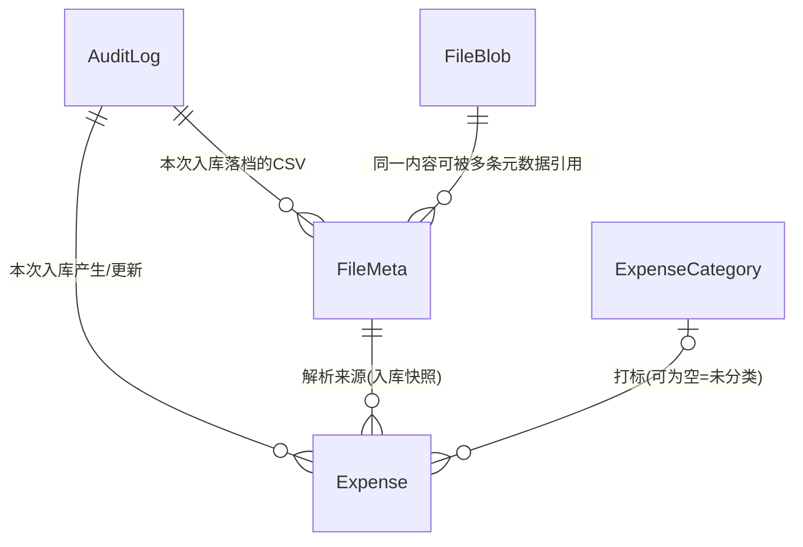
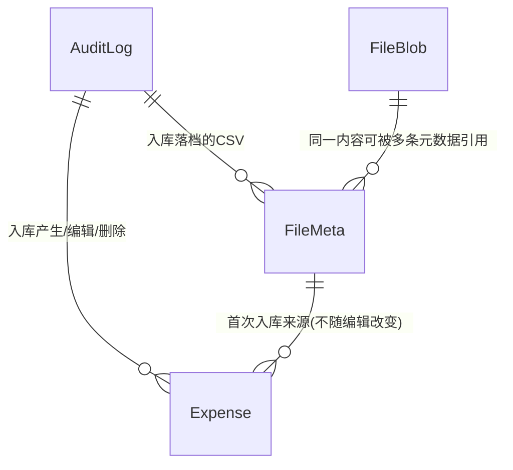

# 对话1 · 重构版功能与模型（推倒重来 · 第一稿）

> 依据来源：本轮 `260911-220830-prompt.md`「对话1」全部 24 条诉求（**唯一权威**）；
> `doc/decisions/记账系统功能与模型.md`（旧终版，8 前提 / 11 域 57 功能 / 5 实体 62 属性）**仅作语言风格与对照基线**，其结论一律不默认继承，逐条重判；
> 历史 commit 与 `2609p0/2609p1` 各轮 answer 按你的要求不作为依据。
> 范围：业务功能、实体、属性、关联关系、业务规则；不涉及技术实现，不写代码与 SQL。
> 规模：**8 条前提 / 10 域 40 项功能 / 5 实体 43 项属性 / 5 组关联 / 7 类审计 / 6 条不变式 / 7 条流程 / 8 项待确认**，另含对新诉求的 **16 处修正 + 8 处风险登记**。

---

## 〇、先说结论：对新诉求本身的 16 处修正与 8 处风险登记

> 你要求「诉求本身不合理、用词不当、有遗漏错误的都要指出」。这一节是本轮最重要的产出，正文各节按修正后的口径书写。

### 0.1 用词（3 处）

| # | 原词 | 问题 | 建议 |
| - | ---- | ---- | ---- |
| 1 | **私钥** | 「私钥」是非对称加密术语（与公钥配对）。此处是**口令派生的对称密钥**，叫私钥会误导技术轮次的选型 | 改称「**主密钥**」；全文口径统一为「口令 → 主密钥 → 整库加密」 |
| 2 | **入账币种 / 入账金额** | 「入账」在银行语境指「资金到账」，与这里的「折算口径」不是一回事；且与本系统的「入库」（数据提交）字形音都接近，容易串 | 建议「**记账币种 / 记账金额**」，或沿用旧版「本位币 / 本位币金额」。**本文暂全程沿用你的原词**，待你定夺（T5） |
| 3 | **登录 / 密码** | 你已明确「没有登录的概念，也没有登录的接口」，再叫登录会让人以为有会话 | 前端动作叫「**解锁**」，服务端只有「**口令校验**」；「密码」统一叫「**口令**」 |

### 0.2 阻断性缺口（7 处，不先定就走不通）

| # | 缺口 | 为什么阻断 | 建议 |
| - | ---- | ---------- | ---- |
| B-1 | **汇率来源未定义** | 「入账币种切换 → 重算折算汇率与入账金额」必须有汇率来源；录入时的汇率初值同样没有来源。新诉求全文未提 | 见 §8.2 三选一，推荐方案②「切换时给一组比率、逐笔乘算」，**零外部依赖** |
| B-2 | **没有删除入口** | 「疑似重复的数据，由人工核查手动删除」——但列表页「不支持编辑」，编辑页是 CSV，只能新增/更新，删不了 | 列表页支持**勾选 + 批量软删除**。删除不是字段编辑，不违背「列表页不可编辑」 |
| B-3 | **版本号没进 CSV** | 「查询转编辑」要按明细ID更新，若 CSV 只带明细ID不带版本号，乐观锁形同虚设 | **明细ID 与 版本号 成对往返**，作为 CSV 的两个只读列 |
| B-4 | **支出类型ID 无对应实体** | 字段表有 `支出类型ID`，但全文没有支出类型实体，这个 ID 指向谁未定义 | 补一个**最小字典实体**（4 属性）；CSV 列承载**类型名称**而非 ID（T4） |
| B-5 | **摊分月数缺下限** | 只写了「默认 1，无上限」。填 0 或负数时，结束月会早于起始月，`摊分结束月 = 起始月 + 月数 − 1` 直接失效 | 约束 **≥ 1** |
| B-6 | **合并展示缺范围口径** | 「与数据库已有数据合并展示」若指全库，数据量一大页面即不可用 | 只拉取**本次待提交行覆盖的支出日期区间**内的未删除明细；「列表转编辑」另设行数上限（T7） |
| B-7 | **认证失败无法留痕** | 审计表在加密库内，口令错时库根本打不开，写不进审计。因此「全部写操作都有操作记录」这条对认证失败天然不成立，也**没有失败锁定能力** | 口径收缩为「**全部能打开数据库的写操作**」；失败只进应用日志（不落库），显式接受无锁定 |

### 0.3 设计优化（6 处，建议采纳）

| # | 事项 | 你的原方案 | 建议 |
| - | ---- | ---------- | ---- |
| C-1 | **改密的原子性** | 「先导出旧库 → 改密 → 出意外就上传旧库回滚」——回滚完全押在用户手上 | 服务端改为「**副本改密 → 用新口令校验能打开 → 原子替换**」，失败则原库原封不动、自动回滚。用户侧的「先下载」降级为二次兜底，而不是唯一兜底 |
| C-2 | **口令校验探针** | 「没有登录接口」 | 「没有登录接口」≠「不能校验口令」。否则用户要等第一个业务请求失败才知道口令错了。提供一个**只读口令校验接口**（打开库读一条元数据即返回），不签发任何会话、不记审计 |
| C-3 | **两份 CSV 都留存** | 「都会有一个 CSV 文件在文件表中」 | 上传的**原件**与提交入库的**最终快照**可能不同（用户在预览页改过）。两条元数据行 + 内容按哈希去重；若两者内容一致则内容表只存一份——这正好是你要的 A/B 拆分的价值 |
| C-4 | **查重退化为单表分组** | 「双向查重」（本次内部 + 与库内） | 既然三种进入方式都要**与库内合并展示在同一张表**，查重就退化为「**同一张表按三要素分组高亮**」，不需要两套比对逻辑。这是本次设计相对旧版最大的一处简化 |
| C-5 | **查询请求带入账币种的用途** | 「全部的请求都带上入账币种」 | 纯查询看似用不上，其实有用：用于判断「**当前选择 ≠ 库内已有**」并给出切换提示。口径取**全库**（因为切换动作本身是全库范围的），不是当前筛选结果 |
| C-6 | **口令强度** | 全文无策略 | 口令即主密钥，**弱口令 = 弱加密**。更换口令时应有最低强度要求（长度 ≥ 12，且不得纯数字或纯字母）；初始口令由系统随机生成，天然合格 |

### 0.4 风险与代价（8 处，登记即可，不需你处理）

| # | 登记项 |
| - | ------ |
| D-1 | **KDF 强度与请求延迟是一对矛盾**：每个请求都要派生一次主密钥，KDF 调强则每请求多出可观延迟，调弱则「口令即密钥」的防护形同虚设。需在技术轮次定档 |
| D-2 | 「服务端内存中也不缓存口令与主密钥」的**准确表述是「不跨请求缓存、不落盘」**——请求处理期间二者必然在内存中，否则无法读写 |
| D-3 | 口令随每个请求传输，**必须走 HTTPS 或只在可信内网暴露**；且任何一个接口都是暴力破解的判别器（oracle），没有会话也就没有任何锁定手段 |
| D-4 | **docker 必须挂载数据卷**。否则容器一重建 = 数据库文件消失 = 系统当作首次启动重新初始化并打印新口令，旧数据全部失去（且因无人持有旧密钥，永久不可读） |
| D-5 | 服务端启动时**没有口令，无法验证已有数据库文件是否可打开**；口令正确性只能在第一个请求时暴露 |
| D-6 | **导出的快照永远不含「本次导出」这条审计**；**导入的审计只能写进导入后的新库**（旧库已被替换） |
| D-7 | 编辑会把明细的 `文件ID` / `审计ID` 覆盖为**最近一次入库**，更早的来源只能从审计列表回溯 |
| D-8 | 方案②下**反复切换入账币种（A→B→A）会累积舍入偏差**，不保证回到原汇率 |

### 0.5 对你两个直接提问的回答

- **「可以通过是否有数据库文件来判断是否是第一次启动？」**——可以，且这是最合适的判据（服务端不存口令，没有第二个可信状态位）。前提是 D-4：文件必须在挂载卷上。
- **「如果某次入账币种切换失败或中断，重试即可？」**——成立，且是天然的。因为筛选条件是 `入账币种 ≠ 目标币种`，已收敛的行会自动被筛掉，重试即续跑，无需任何进度记录（§G-4）。

---

## 一、定位与全局前提（8 条）

个人自用记账系统，**只记支出**，以本系统自有格式的 CSV 为唯一录入形态，核心价值是**明细留存 + 人工去重 + 多币种折算**。

| # | 前提 |
| - | ---- |
| 1 | **单用户、单实例、docker 部署**；数据库文件必须位于挂载的数据卷上 |
| 2 | **口令即主密钥**：SQLite 整库加密（技术选型已定 `github.com/ncruces/go-sqlite3`），主密钥由口令现场派生；代码不写死、服务端不存储、不跨请求缓存、不落盘。**口令丢失 = 数据永久不可读，不设任何找回路径** |
| 3 | **无登录态、无会话、无登录接口**：每个请求自带「口令 + 入账币种」，服务端逐请求「派生主密钥 → 打开库 → 读写 → 关闭」 |
| 4 | **单用户 ⇒ 归属维度整体消失**：无用户实体、无归属字段、无归属校验。**加密本身就是唯一的访问边界**——这与旧版「假定无人能直接读写数据库、应用层是唯一防线」是相反的口径 |
| 5 | **只记支出**，不涉及收入、结余、资产负债；金额以正数为常态，**允许 0 与负数**（退款、冲正），作抵扣而非收入 |
| 6 | **录入只有一条链路**：手动填写等价于「在页面上编辑一份 CSV」，与上传真实 CSV 走同一套页面、同一套校验、同一套提交，两者都在文件表留下 CSV |
| 7 | **记录的存在性单向不可逆**：明细只有软删除（写删除时间，**终态**，无恢复入口，找回一律靠复制新增）；文件与审计不可删除；支出类型仅在零引用时可物理删除 |
| 8 | **审计只留痕、不承载业务**：不提供基于审计的回滚 / 撤销 / 重放入口；「按审计ID筛选明细」是普通查询条件，不是回滚功能 |

---

## 二、功能清单（10 域 40 项）

### A. 口令与加密（6 项）

- **A-1 系统初始化**：启动时若数据卷中**无数据库文件**，即判定首次启动 → 内存生成随机口令 → **打印到日志（仅此一次）** → 以该口令派生主密钥建库并加密 → 写一条「系统初始化」审计。口令与主密钥均不落盘。
- **A-2 初始口令的唯一交付**：日志是唯一交付渠道；进程重启**不重新打印**（服务端已不持有口令）。**错过即无法使用**，唯一出路是删除数据库文件或重装服务重新初始化——旧数据同时永久失去，属设计内的接受项。
- **A-3 逐请求携带口令**：所有接口一律携带「口令 + 入账币种」；服务端每次现场派生主密钥，处理完即丢弃。**无登录、无登出、无令牌、无会话、无超时**。
- **A-4 口令校验（只读探针）**：前端进入主界面前调用一次，给出明确的「口令错误」反馈；不签发任何会话，属读操作、不记审计。口令错与文件损坏在业务层不可区分，统一提示「口令错误或数据库文件损坏」。
- **A-5 更换口令**：等价于更换数据库主密钥，流程见 §10.3。**前置强制**：页面必须先让用户下载当前加密数据库，未下载不允许提交。记一条「更换口令」审计（写入新口令的库中，**不记任何口令值**）。
- **A-6 口令策略**：初始口令系统随机生成；用户自定口令须满足最低强度（长度 ≥ 12，且不得为纯数字或纯字母）。**无失败锁定能力**（§0.2 B-7）。

### B. 数据库导入导出（3 项）

- **B-1 导出加密数据库**：导出**当前加密态**的数据库文件（一致性快照）。文件本身即完整备份，需用导出当时的口令才能打开。
- **B-2 导入加密数据库**：上传一个加密数据库文件，服务端用**本次请求携带的口令**校验能否打开且结构合法，通过才**原子替换**现有数据库。**导入是整库覆盖、不可逆**，页面须二次确认并提示先导出当前库。替换后写一条「数据库导入」审计（落在新库中）。
- **B-3 一对能力覆盖四个场景**：备份、迁移、换机、改密回滚共用 B-1 / B-2，不另建备份模块、不做增量备份。

### C. 审计（3 项）

- **C-1 覆盖范围**：**所有能打开数据库的写操作**各记一条审计，共 **7 类**（枚举见 §8.4）。读操作一律不记（数据导出是否例外见 T3）。
- **C-2 只留痕、不耦合**：审计不提供回滚 / 撤销 / 重放入口；`对象ID` 是**历史指针，不是外键**，指向的对象可能已不存在。
- **C-3 审计查看**：只读列表，按操作类型与时间区间筛选；可跳转到「按审计ID筛选的明细列表」——这是查询能力，不是回滚入口。本页**不承担任何写操作**。

### D. 文件管理（4 项）

- **D-1 元数据与内容两实体拆分**：`FileMeta` 只存元数据（文件名、用途、来源审计），承载列表与追溯等绝大部分查询；`FileBlob` 只存内容，**只在下载与校验时读取**。
- **D-2 内容寻址与天然去重**：`FileBlob` 以**内容哈希**为唯一ID，`FileMeta` 以哈希为外键。同一份内容只存一份；允许多条元数据指向同一内容（不同文件名、不同时间、不同用途）。
- **D-3 完整性校验**：下载时重算内容哈希与主键比对，不一致则告警并阻止下载——这是哈希的第二用途。
- **D-4 文件列表与下载**：按时间、文件名、用途、来源审计筛选并下载。**文件只留存、不删除**，因此内容表不会出现孤儿，无需引用计数（将来若开放删除元数据，必须补引用计数）。

### E. 数据录入（7 项）

- **E-1 系统自有 CSV 契约**：**不适配任何银行的原生格式**，只认本系统定义的列名。按列名匹配、不依赖列顺序；必填列缺失报错、可选列缺失按空、**出现未知列报错**（避免表头错位被静默误读）。详见 §8.6。
- **E-2 手动录入 = 填 CSV**：页面上的表格编辑在语义上就是编辑一份 CSV，提交时同样生成 CSV 快照落库。因此系统**没有「手工录入」与「文件导入」两条链路**，只有一条。
- **E-3 录入编辑页（三种进入方式共用）**：① 上传真实 CSV；② 空白新建；③ 从查询列表页「转编辑」。三者进入后形态完全一致：一张可编辑表格 + 库内相关明细的合并展示。
- **E-4 合并展示与重复高亮**：把本次待提交行与库内明细放进**同一张表**，按「支出日期 + 支出金额 + 支出币种」分组，同组行加框并高亮。库内行**只读、不可编辑、不随本次提交**。拉取范围 = 本次待提交行覆盖的**支出日期区间**内的未删除明细。
- **E-5 明细ID 的四种取值语义**：
  - **空** → 新增，提交时由服务端生成 ID（全新手动创建、CSV 未填 ID 均属此）。
  - **有值且命中库内未删除明细** → 按 ID 更新，走乐观锁（查询转编辑的常规路径）。
  - **有值但命中已删除明细** → **拒绝**（软删除是终态）。若要找回，前端「复制」时必须**清空明细ID**，按新增处理。
  - **有值但库内不存在** → 拒绝（防止人工乱填 ID 产生幽灵记录）。
- **E-6 提交入库**：整批一个事务——落 CSV 快照（及原件）→ 写一条「数据入库」审计 → 按明细ID 新增 / 更新 → 逐行重算派生字段。任一行乐观锁冲突则**整批失败**，提示「数据已落后，请刷新页面重新加载后重做」。
- **E-7 非法输入反馈**：表头不符、必填缺失、日期 / 金额 / 汇率格式错、汇率 ≤ 0、摊分月数 < 1、支出类型名称未匹配、明细ID 非法——**逐行逐列**给出定位明确的错误，不做静默兜底。

### F. 查询与去重（6 项）

- **F-1 明细列表**：分页、排序，顶部筛选区。列表页**不提供字段编辑**。
- **F-2 多维筛选**：支出日期区间、支出币种、入账币种、金额区间、交易对手方（模糊）、交易备注（模糊）、支出类型（多选，空即未分类）、银行名称 / 卡号后四位、来源审计ID、来源文件ID、**是否显示已删除**（默认不显示）。
- **F-3 表格组件复用**：查询页与录入编辑页共用同一套表格与样式；表头可选，默认 10 列、可切全字段平铺（见 §8.3）。
- **F-4 疑似重复高亮**：三要素相同的行加框并高亮，两个页面同一套规则；系统**只标记不阻断**，是否真重复一律人工裁定。
- **F-5 人工去重处置 = 软删除**：列表页支持勾选（含**全选当前筛选结果全集**）后批量软删除；已删除行**跳过、不覆盖其删除时间**；删除前提示「本次将删除 N 笔明细」。记一条「明细删除」审计。
- **F-6 列表转编辑**：把**当前筛选结果**导出为一份 CSV（**必带明细ID与版本号**）送入录入编辑页。为保证页面可用，转编辑行数设上限，超限要求先收窄筛选（T7）。

### G. 币种与入账口径（5 项）

- **G-1 币种枚举内置**：币种为代码内置枚举（代码、名称、小数位数、是否启用），**不落库**，库中只存币种代码。新增币种 = 改代码；枚举项只能停用不能删除（历史明细存着旧代码）。
- **G-2 入账币种逐请求携带**：不落库、不建用户配置实体。**写操作**用它决定新数据的入账口径；**查询**用它判断「当前选择 vs 库内已有」是否一致（§0.3 C-5）。
- **G-3 折算恒等式**：`入账金额 = 支出金额 × 折算汇率`。入账金额是**只读因变量**，无人工指定入口；支出币种 = 入账币种时折算汇率恒为 1；折算汇率恒 > 0。
- **G-4 入账币种切换**：筛选出 `入账币种 ≠ 目标币种` 的**全部明细（含已删除）**，逐笔重算 `折算汇率 / 入账金额 / 入账币种` 三字段（**单笔同事务**）；允许部分失败、可中断、**重试即续跑**（已收敛的行天然被筛掉，无需进度记录）。记一条「入账币种切换」审计。汇率来源见 §8.2。
- **G-5 表头提示**：明细表格的「入账币种」表头展示**全库存在的入账币种集合**；集合元素多于一个、或唯一元素 ≠ 当前选择时，提示用户执行入账币种切换。

### H. 摊分（2 项）

- **H-1 摊分三字段**：`摊分月数`（默认 1，**下限 1**，无上限）+ 派生的 `摊分起始月`（= 支出日期所属月）与 `摊分结束月`（= 起始月 + 摊分月数 − 1）；支出日期或摊分月数变更时同步刷新。
- **H-2 份额不落库、本轮无消费方**：摊分份额不产生额外数据行；**本轮不提供月度统计与摊分口径报表**，三字段目前只做存储与展示，属为后续轮次预留（T2）。

### I. 支出类型（2 项）

- **I-1 类型字典**：单层、名称唯一、用户自建，**只能新建与删除**（不提供改名、不提供停用）；初始为空集。CSV 中以**类型名称**列承载，提交时按名称匹配到 ID，**未匹配报错、不自动建档**（防止错别字把字典撑爆）。记「支出类型维护」审计，摘要必须带类型名称。
- **I-2 删除保护**：被任何明细（**含已软删除**）引用的类型不可删除；零引用时物理删除，删即不可恢复。筛选框与编辑框的类型下拉范围完全一致（全部类型）。

### J. 部署与运维（2 项）

- **J-1 docker 单实例**：容器无状态，全部状态在挂载卷上的数据库文件里；无外部存储、无外部中间件、无出网依赖（前提是汇率取方案②）。
- **J-2 日志口径**：日志中**只有初始化那一次**会出现口令；此后任何日志、任何审计、任何导出都不得出现口令值。

---

## 三、实体关系图

- **无 `User` 实体**——单用户，归属维度整体消失，这是相对旧版最大的结构变化。
- **`Expense` 是唯一的事实实体**：摊分份额、汇率、币种、解析器、用户配置均不建实体。
- **`AuditLog` 是留痕枢纽，但不承载任何业务动作**（前提 8）。
- **`FileBlob` 是全模型唯一的内容寻址表**：主键即内容哈希，天然去重、天然可校验。

---

## 四、逐实体属性（5 实体 43 项）

> 「必填」= 任何记录都必须有确定值；业务上「不适用」的场景以零值表达。
> 属性顺序即 §8.3 全字段平铺的展示顺序。

### 1. Expense 支出明细（21 项 · 核心实体）

| 属性 | 必填 | 可手编 | 说明 |
| ---- | ---- | ------ | ---- |
| 银行名称 | ✗ | ✓ | 未填时留空；本轮 CSV 为系统自有格式，此列纯手填（T8） |
| 卡号后四位 | ✗ | ✓ | 同上 |
| 支出日期 | ✓ | ✓ | 交易发生日；**字面值，无时区换算**；摊分起始月的依据 |
| 支出币种 | ✓ | ✓ | 币种枚举代码 |
| 支出金额 | ✓ | ✓ | 支出币种金额，**允许为 0 / 负**（退款、冲正） |
| 交易对手方 | ✗ | ✓ | 商户或收款方；未给出时留空 |
| 交易备注 | ✗ | ✓ | 账单摘要或用户自填；未给出时留空 |
| 折算汇率 | ✓ | ✓ | 1 单位支出币种可兑换的入账币种数量；支出币种 = 入账币种时取 1；**必须 > 0** |
| 入账币种 | ✓ | ✗ | 币种枚举代码；新增行取请求携带值，**更新既有行时保持库内原值**，口径变更只能走 G-4 |
| 入账金额 | ✓ | ✗ | = 支出金额 × 折算汇率 |
| 支出类型ID | ✗ | ✓ | 打标结果，空即未分类；**CSV 以类型名称承载**，非 ID |
| 摊分月数 | ✓ | ✓ | 默认 1，**下限 1**，无上限 |
| 摊分起始月 | ✓ | ✗ | = 支出日期所属月 |
| 摊分结束月 | ✓ | ✗ | = 起始月 + 摊分月数 − 1 |
| 明细ID | ✓ | ✗ | 唯一标识；**CSV 中为空即新增**，有值即按 ID 更新（四种取值语义见 E-5） |
| 审计ID | ✓ | ✗ | 属于**最近一次**入库；编辑会覆盖（§0.4 D-7） |
| 文件ID | ✓ | ✗ | **最近一次**入库所用的 CSV 快照；编辑会覆盖 |
| 版本号 | ✓ | ✗ | 乐观锁；**CSV 中必须与明细ID成对往返**；冲突时提示数据已落后、刷新重做 |
| 创建时间 | ✓ | ✗ | — |
| 更新时间 | ✓ | ✗ | — |
| 删除时间 | ✗ | ✗ | 有值即已删除（软删除），**终态不可逆**，无恢复入口 |

> 相对你给的字段表，实质变动 4 处：① `折算汇率` 补「> 0」为硬约束；② `摊分月数` 补下限 1（B-5）；③ `支出类型ID` 明确 CSV 以名称承载（B-4）；④ `入账币种` 明确「更新既有行时不变」——否则在混合币种态下编辑一行会悄悄改掉它的口径。

### 2. ExpenseCategory 支出类型（4 项，全部必填）

| 属性 | 说明 |
| ---- | ---- |
| 类型ID | 唯一标识 |
| 名称 | 单层无父子，**全局唯一**；不提供改名 |
| 创建时间 / 更新时间 | — |

> 无状态字段——不提供停用；生命周期只有「新建」与「零引用时物理删除」两态。

### 3. AuditLog 操作审计（8 项，全部必填）

| 属性 | 说明 |
| ---- | ---- |
| 审计ID | 唯一标识，兼「入库批次号」 |
| 操作类型 | 7 类枚举，见 §8.4 |
| 操作对象类型 | 零值 = 无具体对象或为批量操作 |
| 对象ID | 零值 = 同上；**是历史指针，不是外键** |
| 操作摘要 | 人可读描述，如「入库 37 笔（新增 30 / 更新 7），来源 2609.csv」 |
| 变更内容 | 前后值快照；零值 = 非编辑类操作；**一律不记任何口令值** |
| 操作结果 | 成功 / 失败 / 部分成功 |
| 操作时间 | 发生时点 |

> 相对旧版删去 `用户ID`（单用户无归属）与 4 类审计枚举。「部分成功」为新增取值，服务于 G-4 可中断续跑。

### 4. FileMeta 文件元数据（6 项，全部必填）

| 属性 | 说明 |
| ---- | ---- |
| 文件ID | 唯一标识；`Expense.文件ID` 指向它 |
| 内容哈希 | 指向 `FileBlob` 的外键；**多条元数据可指向同一内容** |
| 文件名 | 上传时的原始文件名，或系统为手动录入生成的名字 |
| 用途 | 枚举：**上传原件 / 入库快照**（§0.3 C-3） |
| 审计ID | 在哪次操作中落档——文件与审计双向可查 |
| 创建时间 | — |

### 5. FileBlob 文件内容（4 项，全部必填）

| 属性 | 说明 |
| ---- | ---- |
| 内容哈希 | **主键即唯一ID**；天然去重，同时是完整性校验的基准（D-3） |
| 文件内容 | 原始字节 |
| 文件大小 | 由内容唯一决定，放在内容侧避免同一哈希在多条元数据上出现不一致 |
| 创建时间 | 该内容**首次**入库的时间 |

> 这张表只在下载与校验时读取；文件不删除，因此不会产生孤儿内容。

---

## 五、不落库的五样

1. **币种枚举**（代码内置）：代码、名称、小数位数、是否启用。库中只存币种代码。新增币种 = 改代码。
2. **口令与主密钥**：只在单个请求的处理期间存在于内存，不落盘、不跨请求缓存、不进日志（初始化那一次除外）、不进审计、不进导出。
3. **会话与令牌**：彻底不存在——无登录接口，也就没有可失效的东西。
4. **入账币种的「当前选择」**：逐请求携带，不建用户配置实体（「如无必要勿增实体」）。
5. **摊分份额**：由摊分起止月实时派生，不产生额外数据行。

---

## 六、刻意不建实体（10 项）

| 候选 | 替代方案 |
| ---- | -------- |
| 用户 | 单用户；口令即访问边界 |
| 登录态 / 令牌 | 无会话 |
| 币种 | 代码枚举 + 明细上的币种代码 |
| 汇率 | 明细上的折算汇率数值快照 |
| 用户配置（入账币种 / 语言） | 逐请求携带 |
| 导入批次 | `AuditLog`，一次提交即一条审计、一个可追溯批次 |
| 月度聚合 / 摊分份额 | 明细上的摊分起止月 + 区间穿刺（本轮尚未使用） |
| 解析器档案 | 本轮只有系统自有 CSV 一种格式，无需注册表 |
| 银行卡片档案 | 明细上的银行名称 / 卡号后四位 |
| 录入预览暂存 | 前端会话内临时态，未提交即丢失 |

---

## 七、关联关系（5 组）

| 关系 | 基数 | 约束 |
| ---- | ---- | ---- |
| AuditLog → Expense | 1:N | 一次入库产生或更新的明细；**仅供追溯与筛选，不构成回滚入口** |
| AuditLog → FileMeta | 1:N | 一次入库落档的 CSV（原件 + 快照），双向可查 |
| FileMeta → Expense | 1:N | 明细的来源 CSV 快照；明细必有来源（前提 6） |
| FileBlob → FileMeta | 1:N | 内容寻址；同内容只存一份，允许多条元数据引用 |
| ExpenseCategory → Expense | 1:N，可空 | 打标；空即未分类；**被引用（含已软删明细）的类型不可删除** |

> 币种不产生关联关系——它是值，不是引用。`AuditLog.对象ID` 是历史指针，不构成关联关系。

---

## 八、关键业务规则

### 8.1 折算联动（7 种触发）

`入账金额 = 支出金额 × 折算汇率`——两个自变量由用户维护，入账金额是**只读因变量**。

| 触发 | 折算汇率 | 入账金额 | 入账币种 |
| ---- | -------- | -------- | -------- |
| 改支出金额 | 不变 | 重算 | 不变 |
| 改折算汇率 | 用户值（须 > 0） | 重算 | 不变 |
| 改支出币种 **为 = 入账币种** | **强制置 1** | 重算 | 不变 |
| 改支出币种 **为其他币种** | 不变，**由用户自行修正** | 重算 | 不变 |
| 改支出日期 | **不变** | 不变 | 不变 |
| G-4 入账币种切换 | 按 §8.2 重算 | 重算 | **= 目标币种** |
| 改摊分月数 | — | — | —（仅刷新摊分结束月） |

> **与旧版的关键差异**：旧版「改支出日期 → 重拉该日日汇率」的规则**整条作废**，因为本轮没有自动汇率源（汇率是用户在 CSV 里填的）。这是「简洁」方向必然付出的精度代价，已知并接受。

### 8.2 汇率来源（三选一，**待你定夺 T1**）

| 方案 | 做法 | 优点 | 代价 |
| ---- | ---- | ---- | ---- |
| ① 自动获取日汇率 | 按支出日期向外部接口取汇率 | 精度最高，接近旧版 | 引入外部依赖：出网、第三方接口、失败兜底、重试——把刚砍掉的复杂度全装回来，与「简洁」方向相悖 |
| ② **切换时给比率，逐笔乘算**（**推荐**） | 录入时汇率由用户在 CSV 填；切换时，用户为每个「源入账币种 → 目标币种」给**一个比率**，系统逐笔 `新汇率 = 原汇率 × 比率`；`支出币种 = 目标币种` 的行**强制置 1** | 零外部依赖；**保留用户逐笔填写的汇率差异**；天然可续跑 | 反复切换累积舍入偏差（D-8）；同一源币种的所有行共用一个比率 |
| ③ 切换时按支出币种给汇率 | 用户为每个「支出币种 → 目标币种」给一个汇率，直接覆盖 | 无漂移，最直观 | **抹平**用户逐笔填写的汇率差异——逐笔手填的成果会被一次切换全部冲掉 |

> 推荐②的理由：本系统的汇率本来就是用户逐笔填写的成果，②是唯一既不依赖外网、又不破坏这份成果的方案。`支出币种 = 目标币种` 强制置 1 这一条不能省，否则乘积不会正好等于 1，会破坏 §九.1 的不变式。

### 8.3 表格与高亮

- **默认列（10 列，按此顺序）**：支出日期 / 支出币种 / 支出金额 / 折算汇率 / 入账币种 / 入账金额 / 交易对手方 / 交易备注 / 支出类型 / 摊分月数。
- **全字段模式**：按 §四.1 的顺序平铺全部 21 项。
- **表头可选**：用户自选展示列（该偏好属前端本地状态，不落库）。
- **疑似重复**：「支出日期 + 支出金额 + 支出币种」相同的行归为一组，**加框 + 高亮**。在录入编辑页中，本次待提交行与库内行处在同一张表，**同一套分组规则同时覆盖「本次内部重复」与「与库内重复」**（§0.3 C-4）。

### 8.4 审计枚举（7 类）

| # | 操作类型 | 触发 | 对象类型 / 对象ID |
| - | -------- | ---- | ----------------- |
| 1 | 系统初始化 | A-1 | 零值 |
| 2 | 数据入库 | E-6（新增 + 更新同属此类） | 零值（批量）；摘要记新增 / 更新笔数与来源文件 |
| 3 | 明细删除 | F-5 | 逐笔：`Expense` / 明细ID；批量：零值，摘要记筛选条件与笔数 |
| 4 | 入账币种切换 | G-4 | 零值（批量）；摘要记目标币种与成功 / 失败笔数 |
| 5 | 支出类型维护 | I-1 新建 / 删除 | `ExpenseCategory` / 类型ID；摘要**必须带类型名称** |
| 6 | 更换口令 | A-5 | 零值；**变更内容不记任何口令值** |
| 7 | 数据库导入 | B-2 | 零值；写入被导入的**新库**（D-6） |

**三条边界**：① 读操作一律不记（数据导出是否例外见 T3）；② 任何审计字段都不得出现口令值；③ 审计不提供回滚 / 撤销 / 重放入口（前提 8）。

> 明细的「新增」与「编辑」不单列——一律走「数据入库」，因为本系统的编辑就是一次 CSV 提交。

### 8.5 删除与复制

- **删除**：写 `删除时间` 即已删除，**终态不可逆**；逐笔与批量同此；已删除行**跳过、不覆盖其删除时间**；删除幂等，失败重跑即可。已删除明细**不参与默认列表、不参与 §8.6 的合并展示与查重比对**，但**仍参与 G-4 切换**（因为可经 F-2 筛选查看，展示必须处于统一口径）。
- **复制**：在录入编辑页把已删除行复制为新行时**必须清空明细ID**，其余字段随复制作初值（可改）；提交后生成新明细，挂本次入库的审计ID与文件ID。原已删除行不受影响。

### 8.6 CSV 契约

- 按**列名**匹配，**不依赖列顺序**；必填列缺失报错、可选列缺失按空、**出现未知列报错**。
- `支出类型` 列承载**名称**（非 ID），提交时按名称匹配，未匹配报错、不自动建档。
- `明细ID` 与 `版本号` **成对往返**：全字段导出时必带，导入时用于定位与并发控制。
- 只读列（`入账币种` / `入账金额` / `摊分起始月` / `摊分结束月` / `创建时间` / `更新时间` / `删除时间`）导出时带出便于查看，**导入时一律忽略**，以服务端重算值或库内现值为准。
- 合并展示时，库内行以只读形态并列显示，**不随本次提交**，也不会被 CSV 的内容覆盖。

### 8.7 口令与主密钥

- 口令 → 主密钥的派生在每个请求内现场完成，用完即弃（§五.2）。
- 口令错误 = 数据库打不开，与文件损坏在业务层不可区分，统一提示。
- **更换口令 = 更换主密钥**：副本改密 → 用新口令校验能打开 → 原子替换；失败则原库原封不动（§0.3 C-1）。用户侧「先下载旧库」是二次兜底，不是唯一兜底。
- 导出的数据库文件用**导出当时的口令**打开——改密之后，旧备份仍需旧口令，这是回滚能成立的前提。

---

## 九、必须守住的六条不变式

1. **折算恒等式**：`入账金额 = 支出金额 × 折算汇率` 恒成立，入账金额为只读因变量、任何一次编辑后立即重算；`支出币种 = 入账币种` 时折算汇率恒为 1；折算汇率恒 > 0。
2. **摊分派生**：`摊分起始月 = 支出日期所属月`、`摊分结束月 = 起始月 + 摊分月数 − 1`，`摊分月数 ≥ 1`；支出日期或摊分月数变更时同步刷新。
3. **口令零持久化**：口令与主密钥不落盘、不跨请求缓存、不进日志（初始化那一次除外）、不进审计、不进导出、不进任何错误信息。
4. **记录单向不可逆**：明细只软删且为终态；文件与审计不可删除；支出类型仅在零引用时可物理删。全模型无第二处「删除又恢复」。
5. **审计只留痕**：任何业务动作都不得以审计为入口或依据；「按审计ID筛选」属查询能力，不属回滚功能。
6. **一次提交 = 一条「数据入库」审计 = 一份 CSV 快照**，本批全部明细的 `审计ID` / `文件ID` 一并指向它们。

---

## 十、核心业务流程（7 条）

1. **初始化与首次使用**：启动 → 数据卷无库文件 → 生成随机口令 → **打印日志** → 建库加密 → 写「系统初始化」审计 → 用户从日志取口令 → 页面解锁 → 直接可用（无首登改密强制，因为初始口令本就是强随机）。
2. **每一次请求**：携带「口令 + 入账币种」→ 派生主密钥 → 打开库 → 校验 / 读写 → 关库、丢弃密钥。失败一律返回「口令错误或数据库文件损坏」。
3. **更换口令**：页面强制先下载当前加密数据库 → 提交新口令（校验强度）→ 服务端副本改密 → 用新口令校验可打开 → 原子替换 → 写「更换口令」审计 → 前端以新口令重新解锁。任一步失败则原库不动；极端情况下用刚下载的旧库经 B-2 导入回滚。
4. **数据录入**：三种进入方式（上传 CSV / 空白新建 / 列表转编辑）→ 同一张编辑表格 → 按日期区间拉取库内明细合并展示 → 三要素分组加框高亮 → 人工增删改行、取消重复行 → 提交 → 落 CSV（原件 + 快照）→ 写「数据入库」审计 → 按明细ID 新增 / 更新 → 重算派生字段。整批一个事务，乐观锁冲突则整批失败。
5. **人工去重**：列表页筛选定位 → 高亮框识别三要素相同的行 → 人工裁定 → 勾选（或全选筛选结果）→ 批量软删除 → 写「明细删除」审计。
6. **入账币种切换**：表头提示存在多种入账币种 → 用户选目标币种并按 §8.2 方案②提供比率 → 筛选 `入账币种 ≠ 目标` 的全部明细（含已删除）→ 逐笔单事务重算三字段 → 写一条审计（成功 / 部分成功）。中断或失败后重试即续跑。
7. **备份与迁移**：随时 B-1 导出加密库文件 → 换机 / 回滚时 B-2 上传并以对应口令校验 → 原子替换 → 写「数据库导入」审计（落新库）。

---

## 十一、待确认（8 项）

| 编号 | 问题 | 推荐 |
| ---- | ---- | ---- |
| T1 | **汇率来源**：§8.2 三选一 | **方案②**（切换时给比率、逐笔乘算，零外部依赖） |
| T2 | **摊分三字段本轮无消费方**（未提月度统计）：保留预留，还是本轮一并砍掉？ | 保留。三个字段成本极低，砍掉后将来补要改数据 |
| T3 | **数据导出 / 数据库导出是否记审计**：按「只记写操作」应不记，但导出是数据外流的高风险动作 | **记**，并接受「导出的快照不含这条」（D-6） |
| T4 | **支出类型**：最小字典实体（4 属性），还是直接在明细上存名称字符串（零实体）？ | **字典实体**。CSV 自由文本会因错别字把分类打散，字典 + 严格匹配才能收住 |
| T5 | **「入账币种 / 入账金额」正式用词**（§0.1） | 「记账币种 / 记账金额」 |
| T6 | **前端如何持有口令**（刷新是否需重输） | sessionStorage，关闭标签即失效；并在页面上明示 XSS 风险 |
| T7 | **「列表转编辑」的行数上限**取值 | 需要你给一个量级（数百 / 数千），我按它定交互 |
| T8 | **是否保留「银行名称 / 卡号后四位」**：本轮 CSV 是系统自有格式、不解析银行原生账单，这两列变成纯手填 | 保留。成本为零，且是筛选维度；将来接银行原生格式时正好复用 |

> 旧版的 T4「自动打标判定方式」在新诉求中未提及，本轮**继续挂起**：`支出类型ID` 只能手填，不建打标规则实体。

---

## 十二、交付说明

- **交付物**：本节即对话1 的完整设计——对新诉求的 16 处修正与 8 处风险登记、8 条前提、10 域 **40 项**功能、1 张实体关系图、5 实体 **43 项**属性、5 样不落库设计、10 项不建实体、5 组关联关系、7 类审计枚举、6 条不变式、7 条核心流程、8 项待确认。
- **规模**：`Expense` 21、`ExpenseCategory` 4、`AuditLog` 8、`FileMeta` 6、`FileBlob` 4。
- **相对旧版终版（8 前提 / 11 域 57 功能 / 5 实体 62 属性）的变化**：
  - **实体 5 → 5，但构成全变**：删 `User`，`File` 拆为 `FileMeta` + `FileBlob`；**属性 62 → 43**；**功能 57 → 40**；**审计枚举 11 → 7**。
  - **整块删除**：多用户与权限、归属校验、登录态 / 令牌 / 锁定 / 强制改密、多语言、月度统计（旧 J 域 6 项）、解析器插件化与银行原生格式适配、自动汇率获取、明细导出。
  - **整块新增**：整库加密与「口令即主密钥」、数据库导入导出、更换口令、文件内容寻址拆表、CSV 单链路录入、入账币种切换、乐观锁版本号。
  - **口径反转 3 处**：① 明文存储 + 应用层唯一防线 → **整库加密 + 加密即唯一边界**；② 本位币是用户配置 → **入账币种逐请求携带、不落库**；③ 编辑走单行表单 + 单笔查重 → **编辑走 CSV 批量 upsert + 同表分组高亮**。
- **未做**：字段类型与长度、索引、加密算法与 KDF 参数、二进制存储形态、原子替换的实现方式、任何 SQL 与代码——均属技术实现，留待技术方案轮次。
- **校验方式**：
  ① 功能点算：6+3+3+4+7+6+5+2+2+2 = **40**；
  ② 属性点算：21+4+8+6+4 = **43**；
  ③ 正向逐条走 40 项功能，确认每项所需数据都有属性落点，无悬空功能；
  ④ 反向逐条走 43 项属性，确认均可追溯到功能编号（`摊分起始月 / 结束月` 本轮只到展示，已登记 T2）；
  ⑤ 新诉求 24 条逐条核销，确认全部落入正文、§〇 修正表或待确认，无遗漏；
  ⑥ 7 类审计与全部写操作双向对齐，确认无「回滚 / 撤销」残留（前提 8）；
  ⑦ 三种录入进入方式 × 明细ID 四种取值（空 / 命中未删 / 命中已删 / 不存在）共 12 种组合逐一走查，行为与 E-5 一致；
  ⑧ 已删除明细在 F-2 / F-5 / E-4 / G-4 / §8.5 五处的行为交叉核验，确认「只读 + 可查看 + 可复制新增 + 参与切换 + 不参与查重」互不抵触。

---

# 对话2 · 命名定案、录入模型重构与汇率口径收敛

> 依据来源：本轮 `260911-220830-prompt.md`「对话2」全部 16 条反馈（唯一权威）；逐条对应对话1 §0.1/§0.2/§0.3 与 T1~T8 编号展开，凡与对话1结论冲突处，以本节为准，对话1正文不再重复改写，仅在此登记差异。
> 范围与上一轮相同：纯业务视角，不涉及技术实现，不写代码与 SQL。

## 〇、结论速览（16 条反馈的处置）

| # | 反馈要点 | 处置 | 对应编号 |
| - | -------- | ---- | -------- |
| 1 | 「主密钥」为何不叫密钥 | **采纳更正**，命名定案为「密钥」 | §0.1-1 |
| 2 | 记账/本位币两套词不对仗 | 给出对仗方案，**仍待你拍板** | T5（延续） |
| 3 | 解锁/口令校验 | 确认无变化 | §0.1-3 |
| 4 | 汇率来源依赖外部接口，对接细节挂起 | **采纳**，T1 定案为方案① | T1（收敛） |
| 5 | 勾选 + 批量软删除 | 确认无变化 | B-2 |
| 6 | 推翻「列表页不可编辑」 | **建议方案**：E 域并入 F 域，**需你确认** | 结构性变更 |
| 7 | CSV 带版本号太复杂 | 随第 6 条一并化解：CSV 不再带版本号 | B-3（作废） |
| 8 | 合并展示范围本意是三要素精确匹配，仍嫌复杂 | 随第 6 条一并化解：取消「预览态合并」 | E-4（改写） |
| 9 | 审计口径收缩为「全部能打开库的写操作」 | 确认无变化 | B-7 |
| 10 | 副本改密原子替换；仍需导入导出 | 确认无变化 | C-1 |
| 11 | 口令校验探针，接口留待技术阶段 | 确认无变化 | C-2 |
| 12 | 查重退化单表分组仍嫌复杂 | 随第 6 条一并化解 | C-4（改写） |
| 13 | 口令强度（≥12，非纯数字/纯字母） | 确认无变化 | C-6 |
| 14 | 每请求带口令的安全风险，要更安全方案 | **分析结论**：业务层已到极限，是否让步**待你决策** | 新增讨论 |
| 15 | 切换记账币种：A→B→A 汇率与金额均应 A→B→A | **采纳**，与第 4 条一并落到 T1 方案①，D-8 风险解除 | G-4 / D-8 |
| 16 | 「标签」是否即「支出类型」 | **需你澄清**：是否为同一件事的重新命名 | T4（延续，命名存歧义） |

---

## 一、命名定案（2 处）

### 1.1 「主密钥」→「密钥」（采纳，直接定案）

你的反问成立：全系统自始至终只有一把从口令派生出来的密钥，没有第二把「次密钥」与它对应，「主」字无所指，属于我上一轮为规避「私钥」歧义而顺手加的多余修饰。**采纳你给出的表述**：全文「口令 → 密钥 → 整库加密」，此前所有「主密钥」一律改称「密钥」，含 §一-2、§A-1~A-6、§0.4 D-1~D-5、§8.7、§十-1~十-3 等全部出现处。

### 1.2 「记账币种/记账金额」与「本位币/本位币金额」的对仗问题（建议，待你拍板）

问题诊断：「支出币种/支出金额」本身是「2 字前缀 + 币种/金额」的固定模板（支出=2字）。「记账币种/记账金额」套用同一模板（记账=2字），天然对仗。而「本位币/本位币金额」不是同一模板——「本位币」自身已含「币」字，是个独立名词，硬套模板会变成「本位币币种」这种重字别扭的写法；「本位币金额」又是 5 字，与「支出金额」的 4 字不对齐。**不对仗的根源是两套命名体系混用，不是字数偶然凑巧**。

结论：**建议正式采用「记账」作为前缀，弃用「本位币」**，得到：

| 概念 | 定案建议 |
| ---- | -------- |
| 交易发生时的币种/金额 | 支出币种 / 支出金额（不变） |
| 折算后用于统计口径的币种/金额 | **记账币种 / 记账金额**（替代此前「入账币种/入账金额」与旧版「本位币/本位币金额」） |

采用后，全文「入账」一律改「记账」（含 §G 域标题「记账与入账口径」→「记账口径」、G-4「入账币种切换」→「记账币种切换」等）。这是命名层面的判断，**T5 本轮不强制自动执行替换，等你一句「定了」再统一改写全文**，以下各节为免反复横跳，先继续沿用「入账」，替换动作留到下一轮定稿一次性做完，避免本节内部新旧词混用。

---

## 二、录入模型重构：E 域并入 F 域（建议方案，需你确认）

### 2.1 你提出的问题

- 推翻了「列表页不可编辑」：可手编字段允许在列表页直接改，改动后如果产生新的疑似重复，用既有的加框高亮处理即可，逻辑上说得通。
- 但由此产生一个新问题：**上传 CSV 还要不要一个独立页面**？有独立页面，两套编辑界面重复建设；没有独立页面，CSV 上传要并进哪个功能、以什么形式呈现？

这是一个真正的设计缺口（对话1没预料到「列表可编辑」会推翻整个 E 域的存在前提），需要我给出方案，而不是简单确认。

### 2.2 建议方案：取消独立的「录入编辑页」，E 域整体并入 F 域（列表页）

核心判断：**一旦列表页本身可编辑，「录入编辑页」存在的唯一理由（提供一个可编辑的表格）就被列表页替代了**。三种进入方式对应关系变化如下：

| 对话1 的进入方式 | 并入后的等价动作 |
| ---------------- | ---------------- |
| ① 上传真实 CSV | 列表页「导入」按钮：解析 CSV → **直接整批 insert 落库**（不再有中间预览态）→ 新行与既有数据一起出现在列表页 |
| ② 空白新建 | 列表页「新增一行」按钮：插入一个空行 → 内联编辑可手填字段 → 单行保存 |
| ③ 查询列表转编辑 | **动作消失**：查询结果本来就在列表页里，本来就能直接改，不需要「转」到另一个页面 |

由此，**系统只剩一个页面**：明细页，同时承担查询筛选（F-1~F-4）、内联编辑（原 E 域可手编字段）、新增（含 CSV 导入）、批量软删除（F-5）、三要素分组高亮（F-4）。这是相对上一轮「10 域 40 项」最大的一处结构性精简，正对上你「往简洁方向设计」的初衷。

**连带的模式转变（需要你明确知悉并确认）**：原设计是「预览 → 人工取消重复勾选 → 提交」，即**先审后落库**；并入后 CSV 解析通过校验即直接整批落库，用户在列表页里事后看到高亮再决定是否批量软删除，即**先落库、后清理**。两者的用户体验差异是：旧模式能在数据真正进库前拦下重复行，新模式一定会先写入库，哪怕是误传的重复行，也要事后手动删除一次。**这是用简洁换来的代价，需要你确认可接受**。

### 2.3 连带简化：CSV 不再带版本号（回应第 7 条）

CSV 契约不再承载「更新」语义——**CSV 导入只做新增**，不允许携带明细ID 去更新已有行；所有「更新」都走列表页的单行内联编辑（一次编辑一行，直接对该行发起保存）。由此：

- CSV 契约删去「明细ID」「版本号」两个只读回传列，只保留 8 个业务列（支出日期起始那 8 项）。
- 乐观锁（版本号）只作为单行编辑接口的隐藏参数存在，不再是「CSV 的一列」，复杂度从「整批 CSV 的批量并发控制」降为「单行接口的常规乐观锁」，是标准做法，不再有特殊设计负担。
- 对话1 的 E-5（明细ID 四种取值语义）随之简化：CSV 场景下明细ID 恒为空（新增）；「有值/命中已删/不存在」三种分支只出现在单行编辑接口里，不再是 CSV 校验规则。
- F-6「列表转编辑」功能**整项删除**（列表本身即可编辑）。

### 2.4 连带简化：合并展示取消，查重改为「提交时精确三要素查询」（回应第 8、12 条）

你的澄清很关键：「合并展示」本意只是想看「三要素相同」的行，不是整个日期区间——这说明对话1 §0.2 B-6 给的「按日期区间拉取」本身就是过度设计，方向偏了。**并入列表页后，这个问题的解法是直接取消「合并展示」这一步**：

- 不再有「先合并展示、再提交」的中间态（因为已经没有独立预览页了）。
- 查重时机从「提交前」移到「**提交后**」：CSV 落库或单行保存成功后，服务端对**本次新增/改动的这一行**按「支出日期 + 支出金额 + 支出币种」三要素做一次**精确匹配**查询（不是区间、不是分组聚合），命中的所有行在列表页里标同一组高亮。这是一次简单的 where 等值查询，比对话1「按区间拉取再前端分组」和「双向查重两套逻辑」都更简单——**这同时回答了第 12 条「查重退化为单表分组还是复杂」：分组这一步被精确查询直接替代，不需要再对一批数据做聚合分组运算**。
- 用户想核查某一组是否重复，在列表页用 F-2 筛选框按日期/金额/币种筛选，也能看到全部同组行，高亮只是一个「不用手动筛选也能看到」的加分项，不是唯一手段。

### 2.5 待你确认的新缺口：批量修改能力的空白

原「查询转编辑」还承担着「一次性批量改多行」的能力（比如一口气把 20 笔明细的支出类型都改成同一个值，导出成 CSV 改一列再传回去）。并入列表页、CSV 只做新增之后，**批量改场景退化为逐行内联编辑**，没有「批量赋值」的等价能力（批量软删除保留，因为它走的是 F-5 的勾选批量删除，与本次重构无关）。**这是一个新识别出的遗漏，标记为 T9**，需要你确认是否接受，或是否需要补一个「勾选 + 批量赋某字段」的能力（类似批量删除的交互，仅新增一个操作，不需要恢复 CSV 转编辑整条链路）。

---

## 三、汇率来源定案：T1 收敛为方案①（回应第 4、15 条）

### 3.1 结论

你的表述「汇率来源需要依赖外部接口，接口的对接属于技术细节，该问题先挂起」，业务层面的含义是：**T1 定案为方案①（自动获取外部汇率）**，方案②（切换时人工给比率、逐笔乘算）不再采用；至于对接哪个接口、怎么调用、失败重试策略，属于技术细节，本轮不展开，留到技术方案轮次。

### 3.2 连带影响（对话1 需要一并更新的点）

| 影响点 | 对话1 原结论 | 更新为 |
| ------ | ------------ | ------ |
| 录入时汇率来源 | CSV 里由用户手填 | **系统按支出日期自动获取**，用户仍可手工覆盖（字段仍是「可手编 ✓」） |
| 自动获取失败 | 未涉及 | 沿用旧版兜底思路：该行汇率转为必填，未填不可保存，不静默按 1 处理 |
| G-4 记账币种切换的重算方式 | 方案②：给一个比率、逐笔乘算 | **改为对每一笔重新按其「支出日期 + 目标币种」自动获取一次汇率**，直接覆盖，**允许覆盖手动编辑过的汇率，无需记录感知处理**（你在第 15 条明确认可） |
| §8.1 改支出日期/改支出币种的联动 | 「整条作废，因为没有自动汇率源」 | **恢复**：改支出日期或支出币种时，系统重新拉取新条件下的当日汇率并重算，用户仍可再手工覆盖 |
| J-1 部署前提「无出网依赖」 | 成立（方案②零外部依赖） | **作废**，改为「依赖外部汇率接口，需要出网」 |
| D-8（反复切换累积舍入偏差） | 登记为已知代价 | **解除**：只要外部接口对同一天返回值稳定，A→B→A 重新各自独立获取一次即可保证往返一致，不存在「用上一次结果再乘一次」的累积误差链条 |

### 3.3 对第 15 条的直接确认

「切换记账币种只触发汇率更新，用新汇率重算记账金额；A→B→A 时汇率与金额同样 A→B→A」——这正是方案①「逐笔独立重新获取」的自然结果（而不是方案②「链式相乘」的结果），**采纳，且已经是 3.2 表格里 G-4 重算方式变更后的题中之义，无需额外规则**。

---

## 四、其余直接确认项（第 3、5、9、10、11、13 条）

以下 6 条你明确「采纳」，与对话1 结论一致，本轮不改写，仅列出确认：

- **第 3 条**：前端动作叫「解锁」，服务端只有「口令校验」，「密码」统一叫「口令」——不变。
- **第 5 条**：列表页支持勾选 + 批量软删除，删除不是字段编辑，不违背「列表页不可编辑」——该表述已被第 6 条推翻的前提取代，但「勾选 + 批量软删除」这个能力本身保留，且现在列表页本来就可编辑，批量删除只是列表页众多操作之一，不再需要用「删除不算编辑」这种解释来自圆其说。
- **第 9 条**：审计口径收缩为「全部能打开数据库的写操作」，失败只进应用日志不落库，显式接受无锁定——不变。
- **第 10 条**：服务端改为「副本改密 → 新口令校验能打开 → 原子替换」，失败原库不动；用户侧先下载降级为二次兜底；**仍需要用户导出/上传数据库的功能**——不变，B-1/B-2 两个接口本来就是独立于改密流程存在的通用能力（备份、迁移、换机、改密回滚共用，对话1 B-3 已说明），你这句是确认而非新增。
- **第 11 条**：口令校验探针保留，具体接口设计留到技术实施阶段——不变。
- **第 13 条**：口令强度（长度 ≥ 12，且不纯数字/不纯字母）——不变。

---

## 五、安全性分析：每请求携带口令的风险与业务层可行的缓解（回应第 14 条）

这是一道结构性矛盾题，先给结论：**在「无会话、服务端不持久化口令与密钥」这个前提不松动的情况下，口令（或与之等价的派生值）必须随每次请求传输，这一点无法绕开，业务层能做的缓解已经在对话1 §0.4 D-3 登记完，没有更优解**。逐个排查你可能想到的方向：

| 方向 | 是否可行 | 原因 |
| ---- | -------- | ---- |
| 降低传输频率（比如登录一次换个短时令牌，之后传令牌不传口令） | **不可行** | 服务端要靠令牌换回密钥，必须在令牌有效期内的某处记住「令牌 → 密钥」的映射，哪怕只放内存、只留几分钟——这就是会话机制的变体，等于重新引入了你明确要排除的「登录态」 |
| 前端用口令 + 设备指纹做二次摘要再传 | **不可行** | 服务端收到的仍是「一个能推导出密钥的等价值」，攻击者截获这个摘要一样能重放，安全模型没有变化，只是换了个词 |
| 提高传输层安全（HTTPS） | **可行，且必须做** | 这本来就是对话1 §0.4 D-3 的前提，不是新方案，是底线要求 |
| 前端存储位置选择（sessionStorage 而非 localStorage） | **可行，边际缓解** | 减少 XSS/多标签持久化的暴露面，但不改变「每请求都要传」这个结构，属于锦上添花 |

**结论**：这四条里前两条本质上都是想「少传几次口令」，但只要终点是「不持久化」，就无法在不引入某种服务端暂存状态的前提下做到。**这是否要为了更高安全性，松动「无会话」这一条前提（比如允许一个 TTL 很短、只存内存、不落盘的临时令牌），是一个需要你权衡取舍的产品决策，不是业务分析能单方面替你定的**，本轮记为待你决策，不建议我方案外的默认选择。若你维持现有前提不变，则本议题到此为止，按 HTTPS + sessionStorage 执行即可。

---

## 六、「标签」与「支出类型」的关系（需你澄清，回应第 16 条）

### 6.1 问题所在

对话1 及背景文档全程使用的概念是「支出类型」，并把「是否建字典实体」列为**唯一待确认项 T4**（对话1 推荐「字典实体」）。本轮你第一次提出「标签」这个词，描述为「不需要标签实体，标签直接是支出明细的一个字符串字段，支持手填 + 下拉框（候选来自 distinct 支出明细.标签）」——这段描述在结构上**与 T4 的「零实体」选项完全对应**，但用了一个新名词，且全文此前从未出现过「标签」。

### 6.2 两种可能，需要你二选一

| 可能性 | 含义 | 连带影响 |
| ------ | ---- | -------- |
| A：「标签」= 「支出类型」的重新命名，且 T4 定案为「零实体」方案 | 你只是想换个更轻量的词，同时顺带把 T4 从「字典实体」改判为「零实体」 | 删除 `ExpenseCategory` 实体（4 属性）与 I 域全部功能（类型字典、删除保护）；`Expense.支出类型ID` 改为 `标签`（字符串），取消唯一性校验、取消未匹配报错、取消删除保护；候选下拉改为运行时 `distinct(标签)` 查询；「支出类型维护」这条审计枚举作废（改字段就是改一次明细，归入普通的数据编辑，不再单列） |
| B：「标签」是一个**全新的、与「支出类型」并存**的独立字段 | 明细同时有 `支出类型ID`（字典，受保护）和 `标签`（自由字符串，不受保护） | `Expense` 增加一个新字段，T4（字典 vs 零实体的争论）保持不变、继续悬而未决，「标签」单独按零实体自由字段处理 |

**我的推测（不作为结论，仅供你参考）**：倾向 A——本轮通篇在做「精简」，新增一个与「支出类型」高度相似的平行字段与「减少表与维护成本」的初衷相悖，且你没有再提「支出类型」这个词，更像是替换而非新增。但这属于**不可从现有材料推断的命名/范围问题，按流程约束必须问你**，本轮不擅自按推测执行，正式方案留到你确认后的下一轮补齐。

---

## 七、待确认清单更新

在对话1 的 T1~T8 基础上，本轮状态变化如下：

| 编号 | 状态 | 说明 |
| ---- | ---- | ---- |
| T1 | **已收敛** | 方案①（自动获取外部汇率），接口细节留待技术阶段（§三） |
| T2 | 不变 | 摊分三字段本轮无消费方，保留预留 |
| T3 | 不变 | 数据导出是否记审计——建议记，未见你反馈，继续保留待确认 |
| T4 | **存在命名歧义，需你先回答§六的 A/B** | 「标签」与「支出类型」关系不明前，无法收敛零实体/字典实体之争 |
| T5 | **给出对仗方案，待你拍板** | 「记账币种/记账金额」替代「入账币种/入账金额」与「本位币」（§一-1.2） |
| T6 | 不变 | 前端如何持有口令（sessionStorage，§五已重申） |
| T7 | **可能整项作废** | 「列表转编辑」功能本身若被 §二方案确认删除，其行数上限问题随之消失 |
| T8 | 不变 | 保留「银行名称/卡号后四位」两列 |
| **T9（新增）** | 待你决策 | 批量修改能力的空白是否需要补（§二 2.5） |

---

## 八、本轮交付说明

- **交付物**：对对话2 全部 16 条反馈逐条处置——2 处命名定案/建议、1 项结构性重构建议（E 域并入 F 域，含 3 处连带简化）、1 项汇率口径收敛（T1）及其 5 处连带影响、1 项安全性分析结论、1 项命名歧义澄清请求、待确认清单更新（T1/T4/T5/T7 状态变化，新增 T9）。
- **未做**：因 §二、§六 两处仍需你确认/澄清，本轮**不重新出具完整的域/功能清单编号**（原「10 域 40 项 / 5 实体 43 属性」的计数体系暂不重算），待 §二 方案确认、§六 A/B 选定后，下一轮再一次性出具合并后的定稿计数，避免中途编号反复跳变。
- **校验方式**：① 对话2 16 条逐条核销，全部落入 §〇 速览表并有对应正文，无遗漏；② 4 项「确认无变化」逐条比对对话1 原文，未做任何改写；③ §二 方案与对话1 §0.2 B-3/B-6、§0.3 C-4、F-6、E-4/E-5 五处交叉复核，确认旧结论均已显式登记「作废/改写/保留」三态之一，无隐性遗留；④ §三汇率变更与 §8.1 联动表、J-1 前提、D-8 风险三处交叉复核，确认改动闭环。

---

# 对话3 · 核实视图落地、汇率细则、术语终定与安全方案复核

> 依据来源：本轮 `260911-220830-prompt.md`「对话3」全部 6 条反馈（唯一权威）。
> 范围与前两轮相同：纯业务视角，不涉及具体技术实现；§六对你提出的安全方案做的是**威胁模型与业务前提层面的逻辑复核**，不涉及加密算法选型、JWT 库等实现细节。

## 〇、结论速览

| # | 反馈要点 | 处置 | 对应编号 |
| - | -------- | ---- | -------- |
| 1 | 接受 E 并入 F；需要「刚上传批次 + 疑似重复」的简洁核实入口 | **采纳并给出口径**：审计ID 定位批次 → 批次三要素集合反查全库 | E-4（收敛） |
| 2 | 废弃「批量改多行」 | **采纳**，T9 关闭 | T9（关闭） |
| 3 | 汇率：默认自动获取允许人工改；触发重算时新汇率允许覆盖任何来源的原汇率；CSV 有值优先、无值自动获取 | **采纳**，补充 CSV 优先级细则 | §8.1 / E 域 CSV 契约 |
| 4 | 采纳「记账币种/记账金额」 | **采纳，T5 关闭**，全文术语终定 | T5（关闭） |
| 5 | 标签＝支出类型，标准名称用「支出类型」 | **采纳，T4 关闭**，定案为零实体方案 | T4（关闭） |
| 6 | 安全性新方案：双口令（前端口令 + 持久化的后端口令）+ JWT 信封加密 | **给出复核结论：不建议采纳**，详见 §六，**待你决策** | 新增 T10 |

---

## 一、CSV 批量落库后的核实视图（回应第 1 条）

你给的思路——「通过审计ID查询到那个批次的全部『支出日期+支出金额+支出币种』，再查询全部匹配这些三要素的明细」——逻辑是对的，**采纳**，正式定为 E-4 的核实口径，两步：

1. **定位本批次**：`来源审计ID = 本次审计ID`，取出这批新增行各自的「支出日期 + 支出金额 + 支出币种」，去重成一个三要素集合。
2. **反查疑似重复**：用这个集合去匹配全库未删除明细中「三要素命中集合中任意一组」的行（含本批次自身，也含库内其他批次的旧行）。

两步的并集就是核实视图要展示的全部数据，配合已有的 F-4 三要素分组加框高亮，同组的行天然连在一起显示，不需要额外规则。**这是两次简单等值/集合查询，没有引入分组聚合运算，复杂度比对话1/2 讨论过的任何一版方案都低**。

补充两点业务口径：

- 这个视图应作为「CSV 上传成功」后的**默认跳转结果**（自动带上这个筛选组合），用户不需要手动拼筛选条件；单行新增（原空白新建路径）一次只产生 1 行，当场就在列表页可见并高亮，不需要单独的核实入口。
- 批次很大时集合会很大，这个集合规模是否需要设上限、查询如何分批执行，属于技术实现范畴，业务口径上不设限——核实视图存在的意义就是「该看的都要看到」，不能因为量大而少展示，具体性能优化留待技术阶段。

## 二、废弃「批量改多行」（回应第 2 条，关闭 T9）

采纳。对话2 §二 2.5 登记的 T9（批量赋值能力空白）**关闭，不再补充该能力**。批量能力只保留批量软删除（F-5），编辑一律逐行进行。

## 三、汇率细则更新（回应第 3 条）

| 规则 | 内容 |
| ---- | ---- |
| 默认来源 | 自动获取外部汇率（T1 既有结论不变） |
| 人工修改 | 允许，任何时候都可手工覆盖 |
| 触发重算时的覆盖规则 | 重算得到的新汇率**直接覆盖原值，不区分原值是自动获取还是手动填写**（对话2 第 15 条已提，本轮进一步明确「无论来源」，取消区分判断，逻辑更简单） |
| **CSV 折算汇率列（新增）** | 该行 CSV 有值 → 优先采用（视同用户手填）；该行 CSV 为空 → 系统按支出日期自动获取；**两者都拿不到**（CSV 空且自动获取失败）→ 该行汇率转必填，校验不通过 |

对话1 字段表「折算汇率」的说明需相应更新：不再是「CSV 里必须填」的强约束，改为「CSV 可留空，留空由系统自动获取，两者择一，都缺失才报错」。§8.1 联动表措辞同步改为「覆盖，不区分原值来源」。

## 四、术语终定：记账币种 / 记账金额（回应第 4 条，关闭 T5）

采纳。**T5 关闭**，正式术语定为「**记账币种 / 记账金额**」。此前两轮文档中出现的「入账币种/入账金额」「本位币/本位币金额」均指同一概念，**不回改历史轮次原文**（对话1、对话2 正文按写作时的措辞留痕），自本轮起的新增内容与今后各轮统一使用「记账」这一术语；若后续需要出具合并定稿，届时一次性统一替换全文。

## 五、支出类型定案：零实体方案（回应第 5 条，关闭 T4）

你的澄清「标签就是支出类型，标准名称用支出类型」解开了对话2 §六 遗留的 A/B 歧义——是**同一件事**（选项 A），且据此把 **T4 定案为「零实体」方案**（推翻对话1最初推荐的「字典实体」）。连带变更如下，**均为直接推导，非新增猜测**：

| 变更点 | 对话1 原方案 | 定案后 |
| ------ | ------------ | ------ |
| 实体 | `ExpenseCategory`（4 属性字典实体） | **整个删除**，实体数由 5 → **4** |
| `Expense` 字段 | `支出类型ID`（外键） | 改名 **`支出类型`**（自由字符串，非必填，空即未分类） |
| 唯一性/匹配校验 | 全局唯一、CSV 按名称严格匹配、未匹配报错 | **取消**，允许任意文本，允许错别字，不做系统层面清洗（零实体方案必然代价，登记） |
| 删除保护 | 被明细（含已软删）引用不可删除 | **不适用**，字符串字段无「删除」概念 |
| 候选来源 | 字典表全量 | 运行时 `distinct(支出类型)`，页面同时支持手填与下拉选择（你第 16 条已给出的交互，本轮确认落地） |
| 功能 I-1/I-2（类型字典、删除保护） | 2 项功能 | **整项作废** |
| 审计枚举「支出类型维护」 | 独立一类（新建/删除） | **作废**，改字符串就是改一次明细，归入普通编辑，不再单列 |
| 关联关系 `ExpenseCategory → Expense` | 5 组关联之一 | **消失**，关联关系由 5 组 → 4 组 |

## 六、安全方案复核：双口令 + JWT 信封加密（回应第 6 条）

### 6.1 方案复述确认

- 新增一个**持久化**的「后端口令」（明文存于数据库文件之外的另一文件），与「前端口令」（不持久化，仅用户持有）并列，首次启动都随机生成、都打印到日志。
- 前端：`密钥 = KDF(前端口令)`，`加密密钥 = Encrypt(密钥, 后端口令)`，放进 JWT payload，JWT 用后端口令签名；请求只传这个 JWT。
- 后端：持久化的后端口令验签 JWT → 解出密钥 → 开库；密钥只在内存，不持久化。
- 你的论证：数据库文件被拷走，没有前端口令解不出；HTTP 明文被截获，拿到的只是加密后的密钥，没有后端口令也解不出；**两者同时发生**才会泄露。

### 6.2 复核结论：思路方向正确，但有一处实质性缺陷，**不建议采纳**

**缺陷核心**：你的「除非两者同时发生」这个安全论证，隐含假设是「服务器失陷」和「网络被截获」必须**同一时刻**凑齐才危险。但后端口令是**持久化、长期不变**的，这个假设并不成立——两个条件只要都**发生过**（不需要同时），风险就成立：

1. 攻击者今天拿到服务器权限，读到持久化的后端口令文件（这是静态文件，随时能读，不需要掐时机）。
2. 攻击者手上若存有**任意一次**、哪怕是很久以前截获的 JWT（只要当时 HTTPS 没有全程生效，或者攻击者本身就是能读到流量的中间节点），现在就能拿后端口令**离线解密**出那一次的密钥，进而拿数据库文件当时的快照解密。

也就是说，后端口令一旦静态持久化，就把「必须精确同步窃取」的高门槛，降级成了「服务器失陷 + 历史或未来任意一次流量泄露」的低门槛——**这创造了一个原方案没有的『历史流量可被批量离线解密』的风险面，而不是缩小风险**。作为对比，对话1/2 的原方案里，密钥「用完即焚」、服务端从不持久化任何和密钥相关的状态，服务器被入侵只能拿到**当下正在处理的这一个请求**的密钥，拿不到历史请求的，也预判不到未来请求的。

此外还有三处需要你确认的连带问题，即便你认为上述风险可接受，也绕不开：

| 问题 | 说明 |
| ---- | ---- |
| 真实威胁模型下双因素基本失效 | 数据库文件和「后端口令」大概率存在同一台机器/同一块磁盘上，「整机被拖库」这种最常见的攻击场景下两者会**一起**失陷，「需要两个条件」的防护在这个场景里等于没有 |
| JWT 是否过期？ | 不过期 → 等同一个不可吊销的永久凭证，泄露一次永久有效（除非轮换后端口令使全部旧 JWT 失效，代价是逼停所有客户端重新取两个口令）；过期 → 事实上就是**会话**，与「无登录、无会话」的既有前提冲突，需要你明确是否愿意让步这条前提 |
| 用户体验代价 | 用户要同时记住/获取两个口令，任一个丢失都需要处理；「口令即唯一凭证」的简洁定位被打破 |

**收益范围也很有限**：这个方案实际能防住的场景只有「未走 HTTPS 时的流量窃听、且服务器从未失陷」这一种，而对话1 §0.4 D-3 已经把「必须走 HTTPS」列为前提——一旦 HTTPS 生效，这个方案要防的场景本来就发生概率很低，边际收益覆盖不了上面三项代价。

**建议**：维持对话2 §五的结论（HTTPS + 前端 sessionStorage 存口令），不采纳双口令方案。**是否接受这个结论，记为 T10，待你决策**；若你认为「同机失陷」概率极低、可以接受，或对 JWT 过期语义有明确取舍，欢迎再展开讨论。

---

## 七、待确认清单更新

| 编号 | 状态 | 说明 |
| ---- | ---- | ---- |
| T1 | 不变（已收敛） | 汇率方案①，本轮补充 CSV 优先级细则（§三） |
| T2 | 不变 | 摊分三字段本轮无消费方 |
| T3 | 不变 | 数据导出是否记审计，仍待你表态 |
| T4 | **关闭** | 支出类型定案为零实体方案（§五） |
| T5 | **关闭** | 术语定案「记账币种/记账金额」（§四） |
| T6 | 不变，依赖 T10 | 前端持有口令的方式；若 T10 采纳双口令方案则需重新回答，本轮维持 sessionStorage |
| T7 | 不变（大概率作废） | 「列表转编辑」若确认删除则自动消失，尚未见你就此专门表态，继续挂着 |
| T8 | 不变 | 保留银行名称/卡号后四位 |
| T9 | **关闭** | 批量改多行能力废弃（§二） |
| **T10（新增）** | 待你决策 | 是否采纳双口令 + JWT 方案（§六），默认建议不采纳 |

---

## 八、本轮交付说明

- **交付物**：CSV 批量核实视图的具体查询口径（E-4 收敛）、批量改能力废弃确认、汇率 CSV 优先级细则、两项术语/命名定案（T4、T5 关闭，含全部连带结构变更）、安全方案复核结论（T10 新增）、待确认清单更新。
- **结构性变化汇总**：实体 5 → 4（删 `ExpenseCategory`）；关联关系 5 组 → 4 组；功能清单中 I-1/I-2 与「支出类型维护」审计枚举作废——具体的全量重新计数（10 域 40 项 / 5 实体 43 属性等）留待 T10 等剩余待确认项收敛后，一次性出具合并定稿，本轮不重复推演已在对话1/2 中导出的计数体系。
- **未做**：JWT / 签名算法 / KDF 参数等技术选型不展开，维持「技术实现留待技术阶段」的边界。
- **校验方式**：① 对话3 6 条逐条核销，全部落入 §〇 速览表并有正文支撑；② T4/T5/T9 关闭前逐一回查对话1/2 原文，确认连带变更（实体、关联、审计枚举、字段名）无遗漏；③ §六论证逐步复核：静态持久化 → 历史流量可离线解密，与「用完即焚」原方案对比成立，非单方面主观判断。

---

# 对话4 · 合并定稿：记账系统功能与模型（v2 简版）

> 依据来源：对话1~4 全部结论（对话1~3 的推导过程与取舍理由不再重复，仅取定案结果；冲突处一律以最新一轮为准）。
> 本节自包含，是本任务当前阶段的**唯一权威版本**，取代对话1~3 正文中与本节不一致的表述（推导留痕仍保留在原处，供追溯）。
> 范围：业务功能、实体、属性、关联关系、业务规则；不涉及技术实现，不写代码与 SQL。
> 规模：**8 条前提 / 8 域 32 项功能 / 4 实体 38 项属性 / 4 组关联 / 8 类审计 / 6 条不变式 / 6 条核心流程**。

对话4 三条反馈先行处置：① 单批次数据量不大，核实视图不设行数上限（落入 E-3）；② 采纳 HTTPS + 前端 sessionStorage 存口令，**T6、T10 关闭**（不采纳双口令 + JWT 方案）；③ 本节即你要的完整重述。

---

## 一、定位与全局前提（8 条）

个人自用记账系统，**只记支出**，以本系统自有格式的 CSV 为唯一批量录入形态、列表页内联编辑为唯一修改形态，核心价值是**明细留存 + 人工去重 + 多币种折算**。

| # | 前提 |
| - | ---- |
| 1 | **单用户、单实例、docker 部署**；数据库文件必须位于挂载的数据卷上 |
| 2 | **口令即密钥**：SQLite 整库加密（`github.com/ncruces/go-sqlite3`），密钥由口令现场派生；代码不写死、服务端不存储、不跨请求缓存、不落盘。**口令丢失 = 数据永久不可读，不设任何找回路径**。服务端不额外持久化任何第二把口令（已排除双口令方案，T10） |
| 3 | **无登录态、无会话、无登录接口**：每个请求自带「口令 + 记账币种」，服务端逐请求「派生密钥 → 打开库 → 读写 → 关闭」；传输强制走 HTTPS，前端以 sessionStorage 持有口令（关闭标签页即失效） |
| 4 | **单用户 ⇒ 归属维度整体消失**：无用户实体、无归属字段。加密本身是唯一的访问边界 |
| 5 | **只记支出**，不涉及收入、结余、资产负债；金额以正数为常态，**允许 0 与负数**（退款、冲正） |
| 6 | **录入只有两种入口、修改只有一种入口**：批量新增走 CSV（含上传真实文件与前端单行新增两种触发方式，字段契约相同）；已有明细的修改一律在列表页内联编辑，**不存在独立的「录入编辑页」**（E 域已并入本页） |
| 7 | **记录的存在性单向不可逆**：明细只有软删除（写删除时间，**终态**，无恢复入口，找回一律靠复制新增）；文件与审计不可删除 |
| 8 | **审计只留痕、不承载业务**：覆盖「全部能打开数据库的写操作」，认证失败/库打不开时只进应用日志、不落库，显式接受无失败锁定；不提供基于审计的回滚/撤销/重放入口 |

---

## 二、功能清单（8 域 32 项）

### A. 口令与加密（6 项）

- **A-1 系统初始化**：数据卷中无数据库文件即判定首次启动 → 内存生成随机口令 → **打印到日志（仅此一次）** → 派生密钥建库加密 → 写「系统初始化」审计。
- **A-2 初始口令的唯一交付**：进程重启不重新打印；错过即无法使用，唯一出路是删除数据库文件或重装服务重新初始化，旧数据同时永久失去。
- **A-3 逐请求携带口令**：所有接口携带「口令 + 记账币种」；服务端现场派生密钥，处理完即丢弃；无登录、登出、令牌、会话、超时。
- **A-4 口令校验（只读探针）**：进入主界面前调用一次，给出「口令错误」反馈；不签发会话、不记审计；口令错与文件损坏不可区分，统一提示。
- **A-5 更换口令**：等价更换密钥。服务端「副本改密 → 用新口令校验能打开 → 原子替换」，失败则原库原封不动；用户侧「先下载当前库」降级为二次兜底。记一条「更换口令」审计（写入新库，不记口令值）。
- **A-6 口令策略**：初始口令系统随机生成；用户自定口令须满足最低强度（长度 ≥ 12，且不得为纯数字或纯字母）。无失败锁定能力。

### B. 数据库导入导出（3 项）

- **B-1 导出加密数据库**：导出当前加密态的一致性快照；记一条「数据库导出」审计（沿用既有推荐，见文末遗留说明）。
- **B-2 导入加密数据库**：上传的库文件须用本次请求口令校验能打开且结构合法，通过才原子替换现有数据库；整库覆盖、不可逆，页面二次确认。替换后写一条「数据库导入」审计（落新库）。
- **B-3 一套能力覆盖四场景**：备份、迁移、换机、改密回滚共用 B-1/B-2，不另建备份模块。

### C. 审计（3 项）

- **C-1 覆盖范围**：全部能打开数据库的写操作，共 **8 类**（枚举见 §8.4）。读操作除数据库导出外一律不记。
- **C-2 只留痕、不耦合**：不提供回滚/撤销/重放入口；`对象ID` 是历史指针，不是外键。
- **C-3 审计查看**：只读列表，按操作类型与时间区间筛选，可跳转到「按审计ID筛选的明细列表」（查询能力，非回滚）。

### D. 文件管理（4 项）

- **D-1 元数据与内容两实体拆分**：`FileMeta` 存元数据，承载绝大部分查询；`FileBlob` 存内容，只在下载/校验时读取。
- **D-2 内容寻址与天然去重**：`FileBlob` 以内容哈希为唯一ID，`FileMeta` 以哈希为外键，允许多条元数据指向同一内容。
- **D-3 完整性校验**：下载时重算哈希与主键比对，不一致则告警并阻止下载。
- **D-4 文件列表与下载**：按时间/文件名/用途/来源审计筛选并下载；文件只留存不删除，无孤儿问题。

### E. 明细：查询、录入、编辑合一（7 项）

> **相对对话1 最大的结构变化**：原「录入编辑页」（旧 E 域）整体并入「查询列表页」（旧 F 域），三种进入方式收敛为「CSV 批量新增」与「列表页内联编辑」两条路径，「查询转编辑」动作**不复存在**。

- **E-1 CSV 契约**：系统自有列名，不适配银行原生格式，按列名匹配、不依赖顺序；必填列缺失报错、可选列缺失按空、未知列报错。**契约仅 8 个业务列，不含明细ID与版本号**（更新只能走内联编辑，CSV 只做新增）：银行名称、卡号后四位、支出日期、支出币种、支出金额、交易对手方、交易备注、折算汇率、支出类型。折算汇率列**可留空**：有值优先采用，无值由系统按支出日期自动获取，两者都拿不到则该行报错。
- **E-2 新增（单行 / 批量 / 复制三入口共用同一份契约）**：① 列表页「新增一行」= 一份仅 1 行的 CSV；② 上传真实 CSV = 批量；③ 对已删除行「复制」= 以其字段为初值、清空明细ID 与删除时间、按新增处理。三者落库后均写一条「数据入库」审计并存档 CSV（原件 + 快照），**首次赋予该明细的审计ID / 文件ID，此后编辑不再改动这两个字段**（§8.5）。
- **E-3 CSV 批量核实视图**：CSV 落库成功后自动展示——先按「来源审计ID = 本次」取出本批次明细的「支出日期+支出金额+支出币种」集合，再用该集合反查全库未删除明细中三要素命中的全部行（含本批次与库内旧行），按 E-6 分组高亮展示。**单批次数据量不大，不设行数上限**。
- **E-4 单行内联编辑**：仅未删除明细可编辑，字段范围 = §四.1 Expense「可手编」列（10 项）；保存走单行更新接口，带版本号乐观锁，冲突提示「数据已落后，请刷新页面重新加载」；**保存不生成「数据入库」审计、不改动来源审计ID / 文件ID**，记一条「明细编辑」审计（变更内容记前后值快照）；保存后按 §8.1 联动表重算派生字段，并按 E-3 同一套逻辑重新核验三要素、刷新高亮。
- **E-5 批量软删除**：列表页勾选（含全选当前筛选结果全集）→批量软删除；已删除行跳过、不覆盖其删除时间；删除前提示「本次将删除 N 笔」；记一条「明细删除」审计。
- **E-6 疑似重复高亮**：「支出日期+支出金额+支出币种」相同的行归为一组，加框并高亮；默认列表视图与 E-3 核实视图共用同一套分组规则，新增、编辑均会触发重新核验。
- **E-7 查询与展示**：分页、排序、顶部筛选（日期区间、金额区间、支出币种、记账币种、对手方模糊、备注模糊、支出类型模糊、银行名称/卡号后四位、来源审计ID/文件ID、是否显示已删除，默认不显示）；表头可选，默认 10 列（支出日期/支出币种/支出金额/折算汇率/记账币种/记账金额/交易对手方/交易备注/支出类型/摊分月数），可切全字段平铺（§四.1 顺序）。

### F. 记账口径（5 项）

- **F-1 币种枚举内置**：代码、名称、小数位数、是否启用，不落库，库中只存币种代码；枚举项只能停用不能删除。
- **F-2 记账币种逐请求携带**：不落库、不建用户配置实体；写操作决定新数据的记账口径，查询用于判断「当前选择 vs 库内已有」是否一致。
- **F-3 折算恒等式**：`记账金额 = 支出金额 × 折算汇率`，记账金额为只读因变量；支出币种 = 记账币种时折算汇率恒为 1；折算汇率恒 > 0。联动细则见 §8.1。
- **F-4 记账币种切换**：筛选 `记账币种 ≠ 目标币种` 的全部明细（含已删除），逐笔按其支出日期与目标币种**重新自动获取汇率**并直接覆盖（**不区分原值来源，自动获取或手填均覆盖**），同步重算记账金额与记账币种，**单笔同事务**，允许部分失败、可中断、重试即续跑。记一条「记账币种切换」审计。
- **F-5 表头提示**：明细表格「记账币种」表头展示全库存在的记账币种集合；多于一个或与当前选择不一致时，提示执行 F-4。

### G. 摊分（2 项）

- **G-1 摊分三字段**：`摊分月数`（默认 1，下限 1，无上限）+ 派生的 `摊分起始月`（= 支出日期所属月）与 `摊分结束月`（= 起始月 + 摊分月数 − 1）；支出日期或摊分月数变更时同步刷新。
- **G-2 份额不落库、本轮无消费方**：三字段仅做存储与展示，本轮不提供月度统计（沿用既有推荐，见文末遗留说明）。

### H. 部署与运维（2 项）

- **H-1 docker 单实例**：容器无状态，全部状态在挂载卷的数据库文件里；**依赖外部汇率接口，需要出网**（F-4/E-1 汇率自动获取所需，相对更早版本「零出网依赖」的表述已作废）。
- **H-2 日志口径**：日志中只有初始化那一次出现口令；此后任何日志、审计、导出均不得出现口令值。

---

## 三、实体关系图

- **实体由 5 → 4**：`ExpenseCategory` 已删除（支出类型改为 `Expense` 上的自由字符串字段）。
- **`Expense` 是唯一的事实实体**；`AuditLog` 是留痕枢纽，不承载业务动作；`FileBlob` 是全模型唯一的内容寻址表。

---

## 四、逐实体属性（4 实体 38 项）

### 1. Expense 支出明细（21 项）

| 属性 | 必填 | 可手编 | 说明 |
| ---- | ---- | ------ | ---- |
| 银行名称 | ✗ | ✓ | 解析不出/未填时留空 |
| 卡号后四位 | ✗ | ✓ | 同上 |
| 支出日期 | ✓ | ✓ | 交易发生日；字面值，无时区换算；摊分起始月依据 |
| 支出币种 | ✓ | ✓ | 币种枚举代码 |
| 支出金额 | ✓ | ✓ | 允许为 0 / 负 |
| 交易对手方 | ✗ | ✓ | 未给出时留空 |
| 交易备注 | ✗ | ✓ | 未给出时留空 |
| 折算汇率 | ✓ | ✓ | CSV 有值优先，无值自动获取；支出币种 = 记账币种时取 1；必须 > 0；触发重算时新值无条件覆盖旧值 |
| 记账币种 | ✓ | ✗ | 新增行取请求携带值，编辑既有行保持库内原值，只能经 F-4 变更 |
| 记账金额 | ✓ | ✗ | = 支出金额 × 折算汇率 |
| **支出类型** | ✗ | ✓ | **自由字符串**（原「支出类型ID」，零实体方案，T4），空即未分类；候选下拉来源 = 运行时 `distinct(支出类型)` |
| 摊分月数 | ✓ | ✓ | 默认 1，下限 1，无上限 |
| 摊分起始月 | ✓ | ✗ | = 支出日期所属月 |
| 摊分结束月 | ✓ | ✗ | = 起始月 + 摊分月数 − 1 |
| 明细ID | ✓ | ✗ | 唯一标识 |
| 审计ID | ✓ | ✗ | **首次入库**所属审计，编辑不改动（§8.5，相对对话1修正） |
| 文件ID | ✓ | ✗ | **首次入库**所用 CSV 快照，编辑不改动 |
| 版本号 | ✓ | ✗ | 乐观锁，仅用于单行编辑接口，**不进 CSV 契约** |
| 创建时间 | ✓ | ✗ | — |
| 更新时间 | ✓ | ✗ | — |
| 删除时间 | ✗ | ✗ | 有值即已删除，终态不可逆 |

### 2. AuditLog 操作审计（8 项）

| 属性 | 说明 |
| ---- | ---- |
| 审计ID | 唯一标识，兼「入库批次号」 |
| 操作类型 | 8 类枚举，见 §8.4 |
| 操作对象类型 | 零值 = 无具体对象或批量操作 |
| 对象ID | 零值 = 同上；历史指针，非外键 |
| 操作摘要 | 人可读描述，如「入库 37 笔，来源 2609.csv」「复制自明细 X」 |
| 变更内容 | 前后值快照；零值 = 非编辑类操作；不记口令值 |
| 操作结果 | 成功 / 失败 / 部分成功 |
| 操作时间 | 发生时点 |

### 3. FileMeta 文件元数据（7 项）

| 属性 | 说明 |
| ---- | ---- |
| 文件ID | 唯一标识 |
| 内容哈希 | 指向 `FileBlob` 的外键 |
| 文件名 | 上传原始文件名，或系统为单行新增生成的名字 |
| 用途 | 枚举：上传原件 / 入库快照 |
| 文件大小 |  |
| 审计ID | 在哪次操作中落档 |
| 创建时间 | — |

### 4. FileBlob 文件内容（2 项）

| 属性 | 说明 |
| ---- | ---- |
| 内容哈希 | 主键即唯一ID，天然去重与完整性校验基准 |
| 文件内容 | 原始字节 |

---

## 五、不落库的五样

1. **币种枚举**（代码内置）。
2. **口令与密钥**：仅在单次请求处理期间存在于内存，不落盘、不跨请求缓存、不进日志（初始化那一次除外）、不进审计、不进导出。
3. **会话与令牌**：不存在。
4. **记账币种的「当前选择」**：逐请求携带。
5. **摊分份额**：由起止月实时派生。

## 六、刻意不建实体（11 项）

| 候选 | 替代方案 |
| ---- | -------- |
| 用户 | 单用户；口令即访问边界 |
| 登录态 / 令牌 | 无会话 |
| 币种 | 代码枚举 + 明细上的币种代码 |
| 汇率 | 明细上的折算汇率数值快照 |
| 用户配置（记账币种/语言） | 逐请求携带 |
| 导入批次 | `AuditLog` |
| 月度聚合 / 摊分份额 | 明细上的摊分起止月，本轮未使用 |
| 解析器档案 | 本轮只有系统自有 CSV 一种格式 |
| 银行卡片档案 | 明细上的银行名称/卡号后四位 |
| 录入预览暂存 | 已取消预览态，落库后直接在列表页核实 |
| **支出类型字典**（新增） | 明细上的自由字符串 + `distinct` 候选（T4） |

---

## 七、关联关系（4 组）

| 关系 | 基数 | 约束 |
| ---- | ---- | ---- |
| AuditLog → Expense | 1:N | 覆盖入库/编辑/删除/切换产生或影响的明细，仅供追溯，不构成回滚入口 |
| AuditLog → FileMeta | 1:N | 一次入库落档的 CSV（原件 + 快照） |
| FileMeta → Expense | 1:N | 明细的**首次**来源 CSV 快照，编辑不改变指向 |
| FileBlob → FileMeta | 1:N | 内容寻址，同内容只存一份 |

---

## 八、关键业务规则

### 8.1 折算联动

`记账金额 = 支出金额 × 折算汇率`，记账金额为只读因变量。

| 触发 | 折算汇率 | 记账金额 | 记账币种 |
| ---- | -------- | -------- | -------- |
| 改支出金额 | 不变 | 重算 | 不变 |
| 改折算汇率（手工） | 用户值（须 > 0） | 重算 | 不变 |
| 改支出币种为 = 记账币种 | 强制置 1 | 重算 | 不变 |
| 改支出币种为其他币种 | 系统按新支出日期 + 新币种重新自动获取（失败转必填） | 重算 | 不变 |
| 改支出日期 | 系统按新日期 + 现支出币种重新自动获取（失败转必填） | 重算 | 不变 |
| F-4 记账币种切换 | 按支出日期 + 目标币种重新自动获取，**无条件覆盖原值** | 重算 | = 目标币种 |
| 改摊分月数 | 不变 | 不变 | 不变（仅刷新摊分结束月） |
| CSV 导入该行 | 有值用 CSV 值，无值自动获取，都无则报错 | 按公式算 | = 本次请求携带值 |

### 8.2 摊分

`摊分起始月 = 支出日期所属月`，`摊分结束月 = 起始月 + 摊分月数 − 1`，`摊分月数 ≥ 1`，支出日期或摊分月数变更时同步刷新。份额不落库，本轮无消费方。

### 8.3 疑似重复核实

判定字段「支出日期 + 支出金额 + 支出币种」，等值分组即高亮，不做区间或聚合运算。CSV 批量新增后的核实口径见 E-3（审计ID 定位批次 → 三要素集合反查全库）；单行新增/编辑后按同一分组规则重新核验。系统只标记，不阻断，人工裁定后走 E-5 软删除处理。

### 8.4 审计枚举（8 类）

| # | 操作类型 | 触发 |
| - | -------- | ---- |
| 1 | 系统初始化 | A-1 |
| 2 | 数据入库 | E-2（单行新增 / CSV 批量 / 复制，统一为「新增」） |
| 3 | 明细编辑 | E-4（单行字段修改，**不生成新文件、不改来源审计ID/文件ID**） |
| 4 | 明细删除 | E-5 |
| 5 | 记账币种切换 | F-4 |
| 6 | 更换口令 | A-5 |
| 7 | 数据库导入 | B-2 |
| 8 | 数据库导出 | B-1（沿用推荐，见文末遗留说明） |

> 相对对话1 的 7 类：删「支出类型维护」（T4 零实体化后不再有维护动作），新增「明细编辑」独立列出（因编辑已改为单行接口而非 CSV 提交，不再与「数据入库」混同）、「数据库导出」计入。

### 8.5 删除、复制与来源字段的稳定性

- **删除**：写删除时间即终态，逐笔与批量同此，已删除行跳过、不覆盖其删除时间。
- **复制**：已删除行复制为新行时清空明细ID 与删除时间，按 E-2 新增路径处理，产生新的审计ID / 文件ID。
- **来源字段稳定性（本轮明确）**：`审计ID` / `文件ID` 只在**首次新增**时赋值，此后任何一次 E-4 编辑都**不改动**这两个字段——编辑走独立的「明细编辑」审计，用「变更内容」记前后值即可留痕，不需要也不应该为一次字段修改重新生成一份 CSV 快照。此为对旧版（`doc/decisions/记账系统功能与模型.md` F-5）验证过的设计的复用，非本轮新造。

---

## 九、必须守住的六条不变式

1. **折算恒等式**：`记账金额 = 支出金额 × 折算汇率` 恒成立，记账金额为只读因变量；支出币种 = 记账币种时折算汇率恒为 1；折算汇率恒 > 0。
2. **摊分派生**：`摊分起始月/结束月` 按 §8.2 公式，`摊分月数 ≥ 1`。
3. **口令零持久化**：口令与密钥不落盘、不跨请求缓存、不进日志（初始化除外）、不进审计、不进导出；服务端不额外持久化第二把口令。
4. **记录单向不可逆**：明细只软删且为终态；文件与审计不可删除。
5. **审计只留痕**：任何业务动作都不得以审计为入口或依据。
6. **来源字段仅随新增确立**：一次新增提交（CSV 批量或单行新增）= 一条「数据入库」审计 = 一份 CSV 快照，本批全部明细的 `审计ID`/`文件ID` 一并指向它们；后续编辑不产生新审计与文件，也不改动这两个字段。

---

## 十、核心业务流程（6 条）

1. **初始化与首次使用**：启动 → 数据卷无库文件 → 生成随机口令 → 打印日志 → 建库加密 → 写「系统初始化」审计 → 用户从日志取口令 → 解锁 → 直接可用。
2. **每一次请求**：携带「口令 + 记账币种」→ 派生密钥 → 打开库 → 校验/读写 → 关库、丢弃密钥；失败统一返回「口令错误或数据库文件损坏」。
3. **更换口令**：页面提示先下载当前库 → 提交新口令（校验强度）→ 服务端副本改密 → 新口令校验可打开 → 原子替换 → 写「更换口令」审计 → 前端以新口令重新解锁；任一步失败原库不动。
4. **数据新增（CSV 批量 / 单行 / 复制三入口）**：解析或内联填写 → 落 CSV（原件 + 快照，单行场景快照仅 1 行）→ 写「数据入库」审计 → 按 E-3 自动跳转核实视图（审计ID 定位批次 → 三要素反查全库）→ 高亮显示 → 人工裁定是否软删除。
5. **明细编辑与去重清理**：列表页筛选定位 → 内联编辑（乐观锁）→ 保存重算派生字段、重新核验高亮、记「明细编辑」审计（不动来源字段）；或勾选（含全选筛选结果）→ 批量软删除 → 记「明细删除」审计。
6. **记账币种切换**：表头提示存在多种记账币种 → 用户选定目标币种 → 筛选 `记账币种 ≠ 目标` 的全部明细（含已删除）→ 逐笔单事务按支出日期重新获取汇率并覆盖 → 记一条审计（成功/部分成功）→ 中断或失败后重试即续跑。

---

## 十一、遗留说明（非本轮新增疑问，沿用既有推荐值，未见你反对）

| 项 | 沿用的推荐值 | 首次给出于 |
| -- | ------------ | ---------- |
| T2 | 摊分三字段本轮无消费方，予以保留（成本低，砍掉后续补要改数据） | 对话1 |
| T3 | 数据库导出（B-1）记一条「数据库导出」审计 | 对话1 |
| T8 | 保留「银行名称/卡号后四位」两列，本轮 CSV 为纯手填，成本为零 | 对话1 |
| T7 | 已随 E 域重构**自动作废**——「列表转编辑」功能本身不存在，行数上限问题不再适用 | 对话1 → 对话3 |

以上均非本轮新论证，若你对其中任意一项有不同意见，随时可以改判，不影响本节其余结论。

---

## 十二、交付说明

- **交付物**：对话1~4 全部结论的合并定稿——8 条前提、8 域 **32 项**功能、1 张实体关系图、4 实体 **38 项**属性、5 样不落库、11 项不建实体、4 组关联关系、8 类审计枚举、6 条不变式、6 条核心流程、4 项遗留说明。
- **规模**：`Expense` 21、`AuditLog` 8、`FileMeta` 7、`FileBlob` 2。
- **相对对话1 初稿的净变化**：实体 5→4（删 `ExpenseCategory`）；域 10→8（E 并入 F、I 整域取消）；功能 40→32；审计枚举 7→8（构成变化：删「支出类型维护」，增「明细编辑」独立列出、增「数据库导出」）；关联 5→4；属性 43→39→**38**（第一步减去 `ExpenseCategory` 的 4 项；本轮订正再减 1：`FileBlob.创建时间` 删除，`文件大小` 由 `FileBlob` 移至 `FileMeta` 不影响净计数）。
- **本轮订正（回应你对上一版 answer 的两点修正）**：① 「文件大小」改记在 `FileMeta` 而非 `FileBlob`——`FileMeta` 才是 D-1 定义的「承载绝大部分查询」的实体，文件列表页要展示/排序大小时不该联到 `FileBlob`；② 追问「`FileBlob.创建时间` 是否有用」成立，复核后确认该字段没有独立业务用途（可从同哈希的 `FileMeta.创建时间` 间接推得，也不被任何查询/校验逻辑直接使用），予以删除。详见 §四.3/§四.4。
- **未做**：字段类型与长度、索引、加密算法与 KDF 参数、二进制存储形态、原子替换实现方式、外部汇率接口选型——均属技术实现，留待技术方案轮次。
- **校验方式**：① 对话1~4 全部反馈逐条核对本节，确认无遗漏或误改；② 功能点算 6+3+3+4+7+5+2+2 = **32**；③ 属性点算 21+8+7+2 = **38**；④ 8 类审计与全部写操作双向对齐；⑤ §8.5 来源字段稳定性与 E-2/E-4/E-5 三处交叉核验，确认「新增赋值、编辑不动、删除不清空」互不矛盾；⑥ 遗留说明 4 项逐一标注来源轮次，不冒充本轮新结论；⑦ `FileMeta`/`FileBlob` 订正后的字段总数与实体属性点算（③）一致，`FileBlob → FileMeta` 关联基数与约束不受本次字段调整影响。
