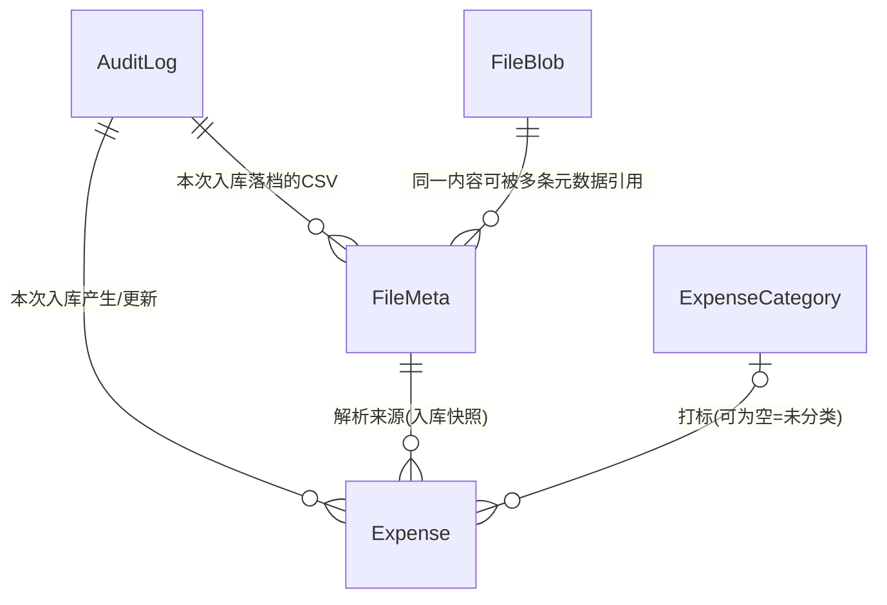

# 对话1 · 重构版功能与模型（推倒重来 · 第一稿）

> 依据来源：本轮 `260911-220830-prompt.md`「对话1」全部 24 条诉求（**唯一权威**）；
> `doc/decisions/记账系统功能与模型.md`（旧终版，8 前提 / 11 域 57 功能 / 5 实体 62 属性）**仅作语言风格与对照基线**，其结论一律不默认继承，逐条重判；
> 历史 commit 与 `2609p0/2609p1` 各轮 answer 按你的要求不作为依据。
> 范围：业务功能、实体、属性、关联关系、业务规则；不涉及技术实现，不写代码与 SQL。
> 规模：**8 条前提 / 10 域 40 项功能 / 5 实体 43 项属性 / 5 组关联 / 7 类审计 / 6 条不变式 / 7 条流程 / 8 项待确认**，另含对新诉求的 **16 处修正 + 8 处风险登记**。

---

## 〇、先说结论：对新诉求本身的 16 处修正与 8 处风险登记

> 你要求「诉求本身不合理、用词不当、有遗漏错误的都要指出」。这一节是本轮最重要的产出，正文各节按修正后的口径书写。

### 0.1 用词（3 处）

| # | 原词 | 问题 | 建议 |
| - | ---- | ---- | ---- |
| 1 | **私钥** | 「私钥」是非对称加密术语（与公钥配对）。此处是**口令派生的对称密钥**，叫私钥会误导技术轮次的选型 | 改称「**主密钥**」；全文口径统一为「口令 → 主密钥 → 整库加密」 |
| 2 | **入账币种 / 入账金额** | 「入账」在银行语境指「资金到账」，与这里的「折算口径」不是一回事；且与本系统的「入库」（数据提交）字形音都接近，容易串 | 建议「**记账币种 / 记账金额**」，或沿用旧版「本位币 / 本位币金额」。**本文暂全程沿用你的原词**，待你定夺（T5） |
| 3 | **登录 / 密码** | 你已明确「没有登录的概念，也没有登录的接口」，再叫登录会让人以为有会话 | 前端动作叫「**解锁**」，服务端只有「**口令校验**」；「密码」统一叫「**口令**」 |

### 0.2 阻断性缺口（7 处，不先定就走不通）

| # | 缺口 | 为什么阻断 | 建议 |
| - | ---- | ---------- | ---- |
| B-1 | **汇率来源未定义** | 「入账币种切换 → 重算折算汇率与入账金额」必须有汇率来源；录入时的汇率初值同样没有来源。新诉求全文未提 | 见 §8.2 三选一，推荐方案②「切换时给一组比率、逐笔乘算」，**零外部依赖** |
| B-2 | **没有删除入口** | 「疑似重复的数据，由人工核查手动删除」——但列表页「不支持编辑」，编辑页是 CSV，只能新增/更新，删不了 | 列表页支持**勾选 + 批量软删除**。删除不是字段编辑，不违背「列表页不可编辑」 |
| B-3 | **版本号没进 CSV** | 「查询转编辑」要按明细ID更新，若 CSV 只带明细ID不带版本号，乐观锁形同虚设 | **明细ID 与 版本号 成对往返**，作为 CSV 的两个只读列 |
| B-4 | **支出类型ID 无对应实体** | 字段表有 `支出类型ID`，但全文没有支出类型实体，这个 ID 指向谁未定义 | 补一个**最小字典实体**（4 属性）；CSV 列承载**类型名称**而非 ID（T4） |
| B-5 | **摊分月数缺下限** | 只写了「默认 1，无上限」。填 0 或负数时，结束月会早于起始月，`摊分结束月 = 起始月 + 月数 − 1` 直接失效 | 约束 **≥ 1** |
| B-6 | **合并展示缺范围口径** | 「与数据库已有数据合并展示」若指全库，数据量一大页面即不可用 | 只拉取**本次待提交行覆盖的支出日期区间**内的未删除明细；「列表转编辑」另设行数上限（T7） |
| B-7 | **认证失败无法留痕** | 审计表在加密库内，口令错时库根本打不开，写不进审计。因此「全部写操作都有操作记录」这条对认证失败天然不成立，也**没有失败锁定能力** | 口径收缩为「**全部能打开数据库的写操作**」；失败只进应用日志（不落库），显式接受无锁定 |

### 0.3 设计优化（6 处，建议采纳）

| # | 事项 | 你的原方案 | 建议 |
| - | ---- | ---------- | ---- |
| C-1 | **改密的原子性** | 「先导出旧库 → 改密 → 出意外就上传旧库回滚」——回滚完全押在用户手上 | 服务端改为「**副本改密 → 用新口令校验能打开 → 原子替换**」，失败则原库原封不动、自动回滚。用户侧的「先下载」降级为二次兜底，而不是唯一兜底 |
| C-2 | **口令校验探针** | 「没有登录接口」 | 「没有登录接口」≠「不能校验口令」。否则用户要等第一个业务请求失败才知道口令错了。提供一个**只读口令校验接口**（打开库读一条元数据即返回），不签发任何会话、不记审计 |
| C-3 | **两份 CSV 都留存** | 「都会有一个 CSV 文件在文件表中」 | 上传的**原件**与提交入库的**最终快照**可能不同（用户在预览页改过）。两条元数据行 + 内容按哈希去重；若两者内容一致则内容表只存一份——这正好是你要的 A/B 拆分的价值 |
| C-4 | **查重退化为单表分组** | 「双向查重」（本次内部 + 与库内） | 既然三种进入方式都要**与库内合并展示在同一张表**，查重就退化为「**同一张表按三要素分组高亮**」，不需要两套比对逻辑。这是本次设计相对旧版最大的一处简化 |
| C-5 | **查询请求带入账币种的用途** | 「全部的请求都带上入账币种」 | 纯查询看似用不上，其实有用：用于判断「**当前选择 ≠ 库内已有**」并给出切换提示。口径取**全库**（因为切换动作本身是全库范围的），不是当前筛选结果 |
| C-6 | **口令强度** | 全文无策略 | 口令即主密钥，**弱口令 = 弱加密**。更换口令时应有最低强度要求（长度 ≥ 12，且不得纯数字或纯字母）；初始口令由系统随机生成，天然合格 |

### 0.4 风险与代价（8 处，登记即可，不需你处理）

| # | 登记项 |
| - | ------ |
| D-1 | **KDF 强度与请求延迟是一对矛盾**：每个请求都要派生一次主密钥，KDF 调强则每请求多出可观延迟，调弱则「口令即密钥」的防护形同虚设。需在技术轮次定档 |
| D-2 | 「服务端内存中也不缓存口令与主密钥」的**准确表述是「不跨请求缓存、不落盘」**——请求处理期间二者必然在内存中，否则无法读写 |
| D-3 | 口令随每个请求传输，**必须走 HTTPS 或只在可信内网暴露**；且任何一个接口都是暴力破解的判别器（oracle），没有会话也就没有任何锁定手段 |
| D-4 | **docker 必须挂载数据卷**。否则容器一重建 = 数据库文件消失 = 系统当作首次启动重新初始化并打印新口令，旧数据全部失去（且因无人持有旧密钥，永久不可读） |
| D-5 | 服务端启动时**没有口令，无法验证已有数据库文件是否可打开**；口令正确性只能在第一个请求时暴露 |
| D-6 | **导出的快照永远不含「本次导出」这条审计**；**导入的审计只能写进导入后的新库**（旧库已被替换） |
| D-7 | 编辑会把明细的 `文件ID` / `审计ID` 覆盖为**最近一次入库**，更早的来源只能从审计列表回溯 |
| D-8 | 方案②下**反复切换入账币种（A→B→A）会累积舍入偏差**，不保证回到原汇率 |

### 0.5 对你两个直接提问的回答

- **「可以通过是否有数据库文件来判断是否是第一次启动？」**——可以，且这是最合适的判据（服务端不存口令，没有第二个可信状态位）。前提是 D-4：文件必须在挂载卷上。
- **「如果某次入账币种切换失败或中断，重试即可？」**——成立，且是天然的。因为筛选条件是 `入账币种 ≠ 目标币种`，已收敛的行会自动被筛掉，重试即续跑，无需任何进度记录（§G-4）。

---

## 一、定位与全局前提（8 条）

个人自用记账系统，**只记支出**，以本系统自有格式的 CSV 为唯一录入形态，核心价值是**明细留存 + 人工去重 + 多币种折算**。

| # | 前提 |
| - | ---- |
| 1 | **单用户、单实例、docker 部署**；数据库文件必须位于挂载的数据卷上 |
| 2 | **口令即主密钥**：SQLite 整库加密（技术选型已定 `github.com/ncruces/go-sqlite3`），主密钥由口令现场派生；代码不写死、服务端不存储、不跨请求缓存、不落盘。**口令丢失 = 数据永久不可读，不设任何找回路径** |
| 3 | **无登录态、无会话、无登录接口**：每个请求自带「口令 + 入账币种」，服务端逐请求「派生主密钥 → 打开库 → 读写 → 关闭」 |
| 4 | **单用户 ⇒ 归属维度整体消失**：无用户实体、无归属字段、无归属校验。**加密本身就是唯一的访问边界**——这与旧版「假定无人能直接读写数据库、应用层是唯一防线」是相反的口径 |
| 5 | **只记支出**，不涉及收入、结余、资产负债；金额以正数为常态，**允许 0 与负数**（退款、冲正），作抵扣而非收入 |
| 6 | **录入只有一条链路**：手动填写等价于「在页面上编辑一份 CSV」，与上传真实 CSV 走同一套页面、同一套校验、同一套提交，两者都在文件表留下 CSV |
| 7 | **记录的存在性单向不可逆**：明细只有软删除（写删除时间，**终态**，无恢复入口，找回一律靠复制新增）；文件与审计不可删除；支出类型仅在零引用时可物理删除 |
| 8 | **审计只留痕、不承载业务**：不提供基于审计的回滚 / 撤销 / 重放入口；「按审计ID筛选明细」是普通查询条件，不是回滚功能 |

---

## 二、功能清单（10 域 40 项）

### A. 口令与加密（6 项）

- **A-1 系统初始化**：启动时若数据卷中**无数据库文件**，即判定首次启动 → 内存生成随机口令 → **打印到日志（仅此一次）** → 以该口令派生主密钥建库并加密 → 写一条「系统初始化」审计。口令与主密钥均不落盘。
- **A-2 初始口令的唯一交付**：日志是唯一交付渠道；进程重启**不重新打印**（服务端已不持有口令）。**错过即无法使用**，唯一出路是删除数据库文件或重装服务重新初始化——旧数据同时永久失去，属设计内的接受项。
- **A-3 逐请求携带口令**：所有接口一律携带「口令 + 入账币种」；服务端每次现场派生主密钥，处理完即丢弃。**无登录、无登出、无令牌、无会话、无超时**。
- **A-4 口令校验（只读探针）**：前端进入主界面前调用一次，给出明确的「口令错误」反馈；不签发任何会话，属读操作、不记审计。口令错与文件损坏在业务层不可区分，统一提示「口令错误或数据库文件损坏」。
- **A-5 更换口令**：等价于更换数据库主密钥，流程见 §10.3。**前置强制**：页面必须先让用户下载当前加密数据库，未下载不允许提交。记一条「更换口令」审计（写入新口令的库中，**不记任何口令值**）。
- **A-6 口令策略**：初始口令系统随机生成；用户自定口令须满足最低强度（长度 ≥ 12，且不得为纯数字或纯字母）。**无失败锁定能力**（§0.2 B-7）。

### B. 数据库导入导出（3 项）

- **B-1 导出加密数据库**：导出**当前加密态**的数据库文件（一致性快照）。文件本身即完整备份，需用导出当时的口令才能打开。
- **B-2 导入加密数据库**：上传一个加密数据库文件，服务端用**本次请求携带的口令**校验能否打开且结构合法，通过才**原子替换**现有数据库。**导入是整库覆盖、不可逆**，页面须二次确认并提示先导出当前库。替换后写一条「数据库导入」审计（落在新库中）。
- **B-3 一对能力覆盖四个场景**：备份、迁移、换机、改密回滚共用 B-1 / B-2，不另建备份模块、不做增量备份。

### C. 审计（3 项）

- **C-1 覆盖范围**：**所有能打开数据库的写操作**各记一条审计，共 **7 类**（枚举见 §8.4）。读操作一律不记（数据导出是否例外见 T3）。
- **C-2 只留痕、不耦合**：审计不提供回滚 / 撤销 / 重放入口；`对象ID` 是**历史指针，不是外键**，指向的对象可能已不存在。
- **C-3 审计查看**：只读列表，按操作类型与时间区间筛选；可跳转到「按审计ID筛选的明细列表」——这是查询能力，不是回滚入口。本页**不承担任何写操作**。

### D. 文件管理（4 项）

- **D-1 元数据与内容两实体拆分**：`FileMeta` 只存元数据（文件名、用途、来源审计），承载列表与追溯等绝大部分查询；`FileBlob` 只存内容，**只在下载与校验时读取**。
- **D-2 内容寻址与天然去重**：`FileBlob` 以**内容哈希**为唯一ID，`FileMeta` 以哈希为外键。同一份内容只存一份；允许多条元数据指向同一内容（不同文件名、不同时间、不同用途）。
- **D-3 完整性校验**：下载时重算内容哈希与主键比对，不一致则告警并阻止下载——这是哈希的第二用途。
- **D-4 文件列表与下载**：按时间、文件名、用途、来源审计筛选并下载。**文件只留存、不删除**，因此内容表不会出现孤儿，无需引用计数（将来若开放删除元数据，必须补引用计数）。

### E. 数据录入（7 项）

- **E-1 系统自有 CSV 契约**：**不适配任何银行的原生格式**，只认本系统定义的列名。按列名匹配、不依赖列顺序；必填列缺失报错、可选列缺失按空、**出现未知列报错**（避免表头错位被静默误读）。详见 §8.6。
- **E-2 手动录入 = 填 CSV**：页面上的表格编辑在语义上就是编辑一份 CSV，提交时同样生成 CSV 快照落库。因此系统**没有「手工录入」与「文件导入」两条链路**，只有一条。
- **E-3 录入编辑页（三种进入方式共用）**：① 上传真实 CSV；② 空白新建；③ 从查询列表页「转编辑」。三者进入后形态完全一致：一张可编辑表格 + 库内相关明细的合并展示。
- **E-4 合并展示与重复高亮**：把本次待提交行与库内明细放进**同一张表**，按「支出日期 + 支出金额 + 支出币种」分组，同组行加框并高亮。库内行**只读、不可编辑、不随本次提交**。拉取范围 = 本次待提交行覆盖的**支出日期区间**内的未删除明细。
- **E-5 明细ID 的四种取值语义**：
  - **空** → 新增，提交时由服务端生成 ID（全新手动创建、CSV 未填 ID 均属此）。
  - **有值且命中库内未删除明细** → 按 ID 更新，走乐观锁（查询转编辑的常规路径）。
  - **有值但命中已删除明细** → **拒绝**（软删除是终态）。若要找回，前端「复制」时必须**清空明细ID**，按新增处理。
  - **有值但库内不存在** → 拒绝（防止人工乱填 ID 产生幽灵记录）。
- **E-6 提交入库**：整批一个事务——落 CSV 快照（及原件）→ 写一条「数据入库」审计 → 按明细ID 新增 / 更新 → 逐行重算派生字段。任一行乐观锁冲突则**整批失败**，提示「数据已落后，请刷新页面重新加载后重做」。
- **E-7 非法输入反馈**：表头不符、必填缺失、日期 / 金额 / 汇率格式错、汇率 ≤ 0、摊分月数 < 1、支出类型名称未匹配、明细ID 非法——**逐行逐列**给出定位明确的错误，不做静默兜底。

### F. 查询与去重（6 项）

- **F-1 明细列表**：分页、排序，顶部筛选区。列表页**不提供字段编辑**。
- **F-2 多维筛选**：支出日期区间、支出币种、入账币种、金额区间、交易对手方（模糊）、交易备注（模糊）、支出类型（多选，空即未分类）、银行名称 / 卡号后四位、来源审计ID、来源文件ID、**是否显示已删除**（默认不显示）。
- **F-3 表格组件复用**：查询页与录入编辑页共用同一套表格与样式；表头可选，默认 10 列、可切全字段平铺（见 §8.3）。
- **F-4 疑似重复高亮**：三要素相同的行加框并高亮，两个页面同一套规则；系统**只标记不阻断**，是否真重复一律人工裁定。
- **F-5 人工去重处置 = 软删除**：列表页支持勾选（含**全选当前筛选结果全集**）后批量软删除；已删除行**跳过、不覆盖其删除时间**；删除前提示「本次将删除 N 笔明细」。记一条「明细删除」审计。
- **F-6 列表转编辑**：把**当前筛选结果**导出为一份 CSV（**必带明细ID与版本号**）送入录入编辑页。为保证页面可用，转编辑行数设上限，超限要求先收窄筛选（T7）。

### G. 币种与入账口径（5 项）

- **G-1 币种枚举内置**：币种为代码内置枚举（代码、名称、小数位数、是否启用），**不落库**，库中只存币种代码。新增币种 = 改代码；枚举项只能停用不能删除（历史明细存着旧代码）。
- **G-2 入账币种逐请求携带**：不落库、不建用户配置实体。**写操作**用它决定新数据的入账口径；**查询**用它判断「当前选择 vs 库内已有」是否一致（§0.3 C-5）。
- **G-3 折算恒等式**：`入账金额 = 支出金额 × 折算汇率`。入账金额是**只读因变量**，无人工指定入口；支出币种 = 入账币种时折算汇率恒为 1；折算汇率恒 > 0。
- **G-4 入账币种切换**：筛选出 `入账币种 ≠ 目标币种` 的**全部明细（含已删除）**，逐笔重算 `折算汇率 / 入账金额 / 入账币种` 三字段（**单笔同事务**）；允许部分失败、可中断、**重试即续跑**（已收敛的行天然被筛掉，无需进度记录）。记一条「入账币种切换」审计。汇率来源见 §8.2。
- **G-5 表头提示**：明细表格的「入账币种」表头展示**全库存在的入账币种集合**；集合元素多于一个、或唯一元素 ≠ 当前选择时，提示用户执行入账币种切换。

### H. 摊分（2 项）

- **H-1 摊分三字段**：`摊分月数`（默认 1，**下限 1**，无上限）+ 派生的 `摊分起始月`（= 支出日期所属月）与 `摊分结束月`（= 起始月 + 摊分月数 − 1）；支出日期或摊分月数变更时同步刷新。
- **H-2 份额不落库、本轮无消费方**：摊分份额不产生额外数据行；**本轮不提供月度统计与摊分口径报表**，三字段目前只做存储与展示，属为后续轮次预留（T2）。

### I. 支出类型（2 项）

- **I-1 类型字典**：单层、名称唯一、用户自建，**只能新建与删除**（不提供改名、不提供停用）；初始为空集。CSV 中以**类型名称**列承载，提交时按名称匹配到 ID，**未匹配报错、不自动建档**（防止错别字把字典撑爆）。记「支出类型维护」审计，摘要必须带类型名称。
- **I-2 删除保护**：被任何明细（**含已软删除**）引用的类型不可删除；零引用时物理删除，删即不可恢复。筛选框与编辑框的类型下拉范围完全一致（全部类型）。

### J. 部署与运维（2 项）

- **J-1 docker 单实例**：容器无状态，全部状态在挂载卷上的数据库文件里；无外部存储、无外部中间件、无出网依赖（前提是汇率取方案②）。
- **J-2 日志口径**：日志中**只有初始化那一次**会出现口令；此后任何日志、任何审计、任何导出都不得出现口令值。

---

## 三、实体关系图

- **无 `User` 实体**——单用户，归属维度整体消失，这是相对旧版最大的结构变化。
- **`Expense` 是唯一的事实实体**：摊分份额、汇率、币种、解析器、用户配置均不建实体。
- **`AuditLog` 是留痕枢纽，但不承载任何业务动作**（前提 8）。
- **`FileBlob` 是全模型唯一的内容寻址表**：主键即内容哈希，天然去重、天然可校验。

---

## 四、逐实体属性（5 实体 43 项）

> 「必填」= 任何记录都必须有确定值；业务上「不适用」的场景以零值表达。
> 属性顺序即 §8.3 全字段平铺的展示顺序。

### 1. Expense 支出明细（21 项 · 核心实体）

| 属性 | 必填 | 可手编 | 说明 |
| ---- | ---- | ------ | ---- |
| 银行名称 | ✗ | ✓ | 未填时留空；本轮 CSV 为系统自有格式，此列纯手填（T8） |
| 卡号后四位 | ✗ | ✓ | 同上 |
| 支出日期 | ✓ | ✓ | 交易发生日；**字面值，无时区换算**；摊分起始月的依据 |
| 支出币种 | ✓ | ✓ | 币种枚举代码 |
| 支出金额 | ✓ | ✓ | 支出币种金额，**允许为 0 / 负**（退款、冲正） |
| 交易对手方 | ✗ | ✓ | 商户或收款方；未给出时留空 |
| 交易备注 | ✗ | ✓ | 账单摘要或用户自填；未给出时留空 |
| 折算汇率 | ✓ | ✓ | 1 单位支出币种可兑换的入账币种数量；支出币种 = 入账币种时取 1；**必须 > 0** |
| 入账币种 | ✓ | ✗ | 币种枚举代码；新增行取请求携带值，**更新既有行时保持库内原值**，口径变更只能走 G-4 |
| 入账金额 | ✓ | ✗ | = 支出金额 × 折算汇率 |
| 支出类型ID | ✗ | ✓ | 打标结果，空即未分类；**CSV 以类型名称承载**，非 ID |
| 摊分月数 | ✓ | ✓ | 默认 1，**下限 1**，无上限 |
| 摊分起始月 | ✓ | ✗ | = 支出日期所属月 |
| 摊分结束月 | ✓ | ✗ | = 起始月 + 摊分月数 − 1 |
| 明细ID | ✓ | ✗ | 唯一标识；**CSV 中为空即新增**，有值即按 ID 更新（四种取值语义见 E-5） |
| 审计ID | ✓ | ✗ | 属于**最近一次**入库；编辑会覆盖（§0.4 D-7） |
| 文件ID | ✓ | ✗ | **最近一次**入库所用的 CSV 快照；编辑会覆盖 |
| 版本号 | ✓ | ✗ | 乐观锁；**CSV 中必须与明细ID成对往返**；冲突时提示数据已落后、刷新重做 |
| 创建时间 | ✓ | ✗ | — |
| 更新时间 | ✓ | ✗ | — |
| 删除时间 | ✗ | ✗ | 有值即已删除（软删除），**终态不可逆**，无恢复入口 |

> 相对你给的字段表，实质变动 4 处：① `折算汇率` 补「> 0」为硬约束；② `摊分月数` 补下限 1（B-5）；③ `支出类型ID` 明确 CSV 以名称承载（B-4）；④ `入账币种` 明确「更新既有行时不变」——否则在混合币种态下编辑一行会悄悄改掉它的口径。

### 2. ExpenseCategory 支出类型（4 项，全部必填）

| 属性 | 说明 |
| ---- | ---- |
| 类型ID | 唯一标识 |
| 名称 | 单层无父子，**全局唯一**；不提供改名 |
| 创建时间 / 更新时间 | — |

> 无状态字段——不提供停用；生命周期只有「新建」与「零引用时物理删除」两态。

### 3. AuditLog 操作审计（8 项，全部必填）

| 属性 | 说明 |
| ---- | ---- |
| 审计ID | 唯一标识，兼「入库批次号」 |
| 操作类型 | 7 类枚举，见 §8.4 |
| 操作对象类型 | 零值 = 无具体对象或为批量操作 |
| 对象ID | 零值 = 同上；**是历史指针，不是外键** |
| 操作摘要 | 人可读描述，如「入库 37 笔（新增 30 / 更新 7），来源 2609.csv」 |
| 变更内容 | 前后值快照；零值 = 非编辑类操作；**一律不记任何口令值** |
| 操作结果 | 成功 / 失败 / 部分成功 |
| 操作时间 | 发生时点 |

> 相对旧版删去 `用户ID`（单用户无归属）与 4 类审计枚举。「部分成功」为新增取值，服务于 G-4 可中断续跑。

### 4. FileMeta 文件元数据（6 项，全部必填）

| 属性 | 说明 |
| ---- | ---- |
| 文件ID | 唯一标识；`Expense.文件ID` 指向它 |
| 内容哈希 | 指向 `FileBlob` 的外键；**多条元数据可指向同一内容** |
| 文件名 | 上传时的原始文件名，或系统为手动录入生成的名字 |
| 用途 | 枚举：**上传原件 / 入库快照**（§0.3 C-3） |
| 审计ID | 在哪次操作中落档——文件与审计双向可查 |
| 创建时间 | — |

### 5. FileBlob 文件内容（4 项，全部必填）

| 属性 | 说明 |
| ---- | ---- |
| 内容哈希 | **主键即唯一ID**；天然去重，同时是完整性校验的基准（D-3） |
| 文件内容 | 原始字节 |
| 文件大小 | 由内容唯一决定，放在内容侧避免同一哈希在多条元数据上出现不一致 |
| 创建时间 | 该内容**首次**入库的时间 |

> 这张表只在下载与校验时读取；文件不删除，因此不会产生孤儿内容。

---

## 五、不落库的五样

1. **币种枚举**（代码内置）：代码、名称、小数位数、是否启用。库中只存币种代码。新增币种 = 改代码。
2. **口令与主密钥**：只在单个请求的处理期间存在于内存，不落盘、不跨请求缓存、不进日志（初始化那一次除外）、不进审计、不进导出。
3. **会话与令牌**：彻底不存在——无登录接口，也就没有可失效的东西。
4. **入账币种的「当前选择」**：逐请求携带，不建用户配置实体（「如无必要勿增实体」）。
5. **摊分份额**：由摊分起止月实时派生，不产生额外数据行。

---

## 六、刻意不建实体（10 项）

| 候选 | 替代方案 |
| ---- | -------- |
| 用户 | 单用户；口令即访问边界 |
| 登录态 / 令牌 | 无会话 |
| 币种 | 代码枚举 + 明细上的币种代码 |
| 汇率 | 明细上的折算汇率数值快照 |
| 用户配置（入账币种 / 语言） | 逐请求携带 |
| 导入批次 | `AuditLog`，一次提交即一条审计、一个可追溯批次 |
| 月度聚合 / 摊分份额 | 明细上的摊分起止月 + 区间穿刺（本轮尚未使用） |
| 解析器档案 | 本轮只有系统自有 CSV 一种格式，无需注册表 |
| 银行卡片档案 | 明细上的银行名称 / 卡号后四位 |
| 录入预览暂存 | 前端会话内临时态，未提交即丢失 |

---

## 七、关联关系（5 组）

| 关系 | 基数 | 约束 |
| ---- | ---- | ---- |
| AuditLog → Expense | 1:N | 一次入库产生或更新的明细；**仅供追溯与筛选，不构成回滚入口** |
| AuditLog → FileMeta | 1:N | 一次入库落档的 CSV（原件 + 快照），双向可查 |
| FileMeta → Expense | 1:N | 明细的来源 CSV 快照；明细必有来源（前提 6） |
| FileBlob → FileMeta | 1:N | 内容寻址；同内容只存一份，允许多条元数据引用 |
| ExpenseCategory → Expense | 1:N，可空 | 打标；空即未分类；**被引用（含已软删明细）的类型不可删除** |

> 币种不产生关联关系——它是值，不是引用。`AuditLog.对象ID` 是历史指针，不构成关联关系。

---

## 八、关键业务规则

### 8.1 折算联动（7 种触发）

`入账金额 = 支出金额 × 折算汇率`——两个自变量由用户维护，入账金额是**只读因变量**。

| 触发 | 折算汇率 | 入账金额 | 入账币种 |
| ---- | -------- | -------- | -------- |
| 改支出金额 | 不变 | 重算 | 不变 |
| 改折算汇率 | 用户值（须 > 0） | 重算 | 不变 |
| 改支出币种 **为 = 入账币种** | **强制置 1** | 重算 | 不变 |
| 改支出币种 **为其他币种** | 不变，**由用户自行修正** | 重算 | 不变 |
| 改支出日期 | **不变** | 不变 | 不变 |
| G-4 入账币种切换 | 按 §8.2 重算 | 重算 | **= 目标币种** |
| 改摊分月数 | — | — | —（仅刷新摊分结束月） |

> **与旧版的关键差异**：旧版「改支出日期 → 重拉该日日汇率」的规则**整条作废**，因为本轮没有自动汇率源（汇率是用户在 CSV 里填的）。这是「简洁」方向必然付出的精度代价，已知并接受。

### 8.2 汇率来源（三选一，**待你定夺 T1**）

| 方案 | 做法 | 优点 | 代价 |
| ---- | ---- | ---- | ---- |
| ① 自动获取日汇率 | 按支出日期向外部接口取汇率 | 精度最高，接近旧版 | 引入外部依赖：出网、第三方接口、失败兜底、重试——把刚砍掉的复杂度全装回来，与「简洁」方向相悖 |
| ② **切换时给比率，逐笔乘算**（**推荐**） | 录入时汇率由用户在 CSV 填；切换时，用户为每个「源入账币种 → 目标币种」给**一个比率**，系统逐笔 `新汇率 = 原汇率 × 比率`；`支出币种 = 目标币种` 的行**强制置 1** | 零外部依赖；**保留用户逐笔填写的汇率差异**；天然可续跑 | 反复切换累积舍入偏差（D-8）；同一源币种的所有行共用一个比率 |
| ③ 切换时按支出币种给汇率 | 用户为每个「支出币种 → 目标币种」给一个汇率，直接覆盖 | 无漂移，最直观 | **抹平**用户逐笔填写的汇率差异——逐笔手填的成果会被一次切换全部冲掉 |

> 推荐②的理由：本系统的汇率本来就是用户逐笔填写的成果，②是唯一既不依赖外网、又不破坏这份成果的方案。`支出币种 = 目标币种` 强制置 1 这一条不能省，否则乘积不会正好等于 1，会破坏 §九.1 的不变式。

### 8.3 表格与高亮

- **默认列（10 列，按此顺序）**：支出日期 / 支出币种 / 支出金额 / 折算汇率 / 入账币种 / 入账金额 / 交易对手方 / 交易备注 / 支出类型 / 摊分月数。
- **全字段模式**：按 §四.1 的顺序平铺全部 21 项。
- **表头可选**：用户自选展示列（该偏好属前端本地状态，不落库）。
- **疑似重复**：「支出日期 + 支出金额 + 支出币种」相同的行归为一组，**加框 + 高亮**。在录入编辑页中，本次待提交行与库内行处在同一张表，**同一套分组规则同时覆盖「本次内部重复」与「与库内重复」**（§0.3 C-4）。

### 8.4 审计枚举（7 类）

| # | 操作类型 | 触发 | 对象类型 / 对象ID |
| - | -------- | ---- | ----------------- |
| 1 | 系统初始化 | A-1 | 零值 |
| 2 | 数据入库 | E-6（新增 + 更新同属此类） | 零值（批量）；摘要记新增 / 更新笔数与来源文件 |
| 3 | 明细删除 | F-5 | 逐笔：`Expense` / 明细ID；批量：零值，摘要记筛选条件与笔数 |
| 4 | 入账币种切换 | G-4 | 零值（批量）；摘要记目标币种与成功 / 失败笔数 |
| 5 | 支出类型维护 | I-1 新建 / 删除 | `ExpenseCategory` / 类型ID；摘要**必须带类型名称** |
| 6 | 更换口令 | A-5 | 零值；**变更内容不记任何口令值** |
| 7 | 数据库导入 | B-2 | 零值；写入被导入的**新库**（D-6） |

**三条边界**：① 读操作一律不记（数据导出是否例外见 T3）；② 任何审计字段都不得出现口令值；③ 审计不提供回滚 / 撤销 / 重放入口（前提 8）。

> 明细的「新增」与「编辑」不单列——一律走「数据入库」，因为本系统的编辑就是一次 CSV 提交。

### 8.5 删除与复制

- **删除**：写 `删除时间` 即已删除，**终态不可逆**；逐笔与批量同此；已删除行**跳过、不覆盖其删除时间**；删除幂等，失败重跑即可。已删除明细**不参与默认列表、不参与 §8.6 的合并展示与查重比对**，但**仍参与 G-4 切换**（因为可经 F-2 筛选查看，展示必须处于统一口径）。
- **复制**：在录入编辑页把已删除行复制为新行时**必须清空明细ID**，其余字段随复制作初值（可改）；提交后生成新明细，挂本次入库的审计ID与文件ID。原已删除行不受影响。

### 8.6 CSV 契约

- 按**列名**匹配，**不依赖列顺序**；必填列缺失报错、可选列缺失按空、**出现未知列报错**。
- `支出类型` 列承载**名称**（非 ID），提交时按名称匹配，未匹配报错、不自动建档。
- `明细ID` 与 `版本号` **成对往返**：全字段导出时必带，导入时用于定位与并发控制。
- 只读列（`入账币种` / `入账金额` / `摊分起始月` / `摊分结束月` / `创建时间` / `更新时间` / `删除时间`）导出时带出便于查看，**导入时一律忽略**，以服务端重算值或库内现值为准。
- 合并展示时，库内行以只读形态并列显示，**不随本次提交**，也不会被 CSV 的内容覆盖。

### 8.7 口令与主密钥

- 口令 → 主密钥的派生在每个请求内现场完成，用完即弃（§五.2）。
- 口令错误 = 数据库打不开，与文件损坏在业务层不可区分，统一提示。
- **更换口令 = 更换主密钥**：副本改密 → 用新口令校验能打开 → 原子替换；失败则原库原封不动（§0.3 C-1）。用户侧「先下载旧库」是二次兜底，不是唯一兜底。
- 导出的数据库文件用**导出当时的口令**打开——改密之后，旧备份仍需旧口令，这是回滚能成立的前提。

---

## 九、必须守住的六条不变式

1. **折算恒等式**：`入账金额 = 支出金额 × 折算汇率` 恒成立，入账金额为只读因变量、任何一次编辑后立即重算；`支出币种 = 入账币种` 时折算汇率恒为 1；折算汇率恒 > 0。
2. **摊分派生**：`摊分起始月 = 支出日期所属月`、`摊分结束月 = 起始月 + 摊分月数 − 1`，`摊分月数 ≥ 1`；支出日期或摊分月数变更时同步刷新。
3. **口令零持久化**：口令与主密钥不落盘、不跨请求缓存、不进日志（初始化那一次除外）、不进审计、不进导出、不进任何错误信息。
4. **记录单向不可逆**：明细只软删且为终态；文件与审计不可删除；支出类型仅在零引用时可物理删。全模型无第二处「删除又恢复」。
5. **审计只留痕**：任何业务动作都不得以审计为入口或依据；「按审计ID筛选」属查询能力，不属回滚功能。
6. **一次提交 = 一条「数据入库」审计 = 一份 CSV 快照**，本批全部明细的 `审计ID` / `文件ID` 一并指向它们。

---

## 十、核心业务流程（7 条）

1. **初始化与首次使用**：启动 → 数据卷无库文件 → 生成随机口令 → **打印日志** → 建库加密 → 写「系统初始化」审计 → 用户从日志取口令 → 页面解锁 → 直接可用（无首登改密强制，因为初始口令本就是强随机）。
2. **每一次请求**：携带「口令 + 入账币种」→ 派生主密钥 → 打开库 → 校验 / 读写 → 关库、丢弃密钥。失败一律返回「口令错误或数据库文件损坏」。
3. **更换口令**：页面强制先下载当前加密数据库 → 提交新口令（校验强度）→ 服务端副本改密 → 用新口令校验可打开 → 原子替换 → 写「更换口令」审计 → 前端以新口令重新解锁。任一步失败则原库不动；极端情况下用刚下载的旧库经 B-2 导入回滚。
4. **数据录入**：三种进入方式（上传 CSV / 空白新建 / 列表转编辑）→ 同一张编辑表格 → 按日期区间拉取库内明细合并展示 → 三要素分组加框高亮 → 人工增删改行、取消重复行 → 提交 → 落 CSV（原件 + 快照）→ 写「数据入库」审计 → 按明细ID 新增 / 更新 → 重算派生字段。整批一个事务，乐观锁冲突则整批失败。
5. **人工去重**：列表页筛选定位 → 高亮框识别三要素相同的行 → 人工裁定 → 勾选（或全选筛选结果）→ 批量软删除 → 写「明细删除」审计。
6. **入账币种切换**：表头提示存在多种入账币种 → 用户选目标币种并按 §8.2 方案②提供比率 → 筛选 `入账币种 ≠ 目标` 的全部明细（含已删除）→ 逐笔单事务重算三字段 → 写一条审计（成功 / 部分成功）。中断或失败后重试即续跑。
7. **备份与迁移**：随时 B-1 导出加密库文件 → 换机 / 回滚时 B-2 上传并以对应口令校验 → 原子替换 → 写「数据库导入」审计（落新库）。

---

## 十一、待确认（8 项）

| 编号 | 问题 | 推荐 |
| ---- | ---- | ---- |
| T1 | **汇率来源**：§8.2 三选一 | **方案②**（切换时给比率、逐笔乘算，零外部依赖） |
| T2 | **摊分三字段本轮无消费方**（未提月度统计）：保留预留，还是本轮一并砍掉？ | 保留。三个字段成本极低，砍掉后将来补要改数据 |
| T3 | **数据导出 / 数据库导出是否记审计**：按「只记写操作」应不记，但导出是数据外流的高风险动作 | **记**，并接受「导出的快照不含这条」（D-6） |
| T4 | **支出类型**：最小字典实体（4 属性），还是直接在明细上存名称字符串（零实体）？ | **字典实体**。CSV 自由文本会因错别字把分类打散，字典 + 严格匹配才能收住 |
| T5 | **「入账币种 / 入账金额」正式用词**（§0.1） | 「记账币种 / 记账金额」 |
| T6 | **前端如何持有口令**（刷新是否需重输） | sessionStorage，关闭标签即失效；并在页面上明示 XSS 风险 |
| T7 | **「列表转编辑」的行数上限**取值 | 需要你给一个量级（数百 / 数千），我按它定交互 |
| T8 | **是否保留「银行名称 / 卡号后四位」**：本轮 CSV 是系统自有格式、不解析银行原生账单，这两列变成纯手填 | 保留。成本为零，且是筛选维度；将来接银行原生格式时正好复用 |

> 旧版的 T4「自动打标判定方式」在新诉求中未提及，本轮**继续挂起**：`支出类型ID` 只能手填，不建打标规则实体。

---

## 十二、交付说明

- **交付物**：本节即对话1 的完整设计——对新诉求的 16 处修正与 8 处风险登记、8 条前提、10 域 **40 项**功能、1 张实体关系图、5 实体 **43 项**属性、5 样不落库设计、10 项不建实体、5 组关联关系、7 类审计枚举、6 条不变式、7 条核心流程、8 项待确认。
- **规模**：`Expense` 21、`ExpenseCategory` 4、`AuditLog` 8、`FileMeta` 6、`FileBlob` 4。
- **相对旧版终版（8 前提 / 11 域 57 功能 / 5 实体 62 属性）的变化**：
  - **实体 5 → 5，但构成全变**：删 `User`，`File` 拆为 `FileMeta` + `FileBlob`；**属性 62 → 43**；**功能 57 → 40**；**审计枚举 11 → 7**。
  - **整块删除**：多用户与权限、归属校验、登录态 / 令牌 / 锁定 / 强制改密、多语言、月度统计（旧 J 域 6 项）、解析器插件化与银行原生格式适配、自动汇率获取、明细导出。
  - **整块新增**：整库加密与「口令即主密钥」、数据库导入导出、更换口令、文件内容寻址拆表、CSV 单链路录入、入账币种切换、乐观锁版本号。
  - **口径反转 3 处**：① 明文存储 + 应用层唯一防线 → **整库加密 + 加密即唯一边界**；② 本位币是用户配置 → **入账币种逐请求携带、不落库**；③ 编辑走单行表单 + 单笔查重 → **编辑走 CSV 批量 upsert + 同表分组高亮**。
- **未做**：字段类型与长度、索引、加密算法与 KDF 参数、二进制存储形态、原子替换的实现方式、任何 SQL 与代码——均属技术实现，留待技术方案轮次。
- **校验方式**：
  ① 功能点算：6+3+3+4+7+6+5+2+2+2 = **40**；
  ② 属性点算：21+4+8+6+4 = **43**；
  ③ 正向逐条走 40 项功能，确认每项所需数据都有属性落点，无悬空功能；
  ④ 反向逐条走 43 项属性，确认均可追溯到功能编号（`摊分起始月 / 结束月` 本轮只到展示，已登记 T2）；
  ⑤ 新诉求 24 条逐条核销，确认全部落入正文、§〇 修正表或待确认，无遗漏；
  ⑥ 7 类审计与全部写操作双向对齐，确认无「回滚 / 撤销」残留（前提 8）；
  ⑦ 三种录入进入方式 × 明细ID 四种取值（空 / 命中未删 / 命中已删 / 不存在）共 12 种组合逐一走查，行为与 E-5 一致；
  ⑧ 已删除明细在 F-2 / F-5 / E-4 / G-4 / §8.5 五处的行为交叉核验，确认「只读 + 可查看 + 可复制新增 + 参与切换 + 不参与查重」互不抵触。
